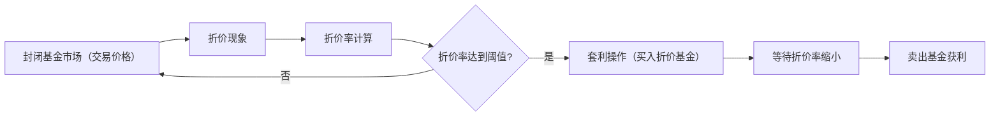

# 查尔斯·布兰德的封闭基金折价套利技巧

> 关键词：查尔斯·布兰德、封闭基金、折价套利、套利技巧、金融投资

> 摘要：本文围绕查尔斯·布兰德的封闭基金折价套利技巧展开深入探讨。首先介绍了封闭基金折价套利相关的背景知识，包括目的、预期读者、文档结构和术语表。接着阐述了封闭基金折价的核心概念以及其内在联系，给出了原理和架构的示意图与流程图。详细讲解了核心算法原理，并通过Python源代码进行具体操作步骤的说明。对涉及的数学模型和公式进行了推导和举例。通过项目实战展示了代码实现和解读。分析了封闭基金折价套利在实际中的应用场景，推荐了相关的学习资源、开发工具框架和论文著作。最后总结了该套利技巧的未来发展趋势与挑战，还设置了附录解答常见问题，并提供了扩展阅读和参考资料，旨在为投资者深入理解和运用封闭基金折价套利技巧提供全面的指导。

## 1. 背景介绍 
### 1.1 目的和范围
封闭基金折价套利一直是金融投资领域中备受关注的策略。查尔斯·布兰德在这方面有着独特的见解和实用的技巧。本文的目的在于深入剖析查尔斯·布兰德的封闭基金折价套利技巧，将其系统化、理论化，为投资者提供清晰的操作思路和方法。范围涵盖了封闭基金折价的基本概念、套利的核心算法、数学模型、实际案例以及相关的工具和资源推荐等方面。

### 1.2 预期读者
本文预期读者主要包括金融投资领域的从业者，如基金经理、投资顾问等，他们可以从本文中获取新的投资策略和方法，优化投资组合。同时，也适合对金融投资有一定了解并希望进一步深入学习封闭基金折价套利的个人投资者，帮助他们在实际投资中做出更明智的决策。此外，金融专业的学生和研究人员也可以将本文作为研究封闭基金折价套利的参考资料。

### 1.3 文档结构概述
本文将按照以下结构进行阐述：首先介绍封闭基金折价套利相关的背景知识，包括目的、读者、结构和术语。接着详细讲解核心概念和它们之间的联系，并通过示意图和流程图直观展示。然后阐述核心算法原理，用Python代码实现具体操作步骤。对涉及的数学模型和公式进行推导和举例说明。通过项目实战展示代码实现和解读。分析实际应用场景，推荐相关的学习资源、开发工具框架和论文著作。最后总结未来发展趋势与挑战，设置附录解答常见问题，并提供扩展阅读和参考资料。

### 1.4 术语表
#### 1.4.1 核心术语定义
- **封闭基金**：指在设立时确定基金规模，并在一定期限内基金规模固定不变的投资基金。投资者在基金存续期间不能向基金公司赎回基金份额，只能在二级市场上进行交易。
- **基金折价**：封闭基金的市场交易价格低于其单位净值的现象。折价率计算公式为：$折价率 = \frac{单位净值 - 市场价格}{单位净值} \times 100\%$。
- **套利**：指利用不同市场或不同形式的同类或相似金融产品的价格差异牟利。在封闭基金折价套利中，就是利用封闭基金的折价现象获取利润。

#### 1.4.2 相关概念解释
- **单位净值**：是指当前的基金总净资产除以基金总份额，它反映了基金的实际价值。
- **二级市场**：是证券交易市场，投资者可以在该市场上买卖已发行的证券，如封闭基金。

#### 1.4.3 缩略词列表
- **NAV**：Net Asset Value，即基金单位净值。

## 2. 核心概念与联系 
### 核心概念原理
封闭基金折价的原理主要源于市场供需关系、投资者情绪和基金的流动性等因素。一方面，由于封闭基金在存续期内不能赎回，投资者的退出只能通过二级市场交易，这导致其流动性相对较差，投资者为了补偿流动性风险，会要求较低的交易价格，从而形成折价。另一方面，市场情绪也会对封闭基金的价格产生影响。当市场整体悲观时，投资者可能会过度抛售封闭基金，导致其价格进一步下跌，折价率扩大。

而套利的原理是基于价格的回归。从长期来看，封闭基金的市场价格有向其单位净值回归的趋势。当折价率达到一定程度时，投资者可以通过买入折价的封闭基金，等待折价率缩小甚至消失，从而获得价差收益。

### 架构的文本示意图
```plaintext
封闭基金折价套利架构

               +----------------+
               | 封闭基金市场   |
               | （交易价格）   |
               +----------------+
                      |
                      | 折价现象
                      v
               +----------------+
               | 折价率计算     |
               | （单位净值 - 交易价格）/ 单位净值 |
               +----------------+
                      |
                      | 折价率达到阈值
                      v
               +----------------+
               | 套利操作       |
               | 买入折价基金   |
               +----------------+
                      |
                      | 等待折价率缩小
                      v
               +----------------+
               | 卖出基金获利   |
               +----------------+
```

### Mermaid 流程图


## 3. 核心算法原理 & 具体操作步骤 
### 核心算法原理
查尔斯·布兰德的封闭基金折价套利核心算法原理主要基于对折价率的监测和判断。通过实时计算封闭基金的折价率，并与设定的阈值进行比较。当折价率超过阈值时，认为存在套利机会，此时进行买入操作。在持有一段时间后，当折价率缩小到一定程度或者达到预期目标时，进行卖出操作，实现套利收益。

### 具体操作步骤
1. **数据获取**：获取封闭基金的单位净值和市场交易价格数据。可以通过金融数据提供商、基金公司官网等渠道获取。
2. **折价率计算**：根据获取的数据，使用公式 $折价率 = \frac{单位净值 - 市场价格}{单位净值} \times 100\%$ 计算折价率。
3. **阈值设定**：根据历史数据和市场情况，设定一个合理的折价率阈值。当折价率超过该阈值时，认为存在套利机会。
4. **买入操作**：当折价率超过阈值时，使用资金买入相应的封闭基金。
5. **持有与监测**：持有买入的封闭基金，并持续监测折价率的变化。
6. **卖出操作**：当折价率缩小到一定程度或者达到预期目标时，卖出持有的封闭基金，实现套利收益。

### Python源代码实现
```python
import pandas as pd

# 模拟获取封闭基金的单位净值和市场价格数据
def get_fund_data():
    # 这里简单模拟数据，实际应用中需要从真实数据源获取
    dates = pd.date_range(start='2023-01-01', end='2023-12-31', freq='D')
    nav = pd.Series([1.0 + i * 0.01 for i in range(len(dates))], index=dates)
    market_price = pd.Series([0.9 + i * 0.008 for i in range(len(dates))], index=dates)
    return nav, market_price

# 计算折价率
def calculate_discount_rate(nav, market_price):
    return ((nav - market_price) / nav) * 100

# 套利操作
def arbitrage(nav, market_price, threshold=10):
    discount_rate = calculate_discount_rate(nav, market_price)
    buy_dates = []
    sell_dates = []
    holding = False
    for date in discount_rate.index:
        if not holding and discount_rate[date] > threshold:
            # 买入操作
            buy_dates.append(date)
            holding = True
        elif holding and discount_rate[date] < threshold / 2:
            # 卖出操作
            sell_dates.append(date)
            holding = False
    return buy_dates, sell_dates

# 主函数
def main():
    nav, market_price = get_fund_data()
    buy_dates, sell_dates = arbitrage(nav, market_price)
    print("买入日期:", buy_dates)
    print("卖出日期:", sell_dates)

if __name__ == "__main__":
    main()
```

### 代码解释
1. **get_fund_data 函数**：模拟获取封闭基金的单位净值和市场价格数据。实际应用中，需要从真实的金融数据提供商获取数据。
2. **calculate_discount_rate 函数**：根据单位净值和市场价格计算折价率。
3. **arbitrage 函数**：实现套利操作。通过比较折价率和设定的阈值，决定是否进行买入和卖出操作。
4. **main 函数**：调用上述函数，获取数据并进行套利操作，最后打印买入和卖出日期。

## 4. 数学模型和公式 & 详细讲解 & 举例说明 
### 数学模型和公式
#### 折价率计算公式
$折价率 = \frac{单位净值 - 市场价格}{单位净值} \times 100\%$

#### 套利收益计算公式
$套利收益 = （卖出价格 - 买入价格）\times 买入份额 - 交易成本$

### 详细讲解
- **折价率计算公式**：该公式用于衡量封闭基金的折价程度。折价率越高，说明基金的市场价格相对于单位净值越低，潜在的套利空间越大。
- **套利收益计算公式**：该公式计算了套利操作的实际收益。卖出价格和买入价格分别为卖出和买入封闭基金时的市场价格，买入份额为买入的基金数量，交易成本包括佣金、印花税等。

### 举例说明
假设某封闭基金的单位净值为 $1.2$ 元，市场价格为 $1.0$ 元。
1. **计算折价率**
根据折价率计算公式：
$折价率 = \frac{1.2 - 1.0}{1.2} \times 100\% \approx 16.67\%$

这意味着该封闭基金的市场价格相对于单位净值折价约 $16.67\%$，存在一定的套利机会。

2. **计算套利收益**
假设投资者以 $1.0$ 元的价格买入 $1000$ 份该封闭基金，交易成本为 $5$ 元。一段时间后，基金的市场价格上涨到 $1.1$ 元，投资者卖出该基金，交易成本同样为 $5$ 元。
买入成本 = $1.0 \times 1000 + 5 = 1005$ 元
卖出收入 = $1.1 \times 1000 - 5 = 1095$ 元
套利收益 = $1095 - 1005 = 90$ 元

## 5. 项目实战：代码实际案例和详细解释说明 
### 5.1  开发环境搭建
#### 编程语言和版本
选择 Python 作为开发语言，建议使用 Python 3.7 及以上版本。Python 具有丰富的科学计算和数据分析库，适合用于金融数据处理和套利策略开发。

#### 安装必要的库
使用 `pip` 安装以下必要的库：
- `pandas`：用于数据处理和分析。
- `numpy`：用于数值计算。

```bash
pip install pandas numpy
```

### 5.2  源代码详细实现和代码解读
```python
import pandas as pd
import numpy as np

# 从 CSV 文件中读取封闭基金数据
def read_fund_data(file_path):
    data = pd.read_csv(file_path)
    data['date'] = pd.to_datetime(data['date'])
    data.set_index('date', inplace=True)
    return data

# 计算折价率
def calculate_discount_rate(data):
    data['discount_rate'] = ((data['nav'] - data['market_price']) / data['nav']) * 100
    return data

# 套利操作
def arbitrage(data, threshold=10):
    buy_signals = []
    sell_signals = []
    holding = False
    for i in range(len(data)):
        if not holding and data['discount_rate'].iloc[i] > threshold:
            # 买入信号
            buy_signals.append(data.index[i])
            holding = True
        elif holding and data['discount_rate'].iloc[i] < threshold / 2:
            # 卖出信号
            sell_signals.append(data.index[i])
            holding = False
    return buy_signals, sell_signals

# 计算套利收益
def calculate_profit(data, buy_signals, sell_signals):
    total_profit = 0
    for i in range(len(buy_signals)):
        buy_price = data.loc[buy_signals[i], 'market_price']
        sell_price = data.loc[sell_signals[i], 'market_price']
        profit = sell_price - buy_price
        total_profit += profit
    return total_profit

# 主函数
def main():
    file_path = 'fund_data.csv'
    data = read_fund_data(file_path)
    data = calculate_discount_rate(data)
    buy_signals, sell_signals = arbitrage(data)
    total_profit = calculate_profit(data, buy_signals, sell_signals)
    print("买入信号日期:", buy_signals)
    print("卖出信号日期:", sell_signals)
    print("总套利收益:", total_profit)

if __name__ == "__main__":
    main()
```

### 代码解读与分析
1. **read_fund_data 函数**：从 CSV 文件中读取封闭基金的单位净值和市场价格数据，并将日期列转换为日期时间类型，设置为索引。
2. **calculate_discount_rate 函数**：根据单位净值和市场价格计算折价率，并将结果添加到数据框中。
3. **arbitrage 函数**：实现套利操作。通过比较折价率和设定的阈值，生成买入和卖出信号。
4. **calculate_profit 函数**：根据买入和卖出信号，计算套利收益。
5. **main 函数**：调用上述函数，读取数据，计算折价率，进行套利操作，计算套利收益，并打印结果。

## 6. 实际应用场景 
### 个人投资者
个人投资者可以利用封闭基金折价套利技巧，在市场上寻找折价率较高的封闭基金进行投资。通过长期持有，等待折价率缩小，获取价差收益。例如，个人投资者可以将一部分资金配置到折价率较高的封闭基金中，作为一种长期投资策略。

### 机构投资者
机构投资者，如基金公司、保险公司等，可以利用封闭基金折价套利技巧优化投资组合。通过大规模的套利操作，获取稳定的收益。例如，基金公司可以在资产配置中适当增加折价封闭基金的比例，提高投资组合的收益率。

### 对冲基金
对冲基金可以利用封闭基金折价套利技巧进行对冲操作。通过同时买入折价的封闭基金和卖空相关的金融产品，降低市场风险，获取稳定的套利收益。例如，对冲基金可以买入折价的封闭基金，同时卖空相关的指数期货，以对冲市场波动的风险。

## 7. 工具和资源推荐
### 7.1 学习资源推荐
#### 7.1.1 书籍推荐
- 《金融市场与金融机构》：全面介绍了金融市场的各种金融工具和金融机构的运作，对于理解封闭基金和套利操作有很大的帮助。
- 《聪明的投资者》：价值投资的经典著作，其中包含了很多关于投资策略和风险管理的内容，对封闭基金折价套利有一定的指导意义。

#### 7.1.2 在线课程
- Coursera 上的《金融市场》课程：由知名教授授课，系统地介绍了金融市场的理论和实践，包括封闭基金的相关知识。
- 网易云课堂上的《量化投资入门》课程：介绍了量化投资的基本概念和方法，对于学习封闭基金折价套利的量化分析有很大的帮助。

#### 7.1.3 技术博客和网站
- 雪球网：提供了丰富的金融投资信息和交流平台，投资者可以在上面了解封闭基金的折价情况和其他投资者的观点。
- 东方财富网：国内知名的金融信息网站，提供了全面的基金数据和分析工具，方便投资者进行封闭基金的研究和分析。

### 7.2 开发工具框架推荐
#### 7.2.1 IDE和编辑器
- PyCharm：功能强大的 Python 集成开发环境，提供了代码编辑、调试、版本控制等一系列功能，适合开发封闭基金折价套利的 Python 程序。
- Jupyter Notebook：交互式的开发环境，适合进行数据分析和模型验证。可以方便地展示代码和运行结果，便于进行研究和实验。

#### 7.2.2 调试和性能分析工具
- pdb：Python 内置的调试工具，可以帮助开发者定位代码中的问题。
- cProfile：Python 内置的性能分析工具，可以分析代码的运行时间和函数调用情况，帮助开发者优化代码性能。

#### 7.2.3 相关框架和库
- Pandas：用于数据处理和分析的 Python 库，提供了丰富的数据结构和数据处理方法，适合处理封闭基金的历史数据。
- Numpy：用于数值计算的 Python 库，提供了高效的数组和矩阵运算功能，对于计算折价率和套利收益等数值计算非常有用。

### 7.3 相关论文著作推荐
#### 7.3.1 经典论文
- “The Closed-End Fund Puzzle: A Survey”：对封闭基金折价之谜进行了全面的综述，分析了封闭基金折价的原因和影响因素。
- “Arbitrage in Financial Markets”：探讨了金融市场中的套利机制和套利策略，对于理解封闭基金折价套利有重要的参考价值。

#### 7.3.2 最新研究成果
- 可以关注《Journal of Finance》、《Review of Financial Studies》等顶级金融学术期刊，获取关于封闭基金折价套利的最新研究成果。

#### 7.3.3 应用案例分析
- 一些金融研究机构和咨询公司会发布关于封闭基金折价套利的应用案例分析报告，可以通过这些报告了解实际应用中的经验和教训。

## 8. 总结：未来发展趋势与挑战
### 未来发展趋势
- **量化交易的应用**：随着金融科技的发展，量化交易将在封闭基金折价套利中得到更广泛的应用。通过使用大数据、人工智能等技术，可以更准确地分析市场数据，发现套利机会，提高套利效率。
- **跨市场套利**：未来，封闭基金折价套利可能会从单一市场扩展到跨市场套利。投资者可以利用不同市场之间的价格差异，进行更复杂的套利操作，获取更高的收益。
- **产品创新**：基金公司可能会推出更多与封闭基金折价套利相关的金融产品，满足投资者的不同需求。例如，开发专门的封闭基金折价套利基金，为投资者提供更便捷的投资渠道。

### 挑战
- **市场有效性增强**：随着市场的发展和投资者的成熟，市场有效性可能会逐渐增强，封闭基金的折价现象可能会减少，套利机会也会相应减少。投资者需要更加敏锐地捕捉市场变化，寻找新的套利机会。
- **政策风险**：金融市场受到政策的影响较大，封闭基金折价套利也不例外。政策的变化可能会影响封闭基金的发行、交易和赎回等环节，从而增加套利的风险。投资者需要密切关注政策动态，及时调整投资策略。
- **技术和数据安全**：量化交易和大数据分析依赖于先进的技术和大量的数据，技术和数据安全问题成为了一个重要的挑战。投资者需要采取有效的措施，保障技术系统的稳定运行和数据的安全。

## 9. 附录：常见问题与解答
### 问题 1：封闭基金折价一定会回归吗？
答：虽然从长期来看，封闭基金的市场价格有向其单位净值回归的趋势，但并不是所有的折价都会回归。市场情况是复杂多变的，受到多种因素的影响，如基金的业绩表现、市场情绪、宏观经济环境等。因此，投资者在进行封闭基金折价套利时，需要综合考虑各种因素，做好风险控制。

### 问题 2：如何确定合理的折价率阈值？
答：确定合理的折价率阈值需要考虑多个因素，如历史折价率水平、市场整体情况、基金的特点等。一般来说，可以通过分析历史数据，找出折价率的波动范围和均值，以此作为参考。同时，还需要结合当前的市场情况和基金的具体情况进行调整。例如，在市场行情较好时，阈值可以适当提高；而在市场行情较差时，阈值可以适当降低。

### 问题 3：封闭基金折价套利有哪些风险？
答：封闭基金折价套利主要存在以下风险：
- **市场风险**：市场价格波动可能导致折价率进一步扩大，从而使投资者遭受损失。
- **流动性风险**：封闭基金在二级市场的交易流动性可能较差，投资者在买入和卖出时可能会遇到困难。
- **基金业绩风险**：如果基金的业绩表现不佳，单位净值可能会下降，从而影响套利收益。
- **政策风险**：政策的变化可能会影响封闭基金的发行、交易和赎回等环节，增加套利的风险。

## 10. 扩展阅读 & 参考资料
### 扩展阅读
- 《金融炼金术》：乔治·索罗斯的著作，介绍了他的投资哲学和方法，对于理解金融市场的波动和套利机会有一定的启发。
- 《漫步华尔街》：探讨了股票市场的有效性和投资策略，对于投资者制定合理的投资计划有很大的帮助。

### 参考资料
- 相关金融数据提供商的网站，如 Wind 资讯、Choice 数据等，获取封闭基金的历史数据和实时数据。
- 基金公司的官网，了解封闭基金的产品信息和业绩表现。
- 金融学术期刊和研究报告，获取关于封闭基金折价套利的最新研究成果和理论分析。

作者：AI天才研究院/AI Genius Institute & 禅与计算机程序设计艺术 /Zen And The Art of Computer Programming