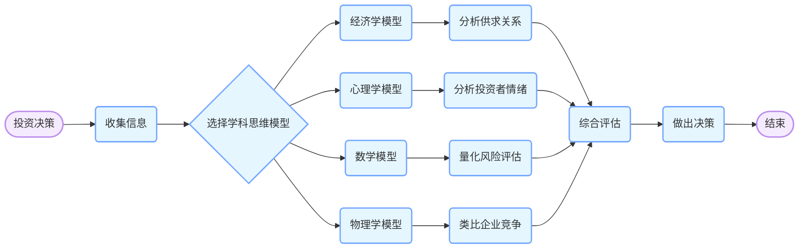

# 查理芒格的多元思维模型：价值投资的跨学科应用

> 关键词：查理芒格、多元思维模型、价值投资、跨学科应用、投资决策

> 摘要：本文深入探讨查理芒格的多元思维模型在价值投资领域的跨学科应用。通过阐述多元思维模型的背景、核心概念、算法原理、数学模型等内容，结合实际案例分析其在投资中的具体运用，介绍相关的工具和资源，最后对其未来发展趋势与挑战进行总结，旨在帮助投资者更好地理解和运用多元思维模型进行价值投资决策。

## 1. 背景介绍 
### 1.1 目的和范围
查理芒格作为投资界的传奇人物，他所倡导的多元思维模型对价值投资产生了深远影响。本文的目的在于全面剖析多元思维模型的内涵、原理以及其在价值投资中的跨学科应用方式。范围涵盖从多元思维模型的理论基础到实际投资案例的分析，以及相关工具资源的介绍等多个方面，旨在为投资者提供一个系统的学习和应用框架。
### 1.2 预期读者
本文预期读者包括对价值投资感兴趣的投资者、金融从业者、经济领域的研究人员以及对跨学科思维有探索欲望的学习者。无论你是投资新手还是有一定经验的专业人士，都能从本文中获取有价值的信息和启发。
### 1.3 文档结构概述
本文首先介绍查理芒格多元思维模型的背景信息，包括目的、读者群体和文档结构等。接着阐述核心概念与联系，展示其原理和架构。然后深入讲解核心算法原理及具体操作步骤，通过Python代码进行说明。之后介绍数学模型和公式，并举例说明。再通过项目实战展示代码案例及详细解释。随后探讨实际应用场景，推荐相关工具和资源。最后总结未来发展趋势与挑战，提供常见问题解答和扩展阅读参考资料。
### 1.4 术语表
#### 1.4.1 核心术语定义
- **多元思维模型**：查理芒格提出的一种思考方式，主张从多个不同学科的角度去分析和解决问题，将不同学科的知识和方法融合在一起，以形成更全面、深入的认识。
- **价值投资**：一种投资策略，强调通过对企业内在价值的评估，寻找价格低于其内在价值的投资标的，以获取长期的投资回报。
#### 1.4.2 相关概念解释
- **跨学科应用**：将不同学科的理论、方法和工具应用到同一个问题或领域中，打破学科界限，实现知识的融合和创新。
- **投资决策**：投资者在面对各种投资机会时，根据自身的投资目标、风险承受能力等因素，选择合适的投资标的和投资方式的过程。
#### 1.4.3 缩略词列表
本文暂无缩略词。

## 2. 核心概念与联系 
查理芒格的多元思维模型强调要掌握多个重要学科的核心原理，并将这些原理应用到投资决策中。其核心思想是通过跨学科的视角来更全面地理解投资对象，避免单一学科思维的局限性。

### 核心概念原理
多元思维模型的原理基于人类认知的局限性。单一学科的思维方式往往只能从一个特定的角度看待问题，容易忽略其他重要因素。而通过融合多个学科的知识，如经济学、心理学、数学、物理学等，可以形成一个更完整的思维框架。例如，经济学可以帮助我们理解市场的供求关系和价格波动；心理学可以解释投资者的行为和情绪对市场的影响；数学可以用于量化分析和风险评估；物理学的原理可以类比到企业的发展和竞争等方面。

### 架构的文本示意图
多元思维模型的架构可以看作是一个由多个学科知识节点组成的网络。每个学科知识节点都代表着一个重要的思维模型，这些节点之间相互连接、相互影响。在进行投资决策时，投资者需要从这个网络中提取相关的思维模型，并将它们组合起来，以全面地分析投资对象。

### Mermaid 流程图


## 3. 核心算法原理 & 具体操作步骤 
### 核心算法原理
多元思维模型的核心算法原理可以类比为一个信息融合和决策优化的过程。在投资决策中，我们首先收集与投资对象相关的各种信息，然后从不同学科的思维模型中提取与这些信息相关的分析方法和判断标准。接着，将这些方法和标准应用到信息分析中，得到各个学科角度的评估结果。最后，通过综合这些评估结果，进行决策优化，选择最优的投资方案。

### 具体操作步骤
以下是使用Python代码模拟多元思维模型在投资决策中的具体操作步骤：

```python
# 步骤1：收集信息
# 假设我们已经收集到了投资对象的相关信息，用一个字典表示
investment_info = {
    "market_demand": 1000,  # 市场需求
    "production_cost": 50,  # 生产成本
    "investor_sentiment": 0.8,  # 投资者情绪指数
    "competition_level": 3  # 竞争水平
}

# 步骤2：定义不同学科的思维模型函数

# 经济学模型：计算利润
def economics_model(info):
    market_demand = info["market_demand"]
    production_cost = info["production_cost"]
    price = 100  # 假设产品价格为100
    profit = (price - production_cost) * market_demand
    return profit

# 心理学模型：根据投资者情绪调整预期收益
def psychology_model(info):
    investor_sentiment = info["investor_sentiment"]
    base_return = 10000  # 假设基础预期收益为10000
    adjusted_return = base_return * investor_sentiment
    return adjusted_return

# 数学模型：计算风险系数
def math_model(info):
    competition_level = info["competition_level"]
    risk_factor = competition_level * 0.1  # 简单的风险系数计算
    return risk_factor

# 步骤3：应用思维模型进行分析
economics_result = economics_model(investment_info)
psychology_result = psychology_model(investment_info)
math_result = math_model(investment_info)

# 步骤4：综合评估
# 假设我们给各个学科的结果分配不同的权重
economics_weight = 0.4
psychology_weight = 0.3
math_weight = 0.3

# 综合得分计算
composite_score = (economics_result * economics_weight) + (psychology_result * psychology_weight) - (math_result * 1000)  # 风险系数乘以1000进行调整

# 步骤5：做出决策
if composite_score > 5000:
    decision = "投资"
else:
    decision = "不投资"

print(f"经济学模型结果: {economics_result}")
print(f"心理学模型结果: {psychology_result}")
print(f"数学模型结果: {math_result}")
print(f"综合得分: {composite_score}")
print(f"决策结果: {decision}")
```

### 代码解释
- **收集信息**：使用一个字典`investment_info`来存储投资对象的相关信息，包括市场需求、生产成本、投资者情绪指数和竞争水平等。
- **定义思维模型函数**：分别定义了经济学模型、心理学模型和数学模型的函数，每个函数根据输入的信息进行相应的计算。
- **应用思维模型进行分析**：调用各个思维模型函数，得到相应的分析结果。
- **综合评估**：给各个学科的结果分配不同的权重，计算综合得分。
- **做出决策**：根据综合得分的大小，决定是否进行投资。

## 4. 数学模型和公式 & 详细讲解 & 举例说明 
### 数学模型和公式
在多元思维模型的投资决策中，涉及到多个数学模型和公式。以下是一些常见的例子：

#### 利润计算公式
利润 $P$ 可以通过以下公式计算：
$$P = (p - c) \times d$$
其中，$p$ 表示产品价格，$c$ 表示生产成本，$d$ 表示市场需求。

#### 风险系数计算公式
风险系数 $R$ 可以根据竞争水平 $C$ 进行计算：
$$R = C \times k$$
其中，$k$ 是一个风险系数调整因子。

#### 综合得分计算公式
综合得分 $S$ 可以通过各个学科评估结果的加权求和得到：
$$S = w_1 \times E + w_2 \times P - w_3 \times R$$
其中，$w_1$、$w_2$、$w_3$ 分别是经济学、心理学、数学模型结果的权重，$E$ 是经济学模型结果，$P$ 是心理学模型结果，$R$ 是数学模型结果。

### 详细讲解
- **利润计算公式**：该公式反映了企业的盈利情况，通过产品价格、生产成本和市场需求三个因素来计算利润。产品价格越高、生产成本越低、市场需求越大，利润就越高。
- **风险系数计算公式**：竞争水平越高，风险系数就越大。风险系数调整因子 $k$ 可以根据具体情况进行调整，以反映不同行业或市场的风险特征。
- **综合得分计算公式**：综合得分考虑了各个学科的评估结果，通过加权求和的方式将它们综合起来。权重的分配可以根据投资者的偏好和经验进行调整，以突出不同学科在投资决策中的重要性。

### 举例说明
假设某投资对象的产品价格 $p = 100$，生产成本 $c = 50$，市场需求 $d = 1000$，竞争水平 $C = 3$，风险系数调整因子 $k = 0.1$，经济学模型结果权重 $w_1 = 0.4$，心理学模型结果权重 $w_2 = 0.3$，数学模型结果权重 $w_3 = 0.3$，心理学模型结果 $P = 8000$。

首先，计算利润：
$$P = (100 - 50) \times 1000 = 50000$$

然后，计算风险系数：
$$R = 3 \times 0.1 = 0.3$$

最后，计算综合得分：
$$S = 0.4 \times 50000 + 0.3 \times 8000 - 0.3 \times 0.3 \times 1000 = 20000 + 2400 - 90 = 22310$$

由于综合得分较高，投资者可能会做出投资的决策。

## 5. 项目实战：代码实际案例和详细解释说明 
### 5.1  开发环境搭建
- **Python 环境**：确保你已经安装了 Python 3.x 版本。可以从 Python 官方网站（https://www.python.org/downloads/） 下载并安装。
- **开发工具**：推荐使用 PyCharm 或 Jupyter Notebook 作为开发工具。PyCharm 是一款功能强大的 Python 集成开发环境，Jupyter Notebook 则适合进行交互式编程和数据分析。

### 5.2  源代码详细实现和代码解读
以下是一个更完整的项目实战代码示例，用于模拟多元思维模型在股票投资决策中的应用：

```python
import pandas as pd
import numpy as np

# 步骤1：收集股票信息
# 假设我们已经从数据源获取了股票的相关信息，用一个 DataFrame 表示
stock_info = pd.DataFrame({
    "stock_name": ["A 股票", "B 股票", "C 股票"],
    "earnings_per_share": [5, 3, 4],  # 每股收益
    "price_earnings_ratio": [10, 15, 12],  # 市盈率
    "market_cap": [1000000000, 500000000, 800000000],  # 市值
    "institutional_ownership": [0.6, 0.4, 0.5]  # 机构持股比例
})

# 步骤2：定义不同学科的思维模型函数

# 经济学模型：计算股票的内在价值
def economics_model(info):
    earnings_per_share = info["earnings_per_share"]
    price_earnings_ratio = info["price_earnings_ratio"]
    intrinsic_value = earnings_per_share * price_earnings_ratio
    return intrinsic_value

# 数学模型：计算股票的风险指数
def math_model(info):
    market_cap = info["market_cap"]
    risk_index = 1 / np.log(market_cap)  # 简单的风险指数计算
    return risk_index

# 心理学模型：根据机构持股比例调整预期收益
def psychology_model(info):
    institutional_ownership = info["institutional_ownership"]
    base_return = 10000  # 假设基础预期收益为10000
    adjusted_return = base_return * institutional_ownership
    return adjusted_return

# 步骤3：应用思维模型进行分析
stock_info["intrinsic_value"] = stock_info.apply(economics_model, axis=1)
stock_info["risk_index"] = stock_info.apply(math_model, axis=1)
stock_info["adjusted_return"] = stock_info.apply(psychology_model, axis=1)

# 步骤4：综合评估
# 假设我们给各个学科的结果分配不同的权重
economics_weight = 0.4
math_weight = 0.3
psychology_weight = 0.3

stock_info["composite_score"] = (stock_info["intrinsic_value"] * economics_weight) - (stock_info["risk_index"] * 1000) + (stock_info["adjusted_return"] * psychology_weight)

# 步骤5：做出决策
stock_info["decision"] = np.where(stock_info["composite_score"] > 5000, "投资", "不投资")

print(stock_info)
```

### 代码解读与分析
- **收集股票信息**：使用 Pandas 的 DataFrame 来存储股票的相关信息，包括每股收益、市盈率、市值和机构持股比例等。
- **定义思维模型函数**：分别定义了经济学模型、数学模型和心理学模型的函数，每个函数根据输入的信息进行相应的计算。
- **应用思维模型进行分析**：使用 Pandas 的`apply`方法将各个思维模型函数应用到 DataFrame 的每一行，得到相应的分析结果，并添加到 DataFrame 中。
- **综合评估**：给各个学科的结果分配不同的权重，计算综合得分，并添加到 DataFrame 中。
- **做出决策**：根据综合得分的大小，使用`np.where`函数决定是否进行投资，并将决策结果添加到 DataFrame 中。

通过这个项目实战，我们可以看到如何使用多元思维模型对股票进行投资决策，综合考虑了经济学、数学和心理学等多个学科的因素。

## 6. 实际应用场景 
### 股票投资
在股票投资中，多元思维模型可以帮助投资者从多个角度评估股票的价值和风险。经济学模型可以用于分析公司的财务状况、行业前景等；心理学模型可以考虑投资者的情绪和市场的心理预期；数学模型可以进行量化分析，如计算风险系数、估值等。通过综合运用这些模型，投资者可以做出更明智的投资决策。

### 企业并购
在企业并购过程中，多元思维模型可以帮助决策者全面评估并购的可行性和潜在价值。经济学模型可以分析并购的成本和收益；管理学模型可以考虑企业的整合难度和协同效应；法律模型可以确保并购过程的合法性；心理学模型可以考虑员工和管理层的情绪和反应。通过跨学科的分析，决策者可以更好地把握并购的风险和机遇。

### 风险投资
风险投资涉及对初创企业的投资，不确定性较高。多元思维模型可以帮助风险投资者从多个维度评估初创企业的潜力和风险。技术模型可以评估企业的技术创新能力；市场模型可以分析市场需求和竞争情况；财务模型可以评估企业的财务状况和盈利能力；社会学模型可以考虑社会趋势和文化因素对企业的影响。通过综合运用这些模型，风险投资者可以提高投资的成功率。

## 7. 工具和资源推荐
### 7.1 学习资源推荐
#### 7.1.1 书籍推荐
- 《穷查理宝典：查理·芒格的智慧箴言录》：这本书是了解查理芒格多元思维模型的经典著作，收录了芒格的演讲、文章等内容，深入阐述了他的投资理念和思维方式。
- 《思考，快与慢》：作者丹尼尔·卡尼曼是行为经济学领域的大师，这本书介绍了人类思维的两种模式，对理解投资者的心理和行为有很大帮助。
- 《经济学原理》：由 N·格里高利·曼昆所著，是经济学领域的经典教材，系统地介绍了经济学的基本原理和方法。

#### 7.1.2 在线课程
- Coursera 上的“投资学原理”：该