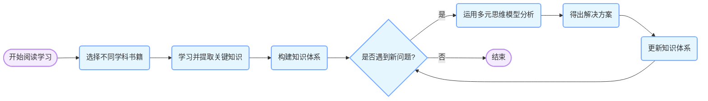

# 查理芒格的阅读学习方法

> 关键词：查理芒格、阅读学习方法、多元思维模型、跨学科学习、知识体系

> 摘要：本文深入探讨了查理芒格的阅读学习方法。查理芒格作为投资界的传奇人物，其独特的阅读学习方法为他构建多元思维模型、做出明智决策奠定了坚实基础。文章从背景介绍出发，阐述了研究该方法的目的、范围、预期读者和文档结构，详细解析了查理芒格阅读学习方法的核心概念与联系、核心算法原理及具体操作步骤，通过数学模型和公式进行理论深化，结合项目实战案例展示其在实际中的应用，分析了该方法的实际应用场景，推荐了相关的工具和资源，最后总结了其未来发展趋势与挑战，并提供常见问题解答和扩展阅读参考资料，旨在帮助读者全面掌握并运用查理芒格的阅读学习方法提升自身知识水平和思维能力。

## 1. 背景介绍 
### 1.1 目的和范围
查理芒格是伯克希尔·哈撒韦公司的副董事长，与沃伦·巴菲特共同缔造了投资界的传奇。他的智慧和成功很大程度上源于其独特的阅读学习方法。本文的目的在于深入剖析查理芒格的阅读学习方法，揭示其核心原理和操作步骤，帮助读者理解并应用这种方法来提升自己的学习效率和知识储备。范围涵盖了查理芒格阅读学习方法的各个方面，包括核心概念、算法原理、实际应用等，不仅适用于投资领域的学习者，也对其他领域的知识追求者具有借鉴意义。

### 1.2 预期读者
本文的预期读者包括对学习方法感兴趣的广大人群，尤其是那些希望通过阅读高效获取知识、构建多元思维模型的人。无论是学生、职场人士还是创业者，都可以从查理芒格的阅读学习方法中获得启发，提升自己的学习和决策能力。

### 1.3 文档结构概述
本文将按照以下结构进行阐述：首先介绍查理芒格阅读学习方法的背景信息，包括目的、范围、预期读者和文档结构；接着深入解析核心概念与联系，通过文本示意图和 Mermaid 流程图展示其架构；然后详细讲解核心算法原理及具体操作步骤，并使用 Python 源代码进行阐述；之后运用数学模型和公式对该方法进行理论深化，并举例说明；再通过项目实战案例展示该方法的实际应用，包括开发环境搭建、源代码实现和代码解读；分析该方法在不同场景下的实际应用；推荐相关的学习工具和资源；总结其未来发展趋势与挑战；最后提供常见问题解答和扩展阅读参考资料。

### 1.4 术语表
#### 1.4.1 核心术语定义
- **多元思维模型**：查理芒格提出的一种思维方式，强调从多个不同学科的角度去看待问题，综合运用多个学科的知识和方法来分析和解决问题。
- **跨学科学习**：打破学科界限，将不同学科的知识和方法融合在一起进行学习和研究的过程。
- **知识体系**：由一系列相互关联的知识组成的有机整体，具有系统性、逻辑性和层次性。

#### 1.4.2 相关概念解释
- **格栅理论**：查理芒格将不同学科的知识比喻成不同的格栅，通过将这些格栅组合在一起，形成一个完整的思维框架，从而更全面、深入地理解和解决问题。
- **复利效应**：在学习和知识积累过程中，每一次学习和积累都可以为下一次学习和积累提供基础，从而实现知识的快速增长和积累。

#### 1.4.3 缩略词列表
本文无缩略词。

## 2. 核心概念与联系 

查理芒格的阅读学习方法核心在于构建多元思维模型，通过跨学科学习来实现知识的融会贯通。其基本原理是将不同学科的知识和方法进行整合，形成一个全面、系统的思维框架，从而能够从多个角度看待问题，做出更明智的决策。

### 文本示意图
```plaintext
多元思维模型
|
|-- 跨学科学习
|   |-- 数学
|   |-- 物理学
|   |-- 生物学
|   |-- 心理学
|   |-- 经济学
|   |--...
|
|-- 知识体系构建
|   |-- 知识分类
|   |-- 知识关联
|   |-- 知识更新
```

### Mermaid 流程图


从这个流程图可以看出，查理芒格的阅读学习方法是一个循环迭代的过程。首先选择不同学科的书籍进行阅读学习，提取关键知识后构建知识体系。当遇到新问题时，运用多元思维模型进行分析，得出解决方案，并将新的知识和经验更新到知识体系中，不断完善和优化自己的思维方式和决策能力。

## 3. 核心算法原理 & 具体操作步骤 

### 核心算法原理
查理芒格阅读学习方法的核心算法可以概括为以下几个步骤：
1. **知识获取**：从不同学科的书籍、文章、讲座等渠道获取知识。
2. **知识筛选**：对获取的知识进行筛选，提取关键信息和核心观点。
3. **知识整合**：将筛选后的知识进行整合，构建知识体系。
4. **知识应用**：运用构建好的知识体系和多元思维模型分析和解决实际问题。
5. **知识更新**：根据实际应用的结果和新的学习，更新知识体系和多元思维模型。

### 具体操作步骤及 Python 代码实现
以下是一个简单的 Python 代码示例，模拟查理芒格阅读学习方法的核心算法：

```python
# 模拟不同学科的书籍知识
books = {
    "数学": ["概率论", "线性代数", "微积分"],
    "物理学": ["牛顿力学", "电磁学", "量子力学"],
    "心理学": ["认知心理学", "社会心理学", "发展心理学"],
    "经济学": ["微观经济学", "宏观经济学", "计量经济学"]
}

# 知识获取
def get_knowledge(books):
    all_knowledge = []
    for subject, knowledge_list in books.items():
        for knowledge in knowledge_list:
            all_knowledge.append(knowledge)
    return all_knowledge

# 知识筛选
def filter_knowledge(knowledge_list):
    # 简单示例：筛选出长度大于 5 的知识
    filtered_knowledge = [knowledge for knowledge in knowledge_list if len(knowledge) > 5]
    return filtered_knowledge

# 知识整合
def integrate_knowledge(filtered_knowledge):
    knowledge_system = {}
    for knowledge in filtered_knowledge:
        # 简单示例：根据知识名称的第一个字进行分类
        first_char = knowledge[0]
        if first_char not in knowledge_system:
            knowledge_system[first_char] = []
        knowledge_system[first_char].append(knowledge)
    return knowledge_system

# 知识应用
def apply_knowledge(knowledge_system, problem):
    # 简单示例：根据问题的第一个字查找相关知识
    first_char = problem[0]
    if first_char in knowledge_system:
        relevant_knowledge = knowledge_system[first_char]
        print(f"与问题相关的知识：{relevant_knowledge}")
    else:
        print("未找到相关知识")

# 知识更新
def update_knowledge(knowledge_system, new_knowledge):
    first_char = new_knowledge[0]
    if first_char not in knowledge_system:
        knowledge_system[first_char] = []
    knowledge_system[first_char].append(new_knowledge)
    return knowledge_system

# 主程序
if __name__ == "__main__":
    # 知识获取
    all_knowledge = get_knowledge(books)
    print("获取的所有知识：", all_knowledge)

    # 知识筛选
    filtered_knowledge = filter_knowledge(all_knowledge)
    print("筛选后的知识：", filtered_knowledge)

    # 知识整合
    knowledge_system = integrate_knowledge(filtered_knowledge)
    print("构建的知识体系：", knowledge_system)

    # 知识应用
    problem = "微积分在金融中的应用"
    apply_knowledge(knowledge_system, problem)

    # 知识更新
    new_knowledge = "行为经济学"
    knowledge_system = update_knowledge(knowledge_system, new_knowledge)
    print("更新后的知识体系：", knowledge_system)
```

### 代码解释
- `get_knowledge` 函数：遍历所有学科的书籍，将其中的知识提取出来，存储在一个列表中。
- `filter_knowledge` 函数：对获取的知识进行筛选，这里简单地筛选出长度大于 5 的知识。
- `integrate_knowledge` 函数：将筛选后的知识进行整合，根据知识名称的第一个字进行分类，构建一个简单的知识体系。
- `apply_knowledge` 函数：根据问题的第一个字查找相关知识，并输出结果。
- `update_knowledge` 函数：将新的知识添加到知识体系中。

通过这个简单的代码示例，我们可以看到查理芒格阅读学习方法的核心算法在代码中的实现方式，虽然实际应用中可能会更加复杂，但基本原理是相同的。

## 4. 数学模型和公式 & 详细讲解 & 举例说明 

### 知识积累的复利模型
在查理芒格的阅读学习方法中，知识积累具有复利效应。我们可以用复利公式来描述知识积累的过程。

设初始知识量为 $K_0$，每次学习获得的知识增长率为 $r$，学习次数为 $n$，则经过 $n$ 次学习后积累的知识量 $K_n$ 可以用以下公式表示：

$$K_n = K_0(1 + r)^n$$

### 详细讲解
- $K_0$：表示初始的知识量，即开始学习时所拥有的知识基础。
- $r$：表示每次学习获得的知识增长率，它反映了每次学习的效果和效率。例如，如果每次学习能够使知识量增加 10%，则 $r = 0.1$。
- $n$：表示学习的次数，随着学习次数的增加，知识量会以指数形式增长。

### 举例说明
假设一个人初始的知识量 $K_0 = 100$，每次学习能够使知识量增加 5%，即 $r = 0.05$。经过 10 次学习后，他积累的知识量为：

$$K_{10} = 100(1 + 0.05)^{10} \approx 162.89$$

可以看到，经过 10 次学习后，知识量从 100 增长到了约 162.89，增长了约 62.89%。如果继续学习，知识量将继续以指数形式增长，这就是知识积累的复利效应。

### 多元思维模型的权重分配模型
在运用多元思维模型分析问题时，不同学科的知识和方法对解决问题的贡献可能不同，因此需要对不同学科的知识赋予不同的权重。

设共有 $m$ 个学科的知识参与问题分析，第 $i$ 个学科的知识权重为 $w_i$，第 $i$ 个学科的知识对问题的贡献度为 $c_i$，则问题的综合解决方案 $S$ 可以用以下公式表示：

$$S = \sum_{i = 1}^{m} w_i c_i$$

其中，$\sum_{i = 1}^{m} w_i = 1$，即所有学科知识的权重之和为 1。

### 详细讲解
- $w_i$：表示第 $i$ 个学科知识的权重，它反映了该学科知识在解决问题中的重要程度。权重的确定需要根据具体问题和实际情况进行判断。
- $c_i$：表示第 $i$ 个学科的知识对问题的贡献度，它可以通过对该学科知识的分析和评估来确定。
- $S$：表示问题的综合解决方案，是各个学科知识贡献度的加权总和。

### 举例说明
假设在分析一个投资问题时，考虑了经济学、心理学和数学三个学科的知识。经济学知识的权重 $w_1 = 0.5$，其对问题的贡献度 $c_1 = 0.8$；心理学知识的权重 $w_2 = 0.3$，其对问题的贡献度 $c_2 = 0.6$；数学知识的权重 $w_3 = 0.2$，其对问题的贡献度 $c_3 = 0.7$。则该投资问题的综合解决方案为：

$$S = 0.5 \times 0.8 + 0.3 \times 0.6 + 0.2 \times 0.7 = 0.4 + 0.18 + 0.14 = 0.72$$

通过这个公式，我们可以综合考虑不同学科知识的贡献，得出一个更全面、更准确的解决方案。

## 5. 项目实战：代码实际案例和详细解释说明 

### 5.1  开发环境搭建
为了实现一个基于查理芒格阅读学习方法的简单知识管理系统，我们需要搭建以下开发环境：
- **编程语言**：Python 3.x
- **开发工具**：可以选择 PyCharm、VS Code 等集成开发环境（IDE）。
- **相关库**：使用 `sqlite3` 库来进行数据库操作，用于存储和管理知识信息。

### 5.2  源代码详细实现和代码解读
```python
import sqlite3

# 连接数据库
def create_connection():
    conn = sqlite3.connect('knowledge.db')
    return conn

# 创建知识表
def create_table(conn):
    cursor = conn.cursor()
    cursor.execute('''
        CREATE TABLE IF NOT EXISTS knowledge (
            id INTEGER PRIMARY KEY AUTOINCREMENT,
            subject TEXT NOT NULL,
            knowledge TEXT NOT NULL
        )
    ''')
    conn.commit()

# 添加知识
def add_knowledge(conn, subject, knowledge):
    cursor = conn.cursor()
    cursor.execute('INSERT INTO knowledge (subject, knowledge) VALUES (?,?)', (subject, knowledge))
    conn.commit()

# 获取所有知识
def get_all_knowledge(conn):
    cursor = conn.cursor()
    cursor.execute('SELECT * FROM knowledge')
    rows = cursor.fetchall()
    return rows

# 根据学科筛选知识
def filter_knowledge_by_subject(conn, subject):
    cursor = conn.cursor()
    cursor.execute('SELECT * FROM knowledge WHERE subject =?', (subject,))
    rows = cursor.fetchall()
    return rows

# 主程序
if __name__ == "__main__":
    # 连接数据库
    conn = create_connection()

    # 创建知识表
    create_table(conn)

    # 添加知识
    add_knowledge(conn, "数学", "概率论")
    add_knowledge(conn, "物理学", "牛顿力学")
    add_knowledge(conn, "心理学", "认知心理学")

    # 获取所有知识
    all_knowledge = get_all_knowledge(conn)
    print("所有知识：")
    for row in all_knowledge:
        print(f"ID: {row[0]}, 学科: {row[1]}, 知识: {row[2]}")

    # 根据学科筛选知识
    physics_knowledge = filter_knowledge_by_subject(conn, "物理学")
    print("\n物理学相关知识：")
    for row in physics_knowledge:
        print(f"ID: {row[0]}, 学科: {row[1]}, 知识: {row[2]}")

    # 关闭数据库连接
    conn.close()
```

### 代码解读与分析
- `create_connection` 函数：用于创建与 SQLite 数据库的连接。
- `create_table` 函数：创建一个名为 `knowledge` 的表，用于存储知识信息，包括 `id`、`subject`（学科）和 `knowledge`（知识内容）。
- `add_knowledge` 函数：向 `knowledge` 表中插入新的知识记录。
- `get_all_knowledge` 函数：查询并返回 `knowledge` 表中的所有知识记录。
- `filter_knowledge_by_subject` 函数：根据学科名称筛选并返回相关的知识记录。

在主程序中，我们首先创建数据库连接，然后创建知识表，添加一些示例知识，获取所有知识并输出，接着根据学科筛选知识并输出，最后关闭数据库连接。

通过这个简单的知识管理系统，我们可以模拟查理芒格阅读学习方法中的知识获取、存储和筛选过程，帮助我们更好地管理和利用所学知识。

## 6. 实际应用场景 
### 投资决策
在投资领域，查理芒格的阅读学习方法具有重要的应用价值。投资者可以通过阅读不同学科的书籍，如经济学、金融学、心理学、会计学等，构建多元思维模型。在分析投资项目时，运用多元思维模型从多个角度进行评估，不仅考虑财务数据和市场趋势，还考虑企业的竞争优势、管理层的心理和行为等因素，从而做出更明智的投资决策。

### 企业管理
企业管理者可以运用查理芒格的阅读学习方法提升自己的管理能力。通过学习管理学、组织行为学、市场营销学、经济学等多个学科的知识，构建全面的知识体系。在制定企业战略、管理团队、处理市场竞争等问题时，能够从不同学科的角度进行思考，找到更有效的解决方案。

### 学术研究
在学术研究中，跨学科研究已经成为一种趋势。学者们可以借鉴查理芒格的阅读学习方法，广泛阅读不同学科的文献，获取多元的知识和视角。在研究问题时，运用多元思维模型将不同学科的理论和方法相结合，开拓研究思路，提高研究的创新性和深度。

### 日常生活
在日常生活中，查理芒格的阅读学习方法也可以帮助我们更好地解决各种问题。例如，在处理人际关系时，可以运用心理学知识理解他人的行为和心理；在规划个人财务时，可以运用经济学和会计学知识制定合理的理财计划。通过不断学习和积累不同学科的知识，我们能够更加全面地看待问题，做出更合理的决策。

## 7. 工具和资源推荐
### 7.1 学习资源推荐
#### 7.1.1 书籍推荐
- 《穷查理宝典：查理·芒格的智慧箴言录》：这是一本全面介绍查理芒格思想和智慧的书籍，其中包含了他的阅读学习方法、多元思维模型等重要内容。
- 《人类的群星闪耀时》：茨威格的经典著作，通过讲述历史上的重要事件和人物，帮助读者拓宽视野，培养跨学科的思维方式。
- 《思考，快与慢》：丹尼尔·卡尼曼的代表作，介绍了人类思维的两种模式，对于理解心理学和决策制定具有重要意义。
- 《经济学原理》：曼昆的经典经济学教材，系统地介绍了经济学的基本原理和方法，是学习经济学的入门佳作。
- 《万物简史》：比尔·布莱森的科普著作，以生动有趣的方式介绍了自然科学的各个领域，帮助读者建立跨学科的知识基础。

#### 7.1.2 在线课程
- Coursera 平台上的“跨学科研究方法”课程：该课程介绍了跨学科研究的基本概念、方法和实践，帮助学习者掌握跨学科学习的技巧。
- edX 平台上的“经济学原理”课程：由知名高校的教授授课，系统地讲解了经济学的基本原理和应用。
- 网易云课堂上的“心理学导论”课程：涵盖了心理学的各个领域，适合初学者了解心理学的基本知识。

#### 7.1.3 技术博客和网站
- 微信公众号“芒格书院”：专注于分享查理芒格的思想和智慧，提供相关的文章和解读。
- 知乎上的“跨学科研究”话题：聚集了众多跨学科研究的爱好者和专家，分享了丰富的知识和经验。
- 果壳网：一个科普网站，提供了自然科学、人文科学等多个领域的知识和资讯。

### 7.2 开发工具框架推荐
#### 7.2.1 IDE和编辑器
- PyCharm：一款专业的 Python 集成开发环境，提供了丰富的代码编辑、调试和分析功能，适合开发基于 Python 的知识管理系统和数据分析项目。
- VS Code：一款轻量级的代码编辑器，支持多种编程语言，具有丰富的插件生态系统，可以根据需要进行个性化配置。

#### 7.2.2 调试和性能分析工具
- pdb：Python 内置的调试工具，可以帮助开发者定位和解决代码中的问题。
- cProfile：Python 的性能分析工具，可以分析代码的运行时间和函数调用情况，帮助开发者优化代码性能。

#### 7.2.3 相关框架和库
- pandas：一个强大的数据分析库，提供了数据结构和数据分析工具，适合处理和分析大量的知识数据。
- numpy：一个用于科学计算的 Python 库，提供了高效的数组操作和数学函数，在知识处理和模型计算中具有广泛的应用。

### 7.3 相关论文著作推荐
#### 7.3.1 经典论文
- 《跨学科研究：原理与实践》：该论文系统地介绍了跨学科研究的原理、方法和实践，对于理解跨学科学习和研究具有重要的指导意义。
- 《多元思维模型在投资决策中的应用》：探讨了多元思维模型在投资决策中的重要性和应用方法，为投资者提供了理论支持和实践指导。

#### 7.3.2 最新研究成果
- 《基于跨学科学习的创新能力培养研究》：关注跨学科学习对创新能力培养的影响，介绍了最新的研究成果和实践经验。
- 《多元思维模型在企业战略制定中的应用研究》：研究了多元思维模型在企业战略制定中的应用，为企业管理者提供了新的思路和方法。

#### 7.3.3 应用案例分析
- 《查理芒格投资案例分析》：通过分析查理芒格的投资案例，深入探讨了他的投资策略和阅读学习方法的应用。
- 《跨学科研究在科技创新中的应用案例》：介绍了跨学科研究在科技创新领域的成功应用案例，为科研人员提供了借鉴和启示。

## 8. 总结：未来发展趋势与挑战
### 未来发展趋势
- **跨学科融合加深**：随着科技的不断发展和社会问题的日益复杂，跨学科融合将成为未来学习和研究的主流趋势。查理芒格的阅读学习方法强调跨学科学习和多元思维模型的构建，将在未来得到更广泛的应用和发展。
- **数字化学习资源丰富**：互联网和信息技术的发展将为阅读学习提供更加丰富的数字化资源，学习者可以通过在线课程、电子书籍、学术数据库等渠道获取更多的知识。同时，人工智能技术的应用也将为学习提供更加个性化的服务和支持。
- **实践应用更加广泛**：查理芒格的阅读学习方法不仅在投资领域具有重要价值，在企业管理、学术研究、日常生活等多个领域都将得到更广泛的应用。通过将理论知识与实践相结合，学习者能够更好地解决实际问题，提高自己的综合素质和竞争力。

### 挑战
- **知识筛选难度增加**：随着信息爆炸时代的到来，知识的数量呈指数级增长，学习者面临着知识筛选的难题。如何从海量的信息中筛选出有价值的知识，是应用查理芒格阅读学习方法的一大挑战。
- **跨学科学习难度大**：跨学科学习需要学习者具备广泛的知识基础和较强的学习能力，同时还需要克服不同学科之间的思维差异和知识壁垒。这对于很多学习者来说是一个巨大的挑战。
- **知识更新速度快**：科技的快速发展导致知识更新速度加快，学习者需要不断学习和更新自己的知识体系，以适应时代的变化。如何保持学习的热情和动力，及时掌握最新的知识和技术，是学习者需要面对的另一个挑战。

## 9. 附录：常见问题与解答
### 问题 1：如何选择适合自己的学科进行阅读学习？
解答：可以根据自己的兴趣、职业发展和实际需求来选择学科。首先，确定自己感兴趣的领域，这样可以提高学习的积极性和主动性。其次，考虑自己的职业发展方向，选择与职业相关的学科进行学习，有助于提升自己的专业能力。最后，关注社会热点和前沿问题，选择相关的学科进行研究，拓宽自己的视野和思维方式。

### 问题 2：如何构建有效的知识体系？
解答：构建知识体系可以按照以下步骤进行：首先，对所学的知识进行分类整理，将相似的知识归为一类。然后，分析不同知识之间的关联，建立知识之间的逻辑关系。可以使用思维导图、概念图等工具来帮助构建知识体系。最后，不断更新和完善知识体系，根据新的学习和实践经验，对知识进行调整和补充。

### 问题 3：在运用多元思维模型分析问题时，如何确定不同学科知识的权重？
解答：确定不同学科知识的权重需要根据具体问题和实际情况进行判断。可以从以下几个方面考虑：首先，分析问题的本质和关键因素，确定哪些学科的知识对解决问题最为重要。其次，参考以往的经验和案例，了解不同学科知识在类似问题中的应用效果。最后，结合自己的专业知识和判断能力，对不同学科知识的权重进行合理分配。

### 问题 4：如何保持持续的学习动力？
解答：保持持续的学习动力可以从以下几个方面入手：首先，设定明确的学习目标，将学习目标分解为具体的小目标，每次实现一个小目标都能获得成就感，从而激发学习动力。其次，找到学习的乐趣，选择自己感兴趣的学习内容，将学习与自己的兴趣爱好相结合。最后，建立学习社群，与其他学习者交流和分享学习经验，互相鼓励和支持。

## 10. 扩展阅读 & 参考资料
### 扩展阅读
- 《原则》：瑞·达利欧的著作，介绍了他的生活和工作原则，对于培养良好的思维方式和决策能力具有重要的启示作用。
- 《刻意练习：如何从新手到大师》：安德斯·埃里克森的作品，介绍了刻意练习的方法和原理，帮助读者提高学习效率和技能水平。
- 《创新者的窘境》：克莱顿·克里斯坦森的经典著作，探讨了企业创新和发展的问题，对于理解商业世界的变化和挑战具有重要意义。

### 参考资料
- 《穷查理宝典：查理·芒格的智慧箴言录》，彼得·考夫曼编著，上海人民出版社。
- 《人类的群星闪耀时》，斯蒂芬·茨威格著，生活·读书·新知三联书店。
- 《思考，快与慢》，丹尼尔·卡尼曼著，中信出版社。
- 《经济学原理》，N·格里高利·曼昆著，北京大学出版社。
- 《万物简史》，比尔·布莱森著，接力出版社。

作者：AI天才研究院/AI Genius Institute & 禅与计算机程序设计艺术 /Zen And The Art of Computer Programming