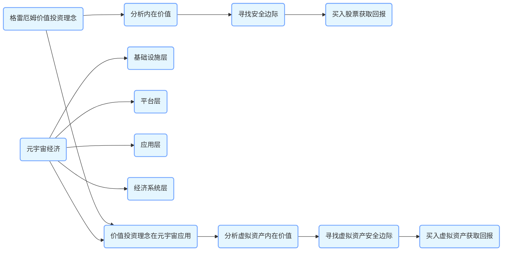

# 格雷厄姆价值投资理念在元宇宙经济中的新解读

> 关键词：格雷厄姆价值投资理念、元宇宙经济、新解读、估值方法、投资策略

> 摘要：本文旨在探讨格雷厄姆价值投资理念在元宇宙经济这一新兴领域的新解读。首先介绍了格雷厄姆价值投资理念的背景和核心要点，接着分析了元宇宙经济的特点和发展趋势。在此基础上，深入探讨了价值投资理念在元宇宙经济中的适应性和调整，包括对元宇宙资产的估值方法、投资策略等方面。通过实际案例分析，展示了如何运用新解读后的价值投资理念在元宇宙经济中进行投资决策。最后，对未来元宇宙经济中价值投资的发展趋势和挑战进行了展望。

## 1. 背景介绍 
### 1.1 目的和范围
本研究的主要目的是将传统的格雷厄姆价值投资理念引入到元宇宙经济这个全新的领域中进行重新审视和解读。随着元宇宙概念的兴起和相关技术的不断发展，元宇宙经济逐渐成为一个具有巨大潜力的投资领域。然而，元宇宙经济具有与传统经济不同的特点和运行规律，传统的投资理念可能无法直接适用。因此，需要对格雷厄姆价值投资理念进行调整和创新，以适应元宇宙经济的投资需求。本研究的范围涵盖了元宇宙经济的各个方面，包括虚拟资产、数字土地、虚拟货币等，旨在为投资者提供在元宇宙经济中进行价值投资的理论指导和实践方法。

### 1.2 预期读者
本文的预期读者主要包括对元宇宙经济和投资感兴趣的个人投资者、金融机构从业者、投资研究人员以及相关领域的学者。对于个人投资者来说，希望通过本文了解如何运用价值投资理念在元宇宙经济中寻找投资机会，降低投资风险。金融机构从业者可以从中获取新的投资思路和策略，为客户提供更专业的投资建议。投资研究人员和学者则可以将本文作为进一步研究元宇宙经济投资理论的参考资料。

### 1.3 文档结构概述
本文将按照以下结构进行组织：首先，介绍格雷厄姆价值投资理念的核心概念和基本原理，以及元宇宙经济的定义、特点和发展现状。然后，分析价值投资理念在元宇宙经济中的适应性和调整，包括对元宇宙资产的估值方法、投资策略等方面。接着，通过实际案例分析，展示如何运用新解读后的价值投资理念在元宇宙经济中进行投资决策。之后，探讨元宇宙经济中价值投资的实际应用场景和面临的挑战。再推荐一些与元宇宙经济和价值投资相关的学习资源、开发工具和研究论文。最后，对未来元宇宙经济中价值投资的发展趋势进行总结和展望，并解答一些常见问题。

### 1.4 术语表
#### 1.4.1 核心术语定义
- **格雷厄姆价值投资理念**：由本杰明·格雷厄姆提出的一种投资理论，强调通过分析企业的内在价值，以低于内在价值的价格买入股票，从而获得安全边际和长期投资回报。
- **元宇宙经济**：指在元宇宙这个虚拟世界中所形成的经济系统，包括虚拟资产的生产、交易、消费等经济活动。
- **虚拟资产**：存在于元宇宙中的数字化资产，如虚拟土地、虚拟货币、虚拟艺术品等。
- **内在价值**：资产本身所具有的真实价值，不受市场价格波动的影响。
- **安全边际**：指股票的市场价格低于其内在价值的幅度，安全边际越大，投资风险越低。

#### 1.4.2 相关概念解释
- **元宇宙**：是一个融合了虚拟现实、增强现实、区块链等多种技术的虚拟世界，用户可以在其中进行社交、娱乐、工作、学习等活动。
- **区块链技术**：一种分布式账本技术，具有去中心化、不可篡改、安全可靠等特点，为元宇宙经济中的资产交易和管理提供了技术支持。
- **NFT（非同质化代币）**：一种基于区块链技术的数字资产，每个NFT都具有独特的标识和属性，不可互换，常用于表示虚拟艺术品、虚拟土地等独特的虚拟资产。

#### 1.4.3 缩略词列表
- **NFT**：Non-Fungible Token（非同质化代币）
- **AR**：Augmented Reality（增强现实）
- **VR**：Virtual Reality（虚拟现实）

## 2. 核心概念与联系 

### 2.1 格雷厄姆价值投资理念核心原理
格雷厄姆价值投资理念的核心原理基于对企业内在价值的评估。他认为，股票不仅仅是一张纸片，而是代表了企业的一部分所有权。投资者应该关注企业的基本面，通过分析企业的财务报表、盈利能力、资产状况等因素，来估算企业的内在价值。只有当股票的市场价格低于其内在价值时，才具有投资价值，因为此时投资者可以获得安全边际，降低投资风险。

### 2.2 元宇宙经济的特点和架构
元宇宙经济具有以下特点：
- **虚拟性**：元宇宙经济中的资产和交易都是在虚拟世界中进行的，不存在物理实体。
- **数字化**：所有的经济活动都以数字形式存在，包括资产的所有权、交易记录等。
- **开放性**：元宇宙通常是一个开放的平台，任何人都可以参与其中，创造和交易虚拟资产。
- **创新性**：元宇宙经济不断涌现出新的商业模式和应用场景，具有很强的创新性。

元宇宙经济的架构主要包括以下几个层次：
- **基础设施层**：包括虚拟现实、增强现实、区块链等技术，为元宇宙的运行提供技术支持。
- **平台层**：提供元宇宙的开发和运营平台，如游戏引擎、虚拟世界平台等。
- **应用层**：包括各种元宇宙应用，如虚拟社交、虚拟购物、虚拟金融等。
- **经济系统层**：负责管理元宇宙中的资产交易、货币发行等经济活动。

### 2.3 两者的联系和适应性分析
虽然元宇宙经济与传统经济有很大的不同，但格雷厄姆价值投资理念的核心思想在一定程度上仍然适用于元宇宙经济。在元宇宙经济中，虚拟资产也具有内在价值，投资者可以通过分析虚拟资产的稀缺性、实用性、市场需求等因素来估算其内在价值。同时，安全边际的概念也同样重要，投资者应该在价格低于内在价值时买入虚拟资产，以降低投资风险。然而，由于元宇宙经济的虚拟性和创新性，在应用价值投资理念时需要进行一些调整和创新。例如，传统的财务报表分析方法可能无法直接用于评估虚拟资产的内在价值，需要开发新的估值方法。

### 2.4 核心概念原理和架构的文本示意图
格雷厄姆价值投资理念的核心是通过分析企业基本面估算内在价值，以低于内在价值的价格买入股票获得安全边际和回报。元宇宙经济则是基于多种技术构建的虚拟经济系统，包括基础设施、平台、应用和经济系统等层次。两者的联系在于价值投资理念可用于评估元宇宙中的虚拟资产，但需要适应元宇宙的特点进行调整。

### 2.5 Mermaid 流程图


## 3. 核心算法原理 & 具体操作步骤 

### 3.1 元宇宙资产内在价值评估算法原理
在元宇宙经济中，评估虚拟资产的内在价值是价值投资的关键。一种常用的方法是基于现金流折现模型（DCF）。该模型的基本原理是将资产未来产生的现金流按照一定的折现率折现到当前时刻，得到资产的内在价值。

对于元宇宙中的虚拟资产，如虚拟土地，其未来现金流可以来自于土地的租赁收入、开发收益等。假设虚拟土地每年的租赁收入为 $CF_t$，折现率为 $r$，资产的持有期限为 $n$ 年，则虚拟土地的内在价值 $V$ 可以通过以下公式计算：

$$V = \sum_{t=1}^{n} \frac{CF_t}{(1 + r)^t}$$

### 3.2 具体操作步骤
#### 3.2.1 确定现金流
首先，需要对虚拟资产未来的现金流进行预测。对于虚拟土地，需要考虑土地的位置、面积、用途等因素，以及元宇宙的发展趋势和市场需求。可以通过分析类似虚拟土地的租赁价格和开发案例，来估算未来的租赁收入和开发收益。

#### 3.2.2 确定折现率
折现率反映了投资者对投资风险的预期。在元宇宙经济中，由于市场的不确定性较大，折现率通常较高。可以参考市场上类似风险投资的回报率，结合元宇宙经济的特点，确定合适的折现率。

#### 3.2.3 计算内在价值
将预测的现金流和确定的折现率代入现金流折现模型，计算虚拟资产的内在价值。

### 3.3 Python 源代码实现
```python
def calculate_intrinsic_value(cash_flows, discount_rate):
    """
    计算虚拟资产的内在价值
    :param cash_flows: 未来各期的现金流列表
    :param discount_rate: 折现率
    :return: 内在价值
    """
    intrinsic_value = 0
    for t, cf in enumerate(cash_flows, start=1):
        intrinsic_value += cf / ((1 + discount_rate) ** t)
    return intrinsic_value

# 示例数据
cash_flows = [100, 120, 150, 180, 200]  # 未来 5 年的现金流
discount_rate = 0.1  # 折现率为 10%

# 计算内在价值
intrinsic_value = calculate_intrinsic_value(cash_flows, discount_rate)
print(f"虚拟资产的内在价值为: {intrinsic_value}")
```

### 3.4 代码解释
上述代码定义了一个名为 `calculate_intrinsic_value` 的函数，用于计算虚拟资产的内在价值。函数接受两个参数：`cash_flows` 表示未来各期的现金流列表，`discount_rate` 表示折现率。在函数内部，使用循环遍历现金流列表，将每期的现金流按照折现率折现到当前时刻，并累加到内在价值中。最后，返回计算得到的内在价值。

在示例中，我们假设虚拟资产未来 5 年的现金流分别为 100、120、150、180 和 200，折现率为 10%。调用 `calculate_intrinsic_value` 函数计算内在价值，并将结果打印输出。

## 4. 数学模型和公式 & 详细讲解 & 举例说明 

### 4.1 现金流折现模型（DCF）详细讲解
现金流折现模型是一种基于未来现金流的估值方法，其核心思想是将资产未来产生的现金流折现到当前时刻，以反映资产的真实价值。该模型的基本公式为：

$$V = \sum_{t=1}^{n} \frac{CF_t}{(1 + r)^t}$$

其中，$V$ 表示资产的内在价值，$CF_t$ 表示第 $t$ 期的现金流，$r$ 表示折现率，$n$ 表示资产的持有期限。

折现率 $r$ 反映了投资者对投资风险的预期。风险越高，折现率越高；风险越低，折现率越低。在元宇宙经济中，由于市场的不确定性较大，折现率通常较高。

### 4.2 举例说明
假设我们要评估一块虚拟土地的内在价值。根据市场调研和分析，预计该虚拟土地未来 5 年的租赁收入分别为 100、120、150、180 和 200 元。由于元宇宙市场的不确定性较大，我们确定折现率为 15%。

根据现金流折现模型，计算该虚拟土地的内在价值：

$$V = \frac{100}{(1 + 0.15)^1} + \frac{120}{(1 + 0.15)^2} + \frac{150}{(1 + 0.15)^3} + \frac{180}{(1 + 0.15)^4} + \frac{200}{(1 + 0.15)^5}$$

```python
cash_flows = [100, 120, 150, 180, 200]
discount_rate = 0.15
intrinsic_value = calculate_intrinsic_value(cash_flows, discount_rate)
print(f"虚拟土地的内在价值为: {intrinsic_value}")
```

通过计算，得到该虚拟土地的内在价值约为 432.67 元。如果该虚拟土地的市场价格低于 432.67 元，则具有投资价值；反之，则不具有投资价值。

### 4.3 其他可能的数学模型
除了现金流折现模型，还可以使用相对估值模型来评估元宇宙资产的价值。相对估值模型是通过比较类似资产的市场价格来估算目标资产的价值。例如，可以使用市盈率（PE）、市净率（PB）等指标来评估元宇宙中的虚拟企业的价值。

假设元宇宙中有一家虚拟游戏公司，其每股收益为 2 元，市场上类似游戏公司的平均市盈率为 20 倍。则该虚拟游戏公司的每股价值可以估算为：

$$每股价值 = 每股收益 \times 市盈率 = 2 \times 20 = 40 元$$

相对估值模型的优点是简单易懂，计算方便，但缺点是需要找到合适的可比资产，并且市场上的可比资产可能并不完全相同，会影响估值的准确性。

## 5. 项目实战：代码实际案例和详细解释说明 

### 5.1  开发环境搭建
#### 5.1.1 安装 Python
首先，需要安装 Python 编程语言。可以从 Python 官方网站（https://www.python.org/downloads/）下载适合自己操作系统的 Python 安装包，并按照安装向导进行安装。

#### 5.1.2 安装必要的库
在本项目中，只需要使用 Python 的内置库，无需安装额外的库。

### 5.2  源代码详细实现和代码解读
```python
def calculate_intrinsic_value(cash_flows, discount_rate):
    """
    计算虚拟资产的内在价值
    :param cash_flows: 未来各期的现金流列表
    :param discount_rate: 折现率
    :return: 内在价值
    """
    intrinsic_value = 0
    for t, cf in enumerate(cash_flows, start=1):
        intrinsic_value += cf / ((1 + discount_rate) ** t)
    return intrinsic_value

# 示例数据
cash_flows = [100, 120, 150, 180, 200]  # 未来 5 年的现金流
discount_rate = 0.1  # 折现率为 10%

# 计算内在价值
intrinsic_value = calculate_intrinsic_value(cash_flows, discount_rate)
print(f"虚拟资产的内在价值为: {intrinsic_value}")
```

### 5.2.1 代码实现
上述代码实现了一个简单的现金流折现模型，用于计算虚拟资产的内在价值。具体步骤如下：
1. 定义 `calculate_intrinsic_value` 函数，接受两个参数：`cash_flows` 和 `discount_rate`。
2. 在函数内部，初始化 `intrinsic_value` 为 0。
3. 使用 `enumerate` 函数遍历 `cash_flows` 列表，同时获取每期现金流的索引 `t` 和现金流值 `cf`。
4. 将每期现金流按照折现率折现到当前时刻，并累加到 `intrinsic_value` 中。
5. 返回计算得到的内在价值。

### 5.2.2 代码解读
- `enumerate(cash_flows, start=1)`：`enumerate` 函数用于同时获取列表的索引和值，`start=1` 表示索引从 1 开始。
- `(1 + discount_rate) ** t`：表示折现因子，用于将未来的现金流折现到当前时刻。
- `cf / ((1 + discount_rate) ** t)`：表示将第 `t` 期的现金流折现到当前时刻的值。

### 5.3  代码解读与分析
### 5.3.1 代码优点
- 代码结构清晰，逻辑简单，易于理解和维护。
- 使用了函数封装，提高了代码的复用性。

### 5.3.2 代码局限性
- 该代码只考虑了固定的现金流和折现率，没有考虑现金流的不确定性和折现率的变化。
- 没有考虑资产的残值和其他可能的收益。

### 5.3.3 改进建议
- 可以引入随机变量来模拟现金流的不确定性，使用蒙特卡罗模拟方法来计算内在价值的分布。
- 考虑资产的残值和其他可能的收益，将其加入到现金流中进行计算。

## 6. 实际应用场景 
### 6.1 虚拟土地投资
在元宇宙中，虚拟土地是一种重要的资产。投资者可以运用价值投资理念，通过分析虚拟土地的位置、面积、用途、周边环境等因素，估算其内在价值。例如，位于元宇宙中心区域、交通便利、人流量大的虚拟土地，其内在价值通常较高。投资者可以在市场价格低于内在价值时买入虚拟土地，等待土地升值或通过租赁、开发等方式获取收益。

### 6.2 虚拟企业投资
元宇宙中也存在各种虚拟企业，如虚拟游戏公司、虚拟社交平台等。投资者可以通过分析虚拟企业的商业模式、用户数量、盈利能力、技术实力等因素，评估其内在价值。对于具有创新商业模式、庞大用户基础和良好盈利前景的虚拟企业，投资者可以在合适的时机进行投资。

### 6.3 虚拟艺术品投资
虚拟艺术品是元宇宙中的一种新兴资产，通常以 NFT 的形式存在。投资者可以根据虚拟艺术品的创作者知名度、艺术价值、稀缺性等因素来评估其内在价值。一些知名艺术家创作的限量版虚拟艺术品，由于其稀缺性和艺术价值，往往具有较高的投资价值。

### 6.4 虚拟货币投资
虽然虚拟货币在元宇宙经济中的地位和作用存在一定的争议，但仍然有很多投资者关注虚拟货币的投资机会。投资者可以运用价值投资理念，分析虚拟货币的技术创新、应用场景、市场需求等因素，评估其内在价值。例如，具有良好技术基础、广泛应用场景和庞大用户群体的虚拟货币，其内在价值可能较高。

## 7. 工具和资源推荐
### 7.1 学习资源推荐
#### 7.1.1 书籍推荐
- 《聪明的投资者》：本杰明·格雷厄姆的经典著作，详细阐述了价值投资的理念和方法。
- 《元宇宙通证》：介绍了元宇宙经济的基本概念、技术原理和投资机会。
- 《区块链技术指南》：深入讲解了区块链技术的原理和应用，对于理解元宇宙经济的底层技术有很大帮助。

#### 7.1.2 在线课程
- Coursera 上的“投资学原理”：由知名教授授课，系统介绍了投资学的基本理论和方法。
- Udemy 上的“元宇宙开发与投资”：专门针对元宇宙经济的开发和投资进行讲解，内容丰富实用。

#### 7.1.3 技术博客和网站
- 巴比特：专注于区块链和数字货币领域的资讯和技术博客，提供了大量关于元宇宙经济的最新消息和分析文章。
- 元宇宙中文网：专门介绍元宇宙相关的知识、技术和应用案例，是了解元宇宙经济的重要网站。

### 7.2 开发工具框架推荐
#### 7.2.1 IDE和编辑器
- PyCharm：一款功能强大的 Python 集成开发环境，适合用于开发和调试与元宇宙经济相关的 Python 代码。
- Visual Studio Code：一款轻量级的代码编辑器，支持多种编程语言，具有丰富的插件和扩展功能。

#### 7.2.2 调试和性能分析工具
- pdb：Python 内置的调试工具，可以帮助开发者快速定位和解决代码中的问题。
- cProfile：Python 的性能分析工具，可以分析代码的运行时间和资源消耗情况，帮助开发者优化代码性能。

#### 7.2.3 相关框架和库
- Web3.py：一个 Python 库，用于与以太坊区块链进行交互，对于开发基于区块链的元宇宙应用有很大帮助。
- Unreal Engine：一款强大的游戏引擎，广泛应用于元宇宙的开发中，可以帮助开发者创建逼真的虚拟世界。

### 7.3 相关论文著作推荐
#### 7.3.1 经典论文
- 《有效市场假说》：由尤金·法玛提出，探讨了市场效率和投资策略的关系，对于理解价值投资理念有重要意义。
- 《资本资产定价模型》：由威廉·夏普提出，是现代金融学中的重要理论，用于评估资产的风险和预期回报。

#### 7.3.2 最新研究成果
- 《元宇宙经济的发展趋势与挑战》：分析了元宇宙经济的发展现状和未来趋势，以及面临的挑战和机遇。
- 《基于区块链的元宇宙资产交易机制研究》：探讨了如何利用区块链技术构建安全、高效的元宇宙资产交易机制。

#### 7.3.3 应用案例分析
- 《Decentraland：元宇宙中的虚拟土地投资案例分析》：详细分析了 Decentraland 平台上虚拟土地的投资情况和发展趋势。
- 《Axie Infinity：虚拟游戏经济的成功案例研究》：以 Axie Infinity 为例，研究了虚拟游戏经济的商业模式和投资机会。

## 8. 总结：未来发展趋势与挑战
### 8.1 未来发展趋势
- **市场规模扩大**：随着元宇宙技术的不断发展和普及，元宇宙经济的市场规模将不断扩大，吸引更多的投资者和企业参与其中。
- **资产种类丰富**：除了现有的虚拟土地、虚拟企业、虚拟艺术品和虚拟货币等资产外，未来还将涌现出更多种类的虚拟资产，为投资者提供更多的投资选择。
- **技术创新推动**：区块链、虚拟现实、增强现实等技术的不断创新将为元宇宙经济的发展提供更强大的技术支持，推动元宇宙经济向更高层次发展。
- **监管加强**：随着元宇宙经济的发展，监管机构将加强对该领域的监管，规范市场秩序，保护投资者的合法权益。

### 8.2 面临的挑战
- **技术风险**：元宇宙经济依赖于多种先进技术，如区块链、虚拟现实等，这些技术还存在一定的不成熟性和不确定性，可能会给元宇宙经济的发展带来技术风险。
- **市场泡沫**：由于元宇宙概念的热度较高，市场上可能会出现一些炒作和泡沫现象，投资者需要警惕投资风险。
- **法律和监管问题**：元宇宙经济是一个新兴领域，相关的法律和监管政策还不完善，可能会给投资者和企业带来一定的法律风险。
- **安全问题**：元宇宙经济中的虚拟资产和交易都以数字形式存在，面临着网络安全、数据隐私等问题，需要加强安全保障措施。

## 9. 附录：常见问题与解答
### 9.1 价值投资理念在元宇宙经济中是否仍然适用？
虽然元宇宙经济具有与传统经济不同的特点，但价值投资理念的核心思想，如关注资产的内在价值、寻找安全边际等，在元宇宙经济中仍然适用。投资者可以通过分析虚拟资产的稀缺性、实用性、市场需求等因素来估算其内在价值，并在价格低于内在价值时进行投资。

### 9.2 如何评估元宇宙中虚拟资产的内在价值？
可以使用现金流折现模型、相对估值模型等方法来评估元宇宙中虚拟资产的内在价值。对于虚拟土地，可以考虑其租赁收入、开发收益等现金流；对于虚拟企业，可以分析其商业模式、用户数量、盈利能力等因素；对于虚拟艺术品，可以根据创作者知名度、艺术价值、稀缺性等进行评估。

### 9.3 投资元宇宙经济有哪些风险？
投资元宇宙经济存在技术风险、市场泡沫风险、法律和监管风险、安全风险等。投资者需要充分了解这些风险，并根据自己的风险承受能力和投资目标进行投资决策。

### 9.4 如何选择合适的元宇宙投资项目？
选择合适的元宇宙投资项目需要考虑多个因素，如项目的技术实力、团队背景、商业模式、市场前景等。投资者可以通过研究项目的白皮书、社区活跃度、行业评价等方式来评估项目的优劣。

## 10. 扩展阅读 & 参考资料
- 《元宇宙：从概念到现实》
- 《数字经济时代的投资策略》
- https://www.forbes.com/sites/forbestechcouncil/2021/10/13/5-ways-to-invest-in-the-metaverse/
- https://www.coindesk.com/markets/2021/11/18/metaverse-real-estate-is-hot-but-heres-why-it-might-be-a-bubble/

作者：AI天才研究院/AI Genius Institute & 禅与计算机程序设计艺术 /Zen And The Art of Computer Programming