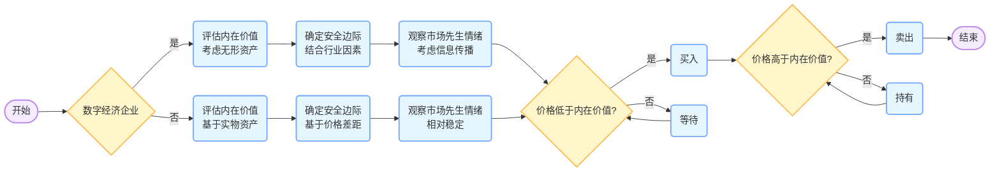

# 格雷厄姆价值投资理念在数字经济时代的新解读

> 关键词：格雷厄姆、价值投资理念、数字经济时代、新解读、投资策略

> 摘要：本文旨在深入探讨格雷厄姆价值投资理念在数字经济时代的新内涵和应用方式。首先介绍了格雷厄姆价值投资理念的背景以及在当今数字经济时代进行重新解读的重要性。接着详细阐述了价值投资理念的核心概念及其在数字经济环境下的联系，通过数学模型和公式分析了其原理，并结合Python代码给出了具体的算法实现。通过项目实战案例，展示了如何在实际投资中运用这些理念。同时探讨了其在数字经济中的实际应用场景，推荐了相关的学习资源、开发工具和论文著作。最后总结了该理念在未来数字经济发展中的趋势与挑战，并对常见问题进行了解答。

## 1. 背景介绍 
### 1.1 目的和范围
本研究的主要目的是重新审视格雷厄姆价值投资理念在数字经济时代的适用性和新的应用方法。在传统经济模式下，格雷厄姆的价值投资理念已经被广泛验证和应用，然而数字经济的兴起带来了新的市场环境、投资标的和风险特征。我们将研究范围聚焦于数字经济领域，包括互联网、大数据、人工智能、区块链等新兴产业，分析格雷厄姆价值投资理念在这些领域的核心要素如何体现和调整，为投资者在数字经济时代提供更具针对性的投资思路和策略。

### 1.2 预期读者
本文预期读者主要包括对价值投资感兴趣的个人投资者、专业投资机构的从业者、金融领域的研究人员以及相关专业的学生。无论是初涉投资领域想要了解价值投资基本原理的新手，还是希望在数字经济浪潮中优化投资策略的专业人士，都能从本文中获得有价值的信息和启示。

### 1.3 文档结构概述
本文共分为十个部分。第一部分为背景介绍，阐述了研究的目的、预期读者和文档结构。第二部分详细解释了格雷厄姆价值投资理念的核心概念以及在数字经济时代这些概念之间的联系。第三部分给出了基于价值投资理念的核心算法原理，并使用Python代码展示了具体的操作步骤。第四部分运用数学模型和公式对价值投资理念进行了深入分析，并举例说明。第五部分通过项目实战案例，展示了如何搭建开发环境、实现源代码以及对代码进行解读和分析。第六部分探讨了价值投资理念在数字经济中的实际应用场景。第七部分推荐了相关的学习资源、开发工具和论文著作。第八部分总结了该理念在未来数字经济发展中的趋势与挑战。第九部分为附录，解答了常见问题。最后一部分提供了扩展阅读和参考资料。

### 1.4 术语表
#### 1.4.1 核心术语定义
- **格雷厄姆价值投资理念**：由本杰明·格雷厄姆提出的投资哲学，强调通过分析公司的基本面，寻找被市场低估的股票，以低于其内在价值的价格买入，并长期持有。
- **数字经济**：以数字化的知识和信息作为关键生产要素，以现代信息网络作为重要载体，以信息通信技术的有效使用作为效率提升和经济结构优化的重要推动力的一系列经济活动。
- **内在价值**：公司的真实价值，基于其未来的现金流、资产状况、盈利能力等基本面因素进行评估。
- **安全边际**：股票的市场价格低于其内在价值的差额，为投资者提供了一定的风险缓冲。

#### 1.4.2 相关概念解释
- **基本面分析**：通过研究公司的财务报表、行业前景、管理团队等基本面因素，评估公司的内在价值和投资价值。
- **市场效率**：市场价格反映所有可用信息的程度。在有效市场中，股票价格能够迅速反映所有公开信息，而在非有效市场中，可能存在价格与内在价值的偏离。
- **数字资产**：以电子数据形式存在的资产，如数字货币、虚拟土地、数字艺术品等，具有独特的价值和风险特征。

#### 1.4.3 缩略词列表
- **PEG**：市盈率相对盈利增长比率（Price/Earnings to Growth Ratio），用于评估股票的估值是否合理，结合了市盈率和盈利增长率两个因素。
- **DCF**：现金流折现法（Discounted Cash Flow），一种评估公司内在价值的方法，通过预测公司未来的现金流并折现到当前来计算其价值。

## 2. 核心概念与联系 

### 2.1 格雷厄姆价值投资理念的核心概念
格雷厄姆价值投资理念的核心包括以下几个方面：
- **内在价值评估**：格雷厄姆认为，每一家公司都有其内在价值，这是基于公司的资产、盈利能力、现金流等基本面因素决定的。投资者的目标是通过深入分析，准确评估公司的内在价值。
- **安全边际原则**：为了降低投资风险，格雷厄姆强调在购买股票时要留有足够的安全边际，即股票的市场价格要显著低于其内在价值。这样即使公司的实际表现不如预期，投资者也能在一定程度上避免损失。
- **市场先生理论**：格雷厄姆将市场比喻为“市场先生”，市场先生每天都会给出一个股票的报价，但这个报价并不总是合理的。投资者应该利用市场先生的情绪波动，在价格低于内在价值时买入，在价格高于内在价值时卖出。

### 2.2 数字经济时代的新变化与联系
在数字经济时代，上述核心概念面临着新的挑战和变化：
- **内在价值评估的复杂性增加**：数字经济企业的资产结构和盈利模式与传统企业有很大不同。传统企业的资产主要是实物资产，如厂房、设备等，而数字经济企业的核心资产往往是数据、技术和知识产权等无形资产。这些无形资产的价值评估更加困难，需要考虑技术的创新性、数据的质量和规模、用户的粘性等因素。
- **安全边际的重新定义**：由于数字经济的快速发展和不确定性，股票价格的波动可能更加剧烈。因此，安全边际的确定需要更加谨慎，不仅要考虑公司的基本面因素，还要考虑行业的竞争格局、技术变革的速度等因素。
- **市场先生的情绪更加复杂**：数字经济时代的信息传播速度更快，市场情绪的波动也更加剧烈。社交媒体、新闻网站等信息渠道的广泛存在，使得市场先生的情绪更容易受到影响。投资者需要更加理性地分析市场信息，避免被市场情绪所左右。

### 2.3 核心概念原理和架构的文本示意图
```plaintext
格雷厄姆价值投资理念
|-- 内在价值评估
|   |-- 传统企业：基于实物资产、盈利能力等
|   |-- 数字经济企业：考虑数据、技术、知识产权等无形资产
|-- 安全边际原则
|   |-- 传统经济：根据市场价格与内在价值的差距确定
|   |-- 数字经济：结合行业竞争、技术变革等因素调整
|-- 市场先生理论
|   |-- 传统市场：情绪波动相对稳定
|   |-- 数字经济市场：信息传播快，情绪波动剧烈
```

### 2.4 Mermaid 流程图


## 3. 核心算法原理 & 具体操作步骤 

### 3.1 核心算法原理
在数字经济时代，评估公司内在价值的一种常用方法是现金流折现法（DCF）。该方法的基本原理是将公司未来的现金流折现到当前，以计算其内在价值。具体步骤如下：
1. **预测未来现金流**：根据公司的历史财务数据、行业发展趋势和市场预测，预测公司未来若干年的自由现金流。
2. **确定折现率**：折现率反映了资金的时间价值和投资风险。通常可以使用加权平均资本成本（WACC）作为折现率。
3. **计算现金流现值**：将预测的未来现金流按照折现率折现到当前，得到现金流的现值。
4. **计算终值**：假设公司在预测期结束后进入稳定增长阶段，计算其终值。
5. **计算内在价值**：将现金流现值和终值相加，得到公司的内在价值。

### 3.2 具体操作步骤及Python代码实现
```python
import numpy as np

def dcf_valuation(free_cash_flows, growth_rate, discount_rate, terminal_growth_rate):
    """
    现金流折现法计算公司内在价值
    :param free_cash_flows: 预测的未来自由现金流列表
    :param growth_rate: 预测期内的增长率
    :param discount_rate: 折现率
    :param terminal_growth_rate: 终值阶段的增长率
    :return: 公司的内在价值
    """
    num_years = len(free_cash_flows)
    # 计算预测期内现金流的现值
    present_values = []
    for i in range(num_years):
        present_value = free_cash_flows[i] / ((1 + discount_rate) ** (i + 1))
        present_values.append(present_value)
    
    # 计算终值
    last_fcf = free_cash_flows[-1] * (1 + growth_rate)
    terminal_value = last_fcf * (1 + terminal_growth_rate) / (discount_rate - terminal_growth_rate)
    terminal_present_value = terminal_value / ((1 + discount_rate) ** num_years)
    
    # 计算内在价值
    intrinsic_value = sum(present_values) + terminal_present_value
    
    return intrinsic_value

# 示例数据
free_cash_flows = [100, 120, 140, 160, 180]  # 预测的未来5年自由现金流
growth_rate = 0.1  # 预测期内的增长率为10%
discount_rate = 0.15  # 折现率为15%
terminal_growth_rate = 0.03  # 终值阶段的增长率为3%

# 计算内在价值
intrinsic_value = dcf_valuation(free_cash_flows, growth_rate, discount_rate, terminal_growth_rate)
print(f"公司的内在价值为: {intrinsic_value:.2f}")
```

### 3.3 代码解释
- **函数定义**：`dcf_valuation` 函数接受四个参数：预测的未来自由现金流列表 `free_cash_flows`、预测期内的增长率 `growth_rate`、折现率 `discount_rate` 和终值阶段的增长率 `terminal_growth_rate`。
- **计算预测期内现金流的现值**：使用循环遍历未来自由现金流列表，将每个现金流按照折现率折现到当前，并将现值添加到 `present_values` 列表中。
- **计算终值**：根据预测期最后一年的现金流和终值阶段的增长率，计算终值。然后将终值折现到当前。
- **计算内在价值**：将预测期内现金流的现值和终值的现值相加，得到公司的内在价值。

## 4. 数学模型和公式 & 详细讲解 & 举例说明 

### 4.1 现金流折现法的数学模型和公式
现金流折现法的核心公式如下：

$$
V = \sum_{t=1}^{n} \frac{FCF_t}{(1 + r)^t} + \frac{FCF_n \times (1 + g)}{(r - g) \times (1 + r)^n}
$$

其中：
- $V$ 表示公司的内在价值。
- $FCF_t$ 表示第 $t$ 年的自由现金流。
- $r$ 表示折现率。
- $n$ 表示预测期的年数。
- $g$ 表示终值阶段的增长率。

### 4.2 详细讲解
- **预测期内现金流的现值**：$\sum_{t=1}^{n} \frac{FCF_t}{(1 + r)^t}$ 这部分表示预测期内每年自由现金流的现值之和。将每年的自由现金流按照折现率 $r$ 折现到当前，反映了资金的时间价值。
- **终值的现值**：$\frac{FCF_n \times (1 + g)}{(r - g) \times (1 + r)^n}$ 这部分表示终值的现值。假设公司在预测期结束后进入稳定增长阶段，使用戈登增长模型计算终值，然后将终值折现到当前。

### 4.3 举例说明
假设一家数字经济公司的预测数据如下：
- 预测未来 5 年的自由现金流分别为 $100$ 万元、$120$ 万元、$140$ 万元、$160$ 万元和 $180$ 万元。
- 预测期内的增长率为 $10\%$。
- 折现率为 $15\%$。
- 终值阶段的增长率为 $3\%$。

根据上述公式计算公司的内在价值：
1. **计算预测期内现金流的现值**：
    - 第 1 年：$\frac{100}{(1 + 0.15)^1} \approx 86.96$ 万元
    - 第 2 年：$\frac{120}{(1 + 0.15)^2} \approx 90.74$ 万元
    - 第 3 年：$\frac{140}{(1 + 0.15)^3} \approx 91.12$ 万元
    - 第 4 年：$\frac{160}{(1 + 0.15)^4} \approx 89.04$ 万元
    - 第 5 年：$\frac{180}{(1 + 0.15)^5} \approx 85.16$ 万元
    - 预测期内现金流现值之和：$86.96 + 90.74 + 91.12 + 89.04 + 85.16 = 443.02$ 万元
2. **计算终值**：
    - 第 6 年的自由现金流：$180 \times (1 + 0.1) = 198$ 万元
    - 终值：$\frac{198 \times (1 + 0.03)}{0.15 - 0.03} = 1699.5$ 万元
    - 终值的现值：$\frac{1699.5}{(1 + 0.15)^5} \approx 833.28$ 万元
3. **计算内在价值**：
    - 内在价值：$443.02 + 833.28 = 1276.3$ 万元

因此，该公司的内在价值约为 $1276.3$ 万元。

## 5. 项目实战：代码实际案例和详细解释说明 

### 5.1  开发环境搭建
#### 5.1.1 安装Python
首先需要安装Python，建议使用Python 3.7及以上版本。可以从Python官方网站（https://www.python.org/downloads/）下载并安装适合自己操作系统的版本。

#### 5.1.2 安装必要的库
本项目需要使用 `numpy` 库进行数值计算。可以使用以下命令进行安装：
```sh
pip install numpy
```

### 5.2  源代码详细实现和代码解读
以下是一个完整的Python代码示例，用于计算数字经济公司的内在价值，并根据安全边际原则判断是否值得投资：
```python
import numpy as np

def dcf_valuation(free_cash_flows, growth_rate, discount_rate, terminal_growth_rate):
    """
    现金流折现法计算公司内在价值
    :param free_cash_flows: 预测的未来自由现金流列表
    :param growth_rate: 预测期内的增长率
    :param discount_rate: 折现率
    :param terminal_growth_rate: 终值阶段的增长率
    :return: 公司的内在价值
    """
    num_years = len(free_cash_flows)
    # 计算预测期内现金流的现值
    present_values = []
    for i in range(num_years):
        present_value = free_cash_flows[i] / ((1 + discount_rate) ** (i + 1))
        present_values.append(present_value)
    
    # 计算终值
    last_fcf = free_cash_flows[-1] * (1 + growth_rate)
    terminal_value = last_fcf * (1 + terminal_growth_rate) / (discount_rate - terminal_growth_rate)
    terminal_present_value = terminal_value / ((1 + discount_rate) ** num_years)
    
    # 计算内在价值
    intrinsic_value = sum(present_values) + terminal_present_value
    
    return intrinsic_value

def investment_decision(intrinsic_value, market_price, safety_margin):
    """
    根据安全边际原则判断是否值得投资
    :param intrinsic_value: 公司的内在价值
    :param market_price: 公司的市场价格
    :param safety_margin: 安全边际比例
    :return: True表示值得投资，False表示不值得投资
    """
    threshold = intrinsic_value * (1 - safety_margin)
    if market_price < threshold:
        return True
    else:
        return False

# 示例数据
free_cash_flows = [100, 120, 140, 160, 180]  # 预测的未来5年自由现金流
growth_rate = 0.1  # 预测期内的增长率为10%
discount_rate = 0.15  # 折现率为15%
terminal_growth_rate = 0.03  # 终值阶段的增长率为3%
market_price = 1000  # 公司的市场价格
safety_margin = 0.2  # 安全边际比例为20%

# 计算内在价值
intrinsic_value = dcf_valuation(free_cash_flows, growth_rate, discount_rate, terminal_growth_rate)
print(f"公司的内在价值为: {intrinsic_value:.2f}")

# 判断是否值得投资
is_worth_investing = investment_decision(intrinsic_value, market_price, safety_margin)
if is_worth_investing:
    print("根据安全边际原则，该公司值得投资。")
else:
    print("根据安全边际原则，该公司不值得投资。")
```

### 5.3  代码解读与分析
- **`dcf_valuation` 函数**：该函数实现了现金流折现法的核心逻辑，通过预测未来自由现金流、确定增长率和折现率，计算公司的内在价值。
- **`investment_decision` 函数**：该函数根据安全边际原则判断是否值得投资。首先计算出内在价值乘以（1 - 安全边际比例）的阈值，然后将市场价格与阈值进行比较，如果市场价格低于阈值，则认为值得投资。
- **主程序**：定义了示例数据，包括预测的未来自由现金流、增长率、折现率、终值阶段的增长率、市场价格和安全边际比例。调用 `dcf_valuation` 函数计算公司的内在价值，并调用 `investment_decision` 函数判断是否值得投资，最后输出结果。

通过这个项目实战案例，我们可以看到如何将格雷厄姆价值投资理念中的内在价值评估和安全边际原则应用到数字经济公司的投资决策中。

## 6. 实际应用场景 
### 6.1 数字经济企业的股权投资
在数字经济时代，许多新兴的互联网、科技企业具有巨大的发展潜力。投资者可以运用格雷厄姆价值投资理念，对这些企业进行基本面分析，评估其内在价值。例如，对于一家人工智能初创企业，可以分析其技术实力、研发团队、市场份额、用户数量等因素，预测其未来的现金流，并使用现金流折现法计算其内在价值。如果该企业的市场价格低于其内在价值，并且有足够的安全边际，投资者可以考虑进行股权投资。

### 6.2 数字资产投资
随着区块链技术的发展，数字资产如比特币、以太坊等逐渐受到关注。虽然数字资产的价值评估相对复杂，但价值投资理念仍然可以提供一定的参考。投资者可以分析数字资产的底层技术、应用场景、市场需求等因素，评估其内在价值。例如，对于一种具有实际应用场景的区块链代币，可以分析其在特定行业的应用前景、用户数量增长趋势等，判断其是否被市场低估。

### 6.3 投资组合管理
在构建投资组合时，投资者可以运用价值投资理念，选择被低估的数字经济资产进行配置。通过分散投资不同行业、不同类型的数字经济企业和数字资产，可以降低投资风险。同时，定期对投资组合进行评估和调整，根据企业的基本面变化和市场价格波动，卖出高估的资产，买入低估的资产，实现投资组合的优化。

### 6.4 企业并购与重组
在数字经济领域，企业并购与重组活动频繁。收购方可以运用价值投资理念，对目标企业进行估值。通过分析目标企业的资产、技术、市场等因素，评估其内在价值，并在交易中争取获得足够的安全边际。同时，在整合过程中，关注企业的协同效应，提高企业的整体价值。

## 7. 工具和资源推荐
### 7.1 学习资源推荐
#### 7.1.1 书籍推荐
- 《聪明的投资者》（The Intelligent Investor）：本杰明·格雷厄姆的经典著作，系统阐述了价值投资的理念和方法，是价值投资者的必读之书。
- 《证券分析》（Security Analysis）：同样是格雷厄姆的著作，对证券分析的基本原理和方法进行了深入探讨，为价值投资提供了坚实的理论基础。
- 《数字经济：中国创新增长新动能》：本书介绍了数字经济的发展现状、趋势和应用场景，帮助读者了解数字经济时代的投资机会和挑战。

#### 7.1.2 在线课程
- Coursera上的“投资学原理”课程：由知名大学教授授课，涵盖了投资的基本概念、理论和方法，包括价值投资理念的讲解。
- 网易云课堂上的“数字经济与创新发展”课程：介绍了数字经济的相关知识和技术，以及如何在数字经济时代进行创新和投资。

#### 7.1.3 技术博客和网站
- Seeking Alpha：一个专业的投资研究网站，提供了大量关于股票、基金等投资标的的分析报告和评论，其中不乏对数字经济企业的价值分析。
- 36氪：专注于新经济领域的媒体平台，及时报道数字经济行业的最新动态、创业公司的发展情况和投资机会。

### 7.2 开发工具框架推荐
#### 7.2.1 IDE和编辑器
- PyCharm：一款专业的Python集成开发环境，提供了丰富的代码编辑、调试和分析功能，适合用于开发基于Python的投资分析程序。
- Jupyter Notebook：一个交互式的开发环境，支持Python等多种编程语言，方便进行数据探索、模型构建和结果展示，非常适合用于投资分析的实验和研究。

#### 7.2.2 调试和性能分析工具
- PDB：Python自带的调试工具，可以帮助开发者定位代码中的错误和问题。
- cProfile：Python的性能分析工具，可以分析代码的运行时间和内存使用情况，帮助开发者优化代码性能。

#### 7.2.3 相关框架和库
- Pandas：一个强大的数据处理和分析库，提供了丰富的数据结构和函数，方便进行财务数据的处理和分析。
- Scikit-learn：一个机器学习库，提供了各种机器学习算法和工具，可用于构建投资预测模型。

### 7.3 相关论文著作推荐
#### 7.3.1 经典论文
- Graham, Benjamin, and David L. Dodd. "Security Analysis." McGraw-Hill, 1934. 这篇经典论文奠定了价值投资的理论基础，对证券分析的方法和原则进行了系统阐述。
- Fama, Eugene F., and Kenneth R. French. "The Cross-Section of Expected Stock Returns." Journal of Finance 47, no. 2 (1992): 427-465. 该论文提出了著名的Fama-French三因子模型，对股票收益率的影响因素进行了深入研究。

#### 7.3.2 最新研究成果
- 近年来，随着数字经济的发展，许多学者对数字经济企业的估值和投资策略进行了研究。可以通过学术数据库如IEEE Xplore、ACM Digital Library等查找相关的最新研究论文。

#### 7.3.3 应用案例分析
- 一些知名的投资机构和研究机构会发布数字经济企业的投资案例分析报告。例如，麦肯锡、波士顿咨询等公司的研究报告可以帮助投资者了解实际应用中的投资策略和方法。

## 8. 总结：未来发展趋势与挑战
### 8.1 未来发展趋势
- **数字化转型加速**：随着数字技术的不断发展，越来越多的传统企业将加速数字化转型，数字经济的规模将不断扩大。这将为价值投资者提供更多的投资机会，特别是那些在数字化转型过程中具有竞争优势的企业。
- **数据资产价值凸显**：在数字经济时代，数据成为重要的生产要素。拥有大量高质量数据的企业将具有更高的价值。未来，价值投资者将更加关注企业的数据资产，以及如何通过数据分析和挖掘实现价值创造。
- **人工智能与投资决策的融合**：人工智能技术在投资领域的应用将越来越广泛。通过机器学习和深度学习算法，可以对大量的财务数据、市场数据和新闻信息进行分析和挖掘，辅助投资者做出更准确的投资决策。

### 8.2 挑战
- **估值难度增加**：数字经济企业的资产结构和盈利模式复杂，无形资产的价值评估困难，这使得准确评估企业的内在价值变得更加具有挑战性。投资者需要不断学习和掌握新的估值方法和技术。
- **技术变革风险**：数字经济领域的技术变革速度快，企业面临着技术被替代的风险。投资者需要密切关注行业技术发展趋势，及时调整投资组合，以应对技术变革带来的风险。
- **市场情绪波动加剧**：数字经济时代的信息传播速度快，市场情绪的波动更加剧烈。投资者需要保持理性，避免被市场情绪所左右，坚持价值投资的原则。

## 9. 附录：常见问题与解答
### 9.1 数字经济企业的内在价值评估与传统企业有哪些不同？
数字经济企业的内在价值评估与传统企业的主要不同在于资产结构和盈利模式。传统企业的资产主要是实物资产，如厂房、设备等，其价值评估相对较为直观。而数字经济企业的核心资产往往是数据、技术和知识产权等无形资产，这些无形资产的价值评估更加困难，需要考虑技术的创新性、数据的质量和规模、用户的粘性等因素。此外，数字经济企业的盈利模式也更加多样化，可能包括广告收入、订阅服务收入、交易手续费等，需要对其盈利模式进行深入分析。

### 9.2 如何确定数字经济企业的安全边际？
确定数字经济企业的安全边际需要综合考虑多个因素。首先，要准确评估企业的内在价值，可以使用现金流折现法、市盈率相对盈利增长比率（PEG）等方法。然后，结合行业的竞争格局、技术变革的速度、市场情绪等因素，确定一个合理的安全边际比例。一般来说，数字经济行业的不确定性较高，安全边际比例可以适当提高。例如，可以将安全边际比例设定为 20% - 30%，即当股票的市场价格低于其内在价值的 20% - 30% 时，才考虑买入。

### 9.3 价值投资理念在数字经济时代是否仍然适用？
价值投资理念在数字经济时代仍然适用。虽然数字经济的发展带来了新的市场环境和投资标的，但价值投资的核心原则，如内在价值评估、安全边际原则和市场先生理论，仍然具有重要的指导意义。在数字经济时代，投资者需要对价值投资理念进行适当的调整和创新，以适应新的变化。例如，在评估数字经济企业的内在价值时，需要考虑数据、技术等无形资产的价值；在确定安全边际时，需要结合行业的特点和风险因素。

### 9.4 如何运用Python进行数字经济企业的投资分析？
可以使用Python进行数字经济企业的投资分析，具体步骤如下：
1. **数据获取**：使用Python的相关库，如 `pandas-datareader` 从金融数据网站获取企业的财务数据、市场数据等。
2. **数据处理和分析**：使用 `pandas` 库对获取的数据进行清洗、整理和分析，计算相关的财务指标，如市盈率、市净率等。
3. **模型构建**：使用 `numpy`、`scikit-learn` 等库构建投资分析模型，如现金流折现模型、回归模型等。
4. **结果展示**：使用 `matplotlib`、`seaborn` 等库将分析结果以图表的形式展示出来，直观地呈现投资分析的结果。

## 10. 扩展阅读 & 参考资料
### 10.1 扩展阅读
- 《创新者的窘境》（The Innovator's Dilemma）：探讨了企业在面对技术变革时的困境和应对策略，对理解数字经济时代企业的发展具有重要的启示。
- 《区块链：技术驱动金融》（Blockchain: The Technical Foundation of Finance）：介绍了区块链技术的原理、应用和发展趋势，帮助读者了解数字资产的底层技术。

### 10.2 参考资料
- Graham, Benjamin. The Intelligent Investor. Harper Business, 2003.
- Damodaran, Aswath. Investment Valuation: Tools and Techniques for Determining the Value of Any Asset. Wiley, 2012.
- Fama, Eugene F., and Kenneth R. French. "Common Risk Factors in the Returns on Stocks and Bonds." Journal of Financial Economics 33, no. 1 (1993): 3-56.

作者：AI天才研究院/AI Genius Institute & 禅与计算机程序设计艺术 /Zen And The Art of Computer Programming