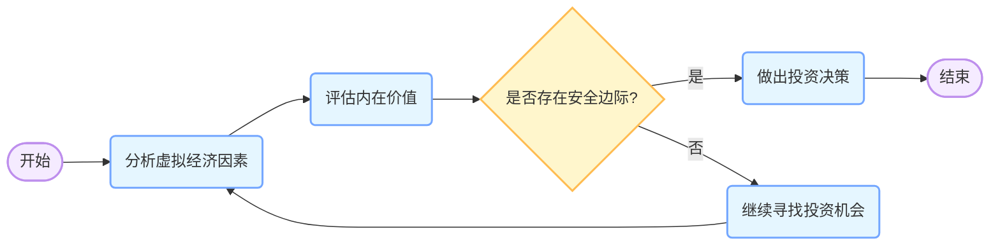

# 格雷厄姆价值投资理念在虚拟经济时代的新解读

> 关键词：格雷厄姆价值投资理念、虚拟经济时代、新解读、投资策略、资产估值

> 摘要：本文聚焦于格雷厄姆价值投资理念在虚拟经济时代的新解读。首先介绍了研究的背景、目的、预期读者、文档结构和相关术语。接着阐述了格雷厄姆价值投资理念的核心概念及其联系，并通过示意图和流程图进行直观展示。深入分析了核心算法原理，结合 Python 代码详细说明具体操作步骤。探讨了相关数学模型和公式，并举例说明其应用。通过项目实战，展示了在虚拟经济场景下运用该理念的代码实现和解读。分析了其在虚拟经济时代的实际应用场景，推荐了学习资源、开发工具框架和相关论文著作。最后总结了未来发展趋势与挑战，解答了常见问题，并提供了扩展阅读和参考资料，旨在为投资者在虚拟经济时代运用价值投资理念提供全面的指导。

## 1. 背景介绍 
### 1.1 目的和范围
在当今虚拟经济蓬勃发展的时代，金融市场的形态和运行机制发生了巨大变化。虚拟资产如数字货币、虚拟股权等不断涌现，市场的波动性和复杂性大幅增加。格雷厄姆作为价值投资理论的奠基人，其投资理念在传统实体经济领域取得了显著成就。然而，虚拟经济与实体经济存在诸多差异，传统的价值投资理念是否仍然适用，以及如何进行调整和创新以适应新的市场环境，成为投资者和研究者关注的焦点。

本文的目的在于深入探讨格雷厄姆价值投资理念在虚拟经济时代的新内涵和应用方式。通过对核心概念、算法原理、数学模型等方面的研究，结合实际案例和应用场景分析，为投资者提供在虚拟经济领域运用价值投资理念的理论支持和实践指导。研究范围涵盖虚拟经济中的主要资产类型，包括但不限于数字货币、虚拟股票、在线平台的虚拟资产等，以及与之相关的投资策略和估值方法。

### 1.2 预期读者
本文的预期读者主要包括以下几类人群：
1. **投资者**：无论是个人投资者还是机构投资者，希望通过了解格雷厄姆价值投资理念在虚拟经济时代的新解读，优化投资组合，提高投资收益，降低投资风险。
2. **金融从业者**：如基金经理、分析师、投资顾问等，需要不断更新知识体系，适应虚拟经济的发展趋势，为客户提供更专业的投资建议。
3. **研究者**：从事金融、投资、经济等领域研究的学者和研究人员，对价值投资理论在新经济环境下的演变和应用感兴趣，希望通过本文获取相关的研究思路和实证资料。
4. **创业者**：在虚拟经济领域创业的企业家和创业者，了解价值投资理念有助于他们更好地评估自身项目的价值，吸引投资者，实现企业的可持续发展。

### 1.3 文档结构概述
本文将按照以下结构进行阐述：
1. **背景介绍**：介绍研究的目的、范围、预期读者、文档结构和相关术语，为后续内容的展开奠定基础。
2. **核心概念与联系**：阐述格雷厄姆价值投资理念的核心概念，包括内在价值、安全边际等，并分析它们在虚拟经济时代的联系和变化，通过示意图和流程图进行直观展示。
3. **核心算法原理 & 具体操作步骤**：深入分析价值投资理念中的核心算法原理，如估值模型等，并使用 Python 代码详细说明具体的操作步骤。
4. **数学模型和公式 & 详细讲解 & 举例说明**：介绍相关的数学模型和公式，如现金流折现模型等，对其进行详细讲解，并通过实际例子说明其在虚拟经济中的应用。
5. **项目实战：代码实际案例和详细解释说明**：通过一个具体的项目实战，展示在虚拟经济场景下运用价值投资理念的代码实现和详细解读，包括开发环境搭建、源代码实现和代码分析。
6. **实际应用场景**：分析格雷厄姆价值投资理念在虚拟经济时代的实际应用场景，如数字货币投资、虚拟企业估值等，并探讨其应用的优势和局限性。
7. **工具和资源推荐**：推荐与价值投资和虚拟经济相关的学习资源、开发工具框架和论文著作，帮助读者进一步深入学习和研究。
8. **总结：未来发展趋势与挑战**：总结格雷厄姆价值投资理念在虚拟经济时代的发展趋势，分析面临的挑战，并对未来的发展方向进行展望。
9. **附录：常见问题与解答**：解答读者在阅读过程中可能遇到的常见问题，提供更详细的解释和说明。
10. **扩展阅读 & 参考资料**：提供相关的扩展阅读材料和参考资料，方便读者进一步查阅和研究。

### 1.4 术语表
#### 1.4.1 核心术语定义
1. **格雷厄姆价值投资理念**：由本杰明·格雷厄姆提出的一种投资哲学，强调通过分析企业的内在价值，以低于内在价值的价格买入股票，从而获得安全边际和长期投资回报。
2. **虚拟经济**：是指相对独立于实体经济的虚拟资本的经济活动，包括金融市场、虚拟资产交易等，其价值往往基于预期和信心。
3. **内在价值**：指资产在未来所能产生的现金流的现值，是评估资产真实价值的重要指标。
4. **安全边际**：投资者买入价格与资产内在价值之间的差值，安全边际越大，投资风险越低。
5. **虚拟资产**：以数字化形式存在的资产，如数字货币、虚拟股权、游戏道具等，其价值取决于市场需求和预期。

#### 1.4.2 相关概念解释
1. **现金流折现模型（DCF）**：一种常用的估值方法，通过预测资产未来的现金流，并将其折现到当前时点，以计算资产的内在价值。
2. **市盈率（P/E）**：股票价格与每股盈利的比率，反映了市场对企业盈利能力的预期。
3. **市净率（P/B）**：股票价格与每股净资产的比率，用于评估企业的资产价值。
4. **市场效率**：指市场价格反映资产内在价值的程度，有效市场中价格能够迅速反映所有可用信息。

#### 1.4.3 缩略词列表
1. **DCF**：Discounted Cash Flow，现金流折现模型
2. **P/E**：Price-to-Earnings Ratio，市盈率
3. **P/B**：Price-to-Book Ratio，市净率

## 2. 核心概念与联系 

### 格雷厄姆价值投资理念的核心概念
格雷厄姆价值投资理念的核心概念主要包括内在价值和安全边际。

#### 内在价值
内在价值是价值投资的基石。格雷厄姆认为，企业的内在价值是其未来所能产生的现金流的现值。在传统经济中，通过分析企业的财务报表、行业前景、竞争优势等因素，可以相对准确地估算企业的内在价值。例如，一家制造企业，其内在价值可以通过预测未来的销售收入、成本、利润等指标，再运用合适的折现率将未来现金流折现到当前时点来计算。

在虚拟经济时代，内在价值的评估变得更加复杂。以数字货币为例，其没有传统意义上的财务报表，其价值主要取决于市场需求、技术创新、社区共识等因素。因此，在评估数字货币的内在价值时，需要考虑更多的非财务因素，如区块链技术的发展前景、数字货币的应用场景、市场竞争格局等。

#### 安全边际
安全边际是价值投资的重要原则。格雷厄姆强调，投资者应该以低于内在价值的价格买入股票，以获得安全边际。安全边际可以为投资者提供一定的缓冲，降低投资风险。例如，如果一家企业的内在价值为每股 100 元，而投资者以每股 80 元的价格买入，那么每股 20 元的差价就是安全边际。

在虚拟经济时代，安全边际的概念同样重要。由于虚拟资产的价格波动较大，投资者更需要通过寻找具有足够安全边际的投资机会来降低风险。例如，在投资数字货币时，如果根据分析认为某种数字货币的内在价值为 100 美元，而当前市场价格为 50 美元，那么 50 美元的差价就是安全边际。

### 核心概念的联系
内在价值和安全边际是相辅相成的关系。内在价值是评估投资对象的基础，而安全边际则是保障投资成功的关键。只有准确评估了投资对象的内在价值，才能确定合理的安全边际。同时，安全边际的存在也为内在价值的评估误差提供了一定的容错空间。

例如，在投资虚拟企业时，投资者首先需要通过各种方法评估该企业的内在价值。如果评估结果显示该企业的内在价值较高，但当前市场价格相对较低，那么就存在较大的安全边际。此时，投资者可以考虑买入该企业的股票或虚拟股权，以获取潜在的投资回报。

### 文本示意图
```plaintext
+----------------+         +----------------+
|   内在价值     | -------> |   安全边际     |
+----------------+         +----------------+
          ^                        |
          |                        |
          |                        v
+----------------+         +----------------+
|  虚拟经济因素  |         |  投资决策      |
+----------------+         +----------------+
```
该示意图展示了内在价值、安全边际、虚拟经济因素和投资决策之间的关系。虚拟经济因素影响内在价值的评估，内在价值的评估结果决定了安全边际的大小，而安全边际则是投资决策的重要依据。

### Mermaid 流程图

该流程图展示了在虚拟经济时代运用格雷厄姆价值投资理念进行投资决策的过程。首先分析虚拟经济因素，然后评估内在价值，根据是否存在安全边际做出投资决策，如果不存在则继续寻找投资机会。

## 3. 核心算法原理 & 具体操作步骤 

### 核心算法原理 - 现金流折现模型（DCF）
现金流折现模型是评估资产内在价值的常用方法之一。其基本原理是将资产未来所能产生的现金流折现到当前时点，以计算资产的内在价值。公式如下：
$$V = \sum_{t=1}^{n} \frac{CF_t}{(1 + r)^t}$$
其中，$V$ 表示资产的内在价值，$CF_t$ 表示第 $t$ 期的现金流，$r$ 表示折现率，$n$ 表示现金流的期数。

在虚拟经济时代，对于一些具有稳定现金流的虚拟资产，如虚拟企业的股权，可以使用现金流折现模型进行估值。例如，一家在线教育平台，其每年的收入和成本相对稳定，可以通过预测未来几年的现金流，并选择合适的折现率，计算出该平台的内在价值。

### 具体操作步骤及 Python 代码实现
以下是使用 Python 实现现金流折现模型的具体步骤和代码：

#### 步骤 1：定义现金流和折现率
首先，需要定义资产未来各期的现金流和折现率。假设我们预测某虚拟企业未来 5 年的现金流分别为 [100, 120, 140, 160, 180] 万元，折现率为 10%。

```python
# 定义现金流
cash_flows = [100, 120, 140, 160, 180]
# 定义折现率
discount_rate = 0.1
```

#### 步骤 2：计算现金流的现值
接下来，使用公式 $\frac{CF_t}{(1 + r)^t}$ 计算各期现金流的现值，并将它们相加得到资产的内在价值。

```python
# 初始化内在价值为 0
intrinsic_value = 0
# 遍历各期现金流
for t, cf in enumerate(cash_flows, start=1):
    # 计算当前期现金流的现值
    present_value = cf / ((1 + discount_rate) ** t)
    # 累加现值到内在价值
    intrinsic_value += present_value

print(f"该虚拟企业的内在价值为: {intrinsic_value} 万元")
```

#### 步骤 3：考虑终值
在实际应用中，为了更准确地评估资产的内在价值，通常需要考虑资产在预测期结束后的终值。终值可以使用永续增长模型来计算，公式如下：
$$TV = \frac{CF_{n+1}}{r - g}$$
其中，$TV$ 表示终值，$CF_{n+1}$ 表示预测期结束后下一期的现金流，$r$ 表示折现率，$g$ 表示永续增长率。

以下是考虑终值的 Python 代码实现：

```python
# 假设预测期结束后下一期的现金流为 200 万元，永续增长率为 3%
terminal_cash_flow = 200
perpetual_growth_rate = 0.03

# 计算终值
terminal_value = terminal_cash_flow / (discount_rate - perpetual_growth_rate)
# 将终值折现到当前时点
terminal_value_present = terminal_value / ((1 + discount_rate) ** len(cash_flows))

# 重新计算内在价值
intrinsic_value_with_terminal = intrinsic_value + terminal_value_present

print(f"考虑终值后，该虚拟企业的内在价值为: {intrinsic_value_with_terminal} 万元")
```

通过以上步骤和代码，我们可以使用现金流折现模型评估虚拟资产的内在价值。需要注意的是，在实际应用中，现金流和折现率的预测需要结合虚拟经济的特点和市场情况进行合理估计。

## 4. 数学模型和公式 & 详细讲解 & 举例说明 

### 现金流折现模型（DCF）
#### 公式详细讲解
现金流折现模型的公式为：
$$V = \sum_{t=1}^{n} \frac{CF_t}{(1 + r)^t}$$
其中：
- $V$：资产的内在价值，即资产在当前时点的理论价值。
- $CF_t$：第 $t$ 期的现金流，表示资产在第 $t$ 期所能产生的现金流入减去现金流出后的净额。现金流的预测需要考虑资产的业务模式、市场需求、竞争状况等因素。
- $r$：折现率，反映了投资者对资产投资的预期回报率，也体现了投资的风险程度。折现率的选择通常基于市场利率、资产的风险水平等因素。
- $n$：现金流的期数，表示预测的时间范围。

#### 举例说明
假设我们要评估一家在线游戏公司的内在价值。通过市场调研和分析，我们预测该公司未来 5 年的现金流分别为 200 万元、250 万元、300 万元、350 万元和 400 万元。同时，考虑到该行业的风险水平，我们选择折现率为 12%。

根据现金流折现模型，我们可以计算该公司的内在价值：

第 1 年现金流的现值：
$$PV_1 = \frac{200}{(1 + 0.12)^1} \approx 178.57 \text{万元}$$

第 2 年现金流的现值：
$$PV_2 = \frac{250}{(1 + 0.12)^2} \approx 199.29 \text{万元}$$

第 3 年现金流的现值：
$$PV_3 = \frac{300}{(1 + 0.12)^3} \approx 213.53 \text{万元}$$

第 4 年现金流的现值：
$$PV_4 = \frac{350}{(1 + 0.12)^4} \approx 222.70 \text{万元}$$

第 5 年现金流的现值：
$$PV_5 = \frac{400}{(1 + 0.12)^5} \approx 226.97 \text{万元}$$

该公司的内在价值为：
$$V = PV_1 + PV_2 + PV_3 + PV_4 + PV_5 \approx 178.57 + 199.29 + 213.53 + 222.70 + 226.97 = 1041.06 \text{万元}$$

### 市盈率（P/E）模型
#### 公式详细讲解
市盈率模型的公式为：
$$P = E \times P/E$$
其中：
- $P$：股票的价格，即市场上该股票的交易价格。
- $E$：每股盈利，表示公司每股股票的盈利水平。
- $P/E$：市盈率，反映了市场对公司盈利能力的预期。市盈率越高，说明市场对公司未来的盈利增长预期越高。

#### 举例说明
假设一家虚拟社交平台公司的每股盈利为 2 元，行业平均市盈率为 20 倍。根据市盈率模型，该公司股票的合理价格为：
$$P = 2 \times 20 = 40 \text{元}$$

如果当前该公司股票的市场价格为 35 元，说明该股票可能被低估，具有一定的投资价值；如果市场价格为 45 元，则说明该股票可能被高估，投资风险相对较高。

### 市净率（P/B）模型
#### 公式详细讲解
市净率模型的公式为：
$$P = B \times P/B$$
其中：
- $P$：股票的价格。
- $B$：每股净资产，表示公司每股股票所对应的净资产价值。
- $P/B$：市净率，用于评估公司的资产价值。市净率越低，说明公司的股票价格相对其净资产价值越低，可能具有一定的投资价值。

#### 举例说明
假设一家虚拟金融科技公司的每股净资产为 10 元，行业平均市净率为 3 倍。根据市净率模型，该公司股票的合理价格为：
$$P = 10 \times 3 = 30 \text{元}$$

如果当前该公司股票的市场价格为 25 元，说明该股票可能被低估；如果市场价格为 35 元，则说明该股票可能被高估。

通过以上数学模型和公式，投资者可以在虚拟经济时代对虚拟资产进行估值，为投资决策提供参考。但需要注意的是，这些模型和公式都有一定的局限性，实际应用中需要结合多种因素进行综合分析。

## 5. 项目实战：代码实际案例和详细解释说明 

### 5.1  开发环境搭建
在进行虚拟经济投资项目实战时，我们选择 Python 作为开发语言，因为 Python 具有丰富的数据分析和科学计算库，能够方便地实现各种投资分析算法。以下是搭建开发环境的具体步骤：

#### 步骤 1：安装 Python
首先，从 Python 官方网站（https://www.python.org/downloads/）下载并安装适合你操作系统的 Python 版本。建议选择 Python 3.7 及以上版本。

#### 步骤 2：安装必要的库
在安装好 Python 后，我们需要安装一些必要的库，如 `numpy`、`pandas`、`matplotlib` 等。可以使用 `pip` 命令进行安装：
```sh
pip install numpy pandas matplotlib
```

#### 步骤 3：选择开发工具
可以选择使用 Jupyter Notebook 或 PyCharm 等开发工具。Jupyter Notebook 适合交互式开发和数据分析，而 PyCharm 则更适合大型项目的开发和调试。

### 5.2  源代码详细实现和代码解读
以下是一个使用现金流折现模型评估虚拟企业内在价值的项目实战代码示例：

```python
import numpy as np
import matplotlib.pyplot as plt

# 定义现金流和折现率
cash_flows = np.array([100, 120, 140, 160, 180])  # 未来 5 年的现金流
discount_rate = 0.1  # 折现率

# 计算各期现金流的现值
periods = np.arange(1, len(cash_flows) + 1)
present_values = cash_flows / ((1 + discount_rate) ** periods)

# 计算内在价值
intrinsic_value = np.sum(present_values)

# 打印结果
print(f"各期现金流的现值: {present_values}")
print(f"该虚拟企业的内在价值为: {intrinsic_value} 万元")

# 绘制现金流现值柱状图
plt.bar(periods, present_values)
plt.xlabel('期数')
plt.ylabel('现金流现值 (万元)')
plt.title('各期现金流现值')
plt.show()
```

#### 代码解读
1. **导入必要的库**：导入 `numpy` 和 `matplotlib.pyplot` 库，`numpy` 用于数值计算，`matplotlib.pyplot` 用于绘制图表。
2. **定义现金流和折现率**：使用 `np.array` 定义未来 5 年的现金流，同时指定折现率为 10%。
3. **计算各期现金流的现值**：使用 `np.arange` 生成期数数组，然后根据现金流折现公式计算各期现金流的现值。
4. **计算内在价值**：使用 `np.sum` 函数将各期现金流的现值相加，得到虚拟企业的内在价值。
5. **打印结果**：打印各期现金流的现值和虚拟企业的内在价值。
6. **绘制图表**：使用 `plt.bar` 函数绘制各期现金流现值的柱状图，直观展示各期现金流的现值分布。

### 5.3  代码解读与分析
通过上述代码，我们可以清晰地看到如何使用 Python 实现现金流折现模型来评估虚拟企业的内在价值。代码的主要优点包括：
1. **简洁性**：使用 `numpy` 库进行数值计算，代码简洁明了，易于理解和维护。
2. **可视化**：使用 `matplotlib` 库绘制图表，将各期现金流的现值直观地展示出来，便于分析和比较。
3. **可扩展性**：代码结构清晰，可以方便地扩展到更复杂的情况，如考虑终值、不同的现金流预测模型等。

然而，代码也存在一些局限性：
1. **现金流预测的不确定性**：代码中假设现金流是已知的，但在实际应用中，现金流的预测是非常困难的，需要考虑多种因素的影响。
2. **折现率的选择**：折现率的选择对内在价值的计算结果影响较大，但代码中只是简单地指定了一个固定的折现率，没有考虑折现率的动态变化。

在实际应用中，需要结合更多的市场信息和专业知识，对现金流和折现率进行合理的预测和调整，以提高估值的准确性。

## 6. 实际应用场景 
### 数字货币投资
在数字货币市场中，格雷厄姆价值投资理念可以帮助投资者筛选出具有投资价值的数字货币。通过分析数字货币的技术基础、应用场景、社区共识等因素，评估其内在价值。例如，对于一些具有创新性技术和广泛应用前景的数字货币，如以太坊，投资者可以通过预测其未来的交易手续费收入、生态系统发展带来的价值增长等，使用现金流折现模型或其他估值方法计算其内在价值。如果当前市场价格低于内在价值，且存在一定的安全边际，投资者可以考虑买入。

同时，安全边际的概念在数字货币投资中尤为重要。由于数字货币市场的波动性较大，价格可能会受到市场情绪、政策法规等因素的影响而大幅波动。投资者在买入数字货币时，应确保有足够的安全边际，以降低投资风险。例如，当某种数字货币的内在价值为 100 美元，而市场价格为 50 美元时，投资者可以考虑买入，但需要注意市场风险和价格波动的可能性。

### 虚拟企业估值
对于虚拟企业，如在线游戏公司、互联网金融平台等，价值投资理念可以用于评估其股权的价值。通过分析企业的财务报表、用户规模、市场份额、竞争优势等因素，确定企业的内在价值。例如，一家在线游戏公司，其收入主要来自游戏充值和广告收入。投资者可以通过预测未来几年的游戏用户增长、付费率提高等因素带来的收入增长，结合成本控制情况，计算出企业的未来现金流。然后使用现金流折现模型或市盈率、市净率等估值方法，评估企业的股权价值。

在虚拟企业估值中，还需要考虑行业的发展趋势和技术创新的影响。例如，随着虚拟现实、人工智能等技术的发展，在线游戏行业可能会迎来新的发展机遇。投资者在评估在线游戏公司的价值时，需要考虑这些技术创新对企业未来发展的影响，以更准确地评估企业的内在价值。

### 虚拟资产交易平台投资
虚拟资产交易平台，如数字货币交易所、虚拟股权交易平台等，也是价值投资的重要应用场景。投资者可以通过分析交易平台的用户数量、交易活跃度、手续费收入、市场竞争力等因素，评估平台的内在价值。例如，一家数字货币交易所，其收入主要来自交易手续费。投资者可以通过预测未来数字货币市场的发展趋势、交易所用户数量的增长、交易活跃度的提高等因素，计算出交易所的未来现金流。然后使用合适的估值方法，评估交易所的股权价值。

同时，投资者还需要关注交易平台的合规性和安全性。在虚拟经济时代，监管政策的变化对交易平台的影响较大。如果交易平台存在合规风险或安全漏洞，可能会导致用户流失和声誉受损，从而影响平台的内在价值。因此，投资者在投资虚拟资产交易平台时，需要综合考虑各种因素，确保投资的安全性和收益性。

## 7. 工具和资源推荐
### 7.1 学习资源推荐
#### 7.1.1 书籍推荐
1. 《聪明的投资者》（The Intelligent Investor）：本杰明·格雷厄姆的经典著作，被誉为价值投资的圣经。书中详细阐述了价值投资的理念、方法和策略，对投资者具有重要的指导意义。
2. 《证券分析》（Security Analysis）：同样是本杰明·格雷厄姆的著作，是价值投资领域的另一部经典之作。该书系统地介绍了证券分析的基本原理和方法，包括财务报表分析、估值模型等。
3. 《巴菲特致股东的信》（Letters to Shareholders of Berkshire Hathaway）：沃伦·巴菲特每年写给伯克希尔·哈撒韦股东的信，包含了巴菲特的投资理念、策略和对市场的看法。通过阅读这些信件，投资者可以深入了解价值投资在实践中的应用。
4. 《数字货币：领导干部读本》：帮助读者了解数字货币的基本概念、技术原理、发展趋势和监管政策，适合对数字货币投资感兴趣的投资者和金融从业者。

#### 7.1.2 在线课程
1. Coursera 上的“投资学原理”（Principles of Investing）课程：由知名高校教授授课，系统介绍投资学的基本原理和方法，包括价值投资、资产定价等内容。
2. edX 上的“金融市场”（Financial Markets）课程：由耶鲁大学教授罗伯特·席勒（Robert Shiller）授课，讲解金融市场的运行机制、投资策略和风险管理等知识。
3. 网易云课堂上的“数字货币投资实战教程”：专门针对数字货币投资的课程，介绍数字货币的投资策略、技术分析方法和风险控制等内容。

#### 7.1.3 技术博客和网站
1. Seeking Alpha：一个知名的金融投资博客平台，提供大量的股票分析、投资策略和市场评论文章，投资者可以从中获取不同的投资观点和分析报告。
2. CoinDesk：专注于数字货币和区块链领域的新闻和分析网站，提供最新的行业动态、技术发展和投资机会分析。
3. 雪球网：国内知名的投资社区，投资者可以在上面交流投资经验、分享研究报告和讨论市场行情。

### 7.2 开发工具框架推荐
#### 7.2.1 IDE和编辑器
1. PyCharm：一款专业的 Python 集成开发环境，具有代码编辑、调试、自动补全、版本控制等功能，适合开发大型的 Python 投资分析项目。
2. Jupyter Notebook：一个交互式的开发环境，支持 Python、R 等多种编程语言。它以网页的形式展示代码和结果，方便进行数据分析和可视化，适合进行投资模型的验证和测试。
3. Visual Studio Code：一款轻量级的代码编辑器，支持多种编程语言和插件扩展。它具有简洁的界面和强大的功能，适合快速开发和调试投资分析脚本。

#### 7.2.2 调试和性能分析工具
1. pdb：Python 自带的调试器，可以帮助开发者定位代码中的错误和问题。通过设置断点、单步执行等功能，开发者可以深入了解代码的执行过程。
2. cProfile：Python 的性能分析工具，可以统计代码中各个函数的执行时间和调用次数，帮助开发者找出代码中的性能瓶颈，进行优化。
3. Memory Profiler：用于分析 Python 代码的内存使用情况，帮助开发者找出内存泄漏和高内存占用的问题。

#### 7.2.3 相关框架和库
1. numpy：一个用于科学计算的 Python 库，提供了高效的数组操作和数学函数，是进行投资分析和数值计算的基础库。
2. pandas：一个用于数据处理和分析的 Python 库，提供了数据结构和数据分析工具，如数据读取、清洗、统计分析等功能，方便处理和分析金融数据。
3. matplotlib：一个用于数据可视化的 Python 库，提供了丰富的绘图函数和工具，如折线图、柱状图、散点图等，帮助投资者直观地展示数据和分析结果。

### 7.3 相关论文著作推荐
#### 7.3.1 经典论文
1. “The Theory of Investment Value”（投资价值理论）：由约翰·伯尔·威廉姆斯（John Burr Williams）撰写，提出了现金流折现模型的基本思想，是价值投资理论的重要基础。
2. “Security Analysis”（证券分析）：本杰明·格雷厄姆和戴维·多德（David Dodd）的经典论文，系统地阐述了证券分析的方法和原则，对价值投资理论的发展产生了深远影响。
3. “Efficient Capital Markets: A Review of Theory and Empirical Work”（有效资本市场：理论与实证研究综述）：由尤金·法玛（Eugene F. Fama）撰写，提出了有效市场假说，对金融市场的研究和投资策略的制定具有重要意义。

#### 7.3.2 最新研究成果
1. “Blockchain Technology and Cryptocurrencies: A Survey”（区块链技术与数字货币：综述）：对区块链技术和数字货币的发展现状、技术原理、应用场景和监管政策进行了全面的综述和分析。
2. “Valuation of Cryptocurrencies: A Cash-Flow Approach”（数字货币估值：现金流方法）：探讨了使用现金流折现模型对数字货币进行估值的方法和应用。
3. “The Impact of Digital Economy on Traditional Investment Theories”（数字经济对传统投资理论的影响）：研究了数字经济时代传统投资理论的适用性和局限性，以及如何进行创新和改进。

#### 7.3.3 应用案例分析
1. “Case Studies in Value Investing”（价值投资案例分析）：通过实际案例分析，介绍了价值投资理念在不同行业和市场环境中的应用和实践经验。
2. “Investment Strategies in the Cryptocurrency Market”（数字货币市场投资策略）：分析了数字货币市场的特点和投资策略，包括价值投资、技术分析、量化投资等方法在数字货币投资中的应用。
3. “Valuation and Investment Analysis of Virtual Enterprises”（虚拟企业估值与投资分析）：探讨了虚拟企业的估值方法和投资分析策略，结合实际案例进行了详细的分析和讲解。

## 8. 总结：未来发展趋势与挑战
### 未来发展趋势
#### 融合新兴技术
随着人工智能、大数据、区块链等新兴技术的不断发展，格雷厄姆价值投资理念将与这些技术深度融合。人工智能和大数据技术可以帮助投资者更准确地分析市场数据、预测资产的内在价值和价格走势。例如，通过机器学习算法对海量的金融数据进行分析，挖掘潜在的投资机会。区块链技术则可以提高投资交易的透明度和安全性，降低交易成本。

#### 拓展投资领域
虚拟经济的发展将不断拓展价值投资的领域。除了现有的数字货币、虚拟企业等领域，未来可能会出现更多新型的虚拟资产，如虚拟艺术品、虚拟土地等。价值投资理念将应用于这些新兴领域，为投资者提供更多的投资选择。

#### 强调社会责任投资
在虚拟经济时代，投资者越来越关注企业的社会责任和可持续发展。未来，价值投资理念将更加注重企业的社会责任表现，将环境、社会和治理（ESG）因素纳入投资决策的考虑范围。投资者不仅关注企业的财务绩效，还关注企业在环境保护、社会公平、公司治理等方面的表现。

### 挑战
#### 数据准确性和可靠性
在虚拟经济中，数据的准确性和可靠性是一个重要的挑战。虚拟资产的交易数据、市场信息等可能存在不完整、不准确甚至虚假的情况。投资者在使用这些数据进行分析和决策时，需要谨慎判断，确保数据的质量。

#### 市场波动性和不确定性
虚拟经济市场的波动性和不确定性较大，价格容易受到市场情绪、政策法规、技术创新等因素的影响。这使得价值投资理念在虚拟经济时代的应用更加困难，投资者需要更加敏锐地捕捉市场变化，及时调整投资策略。

#### 监管政策的不确定性
虚拟经济的发展给监管带来了新的挑战，监管政策的不确定性增加。不同国家和地区对虚拟资产的监管态度和政策存在差异，政策的变化可能会对虚拟资产的市场价格和投资价值产生重大影响。投资者需要密切关注监管政策的变化，及时调整投资组合。

## 9. 附录：常见问题与解答
### 问题 1：格雷厄姆价值投资理念在虚拟经济时代是否仍然适用？
答：格雷厄姆价值投资理念的核心思想，如关注内在价值和安全边际，在虚拟经济时代仍然适用。虽然虚拟经济与实体经济存在差异，但资产的价值最终还是取决于其未来所能产生的现金流。通过合理评估虚拟资产的内在价值，并寻找具有安全边际的投资机会，投资者仍然可以运用价值投资理念获得投资回报。然而，在虚拟经济时代，需要对传统的价值投资方法进行适当的调整和创新，以适应虚拟资产的特点和市场环境。

### 问题 2：如何评估虚拟资产的内在价值？
答：评估虚拟资产的内在价值是一个复杂的过程，需要综合考虑多种因素。对于具有稳定现金流的虚拟资产，如虚拟企业的股权，可以使用现金流折现模型进行估值。对于数字货币等没有传统财务报表的虚拟资产，可以从技术基础、应用场景、社区共识、市场需求等方面进行分析。同时，还可以参考行业平均市盈率、市净率等指标，结合市场情况进行综合判断。

### 问题 3：在虚拟经济时代，如何确定安全边际？
答：在虚拟经济时代，确定安全边际需要考虑虚拟资产的特点和市场波动性。首先，要准确评估虚拟资产的内在价值。然后，根据市场情况和投资风险偏好，确定一个合理的安全边际比例。例如，如果认为某种虚拟资产的内在价值为 100 元，根据市场波动性和风险情况，确定安全边际比例为 30%，那么当该虚拟资产的市场价格低于 70 元时，就可以认为存在安全边际。需要注意的是，安全边际的确定需要结合具体的投资情况进行灵活调整。

### 问题 4：虚拟经济市场的波动性较大，如何降低投资风险？
答：为了降低在虚拟经济市场的投资风险，可以采取以下措施：
1. **分散投资**：将资金分散投资于不同类型的虚拟资产，如数字货币、虚拟企业股权等，以降低单一资产波动对投资组合的影响。
2. **严格控制仓位**：合理控制投资仓位，避免过度投资。可以根据自己的风险承受能力和投资目标，确定每个投资项目的仓位比例。
3. **深入研究和分析**：在投资前，对虚拟资产进行深入的研究和分析，了解其内在价值、市场前景和风险因素。避免盲目跟风投资。
4. **设置止损和止盈点**：在投资过程中，设置合理的止损和止盈点，及时止损和锁定收益，避免损失过大或错失盈利机会。

### 问题 5：监管政策对虚拟经济投资有哪些影响？
答：监管政策对虚拟经济投资具有重要影响。一方面，合理的监管政策可以规范市场秩序，保护投资者的合法权益，促进虚拟经济的健康发展。例如，加强对数字货币交易平台的监管，可以防范洗钱、诈骗等违法行为，提高市场的透明度和安全性。另一方面，监管政策的变化可能会导致市场价格的波动和投资机会的变化。例如，某些国家或地区对数字货币的监管收紧，可能会导致数字货币价格下跌，投资者需要及时调整投资策略。因此，投资者需要密切关注监管政策的变化，及时了解政策动态，以应对可能的风险和机遇。

## 10. 扩展阅读 & 参考资料
### 扩展阅读
1. 《区块链革命：比特币底层技术如何改变货币、商业和世界》（The Blockchain Revolution: How the Technology Behind Bitcoin Is Changing Money, Business, and the World）：深入介绍了区块链技术的原理、应用和发展趋势，以及对金融和商业领域的影响。
2. 《数字经济：新时代的新引擎》（Digital Economy: The New Engine of the New Era）：探讨了数字经济的概念、特点和发展趋势，以及数字经济对传统经济和社会的影响。
3. 《金融科技：重塑金融未来》（Fintech: Reshaping the Future of Finance）：介绍了金融科技的发展现状、技术应用和创新模式，以及对金融行业的变革和挑战。

### 参考资料
1. Graham, B., & Dodd, D. L. (1934). Security Analysis. McGraw-Hill.
2. Graham, B. (1949). The Intelligent Investor. Harper & Brothers.
3. Fama, E. F. (1970). Efficient Capital Markets: A Review of Theory and Empirical Work. The Journal of Finance, 25(2), 383-417.
4. Williams, J. B. (1938). The Theory of Investment Value. Harvard University Press.

作者：AI天才研究院/AI Genius Institute & 禅与计算机程序设计艺术 /Zen And The Art of Computer Programming