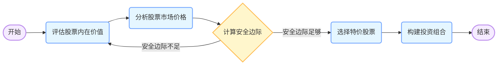

# 格雷厄姆安全边际理念在特价股票中的应用

> 关键词：格雷厄姆、安全边际理念、特价股票、价值投资、股票估值

> 摘要：本文深入探讨了格雷厄姆安全边际理念在特价股票投资中的应用。首先介绍了该理念的背景和相关概念，详细阐述了核心概念及联系，包括安全边际的原理和架构。接着分析了核心算法原理，并用 Python 代码进行了说明，同时给出了相关数学模型和公式。通过实际项目案例展示了如何运用该理念进行特价股票投资，包括开发环境搭建、源代码实现和代码解读。还探讨了该理念的实际应用场景，推荐了学习资源、开发工具框架和相关论文著作。最后总结了未来发展趋势与挑战，并对常见问题进行了解答。

## 1. 背景介绍 
### 1.1 目的和范围
本文章的主要目的是全面深入地研究格雷厄姆安全边际理念在特价股票投资中的具体应用。我们将探讨如何利用这一理念识别具有投资价值的特价股票，评估其潜在风险和收益，以及构建合理的投资策略。范围涵盖了安全边际理念的理论基础、相关算法和数学模型，以及在实际股票投资项目中的应用案例。

### 1.2 预期读者
本文预期读者主要包括对价值投资感兴趣的投资者，无论是个人投资者还是专业投资机构的从业者。同时，也适合金融专业的学生、研究人员，以及希望深入了解股票投资理论和实践的技术人员。

### 1.3 文档结构概述
本文将按照以下结构进行组织：首先介绍背景知识，包括目的、预期读者和文档结构概述等。接着阐述核心概念与联系，通过文本示意图和 Mermaid 流程图展示安全边际理念的原理和架构。然后详细讲解核心算法原理和具体操作步骤，并用 Python 代码进行实现。之后给出相关数学模型和公式，并进行详细讲解和举例说明。通过项目实战部分展示如何在实际中应用该理念，包括开发环境搭建、源代码实现和代码解读。还会探讨该理念的实际应用场景，推荐相关的学习资源、开发工具框架和论文著作。最后总结未来发展趋势与挑战，解答常见问题，并提供扩展阅读和参考资料。

### 1.4 术语表
#### 1.4.1 核心术语定义
- **格雷厄姆安全边际理念**：由本杰明·格雷厄姆提出的一种投资理念，强调在投资时要预留足够的安全空间，以应对可能的风险和不确定性。通过低估股票的内在价值，以低于内在价值的价格买入股票，从而降低投资风险。
- **特价股票**：指市场价格明显低于其内在价值的股票。这些股票可能由于市场情绪、行业短期困境或公司个别事件等原因被低估。
- **内在价值**：股票所代表的企业的真实价值，是基于企业的基本面因素，如盈利能力、资产状况、现金流等进行评估的价值。

#### 1.4.2 相关概念解释
- **价值投资**：一种投资策略，强调通过分析股票的内在价值，寻找被低估的股票进行投资，以获取长期的投资回报。格雷厄姆安全边际理念是价值投资的重要组成部分。
- **股票估值**：对股票内在价值进行评估的过程。常用的估值方法包括市盈率法、市净率法、现金流折现法等。

#### 1.4.3 缩略词列表
- **PE**：市盈率（Price-to-Earnings Ratio），指股票价格与每股收益的比率，用于衡量股票的估值水平。
- **PB**：市净率（Price-to-Book Ratio），指股票价格与每股净资产的比率，反映了股票价格相对于公司净资产的倍数。

## 2. 核心概念与联系 
### 核心概念原理
格雷厄姆安全边际理念的核心原理是通过对股票内在价值的评估，寻找价格明显低于内在价值的特价股票进行投资。内在价值是企业基本面的综合体现，包括企业的盈利能力、资产状况、现金流等因素。而市场价格则受到市场供求关系、投资者情绪等多种因素的影响，常常会出现偏离内在价值的情况。当市场价格低于内在价值时，就形成了安全边际。

投资者通过购买具有安全边际的特价股票，可以在降低投资风险的同时，获得潜在的投资回报。即使市场价格继续下跌，由于股票本身具有较高的内在价值，投资者也有较大的缓冲空间。而当市场价格回归到内在价值甚至高于内在价值时，投资者就可以获得可观的收益。

### 架构的文本示意图
```plaintext
格雷厄姆安全边际理念
|
|-- 内在价值评估
|   |-- 盈利能力分析
|   |   |-- 净利润
|   |   |-- 毛利率
|   |   |-- 净利率
|   |-- 资产状况分析
|   |   |-- 净资产
|   |   |-- 资产负债率
|   |-- 现金流分析
|       |-- 经营活动现金流
|       |-- 自由现金流
|
|-- 市场价格分析
|   |-- 股票当前价格
|   |-- 价格波动情况
|
|-- 安全边际计算
|   |-- 内在价值 - 市场价格
|   |-- 安全边际率 = （内在价值 - 市场价格） / 内在价值
|
|-- 投资决策
|   |-- 选择具有足够安全边际的特价股票
|   |-- 构建投资组合
```

### Mermaid 流程图


## 3. 核心算法原理 & 具体操作步骤 
### 核心算法原理
格雷厄姆安全边际理念的核心算法主要涉及股票内在价值的评估和安全边际的计算。以下是一种常用的内在价值评估方法——现金流折现法（DCF）的原理：

现金流折现法认为，股票的内在价值等于其未来预期现金流的现值之和。假设企业在未来 $n$ 年的自由现金流分别为 $FCF_1, FCF_2, \cdots, FCF_n$，折现率为 $r$，则股票的内在价值 $V$ 可以通过以下公式计算：

$$V = \sum_{i=1}^{n} \frac{FCF_i}{(1 + r)^i} + \frac{TV}{(1 + r)^n}$$

其中，$TV$ 为企业的终值，通常可以采用永续增长模型进行计算：

$$TV = \frac{FCF_n(1 + g)}{r - g}$$

这里，$g$ 为企业的永续增长率。

安全边际的计算则是通过比较内在价值 $V$ 和市场价格 $P$ 来实现的。安全边际率 $MSR$ 的计算公式为：

$$MSR = \frac{V - P}{V}$$

### 具体操作步骤
1. **收集数据**：收集企业的财务报表，包括利润表、资产负债表和现金流量表，获取相关的财务数据，如净利润、自由现金流等。同时，获取股票的当前市场价格。
2. **预测未来现金流**：根据企业的历史财务数据和行业发展趋势，预测企业未来 $n$ 年的自由现金流。可以采用线性回归、时间序列分析等方法进行预测。
3. **确定折现率**：折现率反映了投资者对投资风险的要求。可以采用资本资产定价模型（CAPM）来确定折现率：

$$r = R_f + \beta (R_m - R_f)$$

其中，$R_f$ 为无风险利率，$\beta$ 为股票的贝塔系数，$R_m$ 为市场平均收益率。

4. **计算内在价值**：根据上述公式，计算股票的内在价值 $V$。
5. **计算安全边际率**：根据内在价值 $V$ 和市场价格 $P$，计算安全边际率 $MSR$。
6. **投资决策**：如果安全边际率大于设定的阈值（如 20%），则认为该股票具有足够的安全边际，可以考虑买入；否则，继续寻找其他具有安全边际的股票。

### Python 代码实现
```python
import numpy as np

def calculate_fcf_growth_rate(fcf_history):
    """
    计算自由现金流的增长率
    :param fcf_history: 历史自由现金流列表
    :return: 增长率
    """
    growth_rates = []
    for i in range(1, len(fcf_history)):
        growth_rate = (fcf_history[i] - fcf_history[i-1]) / fcf_history[i-1]
        growth_rates.append(growth_rate)
    return np.mean(growth_rates)

def calculate_terminal_value(fcf_n, g, r):
    """
    计算企业的终值
    :param fcf_n: 第 n 年的自由现金流
    :param g: 永续增长率
    :param r: 折现率
    :return: 终值
    """
    return fcf_n * (1 + g) / (r - g)

def calculate_intrinsic_value(fcf_history, r, g, n):
    """
    计算股票的内在价值
    :param fcf_history: 历史自由现金流列表
    :param r: 折现率
    :param g: 永续增长率
    :param n: 预测年限
    :return: 内在价值
    """
    # 计算未来每年的自由现金流
    fcf_growth_rate = calculate_fcf_growth_rate(fcf_history)
    fcf_forecast = []
    last_fcf = fcf_history[-1]
    for i in range(n):
        fcf = last_fcf * (1 + fcf_growth_rate)
        fcf_forecast.append(fcf)
        last_fcf = fcf

    # 计算终值
    terminal_value = calculate_terminal_value(fcf_forecast[-1], g, r)

    # 计算现值
    present_values = []
    for i in range(n):
        present_value = fcf_forecast[i] / ((1 + r) ** (i + 1))
        present_values.append(present_value)
    present_value_terminal = terminal_value / ((1 + r) ** n)

    # 计算内在价值
    intrinsic_value = sum(present_values) + present_value_terminal
    return intrinsic_value

def calculate_margin_of_safety(intrinsic_value, market_price):
    """
    计算安全边际率
    :param intrinsic_value: 内在价值
    :param market_price: 市场价格
    :return: 安全边际率
    """
    return (intrinsic_value - market_price) / intrinsic_value

# 示例数据
fcf_history = [100, 110, 120, 130, 140]  # 历史自由现金流
r = 0.1  # 折现率
g = 0.03  # 永续增长率
n = 5  # 预测年限
market_price = 500  # 市场价格

# 计算内在价值
intrinsic_value = calculate_intrinsic_value(fcf_history, r, g, n)

# 计算安全边际率
margin_of_safety = calculate_margin_of_safety(intrinsic_value, market_price)

print(f"内在价值: {intrinsic_value}")
print(f"安全边际率: {margin_of_safety * 100:.2f}%")
```

## 4. 数学模型和公式 & 详细讲解 & 举例说明 
### 现金流折现法（DCF）
#### 公式
$$V = \sum_{i=1}^{n} \frac{FCF_i}{(1 + r)^i} + \frac{TV}{(1 + r)^n}$$

$$TV = \frac{FCF_n(1 + g)}{r - g}$$

#### 详细讲解
- **$V$**：股票的内在价值，即企业未来预期现金流的现值之和。
- **$FCF_i$**：第 $i$ 年的自由现金流，反映了企业在该年能够自由支配的现金流量。
- **$r$**：折现率，考虑了投资的风险和机会成本。折现率越高，未来现金流的现值越低。
- **$n$**：预测年限，通常根据企业的发展阶段和行业特点进行确定。
- **$TV$**：企业的终值，假设企业在预测年限之后将以永续增长率 $g$ 持续增长。
- **$g$**：永续增长率，一般取值较低，反映了企业长期的稳定增长能力。

#### 举例说明
假设一家企业的历史自由现金流分别为 100 万元、110 万元、120 万元、130 万元、140 万元，预测年限为 5 年，折现率为 10%，永续增长率为 3%。

首先，计算自由现金流的增长率：

$$g_{FCF} = \frac{(110 - 100) / 100 + (120 - 110) / 110 + (130 - 120) / 120 + (140 - 130) / 130}{4} \approx 0.095$$

然后，预测未来 5 年的自由现金流：

| 年份 | 自由现金流（万元） |
| ---- | ---- |
| 1 | $140 \times (1 + 0.095) \approx 153.3$ |
| 2 | $153.3 \times (1 + 0.095) \approx 167.9$ |
| 3 | $167.9 \times (1 + 0.095) \approx 184.0$ |
| 4 | $184.0 \times (1 + 0.095) \approx 201.5$ |
| 5 | $201.5 \times (1 + 0.095) \approx 220.6$ |

接着，计算终值：

$$TV = \frac{220.6 \times (1 + 0.03)}{0.1 - 0.03} \approx 3238.9$$

再计算现值：

| 年份 | 自由现金流（万元） | 现值（万元） |
| ---- | ---- | ---- |
| 1 | 153.3 | $153.3 / (1 + 0.1)^1 \approx 139.4$ |
| 2 | 167.9 | $167.9 / (1 + 0.1)^2 \approx 138.8$ |
| 3 | 184.0 | $184.0 / (1 + 0.1)^3 \approx 138.3$ |
| 4 | 201.5 | $201.5 / (1 + 0.1)^4 \approx 137.8$ |
| 5 | 220.6 | $220.6 / (1 + 0.1)^5 \approx 137.3$ |
| 终值 | 3238.9 | $3238.9 / (1 + 0.1)^5 \approx 2009.2$ |

最后，计算内在价值：

$$V = 139.4 + 138.8 + 138.3 + 137.8 + 137.3 + 2009.2 = 2600.8$$

如果该股票的市场价格为 2000 万元，则安全边际率为：

$$MSR = \frac{2600.8 - 2000}{2600.8} \approx 0.231 = 23.1\%$$

### 资本资产定价模型（CAPM）
#### 公式
$$r = R_f + \beta (R_m - R_f)$$

#### 详细讲解
- **$r$**：股票的预期收益率，即折现率。
- **$R_f$**：无风险利率，通常可以用国债收益率来表示。
- **$\beta$**：股票的贝塔系数，反映了股票相对于市场的波动程度。$\beta > 1$ 表示股票的波动比市场大，$\beta < 1$ 表示股票的波动比市场小。
- **$R_m$**：市场平均收益率，通常可以用股票市场指数的收益率来表示。

#### 举例说明
假设无风险利率 $R_f = 3\%$，市场平均收益率 $R_m = 10\%$，某股票的贝塔系数 $\beta = 1.2$。

则该股票的预期收益率（折现率）为：

$$r = 3\% + 1.2 \times (10\% - 3\%) = 11.4\%$$

## 5. 项目实战：代码实际案例和详细解释说明 
### 5.1  开发环境搭建
#### 安装 Python
首先，需要安装 Python 编程语言。可以从 Python 官方网站（https://www.python.org/downloads/）下载适合自己操作系统的 Python 版本，并按照安装向导进行安装。

#### 安装必要的库
在项目中，我们需要使用一些 Python 库来处理数据和进行计算，如 `numpy`、`pandas` 等。可以使用 `pip` 命令来安装这些库：

```sh
pip install numpy pandas
```

### 5.2  源代码详细实现和代码解读
```python
import numpy as np
import pandas as pd

def calculate_fcf_growth_rate(fcf_history):
    """
    计算自由现金流的增长率
    :param fcf_history: 历史自由现金流列表
    :return: 增长率
    """
    growth_rates = []
    for i in range(1, len(fcf_history)):
        growth_rate = (fcf_history[i] - fcf_history[i-1]) / fcf_history[i-1]
        growth_rates.append(growth_rate)
    return np.mean(growth_rates)

def calculate_terminal_value(fcf_n, g, r):
    """
    计算企业的终值
    :param fcf_n: 第 n 年的自由现金流
    :param g: 永续增长率
    :param r: 折现率
    :return: 终值
    """
    return fcf_n * (1 + g) / (r - g)

def calculate_intrinsic_value(fcf_history, r, g, n):
    """
    计算股票的内在价值
    :param fcf_history: 历史自由现金流列表
    :param r: 折现率
    :param g: 永续增长率
    :param n: 预测年限
    :return: 内在价值
    """
    # 计算未来每年的自由现金流
    fcf_growth_rate = calculate_fcf_growth_rate(fcf_history)
    fcf_forecast = []
    last_fcf = fcf_history[-1]
    for i in range(n):
        fcf = last_fcf * (1 + fcf_growth_rate)
        fcf_forecast.append(fcf)
        last_fcf = fcf

    # 计算终值
    terminal_value = calculate_terminal_value(fcf_forecast[-1], g, r)

    # 计算现值
    present_values = []
    for i in range(n):
        present_value = fcf_forecast[i] / ((1 + r) ** (i + 1))
        present_values.append(present_value)
    present_value_terminal = terminal_value / ((1 + r) ** n)

    # 计算内在价值
    intrinsic_value = sum(present_values) + present_value_terminal
    return intrinsic_value

def calculate_margin_of_safety(intrinsic_value, market_price):
    """
    计算安全边际率
    :param intrinsic_value: 内在价值
    :param market_price: 市场价格
    :return: 安全边际率
    """
    return (intrinsic_value - market_price) / intrinsic_value

# 示例数据
data = {
    '年份': [2016, 2017, 2018, 2019, 2020],
    '自由现金流': [100, 110, 120, 130, 140]
}
df = pd.DataFrame(data)
fcf_history = df['自由现金流'].tolist()

r = 0.1  # 折现率
g = 0.03  # 永续增长率
n = 5  # 预测年限
market_price = 500  # 市场价格

# 计算内在价值
intrinsic_value = calculate_intrinsic_value(fcf_history, r, g, n)

# 计算安全边际率
margin_of_safety = calculate_margin_of_safety(intrinsic_value, market_price)

print(f"内在价值: {intrinsic_value}")
print(f"安全边际率: {margin_of_safety * 100:.2f}%")
```

### 代码解读与分析
#### 函数功能解读
- `calculate_fcf_growth_rate`：该函数用于计算历史自由现金流的平均增长率。通过遍历历史自由现金流列表，计算相邻两年的增长率，并取平均值。
- `calculate_terminal_value`：该函数根据第 $n$ 年的自由现金流、永续增长率和折现率，计算企业的终值。
- `calculate_intrinsic_value`：该函数是核心函数，用于计算股票的内在价值。首先计算未来每年的自由现金流，然后计算终值，接着计算各年自由现金流和终值的现值，最后将现值相加得到内在价值。
- `calculate_margin_of_safety`：该函数根据内在价值和市场价格，计算安全边际率。

#### 数据处理与计算流程
1. 定义示例数据，包括历史自由现金流、折现率、永续增长率、预测年限和市场价格。
2. 调用 `calculate_intrinsic_value` 函数计算股票的内在价值。
3. 调用 `calculate_margin_of_safety` 函数计算安全边际率。
4. 打印内在价值和安全边际率。

## 6. 实际应用场景 
### 个人投资者
对于个人投资者来说，格雷厄姆安全边际理念可以帮助他们在股票投资中降低风险，提高投资回报。个人投资者可以通过分析股票的内在价值，寻找具有安全边际的特价股票进行投资。例如，当市场出现恐慌性下跌时，很多股票的价格会大幅下跌，此时个人投资者可以利用安全边际理念，筛选出那些被低估的股票，在价格较低时买入，等待市场价格回归到内在价值，从而获得收益。

### 专业投资机构
专业投资机构，如基金公司、证券公司等，也广泛应用格雷厄姆安全边际理念进行投资决策。投资机构可以通过建立专业的研究团队，对大量的股票进行深入分析，评估其内在价值和安全边际。在构建投资组合时，优先选择具有较高安全边际的股票，以降低投资组合的风险。同时，投资机构还可以利用安全边际理念进行风险管理，当股票的安全边际降低到一定程度时，及时调整投资组合。

### 企业并购
在企业并购领域，格雷厄姆安全边际理念也具有重要的应用价值。收购方在评估目标企业的价值时，可以采用现金流折现法等方法计算目标企业的内在价值，并考虑安全边际。只有当收购价格低于目标企业的内在价值，且具有足够的安全边际时，收购才具有投资价值。这样可以降低收购风险，提高并购的成功率。

## 7. 工具和资源推荐
### 7.1 学习资源推荐
#### 7.1.1 书籍推荐
- 《聪明的投资者》（The Intelligent Investor）：本杰明·格雷厄姆的经典著作，详细阐述了价值投资的理念和方法，包括安全边际理念的应用。
- 《证券分析》（Security Analysis）：同样是格雷厄姆的著作，是价值投资领域的奠基之作，对股票和债券的分析方法进行了深入探讨。
- 《巴菲特致股东的信：股份公司教程》（Letters to Shareholders of Berkshire Hathaway）：沃伦·巴菲特每年写给股东的信，其中包含了很多关于价值投资和安全边际的思想和实践经验。

#### 7.1.2 在线课程
- Coursera 上的“投资学原理”（Principles of Investing）课程：该课程由知名教授授课，涵盖了投资学的基本原理和方法，包括价值投资和安全边际的内容。
- 网易云课堂上的“价值投资实战训练营”：通过实际案例分析，讲解价值投资的理念和方法，帮助学员掌握安全边际的应用。

#### 7.1.3 技术博客和网站
- 雪球网（https://xueqiu.com/）：国内知名的投资社区，有很多投资者分享关于价值投资和安全边际的经验和观点。
- 价值投资网（https://www.value-investing.info/）：专注于价值投资领域，提供了丰富的研究报告和分析文章，有助于深入了解安全边际理念。

### 7.2 开发工具框架推荐
#### 7.2.1 IDE和编辑器
- PyCharm：一款专业的 Python 集成开发环境，具有代码编辑、调试、代码分析等功能，适合开发 Python 股票投资分析程序。
- Jupyter Notebook：一个交互式的开发环境，可以方便地进行数据处理、可视化和代码调试，非常适合进行股票数据分析和建模。

#### 7.2.2 调试和性能分析工具
- PDB：Python 自带的调试工具，可以帮助开发者逐步调试代码，查找问题。
- cProfile：Python 的性能分析工具，可以分析代码的运行时间和函数调用情况，帮助优化代码性能。

#### 7.2.3 相关框架和库
- Pandas：一个强大的数据处理和分析库，提供了丰富的数据结构和函数，方便进行股票数据的处理和分析。
- NumPy：Python 的数值计算库，提供了高效的数组和矩阵运算功能，在股票数据分析中经常使用。
- Matplotlib：一个数据可视化库，可以绘制各种类型的图表，如折线图、柱状图等，用于展示股票数据和分析结果。

### 7.3 相关论文著作推荐
#### 7.3.1 经典论文
- Graham, Benjamin, and David L. Dodd. "Security Analysis." McGraw-Hill, 1934. 这篇论文是价值投资领域的经典之作，详细阐述了股票和债券的分析方法，包括安全边际的概念。
- Fama, Eugene F., and Kenneth R. French. "The Cross-Section of Expected Stock Returns." Journal of Finance 47, no. 2 (1992): 427-465. 该论文提出了著名的 Fama-French 三因子模型，对股票收益率的影响因素进行了深入研究，对价值投资和安全边际的应用具有重要的参考价值。

#### 7.3.2 最新研究成果
- Asness, Clifford S., Andrea Frazzini, and Lasse Heje Pedersen. "Quality Minus Junk." Review of Accounting Studies 21, no. 1 (2016): 345-385. 这篇论文研究了股票的质量因素对投资回报的影响，为价值投资和安全边际的应用提供了新的视角。
- Greenblatt, Joel. "The Little Book That Beats the Market." Wiley, 2005. 作者提出了一种简单有效的投资策略，通过筛选具有高收益率和低估值的股票，实现了较好的投资回报，对安全边际理念的应用具有一定的启示作用。

#### 7.3.3 应用案例分析
- Buffett, Warren E. "The Superinvestors of Graham-and-Doddsville." Hermes 17, no. 1 (1984): 4-24. 巴菲特在这篇文章中介绍了一些遵循格雷厄姆价值投资理念的投资者的成功案例，展示了安全边际理念在实际投资中的应用效果。
- Mauboussin, Michael J. "Expectations Investing: Reading Stock Prices for Better Returns." Harvard Business School Press, 2001. 该书通过实际案例分析，讲解了如何通过分析市场预期和企业基本面，运用安全边际理念进行股票投资。

## 8. 总结：未来发展趋势与挑战
### 未来发展趋势
- **量化投资与安全边际理念的结合**：随着金融科技的发展，量化投资越来越受到关注。未来，量化投资技术可能会与格雷厄姆安全边际理念相结合，通过建立更加精确的数学模型和算法，实现对特价股票的快速筛选和投资决策。
- **大数据和人工智能的应用**：大数据和人工智能技术可以帮助投资者更全面地收集和分析股票相关信息，提高对股票内在价值的评估准确性。例如，利用自然语言处理技术分析新闻报道和社交媒体数据，挖掘影响股票价格的潜在因素。
- **跨市场和跨资产类别的应用**：安全边际理念不仅可以应用于股票市场，还可以扩展到其他金融市场和资产类别，如债券、期货、房地产等。投资者可以通过跨市场和跨资产类别的投资组合，进一步降低风险，提高投资回报。

### 挑战
- **数据质量和可靠性**：准确的股票数据是应用安全边际理念的基础。然而，数据的质量和可靠性可能会受到多种因素的影响，如数据采集误差、财务报表造假等。投资者需要具备一定的数据分析能力和辨别能力，以确保使用的数据准确可靠。
- **市场不确定性**：股票市场受到宏观经济环境、政策变化、行业竞争等多种因素的影响，具有较高的不确定性。即使股票具有安全边际，也不能完全排除市场价格继续下跌的风险。投资者需要具备较强的风险承受能力和心理素质，以应对市场的波动。
- **模型的局限性**：虽然现金流折现法等估值模型可以帮助投资者评估股票的内在价值，但这些模型都存在一定的局限性。例如，模型中的参数（如折现率、永续增长率等）需要投资者进行主观估计，不同的估计方法可能会导致不同的估值结果。投资者需要认识到模型的局限性，并结合其他分析方法进行综合判断。

## 9. 附录：常见问题与解答
### 问题 1：如何确定股票的内在价值？
确定股票的内在价值可以采用多种方法，如现金流折现法、市盈率法、市净率法等。现金流折现法是一种较为常用的方法，通过预测企业未来的自由现金流，并将其折现到当前时刻，得到股票的内在价值。市盈率法和市净率法则是通过比较股票的价格与每股收益或每股净资产的比率，来评估股票的估值水平。在实际应用中，可以结合多种方法进行综合评估。

### 问题 2：安全边际率多少合适？
安全边际率的合适水平没有固定的标准，通常取决于投资者的风险偏好和投资目标。一般来说，安全边际率越高，投资风险越低，但可能会错过一些投资机会。对于风险偏好较低的投资者，可以选择安全边际率较高（如 30% 以上）的股票进行投资；而对于风险偏好较高的投资者，可以适当降低安全边际率的要求。

### 问题 3：如何应对市场价格长期低于内在价值的情况？
如果市场价格长期低于内在价值，投资者需要重新评估股票的内在价值和市场情况。可能的原因包括市场对企业的前景过于悲观、行业竞争加剧等。投资者可以进一步深入研究企业的基本面，了解企业的发展战略和竞争优势。如果企业的基本面没有发生重大变化，且安全边际仍然存在，可以考虑继续持有股票，等待市场价格回归到内在价值。同时，投资者也可以适当调整投资组合，分散风险。

### 问题 4：格雷厄姆安全边际理念是否适用于所有股票？
格雷厄姆安全边际理念适用于大多数具有一定基本面的股票，但并不是适用于所有股票。对于一些新兴行业的股票，由于其未来发展具有较大的不确定性，很难准确评估其内在价值，因此安全边际理念的应用可能会受到一定的限制。此外，对于一些被市场高度炒作的股票，其价格可能会严重偏离内在价值，此时安全边际理念也可能不适用。

## 10. 扩展阅读 & 参考资料
### 扩展阅读
- 《金融炼金术》（The Alchemy of Finance）：乔治·索罗斯的著作，探讨了金融市场的运行规律和投资者的心理因素，对理解股票市场的波动和投资决策具有一定的启示作用。
- 《漫步华尔街》（A Random Walk Down Wall Street）：伯顿·马尔基尔的经典著作，介绍了股票市场的各种投资理论和策略，包括有效市场假说、随机漫步理论等，有助于投资者拓宽投资视野。

### 参考资料
- Graham, Benjamin. "The Intelligent Investor." HarperBusiness, 2003.
- Buffett, Warren E. "Annual Letters to Shareholders of Berkshire Hathaway." Berkshire Hathaway, Inc., various years.
- Damodaran, Aswath. "Investment Valuation: Tools and Techniques for Determining the Value of Any Asset." Wiley, 2012.

作者：AI天才研究院/AI Genius Institute & 禅与计算机程序设计艺术 /Zen And The Art of Computer Programming