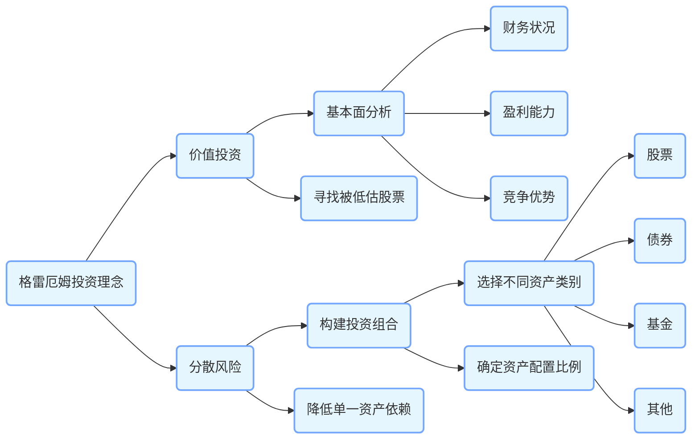

# 格雷厄姆投资理念：分散风险的重要性

> 关键词：格雷厄姆投资理念、分散风险、投资组合、风险管理、价值投资

> 摘要：本文深入探讨了格雷厄姆投资理念中分散风险的重要性。从背景介绍入手，阐述了格雷厄姆投资理念的起源和意义，以及预期读者和文档结构。详细解析了核心概念，包括分散风险与投资组合的联系，并通过 Mermaid 流程图和文本示意图进行直观展示。介绍了相关核心算法原理和具体操作步骤，运用 Python 代码进行详细说明。讲解了涉及的数学模型和公式，并举例分析。通过项目实战，展示了在实际投资中如何应用分散风险的理念，包括开发环境搭建、源代码实现和代码解读。探讨了分散风险理念在不同实际应用场景中的体现，推荐了学习、开发相关的工具和资源，包括书籍、在线课程、技术博客、IDE、调试工具、相关框架和经典论文等。最后总结了未来发展趋势与挑战，解答了常见问题，并提供了扩展阅读和参考资料，旨在帮助投资者更好地理解和运用格雷厄姆分散风险的投资理念。

## 1. 背景介绍 
### 1.1 目的和范围
本文章的目的是深入剖析格雷厄姆投资理念中分散风险的重要性。格雷厄姆作为价值投资的先驱，其投资理念对现代投资领域产生了深远的影响。分散风险是其投资理念的核心要素之一，理解这一理念对于投资者，无论是个人投资者还是专业投资机构，都具有至关重要的意义。文章将涵盖分散风险的理论基础、实际应用方法、相关数学模型以及在不同场景下的实践案例，旨在为读者提供一个全面、深入的关于格雷厄姆分散风险投资理念的知识体系。

### 1.2 预期读者
预期读者包括但不限于以下几类人群：
- 个人投资者：希望学习专业投资知识，运用科学的投资理念进行资产配置，降低投资风险，提高投资收益的个人。
- 金融从业者：如投资顾问、基金经理、分析师等，需要不断更新和深化投资知识体系，提升专业素养的专业人士。
- 金融专业学生：正在学习金融投资相关课程，希望通过实际案例和理论知识结合，更好地理解投资学原理的学生。
- 对投资感兴趣的爱好者：对金融市场和投资活动有浓厚兴趣，希望了解专业投资理念和方法的普通人群。

### 1.3 文档结构概述
本文将按照以下结构进行阐述：
- 核心概念与联系：介绍格雷厄姆投资理念中分散风险的核心概念，以及其与投资组合构建的联系，并通过文本示意图和 Mermaid 流程图进行直观展示。
- 核心算法原理 & 具体操作步骤：讲解用于实现分散风险的核心算法原理，并给出具体的操作步骤，同时使用 Python 源代码进行详细说明。
- 数学模型和公式 & 详细讲解 & 举例说明：介绍涉及的数学模型和公式，对其进行详细讲解，并通过具体例子进行分析。
- 项目实战：代码实际案例和详细解释说明：通过一个实际的投资项目案例，展示如何在实际中应用分散风险的理念，包括开发环境搭建、源代码实现和代码解读。
- 实际应用场景：探讨分散风险理念在不同实际投资场景中的应用。
- 工具和资源推荐：推荐学习、开发相关的工具和资源，包括书籍、在线课程、技术博客、IDE、调试工具、相关框架和经典论文等。
- 总结：未来发展趋势与挑战：总结分散风险理念的未来发展趋势和面临的挑战。
- 附录：常见问题与解答：解答读者在学习和应用分散风险理念过程中可能遇到的常见问题。
- 扩展阅读 & 参考资料：提供扩展阅读的相关资料和参考书目。

### 1.4 术语表
#### 1.4.1 核心术语定义
- **格雷厄姆投资理念**：由本杰明·格雷厄姆提出的一种价值投资理念，强调通过分析公司的基本面，寻找被低估的股票进行投资，同时注重风险管理，其中分散风险是重要的组成部分。
- **分散风险**：通过投资于多种不同的资产或资产类别，以降低单一资产波动对投资组合整体价值的影响，从而达到降低投资风险的目的。
- **投资组合**：由多种不同的资产组成的集合，投资者通过合理配置不同资产的比例，实现风险和收益的平衡。
- **价值投资**：一种基于公司内在价值进行投资的策略，投资者通过分析公司的财务状况、盈利能力、竞争优势等因素，寻找被市场低估的股票进行投资。

#### 1.4.2 相关概念解释
- **资产类别**：包括股票、债券、基金、房地产、大宗商品等不同类型的资产，不同资产类别具有不同的风险和收益特征。
- **相关性**：衡量两种资产价格变动之间的关联程度。正相关表示两种资产价格变动方向相同，负相关表示价格变动方向相反，相关性系数的取值范围在 -1 到 1 之间。
- **风险溢价**：投资者承担额外风险所要求获得的额外收益。在投资中，高风险的资产通常需要提供更高的风险溢价来吸引投资者。

#### 1.4.3 缩略词列表
- **CAPM**：Capital Asset Pricing Model，资本资产定价模型，用于描述资产预期收益率与系统性风险之间的关系。
- **ETF**：Exchange-Traded Fund，交易型开放式指数基金，一种在证券交易所上市交易的开放式基金，通常跟踪特定的指数。

## 2. 核心概念与联系 

### 核心概念原理
格雷厄姆投资理念中的分散风险核心在于通过构建多元化的投资组合，降低投资组合对单一资产或少数资产的依赖，从而减少因个别资产波动而导致的整体损失。其原理基于不同资产之间的相关性差异。如果资产之间的相关性较低，当其中一种资产表现不佳时，其他资产可能表现较好，从而相互抵消部分损失，稳定投资组合的整体收益。

例如，股票和债券通常具有较低的相关性。在经济繁荣时期，股票市场可能表现良好，而债券市场可能相对平稳；在经济衰退时期，债券通常被视为避险资产，其价格可能上涨，而股票价格可能下跌。通过同时投资股票和债券，可以在一定程度上平衡投资组合的风险和收益。

### 架构的文本示意图
```plaintext
格雷厄姆投资理念
|
|-- 价值投资
|   |-- 基本面分析
|   |   |-- 财务状况
|   |   |-- 盈利能力
|   |   |-- 竞争优势
|   |
|   |-- 寻找被低估股票
|
|-- 分散风险
|   |-- 构建投资组合
|   |   |-- 选择不同资产类别
|   |   |   |-- 股票
|   |   |   |-- 债券
|   |   |   |-- 基金
|   |   |   |-- 其他
|   |   |
|   |   |-- 确定资产配置比例
|   |
|   |-- 降低单一资产依赖
```

### Mermaid 流程图


## 3. 核心算法原理 & 具体操作步骤 

### 核心算法原理：现代投资组合理论（MPT）
现代投资组合理论由哈里·马科维茨（Harry Markowitz）提出，是实现分散风险的重要理论基础。该理论的核心思想是通过优化资产配置，在给定的风险水平下实现最高的预期收益，或在给定的预期收益水平下实现最低的风险。

#### 预期收益率计算
对于一个由 $n$ 种资产组成的投资组合，其预期收益率 $E(R_p)$ 可以通过以下公式计算：

$$E(R_p)=\sum_{i=1}^{n}w_iE(R_i)$$

其中，$w_i$ 是第 $i$ 种资产在投资组合中的权重，$E(R_i)$ 是第 $i$ 种资产的预期收益率。

#### 投资组合风险计算
投资组合的风险通常用方差 $\sigma_p^2$ 来衡量，其计算公式为：

$$\sigma_p^2=\sum_{i=1}^{n}\sum_{j=1}^{n}w_iw_j\sigma_{ij}$$

其中，$\sigma_{ij}$ 是资产 $i$ 和资产 $j$ 之间的协方差。当 $i = j$ 时，$\sigma_{ii}=\sigma_i^2$，即资产 $i$ 的方差。

### 具体操作步骤
#### 步骤 1：确定投资目标和风险承受能力
投资者首先需要明确自己的投资目标，如短期获利、长期资产增值、养老储备等，并评估自己的风险承受能力。风险承受能力受到投资者的财务状况、投资经验、投资期限等因素的影响。

#### 步骤 2：选择资产类别
根据投资目标和风险承受能力，选择合适的资产类别。常见的资产类别包括股票、债券、基金、房地产、大宗商品等。不同资产类别具有不同的风险和收益特征，投资者可以根据自己的需求进行组合。

#### 步骤 3：收集资产数据
收集所选资产的历史收益率数据，用于计算预期收益率和协方差矩阵。可以从金融数据提供商、证券交易所等渠道获取相关数据。

#### 步骤 4：计算预期收益率和协方差矩阵
使用历史数据计算每种资产的预期收益率和资产之间的协方差矩阵。可以使用统计软件或编程语言（如 Python）来完成这些计算。

#### 步骤 5：优化资产配置
根据现代投资组合理论，使用优化算法（如均值 - 方差优化）来确定每种资产在投资组合中的最优权重，以实现风险和收益的平衡。

### Python 源代码实现
```python
import numpy as np
import pandas as pd
from scipy.optimize import minimize

# 示例数据：假设有三种资产，其历史收益率数据
returns = pd.DataFrame({
    'Asset1': [0.05, 0.03, 0.02, 0.06, 0.04],
    'Asset2': [0.03, 0.02, 0.01, 0.04, 0.03],
    'Asset3': [0.04, 0.03, 0.02, 0.05, 0.03]
})

# 计算预期收益率
expected_returns = returns.mean()

# 计算协方差矩阵
cov_matrix = returns.cov()

# 定义目标函数：最小化投资组合风险
def portfolio_risk(weights, cov_matrix):
    return np.dot(weights.T, np.dot(cov_matrix, weights))

# 约束条件：权重之和为 1
constraints = ({'type': 'eq', 'fun': lambda x: np.sum(x) - 1})

# 权重范围：每种资产的权重在 0 到 1 之间
bounds = [(0, 1) for _ in range(len(expected_returns))]

# 初始权重猜测
initial_weights = np.ones(len(expected_returns)) / len(expected_returns)

# 最小化风险
result = minimize(portfolio_risk, initial_weights, args=(cov_matrix,), method='SLSQP', bounds=bounds, constraints=constraints)

# 最优权重
optimal_weights = result.x

print("预期收益率：", expected_returns)
print("协方差矩阵：\n", cov_matrix)
print("最优权重：", optimal_weights)
```

### 代码解释
1. **数据准备**：使用 `pandas` 库创建一个包含三种资产历史收益率的 `DataFrame`。
2. **计算预期收益率和协方差矩阵**：使用 `mean()` 方法计算每种资产的预期收益率，使用 `cov()` 方法计算资产之间的协方差矩阵。
3. **定义目标函数**：定义一个函数 `portfolio_risk` 来计算投资组合的风险，即投资组合的方差。
4. **设置约束条件和权重范围**：使用 `constraints` 和 `bounds` 来设置权重之和为 1 以及每种资产权重在 0 到 1 之间的约束条件。
5. **初始权重猜测**：使用平均权重作为初始猜测值。
6. **最小化风险**：使用 `scipy.optimize.minimize` 函数来最小化投资组合的风险，得到最优权重。

## 4. 数学模型和公式 & 详细讲解 & 举例说明 

### 现代投资组合理论的数学模型
现代投资组合理论基于均值 - 方差分析，其核心目标是在给定的预期收益率水平下最小化投资组合的风险，或在给定的风险水平下最大化投资组合的预期收益率。

#### 目标函数
在均值 - 方差优化中，目标函数可以表示为：

$$\min_{w}\sigma_p^2=\sum_{i=1}^{n}\sum_{j=1}^{n}w_iw_j\sigma_{ij}$$

约束条件为：

$$\sum_{i=1}^{n}w_i = 1$$

$$E(R_p)=\sum_{i=1}^{n}w_iE(R_i)=R_{target}$$

其中，$R_{target}$ 是投资者设定的目标预期收益率。

### 详细讲解
- **预期收益率**：预期收益率是对资产未来收益的一种估计。它是根据资产的历史收益率数据，通过统计方法计算得到的平均值。预期收益率反映了资产的平均收益水平，是投资者选择资产的重要参考指标之一。
- **方差和协方差**：方差衡量了资产收益率的波动程度，方差越大，资产的风险越高。协方差衡量了两种资产收益率之间的关联程度。正协方差表示两种资产的收益率倾向于同向变动，负协方差表示倾向于反向变动。通过合理选择具有低协方差或负协方差的资产进行组合，可以降低投资组合的整体风险。
- **权重优化**：在均值 - 方差优化中，通过调整每种资产在投资组合中的权重，来实现风险和收益的平衡。权重的选择需要考虑资产的预期收益率、方差和协方差等因素。

### 举例说明
假设有两种资产 A 和 B，其预期收益率分别为 $E(R_A)=0.1$ 和 $E(R_B)=0.08$，方差分别为 $\sigma_A^2 = 0.04$ 和 $\sigma_B^2 = 0.01$，协方差 $\sigma_{AB}=0.005$。投资者希望构建一个预期收益率为 $R_{target}=0.09$ 的投资组合。

设资产 A 的权重为 $w_A$，则资产 B 的权重为 $w_B = 1 - w_A$。

投资组合的预期收益率为：

$$E(R_p)=w_AE(R_A)+w_BE(R_B)=w_A\times0.1+(1 - w_A)\times0.08 = 0.09$$

解方程可得 $w_A = 0.5$，$w_B = 0.5$。

投资组合的方差为：

$$\sigma_p^2=w_A^2\sigma_A^2+w_B^2\sigma_B^2 + 2w_Aw_B\sigma_{AB}$$

$$=0.5^2\times0.04 + 0.5^2\times0.01 + 2\times0.5\times0.5\times0.005$$

$$=0.01 + 0.0025 + 0.0025 = 0.015$$

通过这个例子可以看出，通过合理配置资产的权重，可以在满足预期收益率的前提下，降低投资组合的风险。

## 5. 项目实战：代码实际案例和详细解释说明 

### 5.1  开发环境搭建
#### 安装 Python
首先，需要安装 Python 环境。可以从 Python 官方网站（https://www.python.org/downloads/）下载适合自己操作系统的 Python 安装包，并按照安装向导进行安装。建议安装 Python 3.6 及以上版本。

#### 安装必要的库
使用 `pip` 命令安装项目所需的库，包括 `pandas`、`numpy`、`scipy` 等。可以在命令行中执行以下命令：

```sh
pip install pandas numpy scipy
```

### 5.2  源代码详细实现和代码解读
```python
import numpy as np
import pandas as pd
from scipy.optimize import minimize

# 模拟获取资产历史收益率数据
def generate_returns(num_assets, num_periods):
    """
    生成模拟的资产历史收益率数据
    :param num_assets: 资产数量
    :param num_periods: 时间周期数量
    :return: 资产历史收益率 DataFrame
    """
    returns = np.random.normal(loc=0.05, scale=0.1, size=(num_periods, num_assets))
    return pd.DataFrame(returns, columns=[f'Asset{i+1}' for i in range(num_assets)])

# 计算预期收益率和协方差矩阵
def calculate_stats(returns):
    """
    计算资产的预期收益率和协方差矩阵
    :param returns: 资产历史收益率 DataFrame
    :return: 预期收益率 Series 和协方差矩阵 DataFrame
    """
    expected_returns = returns.mean()
    cov_matrix = returns.cov()
    return expected_returns, cov_matrix

# 定义目标函数：最小化投资组合风险
def portfolio_risk(weights, cov_matrix):
    """
    计算投资组合的风险（方差）
    :param weights: 资产权重数组
    :param cov_matrix: 协方差矩阵 DataFrame
    :return: 投资组合的风险
    """
    return np.dot(weights.T, np.dot(cov_matrix, weights))

# 定义约束条件：权重之和为 1
def weight_constraint(weights):
    """
    权重之和约束条件
    :param weights: 资产权重数组
    :return: 权重之和与 1 的差值
    """
    return np.sum(weights) - 1

# 优化资产配置
def optimize_portfolio(expected_returns, cov_matrix, target_return=None):
    """
    优化投资组合的资产配置
    :param expected_returns: 预期收益率 Series
    :param cov_matrix: 协方差矩阵 DataFrame
    :param target_return: 目标预期收益率
    :return: 最优权重数组
    """
    num_assets = len(expected_returns)
    initial_weights = np.ones(num_assets) / num_assets
    
    # 约束条件
    constraints = [{'type': 'eq', 'fun': weight_constraint}]
    if target_return is not None:
        def return_constraint(weights):
            return np.dot(weights, expected_returns) - target_return
        constraints.append({'type': 'eq', 'fun': return_constraint})
    
    # 权重范围
    bounds = [(0, 1) for _ in range(num_assets)]
    
    # 最小化风险
    result = minimize(portfolio_risk, initial_weights, args=(cov_matrix,), method='SLSQP', bounds=bounds, constraints=constraints)
    
    return result.x

# 主函数
def main():
    # 生成模拟数据
    num_assets = 3
    num_periods = 100
    returns = generate_returns(num_assets, num_periods)
    
    # 计算统计数据
    expected_returns, cov_matrix = calculate_stats(returns)
    
    # 优化资产配置
    target_return = 0.06
    optimal_weights = optimize_portfolio(expected_returns, cov_matrix, target_return)
    
    print("预期收益率：", expected_returns)
    print("协方差矩阵：\n", cov_matrix)
    print("最优权重：", optimal_weights)

if __name__ == "__main__":
    main()
```

### 5.3  代码解读与分析
#### 数据生成
`generate_returns` 函数用于生成模拟的资产历史收益率数据。通过 `np.random.normal` 函数生成服从正态分布的随机收益率数据，并将其转换为 `pandas` 的 `DataFrame` 格式。

#### 统计计算
`calculate_stats` 函数计算资产的预期收益率和协方差矩阵。使用 `mean()` 方法计算预期收益率，使用 `cov()` 方法计算协方差矩阵。

#### 目标函数
`portfolio_risk` 函数计算投资组合的风险，即投资组合的方差。通过矩阵运算实现方差的计算。

#### 约束条件
`weight_constraint` 函数定义了权重之和为 1 的约束条件。如果指定了目标预期收益率，还会添加一个预期收益率约束条件。

#### 优化资产配置
`optimize_portfolio` 函数使用 `scipy.optimize.minimize` 函数来最小化投资组合的风险。根据约束条件和权重范围，找到最优的资产权重。

#### 主函数
`main` 函数是程序的入口，调用上述函数完成数据生成、统计计算和资产配置优化，并输出结果。

通过这个项目实战，我们可以看到如何使用 Python 实现格雷厄姆投资理念中分散风险的思想，通过优化资产配置来降低投资组合的风险。

## 6. 实际应用场景 
### 个人投资者资产配置
对于个人投资者来说，分散风险的理念可以应用于构建个人投资组合。例如，一个年轻的投资者可能有较长的投资期限和较高的风险承受能力，可以将一部分资金投资于股票市场，以追求较高的长期收益；同时，为了降低风险，可以将另一部分资金投资于债券、基金等相对稳定的资产。随着年龄的增长和风险承受能力的变化，投资者可以逐渐调整资产配置比例，增加债券等稳定资产的比重。

### 基金投资管理
基金经理在管理基金时，也广泛应用分散风险的理念。基金通常会投资于多种不同的股票、债券或其他资产，以降低单一资产波动对基金净值的影响。例如，一只股票型基金可能会投资于不同行业、不同规模的股票，通过分散投资降低行业风险和个股风险。

### 企业风险管理
企业在进行投资和财务管理时，也需要考虑分散风险。企业可能会将资金投资于不同的项目、业务领域或金融资产，以降低单一项目或业务失败对企业财务状况的影响。例如，一家制造企业可能会同时投资于研发新产品、拓展市场渠道和进行金融投资，以分散经营风险和市场风险。

### 保险投资组合
保险公司在管理保险资金时，也需要遵循分散风险的原则。保险公司会将保费收入投资于多种资产，包括股票、债券、房地产等，以实现资产的保值增值，并确保有足够的资金来履行保险赔付责任。通过分散投资，保险公司可以降低投资组合的风险，提高资金的安全性和稳定性。

## 7. 工具和资源推荐
### 7.1 学习资源推荐
#### 7.1.1 书籍推荐
- 《聪明的投资者》（*The Intelligent Investor*）：本杰明·格雷厄姆的经典著作，被誉为投资界的圣经，详细阐述了价值投资的理念和方法，包括分散风险的重要性。
- 《证券分析》（*Security Analysis*）：同样是格雷厄姆的著作，是价值投资的奠基之作，对股票、债券等证券的分析方法进行了深入探讨。
- 《漫步华尔街》（*A Random Walk Down Wall Street*）：伯顿·马尔基尔（Burton Malkiel）的经典投资书籍，介绍了各种投资理论和策略，强调了分散投资和长期投资的重要性。
- 《投资组合理论与资本市场》（*Portfolio Theory and Capital Markets*）：哈里·马科维茨（Harry Markowitz）的著作，详细介绍了现代投资组合理论的原理和应用。

#### 7.1.2 在线课程
- Coursera 上的“投资学原理”（*Principles of Investing*）：由知名大学教授授课，系统介绍了投资学的基本原理和方法，包括投资组合理论和分散风险的实践。
- edX 上的“金融市场”（*Financial Markets*）：耶鲁大学教授罗伯特·席勒（Robert Shiller）主讲的课程，涵盖了金融市场的各个方面，包括投资组合管理和风险管理。
- 中国大学 MOOC 上的“投资学”：国内高校开设的投资学课程，结合中国金融市场的实际情况，介绍了投资学的理论和实践。

#### 7.1.3 技术博客和网站
- Seeking Alpha：一个提供金融市场分析、投资策略和股票研究报告的网站，有许多专业投资者和分析师分享他们的观点和研究成果。
- Investopedia：一个在线金融百科全书，提供了丰富的金融术语解释、投资教程和市场分析文章，是学习金融投资知识的重要资源。
- 雪球：国内知名的投资社区，有大量的投资者分享投资经验、分析报告和投资组合，用户可以在上面交流和学习。

### 7.2 开发工具框架推荐
#### 7.2.1 IDE和编辑器
- PyCharm：一款专业的 Python 集成开发环境，具有强大的代码编辑、调试和分析功能，适合开发 Python 投资分析程序。
- Jupyter Notebook：一个交互式的开发环境，支持 Python、R 等多种编程语言，非常适合进行数据探索和分析，以及编写投资分析报告。
- Visual Studio Code：一款轻量级的代码编辑器，支持多种编程语言和插件扩展，可用于开发投资分析脚本和程序。

#### 7.2.2 调试和性能分析工具
- pdb：Python 内置的调试工具，可以帮助开发者在代码执行过程中进行调试，定位和解决问题。
- cProfile：Python 标准库中的性能分析工具，可以分析代码的执行时间和函数调用次数，帮助开发者优化代码性能。
- Numba：一个用于加速 Python 代码的 JIT 编译器，可以显著提高数值计算代码的执行速度，适用于投资分析中的大量数值计算任务。

#### 7.2.3 相关框架和库
- pandas：一个强大的数据处理和分析库，提供了高效的数据结构和数据操作方法，非常适合处理金融数据。
- numpy：一个用于科学计算的基础库，提供了多维数组对象和各种数学函数，是投资分析中进行数值计算的重要工具。
- scipy：一个科学计算库，提供了优化算法、统计分析、插值拟合等功能，可用于投资组合优化和风险分析。
- matplotlib：一个用于数据可视化的库，可以绘制各种类型的图表，帮助投资者直观地展示投资数据和分析结果。

### 7.3 相关论文著作推荐
#### 7.3.1 经典论文
- Markowitz, H. M. (1952). *Portfolio Selection*. The Journal of Finance, 7(1), 77 - 91. 这篇论文提出了现代投资组合理论，奠定了投资组合优化的基础。
- Sharpe, W. F. (1964). *Capital Asset Prices: A Theory of Market Equilibrium under Conditions of Risk*. The Journal of Finance, 19(3), 425 - 442. 这篇论文提出了资本资产定价模型（CAPM），用于描述资产预期收益率与系统性风险之间的关系。
- Fama, E. F., & French, K. R. (1992). *The Cross - Section of Expected Stock Returns*. The Journal of Finance, 47(2), 427 - 465. 这篇论文提出了 Fama - French 三因子模型，对股票收益率的影响因素进行了深入研究。

#### 7.3.2 最新研究成果
- 可以关注《Journal of Financial Economics》、《Review of Financial Studies》等顶级金融学术期刊，了解投资组合理论和风险管理领域的最新研究成果。
- 参加金融学术会议，如 American Finance Association (AFA) 年会、Western Finance Association (WFA) 年会等，与全球顶尖的金融学者和研究人员交流最新的研究进展。

#### 7.3.3 应用案例分析
- 可以参考一些专业的金融研究报告和案例分析书籍，了解分散风险理念在实际投资中的应用案例。例如，一些大型投资机构的年度报告和研究报告中会详细介绍他们的投资策略和资产配置方案。
- 分析上市公司的财务报表和年报，了解企业在投资和风险管理方面的实践和经验。

## 8. 总结：未来发展趋势与挑战
### 未来发展趋势
#### 智能化投资组合管理
随着人工智能和机器学习技术的发展，智能化投资组合管理将成为未来的发展趋势。通过使用大数据分析、深度学习等技术，可以更准确地预测资产的收益率和风险，实现更优化的资产配置。例如，智能投顾平台可以根据投资者的风险偏好、投资目标和市场情况，自动生成个性化的投资组合方案。

#### 全球化资产配置
随着全球金融市场的一体化，投资者将越来越倾向于进行全球化资产配置。通过投资于不同国家和地区的资产，可以进一步分散风险，提高投资组合的收益稳定性。同时，跨境投资的便利性也在不断提高，例如通过 ETF 等金融工具可以方便地投资于全球不同市场。

#### 可持续投资
可持续投资将成为未来投资的重要方向。投资者越来越关注企业的环境、社会和治理（ESG）表现，将 ESG 因素纳入投资决策过程中。通过投资于具有良好 ESG 表现的企业，可以在实现财务回报的同时，为社会和环境做出贡献。同时，可持续投资也可以降低投资组合的风险，因为具有良好 ESG 表现的企业通常具有更强的抗风险能力。

### 挑战
#### 市场不确定性增加
随着全球经济和政治环境的日益复杂，市场不确定性不断增加。例如，贸易摩擦、地缘政治冲突、宏观经济政策变化等因素都可能导致市场波动加剧，增加投资组合的风险。投资者需要更加灵活地调整资产配置，以应对市场不确定性。

#### 数据质量和隐私问题
智能化投资组合管理依赖于大量的金融数据，数据的质量和隐私问题成为重要挑战。不准确或不完整的数据可能导致投资决策失误，而数据隐私泄露则可能给投资者带来损失。因此，需要加强数据质量管理和隐私保护，确保数据的安全和可靠。

#### 模型风险
投资组合优化模型是基于历史数据和假设条件建立的，存在一定的模型风险。市场环境和资产价格的变化可能导致模型失效，从而影响投资组合的表现。投资者需要不断评估和改进模型，提高模型的准确性和适应性。

## 9. 附录：常见问题与解答
### 问题 1：分散投资是否意味着投资的资产越多越好？
不是的。虽然分散投资可以降低风险，但并不是投资的资产越多越好。当投资的资产数量过多时，可能会导致管理成本增加，同时也可能会降低投资组合的收益。一般来说，选择适度数量的资产，并且这些资产之间具有较低的相关性，就可以达到较好的分散风险效果。

### 问题 2：如何确定资产之间的相关性？
可以通过计算资产之间的相关系数来确定它们之间的相关性。相关系数的取值范围在 -1 到 1 之间，-1 表示完全负相关，1 表示完全正相关，0 表示不相关。可以使用统计软件或编程语言（如 Python）来计算相关系数。常用的方法是使用历史收益率数据，通过计算协方差和标准差来得到相关系数。

### 问题 3：分散风险是否可以完全消除风险？
分散风险不能完全消除风险。分散风险只能降低非系统性风险，即与个别资产相关的风险。而系统性风险，如宏观经济波动、利率变化、市场整体下跌等，是无法通过分散投资来消除的。投资者需要认识到，投资总是存在一定的风险，即使进行了分散投资，也不能保证投资组合不会遭受损失。

### 问题 4：在不同市场环境下，分散投资的效果是否相同？
不同市场环境下，分散投资的效果可能会有所不同。在市场平稳或上涨阶段，分散投资可以帮助投资者分享不同资产的收益，实现风险和收益的平衡。但在市场剧烈波动或下跌阶段，由于资产之间的相关性可能会发生变化，分散投资的效果可能会受到一定影响。例如，在金融危机期间，大多数资产价格可能会同时下跌，此时分散投资的风险降低效果可能会减弱。

## 10. 扩展阅读 & 参考资料
### 扩展阅读
- 《金融炼金术》（*The Alchemy of Finance*）：乔治·索罗斯（George Soros）的著作，介绍了他的投资哲学和金融市场分析方法。
- 《黑天鹅》（*The Black Swan*）：纳西姆·尼古拉斯·塔勒布（Nassim Nicholas Taleb）的著作，探讨了不可预测的重大事件对金融市场和投资的影响。
- 《战胜华尔街》（*One Up On Wall Street*）：彼得·林奇（Peter Lynch）的著作，分享了他的投资经验和选股策略。

### 参考资料
- Graham, B., & Dodd, D. L. (1934). *Security Analysis*. McGraw - Hill.
- Markowitz, H. M. (1959). *Portfolio Selection: Efficient Diversification of Investments*. John Wiley & Sons.
- Sharpe, W. F. (1970). *Portfolio Theory and Capital Markets*. McGraw - Hill.

作者：AI天才研究院/AI Genius Institute & 禅与计算机程序设计艺术 /Zen And The Art of Computer Programming