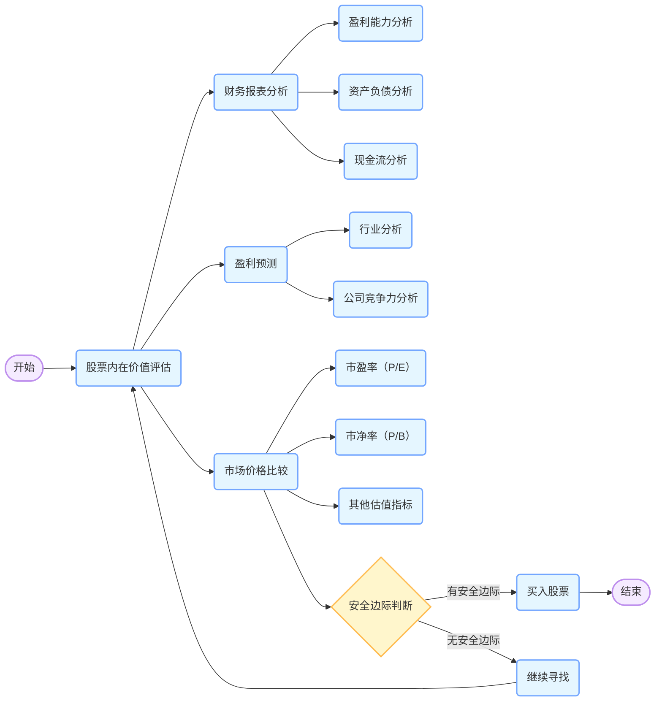

# 格雷厄姆特价股票理论在不同规模经济体中的表现

> 关键词：格雷厄姆特价股票理论、不同规模经济体、股票估值、投资策略、市场表现

> 摘要：本文旨在深入探讨格雷厄姆特价股票理论在不同规模经济体中的表现。通过对该理论的核心概念、算法原理、数学模型等方面进行详细阐述，并结合实际案例分析其在不同规模经济体中的应用情况。同时，提供相关的工具和资源推荐，帮助投资者更好地理解和运用该理论。最后，总结该理论在未来的发展趋势与挑战，并解答常见问题，为投资者在不同规模经济体中运用格雷厄姆特价股票理论提供全面的参考。

## 1. 背景介绍 
### 1.1 目的和范围
本研究的主要目的是探究格雷厄姆特价股票理论在不同规模经济体中的有效性和表现差异。不同规模的经济体具有不同的市场结构、宏观经济环境和投资者行为特点，这些因素可能会对格雷厄姆特价股票理论的应用产生影响。通过分析该理论在小型、中型和大型经济体中的表现，我们可以更好地理解其适用性和局限性，为投资者提供更有针对性的投资建议。
研究范围涵盖了全球多个具有代表性的不同规模经济体，包括美国、中国、日本等大型经济体，以及新加坡、马来西亚等中型经济体和一些小型新兴经济体。我们将通过对这些经济体中股票市场的历史数据进行分析，评估格雷厄姆特价股票理论在不同市场环境下的表现。

### 1.2 预期读者
本文的预期读者主要包括以下几类人群：
- **投资者**：无论是个人投资者还是机构投资者，都可以从本文中了解格雷厄姆特价股票理论在不同规模经济体中的表现，从而优化自己的投资策略，提高投资收益。
- **金融分析师**：金融分析师可以通过本文对格雷厄姆特价股票理论的深入分析，为客户提供更准确的投资建议，同时也可以在研究不同规模经济体的股票市场时提供参考。
- **学者和研究人员**：对于从事金融领域研究的学者和研究人员来说，本文可以为他们的研究提供实证数据和理论支持，促进相关领域的学术研究。
- **金融专业学生**：金融专业的学生可以通过阅读本文，加深对格雷厄姆特价股票理论的理解，了解该理论在实际市场中的应用情况，提高自己的专业素养。

### 1.3 文档结构概述
本文将按照以下结构进行组织：
- **核心概念与联系**：介绍格雷厄姆特价股票理论的核心概念，包括其原理、架构，并通过文本示意图和 Mermaid 流程图进行直观展示。
- **核心算法原理 & 具体操作步骤**：详细讲解格雷厄姆特价股票理论的核心算法原理，并使用 Python 源代码进行具体阐述，同时说明具体的操作步骤。
- **数学模型和公式 & 详细讲解 & 举例说明**：给出格雷厄姆特价股票理论的数学模型和公式，并进行详细讲解，通过具体例子说明其应用。
- **项目实战：代码实际案例和详细解释说明**：通过实际案例展示如何运用格雷厄姆特价股票理论进行股票投资分析，包括开发环境搭建、源代码实现和代码解读。
- **实际应用场景**：分析格雷厄姆特价股票理论在不同规模经济体中的实际应用场景，以及可能面临的问题和挑战。
- **工具和资源推荐**：推荐相关的学习资源、开发工具框架和论文著作，帮助读者进一步深入学习和研究该理论。
- **总结：未来发展趋势与挑战**：总结格雷厄姆特价股票理论在不同规模经济体中的表现，分析其未来的发展趋势和可能面临的挑战。
- **附录：常见问题与解答**：解答读者在学习和应用格雷厄姆特价股票理论过程中可能遇到的常见问题。
- **扩展阅读 & 参考资料**：提供相关的扩展阅读材料和参考资料，方便读者进一步深入研究。

### 1.4 术语表
#### 1.4.1 核心术语定义
- **格雷厄姆特价股票理论**：由本杰明·格雷厄姆（Benjamin Graham）提出的一种股票投资理论，该理论认为投资者可以通过寻找被市场低估的股票，即“特价股票”，来获得超额收益。
- **不同规模经济体**：根据经济体的国内生产总值（GDP）、市场规模、金融市场发展程度等因素，将经济体分为大型经济体、中型经济体和小型经济体。
- **股票估值**：对股票的内在价值进行评估的过程，常用的估值方法包括市盈率（P/E）、市净率（P/B）等。
- **安全边际**：格雷厄姆特价股票理论中的一个重要概念，指的是股票的市场价格低于其内在价值的幅度，安全边际越大，投资风险越小。

#### 1.4.2 相关概念解释
- **价值投资**：一种投资策略，强调通过分析股票的内在价值，寻找被低估的股票进行投资，以获得长期稳定的收益。
- **市场效率**：指市场价格反映所有可用信息的程度，市场效率越高，股票价格越能准确反映其内在价值。
- **宏观经济环境**：包括经济增长、通货膨胀、利率等宏观经济因素，这些因素会对股票市场产生影响。

#### 1.4.3 缩略词列表
- **P/E**：市盈率（Price-to-Earnings Ratio），指股票价格与每股收益的比率。
- **P/B**：市净率（Price-to-Book Ratio），指股票价格与每股净资产的比率。
- **GDP**：国内生产总值（Gross Domestic Product），衡量一个国家或地区经济活动总量的指标。

## 2. 核心概念与联系 
### 2.1 格雷厄姆特价股票理论原理
格雷厄姆特价股票理论的核心思想是通过寻找被市场低估的股票来获得投资收益。该理论认为，市场有时会出现非理性行为，导致股票价格偏离其内在价值。投资者可以通过对股票的基本面进行分析，评估其内在价值，并寻找那些市场价格低于内在价值的股票，即“特价股票”。

股票的内在价值可以通过多种方法进行评估，其中最常用的方法是基于公司的财务报表和盈利预测。格雷厄姆提出了一些具体的估值指标，如市盈率（P/E）、市净率（P/B）等，来帮助投资者判断股票是否被低估。一般来说，较低的市盈率和市净率意味着股票可能被低估，具有较高的投资价值。

### 2.2 核心概念架构
格雷厄姆特价股票理论的核心概念架构可以用以下文本示意图表示：

```plaintext
格雷厄姆特价股票理论
|-- 股票内在价值评估
|   |-- 财务报表分析
|   |   |-- 盈利能力分析
|   |   |-- 资产负债分析
|   |   |-- 现金流分析
|   |-- 盈利预测
|       |-- 行业分析
|       |-- 公司竞争力分析
|-- 市场价格比较
|   |-- 市盈率（P/E）
|   |-- 市净率（P/B）
|   |-- 其他估值指标
|-- 安全边际判断
|   |-- 内在价值与市场价格差额
|   |-- 投资风险评估
```

### 2.3 Mermaid 流程图


该流程图展示了运用格雷厄姆特价股票理论进行股票投资的基本流程。首先，对股票的内在价值进行评估，包括财务报表分析和盈利预测。然后，将股票的市场价格与内在价值进行比较，使用市盈率、市净率等估值指标。最后，判断是否存在安全边际，如果存在则买入股票，否则继续寻找其他可能的特价股票。

## 3. 核心算法原理 & 具体操作步骤 
### 3.1 核心算法原理
格雷厄姆特价股票理论的核心算法主要围绕股票的估值和安全边际的计算。下面我们将详细介绍基于市盈率和市净率的估值算法。

#### 3.1.1 市盈率估值法
市盈率（P/E）是指股票价格与每股收益的比率，计算公式为：
$$P/E = \frac{股价}{每股收益}$$

一般来说，较低的市盈率意味着股票可能被低估。格雷厄姆认为，投资者可以通过比较股票的市盈率与行业平均市盈率或市场平均市盈率，来判断股票是否具有投资价值。如果股票的市盈率低于行业平均市盈率或市场平均市盈率，且公司具有稳定的盈利能力和良好的财务状况，那么该股票可能是一只特价股票。

#### 3.1.2 市净率估值法
市净率（P/B）是指股票价格与每股净资产的比率，计算公式为：
$$P/B = \frac{股价}{每股净资产}$$

市净率反映了股票价格相对于公司净资产的倍数。较低的市净率意味着股票可能被低估，具有较高的安全边际。格雷厄姆建议投资者选择市净率低于一定阈值（如 1.5 或 2）的股票进行投资。

### 3.2 具体操作步骤
下面我们使用 Python 代码来实现基于市盈率和市净率的股票筛选过程。假设我们有一个包含股票代码、股价、每股收益和每股净资产的数据集。

```python
import pandas as pd

# 假设我们有一个包含股票信息的数据集
data = {
    '股票代码': ['000001', '000002', '000003', '000004'],
    '股价': [10, 20, 15, 25],
    '每股收益': [1, 2, 1.5, 2.5],
    '每股净资产': [5, 10, 8, 12]
}

df = pd.DataFrame(data)

# 计算市盈率和市净率
df['市盈率'] = df['股价'] / df['每股收益']
df['市净率'] = df['股价'] / df['每股净资产']

# 设定市盈率和市净率的阈值
pe_threshold = 10
pb_threshold = 1.5

# 筛选符合条件的股票
selected_stocks = df[(df['市盈率'] < pe_threshold) & (df['市净率'] < pb_threshold)]

print(selected_stocks)
```

### 3.3 代码解释
1. **数据准备**：首先，我们创建了一个包含股票代码、股价、每股收益和每股净资产的数据集，并将其转换为 Pandas 的 DataFrame 对象。
2. **计算市盈率和市净率**：使用 Pandas 的计算功能，计算每只股票的市盈率和市净率，并将结果添加到 DataFrame 中。
3. **设定阈值**：设定市盈率和市净率的阈值，用于筛选符合条件的股票。
4. **筛选股票**：使用布尔索引筛选出市盈率低于阈值且市净率低于阈值的股票。
5. **输出结果**：打印筛选出的股票信息。

通过以上步骤，我们可以使用格雷厄姆特价股票理论的核心算法，筛选出可能被低估的股票。

## 4. 数学模型和公式 & 详细讲解 & 举例说明 
### 4.1 数学模型和公式
#### 4.1.1 市盈率估值模型
市盈率估值模型基于股票的每股收益和市场可比公司的市盈率来估算股票的内在价值。其公式为：
$$V = EPS \times P/E_{可比}$$
其中，$V$ 表示股票的内在价值，$EPS$ 表示每股收益，$P/E_{可比}$ 表示可比公司的平均市盈率。

#### 4.1.2 市净率估值模型
市净率估值模型基于股票的每股净资产和市场可比公司的市净率来估算股票的内在价值。其公式为：
$$V = BVPS \times P/B_{可比}$$
其中，$V$ 表示股票的内在价值，$BVPS$ 表示每股净资产，$P/B_{可比}$ 表示可比公司的平均市净率。

#### 4.1.3 安全边际计算公式
安全边际是指股票的内在价值与市场价格之间的差额，计算公式为：
$$安全边际 = \frac{V - P}{V} \times 100\%$$
其中，$V$ 表示股票的内在价值，$P$ 表示股票的市场价格。

### 4.2 详细讲解
#### 4.2.1 市盈率估值模型讲解
市盈率估值模型的核心思想是通过比较目标股票与可比公司的盈利能力来估算其内在价值。可比公司是指与目标公司处于同一行业、具有相似业务模式和财务特征的公司。通过计算可比公司的平均市盈率，并将其应用到目标股票的每股收益上，我们可以得到目标股票的大致内在价值。

需要注意的是，市盈率估值模型的准确性取决于可比公司的选择和平均市盈率的计算。如果可比公司选择不当或平均市盈率计算不准确，可能会导致估值结果偏差较大。

#### 4.2.2 市净率估值模型讲解
市净率估值模型的核心思想是通过比较目标股票与可比公司的净资产价值来估算其内在价值。市净率反映了股票价格相对于公司净资产的倍数，较低的市净率意味着股票可能被低估。通过计算可比公司的平均市净率，并将其应用到目标股票的每股净资产上，我们可以得到目标股票的大致内在价值。

市净率估值模型适用于那些资产价值较为稳定的公司，如金融、房地产等行业。对于一些轻资产公司，如科技、互联网等行业，市净率估值模型的适用性可能较差。

#### 4.2.3 安全边际计算公式讲解
安全边际是格雷厄姆特价股票理论中的一个重要概念，它反映了投资的风险程度。安全边际越大，说明股票的市场价格低于其内在价值的幅度越大，投资风险越小。当安全边际为正数时，说明股票被低估，具有投资价值；当安全边际为负数时，说明股票被高估，不具有投资价值。

### 4.3 举例说明
假设我们要对一家名为 ABC 公司的股票进行估值。通过分析，我们找到了三家与 ABC 公司处于同一行业、具有相似业务模式和财务特征的可比公司，它们的市盈率分别为 12、13 和 14，市净率分别为 1.5、1.6 和 1.7。ABC 公司的每股收益为 2 元，每股净资产为 10 元，当前市场价格为 25 元。

#### 4.3.1 市盈率估值
首先，计算可比公司的平均市盈率：
$$P/E_{可比} = \frac{12 + 13 + 14}{3} = 13$$
然后，使用市盈率估值模型计算 ABC 公司股票的内在价值：
$$V_{PE} = EPS \times P/E_{可比} = 2 \times 13 = 26$$

#### 4.3.2 市净率估值
计算可比公司的平均市净率：
$$P/B_{可比} = \frac{1.5 + 1.6 + 1.7}{3} = 1.6$$
使用市净率估值模型计算 ABC 公司股票的内在价值：
$$V_{PB} = BVPS \times P/B_{可比} = 10 \times 1.6 = 16$$

#### 4.3.3 安全边际计算
分别计算基于市盈率估值和市净率估值的安全边际：
- 基于市盈率估值的安全边际：
$$安全边际_{PE} = \frac{V_{PE} - P}{V_{PE}} \times 100\% = \frac{26 - 25}{26} \times 100\% \approx 3.85\%$$
- 基于市净率估值的安全边际：
$$安全边际_{PB} = \frac{V_{PB} - P}{V_{PB}} \times 100\% = \frac{16 - 25}{16} \times 100\% \approx -56.25\%$$

从以上计算结果可以看出，基于市盈率估值，ABC 公司股票具有一定的安全边际，可能被低估；而基于市净率估值，ABC 公司股票的安全边际为负数，可能被高估。投资者需要综合考虑多种因素，做出合理的投资决策。

## 5. 项目实战：代码实际案例和详细解释说明 
### 5.1  开发环境搭建
在进行格雷厄姆特价股票理论的项目实战之前，我们需要搭建相应的开发环境。以下是具体的搭建步骤：

#### 5.1.1 安装 Python
Python 是一种广泛使用的编程语言，我们可以从 Python 官方网站（https://www.python.org/downloads/）下载并安装适合自己操作系统的 Python 版本。建议安装 Python 3.7 及以上版本。

#### 5.1.2 安装必要的库
我们需要安装一些必要的 Python 库，用于数据处理、数据分析和可视化。可以使用以下命令进行安装：
```bash
pip install pandas numpy matplotlib
```
- **pandas**：用于数据处理和分析，提供了高效的数据结构和数据操作方法。
- **numpy**：用于数值计算，提供了高效的数组操作和数学函数。
- **matplotlib**：用于数据可视化，提供了丰富的绘图功能。

#### 5.1.3 准备数据
我们需要准备股票市场的历史数据，包括股票代码、股价、每股收益、每股净资产等信息。可以从金融数据提供商（如 Wind、东方财富等）获取这些数据，也可以使用一些开源的金融数据接口（如 Tushare）来获取数据。

### 5.2  源代码详细实现和代码解读
以下是一个使用 Python 实现格雷厄姆特价股票理论的完整代码示例：

```python
import pandas as pd
import matplotlib.pyplot as plt

# 读取股票数据
data = pd.read_csv('stock_data.csv')

# 计算市盈率和市净率
data['市盈率'] = data['股价'] / data['每股收益']
data['市净率'] = data['股价'] / data['每股净资产']

# 设定市盈率和市净率的阈值
pe_threshold = 10
pb_threshold = 1.5

# 筛选符合条件的股票
selected_stocks = data[(data['市盈率'] < pe_threshold) & (data['市净率'] < pb_threshold)]

# 输出筛选结果
print('筛选出的特价股票：')
print(selected_stocks[['股票代码', '股价', '市盈率', '市净率']])

# 可视化筛选结果
plt.figure(figsize=(10, 6))
plt.scatter(selected_stocks['市盈率'], selected_stocks['市净率'])
plt.xlabel('市盈率')
plt.ylabel('市净率')
plt.title('筛选出的特价股票的市盈率和市净率分布')
plt.grid(True)
plt.show()
```

### 5.3  代码解读与分析
#### 5.3.1 数据读取
```python
data = pd.read_csv('stock_data.csv')
```
使用 Pandas 的 `read_csv` 函数读取存储在 CSV 文件中的股票数据。

#### 5.3.2 计算市盈率和市净率
```python
data['市盈率'] = data['股价'] / data['每股收益']
data['市净率'] = data['股价'] / data['每股净资产']
```
使用 Pandas 的计算功能，计算每只股票的市盈率和市净率，并将结果添加到 DataFrame 中。

#### 5.3.3 设定阈值
```python
pe_threshold = 10
pb_threshold = 1.5
```
设定市盈率和市净率的阈值，用于筛选符合条件的股票。

#### 5.3.4 筛选股票
```python
selected_stocks = data[(data['市盈率'] < pe_threshold) & (data['市净率'] < pb_threshold)]
```
使用布尔索引筛选出市盈率低于阈值且市净率低于阈值的股票。

#### 5.3.5 输出筛选结果
```python
print('筛选出的特价股票：')
print(selected_stocks[['股票代码', '股价', '市盈率', '市净率']])
```
打印筛选出的股票信息，包括股票代码、股价、市盈率和市净率。

#### 5.3.6 可视化筛选结果
```python
plt.figure(figsize=(10, 6))
plt.scatter(selected_stocks['市盈率'], selected_stocks['市净率'])
plt.xlabel('市盈率')
plt.ylabel('市净率')
plt.title('筛选出的特价股票的市盈率和市净率分布')
plt.grid(True)
plt.show()
```
使用 Matplotlib 的 `scatter` 函数绘制筛选出的股票的市盈率和市净率的散点图，直观展示这些股票的估值情况。

通过以上代码，我们可以实现基于格雷厄姆特价股票理论的股票筛选和可视化分析。

## 6. 实际应用场景 
### 6.1 在大型经济体中的应用
大型经济体通常具有较为成熟的金融市场和完善的法律法规体系，市场参与者众多，信息传播迅速。在这样的市场环境下，格雷厄姆特价股票理论可以作为一种重要的投资策略。

#### 6.1.1 价值发现
大型经济体中的股票市场规模较大，上市公司数量众多，市场效率相对较高。但即使在这样的市场中，仍然存在一些被市场低估的股票。投资者可以运用格雷厄姆特价股票理论，通过对公司的基本面进行深入分析，寻找那些具有稳定盈利能力、良好财务状况但市场价格被低估的股票，实现价值发现。

例如，在美国股票市场中，一些传统行业的公司可能由于市场对新兴科技行业的过度追捧而被忽视，导致其股价低于内在价值。投资者可以通过分析这些公司的市盈率、市净率等估值指标，筛选出可能的特价股票进行投资。

#### 6.1.2 长期投资
大型经济体的股票市场通常具有较强的稳定性和抗风险能力。基于格雷厄姆特价股票理论选择的特价股票，由于其具有较高的安全边际，适合进行长期投资。投资者可以通过长期持有这些股票，分享公司的成长和发展带来的收益。

例如，巴菲特是格雷厄姆的学生，他继承和发展了格雷厄姆的价值投资理念，通过长期投资那些具有竞争优势和稳定现金流的公司，取得了巨大的投资成功。

### 6.2 在中型经济体中的应用
中型经济体的金融市场发展程度和市场效率介于大型经济体和小型经济体之间。在这样的市场环境下，格雷厄姆特价股票理论同样具有一定的应用价值。

#### 6.2.1 行业分析
中型经济体的股票市场通常以某些特定行业为主导，这些行业可能具有较大的发展潜力。投资者可以运用格雷厄姆特价股票理论，结合行业分析，寻找那些在行业中具有竞争优势但市场价格被低估的股票。

例如，在新加坡股票市场中，金融、航运和房地产等行业是主要的支柱产业。投资者可以通过分析这些行业中公司的财务报表和估值指标，筛选出可能的特价股票进行投资。

#### 6.2.2 区域投资机会
中型经济体通常具有一定的区域影响力，其股票市场可能受到周边地区经济发展的影响。投资者可以关注这些区域经济发展带来的投资机会，运用格雷厄姆特价股票理论，寻找那些受益于区域经济发展但市场价格被低估的股票。

例如，马来西亚是东南亚地区的重要经济体，其股票市场可能受到东南亚地区经济一体化进程的影响。投资者可以关注与东南亚地区经济合作密切的公司，通过分析其基本面和估值情况，寻找可能的投资机会。

### 6.3 在小型经济体中的应用
小型经济体的金融市场规模较小，市场参与者相对较少，信息传播可能不够及时和充分。在这样的市场环境下，格雷厄姆特价股票理论的应用可能会面临一些挑战，但也存在一些独特的投资机会。

#### 6.3.1 新兴产业投资
小型经济体通常具有较大的发展潜力，可能会涌现出一些新兴产业。投资者可以运用格雷厄姆特价股票理论，关注这些新兴产业中的公司，寻找那些具有创新能力和发展潜力但市场价格被低估的股票。

例如，一些小型新兴经济体可能在新能源、科技等领域具有独特的发展优势。投资者可以通过分析这些领域中公司的技术实力、市场前景和财务状况，筛选出可能的特价股票进行投资。

#### 6.3.2 并购重组机会
小型经济体的股票市场中，上市公司数量相对较少，并购重组活动可能较为频繁。投资者可以运用格雷厄姆特价股票理论，关注那些具有并购重组潜力的公司，寻找那些在并购重组过程中可能被低估的股票。

例如，一家小型经济体中的上市公司可能由于经营不善而面临被并购的风险，但公司的资产价值仍然较高。投资者可以通过分析公司的资产负债表和并购重组的可能性，判断其股票是否具有投资价值。

## 7. 工具和资源推荐
### 7.1 学习资源推荐
#### 7.1.1 书籍推荐
- 《聪明的投资者》（*The Intelligent Investor*）：本杰明·格雷厄姆的经典著作，被誉为投资界的圣经。书中详细阐述了格雷厄姆的价值投资理念和方法，包括如何选择股票、如何评估公司的内在价值等。
- 《证券分析》（*Security Analysis*）：同样是本杰明·格雷厄姆的重要著作，对证券分析的基本原理和方法进行了系统的阐述，是价值投资领域的经典教材。
- 《巴菲特致股东的信：股份公司教程》（*Letters to Shareholders of Berkshire Hathaway*）：沃伦·巴菲特是格雷厄姆的学生，他继承和发展了格雷厄姆的价值投资理念。这本书收录了巴菲特历年致股东的信，通过阅读这些信件，投资者可以深入了解巴菲特的投资思想和方法。

#### 7.1.2 在线课程
- Coursera 上的“投资学原理”（*Principles of Investing*）课程：该课程由宾夕法尼亚大学的教授授课，涵盖了投资学的基本原理和方法，包括价值投资、资产定价等内容。
- edX 上的“金融市场”（*Financial Markets*）课程：由耶鲁大学的教授授课，介绍了金融市场的基本概念和运行机制，以及各种投资策略和工具。
- 中国大学 MOOC 上的“证券投资学”课程：由国内知名高校的教授授课，系统介绍了证券投资的基本理论和方法，包括股票投资、债券投资等内容。

#### 7.1.3 技术博客和网站
- Seeking Alpha：一个知名的金融投资博客网站，提供了大量的股票分析、投资策略和市场评论文章。
- ValueWalk：专注于价值投资领域的博客网站，分享了许多价值投资者的观点和经验。
- 雪球：国内知名的投资社交平台，投资者可以在上面交流投资心得、分享研究报告和分析文章。

### 7.2 开发工具框架推荐
#### 7.2.1 IDE和编辑器
- PyCharm：一款专业的 Python 集成开发环境，提供了丰富的代码编辑、调试和分析功能，适合用于开发基于 Python 的金融分析程序。
- Jupyter Notebook：一个交互式的开发环境，支持 Python、R 等多种编程语言。它可以方便地进行数据探索、可视化和代码演示，非常适合用于金融数据分析和模型开发。
- Visual Studio Code：一款轻量级的代码编辑器，支持多种编程语言和插件扩展。它具有简洁的界面和强大的功能，适合用于快速开发和调试金融分析脚本。

#### 7.2.2 调试和性能分析工具
- pdb：Python 内置的调试器，可以帮助开发者定位和解决代码中的问题。
- cProfile：Python 标准库中的性能分析工具，可以分析代码的运行时间和函数调用情况，帮助开发者优化代码性能。
- Py-Spy：一个轻量级的 Python 性能分析工具，可以实时监控 Python 程序的运行情况，找出性能瓶颈。

#### 7.2.3 相关框架和库
- Pandas：用于数据处理和分析的 Python 库，提供了高效的数据结构和数据操作方法，非常适合用于处理金融数据。
- Numpy：用于数值计算的 Python 库，提供了高效的数组操作和数学函数，是金融数据分析和模型开发的基础库。
- Matplotlib：用于数据可视化的 Python 库，提供了丰富的绘图功能，可以将金融数据以直观的图表形式展示出来。
- Scikit-learn：一个机器学习库，提供了多种机器学习算法和工具，可以用于金融数据的建模和预测。

### 7.3 相关论文著作推荐
#### 7.3.1 经典论文
- Graham, B., & Dodd, D. L. (1934). *Security Analysis*. McGraw-Hill. 这是本杰明·格雷厄姆和戴维·多德的经典著作，奠定了价值投资的理论基础。
- Fama, E. F., & French, K. R. (1992). The cross-section of expected stock returns. *The Journal of Finance*, 47(2), 427-465. 该论文提出了著名的 Fama-French 三因子模型，对股票收益率的影响因素进行了深入分析。

#### 7.3.2 最新研究成果
- Asness, C. S., Frazzini, A., & Pedersen, L. H. (2019). Quality minus junk. *The Journal of Financial Economics*, 131(2), 349-378. 该论文研究了股票的质量因子对投资收益的影响，为价值投资提供了新的视角。
- Novy-Marx, R. (2013). The other side of value: The gross profitability premium. *The Journal of Financial Economics*, 108(1), 1-28. 该论文提出了毛利率因子，发现毛利率高的股票具有更高的预期收益率。

#### 7.3.3 应用案例分析
- Greenwald, B. C., Kahn, J., Sonkin, P. D., & van Biema, M. (2001). *Value Investing: From Graham to Buffett and Beyond*. Wiley. 这本书通过多个实际案例，介绍了价值投资的应用方法和技巧。
- Klarman, S. A. (1991). *Margin of Safety: Risk-Averse Value Investing Strategies for the Thoughtful Investor*. HarperBusiness. 作者通过自己的投资实践，阐述了安全边际在价值投资中的重要性，并提供了具体的投资案例分析。

## 8. 总结：未来发展趋势与挑战
### 8.1 未来发展趋势
#### 8.1.1 与科技的融合
随着科技的不断发展，金融科技（FinTech）在投资领域的应用越来越广泛。格雷厄姆特价股票理论也将与科技进行更深入的融合。例如，利用人工智能和机器学习算法，可以对大量的金融数据进行分析和挖掘，更准确地评估股票的内在价值和安全边际。同时，通过自然语言处理技术，可以对新闻、公告等文本信息进行分析，及时捕捉市场动态和公司基本面的变化。

#### 8.1.2 全球化投资
随着全球经济一体化的进程加快，投资者越来越倾向于进行全球化投资。格雷厄姆特价股票理论可以帮助投资者在全球范围内寻找被低估的股票，实现资产的多元化配置。不同规模经济体的股票市场具有不同的特点和投资机会，投资者可以运用该理论，结合各个经济体的宏观经济环境和行业发展趋势，进行跨市场的投资决策。

#### 8.1.3 社会责任投资
近年来，社会责任投资（SRI）越来越受到投资者的关注。投资者不仅关注股票的财务表现，还关注公司的社会责任和可持续发展能力。未来，格雷厄姆特价股票理论可能会与社会责任投资相结合，投资者在寻找特价股票时，会更加注重公司的环境、社会和治理（ESG）因素。

### 8.2 挑战
#### 8.2.1 市场效率提高
随着金融市场的不断发展和完善，市场效率逐渐提高。股票价格越来越能及时反映公司的基本面信息和市场预期，寻找被低估的股票变得更加困难。投资者需要更加深入地分析公司的财务报表和行业动态，运用更复杂的估值模型和方法，才能发现真正的特价股票。

#### 8.2.2 宏观经济不确定性
宏观经济环境的不确定性对股票市场的影响较大。经济增长、通货膨胀、利率等宏观经济因素的变化会导致股票市场的波动，增加了投资的风险。投资者在运用格雷厄姆特价股票理论时，需要更加关注宏观经济环境的变化，及时调整投资策略。

#### 8.2.3 新兴行业估值难题
随着科技的快速发展，新兴行业不断涌现，如人工智能、区块链、生物技术等。这些新兴行业的公司通常具有高成长、高风险的特点，其商业模式和盈利模式与传统行业有很大的不同，给股票估值带来了很大的挑战。传统的格雷厄姆特价股票理论可能无法准确评估这些新兴行业公司的内在价值，投资者需要探索新的估值方法和模型。

## 9. 附录：常见问题与解答
### 9.1 格雷厄姆特价股票理论是否适用于所有类型的股票？
格雷厄姆特价股票理论主要适用于那些具有稳定盈利能力、良好财务状况的成熟公司的股票。对于一些新兴行业的高成长股票，由于其盈利模式和未来发展具有较大的不确定性，传统的估值指标可能无法准确反映其内在价值，该理论的适用性可能较差。

### 9.2 如何确定市盈率和市净率的阈值？
市盈率和市净率的阈值可以根据不同的市场环境和行业特点进行调整。一般来说，可以参考行业平均市盈率和市净率，以及历史数据的统计分析。同时，还需要结合公司的基本面情况和市场预期进行综合判断。例如，对于一些盈利能力较强、具有竞争优势的公司，可以适当提高市盈率和市净率的阈值。

### 9.3 安全边际的大小是否意味着投资风险的大小？
安全边际的大小与投资风险有一定的关系，但不是绝对的。安全边际越大，说明股票的市场价格低于其内在价值的幅度越大，投资风险相对较小。但投资风险还受到其他因素的影响，如宏观经济环境、行业竞争状况、公司治理等。因此，在进行投资决策时，不能仅仅依据安全边际的大小来判断投资风险，还需要综合考虑其他因素。

### 9.4 如何获取准确的股票财务数据？
可以从以下几个途径获取准确的股票财务数据：
- 金融数据提供商：如 Wind、东方财富等，这些平台提供了丰富的金融数据和分析工具。
- 证券交易所网站：可以从证券交易所的官方网站上获取上市公司的定期报告和公告，其中包含了详细的财务数据。
- 公司官方网站：上市公司通常会在其官方网站上公布定期报告和财务信息。

### 9.5 格雷厄姆特价股票理论与其他投资理论有什么区别？
格雷厄姆特价股票理论强调通过寻找被市场低估的股票来获得投资收益，注重公司的基本面分析和安全边际的判断。而其他投资理论，如技术分析理论，主要通过分析股票价格和成交量的走势来预测未来股价的变化；成长投资理论则更关注公司的成长潜力和未来盈利增长。不同的投资理论适用于不同的市场环境和投资目标，投资者可以根据自己的情况选择合适的投资理论和策略。

## 10. 扩展阅读 & 参考资料
### 10.1 扩展阅读
- 《金融炼金术》（*The Alchemy of Finance*）：乔治·索罗斯的著作，介绍了他的反身性理论和投资哲学。
- 《漫步华尔街》（*A Random Walk Down Wall Street*）：伯顿·马尔基尔的经典著作，探讨了股票市场的有效性和投资策略。
- 《黑天鹅：如何应对不可预知的未来》（*The Black Swan: The Impact of the Highly Improbable*）：纳西姆·尼古拉斯·塔勒布的著作，分析了极端事件对金融市场的影响。

### 10.2 参考资料
- Graham, B. (1949). *The Intelligent Investor*. Harper & Brothers.
- Fama, E. F., & French, K. R. (1993). Common risk factors in the returns on stocks and bonds. *Journal of Financial Economics*, 33(1), 3-56.
- Asness, C. S., Moskowitz, T. J., & Pedersen, L. H. (2013). Value and momentum everywhere. *The Journal of Finance*, 68(3), 929-985.

作者：AI天才研究院/AI Genius Institute & 禅与计算机程序设计艺术 /Zen And The Art of Computer Programming