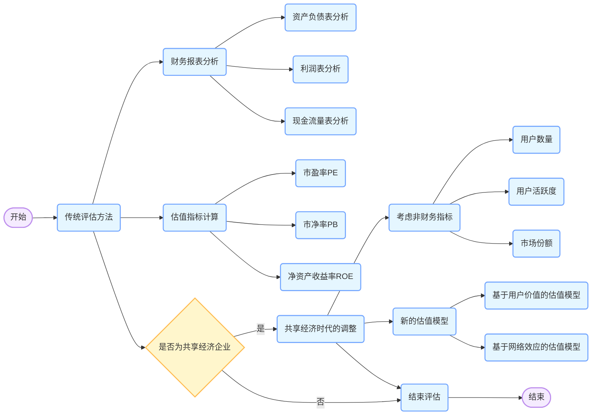

# 格雷厄姆特价股票理论在共享经济时代的新思考

> 关键词：格雷厄姆特价股票理论、共享经济时代、价值投资、股票评估、市场变化

> 摘要：本文聚焦于格雷厄姆特价股票理论在共享经济时代的应用与发展。首先介绍了该理论的背景及相关概念，深入剖析其核心原理与架构。接着阐述了该理论的核心算法原理，并给出具体操作步骤的 Python 代码示例。通过数学模型和公式对理论进行详细讲解，并举例说明。结合项目实战，展示代码实际案例并进行详细解释。探讨了该理论在共享经济时代的实际应用场景，推荐了相关的学习资源、开发工具框架以及论文著作。最后总结了未来发展趋势与挑战，解答常见问题并提供扩展阅读与参考资料，旨在为投资者在共享经济环境下运用格雷厄姆特价股票理论提供全面且深入的思考。

## 1. 背景介绍 
### 1.1 目的和范围
格雷厄姆特价股票理论是价值投资领域的经典理论，由本杰明·格雷厄姆提出。该理论旨在帮助投资者识别被市场低估的股票，通过买入这些股票并长期持有以获取超额收益。在共享经济时代，市场环境发生了巨大变化，新的商业模式和企业形态不断涌现。本文的目的是重新审视格雷厄姆特价股票理论在共享经济背景下的适用性和局限性，探讨如何对该理论进行调整和优化，以适应新的市场环境。研究范围涵盖了共享经济的主要领域，如共享出行、共享住宿、共享办公等，分析在这些领域中运用该理论评估股票价值的方法和策略。

### 1.2 预期读者
本文预期读者主要包括对价值投资感兴趣的投资者，无论是个人投资者还是专业投资机构人员。同时，也适合金融领域的研究人员、学者以及相关专业的学生，他们可以通过本文深入了解格雷厄姆特价股票理论在共享经济时代的新发展和应用。此外，从事共享经济企业运营和管理的人员也可以从本文中获得关于企业价值评估和市场表现的启示。

### 1.3 文档结构概述
本文将按照以下结构展开：首先介绍格雷厄姆特价股票理论的核心概念及其与共享经济的联系，通过文本示意图和 Mermaid 流程图进行清晰展示；接着阐述该理论的核心算法原理，并给出具体操作步骤的 Python 代码实现；利用数学模型和公式对理论进行详细推导和说明，并结合实际案例进行举例；通过项目实战，展示如何在共享经济背景下运用该理论进行股票评估的代码案例，并对代码进行详细解读；探讨该理论在共享经济时代的实际应用场景；推荐相关的学习资源、开发工具框架以及论文著作；最后总结未来发展趋势与挑战，解答常见问题并提供扩展阅读与参考资料。

### 1.4 术语表
#### 1.4.1 核心术语定义
- **格雷厄姆特价股票理论**：一种价值投资理论，强调通过分析股票的内在价值，寻找被市场低估的股票进行投资。内在价值通常基于公司的财务状况、盈利能力等因素进行评估。
- **共享经济**：一种基于互联网技术的经济模式，通过整合闲置资源，实现资源的高效利用和共享。参与者可以通过共享平台将自己闲置的资产或服务提供给他人使用，从而获得经济收益。
- **股票内在价值**：指股票所代表的公司的真实价值，是基于公司的基本面因素，如资产、盈利、现金流等计算得出的价值。与股票的市场价格相对，市场价格可能会受到市场情绪、供求关系等因素的影响而偏离内在价值。
- **安全边际**：格雷厄姆特价股票理论中的重要概念，指股票的内在价值与市场价格之间的差额。安全边际越大，意味着投资风险越小，潜在收益越高。

#### 1.4.2 相关概念解释
- **价值投资**：一种投资策略，投资者通过分析公司的基本面，寻找具有长期投资价值的股票，而不是关注短期市场波动。价值投资者相信，股票的价格最终会回归其内在价值，因此会在股票价格低于内在价值时买入，并长期持有。
- **共享经济平台**：指提供共享经济服务的互联网平台，如滴滴出行、Airbnb 等。这些平台通过技术手段连接资源提供者和需求者，实现资源的共享和交易。
- **财务报表分析**：对公司财务报表进行分析，以评估公司的财务状况和经营业绩。常用的财务报表包括资产负债表、利润表和现金流量表，通过分析这些报表中的数据，可以了解公司的资产结构、盈利能力、偿债能力等。

#### 1.4.3 缩略词列表
- **PE**：市盈率（Price-to-Earnings Ratio），指股票价格与每股收益的比率，用于衡量股票的估值水平。
- **PB**：市净率（Price-to-Book Ratio），指股票价格与每股净资产的比率，反映了市场对公司净资产的估值。
- **ROE**：净资产收益率（Return on Equity），指公司净利润与净资产的比率，衡量了公司运用自有资本的效率。

## 2. 核心概念与联系 
### 核心概念原理
格雷厄姆特价股票理论的核心原理是寻找被市场低估的股票，即股票的市场价格低于其内在价值。该理论认为，市场有时会出现非理性行为，导致股票价格偏离其内在价值。投资者可以通过深入分析公司的基本面，如财务状况、盈利能力、行业竞争力等，计算出股票的内在价值，并在市场价格低于内在价值时买入股票，等待价格回归价值，从而获得投资收益。

在共享经济时代，企业的商业模式和盈利模式发生了很大变化。共享经济企业通常依赖于互联网平台和大数据技术，通过整合闲置资源实现规模经济和范围经济。这些企业的价值不仅仅取决于传统的财务指标，还受到用户数量、用户活跃度、市场份额等因素的影响。因此，在运用格雷厄姆特价股票理论评估共享经济企业的股票时，需要对传统的评估方法进行调整和扩展。

### 架构的文本示意图
```plaintext
格雷厄姆特价股票理论
|
|-- 传统评估方法
|   |-- 财务报表分析
|   |   |-- 资产负债表分析
|   |   |-- 利润表分析
|   |   |-- 现金流量表分析
|   |-- 估值指标计算
|   |   |-- 市盈率（PE）
|   |   |-- 市净率（PB）
|   |   |-- 净资产收益率（ROE）
|
|-- 共享经济时代的调整
|   |-- 考虑非财务指标
|   |   |-- 用户数量
|   |   |-- 用户活跃度
|   |   |-- 市场份额
|   |-- 新的估值模型
|   |   |-- 基于用户价值的估值模型
|   |   |-- 基于网络效应的估值模型
```

### Mermaid 流程图


## 3. 核心算法原理 & 具体操作步骤 
### 核心算法原理
格雷厄姆特价股票理论的核心算法是计算股票的内在价值，并与市场价格进行比较。传统的计算方法主要基于公司的财务报表数据，常用的公式有：

- **基于市盈率的估值方法**：
  内在价值 $V = EPS \times PE_{合理}$
  其中，$EPS$ 是每股收益，$PE_{合理}$ 是合理的市盈率。合理的市盈率可以参考同行业公司的平均市盈率或根据公司的盈利增长情况进行调整。

- **基于市净率的估值方法**：
  内在价值 $V = BVPS \times PB_{合理}$
  其中，$BVPS$ 是每股净资产，$PB_{合理}$ 是合理的市净率。合理的市净率同样可以参考同行业公司的平均水平或根据公司的资产质量和盈利能力进行调整。

在共享经济时代，需要对上述算法进行改进，考虑非财务指标的影响。例如，可以基于用户价值构建估值模型：

- **基于用户价值的估值方法**：
  内在价值 $V = \sum_{i=1}^{n} U_i \times UV_i + FV$
  其中，$U_i$ 是第 $i$ 类用户的数量，$UV_i$ 是第 $i$ 类用户的平均价值，$FV$ 是公司的传统财务价值。

### 具体操作步骤
#### 步骤 1：收集数据
- 收集公司的财务报表数据，包括资产负债表、利润表和现金流量表。
- 收集共享经济企业的非财务数据，如用户数量、用户活跃度、市场份额等。

#### 步骤 2：计算传统估值指标
- 计算每股收益 $EPS$、每股净资产 $BVPS$ 等财务指标。
- 根据同行业公司的平均水平或公司的盈利增长情况，确定合理的市盈率 $PE_{合理}$ 和市净率 $PB_{合理}$。
- 计算基于市盈率和市净率的内在价值。

#### 步骤 3：考虑非财务指标
- 对共享经济企业的用户进行分类，如活跃用户、潜在用户等。
- 估算每类用户的平均价值 $UV_i$。
- 计算基于用户价值的内在价值。

#### 步骤 4：综合评估
- 将传统估值方法和基于非财务指标的估值方法相结合，得到综合的内在价值。
- 将综合内在价值与市场价格进行比较，判断股票是否被低估。

### Python 代码实现
```python
import pandas as pd

# 步骤 1：收集数据
# 假设财务数据存储在 CSV 文件中
financial_data = pd.read_csv('financial_data.csv')
# 假设非财务数据存储在另一个 CSV 文件中
non_financial_data = pd.read_csv('non_financial_data.csv')

# 步骤 2：计算传统估值指标
# 计算每股收益 EPS
EPS = financial_data['Net Income'] / financial_data['Shares Outstanding']
# 计算每股净资产 BVPS
BVPS = financial_data['Total Equity'] / financial_data['Shares Outstanding']

# 假设合理的市盈率和市净率
PE_reasonable = 15
PB_reasonable = 2

# 计算基于市盈率的内在价值
V_PE = EPS * PE_reasonable
# 计算基于市净率的内在价值
V_PB = BVPS * PB_reasonable

# 步骤 3：考虑非财务指标
# 假设用户数据分为活跃用户和潜在用户
active_users = non_financial_data['Active Users']
potential_users = non_financial_data['Potential Users']

# 假设活跃用户和潜在用户的平均价值
active_user_value = 10
potential_user_value = 5

# 计算基于用户价值的内在价值
user_value = active_users * active_user_value + potential_users * potential_user_value
# 假设公司的传统财务价值
financial_value = financial_data['Total Equity']
V_user = user_value + financial_value

# 步骤 4：综合评估
# 简单平均综合内在价值
V_combined = (V_PE + V_PB + V_user) / 3

# 假设市场价格
market_price = 50

# 判断股票是否被低估
is_undervalued = V_combined > market_price

print(f"基于市盈率的内在价值: {V_PE.values[0]}")
print(f"基于市净率的内在价值: {V_PB.values[0]}")
print(f"基于用户价值的内在价值: {V_user.values[0]}")
print(f"综合内在价值: {V_combined.values[0]}")
print(f"股票是否被低估: {is_undervalued}")
```

## 4. 数学模型和公式 & 详细讲解 & 举例说明 
### 传统估值模型
#### 基于市盈率的估值模型
公式：$V = EPS \times PE_{合理}$
详细讲解：市盈率（PE）是衡量股票估值的常用指标，它反映了投资者为获取公司每一元盈利所愿意支付的价格。合理的市盈率可以参考同行业公司的平均市盈率，也可以根据公司的盈利增长情况进行调整。例如，如果一家公司的盈利增长速度较快，其合理的市盈率可能会高于同行业平均水平。

举例说明：假设某公司的每股收益 $EPS = 2$ 元，同行业公司的平均市盈率为 15。则该公司股票的内在价值 $V = 2 \times 15 = 30$ 元。如果该股票的市场价格为 25 元，则说明该股票可能被低估。

#### 基于市净率的估值模型
公式：$V = BVPS \times PB_{合理}$
详细讲解：市净率（PB）反映了市场对公司净资产的估值。合理的市净率同样可以参考同行业公司的平均水平，也可以根据公司的资产质量和盈利能力进行调整。一般来说，资产质量较好、盈利能力较强的公司，其合理的市净率可能会较高。

举例说明：假设某公司的每股净资产 $BVPS = 10$ 元，同行业公司的平均市净率为 2。则该公司股票的内在价值 $V = 10 \times 2 = 20$ 元。如果该股票的市场价格为 18 元，则说明该股票可能被低估。

### 共享经济时代的估值模型
#### 基于用户价值的估值模型
公式：$V = \sum_{i=1}^{n} U_i \times UV_i + FV$
详细讲解：在共享经济时代，用户是企业的重要资产。该模型将企业的价值分为两部分：用户价值和传统财务价值。用户价值是通过不同类型用户的数量乘以其平均价值得到的总和，传统财务价值可以是公司的净资产或其他财务指标。

举例说明：假设某共享经济企业有活跃用户 100 万人，潜在用户 200 万人，活跃用户的平均价值为 10 元，潜在用户的平均价值为 5 元，公司的净资产为 500 万元。则该企业的内在价值 $V = 100 \times 10 + 200 \times 5 + 500 = 2500$ 万元。

#### 基于网络效应的估值模型
公式：$V = k \times N^2$
详细讲解：网络效应是共享经济的重要特征之一，即随着用户数量的增加，网络的价值呈指数级增长。该模型中，$N$ 是用户数量，$k$ 是一个与网络特性相关的常数。

举例说明：假设某共享经济平台的用户数量为 1000 人，$k = 0.01$。则该平台的价值 $V = 0.01 \times 1000^2 = 10000$ 元。当用户数量增加到 2000 人时，平台的价值 $V = 0.01 \times 2000^2 = 40000$ 元，可见随着用户数量的增加，平台的价值大幅增长。

## 5. 项目实战：代码实际案例和详细解释说明 
### 5.1  开发环境搭建
#### 安装 Python
首先需要安装 Python 编程语言，建议安装 Python 3.7 及以上版本。可以从 Python 官方网站（https://www.python.org/downloads/）下载适合自己操作系统的安装包，按照安装向导进行安装。

#### 安装必要的库
使用 Python 的包管理工具 `pip` 安装所需的库，主要包括 `pandas` 用于数据处理。在命令行中运行以下命令：
```sh
pip install pandas
```

#### 准备数据
创建两个 CSV 文件 `financial_data.csv` 和 `non_financial_data.csv`，分别存储公司的财务数据和非财务数据。以下是示例数据：

`financial_data.csv`：
```plaintext
Net Income,Shares Outstanding,Total Equity
1000000,500000,2000000
```

`non_financial_data.csv`：
```plaintext
Active Users,Potential Users
100000,200000
```

### 5.2  源代码详细实现和代码解读
```python
import pandas as pd

# 步骤 1：收集数据
# 假设财务数据存储在 CSV 文件中
financial_data = pd.read_csv('financial_data.csv')
# 假设非财务数据存储在另一个 CSV 文件中
non_financial_data = pd.read_csv('non_financial_data.csv')

# 步骤 2：计算传统估值指标
# 计算每股收益 EPS
EPS = financial_data['Net Income'] / financial_data['Shares Outstanding']
# 计算每股净资产 BVPS
BVPS = financial_data['Total Equity'] / financial_data['Shares Outstanding']

# 假设合理的市盈率和市净率
PE_reasonable = 15
PB_reasonable = 2

# 计算基于市盈率的内在价值
V_PE = EPS * PE_reasonable
# 计算基于市净率的内在价值
V_PB = BVPS * PB_reasonable

# 步骤 3：考虑非财务指标
# 假设用户数据分为活跃用户和潜在用户
active_users = non_financial_data['Active Users']
potential_users = non_financial_data['Potential Users']

# 假设活跃用户和潜在用户的平均价值
active_user_value = 10
potential_user_value = 5

# 计算基于用户价值的内在价值
user_value = active_users * active_user_value + potential_users * potential_user_value
# 假设公司的传统财务价值
financial_value = financial_data['Total Equity']
V_user = user_value + financial_value

# 步骤 4：综合评估
# 简单平均综合内在价值
V_combined = (V_PE + V_PB + V_user) / 3

# 假设市场价格
market_price = 50

# 判断股票是否被低估
is_undervalued = V_combined > market_price

print(f"基于市盈率的内在价值: {V_PE.values[0]}")
print(f"基于市净率的内在价值: {V_PB.values[0]}")
print(f"基于用户价值的内在价值: {V_user.values[0]}")
print(f"综合内在价值: {V_combined.values[0]}")
print(f"股票是否被低估: {is_undervalued}")
```

### 5.3  代码解读与分析
#### 数据收集部分
```python
financial_data = pd.read_csv('financial_data.csv')
non_financial_data = pd.read_csv('non_financial_data.csv')
```
使用 `pandas` 库的 `read_csv` 函数读取存储财务数据和非财务数据的 CSV 文件。

#### 传统估值指标计算部分
```python
EPS = financial_data['Net Income'] / financial_data['Shares Outstanding']
BVPS = financial_data['Total Equity'] / financial_data['Shares Outstanding']
V_PE = EPS * PE_reasonable
V_PB = BVPS * PB_reasonable
```
计算每股收益 $EPS$ 和每股净资产 $BVPS$，并根据合理的市盈率和市净率计算基于市盈率和市净率的内在价值。

#### 非财务指标考虑部分
```python
active_users = non_financial_data['Active Users']
potential_users = non_financial_data['Potential Users']
user_value = active_users * active_user_value + potential_users * potential_user_value
V_user = user_value + financial_value
```
提取活跃用户和潜在用户数量，根据假设的用户平均价值计算用户价值，并加上公司的传统财务价值得到基于用户价值的内在价值。

#### 综合评估部分
```python
V_combined = (V_PE + V_PB + V_user) / 3
is_undervalued = V_combined > market_price
```
将三种估值方法得到的内在价值进行简单平均，得到综合内在价值，并与市场价格进行比较，判断股票是否被低估。

## 6. 实际应用场景 
### 共享出行领域
在共享出行领域，如滴滴出行、Uber 等公司，用户数量和用户活跃度是影响公司价值的重要因素。投资者可以运用格雷厄姆特价股票理论的改进版本，结合传统财务指标和用户数据进行股票评估。例如，通过分析公司的财务报表了解其盈利能力和资产状况，同时关注用户数量的增长趋势、用户的使用频率等非财务指标。如果公司的市场价格低于综合内在价值，则可能是一个投资机会。

### 共享住宿领域
对于共享住宿平台，如 Airbnb，除了财务数据外，房源数量、用户评价、市场份额等因素也会影响公司的价值。投资者可以使用基于用户价值和网络效应的估值模型，考虑平台上房东和租客的数量及其活跃度，评估公司的内在价值。当市场对公司的估值低于计算得出的内在价值时，投资者可以考虑买入该公司的股票。

### 共享办公领域
共享办公企业，如 WeWork，其价值不仅取决于办公空间的租赁收入等财务指标，还与入驻企业的数量、客户满意度等非财务因素有关。投资者可以通过分析公司的财务报表和非财务数据，运用改进后的格雷厄姆特价股票理论，判断公司股票是否被低估。同时，关注行业竞争态势和市场发展趋势，以做出更准确的投资决策。

## 7. 工具和资源推荐
### 7.1 学习资源推荐
#### 7.1.1 书籍推荐
- 《聪明的投资者》（The Intelligent Investor）：本杰明·格雷厄姆的经典著作，详细阐述了价值投资的理念和方法，是学习格雷厄姆特价股票理论的必读之书。
- 《证券分析》（Security Analysis）：同样是格雷厄姆的著作，对证券分析的基本原理和方法进行了系统的介绍，为投资者提供了深入分析公司基本面的工具。
- 《共享经济：重构未来商业新模式》：该书介绍了共享经济的发展现状、商业模式和未来趋势，有助于投资者了解共享经济领域的特点和规律。

#### 7.1.2 在线课程
- Coursera 上的“价值投资原理”课程：由知名教授授课，系统讲解价值投资的理论和实践，包括格雷厄姆特价股票理论的应用。
- edX 上的“共享经济与创新”课程：深入探讨共享经济的商业模式、技术创新和政策法规，帮助投资者了解共享经济时代的市场环境。

#### 7.1.3 技术博客和网站
- Seeking Alpha：提供专业的股票分析和投资建议，涵盖了各种投资策略和理论，包括价值投资。
- 雪球网：国内知名的投资社区，投资者可以在上面交流投资经验，分享对不同股票的分析和看法。

### 7.2 开发工具框架推荐
#### 7.2.1 IDE和编辑器
- PyCharm：一款专业的 Python 集成开发环境，提供了丰富的代码编辑、调试和分析功能，适合开发基于 Python 的股票分析程序。
- Jupyter Notebook：一种交互式的开发环境，支持 Python 代码的编写和运行，方便进行数据探索和分析。

#### 7.2.2 调试和性能分析工具
- pdb：Python 自带的调试工具，可以帮助开发者定位代码中的错误和问题。
- cProfile：Python 的性能分析工具，用于分析代码的运行时间和性能瓶颈，优化代码性能。

#### 7.2.3 相关框架和库
- pandas：强大的数据处理和分析库，提供了高效的数据结构和数据操作方法，用于处理和分析股票数据。
- numpy：用于科学计算的基础库，提供了多维数组和数学函数，在股票分析中可以用于数据计算和统计分析。

### 7.3 相关论文著作推荐
#### 7.3.1 经典论文
- 《The Theory of Investment Value》：由约翰·伯尔·威廉姆斯撰写，提出了现金流折现模型，为价值投资提供了重要的理论基础。
- 《The Superinvestors of Graham-and-Doddsville》：沃伦·巴菲特的文章，阐述了格雷厄姆价值投资理论的有效性和成功案例。

#### 7.3.2 最新研究成果
- 关于共享经济企业估值方法的研究论文，如基于用户行为数据的估值模型、考虑网络效应的估值方法等。
- 探讨格雷厄姆特价股票理论在新兴市场和新经济模式下的应用和改进的研究成果。

#### 7.3.3 应用案例分析
- 分析共享经济领域成功企业的投资案例，如滴滴出行、Airbnb 等公司的股票投资分析，了解如何在实际应用中运用格雷厄姆特价股票理论。

## 8. 总结：未来发展趋势与挑战
### 未来发展趋势
- **融合更多数据维度**：随着大数据和人工智能技术的发展，未来在运用格雷厄姆特价股票理论评估共享经济企业时，将融合更多的数据维度，如用户的社交数据、消费行为数据等，以更全面地评估企业的价值。
- **智能化投资决策**：利用机器学习和深度学习算法，对大量的股票数据和市场信息进行分析和预测，实现智能化的投资决策。投资者可以借助智能投资系统，更快速、准确地筛选出被低估的股票。
- **跨行业整合**：共享经济与其他行业的融合将越来越深入，如共享出行与新能源汽车、智能交通的结合。在评估相关企业的股票时，需要考虑跨行业的因素和协同效应，拓展格雷厄姆特价股票理论的应用范围。

### 挑战
- **数据质量和可靠性**：共享经济企业的非财务数据往往难以准确获取和验证，数据质量和可靠性存在一定问题。这可能会影响基于非财务指标的估值模型的准确性，给投资者带来决策风险。
- **商业模式创新带来的不确定性**：共享经济行业的商业模式不断创新，新的盈利模式和竞争格局不断涌现。传统的估值方法可能无法及时适应这些变化，导致对企业价值的评估出现偏差。
- **市场情绪和政策风险**：股票市场受到市场情绪和政策法规的影响较大。在共享经济时代，政策的变化可能会对共享经济企业的发展产生重大影响，市场情绪的波动也可能导致股票价格偏离其内在价值，增加了投资的难度和风险。

## 9. 附录：常见问题与解答
### 问题 1：如何确定合理的市盈率和市净率？
解答：合理的市盈率和市净率可以参考同行业公司的平均水平。可以通过金融数据提供商获取同行业公司的市盈率和市净率数据，计算其平均值作为参考。同时，还需要考虑公司的盈利增长情况、资产质量、行业竞争力等因素。如果公司的盈利增长速度较快、资产质量较好，其合理的市盈率和市净率可能会高于同行业平均水平。

### 问题 2：如何估算共享经济企业用户的平均价值？
解答：估算共享经济企业用户的平均价值可以采用多种方法。一种方法是根据企业的收入和用户数量进行简单计算，即用户平均价值 = 企业收入 / 用户数量。另一种方法是分析用户的消费行为和生命周期价值，考虑用户在不同阶段的消费金额和消费频率，以及用户的留存率等因素，综合估算用户的平均价值。

### 问题 3：基于用户价值的估值模型是否适用于所有共享经济企业？
解答：基于用户价值的估值模型并不是适用于所有共享经济企业。该模型更适用于那些用户是企业核心资产、用户数量和用户活跃度对企业价值影响较大的共享经济企业，如共享出行、共享住宿等平台型企业。对于一些以技术研发或供应链管理为核心竞争力的共享经济企业，可能需要结合其他估值方法进行综合评估。

## 10. 扩展阅读 & 参考资料
### 扩展阅读
- 《创新者的窘境》（The Innovator's Dilemma）：探讨了企业在面对技术创新和市场变化时的困境和应对策略，对于理解共享经济企业的发展和竞争具有一定的启示作用。
- 《平台革命》（Platform Revolution）：介绍了平台经济的发展规律和商业模式，有助于深入了解共享经济平台的运营机制和价值创造方式。

### 参考资料
- 本杰明·格雷厄姆的相关著作和论文。
- 金融数据提供商（如 Bloomberg、Wind 等）提供的股票数据和行业研究报告。
- 学术数据库（如知网、万方等）中关于价值投资和共享经济的研究论文。

作者：AI天才研究院/AI Genius Institute & 禅与计算机程序设计艺术 /Zen And The Art of Computer Programming