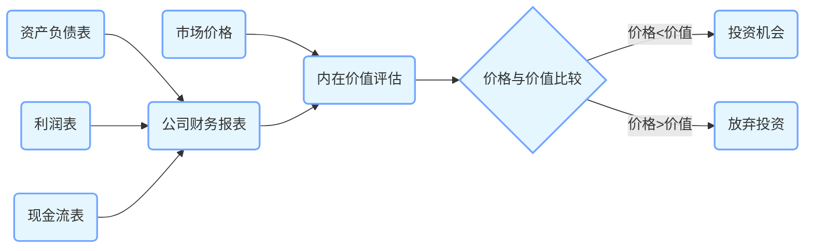
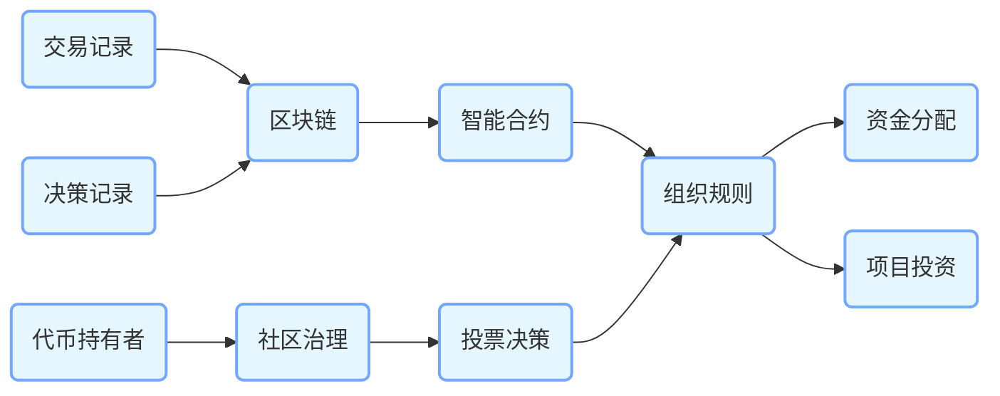

# 格雷厄姆特价股票理论在去中心化自治组织(DAO)时代的新思考

> 关键词：格雷厄姆特价股票理论、去中心化自治组织（DAO）、价值投资、区块链、加密资产

> 摘要：本文旨在探讨格雷厄姆特价股票理论在去中心化自治组织（DAO）时代的新应用与思考。首先介绍了格雷厄姆特价股票理论的背景及其核心概念，分析了其在传统金融市场中的应用原理。接着引入去中心化自治组织（DAO）的概念，阐述其特点和运行机制。然后详细探讨了在DAO时代，格雷厄姆特价股票理论面临的挑战与机遇，以及如何对该理论进行调整和应用。通过实际案例分析和数学模型推导，为投资者在DAO环境下运用类似价值投资策略提供了指导。最后，对未来的发展趋势进行了展望，并指出可能面临的挑战。

## 1. 背景介绍 
### 1.1 目的和范围
本研究的目的是深入探讨格雷厄姆特价股票理论在去中心化自治组织（DAO）时代的适用性和新的应用方式。随着区块链技术的发展，DAO作为一种新型的组织形式逐渐兴起，其运行机制和资产特征与传统金融市场有很大不同。格雷厄姆特价股票理论作为价值投资的经典理论，在传统金融市场中取得了显著的成效。我们希望通过研究，分析该理论在DAO时代是否依然有效，以及如何对其进行改进和拓展，以适应新的市场环境。本研究的范围涵盖了格雷厄姆特价股票理论的核心原理、DAO的基本概念和运行机制、两者的结合点以及实际应用案例等方面。

### 1.2 预期读者
本文的预期读者包括对价值投资理论感兴趣的投资者、区块链技术和去中心化组织的研究人员、金融科技领域的从业者以及对新兴金融市场有探索欲望的学生和爱好者。对于投资者来说，本文可以提供在DAO环境下新的投资思路和策略；对于研究人员和从业者，有助于深入理解传统金融理论在新兴技术背景下的演变和应用；对于学生和爱好者，能够帮助他们拓宽视野，了解金融和科技的交叉领域。

### 1.3 文档结构概述
本文将按照以下结构进行阐述：首先介绍核心概念，包括格雷厄姆特价股票理论和去中心化自治组织（DAO）的定义、原理和架构；接着分析核心算法原理和具体操作步骤，通过Python代码示例展示如何在DAO环境下进行类似价值评估的操作；然后给出相关的数学模型和公式，并结合实际案例进行详细讲解；之后进行项目实战，介绍开发环境搭建、源代码实现和代码解读；再探讨该理论在实际应用场景中的表现；推荐相关的工具和资源，包括学习资源、开发工具框架和论文著作等；最后对未来发展趋势与挑战进行总结，并提供常见问题解答和扩展阅读参考资料。

### 1.4 术语表
#### 1.4.1 核心术语定义
- **格雷厄姆特价股票理论**：由本杰明·格雷厄姆提出的价值投资理论，核心思想是寻找价格低于内在价值的股票进行投资，通过分析公司的财务状况、资产负债表等基本面因素来评估股票的内在价值。
- **去中心化自治组织（DAO）**：基于区块链技术的一种新型组织形式，没有传统的中心化管理机构，其决策和运营通过智能合约和社区共识来实现。成员通过持有特定的加密代币参与组织的治理和决策。
- **价值投资**：一种投资策略，强调通过分析资产的内在价值，寻找被低估的资产进行投资，以获得长期的投资回报。
- **加密资产**：基于区块链技术的数字化资产，如比特币、以太坊等加密货币，以及DAO发行的代币等。

#### 1.4.2 相关概念解释
- **区块链**：一种分布式账本技术，通过去中心化的方式记录交易信息，具有不可篡改、透明等特点。区块链是DAO运行的底层技术基础。
- **智能合约**：一种自动执行的合约，其条款以代码的形式存储在区块链上。当满足预设的条件时，智能合约会自动执行相应的操作，无需第三方干预。DAO的决策和运营通常通过智能合约来实现。
- **社区共识**：在DAO中，社区成员通过投票等方式达成对组织决策的共识。这种共识机制确保了组织的民主性和公正性。

#### 1.4.3 缩略词列表
- **DAO**：Decentralized Autonomous Organization（去中心化自治组织）
- **ICO**：Initial Coin Offering（首次代币发行）
- **NFT**：Non - Fungible Token（非同质化代币）

## 2. 核心概念与联系 

### 2.1 格雷厄姆特价股票理论
格雷厄姆特价股票理论是价值投资的基石。其核心原理是，股票的价格和内在价值之间存在差异。内在价值是公司基本面因素决定的真实价值，包括公司的资产、盈利能力、现金流等。当股票价格低于其内在价值时，该股票被认为是被低估的，具有投资价值。

格雷厄姆提出了一系列评估股票内在价值的方法，例如通过分析公司的资产负债表，计算每股净资产、市盈率等指标。他认为，投资者应该关注公司的长期基本面，而不是短期的市场波动。

以下是格雷厄姆特价股票理论的架构示意图：



### 2.2 去中心化自治组织（DAO）
去中心化自治组织（DAO）是基于区块链技术的新型组织形式。它具有以下特点：
- **去中心化**：没有单一的中心化管理机构，决策由社区成员共同参与和决定。
- **自治性**：通过智能合约自动执行组织的规则和决策，无需人工干预。
- **透明性**：所有的交易和决策记录都存储在区块链上，公开透明，任何人都可以查看。

DAO的运行机制通常包括以下几个方面：
- **代币发行**：DAO通过发行代币来筹集资金和激励社区成员。代币持有者可以参与组织的治理和决策。
- **社区治理**：社区成员通过投票等方式对组织的重大决策进行表决，如项目投资、资金分配等。
- **智能合约执行**：智能合约规定了组织的运行规则和决策流程，当满足预设条件时，智能合约会自动执行相应的操作。

以下是DAO的架构示意图：



### 2.3 两者的联系
在DAO时代，格雷厄姆特价股票理论的核心思想——寻找被低估的资产仍然具有重要意义。虽然DAO的资产形式和运行机制与传统股票市场不同，但也存在价格与价值的差异。例如，DAO发行的代币价格可能会受到市场情绪、炒作等因素的影响，出现价格偏离其内在价值的情况。投资者可以借鉴格雷厄姆的价值评估方法，对DAO的代币进行分析，寻找被低估的投资机会。

同时，DAO的透明性和社区治理机制为价值评估提供了新的视角。由于DAO的所有信息都公开透明，投资者可以更全面地了解组织的运营情况和财务状况，从而更准确地评估其内在价值。社区治理机制也使得DAO的决策更加民主和合理，有助于提高组织的长期价值。

## 3. 核心算法原理 & 具体操作步骤 

### 3.1 格雷厄姆价值评估算法原理
在传统股票市场中，格雷厄姆常用的价值评估方法是计算每股净资产和市盈率。每股净资产是公司净资产除以总股本，反映了公司每股股票所代表的实际资产价值。市盈率是股票价格除以每股收益，反映了市场对公司盈利能力的预期。

以下是使用Python代码实现简单的每股净资产和市盈率计算的示例：

```python
# 定义公司的财务数据
total_assets = 1000000  # 总资产
total_liabilities = 500000  # 总负债
total_shares = 100000  # 总股本
stock_price = 20  # 股票价格
net_income = 100000  # 净利润

# 计算每股净资产
net_asset_value_per_share = (total_assets - total_liabilities) / total_shares

# 计算每股收益
earnings_per_share = net_income / total_shares

# 计算市盈率
price_earnings_ratio = stock_price / earnings_per_share

print(f"每股净资产: {net_asset_value_per_share}")
print(f"每股收益: {earnings_per_share}")
print(f"市盈率: {price_earnings_ratio}")
```

### 3.2 在DAO环境下的调整与应用
在DAO环境下，由于资产形式和财务数据的不同，需要对格雷厄姆的价值评估方法进行调整。例如，DAO的资产可能包括加密货币、NFT等数字化资产，其价值评估需要考虑这些资产的特性。

一种可能的方法是评估DAO的储备资产价值和社区活跃度。储备资产价值可以通过计算DAO持有的加密货币和其他资产的市场价值来确定。社区活跃度可以通过社区成员的参与度、投票率等指标来衡量。

以下是一个简单的在DAO环境下进行价值评估的Python代码示例：

```python
# 定义DAO的储备资产数据
crypto_reserves = {
    "BTC": 10,  # 比特币数量
    "ETH": 100  # 以太坊数量
}

# 定义加密货币的市场价格
crypto_prices = {
    "BTC": 50000,  # 比特币价格
    "ETH": 3000  # 以太坊价格
}

# 定义社区活跃度指标
community_participation_rate = 0.8  # 社区成员参与率
vote_rate = 0.6  # 投票率

# 计算储备资产总价值
reserve_asset_value = 0
for crypto, amount in crypto_reserves.items():
    reserve_asset_value += amount * crypto_prices[crypto]

# 计算综合价值得分
# 这里简单假设综合价值得分 = 储备资产价值 * 社区活跃度系数
community_activity_coefficient = (community_participation_rate + vote_rate) / 2
composite_value_score = reserve_asset_value * community_activity_coefficient

print(f"储备资产总价值: {reserve_asset_value}")
print(f"综合价值得分: {composite_value_score}")
```

### 3.3 具体操作步骤
1. **数据收集**：收集DAO的相关信息，包括储备资产数据、社区活跃度指标、代币价格等。可以通过区块链浏览器、DAO官方网站等渠道获取这些数据。
2. **价值评估**：根据上述算法原理，对DAO的内在价值进行评估。计算储备资产价值和综合价值得分。
3. **价格比较**：将DAO代币的市场价格与评估得到的内在价值进行比较。如果市场价格低于内在价值，则认为该代币被低估，可能存在投资机会。
4. **决策制定**：根据价格与价值的比较结果，制定投资决策。同时，还需要考虑市场风险、行业趋势等因素。

## 4. 数学模型和公式 & 详细讲解 & 举例说明 

### 4.1 传统股票市场中的数学模型
#### 每股净资产
每股净资产（$NAVPS$）的计算公式为：
$$NAVPS = \frac{Total\ Assets - Total\ Liabilities}{Total\ Shares}$$
其中，$Total\ Assets$ 表示公司的总资产，$Total\ Liabilities$ 表示公司的总负债，$Total\ Shares$ 表示公司的总股本。

例如，某公司的总资产为 $1000$ 万元，总负债为 $500$ 万元，总股本为 $100$ 万股。则该公司的每股净资产为：
$$NAVPS = \frac{1000 - 500}{100} = 5$$（元/股）

#### 市盈率
市盈率（$P/E$）的计算公式为：
$$P/E = \frac{Stock\ Price}{Earnings\ Per\ Share}$$
其中，$Stock\ Price$ 表示股票的市场价格，$Earnings\ Per\ Share$ 表示每股收益。每股收益的计算公式为：
$$Earnings\ Per\ Share = \frac{Net\ Income}{Total\ Shares}$$
其中，$Net\ Income$ 表示公司的净利润。

例如，某公司的净利润为 $100$ 万元，总股本为 $100$ 万股，股票市场价格为 $20$ 元/股。则该公司的每股收益为：
$$Earnings\ Per\ Share = \frac{100}{100} = 1$$（元/股）
市盈率为：
$$P/E = \frac{20}{1} = 20$$

### 4.2 DAO环境下的数学模型
#### 储备资产价值
储备资产价值（$RAV$）的计算公式为：
$$RAV = \sum_{i=1}^{n} Amount_i \times Price_i$$
其中，$Amount_i$ 表示DAO持有的第 $i$ 种加密资产的数量，$Price_i$ 表示第 $i$ 种加密资产的市场价格，$n$ 表示DAO持有的加密资产的种类数。

例如，某DAO持有的比特币数量为 $10$ 个，以太坊数量为 $100$ 个，比特币价格为 $50000$ 元/个，以太坊价格为 $3000$ 元/个。则该DAO的储备资产价值为：
$$RAV = 10 \times 50000 + 100 \times 3000 = 500000 + 300000 = 800000$$（元）

#### 综合价值得分
综合价值得分（$CVS$）的计算公式为：
$$CVS = RAV \times CAC$$
其中，$CAC$ 表示社区活跃度系数，计算公式为：
$$CAC = \frac{Community\ Participation\ Rate + Vote\ Rate}{2}$$
其中，$Community\ Participation\ Rate$ 表示社区成员参与率，$Vote\ Rate$ 表示投票率。

例如，某DAO的储备资产价值为 $800000$ 元，社区成员参与率为 $0.8$，投票率为 $0.6$。则该DAO的社区活跃度系数为：
$$CAC = \frac{0.8 + 0.6}{2} = 0.7$$
综合价值得分：
$$CVS = 800000 \times 0.7 = 560000$$

### 4.3 举例说明
假设我们要评估一个名为 $DAO_X$ 的去中心化自治组织。通过区块链浏览器和DAO官方网站，我们收集到以下信息：
- $DAO_X$ 持有的加密资产包括 $5$ 个比特币和 $200$ 个以太坊。当前比特币价格为 $40000$ 元/个，以太坊价格为 $2500$ 元/个。
- 社区成员参与率为 $0.7$，投票率为 $0.5$。
- $DAO_X$ 代币的市场价格为每个 $100$ 元，总发行量为 $10000$ 个。

首先，计算储备资产价值：
$$RAV = 5 \times 40000 + 200 \times 2500 = 200000 + 500000 = 700000$$（元）

然后，计算社区活跃度系数：
$$CAC = \frac{0.7 + 0.5}{2} = 0.6$$

接着，计算综合价值得分：
$$CVS = 700000 \times 0.6 = 420000$$（元）

最后，计算每个代币的内在价值：
$$Intrinsic\ Value\ per\ Token = \frac{CVS}{Total\ Tokens} = \frac{420000}{10000} = 42$$（元/个）

由于代币的市场价格为 $100$ 元/个，高于内在价值 $42$ 元/个，从价值投资的角度来看，该代币可能被高估，不建议投资。

## 5. 项目实战：代码实际案例和详细解释说明 

### 5.1  开发环境搭建
为了实现上述在DAO环境下的价值评估代码，我们需要搭建以下开发环境：
- **Python环境**：建议使用Python 3.7及以上版本。可以从Python官方网站（https://www.python.org/downloads/）下载并安装。
- **开发工具**：可以使用任何文本编辑器或集成开发环境（IDE），如Visual Studio Code、PyCharm等。
- **相关库**：为了方便获取加密货币价格数据，我们可以使用 `ccxt` 库。可以使用以下命令进行安装：
```sh
pip install ccxt
```

### 5.2  源代码详细实现和代码解读
以下是一个完整的在DAO环境下进行价值评估的Python代码示例，包括获取加密货币价格数据：

```python
import ccxt

# 定义DAO的储备资产数据
crypto_reserves = {
    "BTC": 5,
    "ETH": 200
}

# 定义社区活跃度指标
community_participation_rate = 0.7
vote_rate = 0.5

# 初始化交易所对象
exchange = ccxt.binance()

# 获取加密货币价格
crypto_prices = {}
for crypto in crypto_reserves.keys():
    symbol = f"{crypto}/USDT"
    ticker = exchange.fetch_ticker(symbol)
    crypto_prices[crypto] = ticker['last']

# 计算储备资产总价值
reserve_asset_value = 0
for crypto, amount in crypto_reserves.items():
    reserve_asset_value += amount * crypto_prices[crypto]

# 计算社区活跃度系数
community_activity_coefficient = (community_participation_rate + vote_rate) / 2

# 计算综合价值得分
composite_value_score = reserve_asset_value * community_activity_coefficient

# 假设DAO代币总发行量
total_tokens = 10000

# 计算每个代币的内在价值
intrinsic_value_per_token = composite_value_score / total_tokens

print(f"储备资产总价值: {reserve_asset_value}")
print(f"综合价值得分: {composite_value_score}")
print(f"每个代币的内在价值: {intrinsic_value_per_token}")
```

### 代码解读与分析
1. **导入库**：导入 `ccxt` 库，用于获取加密货币的价格数据。
2. **定义数据**：定义DAO的储备资产数据和社区活跃度指标。
3. **初始化交易所对象**：使用 `ccxt.binance()` 初始化币安交易所对象，用于获取加密货币价格。
4. **获取加密货币价格**：遍历DAO持有的加密资产，通过 `fetch_ticker` 方法获取每个加密货币的最新价格，并存储在 `crypto_prices` 字典中。
5. **计算储备资产总价值**：根据储备资产数量和价格，计算储备资产的总价值。
6. **计算社区活跃度系数**：根据社区成员参与率和投票率，计算社区活跃度系数。
7. **计算综合价值得分**：将储备资产总价值乘以社区活跃度系数，得到综合价值得分。
8. **计算每个代币的内在价值**：假设DAO代币的总发行量，将综合价值得分除以总发行量，得到每个代币的内在价值。
9. **输出结果**：打印储备资产总价值、综合价值得分和每个代币的内在价值。

通过这个代码示例，我们可以在实际项目中对DAO的价值进行评估，为投资决策提供参考。

## 6. 实际应用场景 
### 6.1 投资者决策
对于投资者来说，在DAO时代，运用格雷厄姆特价股票理论进行价值评估可以帮助他们寻找被低估的DAO代币进行投资。通过分析DAO的储备资产价值和社区活跃度，投资者可以更准确地判断代币的内在价值，从而做出更明智的投资决策。例如，当一个DAO的代币价格低于其内在价值时，投资者可以考虑买入该代币，等待价格回归价值，获取投资收益。

### 6.2 DAO治理
在DAO的治理过程中，价值评估也具有重要意义。DAO的社区成员可以通过评估组织的内在价值，来决定是否支持某项决策或提案。例如，如果一项提案能够提高DAO的储备资产价值或社区活跃度，从而提升组织的内在价值，那么社区成员可能会更倾向于支持该提案。

### 6.3 行业研究
对于区块链行业的研究人员来说，对DAO的价值评估可以帮助他们了解不同DAO的发展状况和竞争力。通过比较不同DAO的内在价值和市场表现，研究人员可以分析行业的发展趋势，为行业的发展提供参考和建议。

## 7. 工具和资源推荐
### 7.1 学习资源推荐
#### 7.1.1 书籍推荐
- 《聪明的投资者》（The Intelligent Investor）：本杰明·格雷厄姆的经典著作，详细阐述了价值投资的理论和方法，是学习格雷厄姆特价股票理论的必读之书。
- 《区块链革命》（The Blockchain Revolution）：介绍了区块链技术的基本原理和应用场景，对于理解去中心化自治组织（DAO）的运行机制有很大帮助。
- 《加密资产：新的投资前沿》（Cryptoassets: The Innovative Investor's Guide to Bitcoin and Beyond）：深入探讨了加密资产的投资策略和风险，适合对DAO代币投资感兴趣的读者。

#### 7.1.2 在线课程
- Coursera上的“区块链基础”（Blockchain Basics）课程：由专业教授授课，系统地介绍了区块链技术的基础知识和应用。
- Udemy上的“价值投资实战”（Value Investing in Practice）课程：通过实际案例讲解价值投资的方法和技巧，帮助学员掌握格雷厄姆特价股票理论的应用。
- edX上的“去中心化自治组织（DAO）：原理与实践”（Decentralized Autonomous Organizations (DAOs): Principles and Practice）课程：专门针对DAO的运行机制和治理模式进行讲解，适合深入了解DAO的学员。

#### 7.1.3 技术博客和网站
- CoinDesk：是一家专注于区块链和加密货币领域的新闻媒体网站，提供最新的行业动态、技术分析和市场评论。
- Medium上的区块链相关博客：有许多区块链技术专家和研究人员在Medium上分享他们的见解和研究成果，可以从中获取关于DAO和价值投资的最新观点。
- Reddit的r/DAO和r/ValueInvesting板块：是社区成员交流DAO和价值投资经验的平台，可以参与讨论，获取不同的观点和建议。

### 7.2 开发工具框架推荐
#### 7.2.1 IDE和编辑器
- Visual Studio Code：一款轻量级的开源代码编辑器，支持多种编程语言和插件扩展，适合Python开发和区块链项目开发。
- PyCharm：专业的Python集成开发环境，提供丰富的代码编辑、调试和测试功能，对于Python代码的开发和调试非常方便。
- Remix：专门用于以太坊智能合约开发的在线集成开发环境，支持Solidity语言的编写、编译和部署，对于开发与DAO相关的智能合约非常有用。

#### 7.2.2 调试和性能分析工具
- Ganache：以太坊的个人区块链，用于开发和测试智能合约。可以模拟以太坊网络的运行环境，方便进行智能合约的调试和测试。
- Truffle Suite：一套用于以太坊开发的工具集，包括Truffle框架、Ganache和Drizzle等。Truffle框架提供了项目管理、合约编译、部署和测试等功能，大大提高了开发效率。
- cProfile：Python的内置性能分析工具，可以帮助开发者找出代码中的性能瓶颈，优化代码性能。

#### 7.2.3 相关框架和库
- ccxt：一个加密货币交易库，支持多个加密货币交易所的API，可以方便地获取加密货币的价格数据和进行交易操作。
- Web3.py：Python的以太坊开发库，提供了与以太坊区块链交互的接口，用于开发与DAO相关的以太坊应用。
- Solidity：以太坊智能合约的编程语言，是开发DAO智能合约的核心工具。

### 7.3 相关论文著作推荐
#### 7.3.1 经典论文
- “Bitcoin: A Peer - to - Peer Electronic Cash System”：比特币的白皮书，由中本聪撰写，介绍了比特币的基本原理和运行机制，是区块链技术的奠基之作。
- “The Logic of Collective Action”：由曼瑟尔·奥尔森撰写，探讨了集体行动的逻辑和困境，对于理解DAO的社区治理机制有一定的启发。
- “Value Investing: The Use of Historical Financial Statement Information to Separate Winners from Losers”：研究了价值投资策略在股票市场中的应用，为格雷厄姆特价股票理论提供了实证支持。

#### 7.3.2 最新研究成果
- 关注顶级学术期刊如ACM Transactions on Internet Technology、IEEE Transactions on Blockchain and Distributed Ledger Technology等，这些期刊会发表关于区块链和DAO的最新研究成果。
- 参加区块链领域的国际学术会议，如IEEE International Conference on Decentralized Applications and Infrastructures（DAPPS）、ACM Conference on Computer and Communications Security（CCS）等，获取最新的研究动态。

#### 7.3.3 应用案例分析
- 研究一些成功的DAO案例，如MakerDAO、Aave DAO等，分析它们的运行机制、价值评估方法和社区治理模式，从中吸取经验教训。
- 关注行业报告和研究机构的分析文章，如CoinGecko、Messari等发布的关于DAO的研究报告，了解DAO行业的发展现状和趋势。

## 8. 总结：未来发展趋势与挑战
### 8.1 未来发展趋势
- **理论融合与创新**：随着DAO的发展，格雷厄姆特价股票理论可能会与区块链技术、加密经济学等领域的理论进行融合和创新。例如，开发更适合DAO环境的价值评估模型，考虑更多的因素，如DAO的治理机制、社区文化等。
- **自动化投资策略**：借助人工智能和机器学习技术，开发自动化的投资策略。通过对大量DAO数据的分析和学习，自动识别被低估的DAO代币，实现更高效的投资决策。
- **跨链DAO的发展**：随着跨链技术的发展，未来可能会出现跨链的DAO。这将使得不同区块链上的资源和资产能够进行整合，扩大DAO的规模和影响力。同时，也需要对跨链DAO的价值评估方法进行进一步的研究和探索。

### 8.2 挑战
- **数据质量和可靠性**：在DAO环境下，数据的质量和可靠性是一个重要的挑战。由于区块链上的数据虽然公开透明，但可能存在数据不完整、不准确等问题。例如，DAO的储备资产数据可能存在更新不及时的情况，影响价值评估的准确性。
- **市场波动性**：加密资产市场具有较高的波动性，DAO代币的价格也会受到市场情绪、宏观经济环境等因素的影响。这使得价值评估和投资决策更加困难，需要投资者具备更强的风险承受能力和市场分析能力。
- **法律和监管问题**：目前，DAO的法律地位和监管框架还不明确。不同国家和地区对DAO的态度和监管政策存在差异，这给DAO的发展和投资者带来了一定的不确定性。例如，一些国家可能对DAO的代币发行和交易进行严格限制，影响DAO的融资和运营。

## 9. 附录：常见问题与解答
### 9.1 格雷厄姆特价股票理论在DAO时代是否仍然适用？
虽然DAO的资产形式和运行机制与传统股票市场不同，但格雷厄姆特价股票理论的核心思想——寻找被低估的资产仍然适用。在DAO时代，投资者可以借鉴该理论的价值评估方法，结合DAO的特点，对DAO的代币进行分析，寻找投资机会。

### 9.2 如何获取DAO的相关数据？
可以通过以下途径获取DAO的相关数据：
- 区块链浏览器：如Etherscan、BscScan等，可以查看DAO的交易记录、储备资产情况等。
- DAO官方网站：大多数DAO都会在其官方网站上公布组织的财务状况、治理规则等信息。
- 第三方数据平台：如CoinGecko、Messari等，提供DAO的市场数据和分析报告。

### 9.3 投资DAO代币有哪些风险？
投资DAO代币存在以下风险：
- 市场风险：加密资产市场具有较高的波动性，DAO代币的价格可能会大幅波动，导致投资者的资产损失。
- 技术风险：DAO基于区块链技术运行，如果区块链技术出现漏洞或故障，可能会影响DAO的正常运营。
- 法律和监管风险：目前DAO的法律地位和监管框架还不明确，不同国家和地区的监管政策可能会对DAO的发展和投资者的权益产生影响。

### 9.4 如何评估DAO的社区活跃度？
可以通过以下指标评估DAO的社区活跃度：
- 社区成员参与率：即参与DAO社区活动的成员数量占总成员数量的比例。
- 投票率：即参与DAO投票决策的成员数量占总成员数量的比例。
- 社区讨论热度：可以通过社区论坛、社交媒体等渠道的讨论数量和质量来评估。

## 10. 扩展阅读 & 参考资料
### 10.1 扩展阅读
- 《数字黄金：比特币鲜为人知的故事》（Digital Gold: Bitcoin and the Inside Story of the Misfits and Millionaires Trying to Reinvent Money）：讲述了比特币的发展历程和背后的故事，有助于深入了解区块链和加密资产的起源。
- 《分布式账本技术：原理、设计与应用》：系统介绍了分布式账本技术的原理、设计和应用场景，对于理解DAO的底层技术有很大帮助。
- 《金融科技：重构未来金融生态》：探讨了金融科技的发展趋势和对传统金融行业的影响，为在DAO时代进行金融创新提供了思路。

### 10.2 参考资料
- 本杰明·格雷厄姆. 《聪明的投资者》. 人民邮电出版社.
- 唐塔普斯科特, 亚力克斯·塔普斯科特. 《区块链革命》. 中信出版社.
- 克里斯·伯尼斯克, 杰克·塔塔尔. 《加密资产：新的投资前沿》. 机械工业出版社.
- 中本聪. “Bitcoin: A Peer - to - Peer Electronic Cash System”. 2008.
- 曼瑟尔·奥尔森. 《集体行动的逻辑》. 上海人民出版社.
- Joseph D. Piotroski. “Value Investing: The Use of Historical Financial Statement Information to Separate Winners from Losers”. The Accounting Review, 2000.

作者：AI天才研究院/AI Genius Institute & 禅与计算机程序设计艺术 /Zen And The Art of Computer Programming