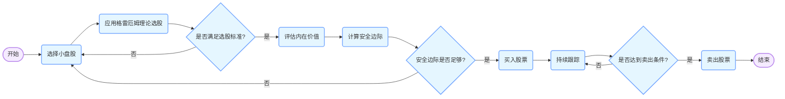

# 格雷厄姆特价股票理论在小盘股中的应用

> 关键词：格雷厄姆特价股票理论、小盘股、价值投资、选股策略、财务分析

> 摘要：本文深入探讨了格雷厄姆特价股票理论在小盘股投资领域的应用。首先介绍了该理论的背景、目的和适用范围，以及预期读者和文档结构。接着阐述了核心概念与联系，包括格雷厄姆理论的原理和相关架构。详细讲解了核心算法原理及具体操作步骤，并用 Python 代码进行实现。通过数学模型和公式进一步剖析理论，结合实际例子加深理解。以项目实战的方式展示代码实际案例，并对开发环境搭建、源代码实现和代码进行解读分析。探讨了该理论在小盘股投资中的实际应用场景，推荐了学习资源、开发工具框架以及相关论文著作。最后总结了未来发展趋势与挑战，解答了常见问题并提供了扩展阅读和参考资料，旨在为投资者在小盘股投资中运用格雷厄姆理论提供全面的指导。

## 1. 背景介绍 
### 1.1 目的和范围
本研究的主要目的是探究格雷厄姆特价股票理论在小盘股投资中的有效性和应用方法。格雷厄姆作为价值投资的鼻祖，其特价股票理论为投资者提供了一种寻找被市场低估股票的方法。然而，该理论最初主要基于对大盘股的研究，对于小盘股的适用性需要进一步探讨。本研究将分析该理论在小盘股投资中的优势和局限性，提供具体的选股策略和操作方法，帮助投资者在小盘股市场中寻找潜在的投资机会。

研究范围涵盖了小盘股的定义、格雷厄姆特价股票理论的核心内容，以及如何将该理论应用于小盘股的筛选、分析和投资决策。同时，还将结合实际案例和市场数据，验证该理论在小盘股投资中的可行性和有效性。

### 1.2 预期读者
本文的预期读者主要包括以下几类人群：
- 个人投资者：对股票投资感兴趣，尤其是希望通过价值投资方法在小盘股市场中获取收益的个人投资者。
- 专业投资机构人员：如基金经理、分析师等，希望深入了解格雷厄姆理论在小盘股投资中的应用，为投资决策提供参考。
- 金融专业学生和研究人员：对价值投资理论和小盘股市场有研究需求，希望通过本文获取相关知识和研究思路。

### 1.3 文档结构概述
本文将按照以下结构进行阐述：
- 核心概念与联系：介绍格雷厄姆特价股票理论和小盘股的核心概念，以及它们之间的联系。
- 核心算法原理 & 具体操作步骤：详细讲解基于格雷厄姆理论的选股算法原理，并给出具体的操作步骤。
- 数学模型和公式 & 详细讲解 & 举例说明：通过数学模型和公式对格雷厄姆理论进行量化分析，并结合实际例子进行说明。
- 项目实战：代码实际案例和详细解释说明：通过实际的 Python 代码实现选股策略，并对代码进行详细解读。
- 实际应用场景：探讨格雷厄姆理论在小盘股投资中的实际应用场景。
- 工具和资源推荐：推荐学习资源、开发工具框架和相关论文著作。
- 总结：未来发展趋势与挑战：总结研究成果，分析未来发展趋势和面临的挑战。
- 附录：常见问题与解答：解答读者可能遇到的常见问题。
- 扩展阅读 & 参考资料：提供相关的扩展阅读和参考资料。

### 1.4 术语表
#### 1.4.1 核心术语定义
- 格雷厄姆特价股票理论：由本杰明·格雷厄姆提出的一种价值投资理论，该理论认为股票存在内在价值，当股票价格低于其内在价值时，股票被低估，具有投资价值。
- 小盘股：指流通市值较小的股票，通常没有统一的标准，一般认为流通市值在 10 亿元以下的股票为小盘股。
- 内在价值：股票的真实价值，由公司的基本面因素如盈利能力、资产状况等决定。
- 安全边际：股票价格低于其内在价值的幅度，安全边际越大，投资风险越小。

#### 1.4.2 相关概念解释
- 价值投资：一种基于股票内在价值进行投资的策略，投资者通过分析公司的基本面，寻找被低估的股票进行投资。
- 基本面分析：通过研究公司的财务报表、行业前景、管理层能力等基本面因素，评估公司的价值和发展潜力。
- 市盈率（PE）：股票价格与每股收益的比率，反映了市场对公司盈利的预期。
- 市净率（PB）：股票价格与每股净资产的比率，反映了市场对公司资产的估值。

#### 1.4.3 缩略词列表
- PE：市盈率（Price-to-Earnings Ratio）
- PB：市净率（Price-to-Book Ratio）
- EPS：每股收益（Earnings Per Share）
- BVPS：每股净资产（Book Value Per Share）

## 2. 核心概念与联系 

### 2.1 格雷厄姆特价股票理论原理
格雷厄姆特价股票理论的核心思想是寻找被市场低估的股票，即股票价格低于其内在价值的股票。格雷厄姆认为，股票的内在价值可以通过公司的基本面因素来评估，如盈利能力、资产状况、股息政策等。当股票价格低于其内在价值时，投资者可以获得安全边际，从而降低投资风险。

格雷厄姆提出了一些具体的选股标准，例如：
- 低市盈率：市盈率是衡量股票估值的重要指标之一，低市盈率意味着股票价格相对较低，具有较高的投资价值。
- 低市净率：市净率反映了股票价格与每股净资产的关系，低市净率表示股票价格相对净资产较低，具有一定的安全边际。
- 稳定的盈利：公司应该具有稳定的盈利能力，过去几年的盈利应该保持增长或至少稳定。
- 适当的股息政策：公司应该有适当的股息政策，能够向股东分配一定的股息。

### 2.2 小盘股的特点
小盘股具有以下特点：
- 流通市值小：小盘股的流通市值相对较小，通常在 10 亿元以下。由于流通市值小，小盘股的股价更容易受到市场资金的影响，波动较大。
- 成长潜力大：小盘股往往是新兴行业或中小企业的代表，具有较大的成长潜力。如果公司能够成功发展，其股价可能会有较大的涨幅。
- 信息透明度低：与大盘股相比，小盘股的信息透明度较低，投资者获取公司信息的难度较大。这也增加了投资小盘股的风险。
- 流动性较差：由于流通市值小，小盘股的交易量相对较小，流动性较差。在买卖小盘股时，可能会面临较高的交易成本和较大的价格波动。

### 2.3 格雷厄姆理论与小盘股的联系
将格雷厄姆特价股票理论应用于小盘股投资具有一定的合理性和可行性。一方面，小盘股由于其特点，更容易出现被市场低估的情况。例如，由于信息透明度低，投资者可能对小盘股的价值认识不足，导致股价被低估。另一方面，格雷厄姆理论的选股标准可以帮助投资者筛选出具有投资价值的小盘股。通过分析小盘股的市盈率、市净率、盈利情况等基本面因素，投资者可以找到那些被低估的小盘股，从而获得投资机会。

### 2.4 核心概念架构的文本示意图
```plaintext
格雷厄姆特价股票理论
|-- 内在价值评估
|   |-- 盈利能力分析
|   |-- 资产状况分析
|   |-- 股息政策分析
|-- 选股标准
|   |-- 低市盈率
|   |-- 低市净率
|   |-- 稳定盈利
|   |-- 适当股息政策

小盘股
|-- 特点
|   |-- 流通市值小
|   |-- 成长潜力大
|   |-- 信息透明度低
|   |-- 流动性较差

应用联系
|-- 小盘股易被低估
|-- 格雷厄姆理论筛选小盘股
```

### 2.5 Mermaid 流程图


## 3. 核心算法原理 & 具体操作步骤 

### 3.1 核心算法原理
基于格雷厄姆特价股票理论的选股算法主要是通过计算股票的市盈率、市净率、盈利增长率等指标，并与设定的选股标准进行比较，筛选出符合条件的股票。具体算法步骤如下：
1. 收集股票数据：包括股票价格、每股收益、每股净资产、盈利增长率等。
2. 计算指标：根据收集到的数据，计算股票的市盈率、市净率、盈利增长率等指标。
3. 筛选股票：根据格雷厄姆理论的选股标准，筛选出符合条件的股票。例如，市盈率低于一定值、市净率低于一定值、盈利增长率为正等。
4. 评估内在价值：对于筛选出的股票，进一步评估其内在价值。可以采用现金流折现法、股息折现法等方法进行评估。
5. 计算安全边际：根据股票的内在价值和当前价格，计算安全边际。安全边际越大，投资风险越小。
6. 做出投资决策：根据安全边际的大小，做出投资决策。如果安全边际足够大，则可以考虑买入股票；否则，继续筛选其他股票。

### 3.2 具体操作步骤

#### 3.2.1 数据收集
可以通过金融数据提供商（如东方财富、同花顺等）获取股票的历史数据，包括股票价格、每股收益、每股净资产、盈利增长率等。也可以使用 Python 的第三方库（如 `pandas-datareader`、`tushare` 等）来获取数据。

#### 3.2.2 指标计算
以下是使用 Python 计算市盈率、市净率和盈利增长率的示例代码：
```python
import pandas as pd

# 假设 data 是一个包含股票价格、每股收益、每股净资产的 DataFrame
data = pd.DataFrame({
    'price': [10, 12, 15],
    'eps': [1, 1.2, 1.5],
    'bvps': [5, 6, 7]
})

# 计算市盈率
data['pe'] = data['price'] / data['eps']

# 计算市净率
data['pb'] = data['price'] / data['bvps']

# 假设我们有过去几年的每股收益数据，计算盈利增长率
eps_history = pd.Series([0.8, 1, 1.2])
growth_rate = (eps_history.iloc[-1] - eps_history.iloc[0]) / eps_history.iloc[0]

print(data)
print('盈利增长率:', growth_rate)
```

#### 3.2.3 股票筛选
根据设定的选股标准，筛选出符合条件的股票。例如，假设我们的选股标准是市盈率低于 15、市净率低于 1.5、盈利增长率大于 0.1，则可以使用以下代码进行筛选：
```python
# 筛选股票
selected_stocks = data[(data['pe'] < 15) & (data['pb'] < 1.5) & (growth_rate > 0.1)]

print('筛选出的股票:', selected_stocks)
```

#### 3.2.4 内在价值评估
可以采用现金流折现法来评估股票的内在价值。现金流折现法的基本思想是将公司未来的现金流折现到当前，得到公司的内在价值。以下是一个简单的现金流折现法的示例代码：
```python
import numpy as np

# 假设公司未来每年的现金流为 100，折现率为 0.1，预计持续 10 年
cash_flows = np.repeat(100, 10)
discount_rate = 0.1

# 计算现金流的现值
present_values = cash_flows / (1 + discount_rate) ** np.arange(1, len(cash_flows) + 1)

# 计算内在价值
intrinsic_value = present_values.sum()

print('内在价值:', intrinsic_value)
```

#### 3.2.5 安全边际计算
安全边际可以通过以下公式计算：
$$安全边际 = \frac{内在价值 - 当前价格}{内在价值}$$

以下是计算安全边际的示例代码：
```python
# 假设当前股票价格为 80
current_price = 80

# 计算安全边际
margin_of_safety = (intrinsic_value - current_price) / intrinsic_value

print('安全边际:', margin_of_safety)
```

#### 3.2.6 投资决策
根据安全边际的大小，做出投资决策。如果安全边际足够大（例如，大于 0.3），则可以考虑买入股票；否则，继续筛选其他股票。

## 4. 数学模型和公式 & 详细讲解 & 举例说明 

### 4.1 市盈率（PE）
市盈率是股票价格与每股收益的比率，反映了市场对公司盈利的预期。其计算公式为：
$$PE = \frac{股票价格}{每股收益}$$

市盈率越低，说明股票价格相对每股收益越低，股票越具有投资价值。例如，某股票的价格为 20 元，每股收益为 2 元，则该股票的市盈率为：
$$PE = \frac{20}{2} = 10$$

### 4.2 市净率（PB）
市净率是股票价格与每股净资产的比率，反映了市场对公司资产的估值。其计算公式为：
$$PB = \frac{股票价格}{每股净资产}$$

市净率越低，说明股票价格相对每股净资产越低，股票越具有安全边际。例如，某股票的价格为 15 元，每股净资产为 10 元，则该股票的市净率为：
$$PB = \frac{15}{10} = 1.5$$

### 4.3 盈利增长率
盈利增长率反映了公司盈利能力的增长情况。其计算公式为：
$$盈利增长率 = \frac{当前每股收益 - 过去每股收益}{过去每股收益}$$

例如，某公司过去每股收益为 1 元，当前每股收益为 1.2 元，则该公司的盈利增长率为：
$$盈利增长率 = \frac{1.2 - 1}{1} = 0.2 = 20\%$$

### 4.4 现金流折现法（DCF）
现金流折现法是一种评估公司内在价值的方法，其基本思想是将公司未来的现金流折现到当前，得到公司的内在价值。其计算公式为：
$$V = \sum_{t=1}^{n} \frac{CF_t}{(1 + r)^t}$$
其中，$V$ 表示公司的内在价值，$CF_t$ 表示第 $t$ 期的现金流，$r$ 表示折现率，$n$ 表示预测期数。

例如，假设某公司未来每年的现金流为 100 万元，折现率为 10%，预计持续 5 年，则该公司的内在价值为：
$$V = \frac{100}{(1 + 0.1)^1} + \frac{100}{(1 + 0.1)^2} + \frac{100}{(1 + 0.1)^3} + \frac{100}{(1 + 0.1)^4} + \frac{100}{(1 + 0.1)^5}$$
```python
import numpy as np

cash_flows = np.repeat(100, 5)
discount_rate = 0.1
present_values = cash_flows / (1 + discount_rate) ** np.arange(1, len(cash_flows) + 1)
intrinsic_value = present_values.sum()

print('内在价值:', intrinsic_value)
```

### 4.5 安全边际
安全边际是股票内在价值与当前价格之间的差额，反映了投资的安全程度。其计算公式为：
$$安全边际 = \frac{内在价值 - 当前价格}{内在价值}$$

例如，某股票的内在价值为 120 元，当前价格为 100 元，则该股票的安全边际为：
$$安全边际 = \frac{120 - 100}{120} \approx 0.167 = 16.7\%$$

## 5. 项目实战：代码实际案例和详细解释说明 

### 5.1  开发环境搭建
#### 5.1.1 安装 Python
首先需要安装 Python 环境，建议使用 Python 3.7 及以上版本。可以从 Python 官方网站（https://www.python.org/downloads/）下载并安装。

#### 5.1.2 安装必要的库
需要安装一些必要的 Python 库，如 `pandas`、`numpy`、`tushare` 等。可以使用以下命令进行安装：
```sh
pip install pandas numpy tushare
```

#### 5.1.3 获取 tushare 令牌
`tushare` 是一个免费、开源的 Python 财经数据接口包，需要注册并获取令牌才能使用。可以在 tushare 官方网站（https://tushare.pro/）注册并获取令牌。

### 5.2  源代码详细实现和代码解读

```python
import tushare as ts
import pandas as pd
import numpy as np

# 设置 tushare 令牌
ts.set_token('your_token_here')
pro = ts.pro_api()

# 获取小盘股列表
def get_small_cap_stocks():
    # 假设小盘股的流通市值小于 10 亿元
    df = pro.daily_basic(ts_code='', trade_date='', fields='ts_code,total_mv')
    small_cap_stocks = df[df['total_mv'] < 100000]
    return small_cap_stocks['ts_code'].tolist()

# 获取股票财务数据
def get_stock_financial_data(ts_code):
    # 获取每股收益和每股净资产
    income_df = pro.income(ts_code=ts_code, fields='ts_code,end_date,eps')
    balance_df = pro.balancesheet(ts_code=ts_code, fields='ts_code,end_date,bvps')
    
    # 合并数据
    merged_df = pd.merge(income_df, balance_df, on=['ts_code', 'end_date'])
    merged_df = merged_df.sort_values(by='end_date', ascending=False)
    
    return merged_df

# 获取股票价格数据
def get_stock_price(ts_code):
    df = pro.daily(ts_code=ts_code, start_date='20230101', end_date='20231231')
    df = df.sort_values(by='trade_date', ascending=False)
    latest_price = df.iloc[0]['close']
    return latest_price

# 计算指标并筛选股票
def screen_stocks():
    small_cap_stocks = get_small_cap_stocks()
    selected_stocks = []
    
    for ts_code in small_cap_stocks:
        try:
            # 获取财务数据
            financial_data = get_stock_financial_data(ts_code)
            latest_eps = financial_data.iloc[0]['eps']
            latest_bvps = financial_data.iloc[0]['bvps']
            
            # 获取股票价格
            latest_price = get_stock_price(ts_code)
            
            # 计算市盈率和市净率
            pe = latest_price / latest_eps
            pb = latest_price / latest_bvps
            
            # 假设选股标准为 PE < 15, PB < 1.5
            if pe < 15 and pb < 1.5:
                selected_stocks.append(ts_code)
        except Exception as e:
            print(f'Error processing {ts_code}: {e}')
    
    return selected_stocks

# 主函数
if __name__ == '__main__':
    selected_stocks = screen_stocks()
    print('筛选出的小盘股:', selected_stocks)
```

### 5.3  代码解读与分析
- `get_small_cap_stocks` 函数：通过 `tushare` 的 `daily_basic` 接口获取所有股票的流通市值数据，筛选出流通市值小于 10 亿元的股票，返回这些股票的代码列表。
- `get_stock_financial_data` 函数：通过 `tushare` 的 `income` 和 `balancesheet` 接口分别获取股票的每股收益和每股净资产数据，合并后按日期降序排序，返回最新的财务数据。
- `get_stock_price` 函数：通过 `tushare` 的 `daily` 接口获取股票的历史价格数据，按日期降序排序，返回最新的收盘价。
- `screen_stocks` 函数：遍历所有小盘股，获取其财务数据和价格数据，计算市盈率和市净率，根据选股标准（市盈率小于 15，市净率小于 1.5）筛选出符合条件的股票，返回这些股票的代码列表。
- 主函数：调用 `screen_stocks` 函数进行股票筛选，并打印筛选出的小盘股代码列表。

## 6. 实际应用场景 
### 6.1 个人投资者的长期投资
对于个人投资者来说，将格雷厄姆特价股票理论应用于小盘股投资可以作为一种长期投资策略。个人投资者可以通过筛选出被低估的小盘股，长期持有这些股票，等待公司价值的回归和增长。由于小盘股具有较大的成长潜力，一旦公司发展成功，投资者可能会获得较高的收益。

### 6.2 专业投资机构的资产配置
专业投资机构可以将小盘股纳入其资产配置中，利用格雷厄姆理论筛选出具有投资价值的小盘股，分散投资风险。通过合理配置小盘股和其他资产，投资机构可以在保证一定收益的前提下，降低投资组合的整体风险。

### 6.3 价值投资研究和教学
格雷厄姆特价股票理论在小盘股中的应用可以作为价值投资研究和教学的案例。研究人员可以通过实证研究，验证该理论在小盘股投资中的有效性和适用性。教师可以将该案例引入课堂教学，帮助学生理解价值投资的理念和方法。

## 7. 工具和资源推荐
### 7.1 学习资源推荐
#### 7.1.1 书籍推荐
- 《聪明的投资者》（The Intelligent Investor）：本杰明·格雷厄姆的经典著作，详细阐述了价值投资的理念和方法。
- 《证券分析》（Security Analysis）：同样是格雷厄姆的著作，被誉为价值投资的“圣经”，对股票和债券的分析方法进行了深入探讨。
- 《怎样选择成长股》（Common Stocks and Uncommon Profits）：菲利普·费雪的著作，介绍了如何寻找具有成长潜力的股票。

#### 7.1.2 在线课程
- Coursera 上的“投资学原理”（Principles of Investing）课程：由知名教授授课，涵盖了投资的基本原理和方法。
- 网易云课堂上的“价值投资实战课程”：结合实际案例，讲解价值投资的实战技巧。

#### 7.1.3 技术博客和网站
- 雪球网（https://xueqiu.com/）：一个财经社交平台，提供股票行情、财经资讯和投资者交流社区。
- 东方财富网（https://www.eastmoney.com/）：提供全面的财经信息和金融数据，是投资者获取信息的重要渠道。

### 7.2 开发工具框架推荐
#### 7.2.1 IDE和编辑器
- PyCharm：一款专业的 Python 集成开发环境，提供代码编辑、调试、版本控制等功能。
- Jupyter Notebook：一个交互式的开发环境，适合进行数据分析和代码演示。

#### 7.2.2 调试和性能分析工具
- pdb：Python 自带的调试工具，可以帮助开发者调试代码。
- cProfile：Python 的性能分析工具，可以分析代码的运行时间和性能瓶颈。

#### 7.2.3 相关框架和库
- pandas：一个强大的数据分析库，提供了数据结构和数据处理工具。
- numpy：用于科学计算的基础库，提供了高效的数组操作和数学函数。
- tushare：一个免费、开源的 Python 财经数据接口包，方便获取股票数据。

### 7.3 相关论文著作推荐
#### 7.3.1 经典论文
- Graham, B., & Dodd, D. L. (1934). Security Analysis. McGraw-Hill. 该论文是价值投资领域的经典之作，提出了许多重要的投资理念和方法。
- Fama, E. F., & French, K. R. (1992). The Cross-Section of Expected Stock Returns. The Journal of Finance, 47(2), 427-465. 该论文提出了著名的 Fama-French 三因子模型，对股票收益的影响因素进行了深入研究。

#### 7.3.2 最新研究成果
- 在学术数据库（如 IEEE Xplore、ACM Digital Library 等）中搜索关于“格雷厄姆理论在小盘股投资中的应用”的最新研究论文，可以了解该领域的最新进展。

#### 7.3.3 应用案例分析
- 可以参考一些金融研究报告和案例分析书籍，了解格雷厄姆理论在实际投资中的应用案例和效果分析。

## 8. 总结：未来发展趋势与挑战
### 8.1 未来发展趋势
- 随着金融科技的发展，利用大数据和人工智能技术进行股票筛选和分析将成为趋势。投资者可以通过更精准的数据分析，找到更多被低估的小盘股。
- 小盘股市场将不断发展壮大，新兴行业和创新型企业将不断涌现，为投资者提供更多的投资机会。
- 价值投资理念将得到更广泛的认可和应用，投资者将更加注重股票的内在价值和基本面分析。

### 8.2 挑战
- 小盘股的信息透明度较低，投资者获取准确信息的难度较大，这增加了投资决策的风险。
- 小盘股的流动性较差，买卖股票时可能会面临较高的交易成本和较大的价格波动。
- 市场环境和经济形势的变化可能会影响小盘股的表现，投资者需要及时调整投资策略。

## 9. 附录：常见问题与解答
### 9.1 格雷厄姆特价股票理论适用于所有小盘股吗？
不是的。格雷厄姆理论主要适用于那些具有稳定盈利、资产状况良好的小盘股。对于一些新兴行业或处于亏损状态的小盘股，该理论的适用性可能会受到限制。

### 9.2 如何确定小盘股的内在价值？
可以采用多种方法来确定小盘股的内在价值，如现金流折现法、股息折现法、相对估值法等。不同的方法适用于不同类型的公司，投资者可以根据公司的特点选择合适的方法。

### 9.3 投资小盘股需要注意哪些风险？
投资小盘股需要注意以下风险：
- 信息不对称风险：小盘股的信息透明度较低，投资者可能无法获取准确的公司信息。
- 流动性风险：小盘股的交易量相对较小，买卖股票时可能会面临较高的交易成本和较大的价格波动。
- 经营风险：小盘股往往是新兴行业或中小企业，其经营稳定性较差，可能面临较大的经营风险。

### 9.4 如何跟踪和评估投资的小盘股？
投资者可以通过关注公司的财务报表、行业动态、管理层变动等信息，跟踪和评估投资的小盘股。同时，也可以定期对投资组合进行调整，以适应市场环境的变化。

## 10. 扩展阅读 & 参考资料
### 10.1 扩展阅读
- 《财务报表分析与证券定价》（Financial Statement Analysis and Security Valuation）：介绍了如何通过分析财务报表来评估股票的价值。
- 《投资中最简单的事》：作者邱国鹭分享了自己的投资经验和理念，对价值投资有深入的见解。

### 10.2 参考资料
- 东方财富网（https://www.eastmoney.com/）
- 雪球网（https://xueqiu.com/）
- tushare 官方网站（https://tushare.pro/）
- 《聪明的投资者》（The Intelligent Investor）
- 《证券分析》（Security Analysis）

作者：AI天才研究院/AI Genius Institute & 禅与计算机程序设计艺术 /Zen And The Art of Computer Programming