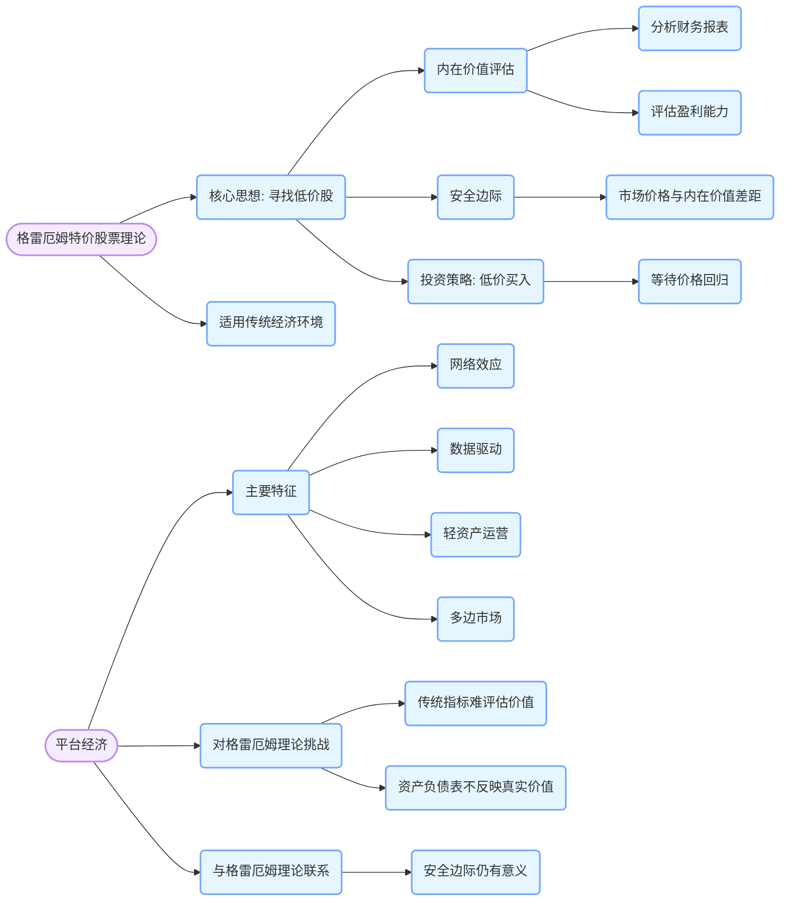

# 格雷厄姆特价股票理论在平台经济时代的新思考

> 关键词：格雷厄姆特价股票理论、平台经济时代、价值投资、股票估值、新思考

> 摘要：本文旨在探讨格雷厄姆特价股票理论在平台经济时代的适用性与新发展。格雷厄姆特价股票理论作为价值投资的经典理论，在传统经济环境下有着重要的指导意义。然而，平台经济时代具有诸多新的特征，如网络效应、数据驱动、轻资产运营等，这使得传统理论需要重新审视。文章将深入分析该理论的核心概念，结合平台经济的特点探讨其在新时代的挑战与机遇，通过数学模型、实际案例等进行详细阐述，并对未来发展趋势与挑战进行总结，为投资者在平台经济时代运用价值投资理念提供新的思路和参考。

## 1. 背景介绍 
### 1.1 目的和范围
本研究的目的在于深入剖析格雷厄姆特价股票理论在平台经济时代的有效性和局限性，探索该理论在新经济环境下的适应性调整和发展方向。研究范围涵盖了格雷厄姆特价股票理论的基本原理、平台经济的主要特征，以及两者之间的相互影响。通过对相关理论和实际案例的分析，旨在为投资者和金融从业者提供在平台经济时代运用价值投资策略的指导和建议。

### 1.2 预期读者
本文预期读者包括金融投资者、股票分析师、金融行业从业者、经济学和金融学专业的学生以及对价值投资和平台经济感兴趣的人士。这些读者希望了解格雷厄姆特价股票理论在平台经济时代的变化和应用，以便在投资决策中做出更明智的选择。

### 1.3 文档结构概述
本文将按照以下结构进行组织：首先介绍格雷厄姆特价股票理论和平台经济的背景知识；接着分析该理论在平台经济时代面临的挑战和机遇；然后通过数学模型和实际案例进一步探讨其在新环境下的应用；随后介绍相关的工具和资源；最后总结未来发展趋势与挑战，并提供常见问题解答和扩展阅读参考资料。

### 1.4 术语表
#### 1.4.1 核心术语定义
- **格雷厄姆特价股票理论**：由本杰明·格雷厄姆提出的一种价值投资理论，强调通过分析股票的内在价值，寻找价格低于其内在价值的股票进行投资。
- **平台经济**：一种基于数字技术，由数据驱动、平台支撑、网络协同的经济活动单元所构成的新经济系统，通过搭建平台连接供需双方，实现资源的高效配置。
- **内在价值**：股票所代表的企业的真实价值，通常通过对企业的财务状况、盈利能力、资产质量等因素进行综合评估得出。
- **安全边际**：股票的市场价格与内在价值之间的差距，是格雷厄姆特价股票理论中的重要概念，用于降低投资风险。

#### 1.4.2 相关概念解释
- **价值投资**：一种投资策略，投资者通过分析企业的基本面，寻找被低估的股票进行长期投资，以获取企业价值增长带来的收益。
- **网络效应**：平台经济中的一种现象，即随着平台用户数量的增加，平台的价值也会随之增加，从而吸引更多的用户，形成正反馈循环。
- **数据驱动**：平台经济依赖大量的数据进行决策和运营，通过对用户数据的分析和挖掘，提供个性化的服务和产品，提高平台的效率和竞争力。

#### 1.4.3 缩略词列表
- **PE**：市盈率（Price-to-Earnings Ratio），衡量股票价格相对于每股收益的指标。
- **PB**：市净率（Price-to-Book Ratio），衡量股票价格相对于每股净资产的指标。
- **DCF**：现金流折现法（Discounted Cash Flow），一种用于评估企业内在价值的方法，通过预测企业未来的现金流并折现到当前来计算企业的价值。

## 2. 核心概念与联系 
### 2.1 格雷厄姆特价股票理论核心原理
格雷厄姆特价股票理论的核心思想是寻找价格低于其内在价值的股票进行投资。格雷厄姆认为，股票市场存在着非理性的波动，导致股票价格有时会偏离其内在价值。投资者可以通过对企业的财务报表、资产负债表、盈利能力等进行深入分析，计算出股票的内在价值，并在股票价格低于内在价值时买入，等待市场价格回归内在价值时卖出，从而获得投资收益。

该理论强调安全边际的重要性，即股票的市场价格与内在价值之间的差距。安全边际可以为投资者提供一定的缓冲，降低投资风险。格雷厄姆认为，投资者应该寻找具有足够安全边际的股票进行投资，以确保在市场出现不利变化时，仍然能够保护自己的本金。

### 2.2 平台经济的主要特征
平台经济具有以下几个主要特征：
- **网络效应**：平台的价值随着用户数量的增加而增加。例如，社交媒体平台上的用户越多，每个用户能够获得的社交资源就越多，平台的吸引力也就越大。这种网络效应使得平台具有很强的规模经济和垄断性，一旦形成优势，很难被竞争对手打破。
- **数据驱动**：平台经济依赖大量的数据进行决策和运营。通过对用户数据的分析和挖掘，平台可以了解用户的需求和行为，提供个性化的服务和产品，提高用户满意度和忠诚度。同时，数据也可以帮助平台优化运营效率，降低成本。
- **轻资产运营**：平台企业通常不需要大量的固定资产投入，主要依靠技术和数据来运营。例如，电商平台不需要自己拥有大量的仓库和物流设施，而是通过与第三方合作来完成商品的存储和配送。这种轻资产运营模式使得平台企业具有较高的灵活性和扩展性。
- **多边市场**：平台通常连接多个不同的用户群体，形成多边市场。例如，电商平台连接了商家和消费者，搜索引擎平台连接了广告商和用户。平台通过提供不同的服务和产品，满足不同用户群体的需求，实现多边共赢。

### 2.3 两者之间的联系与冲突
在传统经济环境下，格雷厄姆特价股票理论主要关注企业的财务指标和资产价值。然而，平台经济的出现给该理论带来了新的挑战和机遇。

一方面，平台经济的网络效应和数据驱动特征使得平台企业的价值增长具有非线性和爆发性。传统的财务指标如市盈率、市净率等可能无法准确反映平台企业的真实价值。例如，一些新兴的平台企业在发展初期可能亏损严重，但由于其具有强大的网络效应和潜在的市场份额，其未来的盈利能力可能非常可观。这就使得按照传统的格雷厄姆特价股票理论来评估这些企业的价值变得困难。

另一方面，平台经济的轻资产运营模式也使得企业的资产负债表与传统企业有所不同。平台企业的核心资产往往是数据和技术，而这些资产在传统的财务报表中很难得到准确的体现。因此，仅仅依靠资产负债表来评估平台企业的内在价值可能会低估其真实价值。

然而，格雷厄姆特价股票理论中的安全边际概念在平台经济时代仍然具有重要的意义。虽然平台企业的价值评估存在一定的困难，但投资者仍然可以通过深入分析企业的基本面，寻找具有足够安全边际的投资机会。例如，投资者可以关注平台企业的用户增长趋势、市场份额、盈利能力等指标，评估其未来的发展潜力，并在股票价格具有一定安全边际时进行投资。

### 2.4 核心概念原理和架构的文本示意图
```plaintext
格雷厄姆特价股票理论
|-- 核心思想：寻找价格低于内在价值的股票
|   |-- 内在价值评估：分析财务报表、盈利能力等
|   |-- 安全边际：市场价格与内在价值的差距
|
|-- 投资策略：低价买入，等待价格回归
|
|-- 适用范围：传统经济环境下的股票投资

平台经济
|-- 主要特征
|   |-- 网络效应：用户数量增加，平台价值增加
|   |-- 数据驱动：依赖数据决策和运营
|   |-- 轻资产运营：主要依靠技术和数据
|   |-- 多边市场：连接多个用户群体
|
|-- 对格雷厄姆理论的挑战
|   |-- 传统财务指标难以准确评估价值
|   |-- 轻资产运营使资产负债表不能反映真实价值
|
|-- 与格雷厄姆理论的联系
|   |-- 安全边际概念仍有意义
```

### 2.5 Mermaid 流程图


## 3. 核心算法原理 & 具体操作步骤 
### 3.1 传统格雷厄姆特价股票评估算法
在传统的格雷厄姆特价股票理论中，常用的评估方法包括市盈率法、市净率法和现金流折现法。

#### 3.1.1 市盈率法
市盈率（PE）是股票价格与每股收益的比率，计算公式为：
$$PE = \frac{P}{EPS}$$
其中，$P$ 是股票的市场价格，$EPS$ 是每股收益。

格雷厄姆认为，低市盈率的股票可能被低估，具有投资价值。一般来说，他建议投资者选择市盈率低于一定阈值（如 15 倍）的股票。

以下是使用 Python 实现市盈率计算的代码示例：
```python
def calculate_pe(price, eps):
    """
    计算市盈率
    :param price: 股票价格
    :param eps: 每股收益
    :return: 市盈率
    """
    if eps == 0:
        return float('inf')
    return price / eps

# 示例数据
stock_price = 50
earnings_per_share = 5

pe_ratio = calculate_pe(stock_price, earnings_per_share)
print(f"该股票的市盈率为: {pe_ratio}")
```

#### 3.1.2 市净率法
市净率（PB）是股票价格与每股净资产的比率，计算公式为：
$$PB = \frac{P}{BVPS}$$
其中，$P$ 是股票的市场价格，$BVPS$ 是每股净资产。

格雷厄姆认为，市净率低于一定水平（如 1.5 倍）的股票可能被低估。市净率反映了股票价格相对于企业净资产的倍数，较低的市净率意味着投资者可以以较低的价格购买到企业的净资产。

以下是使用 Python 实现市净率计算的代码示例：
```python
def calculate_pb(price, bvps):
    """
    计算市净率
    :param price: 股票价格
    :param bvps: 每股净资产
    :return: 市净率
    """
    if bvps == 0:
        return float('inf')
    return price / bvps

# 示例数据
stock_price = 50
book_value_per_share = 20

pb_ratio = calculate_pb(stock_price, book_value_per_share)
print(f"该股票的市净率为: {pb_ratio}")
```

#### 3.1.3 现金流折现法
现金流折现法（DCF）是一种更复杂但更准确的评估企业内在价值的方法。该方法通过预测企业未来的现金流，并将其折现到当前来计算企业的内在价值。

假设企业未来 $n$ 年的自由现金流分别为 $FCF_1, FCF_2, \cdots, FCF_n$，折现率为 $r$，则企业的内在价值 $V$ 可以通过以下公式计算：
$$V = \sum_{i=1}^{n} \frac{FCF_i}{(1 + r)^i} + \frac{TV}{(1 + r)^n}$$
其中，$TV$ 是企业的终值，通常可以通过永续增长模型计算：
$$TV = \frac{FCF_{n+1}}{r - g}$$
$FCF_{n+1}$ 是第 $n+1$ 年的自由现金流，$g$ 是永续增长率。

以下是使用 Python 实现现金流折现法的代码示例：
```python
def dcf_valuation(fcf_list, r, g):
    """
    现金流折现法计算企业内在价值
    :param fcf_list: 未来各年的自由现金流列表
    :param r: 折现率
    :param g: 永续增长率
    :return: 企业内在价值
    """
    n = len(fcf_list)
    present_value = 0
    for i, fcf in enumerate(fcf_list):
        present_value += fcf / ((1 + r) ** (i + 1))

    # 计算终值
    fcf_n_plus_1 = fcf_list[-1] * (1 + g)
    tv = fcf_n_plus_1 / (r - g)
    present_value_of_tv = tv / ((1 + r) ** n)

    total_value = present_value + present_value_of_tv
    return total_value

# 示例数据
fcf_list = [100, 120, 150, 180, 200]
discount_rate = 0.1
perpetual_growth_rate = 0.03

intrinsic_value = dcf_valuation(fcf_list, discount_rate, perpetual_growth_rate)
print(f"该企业的内在价值为: {intrinsic_value}")
```

### 3.2 平台经济时代的调整算法
在平台经济时代，由于平台企业的特点与传统企业不同，需要对传统的评估算法进行调整。

#### 3.2.1 考虑网络效应的估值调整
网络效应使得平台企业的价值增长具有非线性特征。为了考虑网络效应，可以引入网络价值模型。一种简单的方法是使用梅特卡夫定律，该定律认为网络的价值与用户数量的平方成正比。

假设平台企业的用户数量为 $N$，每个用户的平均价值为 $v$，则平台的网络价值 $V_{network}$ 可以表示为：
$$V_{network} = kN^2v$$
其中，$k$ 是一个常数。

在使用现金流折现法评估平台企业价值时，可以将网络价值作为一个额外的因素考虑进去。例如，可以将网络价值按照一定的比例分摊到未来各年的现金流中，然后再进行折现计算。

以下是考虑网络效应后调整现金流折现法的 Python 代码示例：
```python
def dcf_valuation_with_network_effect(fcf_list, r, g, n, v, k):
    """
    考虑网络效应的现金流折现法计算企业内在价值
    :param fcf_list: 未来各年的自由现金流列表
    :param r: 折现率
    :param g: 永续增长率
    :param n: 用户数量
    :param v: 每个用户的平均价值
    :param k: 网络价值系数
    :return: 企业内在价值
    """
    network_value = k * n ** 2 * v
    num_years = len(fcf_list)
    # 将网络价值分摊到未来各年的现金流中
    adjusted_fcf_list = [fcf + network_value / num_years for fcf in fcf_list]

    return dcf_valuation(adjusted_fcf_list, r, g)

# 示例数据
fcf_list = [100, 120, 150, 180, 200]
discount_rate = 0.1
perpetual_growth_rate = 0.03
user_number = 1000
average_user_value = 10
network_value_coefficient = 0.001

intrinsic_value_with_network = dcf_valuation_with_network_effect(fcf_list, discount_rate, perpetual_growth_rate, user_number, average_user_value, network_value_coefficient)
print(f"考虑网络效应后该企业的内在价值为: {intrinsic_value_with_network}")
```

#### 3.2.2 数据资产的估值
平台企业的数据资产是其重要的核心资产之一，但在传统的财务报表中很难得到准确的体现。一种评估数据资产价值的方法是使用收益法，即通过预测数据资产未来能够带来的收益，并将其折现到当前来计算其价值。

假设数据资产未来 $m$ 年的收益分别为 $R_1, R_2, \cdots, R_m$，折现率为 $r_d$，则数据资产的价值 $V_{data}$ 可以通过以下公式计算：
$$V_{data} = \sum_{i=1}^{m} \frac{R_i}{(1 + r_d)^i}$$

在评估平台企业的内在价值时，可以将数据资产的价值加入到企业的总价值中。

以下是计算数据资产价值并加入企业总价值的 Python 代码示例：
```python
def calculate_data_asset_value(revenue_list, r_d):
    """
    计算数据资产价值
    :param revenue_list: 数据资产未来各年的收益列表
    :param r_d: 数据资产折现率
    :return: 数据资产价值
    """
    present_value = 0
    for i, revenue in enumerate(revenue_list):
        present_value += revenue / ((1 + r_d) ** (i + 1))
    return present_value

def dcf_valuation_with_data_asset(fcf_list, r, g, revenue_list, r_d):
    """
    考虑数据资产的现金流折现法计算企业内在价值
    :param fcf_list: 未来各年的自由现金流列表
    :param r: 折现率
    :param g: 永续增长率
    :param revenue_list: 数据资产未来各年的收益列表
    :param r_d: 数据资产折现率
    :return: 企业内在价值
    """
    data_asset_value = calculate_data_asset_value(revenue_list, r_d)
    intrinsic_value = dcf_valuation(fcf_list, r, g)
    total_value = intrinsic_value + data_asset_value
    return total_value

# 示例数据
fcf_list = [100, 120, 150, 180, 200]
discount_rate = 0.1
perpetual_growth_rate = 0.03
data_revenue_list = [20, 30, 40, 50, 60]
data_discount_rate = 0.15

intrinsic_value_with_data = dcf_valuation_with_data_asset(fcf_list, discount_rate, perpetual_growth_rate, data_revenue_list, data_discount_rate)
print(f"考虑数据资产后该企业的内在价值为: {intrinsic_value_with_data}")
```

### 3.3 具体操作步骤
#### 3.3.1 传统经济环境下的操作步骤
1. **收集数据**：收集目标企业的财务报表、年报等资料，获取每股收益、每股净资产、自由现金流等数据。
2. **计算估值指标**：使用市盈率法、市净率法和现金流折现法等计算目标股票的估值指标。
3. **评估安全边际**：比较股票的市场价格与计算得出的内在价值，评估安全边际。如果安全边际足够大，则认为该股票具有投资价值。
4. **做出投资决策**：根据评估结果，决定是否投资该股票。

#### 3.3.2 平台经济时代的操作步骤
1. **收集数据**：除了传统的财务数据外，还需要收集平台企业的用户数量、用户活跃度、数据资产等相关数据。
2. **调整估值算法**：根据平台经济的特点，对传统的估值算法进行调整，如考虑网络效应和数据资产的价值。
3. **计算估值指标**：使用调整后的估值算法计算平台企业的内在价值。
4. **评估安全边际**：同样比较股票的市场价格与调整后的内在价值，评估安全边际。
5. **做出投资决策**：综合考虑各种因素，包括平台企业的发展前景、竞争优势等，做出投资决策。

## 4. 数学模型和公式 & 详细讲解 & 举例说明 
### 4.1 传统格雷厄姆估值模型
#### 4.1.1 市盈率模型
市盈率（PE）模型是一种简单直观的估值方法，其公式为：
$$PE = \frac{P}{EPS}$$
其中，$P$ 是股票的市场价格，$EPS$ 是每股收益。

市盈率反映了投资者为获取每单位收益所愿意支付的价格。较低的市盈率可能意味着股票被低估，具有投资价值；而较高的市盈率可能意味着股票被高估，投资风险较大。

例如，某股票的市场价格为 $50$ 元，每股收益为 $5$ 元，则该股票的市盈率为：
$$PE = \frac{50}{5} = 10$$
如果该行业的平均市盈率为 $15$，则该股票的市盈率低于行业平均水平，可能被低估。

#### 4.1.2 市净率模型
市净率（PB）模型是通过比较股票价格与每股净资产来评估股票价值的方法，公式为：
$$PB = \frac{P}{BVPS}$$
其中，$P$ 是股票的市场价格，$BVPS$ 是每股净资产。

市净率反映了股票价格相对于企业净资产的倍数。较低的市净率可能意味着投资者可以以较低的价格购买到企业的净资产，具有一定的安全边际。

例如，某股票的市场价格为 $50$ 元，每股净资产为 $20$ 元，则该股票的市净率为：
$$PB = \frac{50}{20} = 2.5$$
如果该行业的平均市净率为 $3$，则该股票的市净率低于行业平均水平，可能被低估。

#### 4.1.3 现金流折现模型
现金流折现模型（DCF）是一种基于企业未来现金流的估值方法，其基本公式为：
$$V = \sum_{i=1}^{n} \frac{FCF_i}{(1 + r)^i} + \frac{TV}{(1 + r)^n}$$
其中，$V$ 是企业的内在价值，$FCF_i$ 是第 $i$ 年的自由现金流，$r$ 是折现率，$n$ 是预测期数，$TV$ 是企业的终值。

终值 $TV$ 通常可以通过永续增长模型计算：
$$TV = \frac{FCF_{n+1}}{r - g}$$
其中，$FCF_{n+1}$ 是第 $n+1$ 年的自由现金流，$g$ 是永续增长率。

例如，假设某企业未来 $5$ 年的自由现金流分别为 $100$ 万元、$120$ 万元、$150$ 万元、$180$ 万元、$200$ 万元，折现率为 $10\%$，永续增长率为 $3\%$。

首先计算终值：
第 $6$ 年的自由现金流 $FCF_6 = 200 \times (1 + 3\%) = 206$ 万元
终值 $TV = \frac{206}{0.1 - 0.03} = 2942.86$ 万元

然后计算各年现金流的现值：
第 1 年现金流现值 $PV_1 = \frac{100}{(1 + 0.1)^1} = 90.91$ 万元
第 2 年现金流现值 $PV_2 = \frac{120}{(1 + 0.1)^2} = 99.17$ 万元
第 3 年现金流现值 $PV_3 = \frac{150}{(1 + 0.1)^3} = 112.70$ 万元
第 4 年现金流现值 $PV_4 = \frac{180}{(1 + 0.1)^4} = 122.94$ 万元
第 5 年现金流现值 $PV_5 = \frac{200}{(1 + 0.1)^5} = 124.18$ 万元
终值现值 $PV_{TV} = \frac{2942.86}{(1 + 0.1)^5} = 1827.77$ 万元

企业的内在价值 $V = 90.91 + 99.17 + 112.70 + 122.94 + 124.18 + 1827.77 = 2377.67$ 万元

### 4.2 平台经济时代的数学模型调整
#### 4.2.1 考虑网络效应的模型
在平台经济中，网络效应使得平台的价值与用户数量密切相关。梅特卡夫定律认为网络的价值与用户数量的平方成正比，即：
$$V_{network} = kN^2v$$
其中，$V_{network}$ 是网络价值，$N$ 是用户数量，$v$ 是每个用户的平均价值，$k$ 是一个常数。

在现金流折现模型中考虑网络效应时，可以将网络价值按照一定的比例分摊到未来各年的现金流中。假设网络价值分摊到 $n$ 年中，则每年增加的现金流为 $\frac{V_{network}}{n}$。

例如，某平台企业的用户数量为 $1000$ 人，每个用户的平均价值为 $10$ 元，$k = 0.001$，则网络价值为：
$$V_{network} = 0.001 \times 1000^2 \times 10 = 10000$$ 元
如果预测期为 $5$ 年，则每年增加的现金流为 $\frac{10000}{5} = 2000$ 元。

在原有的现金流折现模型基础上，将每年的自由现金流加上 $2000$ 元，再进行折现计算，得到考虑网络效应后的企业内在价值。

#### 4.2.2 数据资产估值模型
数据资产是平台企业的重要资产之一。可以使用收益法来评估数据资产的价值，公式为：
$$V_{data} = \sum_{i=1}^{m} \frac{R_i}{(1 + r_d)^i}$$
其中，$V_{data}$ 是数据资产的价值，$R_i$ 是第 $i$ 年数据资产带来的收益，$r_d$ 是数据资产的折现率，$m$ 是预测期数。

例如，某平台企业的数据资产未来 $5$ 年的收益分别为 $20$ 万元、$30$ 万元、$40$ 万元、$50$ 万元、$60$ 万元，数据资产的折现率为 $15\%$。

则数据资产的价值为：
$$V_{data} = \frac{20}{(1 + 0.15)^1} + \frac{30}{(1 + 0.15)^2} + \frac{40}{(1 + 0.15)^3} + \frac{50}{(1 + 0.15)^4} + \frac{60}{(1 + 0.15)^5}$$
$$V_{data} = 17.39 + 22.68 + 26.23 + 28.53 + 29.89 = 124.72$$ 万元

在评估平台企业的内在价值时，将数据资产的价值 $124.72$ 万元加入到原有的企业内在价值中。

### 4.3 数学模型在实际案例中的应用
假设我们要评估一家电商平台企业的股票价值。

#### 4.3.1 传统方法评估
- **市盈率法**：该企业的市场价格为 $100$ 元，每股收益为 $8$ 元，则市盈率为：
$$PE = \frac{100}{8} = 12.5$$
如果该行业的平均市盈率为 $15$，从市盈率角度看，该股票可能被低估。
- **市净率法**：该企业的每股净资产为 $50$ 元，则市净率为：
$$PB = \frac{100}{50} = 2$$
如果该行业的平均市净率为 $2.5$，从市净率角度看，该股票也可能被低估。
- **现金流折现法**：预测该企业未来 $5$ 年的自由现金流分别为 $1000$ 万元、$1200$ 万元、$1500$ 万元、$1800$ 万元、$2000$ 万元，折现率为 $10\%$，永续增长率为 $3\%$。

首先计算终值：
第 $6$ 年的自由现金流 $FCF_6 = 2000 \times (1 + 3\%) = 2060$ 万元
终值 $TV = \frac{2060}{0.1 - 0.03} = 29428.57$ 万元

然后计算各年现金流的现值：
第 1 年现金流现值 $PV_1 = \frac{1000}{(1 + 0.1)^1} = 909.09$ 万元
第 2 年现金流现值 $PV_2 = \frac{1200}{(1 + 0.1)^2} = 991.74$ 万元
第 3 年现金流现值 $PV_3 = \frac{1500}{(1 + 0.1)^3} = 1126.97$ 万元
第 4 年现金流现值 $PV_4 = \frac{1800}{(1 + 0.1)^4} = 1229.42$ 万元
第 5 年现金流现值 $PV_5 = \frac{2000}{(1 + 0.1)^5} = 1241.84$ 万元
终值现值 $PV_{TV} = \frac{29428.57}{(1 + 0.1)^5} = 18277.71$ 万元

企业的内在价值 $V = 909.09 + 991.74 + 1126.97 + 1229.42 + 1241.84 + 18277.71 = 23776.77$ 万元

#### 4.3.2 考虑平台经济特点的评估
- **考虑网络效应**：该电商平台的用户数量为 $100$ 万，每个用户的平均价值为 $10$ 元，$k = 0.0001$，则网络价值为：
$$V_{network} = 0.0001 \times 1000000^2 \times 10 = 1000000000$$ 元
预测期为 $5$ 年，则每年增加的现金流为 $\frac{1000000000}{5} = 200000000$ 元

将每年的自由现金流加上 $200000000$ 元，再进行折现计算。
调整后第 1 年现金流现值 $PV_1' = \frac{10000000 + 200000000}{(1 + 0.1)^1} = 190909090.91$ 元
调整后第 2 年现金流现值 $PV_2' = \frac{12000000 + 200000000}{(1 + 0.1)^2} = 175777777.78$ 元
调整后第 3 年现金流现值 $PV_3' = \frac{15000000 + 200000000}{(1 + 0.1)^3} = 166071428.57$ 元
调整后第 4 年现金流现值 $PV_4' = \frac{18000000 + 200000000}{(1 + 0.1)^4} = 160217391.30$ 元
调整后第 5 年现金流现值 $PV_5' = \frac{20000000 + 200000000}{(1 + 0.1)^5} = 156434911.21$ 元

终值计算：第 $6$ 年调整后自由现金流 $FCF_6' = (20000000 + 200000000) \times (1 + 3\%) = 226600000$ 元
终值 $TV' = \frac{226600000}{0.1 - 0.03} = 3237142857.14$ 元
终值现值 $PV_{TV}' = \frac{3237142857.14}{(1 + 0.1)^5} = 2006142857.14$ 元

考虑网络效应后企业的内在价值 $V' = 190909090.91 + 175777777.78 + 166071428.57 + 160217391.30 + 156434911.21 + 2006142857.14 = 2855553456.91$ 元

- **考虑数据资产**：预测该平台的数据资产未来 $5$ 年的收益分别为 $500$ 万元、$600$ 万元、$800$ 万元、$1000$ 万元、$1200$ 万元，数据资产的折现率为 $15\%$。

则数据资产的价值为：
$$V_{data} = \frac{500}{(1 + 0.15)^1} + \frac{600}{(1 + 0.15)^2} + \frac{800}{(1 + 0.15)^3} + \frac{1000}{(1 + 0.15)^4} + \frac{1200}{(1 + 0.15)^5}$$
$$V_{data} = 434.78 + 453.69 + 526.01 + 571.75 + 597.78 = 2584.01$$ 万元

考虑数据资产后企业的内在价值 $V'' = 2855553456.91 + 25840100 = 2881393556.91$ 元

通过以上案例可以看出，考虑平台经济的特点（网络效应和数据资产）后，企业的内在价值有了显著的提高。

## 5. 项目实战：代码实际案例和详细解释说明 
### 5.1  开发环境搭建
#### 5.1.1 安装 Python
首先，确保你已经安装了 Python。可以从 Python 官方网站（https://www.python.org/downloads/）下载适合你操作系统的 Python 版本进行安装。建议安装 Python 3.7 及以上版本。

#### 5.1.2 安装必要的库
在本项目中，我们需要使用一些 Python 库来处理数据和进行计算，如 `numpy` 和 `pandas`。可以使用以下命令来安装这些库：
```sh
pip install numpy pandas
```

### 5.2  源代码详细实现和代码解读
#### 5.2.1 传统估值方法实现
```python
import numpy as np
import pandas as pd

def calculate_pe(price, eps):
    """
    计算市盈率
    :param price: 股票价格
    :param eps: 每股收益
    :return: 市盈率
    """
    if eps == 0:
        return float('inf')
    return price / eps

def calculate_pb(price, bvps):
    """
    计算市净率
    :param price: 股票价格
    :param bvps: 每股净资产
    :return: 市净率
    """
    if bvps == 0:
        return float('inf')
    return price / bvps

def dcf_valuation(fcf_list, r, g):
    """
    现金流折现法计算企业内在价值
    :param fcf_list: 未来各年的自由现金流列表
    :param r: 折现率
    :param g: 永续增长率
    :return: 企业内在价值
    """
    n = len(fcf_list)
    present_value = 0
    for i, fcf in enumerate(fcf_list):
        present_value += fcf / ((1 + r) ** (i + 1))

    # 计算终值
    fcf_n_plus_1 = fcf_list[-1] * (1 + g)
    tv = fcf_n_plus_1 / (r - g)
    present_value_of_tv = tv / ((1 + r) ** n)

    total_value = present_value + present_value_of_tv
    return total_value

# 示例数据
stock_price = 50
earnings_per_share = 5
book_value_per_share = 20
fcf_list = [100, 120, 150, 180, 200]
discount_rate = 0.1
perpetual_growth_rate = 0.03

# 计算市盈率
pe_ratio = calculate_pe(stock_price, earnings_per_share)
print(f"该股票的市盈率为: {pe_ratio}")

# 计算市净率
pb_ratio = calculate_pb(stock_price, book_value_per_share)
print(f"该股票的市净率为: {pb_ratio}")

# 计算内在价值
intrinsic_value = dcf_valuation(fcf_list, discount_rate, perpetual_growth_rate)
print(f"该企业的内在价值为: {intrinsic_value}")
```
**代码解读**：
- `calculate_pe` 函数：该函数接受股票价格和每股收益作为输入，计算并返回市盈率。如果每股收益为 0，则返回无穷大。
- `calculate_pb` 函数：该函数接受股票价格和每股净资产作为输入，计算并返回市净率。如果每股净资产为 0，则返回无穷大。
- `dcf_valuation` 函数：该函数接受未来各年的自由现金流列表、折现率和永续增长率作为输入，使用现金流折现法计算企业的内在价值。首先计算各年现金流的现值，然后计算终值并折现，最后将两者相加得到企业的内在价值。

#### 5.2.2 考虑平台经济特点的估值方法实现
```python
def dcf_valuation_with_network_effect(fcf_list, r, g, n, v, k):
    """
    考虑网络效应的现金流折现法计算企业内在价值
    :param fcf_list: 未来各年的自由现金流列表
    :param r: 折现率
    :param g: 永续增长率
    :param n: 用户数量
    :param v: 每个用户的平均价值
    :param k: 网络价值系数
    :return: 企业内在价值
    """
    network_value = k * n ** 2 * v
    num_years = len(fcf_list)
    # 将网络价值分摊到未来各年的现金流中
    adjusted_fcf_list = [fcf + network_value / num_years for fcf in fcf_list]

    return dcf_valuation(adjusted_fcf_list, r, g)

def calculate_data_asset_value(revenue_list, r_d):
    """
    计算数据资产价值
    :param revenue_list: 数据资产未来各年的收益列表
    :param r_d: 数据资产折现率
    :return: 数据资产价值
    """
    present_value = 0
    for i, revenue in enumerate(revenue_list):
        present_value += revenue / ((1 + r_d) ** (i + 1))
    return present_value

def dcf_valuation_with_data_asset(fcf_list, r, g, revenue_list, r_d):
    """
    考虑数据资产的现金流折现法计算企业内在价值
    :param fcf_list: 未来各年的自由现金流列表
    :param r: 折现率
    :param g: 永续增长率
    :param revenue_list: 数据资产未来各年的收益列表
    :param r_d: 数据资产折现率
    :return: 企业内在价值
    """
    data_asset_value = calculate_data_asset_value(revenue_list, r_d)
    intrinsic_value = dcf_valuation(fcf_list, r, g)
    total_value = intrinsic_value + data_asset_value
    return total_value

# 示例数据
user_number = 1000
average_user_value = 10
network_value_coefficient = 0.001
data_revenue_list = [20, 30, 40, 50, 60]
data_discount_rate = 0.15

# 考虑网络效应的内在价值
intrinsic_value_with_network = dcf_valuation_with_network_effect(fcf_list, discount_rate, perpetual_growth_rate, user_number, average_user_value, network_value_coefficient)
print(f"考虑网络效应后该企业的内在价值为: {intrinsic_value_with_network}")

# 考虑数据资产的内在价值
intrinsic_value_with_data = dcf_valuation_with_data_asset(fcf_list, discount_rate, perpetual_growth_rate, data_revenue_list, data_discount_rate)
print(f"考虑数据资产后该企业的内在价值为: {intrinsic_value_with_data}")
```
**代码解读**：
- `dcf_valuation_with_network_effect` 函数：该函数在 `dcf_valuation` 函数的基础上，考虑了网络效应。首先计算网络价值，然后将网络价值分摊到未来各年的现金流中，最后使用调整后的现金流列表计算企业的内在价值。
- `calculate_data_asset_value` 函数：该函数接受数据资产未来各年的收益列表和数据资产折现率作为输入，使用收益法计算数据资产的价值。
- `dcf_valuation_with_data_asset` 函数：该函数在 `dcf_valuation` 函数的基础上，考虑了数据资产的价值。首先计算数据资产