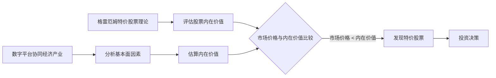

# 格雷厄姆特价股票理论在数字平台协同经济产业中的应用

> 关键词：格雷厄姆特价股票理论、数字平台、协同经济产业、股票估值、投资策略

> 摘要：本文深入探讨了格雷厄姆特价股票理论在数字平台协同经济产业中的应用。首先介绍了格雷厄姆特价股票理论的背景和核心概念，分析其与数字平台协同经济产业的联系。接着详细阐述该理论的算法原理、数学模型及公式，并结合实际案例进行说明。通过项目实战，展示如何在该产业中运用这一理论进行股票分析和投资决策。同时探讨了其实际应用场景，推荐了相关的学习资源、开发工具和论文著作。最后总结了该理论在数字平台协同经济产业中的未来发展趋势与挑战，并提供常见问题解答和参考资料，旨在为投资者和相关从业者提供全面的理论和实践指导。

## 1. 背景介绍 
### 1.1 目的和范围
本研究的主要目的是探索格雷厄姆特价股票理论在数字平台协同经济产业中的应用价值和可行性。通过对该理论的深入剖析和在特定产业环境中的实践验证，为投资者提供一种有效的投资分析方法，帮助他们在数字平台协同经济产业的股票投资中做出更明智的决策。

研究范围涵盖了格雷厄姆特价股票理论的基本原理、相关数学模型，以及该理论在数字平台协同经济产业不同领域的应用案例分析。同时，还将探讨该理论在该产业中面临的挑战和未来发展趋势。

### 1.2 预期读者
本文的预期读者包括对股票投资感兴趣的个人投资者、专业金融分析师、从事数字平台协同经济产业研究的学者和研究人员，以及相关企业的管理人员。对于希望了解如何运用经典投资理论在新兴产业中进行投资决策的人士具有一定的参考价值。

### 1.3 文档结构概述
本文将按照以下结构展开：首先介绍格雷厄姆特价股票理论的背景和相关概念，包括其核心思想和与数字平台协同经济产业的联系；然后详细阐述该理论的算法原理、数学模型及公式，并结合具体例子进行说明；接着通过项目实战展示该理论在实际中的应用，包括开发环境搭建、源代码实现和代码解读；再探讨其在数字平台协同经济产业中的实际应用场景；之后推荐相关的学习资源、开发工具和论文著作；最后总结该理论在该产业中的未来发展趋势与挑战，提供常见问题解答和参考资料。

### 1.4 术语表
#### 1.4.1 核心术语定义
- **格雷厄姆特价股票理论**：由本杰明·格雷厄姆（Benjamin Graham）提出的一种股票投资理论，强调通过对股票内在价值的评估，寻找价格被低估的股票进行投资。
- **数字平台**：基于互联网技术构建的，能够实现信息共享、资源整合和业务协同的虚拟平台，如电商平台、共享经济平台等。
- **协同经济产业**：通过数字平台实现资源共享、协同合作，以提高资源利用效率和创造新价值的经济模式和产业形态。
- **股票内在价值**：股票所代表的公司的真实价值，通常通过对公司的财务状况、盈利能力、资产质量等因素进行综合评估得出。

#### 1.4.2 相关概念解释
- **价值投资**：一种投资策略，基于对股票内在价值的分析，寻找被市场低估的股票进行长期投资，以获取股票价格回归内在价值时的收益。
- **安全边际**：格雷厄姆特价股票理论中的一个重要概念，指股票的市场价格低于其内在价值的幅度，用于降低投资风险。

#### 1.4.3 缩略词列表
目前本文中无相关缩略词。

## 2. 核心概念与联系 

### 2.1 格雷厄姆特价股票理论核心原理
格雷厄姆特价股票理论的核心思想是股票的市场价格和内在价值之间存在差异。投资者的目标是通过深入分析公司的基本面，找出那些市场价格低于其内在价值的股票，即所谓的“特价股票”。内在价值的评估主要基于公司的财务报表、盈利能力、资产质量等因素。

其基本假设是市场并非完全有效，股票价格可能会受到短期市场情绪、宏观经济环境等因素的影响而偏离其内在价值。当股票价格低于内在价值时，投资者可以以较低的价格买入股票，等待市场价格回归内在价值，从而获得投资收益。

### 2.2 数字平台协同经济产业特点
数字平台协同经济产业具有以下特点：
- **网络效应**：平台的价值随着用户数量的增加而呈指数级增长，用户越多，平台的吸引力和竞争力越强。
- **数据驱动**：大量的数据是该产业的核心资产，通过对数据的分析和挖掘，可以实现精准营销、个性化推荐等功能，提高用户体验和平台效率。
- **轻资产运营**：与传统产业相比，数字平台协同经济产业往往不需要大量的固定资产投入，主要依靠技术和人才优势开展业务。
- **快速迭代**：技术更新换代快，市场竞争激烈，企业需要不断创新和改进产品和服务，以适应市场变化。

### 2.3 两者联系
格雷厄姆特价股票理论在数字平台协同经济产业中的应用具有一定的可行性和价值。虽然该产业具有一些独特的特点，但公司的基本面分析仍然是评估股票价值的重要基础。例如，通过分析数字平台的用户规模、用户活跃度、收入增长趋势等指标，可以评估其盈利能力和发展潜力，进而估算其内在价值。

同时，由于数字平台协同经济产业的快速发展和不确定性，股票价格的波动可能较大，这为投资者寻找“特价股票”提供了更多机会。但也需要注意，该产业的估值方法可能与传统产业有所不同，需要结合其特点进行调整和创新。

### 2.4 文本示意图
格雷厄姆特价股票理论与数字平台协同经济产业的联系可以用以下文本示意图表示：

格雷厄姆特价股票理论核心是寻找市场价格低于内在价值的股票。在数字平台协同经济产业中，通过分析平台的用户数据、收入模式、技术创新能力等基本面因素来评估其内在价值。市场价格受到行业竞争、宏观经济环境、投资者情绪等因素影响。当市场价格低于基于基本面评估的内在价值时，就可能存在“特价股票”投资机会。

### 2.5 Mermaid 流程图


## 3. 核心算法原理 & 具体操作步骤 

### 3.1 格雷厄姆特价股票理论核心算法原理
格雷厄姆提出了多种估算股票内在价值的方法，其中一种经典的公式为：

$V = EPS \times (8.5 + 2g)$

其中，$V$ 表示股票的内在价值，$EPS$ 表示每股收益，$g$ 表示预期的未来收益增长率。

这个公式的基本思想是，股票的价值与公司的盈利能力（通过每股收益体现）和未来的增长潜力（通过预期收益增长率体现）相关。系数 8.5 是格雷厄姆根据历史数据和经验得出的一个基准值。

### 3.2 具体操作步骤

#### 3.2.1 数据收集
- **财务报表**：收集数字平台协同经济产业相关公司的年度财务报表，包括资产负债表、利润表和现金流量表，以获取每股收益等财务指标。
- **行业研究报告**：参考行业研究机构发布的报告，了解行业的发展趋势、市场规模、竞争格局等信息，以估算公司的预期收益增长率。

#### 3.2.2 计算每股收益（EPS）
每股收益可以通过以下公式计算：

$EPS = \frac{净利润}{总股本}$

其中，净利润可以从公司的利润表中获取，总股本可以从公司的公告或相关金融数据库中获取。

#### 3.2.3 估算预期收益增长率（g）
估算预期收益增长率是一个较为复杂的过程，需要综合考虑多个因素：
- **历史增长数据**：分析公司过去几年的收入和利润增长情况，了解其增长趋势。
- **行业增长趋势**：参考行业研究报告，了解整个数字平台协同经济产业的预期增长速度。
- **公司战略和竞争优势**：评估公司的发展战略、技术创新能力、市场份额等因素，判断其未来的增长潜力。

#### 3.2.4 计算股票内在价值（V）
将计算得到的每股收益（EPS）和估算的预期收益增长率（g）代入格雷厄姆的内在价值公式：

$V = EPS \times (8.5 + 2g)$

#### 3.2.5 比较市场价格与内在价值
获取股票的当前市场价格，与计算得到的内在价值进行比较。如果市场价格低于内在价值，且差距达到一定程度（即具有足够的安全边际），则可以认为该股票是“特价股票”，具有投资价值。

### 3.3 Python 源代码实现
```python
# 定义计算股票内在价值的函数
def calculate_intrinsic_value(eps, growth_rate):
    """
    计算股票的内在价值
    :param eps: 每股收益
    :param growth_rate: 预期收益增长率
    :return: 股票的内在价值
    """
    return eps * (8.5 + 2 * growth_rate)

# 示例数据
eps = 2.0  # 每股收益为 2 元
growth_rate = 0.1  # 预期收益增长率为 10%

# 计算内在价值
intrinsic_value = calculate_intrinsic_value(eps, growth_rate)
print(f"股票的内在价值为: {intrinsic_value} 元")

# 假设当前市场价格
market_price = 15.0

# 比较市场价格与内在价值
if market_price < intrinsic_value:
    print("该股票价格低于内在价值，可能是特价股票，具有投资价值。")
else:
    print("该股票价格不低于内在价值，可能不具有投资价值。")
```

## 4. 数学模型和公式 & 详细讲解 & 举例说明 

### 4.1 数学模型和公式
#### 4.1.1 格雷厄姆内在价值公式
$V = EPS \times (8.5 + 2g)$

其中：
- $V$：股票的内在价值
- $EPS$：每股收益，反映了公司的盈利能力，是公司净利润除以总股本得到的数值。
- $g$：预期的未来收益增长率，是对公司未来盈利增长的预期，通常以百分比表示。

#### 4.1.2 每股收益计算公式
$EPS = \frac{净利润}{总股本}$

### 4.2 详细讲解
#### 4.2.1 格雷厄姆内在价值公式
格雷厄姆内在价值公式的核心思想是将公司的盈利能力和未来增长潜力结合起来评估股票的价值。系数 8.5 是一个基准值，代表了一个相对稳定、增长缓慢的公司的价值倍数。而 2g 则是对公司未来增长潜力的额外估值，增长潜力越大，$g$ 值越大，股票的内在价值也就越高。

需要注意的是，这个公式是一个简化的估值模型，实际应用中需要根据具体情况进行调整。例如，对于不同行业的公司，可能需要使用不同的基准系数和增长倍数。

#### 4.2.2 每股收益计算公式
每股收益是衡量公司盈利能力的重要指标。通过将公司的净利润分配到每一股股票上，可以直观地了解每股股票所对应的盈利水平。总股本的变化会影响每股收益的计算结果，例如公司进行增发、回购等操作时，总股本会发生变化，需要相应地调整每股收益的计算。

### 4.3 举例说明
假设一家数字平台协同经济产业的公司，其年度净利润为 1000 万元，总股本为 500 万股。根据每股收益计算公式：

$EPS = \frac{1000}{500} = 2$（元/股）

通过对行业研究和公司自身发展战略的分析，预计该公司未来的预期收益增长率为 15%。将 $EPS = 2$ 和 $g = 0.15$ 代入格雷厄姆内在价值公式：

$V = 2 \times (8.5 + 2 \times 0.15)$
$= 2 \times (8.5 + 0.3)$
$= 2 \times 8.8$
$= 17.6$（元/股）

如果该股票的当前市场价格为 15 元/股，市场价格低于内在价值，根据格雷厄姆特价股票理论，该股票可能是“特价股票”，具有投资价值。

## 5. 项目实战：代码实际案例和详细解释说明 

### 5.1 开发环境搭建
#### 5.1.1 安装 Python
首先需要安装 Python 开发环境。可以从 Python 官方网站（https://www.python.org/downloads/） 下载适合自己操作系统的 Python 版本进行安装。安装完成后，确保 Python 已经正确配置到系统环境变量中，可以在命令行中输入 `python --version` 来验证。

#### 5.1.2 安装必要的库
在本项目中，需要使用一些 Python 库来进行数据处理和分析。可以使用以下命令安装：
```sh
pip install pandas requests
```
- **pandas**：用于数据处理和分析，方便读取和处理财务数据。
- **requests**：用于从网络获取数据，例如从金融数据接口获取股票价格和财务报表数据。

### 5.2 源代码详细实现和代码解读

```python
import requests
import pandas as pd

# 定义获取财务数据的函数
def get_financial_data(ticker):
    """
    从金融数据接口获取指定股票的财务数据
    :param ticker: 股票代码
    :return: 包含财务数据的 DataFrame
    """
    # 这里假设使用一个虚构的金融数据接口，实际使用时需要替换为真实的接口地址和 API 密钥
    api_url = f"https://example-api.com/financial-data?ticker={ticker}"
    response = requests.get(api_url)
    if response.status_code == 200:
        data = response.json()
        df = pd.DataFrame(data)
        return df
    else:
        print(f"获取财务数据失败，状态码: {response.status_code}")
        return None

# 定义计算每股收益的函数
def calculate_eps(net_income, total_shares):
    """
    计算每股收益
    :param net_income: 净利润
    :param total_shares: 总股本
    :return: 每股收益
    """
    return net_income / total_shares

# 定义计算股票内在价值的函数
def calculate_intrinsic_value(eps, growth_rate):
    """
    计算股票的内在价值
    :param eps: 每股收益
    :param growth_rate: 预期收益增长率
    :return: 股票的内在价值
    """
    return eps * (8.5 + 2 * growth_rate)

# 主函数
def main():
    # 输入股票代码
    ticker = input("请输入股票代码: ")

    # 获取财务数据
    financial_data = get_financial_data(ticker)
    if financial_data is not None:
        # 提取净利润和总股本数据
        net_income = financial_data.loc[financial_data['指标'] == '净利润', '数值'].values[0]
        total_shares = financial_data.loc[financial_data['指标'] == '总股本', '数值'].values[0]

        # 计算每股收益
        eps = calculate_eps(net_income, total_shares)

        # 假设预期收益增长率，实际应用中需要根据行业和公司情况进行估算
        growth_rate = 0.1

        # 计算股票内在价值
        intrinsic_value = calculate_intrinsic_value(eps, growth_rate)

        # 获取当前市场价格，这里假设使用另一个虚构的接口获取
        market_price_api_url = f"https://example-api.com/market-price?ticker={ticker}"
        market_price_response = requests.get(market_price_api_url)
        if market_price_response.status_code == 200:
            market_price = market_price_response.json()['价格']
            print(f"股票代码: {ticker}")
            print(f"每股收益: {eps} 元")
            print(f"预期收益增长率: {growth_rate * 100}%")
            print(f"股票内在价值: {intrinsic_value} 元")
            print(f"当前市场价格: {market_price} 元")

            # 比较市场价格与内在价值
            if market_price < intrinsic_value:
                print("该股票价格低于内在价值，可能是特价股票，具有投资价值。")
            else:
                print("该股票价格不低于内在价值，可能不具有投资价值。")
        else:
            print(f"获取市场价格失败，状态码: {market_price_response.status_code}")

if __name__ == "__main__":
    main()
```

### 5.3 代码解读与分析
#### 5.3.1 `get_financial_data` 函数
该函数用于从金融数据接口获取指定股票的财务数据。通过发送 HTTP 请求到指定的 API 地址，获取 JSON 格式的财务数据，并将其转换为 Pandas 的 DataFrame 格式，方便后续处理。

#### 5.3.2 `calculate_eps` 函数
该函数根据净利润和总股本计算每股收益，实现了前面介绍的每股收益计算公式。

#### 5.3.3 `calculate_intrinsic_value` 函数
该函数根据每股收益和预期收益增长率计算股票的内在价值，实现了格雷厄姆内在价值公式。

#### 5.3.4 `main` 函数
主函数负责整个程序的流程控制。首先获取用户输入的股票代码，然后调用 `get_financial_data` 函数获取财务数据。接着提取净利润和总股本数据，计算每股收益和股票内在价值。最后从另一个接口获取当前市场价格，并比较市场价格与内在价值，给出投资建议。

需要注意的是，代码中的金融数据接口和市场价格接口都是虚构的，实际应用中需要替换为真实可用的接口，并处理好接口的认证和错误处理等问题。同时，预期收益增长率的估算需要结合行业研究和公司基本面分析进行，这里只是简单假设一个固定值。

## 6. 实际应用场景 
### 6.1 个人投资者投资决策
对于个人投资者来说，格雷厄姆特价股票理论可以帮助他们在数字平台协同经济产业的股票投资中筛选出具有投资价值的股票。通过对公司基本面的分析和内在价值的估算，投资者可以避免盲目跟风投资，选择那些价格被低估的股票进行长期投资，从而提高投资收益。

例如，个人投资者可以使用前面介绍的方法，对不同数字平台公司的财务数据进行分析，计算其内在价值，并与市场价格进行比较。如果发现某家公司的股票价格明显低于其内在价值，且该公司具有良好的发展前景和竞争优势，那么就可以考虑买入该股票。

### 6.2 专业金融机构资产配置
专业金融机构，如基金公司、证券公司等，在进行资产配置时也可以运用格雷厄姆特价股票理论。在构建投资组合时，他们可以通过对数字平台协同经济产业相关股票的内在价值评估，选择那些具有较高性价比的股票纳入投资组合，以提高组合的整体收益和风险控制能力。

例如，基金经理可以根据格雷厄姆特价股票理论筛选出一批具有投资价值的数字平台股票，将其纳入基金的投资组合中。同时，结合其他投资策略和风险控制方法，对投资组合进行动态调整，以适应市场变化。

### 6.3 公司并购与重组决策
在数字平台协同经济产业的公司并购与重组过程中，格雷厄姆特价股票理论也可以发挥重要作用。收购方可以通过对目标公司的内在价值评估，判断其是否被低估，从而确定合理的收购价格。

例如，当一家数字平台公司计划收购另一家同行业公司时，可以运用该理论对目标公司的财务状况、盈利能力、发展潜力等进行全面分析，估算其内在价值。如果目标公司的市场价格低于其内在价值，那么收购方可以在谈判中争取更有利的收购条件，降低收购成本。

### 6.4 行业研究与分析
研究机构和学者在对数字平台协同经济产业进行研究和分析时，也可以借鉴格雷厄姆特价股票理论。通过对行业内公司的内在价值评估和比较，可以了解行业的整体发展状况和竞争格局，发现行业中的潜在价值企业和发展趋势。

例如，研究机构可以对数字平台协同经济产业的主要公司进行内在价值评估，绘制行业的价值图谱，分析不同公司的价值差异和竞争优势。这有助于投资者和企业管理者更好地了解行业动态，制定合理的投资和发展战略。

## 7. 工具和资源推荐
### 7.1 学习资源推荐
#### 7.1.1 书籍推荐
- **《聪明的投资者》（The Intelligent Investor）**：本杰明·格雷厄姆的经典著作，系统阐述了价值投资的理念和方法，是学习格雷厄姆特价股票理论的必读之书。
- **《证券分析》（Security Analysis）**：同样是格雷厄姆的著作，对证券的分析和估值方法进行了深入探讨，为投资者提供了全面的理论和实践指导。
- **《数字平台经济学》**：介绍了数字平台经济的基本原理、商业模式和发展趋势，有助于读者了解数字平台协同经济产业的特点和规律。

#### 7.1.2 在线课程
- **Coursera 平台上的“投资学原理”课程**：由知名大学的教授授课，系统讲解投资学的基本理论和方法，包括股票估值、投资组合管理等内容。
- **网易云课堂上的“数字经济与平台战略”课程**：深入探讨数字经济时代的平台战略和商业模式，帮助学员了解数字平台协同经济产业的发展趋势和竞争策略。

#### 7.1.3 技术博客和网站
- **雪球网**：国内知名的财经社区，提供股票行情、公司公告、研报等丰富的财经信息，同时还有大量投资者分享的投资经验和分析文章。
- **Seeking Alpha**：国外知名的财经网站，提供全球范围内的股票分析和投资建议，有很多专业分析师和投资者的观点和研究报告。

### 7.2 开发工具框架推荐
#### 7.2.1 IDE和编辑器
- **PyCharm**：一款专业的 Python 集成开发环境，具有代码编辑、调试、自动补全、版本控制等强大功能，适合 Python 开发和数据分析。
- **Jupyter Notebook**：一种交互式的开发环境，支持多种编程语言，尤其适合数据探索、分析和可视化，方便用户进行代码演示和文档编写。

#### 7.2.2 调试和性能分析工具
- **pdb**：Python 内置的调试器，可以帮助开发者在代码执行过程中进行单步调试、查看变量值等操作，定位和解决代码中的问题。
- **cProfile**：Python 标准库中的性能分析工具，可以统计代码的执行时间和函数调用次数，帮助开发者找出代码中的性能瓶颈。

#### 7.2.3 相关框架和库
- **pandas**：用于数据处理和分析的 Python 库，提供了丰富的数据结构和数据操作方法，方便读取、处理和分析财务数据。
- **numpy**：Python 的数值计算库，提供了高效的数组操作和数学函数，在数据分析和科学计算中广泛应用。
- **matplotlib**：用于数据可视化的 Python 库，可以绘制各种类型的图表，如折线图、柱状图、散点图等，帮助用户直观地展示数据。

### 7.3 相关论文著作推荐
#### 7.3.1 经典论文
- **“The Theory of Investment Value” by John Burr Williams**：该论文提出了现金流折现模型，为股票估值提供了重要的理论基础，对格雷厄姆特价股票理论的发展产生了深远影响。
- **“The Efficient Market Hypothesis and Its Critics” by Burton G. Malkiel**：探讨了有效市场假说及其局限性，为价值投资理论提供了理论支持，有助于理解格雷厄姆特价股票理论的市场基础。

#### 7.3.2 最新研究成果
- **关注顶级金融学术期刊，如《Journal of Finance》《Review of Financial Studies》等**：这些期刊发表了大量关于金融市场、投资理论和实证研究的最新成果，可以及时了解格雷厄姆特价股票理论在数字平台协同经济产业等新兴领域的研究进展。

#### 7.3.3 应用案例分析
- **收集和研究国内外数字平台协同经济产业的投资案例**：通过分析这些案例中如何运用格雷厄姆特价股票理论进行投资决策、估值分析和风险控制，可以更好地理解该理论在实际应用中的方法和技巧。

## 8. 总结：未来发展趋势与挑战
### 8.1 未来发展趋势
#### 8.1.1 与新兴技术融合
随着人工智能、大数据、区块链等新兴技术的不断发展，格雷厄姆特价股票理论在数字平台协同经济产业中的应用将与这些技术深度融合。例如，利用人工智能算法可以更高效地分析大量的财务数据和市场信息，提高股票内在价值评估的准确性和效率；大数据技术可以提供更全面、及时的数据支持，帮助投资者更好地了解公司的基本面和市场动态；区块链技术可以保证数据的真实性和安全性，为投资决策提供更可靠的依据。

#### 8.1.2 适应产业创新发展
数字平台协同经济产业不断创新和发展，新的商业模式和业务形态不断涌现。格雷厄姆特价股票理论需要不断适应这些变化，调整和完善估值方法和模型。例如，对于一些基于共享经济、零工经济等新兴模式的数字平台公司，传统的财务指标可能无法完全反映其价值，需要引入新的指标和分析方法来评估其内在价值。

#### 8.1.3 国际化应用拓展
随着全球经济一体化的发展，数字平台协同经济产业呈现出国际化的发展趋势。格雷厄姆特价股票理论将在全球范围内得到更广泛的应用，投资者可以利用该理论在不同国家和地区的数字平台股票市场中寻找投资机会。同时，不同国家和地区的市场环境、法律法规和文化差异也将对该理论的应用提出新的挑战和要求，需要进行相应的调整和优化。

### 8.2 挑战
#### 8.2.1 数据质量和可靠性
在数字平台协同经济产业中，数据的质量和可靠性是运用格雷厄姆特价股票理论进行投资分析的关键。由于该产业的数据来源广泛、数据量庞大，且部分数据可能存在不准确、不完整或被操纵的情况，这给数据的收集、清洗和分析带来了很大的困难。如果使用了质量不高的数据进行估值分析，可能会导致错误的投资决策。

#### 8.2.2 产业不确定性
数字平台协同经济产业具有较高的不确定性，技术创新、市场竞争、政策法规等因素都可能对公司的发展和股票价格产生重大影响。例如，新的技术突破可能使现有数字平台公司的业务模式过时，市场竞争的加剧可能导致公司的市场份额下降，政策法规的变化可能对公司的运营和盈利产生限制。这些不确定性增加了对公司未来收益增长率估算的难度，从而影响股票内在价值评估的准确性。

#### 8.2.3 估值方法局限性
格雷厄姆特价股票理论的估值方法主要基于公司的财务报表和历史数据，对于数字平台协同经济产业中一些具有高成长性和创新性的公司，可能存在一定的局限性。这些公司的价值往往更多地体现在其技术创新能力、用户资源、品牌影响力等非财务因素上，而传统的估值方法可能无法充分反映这些因素的价值。因此，需要探索和开发更适合该产业特点的估值方法和模型。

## 9. 附录：常见问题与解答
### 9.1 格雷厄姆特价股票理论适用于所有数字平台协同经济产业的股票吗？
不是的。虽然该理论可以为投资分析提供一种有效的方法，但数字平台协同经济产业中的公司具有多样性，不同公司的业务模式、发展阶段和竞争环境存在差异。对于一些处于初创期、尚未实现盈利或具有高度创新性的公司，传统的格雷厄姆估值方法可能无法准确反映其价值，需要结合其他方法进行综合评估。

### 9.2 如何准确估算数字平台协同经济产业公司的预期收益增长率？
估算预期收益增长率需要综合考虑多个因素。可以参考公司过去的历史增长数据，了解其增长趋势；分析行业研究报告，掌握整个行业的发展前景和增长速度；评估公司的战略规划、技术创新能力、市场份额等竞争优势，判断其未来的增长潜力。同时，还可以参考同行业其他公司的增长情况，进行比较和分析。但需要注意的是，预期收益增长率的估算具有一定的主观性和不确定性，需要结合多方面的信息进行综合判断。

### 9.3 当市场价格与内在价值差距较小时，是否应该投资？
这需要综合考虑多个因素。虽然格雷厄姆特价股票理论强调寻找价格低于内在价值的股票，但市场价格与内在价值的差距并不是唯一的投资决策依据。还需要考虑公司的基本面、行业发展趋势、宏观经济环境等因素。如果差距较小，但公司具有良好的发展前景和竞争优势，且市场环境稳定，那么也可以考虑投资；但如果公司存在一些潜在的风险因素，或者市场环境不稳定，那么即使差距较小，也需要谨慎投资。

### 9.4 如何处理数字平台协同经济产业中公司财务数据的不透明性？
数字平台协同经济产业中部分公司可能存在财务数据不透明的问题。在这种情况下，可以采取以下措施：一是多渠道获取数据，除了公司公布的财务报表外，还可以参考行业研究报告、第三方数据机构提供的数据等；二是进行数据验证和分析，通过对不同来源的数据进行比较和验证，判断数据的可靠性；三是关注公司的非财务信息，如用户数量、用户活跃度、业务创新等，这些信息可以在一定程度上反映公司的经营状况和发展潜力。

## 10. 扩展阅读 & 参考资料
### 10.1 扩展阅读
- **《创新者的窘境》（The Innovator's Dilemma）**：探讨了创新对企业发展的影响，有助于理解数字平台协同经济产业中企业的创新战略和竞争格局。
- **《平台革命》（Platform Revolution）**：深入分析了数字平台的商业模式和发展规律，为研究数字平台协同经济产业提供了理论支持。

### 10.2 参考资料
- 本杰明·格雷厄姆的著作《聪明的投资者》《证券分析》相关版本。
- 相关金融数据提供商的网站和数据报告，如 Wind 资讯、东方财富网等。
- 国内外金融学术期刊发表的关于股票估值、数字经济等领域的研究论文。

作者：AI天才研究院/AI Genius Institute & 禅与计算机程序设计艺术 /Zen And The Art of Computer Programming