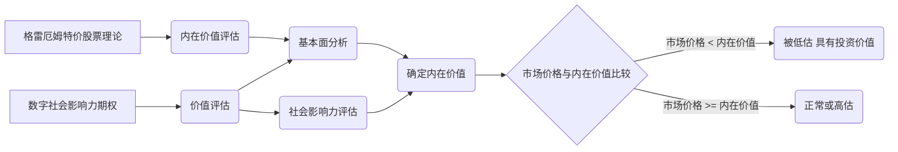

# 格雷厄姆特价股票理论在数字社会影响力期权中的新应用

> 关键词：格雷厄姆特价股票理论、数字社会影响力期权、价值评估、投资策略、新应用

> 摘要：本文深入探讨了格雷厄姆特价股票理论在数字社会影响力期权这一新兴领域的新应用。首先介绍了相关背景，包括目的范围、预期读者等内容。接着阐述了格雷厄姆特价股票理论与数字社会影响力期权的核心概念及联系，详细讲解了核心算法原理与具体操作步骤，通过数学模型和公式进行理论支撑并举例说明。然后通过项目实战，展示了代码实际案例并进行详细解释。分析了该理论在实际中的应用场景，推荐了相关的工具和资源。最后总结了未来发展趋势与挑战，解答常见问题并给出扩展阅读与参考资料，旨在为投资者和研究者提供全面且深入的参考，推动这一领域的发展。

## 1. 背景介绍 
### 1.1 目的和范围
在当今数字化快速发展的时代，金融市场不断涌现新的产品和概念。数字社会影响力期权作为一种新兴的金融工具，融合了数字技术和社会影响力因素，为投资者提供了新的投资渠道。格雷厄姆特价股票理论作为经典的价值投资理论，其核心思想是寻找被市场低估的股票以获取长期投资收益。本研究的目的在于探索将格雷厄姆特价股票理论应用于数字社会影响力期权的可行性和有效性，为投资者提供新的投资策略和决策依据。

本研究的范围涵盖了格雷厄姆特价股票理论的基本原理、数字社会影响力期权的定义和特点，以及两者结合的具体应用方法。通过理论分析、算法推导、实际案例验证等多方面的研究，全面探讨该理论在数字社会影响力期权中的应用。

### 1.2 预期读者
本文预期读者包括金融投资者、金融分析师、金融科技研究者、相关领域的学者以及对金融创新和价值投资感兴趣的人士。对于投资者而言，希望通过本文了解新的投资策略和方法，以提高投资收益；对于金融分析师和研究者，本文提供了一个新的研究视角和思路，有助于推动相关领域的学术研究和实践发展；对于学者来说，可作为进一步深入研究的参考资料。

### 1.3 文档结构概述
本文将按照以下结构展开：首先介绍相关背景知识，包括目的、预期读者和文档结构概述等内容；接着阐述格雷厄姆特价股票理论与数字社会影响力期权的核心概念及它们之间的联系，通过文本示意图和 Mermaid 流程图进行直观展示；然后详细讲解核心算法原理和具体操作步骤，并使用 Python 源代码进行阐述；再通过数学模型和公式对理论进行支撑，并举例说明；之后进行项目实战，展示代码实际案例并详细解释；分析该理论在实际中的应用场景；推荐相关的工具和资源，包括学习资源、开发工具框架和相关论文著作；最后总结未来发展趋势与挑战，解答常见问题并给出扩展阅读与参考资料。

### 1.4 术语表
#### 1.4.1 核心术语定义
- **格雷厄姆特价股票理论**：由本杰明·格雷厄姆提出的价值投资理论，该理论认为股票存在内在价值，当股票市场价格低于其内在价值时，股票被低估，具有投资价值。
- **数字社会影响力期权**：一种新兴的金融衍生品，其价值不仅取决于数字资产的价格波动，还与数字产品或服务所产生的社会影响力相关。
- **内在价值**：资产本身所具有的价值，是基于资产的基本面、未来现金流等因素进行评估的价值。
- **社会影响力**：数字产品或服务对社会、环境、文化等方面产生的积极或消极影响。

#### 1.4.2 相关概念解释
- **价值投资**：一种投资策略，通过分析资产的内在价值，寻找被市场低估的资产进行投资，以获取长期的投资回报。
- **金融衍生品**：一种基于基础资产（如股票、债券、商品等）的金融合约，其价值取决于基础资产的价格变动。
- **数字资产**：以数字形式存在的资产，如数字货币、数字版权、数字艺术品等。

#### 1.4.3 缩略词列表
- **DCF**：Discounted Cash Flow，现金流折现法，一种用于评估资产内在价值的方法。
- **NPV**：Net Present Value，净现值，投资项目未来现金流入的现值与未来现金流出的现值之间的差额。

## 2. 核心概念与联系 
### 2.1 格雷厄姆特价股票理论核心原理
格雷厄姆特价股票理论的核心在于寻找被市场低估的股票。其认为股票的内在价值是由公司的基本面因素决定的，如公司的资产、盈利能力、股息政策等。当股票的市场价格低于其内在价值时，股票被低估，投资者可以买入该股票，等待市场价格回归内在价值，从而获取投资收益。

评估股票内在价值的方法有多种，常见的包括资产净值法、盈利倍数法等。资产净值法是通过计算公司的净资产来评估股票的内在价值，盈利倍数法是根据公司的盈利水平和市场平均市盈率来估算股票的价值。

### 2.2 数字社会影响力期权核心原理
数字社会影响力期权是一种新兴的金融衍生品，其价值不仅取决于数字资产的价格波动，还与数字产品或服务所产生的社会影响力相关。数字社会影响力期权的设计旨在鼓励投资者关注数字资产的社会价值，推动数字经济的可持续发展。

数字社会影响力期权的价值可以通过以下几个因素来评估：数字资产的市场价格、数字产品或服务的社会影响力指标（如用户满意度、社会福利提升程度等）、期权的到期时间、无风险利率等。

### 2.3 两者联系的文本示意图
格雷厄姆特价股票理论与数字社会影响力期权的联系在于，都关注资产的价值评估。格雷厄姆特价股票理论强调股票的内在价值，而数字社会影响力期权在评估价值时不仅考虑数字资产的市场价格，还加入了社会影响力因素。可以将两者的联系表示为：

格雷厄姆特价股票理论的内在价值评估方法可以为数字社会影响力期权的价值评估提供参考。通过对数字资产的基本面分析和社会影响力评估，可以更准确地确定数字社会影响力期权的内在价值。当数字社会影响力期权的市场价格低于其内在价值时，就可以认为该期权被低估，具有投资价值。

### 2.4 两者联系的 Mermaid 流程图


## 3. 核心算法原理 & 具体操作步骤 
### 3.1 核心算法原理
在将格雷厄姆特价股票理论应用于数字社会影响力期权时，核心算法的目标是评估数字社会影响力期权的内在价值，并与市场价格进行比较，以确定其是否被低估。

#### 3.1.1 数字资产基本面分析
首先，对数字资产的基本面进行分析，包括数字资产的市场需求、竞争状况、技术创新性等。可以通过收集相关数据，如用户数量、交易量、市场份额等，来评估数字资产的盈利能力和发展潜力。

#### 3.1.2 社会影响力评估
采用定量和定性相结合的方法对数字产品或服务的社会影响力进行评估。定量指标可以包括用户满意度调查得分、社会福利提升的量化数据等；定性指标可以包括社会舆论评价、政策支持程度等。

#### 3.1.3 内在价值计算
综合考虑数字资产的基本面和社会影响力因素，采用合适的方法计算数字社会影响力期权的内在价值。例如，可以使用现金流折现法（DCF），将数字资产未来的现金流按照一定的折现率折现到当前，同时考虑社会影响力因素对现金流的调整。

### 3.2 具体操作步骤
#### 3.2.1 数据收集
收集数字资产的相关数据，包括市场价格、交易量、用户数量、财务报表等；收集数字产品或服务的社会影响力数据，如用户满意度调查结果、社会福利提升报告等。

#### 3.2.2 基本面分析
根据收集到的数据，对数字资产的基本面进行分析。计算数字资产的盈利能力指标，如毛利率、净利率等；分析数字资产的市场竞争地位，如市场份额、竞争优势等。

#### 3.2.3 社会影响力评估
对收集到的社会影响力数据进行整理和分析。对于定量指标，进行统计分析和比较；对于定性指标，进行专家评估和综合判断。

#### 3.2.4 内在价值计算
根据基本面分析和社会影响力评估的结果，使用现金流折现法或其他合适的方法计算数字社会影响力期权的内在价值。

#### 3.2.5 比较判断
将计算得到的内在价值与数字社会影响力期权的市场价格进行比较。如果市场价格低于内在价值，则认为该期权被低估，具有投资价值；反之，则认为该期权正常或高估。

### 3.3 Python 源代码实现
```python
import numpy as np

# 定义数字资产基本面分析函数
def fundamental_analysis(revenue, costs, market_share):
    """
    计算数字资产的盈利能力和市场竞争地位
    :param revenue: 数字资产的收入
    :param costs: 数字资产的成本
    :param market_share: 数字资产的市场份额
    :return: 毛利率、净利率和市场竞争力得分
    """
    gross_profit_margin = (revenue - costs) / revenue
    net_profit_margin = (revenue - costs) / revenue  # 简化计算，实际中需考虑更多因素
    market_competitiveness = market_share * 100  # 简单量化市场竞争力
    return gross_profit_margin, net_profit_margin, market_competitiveness

# 定义社会影响力评估函数
def social_impact_evaluation(user_satisfaction, social_welfare_improvement):
    """
    评估数字产品或服务的社会影响力
    :param user_satisfaction: 用户满意度得分（0-100）
    :param social_welfare_improvement: 社会福利提升量化指标
    :return: 社会影响力得分
    """
    social_impact_score = 0.6 * user_satisfaction + 0.4 * social_welfare_improvement
    return social_impact_score

# 定义内在价值计算函数
def intrinsic_value_calculation(revenue_growth_rate, cost_growth_rate, market_share_growth_rate,
                                user_satisfaction, social_welfare_improvement, discount_rate, years=5):
    """
    使用现金流折现法计算数字社会影响力期权的内在价值
    :param revenue_growth_rate: 收入增长率
    :param cost_growth_rate: 成本增长率
    :param market_share_growth_rate: 市场份额增长率
    :param user_satisfaction: 用户满意度得分（0-100）
    :param social_welfare_improvement: 社会福利提升量化指标
    :param discount_rate: 折现率
    :param years: 预测年限
    :return: 内在价值
    """
    # 初始数据
    initial_revenue = 1000  # 初始收入
    initial_costs = 600  # 初始成本
    initial_market_share = 0.2  # 初始市场份额

    cash_flows = []
    for year in range(1, years + 1):
        revenue = initial_revenue * (1 + revenue_growth_rate) ** year
        costs = initial_costs * (1 + cost_growth_rate) ** year
        market_share = initial_market_share * (1 + market_share_growth_rate) ** year

        # 考虑社会影响力对现金流的调整
        social_impact_score = social_impact_evaluation(user_satisfaction, social_welfare_improvement)
        adjusted_cash_flow = (revenue - costs) * (1 + social_impact_score / 100)
        cash_flows.append(adjusted_cash_flow)

    # 计算现金流现值
    present_values = []
    for i, cash_flow in enumerate(cash_flows):
        present_value = cash_flow / (1 + discount_rate) ** (i + 1)
        present_values.append(present_value)

    intrinsic_value = sum(present_values)
    return intrinsic_value

# 示例数据
revenue_growth_rate = 0.1
cost_growth_rate = 0.05
market_share_growth_rate = 0.08
user_satisfaction = 80
social_welfare_improvement = 20
discount_rate = 0.1

# 计算内在价值
intrinsic_value = intrinsic_value_calculation(revenue_growth_rate, cost_growth_rate, market_share_growth_rate,
                                              user_satisfaction, social_welfare_improvement, discount_rate)
print(f"数字社会影响力期权的内在价值为: {intrinsic_value}")
```

## 4. 数学模型和公式 & 详细讲解 & 举例说明 
### 4.1 现金流折现法（DCF）数学模型
现金流折现法是一种常用的评估资产内在价值的方法，其基本思想是将资产未来的现金流按照一定的折现率折现到当前，得到资产的内在价值。

#### 4.1.1 基本公式
$$
V = \sum_{t=1}^{n} \frac{CF_t}{(1 + r)^t}
$$

其中：
- $V$ 表示资产的内在价值
- $CF_t$ 表示第 $t$ 期的现金流
- $r$ 表示折现率
- $n$ 表示预测期数

#### 4.1.2 详细讲解
在使用现金流折现法评估数字社会影响力期权的内在价值时，需要对现金流进行调整，以考虑社会影响力因素。假设社会影响力因素对现金流的调整系数为 $\alpha$，则调整后的现金流为 $CF_t' = CF_t \times (1 + \alpha)$。

调整后的内在价值公式为：
$$
V' = \sum_{t=1}^{n} \frac{CF_t'}{(1 + r)^t} = \sum_{t=1}^{n} \frac{CF_t \times (1 + \alpha)}{(1 + r)^t}
$$

### 4.2 社会影响力调整系数的确定
社会影响力调整系数 $\alpha$ 可以通过社会影响力评估得分来确定。假设社会影响力评估得分范围为 $[0, 100]$，则 $\alpha$ 可以表示为：
$$
\alpha = \frac{S}{100}
$$

其中 $S$ 表示社会影响力评估得分。

### 4.3 举例说明
假设某数字社会影响力期权的预测现金流如下：

| 年份 | 现金流（万元） |
|------|----------------|
| 1    | 100            |
| 2    | 120            |
| 3    | 150            |
| 4    | 180            |
| 5    | 200            |

折现率 $r = 0.1$，社会影响力评估得分 $S = 80$。

首先，计算社会影响力调整系数 $\alpha$：
$$
\alpha = \frac{80}{100} = 0.8
$$

然后，计算调整后的现金流：

| 年份 | 现金流（万元） | 调整后现金流（万元） |
|------|----------------|----------------------|
| 1    | 100            | $100 \times (1 + 0.8) = 180$ |
| 2    | 120            | $120 \times (1 + 0.8) = 216$ |
| 3    | 150            | $150 \times (1 + 0.8) = 270$ |
| 4    | 180            | $180 \times (1 + 0.8) = 324$ |
| 5    | 200            | $200 \times (1 + 0.8) = 360$ |

最后，计算内在价值 $V'$：
$$
\begin{align*}
V' &= \frac{180}{(1 + 0.1)^1} + \frac{216}{(1 + 0.1)^2} + \frac{270}{(1 + 0.1)^3} + \frac{324}{(1 + 0.1)^4} + \frac{360}{(1 + 0.1)^5} \\
&= \frac{180}{1.1} + \frac{216}{1.21} + \frac{270}{1.331} + \frac{324}{1.4641} + \frac{360}{1.61051} \\
&\approx 163.64 + 178.51 + 202.86 + 221.29 + 223.54 \\
&\approx 989.84
\end{align*}
$$

因此，该数字社会影响力期权的内在价值约为 989.84 万元。

## 5. 项目实战：代码实际案例和详细解释说明 
### 5.1  开发环境搭建
#### 5.1.1 操作系统
可以选择 Windows、Linux 或 macOS 等主流操作系统。本示例以 Windows 10 为例。

#### 5.1.2 Python 环境安装
从 Python 官方网站（https://