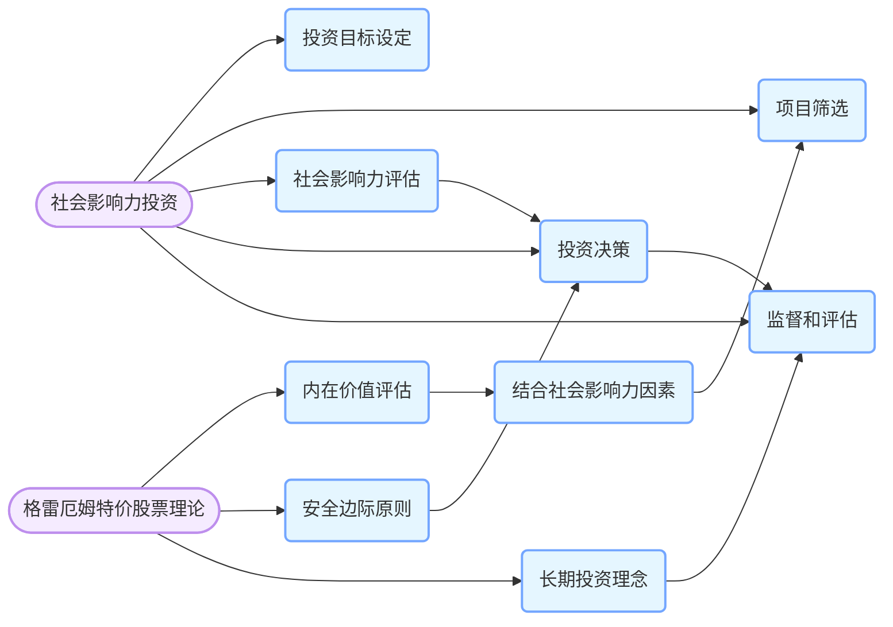

# 格雷厄姆特价股票理论在社会影响力投资中的新应用

> 关键词：格雷厄姆特价股票理论、社会影响力投资、价值评估、投资策略、可持续发展

> 摘要：本文聚焦于格雷厄姆特价股票理论在社会影响力投资领域的新应用。首先介绍了格雷厄姆特价股票理论的背景和社会影响力投资的概念，阐述了二者结合的目的和意义。接着深入分析核心概念，包括格雷厄姆理论的原理和社会影响力投资的架构，并通过流程图展示其联系。详细讲解了相关核心算法原理，以 Python 代码示例呈现具体操作步骤。同时给出数学模型和公式，辅以实际案例说明。在项目实战部分，搭建开发环境，给出源代码实现及解读。探讨了该理论在社会影响力投资中的实际应用场景，推荐了学习资源、开发工具框架和相关论文著作。最后总结未来发展趋势与挑战，解答常见问题，并提供扩展阅读和参考资料。

## 1. 背景介绍 
### 1.1 目的和范围
格雷厄姆特价股票理论是由投资大师本杰明·格雷厄姆（Benjamin Graham）提出的经典价值投资理论，其核心思想是寻找价格低于内在价值的股票进行投资。而社会影响力投资则强调在追求财务回报的同时，也要产生积极的社会和环境影响。本研究的目的在于探索如何将格雷厄姆特价股票理论应用于社会影响力投资中，为投资者提供一种兼顾财务收益和社会价值的投资策略。

研究范围涵盖了格雷厄姆特价股票理论的基本原理、社会影响力投资的概念和评估方法，以及二者结合的具体应用场景和实践案例。通过对相关理论和实践的分析，旨在为投资者和相关从业者提供有益的参考和指导。

### 1.2 预期读者
本文的预期读者包括投资者、金融从业者、社会影响力投资领域的研究人员和爱好者，以及对可持续发展和社会责任投资感兴趣的人士。无论是专业的投资人士还是普通的投资者，都可以从本文中获取关于格雷厄姆特价股票理论在社会影响力投资中应用的相关知识和见解。

### 1.3 文档结构概述
本文将按照以下结构进行组织：
- 核心概念与联系：介绍格雷厄姆特价股票理论和社会影响力投资的核心概念，并分析二者之间的联系。
- 核心算法原理 & 具体操作步骤：阐述将格雷厄姆理论应用于社会影响力投资的核心算法原理，并给出具体的操作步骤，同时用 Python 代码进行详细说明。
- 数学模型和公式 & 详细讲解 & 举例说明：建立相关的数学模型和公式，对其进行详细讲解，并通过实际案例进行说明。
- 项目实战：代码实际案例和详细解释说明：搭建开发环境，给出源代码实现及解读，展示如何在实际项目中应用该理论。
- 实际应用场景：探讨格雷厄姆特价股票理论在社会影响力投资中的实际应用场景。
- 工具和资源推荐：推荐学习资源、开发工具框架和相关论文著作。
- 总结：未来发展趋势与挑战：总结该理论在社会影响力投资中的应用前景和面临的挑战。
- 附录：常见问题与解答：解答读者可能关心的常见问题。
- 扩展阅读 & 参考资料：提供扩展阅读的建议和相关参考资料。

### 1.4 术语表
#### 1.4.1 核心术语定义
- **格雷厄姆特价股票理论**：一种价值投资理论，认为股票价格低于其内在价值时具有投资价值，投资者应寻找这类被低估的股票进行投资。
- **社会影响力投资**：一种投资方式，旨在产生积极的社会和环境影响的同时获得财务回报。投资者通过投资那些致力于解决社会和环境问题的企业或项目，实现社会价值和经济价值的双重目标。
- **内在价值**：股票的真实价值，通常基于公司的基本面因素，如盈利能力、资产状况、现金流等进行评估。
- **社会影响力评估**：对投资项目或企业所产生的社会和环境影响进行量化和定性评估的过程。

#### 1.4.2 相关概念解释
- **价值投资**：一种投资策略，强调通过分析公司的基本面，寻找被低估的股票进行投资，以获取长期的投资回报。
- **可持续发展**：指既满足当代人的需求，又不损害后代人满足其需求的能力的发展模式。在投资领域，可持续发展投资关注企业在环境、社会和治理（ESG）方面的表现。
- **ESG 投资**：一种考虑企业环境（Environmental）、社会（Social）和治理（Governance）因素的投资策略，旨在评估企业的可持续性和长期发展潜力。

#### 1.4.3 缩略词列表
- **ESG**：Environmental, Social and Governance（环境、社会和治理）
- **NPV**：Net Present Value（净现值）
- **DCF**：Discounted Cash Flow（现金流折现法）

## 2. 核心概念与联系 

### 格雷厄姆特价股票理论原理
格雷厄姆特价股票理论的核心是寻找被市场低估的股票。其基本原理基于以下几点：
1. **内在价值的评估**：通过对公司的财务报表、盈利能力、资产状况等基本面因素进行分析，估算股票的内在价值。
2. **安全边际**：投资者应该在股票价格低于内在价值一定程度时进行投资，以提供安全边际，降低投资风险。
3. **长期投资**：格雷厄姆认为，市场短期可能会出现波动，但从长期来看，股票价格会回归其内在价值。因此，投资者应该进行长期投资，耐心等待价值的回归。

### 社会影响力投资架构
社会影响力投资的架构主要包括以下几个方面：
1. **投资目标设定**：明确投资的社会和环境目标，如减少碳排放、改善教育机会、促进就业等。
2. **项目筛选**：根据投资目标，筛选符合条件的投资项目或企业。筛选过程通常会考虑项目的社会影响力、财务可行性、管理团队等因素。
3. **社会影响力评估**：对投资项目或企业所产生的社会和环境影响进行评估。评估方法可以包括定性分析和定量分析，如使用社会影响力指标体系、成本 - 效益分析等。
4. **投资决策**：综合考虑项目的社会影响力和财务回报，做出投资决策。投资者可以根据自己的风险偏好和投资目标，选择不同的投资方式和项目。
5. **监督和评估**：在投资过程中，对项目的社会影响力和财务表现进行监督和评估，及时调整投资策略。

### 二者联系的文本示意图
```plaintext
格雷厄姆特价股票理论
|
|-- 内在价值评估
|   |-- 财务报表分析
|   |-- 盈利能力评估
|   |-- 资产状况评估
|
|-- 安全边际原则
|
|-- 长期投资理念

社会影响力投资
|
|-- 投资目标设定
|   |-- 社会和环境目标确定
|
|-- 项目筛选
|   |-- 社会影响力考量
|   |-- 财务可行性评估
|   |-- 管理团队评估
|
|-- 社会影响力评估
|   |-- 定性分析
|   |-- 定量分析
|
|-- 投资决策
|   |-- 综合考虑社会和财务因素
|
|-- 监督和评估
|   |-- 社会影响力跟踪
|   |-- 财务表现评估

联系：
格雷厄姆理论的内在价值评估可结合社会影响力因素，为社会影响力投资提供更全面的价值评估；安全边际原则可应用于社会影响力投资，降低投资风险；长期投资理念与社会影响力投资追求可持续发展的目标相契合。
```

### Mermaid 流程图


## 3. 核心算法原理 & 具体操作步骤 

### 核心算法原理
将格雷厄姆特价股票理论应用于社会影响力投资的核心算法原理可以概括为以下几个步骤：
1. **内在价值评估**：在传统的财务分析基础上，加入社会影响力因素，综合评估股票的内在价值。可以使用现金流折现法（DCF）等方法进行评估，同时考虑社会影响力对公司未来现金流的影响。
2. **社会影响力评估**：采用适当的方法对投资项目或企业的社会影响力进行量化和定性评估。可以使用社会影响力指标体系、成本 - 效益分析等方法。
3. **安全边际计算**：根据内在价值和市场价格，计算安全边际。安全边际可以表示为内在价值与市场价格的差值，或者是内在价值与市场价格的比率。
4. **投资决策**：综合考虑内在价值、社会影响力和安全边际等因素，做出投资决策。投资者可以根据自己的风险偏好和投资目标，设定一定的阈值，只有当股票满足这些条件时才进行投资。

### 具体操作步骤
#### 步骤 1：数据收集
收集公司的财务数据，如资产负债表、利润表、现金流量表等，以及相关的社会影响力数据，如环境指标、社会公益活动数据等。

#### 步骤 2：内在价值评估
使用现金流折现法（DCF）评估股票的内在价值。具体步骤如下：
1. 预测公司未来的自由现金流。可以根据公司的历史财务数据和行业发展趋势进行预测。
2. 确定折现率。折现率反映了投资的风险和机会成本，可以根据市场情况和公司的风险特征进行确定。
3. 将未来的自由现金流折现到当前时刻，计算净现值（NPV）。净现值即为股票的内在价值。

#### 步骤 3：社会影响力评估
采用社会影响力指标体系对公司的社会影响力进行评估。可以从环境、社会和治理（ESG）三个方面进行评估，每个方面可以设置多个指标。例如，环境方面可以包括碳排放、能源消耗等指标；社会方面可以包括员工福利、社区贡献等指标；治理方面可以包括公司治理结构、信息披露等指标。

#### 步骤 4：安全边际计算
计算安全边际，公式如下：
$$安全边际 = \frac{内在价值 - 市场价格}{内在价值}$$

#### 步骤 5：投资决策
根据内在价值、社会影响力和安全边际等因素，做出投资决策。例如，设定内在价值大于市场价格一定比例，且社会影响力评估得分达到一定阈值的股票才进行投资。

### Python 源代码实现
```python
import pandas as pd
import numpy as np

# 步骤 1：数据收集（假设已经收集好并存储在 CSV 文件中）
financial_data = pd.read_csv('financial_data.csv')
social_impact_data = pd.read_csv('social_impact_data.csv')

# 步骤 2：内在价值评估（使用现金流折现法）
def dcf_valuation(free_cash_flows, discount_rate):
    """
    现金流折现法计算内在价值
    :param free_cash_flows: 未来自由现金流列表
    :param discount_rate: 折现率
    :return: 内在价值
    """
    present_values = []
    for i, fcf in enumerate(free_cash_flows):
        present_value = fcf / ((1 + discount_rate) ** (i + 1))
        present_values.append(present_value)
    intrinsic_value = sum(present_values)
    return intrinsic_value

# 假设已经预测好未来 5 年的自由现金流
free_cash_flows = [100, 120, 130, 140, 150]
discount_rate = 0.1
intrinsic_value = dcf_valuation(free_cash_flows, discount_rate)

# 步骤 3：社会影响力评估
# 假设社会影响力指标体系包括 3 个指标，每个指标的权重分别为 0.3, 0.3, 0.4
social_impact_weights = [0.3, 0.3, 0.4]
social_impact_scores = [80, 70, 90]  # 每个指标的得分
social_impact_score = np.dot(social_impact_weights, social_impact_scores)

# 步骤 4：安全边际计算
market_price = 120
safety_margin = (intrinsic_value - market_price) / intrinsic_value

# 步骤 5：投资决策
intrinsic_value_threshold = 1.2  # 内在价值大于市场价格的 1.2 倍
social_impact_threshold = 80  # 社会影响力评估得分达到 80 分以上
safety_margin_threshold = 0.2  # 安全边际达到 20% 以上

if intrinsic_value > market_price * intrinsic_value_threshold and social_impact_score >= social_impact_threshold and safety_margin >= safety_margin_threshold:
    print("可以进行投资")
else:
    print("不建议投资")
```

## 4. 数学模型和公式 & 详细讲解 & 举例说明 

### 现金流折现法（DCF）数学模型
现金流折现法是一种常用的评估股票内在价值的方法，其数学模型如下：
$$V = \sum_{t=1}^{n} \frac{FCF_t}{(1 + r)^t}$$
其中：
- $V$ 表示股票的内在价值
- $FCF_t$ 表示第 $t$ 期的自由现金流
- $r$ 表示折现率
- $n$ 表示预测期数

### 详细讲解
现金流折现法的基本思想是将公司未来的自由现金流折现到当前时刻，以反映其时间价值。具体步骤如下：
1. **预测未来自由现金流**：根据公司的历史财务数据和行业发展趋势，预测公司未来的自由现金流。自由现金流是指公司在满足了所有运营和投资需求后剩余的现金流量。
2. **确定折现率**：折现率反映了投资的风险和机会成本。一般来说，折现率可以根据市场利率、公司的风险特征等因素进行确定。
3. **计算内在价值**：将未来的自由现金流按照折现率折现到当前时刻，然后求和，得到股票的内在价值。

### 举例说明
假设某公司未来 5 年的自由现金流分别为 100 万元、120 万元、130 万元、140 万元和 150 万元，折现率为 10%。则该公司股票的内在价值计算如下：
$$
\begin{align*}
V &= \frac{100}{(1 + 0.1)^1} + \frac{120}{(1 + 0.1)^2} + \frac{130}{(1 + 0.1)^3} + \frac{140}{(1 + 0.1)^4} + \frac{150}{(1 + 0.1)^5}\\
&= \frac{100}{1.1} + \frac{120}{1.21} + \frac{130}{1.331} + \frac{140}{1.4641} + \frac{150}{1.61051}\\
&\approx 90.91 + 99.17 + 97.67 + 95.62 + 93.14\\
&\approx 476.51 \text{（万元）}
\end{align*}
$$

### 社会影响力评估数学模型
社会影响力评估可以采用加权平均法进行量化，其数学模型如下：
$$S = \sum_{i=1}^{m} w_i \times s_i$$
其中：
- $S$ 表示社会影响力评估得分
- $w_i$ 表示第 $i$ 个社会影响力指标的权重
- $s_i$ 表示第 $i$ 个社会影响力指标的得分
- $m$ 表示社会影响力指标的数量

### 详细讲解
加权平均法的基本思想是根据各个社会影响力指标的重要程度，赋予不同的权重，然后将每个指标的得分乘以其权重，最后求和得到社会影响力评估得分。具体步骤如下：
1. **确定社会影响力指标体系**：根据投资目标和社会需求，确定社会影响力指标体系，包括环境、社会和治理等方面的指标。
2. **确定指标权重**：根据各个指标的重要程度，确定其权重。权重之和应该为 1。
3. **收集指标得分**：通过调查、数据分析等方法，收集每个指标的得分。
4. **计算社会影响力评估得分**：将每个指标的得分乘以其权重，然后求和，得到社会影响力评估得分。

### 举例说明
假设社会影响力指标体系包括 3 个指标，分别为环境指标、社会指标和治理指标，其权重分别为 0.3、0.3 和 0.4。这三个指标的得分分别为 80 分、70 分和 90 分。则该公司的社会影响力评估得分计算如下：
$$
\begin{align*}
S &= 0.3 \times 80 + 0.3 \times 70 + 0.4 \times 90\\
&= 24 + 21 + 36\\
&= 81 \text{（分）}
\end{align*}
$$

### 安全边际数学模型
安全边际的数学模型如下：
$$M = \frac{V - P}{V}$$
其中：
- $M$ 表示安全边际
- $V$ 表示股票的内在价值
- $P$ 表示股票的市场价格

### 详细讲解
安全边际反映了股票价格相对于内在价值的低估程度。安全边际越大，说明股票被低估的程度越高，投资风险越小。投资者可以根据自己的风险偏好和投资目标，设定一定的安全边际阈值，只有当股票的安全边际达到或超过该阈值时才进行投资。

### 举例说明
假设某股票的内在价值为 150 元，市场价格为 120 元。则该股票的安全边际计算如下：
$$M = \frac{150 - 120}{150} = 0.2 = 20\%$$

## 5. 项目实战：代码实际案例和详细解释说明 

### 5.1  开发环境搭建
#### 安装 Python
首先，需要安装 Python 编程语言。可以从 Python 官方网站（https://www.python.org/downloads/）下载适合自己操作系统的 Python 版本，并按照安装向导进行安装。

#### 安装必要的库
在 Python 环境中，需要安装一些必要的库来进行数据处理和分析，如 Pandas、Numpy 等。可以使用以下命令进行安装：
```sh
pip install pandas numpy
```

### 5.2  源代码详细实现和代码解读
```python
import pandas as pd
import numpy as np

# 步骤 1：数据收集（假设已经收集好并存储在 CSV 文件中）
financial_data = pd.read_csv('financial_data.csv')
social_impact_data = pd.read_csv('social_impact_data.csv')

# 步骤 2：内在价值评估（使用现金流折现法）
def dcf_valuation(free_cash_flows, discount_rate):
    """
    现金流折现法计算内在价值
    :param free_cash_flows: 未来自由现金流列表
    :param discount_rate: 折现率
    :return: 内在价值
    """
    present_values = []
    for i, fcf in enumerate(free_cash_flows):
        present_value = fcf / ((1 + discount_rate) ** (i + 1))
        present_values.append(present_value)
    intrinsic_value = sum(present_values)
    return intrinsic_value

# 假设已经预测好未来 5 年的自由现金流
free_cash_flows = [100, 120, 130, 140, 150]
discount_rate = 0.1
intrinsic_value = dcf_valuation(free_cash_flows, discount_rate)

# 步骤 3：社会影响力评估
# 假设社会影响力指标体系包括 3 个指标，每个指标的权重分别为 0.3, 0.3, 0.4
social_impact_weights = [0.3, 0.3, 0.4]
social_impact_scores = [80, 70, 90]  # 每个指标的得分
social_impact_score = np.dot(social_impact_weights, social_impact_scores)

# 步骤 4：安全边际计算
market_price = 120
safety_margin = (intrinsic_value - market_price) / intrinsic_value

# 步骤 5：投资决策
intrinsic_value_threshold = 1.2  # 内在价值大于市场价格的 1.2 倍
social_impact_threshold = 80  # 社会影响力评估得分达到 80 分以上
safety_margin_threshold = 0.2  # 安全边际达到 20% 以上

if intrinsic_value > market_price * intrinsic_value_threshold and social_impact_score >= social_impact_threshold and safety_margin >= safety_margin_threshold:
    print("可以进行投资")
else:
    print("不建议投资")
```

### 代码解读与分析
1. **数据收集**：使用 Pandas 库的 `read_csv` 函数从 CSV 文件中读取公司的财务数据和社会影响力数据。
2. **内在价值评估**：定义了一个 `dcf_valuation` 函数，用于使用现金流折现法计算股票的内在价值。该函数接受未来自由现金流列表和折现率作为输入，返回股票的内在价值。
3. **社会影响力评估**：使用 Numpy 库的 `dot` 函数计算社会影响力评估得分。通过将每个社会影响力指标的得分乘以其权重，然后求和得到最终的评估得分。
4. **安全边际计算**：根据内在价值和市场价格，计算安全边际。
5. **投资决策**：根据设定的内在价值阈值、社会影响力阈值和安全边际阈值，做出投资决策。如果满足所有条件，则建议进行投资；否则，不建议投资。

## 6. 实际应用场景 
### 可持续能源领域投资
在可持续能源领域，投资者可以使用格雷厄姆特价股票理论结合社会影响力投资的方法，寻找那些被市场低估但具有良好社会影响力的能源企业进行投资。例如，一些致力于太阳能、风能等清洁能源开发的企业，虽然目前可能由于技术研发成本较高、市场竞争激烈等原因导致股价较低，但从长期来看，随着清洁能源需求的增长和技术的进步，这些企业具有较大的发展潜力。同时，投资这些企业可以减少对传统化石能源的依赖，降低碳排放，产生积极的社会和环境影响。

### 教育科技领域投资
教育科技领域也是社会影响力投资的一个重要领域。投资者可以关注那些利用新技术（如人工智能、大数据等）改善教育质量、提高教育公平性的企业。通过应用格雷厄姆特价股票理论，筛选出那些价格低于内在价值且具有良好社会影响力的教育科技企业进行投资。例如，一些在线教育平台可以为偏远地区的学生提供优质的教育资源，打破地域限制，促进教育公平。投资这些企业不仅可以获得财务回报，还可以为社会教育事业的发展做出贡献。

### 医疗健康领域投资
在医疗健康领域，投资者可以寻找那些致力于研发创新药物、提供优质医疗服务的企业。这些企业可能在研发过程中面临较高的风险和成本，导致股价波动较大。通过结合格雷厄姆特价股票理论和社会影响力投资的方法，投资者可以评估企业的内在价值和社会影响力，选择那些被低估且具有积极社会影响的企业进行投资。例如，一些专注于罕见病药物研发的企业，虽然研发难度大、周期长，但一旦成功，将为患者带来巨大的福音，同时也为投资者带来丰厚的回报。

## 7. 工具和资源推荐
### 7.1 学习资源推荐
#### 7.1.1 书籍推荐
- 《聪明的投资者》（The Intelligent Investor）：本杰明·格雷厄姆的经典著作，详细阐述了价值投资的理念和方法，是学习格雷厄姆特价股票理论的必读之书。
- 《社会影响力投资：创新金融的新前沿》（Impact Investing: Transforming How We Make Money While Making a Difference）：全面介绍了社会影响力投资的概念、理论和实践案例，为投资者提供了深入了解该领域的参考。
- 《可持续投资：环境、社会和治理整合》（Sustainable Investing: Environmental, Social, and Governance Integration）：探讨了可持续投资的理论和方法，包括 ESG 投资的评估和实践，对理解社会影响力投资的相关概念有很大帮助。

#### 7.1.2 在线课程
- Coursera 平台上的“价值投资原理”课程：由知名教授授课，系统讲解价值投资的基本原理和方法，包括格雷厄姆特价股票理论的应用。
- edX 平台上的“社会影响力投资”课程：介绍社会影响力投资的概念、评估方法和实践案例，帮助学习者掌握该领域的核心知识。
- Udemy 平台上的“ESG 投资与可持续发展”课程：深入探讨 ESG 投资的相关内容，包括 ESG 指标的评估、投资策略的制定等。

#### 7.1.3 技术博客和网站
- Seeking Alpha（https://seekingalpha.com/）：提供股票分析、投资策略和市场评论等内容，有很多关于价值投资和社会影响力投资的文章和观点。
- ImpactAlpha（https://impactalpha.com/）：专注于社会影响力投资领域的新闻和分析，提供最新的行业动态和实践案例。
- MSCI ESG Research（https://www.msci.com/esg-research）：提供 ESG 评级和研究报告，帮助投资者了解企业的 ESG 表现。

### 7.2 开发工具框架推荐
#### 7.2.1 IDE和编辑器
- PyCharm：一款专业的 Python 集成开发环境，提供代码编辑、调试、版本控制等功能，适合 Python 开发者使用。
- Jupyter Notebook：一个交互式的开发环境，支持 Python、R 等多种编程语言，方便进行数据处理、分析和可视化。
- Visual Studio Code：一款轻量级的代码编辑器，支持多种编程语言和插件扩展，具有丰富的功能和良好的用户体验。

#### 7.2.2 调试和性能分析工具
- PDB：Python 自带的调试工具，可以帮助开发者定位代码中的错误和问题。
- cProfile：Python 标准库中的性能分析工具，可以分析代码的运行时间和函数调用情况，帮助开发者优化代码性能。
- Py-Spy：一个用于 Python 程序的性能分析工具，可以实时监测 Python 程序的运行状态和性能指标。

#### 7.2.3 相关框架和库
- Pandas：一个强大的数据处理和分析库，提供了丰富的数据结构和函数，方便进行数据清洗、转换和分析。
- Numpy：一个用于科学计算的基础库，提供了高效的多维数组对象和数学函数，支持大规模数据的处理和计算。
- Scikit-learn：一个机器学习库，提供了各种机器学习算法和工具，可用于数据建模和预测。

### 7.3 相关论文著作推荐
#### 7.3.1 经典论文
- Graham, B., & Dodd, D. L. (1934). Security Analysis. McGraw-Hill. 该书是价值投资领域的经典之作，提出了格雷厄姆特价股票理论的基本思想。
- Porter, M. E., & Kramer, M. R. (2011). Creating shared value. Harvard Business Review, 89(1/2), 62-77. 该论文提出了共享价值的概念，强调企业在创造经济价值的同时也要创造社会价值，对社会影响力投资的发展产生了重要影响。

#### 7.3.2 最新研究成果
- Atz, D., & Posch, D. (2020). Impact investing: A literature review. Journal of Sustainable Finance & Investment, 10(3), 243-270. 该论文对社会影响力投资领域的研究进行了全面综述，分析了该领域的发展现状和未来趋势。
- Renneboog, L., Ter Horst, J. R., & Zhang, C. (2011). Socially responsible investments: Institutional aspects, performance, and investor behavior. Journal of Banking & Finance, 35(1), 1723-1742. 该论文研究了社会责任投资的制度层面、绩效表现和投资者行为，为社会影响力投资的实践提供了理论支持。

#### 7.3.3 应用案例分析
- Bridges Fund Management. (2019). Impact Investing Case Studies. 该报告收集了多个社会影响力投资的实际案例，分析了不同领域和投资策略的应用效果，为投资者提供了实践参考。
- Global Impact Investing Network (GIIN). (2020). Annual Impact Investor Survey. 该报告对全球社会影响力投资者进行了调查，分析了投资趋势、挑战和机遇，提供了丰富的案例和数据支持。

## 8. 总结：未来发展趋势与挑战
### 未来发展趋势
#### 市场规模扩大
随着社会对可持续发展和社会责任的关注度不断提高，社会影响力投资的市场规模有望持续扩大。越来越多的投资者开始认识到，在追求财务回报的同时，也可以为社会和环境做出积极贡献。预计未来几年，社会影响力投资将吸引更多的资金流入，成为投资领域的一个重要方向。

#### 投资策略多元化
未来，格雷厄姆特价股票理论在社会影响力投资中的应用将更加多元化。除了传统的价值投资策略外，投资者还可能结合其他投资策略，如成长投资、指数投资等，以实现更好的投资组合。同时，随着科技的发展，人工智能、大数据等技术将被更多地应用于社会影响力投资的分析和决策过程中，提高投资效率和准确性。

#### 行业标准和规范完善
为了促进社会影响力投资的健康发展，行业标准和规范将不断完善。例如，制定统一的社会影响力评估指标体系、信息披露标准等，使投资者能够更加准确地评估投资项目的社会和环境影响。此外，监管机构也可能加强对社会影响力投资的监管，确保投资者的权益得到保护。

### 挑战
#### 社会影响力评估难度大
社会影响力的评估是社会影响力投资中的一个关键问题，但目前仍然存在较大的难度。社会影响力具有多样性、复杂性和长期性的特点，难以用统一的指标和方法进行准确评估。此外，不同的投资者对社会影响力的定义和衡量标准也可能存在差异，这增加了评估的难度和主观性。

#### 财务回报与社会影响力平衡
在社会影响力投资中，如何平衡财务回报和社会影响力是一个挑战。一方面，投资者希望获得合理的财务回报；另一方面，社会影响力投资往往需要投入更多的资源和时间，可能会对财务回报产生一定的影响。因此，如何在追求社会影响力的同时，确保投资者获得满意的财务回报，是需要解决的重要问题。

#### 数据质量和可得性不足
社会影响力投资需要大量的数据支持，包括公司的财务数据、社会影响力数据等。然而，目前数据质量和可得性仍然存在不足。一些企业可能缺乏完善的社会影响力数据记录和披露机制，导致投资者难以获取准确和全面的数据。此外，数据的标准化和整合也面临一定的困难，影响了投资分析和决策的准确性。

## 9. 附录：常见问题与解答
### 问题 1：格雷厄姆特价股票理论适用于所有类型的股票吗？
解答：格雷厄姆特价股票理论主要适用于那些具有稳定现金流、资产状况良好、市场价格被低估的股票。对于一些新兴行业、高成长型企业或处于困境中的企业，该理论可能并不完全适用。因为这些企业的未来现金流难以准确预测，内在价值的评估也存在较大的不确定性。

### 问题 2：社会影响力投资一定能获得财务回报吗？
解答：社会影响力投资并不保证一定能获得财务回报。虽然社会影响力投资的目标是在产生社会和环境影响的同时获得财务回报，但投资本身仍然存在风险。市场波动、行业竞争、企业经营不善等因素都可能导致投资失败。因此，投资者在进行社会影响力投资时，仍然需要进行充分的研究和分析，制定合理的投资策略，以降低投资风险。

### 问题 3：如何衡量社会影响力投资的社会和环境影响？
解答：衡量社会影响力投资的社会和环境影响是一个复杂的问题，目前并没有统一的标准和方法。常见的方法包括使用社会影响力指标体系、成本 - 效益分析、案例研究等。社会影响力指标体系可以从环境、社会和治理等多个方面对投资项目进行评估；成本 - 效益分析可以比较投资项目的社会和环境成本与收益；案例研究则可以通过具体的案例来分析投资项目的社会和环境影响。

### 问题 4：在社会影响力投资中，如何确定安全边际？
解答：在社会影响力投资中，确定安全边际的方法与传统的价值投资类似。首先，需要评估投资项目的内在价值，包括考虑社会影响力因素对内在价值的影响。然后，根据市场价格和内在价值，计算安全边际。安全边际的大小可以根据投资者的风险偏好和投资目标进行调整。一般来说，安全边际越大，投资风险越小。

## 10. 扩展阅读 & 参考资料
### 扩展阅读
- 《金融科技与社会影响力投资》：探讨金融科技在社会影响力投资中的应用和发展趋势。
- 《绿色金融与可持续发展》：介绍绿色金融的概念、政策和实践，以及其在促进可持续发展中的作用。
- 《社会责任投资的未来》：分析社会责任投资的未来发展方向和挑战，为投资者提供前瞻性的思考。

### 参考资料
- Graham, B. (2003). The Intelligent Investor: The Definitive Book on Value Investing. HarperBusiness.
- Porter, M. E., & Kramer, M. R. (2019). Creating Shared Value: How to Reinvent Capitalism--and Unleash a Wave of Innovation and Growth. Harvard Business Review Press.
- Global Impact Investing Network (GIIN). (2021). Impact Investing: A Guide to Transforming How We Make Money While Making a Difference.
- MSCI. (2021). ESG Investing Insights.

作者：AI天才研究院/AI Genius Institute & 禅与计算机程序设计艺术 /Zen And The Art of Computer Programming