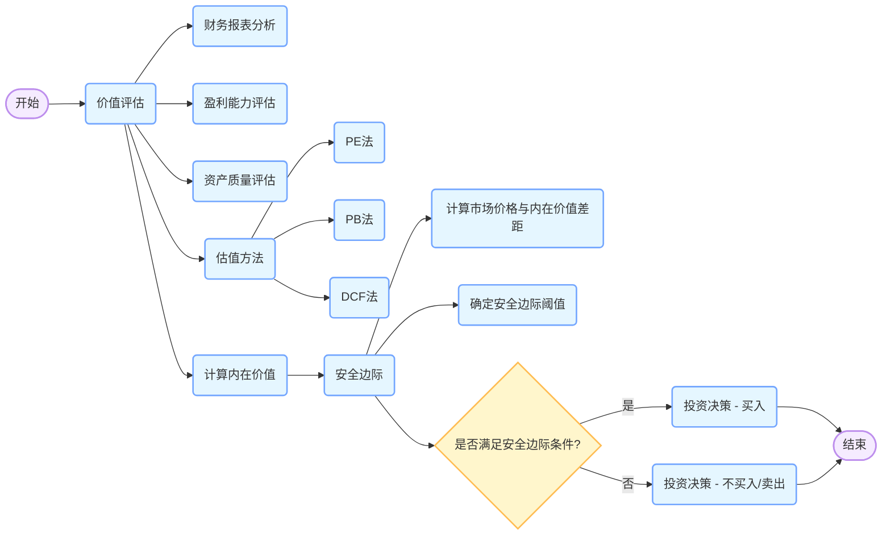

# 格雷厄姆特价股票理论在私募股权投资中的应用

> 关键词：格雷厄姆特价股票理论、私募股权投资、价值投资、安全边际、股票估值

> 摘要：本文深入探讨了格雷厄姆特价股票理论在私募股权投资中的应用。首先介绍了格雷厄姆特价股票理论的背景及私募股权投资的相关概念，阐述了文章的目的、范围、预期读者和文档结构。接着详细讲解了该理论的核心概念，包括其原理和架构，并通过文本示意图和Mermaid流程图进行直观展示。然后分析了核心算法原理，用Python代码进行说明，同时给出数学模型和公式，并举例解释。通过实际项目案例，展示了该理论在私募股权投资中的具体应用，包括开发环境搭建、源代码实现和解读。还探讨了其实际应用场景，推荐了学习该理论和进行私募股权投资的工具、资源和相关论文著作。最后总结了该理论在私募股权投资中的未来发展趋势与挑战，解答了常见问题，并提供了扩展阅读和参考资料。

## 1. 背景介绍 
### 1.1 目的和范围
本文章旨在深入研究格雷厄姆特价股票理论在私募股权投资领域的应用。通过对该理论的核心概念、算法原理、数学模型等方面的详细剖析，结合实际项目案例，探讨如何将这一经典的价值投资理论有效应用于私募股权投资实践中，为投资者提供决策依据和投资策略参考。文章的范围涵盖了格雷厄姆特价股票理论的基本原理、在私募股权投资中的应用方法、实际案例分析以及相关的工具和资源推荐等。

### 1.2 预期读者
本文预期读者主要包括私募股权投资从业者，如投资经理、分析师等，他们希望通过学习格雷厄姆特价股票理论来优化投资策略，提高投资回报率；同时也适合对价值投资和私募股权投资感兴趣的个人投资者，帮助他们深入理解投资理念和方法；此外，高校金融、投资相关专业的师生也可以将本文作为研究和学习的参考资料。

### 1.3 文档结构概述
本文共分为十个部分。第一部分为背景介绍，阐述了文章的目的、范围、预期读者和文档结构，并对相关术语进行解释。第二部分介绍格雷厄姆特价股票理论的核心概念，包括原理和架构，同时给出文本示意图和Mermaid流程图。第三部分讲解核心算法原理，用Python代码详细阐述具体操作步骤。第四部分给出数学模型和公式，并进行详细讲解和举例说明。第五部分通过实际项目案例，介绍开发环境搭建、源代码实现和代码解读。第六部分探讨该理论在私募股权投资中的实际应用场景。第七部分推荐学习该理论和进行私募股权投资的工具和资源，包括书籍、在线课程、技术博客、开发工具、相关框架和库以及论文著作等。第八部分总结该理论在私募股权投资中的未来发展趋势与挑战。第九部分解答常见问题。第十部分提供扩展阅读和参考资料。

### 1.4 术语表
#### 1.4.1 核心术语定义
- **格雷厄姆特价股票理论**：由本杰明·格雷厄姆（Benjamin Graham）提出的一种价值投资理论，该理论强调通过分析公司的基本面，寻找价格低于内在价值的股票进行投资，以获得长期稳定的回报。
- **私募股权投资**：指通过私募形式对私有企业，即非上市企业进行的权益性投资，在交易实施过程中附带考虑了将来的退出机制，即通过上市、并购或管理层回购等方式，出售持股获利。
- **安全边际**：格雷厄姆特价股票理论中的重要概念，指股票的市场价格低于其内在价值的幅度，安全边际越大，投资风险越低。
- **内在价值**：指股票所代表的企业的真实价值，是通过对企业的财务状况、盈利能力、行业前景等因素进行综合分析得出的。

#### 1.4.2 相关概念解释
- **价值投资**：一种投资策略，强调通过分析公司的基本面，寻找被市场低估的股票进行投资，以获得长期的资本增值。
- **成长投资**：一种投资策略，侧重于寻找具有高成长潜力的公司进行投资，通常更关注公司的未来发展前景和盈利增长速度。
- **市场效率**：指市场价格反映所有可用信息的程度，有效市场假说认为市场价格能够迅速、准确地反映所有公开信息。

#### 1.4.3 缩略词列表
- **PE**：市盈率（Price-to-Earnings Ratio），指股票价格除以每股收益的比率，用于衡量股票的估值水平。
- **PB**：市净率（Price-to-Book Ratio），指股票价格除以每股净资产的比率，用于衡量股票的估值水平。
- **DCF**：现金流折现法（Discounted Cash Flow），一种用于评估企业内在价值的方法，通过预测企业未来的现金流并将其折现到当前来计算企业的价值。

## 2. 核心概念与联系 

### 核心概念原理
格雷厄姆特价股票理论的核心原理是基于价值投资的理念，认为股票的市场价格会围绕其内在价值上下波动。投资者的目标是寻找那些市场价格低于内在价值的股票，即具有“特价”的股票进行投资。该理论强调通过对公司的基本面进行深入分析，包括财务报表、盈利能力、资产质量等，来评估股票的内在价值。同时，为了降低投资风险，格雷厄姆提出了“安全边际”的概念，即投资者应该在股票价格低于内在价值一定幅度时才进行投资，以确保在市场波动或公司业绩出现意外变化时仍能获得一定的收益。

### 核心概念架构
格雷厄姆特价股票理论的核心概念架构可以分为三个主要部分：价值评估、安全边际和投资决策。

- **价值评估**：通过对公司的财务报表、盈利能力、资产质量等因素进行分析，运用各种估值方法，如市盈率法、市净率法、现金流折现法等，来评估股票的内在价值。
- **安全边际**：在确定股票的内在价值后，计算股票的市场价格与内在价值之间的差距，即安全边际。安全边际越大，投资风险越低。
- **投资决策**：根据价值评估和安全边际的结果，做出投资决策。当股票的市场价格低于内在价值且具有足够的安全边际时，投资者可以考虑买入该股票；当股票的市场价格高于内在价值或安全边际不足时，投资者应该避免买入或考虑卖出该股票。

### 文本示意图
```plaintext
格雷厄姆特价股票理论
|-- 价值评估
|   |-- 财务报表分析
|   |-- 盈利能力评估
|   |-- 资产质量评估
|   |-- 估值方法（PE、PB、DCF等）
|-- 安全边际
|   |-- 计算市场价格与内在价值差距
|   |-- 确定安全边际阈值
|-- 投资决策
|   |-- 买入决策（价格低于内在价值且安全边际足够）
|   |-- 卖出决策（价格高于内在价值或安全边际不足）
```

### Mermaid流程图


## 3. 核心算法原理 & 具体操作步骤 

### 核心算法原理
格雷厄姆特价股票理论的核心算法原理主要围绕股票内在价值的评估和安全边际的计算。以下是几种常见的估值方法及其算法原理：

#### 市盈率法（PE法）
市盈率法是一种简单常用的估值方法，其基本原理是通过比较同行业公司的市盈率，来评估目标公司股票的合理价格。计算公式为：

$$V = EPS \times PE_{avg}$$

其中，$V$ 表示股票的内在价值，$EPS$ 表示每股收益，$PE_{avg}$ 表示同行业公司的平均市盈率。

#### 市净率法（PB法）
市净率法是通过比较公司的市净率与同行业公司的平均市净率，来评估公司股票的价值。计算公式为：

$$V = BVPS \times PB_{avg}$$

其中，$V$ 表示股票的内在价值，$BVPS$ 表示每股净资产，$PB_{avg}$ 表示同行业公司的平均市净率。

#### 现金流折现法（DCF法）
现金流折现法是一种更为复杂但更准确的估值方法，其基本原理是将公司未来的现金流折现到当前，以计算公司的内在价值。计算公式为：

$$V = \sum_{t=1}^{n} \frac{FCF_t}{(1 + r)^t} + \frac{TV}{(1 + r)^n}$$

其中，$V$ 表示股票的内在价值，$FCF_t$ 表示第 $t$ 期的自由现金流，$r$ 表示折现率，$n$ 表示预测期数，$TV$ 表示终值。

### 具体操作步骤

#### 步骤1：数据收集
收集目标公司的财务报表，包括资产负债表、利润表和现金流量表，以及同行业公司的相关数据，如市盈率、市净率等。

#### 步骤2：财务分析
对目标公司的财务报表进行分析，计算关键财务指标，如每股收益、每股净资产、自由现金流等。

#### 步骤3：估值计算
根据不同的估值方法，计算目标公司股票的内在价值。

#### 步骤4：安全边际计算
计算目标公司股票的市场价格与内在价值之间的差距，确定安全边际。

#### 步骤5：投资决策
根据安全边际的结果，做出投资决策。

### Python源代码实现

```python
import pandas as pd

# 步骤1：数据收集
# 假设已经收集到目标公司的财务数据和同行业平均数据
# 目标公司财务数据
eps = 2.0  # 每股收益
bvps = 10.0  # 每股净资产
# 同行业平均数据
pe_avg = 15.0  # 同行业平均市盈率
pb_avg = 2.0  # 同行业平均市净率

# 步骤3：估值计算
# 市盈率法
def pe_valuation(eps, pe_avg):
    return eps * pe_avg

# 市净率法
def pb_valuation(bvps, pb_avg):
    return bvps * pb_avg

# 计算内在价值
pe_value = pe_valuation(eps, pe_avg)
pb_value = pb_valuation(bvps, pb_avg)

print(f"市盈率法计算的内在价值: {pe_value}")
print(f"市净率法计算的内在价值: {pb_value}")

# 步骤4：安全边际计算
market_price = 20.0  # 假设市场价格
pe_safety_margin = (pe_value - market_price) / pe_value
pb_safety_margin = (pb_value - market_price) / pb_value

print(f"市盈率法的安全边际: {pe_safety_margin * 100:.2f}%")
print(f"市净率法的安全边际: {pb_safety_margin * 100:.2f}%")

# 步骤5：投资决策
safety_margin_threshold = 0.2  # 安全边际阈值
if pe_safety_margin > safety_margin_threshold or pb_safety_margin > safety_margin_threshold:
    print("可以考虑买入该股票")
else:
    print("不建议买入该股票")
```

## 4. 数学模型和公式 & 详细讲解 & 举例说明 

### 市盈率法（PE法）
#### 数学模型和公式
$$V = EPS \times PE_{avg}$$

#### 详细讲解
市盈率法的核心思想是认为同行业的公司具有相似的盈利能力和估值水平。通过计算目标公司的每股收益（$EPS$），并乘以同行业公司的平均市盈率（$PE_{avg}$），可以得到目标公司股票的合理价格（$V$）。每股收益是公司净利润除以总股本，反映了公司的盈利能力；市盈率是股票价格除以每股收益，反映了市场对公司盈利能力的预期。

#### 举例说明
假设一家公司的每股收益为 $2$ 元，同行业公司的平均市盈率为 $15$ 倍。则该公司股票的内在价值为：

$$V = 2 \times 15 = 30$$（元）

如果该公司股票的市场价格为 $25$ 元，则其安全边际为：

$$安全边际 = \frac{30 - 25}{30} \times 100\% \approx 16.67\%$$

### 市净率法（PB法）
#### 数学模型和公式
$$V = BVPS \times PB_{avg}$$

#### 详细讲解
市净率法的基本原理是认为公司的净资产是公司价值的重要组成部分。通过计算目标公司的每股净资产（$BVPS$），并乘以同行业公司的平均市净率（$PB_{avg}$），可以得到目标公司股票的合理价格（$V$）。每股净资产是公司净资产除以总股本，反映了公司的资产质量；市净率是股票价格除以每股净资产，反映了市场对公司资产价值的预期。

#### 举例说明
假设一家公司的每股净资产为 $10$ 元，同行业公司的平均市净率为 $2$ 倍。则该公司股票的内在价值为：

$$V = 10 \times 2 = 20$$（元）

如果该公司股票的市场价格为 $15$ 元，则其安全边际为：

$$安全边际 = \frac{20 - 15}{20} \times 100\% = 25\%$$

### 现金流折现法（DCF法）
#### 数学模型和公式
$$V = \sum_{t=1}^{n} \frac{FCF_t}{(1 + r)^t} + \frac{TV}{(1 + r)^n}$$

#### 详细讲解
现金流折现法的核心思想是将公司未来的现金流折现到当前，以计算公司的内在价值。其中，$FCF_t$ 表示第 $t$ 期的自由现金流，$r$ 表示折现率，$n$ 表示预测期数，$TV$ 表示终值。自由现金流是公司在满足了所有必要的资本支出后剩余的现金流量，反映了公司的实际盈利能力和现金创造能力；折现率是投资者要求的最低回报率，反映了投资的风险程度；终值是预测期结束后公司的价值。

#### 举例说明
假设一家公司未来 $5$ 年的自由现金流分别为 $100$ 万元、$120$ 万元、$150$ 万元、$180$ 万元和 $200$ 万元，折现率为 $10\%$，预测期结束后的终值为 $2000$ 万元。则该公司的内在价值为：

$$V = \frac{100}{(1 + 0.1)^1} + \frac{120}{(1 + 0.1)^2} + \frac{150}{(1 + 0.1)^3} + \frac{180}{(1 + 0.1)^4} + \frac{200}{(1 + 0.1)^5} + \frac{2000}{(1 + 0.1)^5}$$

```python
import numpy as np

fcf = np.array([100, 120, 150, 180, 200])
r = 0.1
n = 5
tv = 2000

discounted_fcf = fcf / (1 + r) ** np.arange(1, n + 1)
discounted_tv = tv / (1 + r) ** n

value = discounted_fcf.sum() + discounted_tv
print(f"现金流折现法计算的内在价值: {value:.2f} 万元")
```

## 5. 项目实战：代码实际案例和详细解释说明 

### 5.1  开发环境搭建
为了实现格雷厄姆特价股票理论在私募股权投资中的应用，我们可以使用Python进行开发。以下是开发环境的搭建步骤：

#### 步骤1：安装Python
从Python官方网站（https://www.python.org/downloads/）下载并安装Python 3.x版本。

#### 步骤2：安装必要的库
使用pip命令安装必要的库，如pandas、numpy等。

```sh
pip install pandas numpy
```

#### 步骤3：选择开发工具
可以选择使用Jupyter Notebook、PyCharm等开发工具进行代码编写和调试。

### 5.2  源代码详细实现和代码解读
以下是一个完整的Python代码示例，用于实现格雷厄姆特价股票理论在私募股权投资中的应用：

```python
import pandas as pd
import numpy as np

# 步骤1：数据收集
# 假设已经收集到目标公司的财务数据和同行业平均数据
# 目标公司财务数据
eps = 2.0  # 每股收益
bvps = 10.0  # 每股净资产
fcf = np.array([100, 120, 150, 180, 200])  # 未来5年的自由现金流
# 同行业平均数据
pe_avg = 15.0  # 同行业平均市盈率
pb_avg = 2.0  # 同行业平均市净率
# 其他参数
r = 0.1  # 折现率
n = 5  # 预测期数
tv = 2000  # 终值
market_price = 20.0  # 市场价格
safety_margin_threshold = 0.2  # 安全边际阈值

# 步骤3：估值计算
# 市盈率法
def pe_valuation(eps, pe_avg):
    return eps * pe_avg

# 市净率法
def pb_valuation(bvps, pb_avg):
    return bvps * pb_avg

# 现金流折现法
def dcf_valuation(fcf, r, n, tv):
    discounted_fcf = fcf / (1 + r) ** np.arange(1, n + 1)
    discounted_tv = tv / (1 + r) ** n
    return discounted_fcf.sum() + discounted_tv

# 计算内在价值
pe_value = pe_valuation(eps, pe_avg)
pb_value = pb_valuation(bvps, pb_avg)
dcf_value = dcf_valuation(fcf, r, n, tv)

print(f"市盈率法计算的内在价值: {pe_value}")
print(f"市净率法计算的内在价值: {pb_value}")
print(f"现金流折现法计算的内在价值: {dcf_value:.2f}")

# 步骤4：安全边际计算
pe_safety_margin = (pe_value - market_price) / pe_value
pb_safety_margin = (pb_value - market_price) / pb_value
dcf_safety_margin = (dcf_value - market_price) / dcf_value

print(f"市盈率法的安全边际: {pe_safety_margin * 100:.2f}%")
print(f"市净率法的安全边际: {pb_safety_margin * 100:.2f}%")
print(f"现金流折现法的安全边际: {dcf_safety_margin * 100:.2f}%")

# 步骤5：投资决策
if pe_safety_margin > safety_margin_threshold or pb_safety_margin > safety_margin_threshold or dcf_safety_margin > safety_margin_threshold:
    print("可以考虑买入该股票")
else:
    print("不建议买入该股票")
```

### 5.3  代码解读与分析
#### 数据收集部分
通过定义变量的方式，模拟收集到的目标公司的财务数据和同行业平均数据，包括每股收益、每股净资产、未来自由现金流、同行业平均市盈率、同行业平均市净率等。

#### 估值计算部分
定义了三个函数 `pe_valuation`、`pb_valuation` 和 `dcf_valuation` 分别用于计算市盈率法、市净率法和现金流折现法下的股票内在价值。

#### 安全边际计算部分
根据计算得到的内在价值和市场价格，计算不同估值方法下的安全边际。

#### 投资决策部分
根据安全边际和设定的安全边际阈值，做出投资决策。如果任何一种估值方法下的安全边际大于阈值，则可以考虑买入该股票；否则，不建议买入。

## 6. 实际应用场景 
### 投资组合构建
私募股权投资机构可以运用格雷厄姆特价股票理论来筛选具有投资价值的股票，构建投资组合。通过对不同行业、不同公司的基本面进行分析，寻找价格低于内在价值的股票，将这些股票纳入投资组合中，以实现投资组合的价值增值。同时，通过分散投资，可以降低投资风险。

### 项目投资决策
在私募股权投资项目中，对于目标企业的估值和投资决策是关键环节。格雷厄姆特价股票理论可以帮助投资机构评估目标企业的内在价值，确定合理的投资价格。如果目标企业的市场估值低于其内在价值，且具有足够的安全边际，投资机构可以考虑进行投资；反之，则应谨慎投资或放弃投资。

### 风险管理
在私募股权投资中，风险管理至关重要。格雷厄姆特价股票理论中的安全边际概念可以作为一种风险管理工具。投资机构可以通过设定安全边际阈值，筛选出具有足够安全边际的投资项目，降低投资风险。当市场出现波动或目标企业业绩出现下滑时，具有较高安全边际的投资项目可以更好地抵御风险，减少投资损失。

### 长期投资策略
格雷厄姆特价股票理论强调长期投资，认为股票的市场价格会围绕其内在价值上下波动，短期的市场波动并不影响股票的长期价值。私募股权投资机构可以运用该理论制定长期投资策略，选择具有稳定盈利能力和良好发展前景的企业进行投资，并长期持有这些股票，以获得长期的资本增值。

## 7. 工具和资源推荐
### 7.1 学习资源推荐
#### 7.1.1 书籍推荐
- 《聪明的投资者》（The Intelligent Investor）：本杰明·格雷厄姆的经典著作，被誉为投资界的圣经，详细阐述了格雷厄姆的价值投资理念和方法。
- 《证券分析》（Security Analysis）：同样是本杰明·格雷厄姆的著作，是价值投资领域的权威书籍，对股票和债券的分析方法进行了深入探讨。
- 《巴菲特致股东的信：股份公司教程》（Letters to Shareholders of Berkshire Hathaway）：沃伦·巴菲特每年写给股东的信，其中包含了许多关于价值投资的宝贵经验和见解。

#### 7.1.2 在线课程
- Coursera上的“投资学原理”（Principles of Investing）：由知名大学教授授课，涵盖了投资学的基本原理和方法，包括价值投资。
- edX上的“金融市场”（Financial Markets）：耶鲁大学教授罗伯特·席勒（Robert Shiller）主讲的课程，深入讲解了金融市场的运作机制和投资策略。

#### 7.1.3 技术博客和网站
- 雪球网（https://xueqiu.com/）：国内知名的投资社区，提供股票、基金等投资产品的分析和讨论，有许多价值投资者分享自己的投资经验和见解。
- 价值投资网（https://www.valueinvestorsclub.com/）：国外的价值投资社区，汇集了全球顶尖的价值投资者，分享他们的投资研究和分析报告。

### 7.2 开发工具框架推荐
#### 7.2.1 IDE和编辑器
- PyCharm：一款专业的Python集成开发环境，具有强大的代码编辑、调试和分析功能，适合Python开发。
- Jupyter Notebook：一种交互式的开发环境，支持Python等多种编程语言，方便进行数据分析和可视化。

#### 7.2.2 调试和性能分析工具
- pdb：Python自带的调试工具，可以帮助开发者定位和解决代码中的问题。
- cProfile：Python的性能分析工具，可以分析代码的运行时间和性能瓶颈。

#### 7.2.3 相关框架和库
- pandas：用于数据处理和分析的Python库，提供了丰富的数据结构和数据分析工具。
- numpy：用于科学计算的Python库，提供了高效的数组和矩阵运算功能。
- scikit-learn：用于机器学习的Python库，提供了各种机器学习算法和工具。

### 7.3 相关论文著作推荐
#### 7.3.1 经典论文
- “The Superinvestors of Graham-and-Doddsville”：沃伦·巴菲特发表的论文，介绍了格雷厄姆价值投资理念的成功案例，证明了价值投资的有效性。
- “Security Analysis: Principles and Technique”：本杰明·格雷厄姆和戴维·多德（David Dodd）发表的论文，奠定了价值投资理论的基础。

#### 7.3.2 最新研究成果
- 关注顶尖学术期刊，如《金融研究评论》（Review of Financial Studies）、《金融经济学杂志》（Journal of Financial Economics）等，了解价值投资领域的最新研究动态。

#### 7.3.3 应用案例分析
- 可以参考一些私募股权投资机构的年度报告和研究报告，了解他们在实际投资中如何应用格雷厄姆特价股票理论。

## 8. 总结：未来发展趋势与挑战
### 未来发展趋势
#### 与科技融合
随着科技的不断发展，人工智能、大数据等技术将在私募股权投资中得到更广泛的应用。格雷厄姆特价股票理论可以与这些技术相结合，通过数据分析和模型预测，更准确地评估股票的内在价值和安全边际，提高投资决策的效率和准确性。

#### 多元化应用
格雷厄姆特价股票理论不仅可以应用于股票投资，还可以拓展到其他领域，如债券投资、房地产投资等。通过对不同资产的基本面进行分析，寻找被低估的资产进行投资，实现资产的多元化配置。

#### 国际化发展
随着全球经济的一体化，私募股权投资市场也越来越国际化。格雷厄姆特价股票理论可以在全球范围内应用，投资者可以通过对不同国家和地区的股票市场进行分析，寻找具有投资价值的股票，实现跨国投资和资产的全球配置。

### 挑战
#### 数据质量和可靠性
格雷厄姆特价股票理论的应用依赖于准确的财务数据和市场信息。然而，在实际应用中，数据的质量和可靠性可能存在问题，如财务报表造假、市场信息滞后等。这将影响股票内在价值的评估和投资决策的准确性。

#### 市场效率提高
随着市场的发展和投资者的成熟，市场效率不断提高，股票价格越来越能反映其内在价值。这使得寻找价格低于内在价值的股票变得更加困难，格雷厄姆特价股票理论的应用空间可能会受到一定的限制。

#### 宏观经济环境变化
宏观经济环境的变化，如经济衰退、通货膨胀、利率波动等，会对股票市场产生重大影响。这些因素可能导致股票的内在价值发生变化，增加了投资决策的难度和风险。

## 9. 附录：常见问题与解答
### 问题1：格雷厄姆特价股票理论适用于所有类型的股票吗？
解答：格雷厄姆特价股票理论主要适用于具有稳定盈利能力和可预测现金流的成熟企业的股票。对于一些新兴行业的高成长股票，由于其未来发展具有较大的不确定性，难以准确评估其内在价值，该理论的适用性可能会受到一定的限制。

### 问题2：如何确定安全边际的阈值？
解答：安全边际的阈值没有固定的标准，通常需要根据投资者的风险偏好、市场环境和投资目标等因素来确定。一般来说，风险偏好较低的投资者可以设定较高的安全边际阈值；在市场波动较大或经济环境不稳定时，也可以适当提高安全边际阈值。

### 问题3：现金流折现法中的折现率如何确定？
解答：折现率的确定是现金流折现法中的关键环节，通常需要考虑投资者要求的最低回报率、市场利率、投资风险等因素。一种常用的方法是使用资本资产定价模型（CAPM）来计算折现率，公式为：

$$r = R_f + \beta \times (R_m - R_f)$$

其中，$r$ 表示折现率，$R_f$ 表示无风险利率，$\beta$ 表示股票的贝塔系数，$R_m$ 表示市场收益率。

### 问题4：格雷厄姆特价股票理论与其他投资理论有什么区别？
解答：格雷厄姆特价股票理论强调通过分析公司的基本面，寻找价格低于内在价值的股票进行投资，注重安全边际和长期投资。与成长投资理论相比，成长投资更关注公司的未来发展前景和盈利增长速度，而不太注重股票的估值；与技术分析理论相比，技术分析主要通过研究股票的价格走势和成交量等技术指标来预测股票的未来走势，而不考虑公司的基本面。

## 10. 扩展阅读 & 参考资料
### 扩展阅读
- 《财务报表分析与证券定价》（Financial Statement Analysis and Security Valuation）：深入讲解了财务报表分析在证券定价中的应用，与格雷厄姆特价股票理论密切相关。
- 《金融炼金术》（The Alchemy of Finance）：乔治·索罗斯（George Soros）的著作，介绍了他的反身性理论和投资哲学，对投资者有一定的启发。

### 参考资料
- Graham, Benjamin. The Intelligent Investor. Harper Business, 2003.
- Graham, Benjamin, and David Dodd. Security Analysis. McGraw-Hill, 1934.
- Buffett, Warren E. “The Superinvestors of Graham-and-Doddsville.” Hermes, Columbia Business School, 1984.

作者：AI天才研究院/AI Genius Institute & 禅与计算机程序设计艺术 /Zen And The Art of Computer Programming