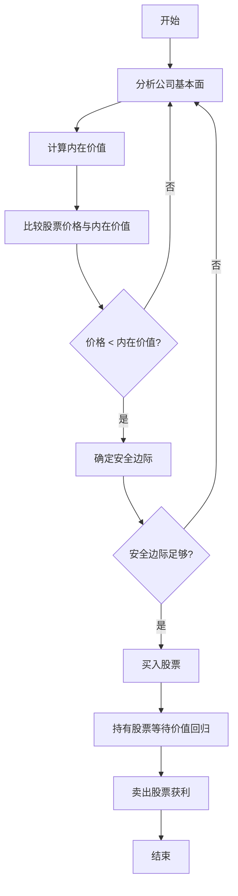

# 格雷厄姆特价股票理论对公司估值方法的影响

> 关键词：格雷厄姆特价股票理论、公司估值方法、价值投资、财务分析、市场效率

> 摘要：本文深入探讨了格雷厄姆特价股票理论对公司估值方法的影响。首先介绍了该理论的背景和核心概念，阐述了其与传统公司估值方法的联系与区别。接着详细分析了格雷厄姆特价股票理论的核心算法原理，并通过Python代码进行了具体操作步骤的演示。从数学模型和公式的角度，对该理论在公司估值中的应用进行了详细讲解和举例说明。通过项目实战，展示了如何运用该理论进行公司估值的实际案例及代码解读。还探讨了该理论在实际应用中的场景，推荐了相关的学习资源、开发工具框架以及论文著作。最后总结了格雷厄姆特价股票理论在未来公司估值领域的发展趋势与挑战，并对常见问题进行了解答。

## 1. 背景介绍 
### 1.1 目的和范围
本文章旨在全面剖析格雷厄姆特价股票理论对公司估值方法产生的影响。从理论基础出发，深入探究其核心算法、数学模型，并通过实际案例展示其在公司估值中的应用。研究范围涵盖了该理论的原理、实际操作、应用场景以及未来发展趋势等方面，旨在为投资者、金融分析师和相关研究人员提供全面且深入的参考。

### 1.2 预期读者
本文预期读者包括对价值投资、公司估值感兴趣的投资者，从事金融分析、证券研究的专业人士，以及金融、经济领域的研究人员和学生。对于希望深入了解格雷厄姆特价股票理论及其在公司估值中应用的人士，本文将提供有价值的知识和见解。

### 1.3 文档结构概述
本文将按照以下结构展开：首先介绍格雷厄姆特价股票理论的背景知识，包括术语定义和相关概念解释；接着阐述核心概念及其与公司估值方法的联系，并通过示意图和流程图进行直观展示；然后详细讲解核心算法原理，并用Python代码说明具体操作步骤；随后介绍该理论涉及的数学模型和公式，并举例说明；通过项目实战展示实际案例和代码解读；探讨该理论在实际中的应用场景；推荐相关的学习资源、开发工具框架和论文著作；最后总结未来发展趋势与挑战，解答常见问题，并提供扩展阅读和参考资料。

### 1.4 术语表
#### 1.4.1 核心术语定义
- **格雷厄姆特价股票理论**：由本杰明·格雷厄姆提出的一种投资理论，强调寻找价格低于内在价值的股票，通过分析公司的财务状况和基本面，筛选出具有投资价值的特价股票。
- **公司估值**：对公司的整体价值进行评估的过程，通过各种方法和模型来确定公司在特定时间点的合理价值。
- **内在价值**：公司股票所代表的真实价值，基于公司的资产、盈利能力、现金流等基本面因素计算得出。
- **安全边际**：股票价格与内在价值之间的差值，安全边际越大，投资风险越低。

#### 1.4.2 相关概念解释
- **价值投资**：一种投资策略，注重股票的内在价值，通过分析公司的基本面，寻找被低估的股票进行投资，长期持有以获取收益。
- **财务分析**：对公司的财务报表进行分析，评估公司的财务状况、盈利能力、偿债能力等，为投资决策提供依据。
- **市场效率**：市场价格反映资产真实价值的程度，有效市场中价格能够迅速反映所有可用信息。

#### 1.4.3 缩略词列表
- **EPS**：Earnings Per Share，每股收益
- **P/E**：Price-to-Earnings Ratio，市盈率
- **BVPS**：Book Value Per Share，每股账面价值

## 2. 核心概念与联系 
### 核心概念原理
格雷厄姆特价股票理论的核心原理是寻找价格低于内在价值的股票。格雷厄姆认为，市场有时会出现非理性行为，导致股票价格偏离其内在价值。投资者可以通过深入分析公司的财务状况、盈利能力、资产负债表等基本面因素，来评估公司的内在价值。当股票价格低于内在价值时，就存在投资机会，因为市场最终会纠正这种价格偏差，使股票价格回归到内在价值水平。

内在价值的计算通常基于公司的未来现金流、盈利能力和资产价值等因素。格雷厄姆提出了一些简单的估值指标，如市盈率（P/E）、市净率（P/B）等，用于初步筛选具有投资价值的股票。他认为，低市盈率和低市净率的股票往往具有较高的安全边际，投资风险相对较低。

### 架构的文本示意图
```plaintext
格雷厄姆特价股票理论
|
|-- 寻找价格低于内在价值的股票
|   |
|   |-- 分析公司基本面
|   |   |
|   |   |-- 财务状况
|   |   |   |
|   |   |   |-- 资产负债表
|   |   |   |-- 利润表
|   |   |   |-- 现金流量表
|   |   |
|   |   |-- 盈利能力
|   |   |   |
|   |   |   |-- 每股收益（EPS）
|   |   |   |-- 净资产收益率（ROE）
|   |   |
|   |   |-- 资产价值
|   |       |
|   |       |-- 每股账面价值（BVPS）
|   |
|   |-- 计算内在价值
|       |
|       |-- 基于未来现金流
|       |-- 基于盈利能力
|       |-- 基于资产价值
|
|-- 确定安全边际
|   |
|   |-- 股票价格与内在价值的差值
|
|-- 投资决策
|   |
|   |-- 买入价格低于内在价值且安全边际足够的股票
```

### Mermaid 流程图


## 3. 核心算法原理 & 具体操作步骤 
### 核心算法原理
格雷厄姆特价股票理论的核心算法主要围绕计算公司的内在价值和确定安全边际展开。常见的计算内在价值的方法有以下几种：

#### 基于市盈率的估值方法
市盈率（P/E）是指股票价格与每股收益（EPS）的比值。格雷厄姆认为，合理的市盈率应该根据公司的盈利能力和稳定性来确定。一般来说，稳定增长的公司可以给予较高的市盈率，而业绩波动较大的公司市盈率应该较低。

内在价值（IV）的计算公式为：
$$IV = EPS \times P/E_{合理}$$

#### 基于市净率的估值方法
市净率（P/B）是指股票价格与每股账面价值（BVPS）的比值。市净率反映了市场对公司资产价值的认可程度。格雷厄姆认为，市净率较低的股票往往具有较高的安全边际。

内在价值（IV）的计算公式为：
$$IV = BVPS \times P/B_{合理}$$

#### 综合估值方法
为了更准确地评估公司的内在价值，可以综合考虑市盈率和市净率等多个指标。例如，可以取基于市盈率和市净率计算出的内在价值的平均值作为最终的内在价值。

### 具体操作步骤
以下是运用格雷厄姆特价股票理论进行公司估值的具体操作步骤：

1. **收集公司财务数据**：收集公司的财务报表，包括资产负债表、利润表和现金流量表，获取每股收益（EPS）、每股账面价值（BVPS）等关键数据。
2. **确定合理的市盈率和市净率**：根据公司的行业特点、盈利能力和稳定性等因素，确定合理的市盈率（P/E_{合理}）和市净率（P/B_{合理}）。一般来说，可以参考同行业公司的平均市盈率和市净率，并结合公司的自身情况进行调整。
3. **计算内在价值**：根据上述公式，分别计算基于市盈率和市净率的内在价值，并取平均值作为最终的内在价值。
4. **比较股票价格与内在价值**：将当前股票价格与计算出的内在价值进行比较，如果股票价格低于内在价值，则认为该股票具有投资价值。
5. **确定安全边际**：计算股票价格与内在价值之间的差值，作为安全边际。安全边际越大，投资风险越低。
6. **做出投资决策**：如果股票价格低于内在价值且安全边际足够，则可以考虑买入该股票；否则，继续寻找其他投资机会。

### Python 源代码实现
```python
# 假设已经获取了公司的每股收益（EPS）、每股账面价值（BVPS）
# 以及确定了合理的市盈率（PE_ratio）和市净率（PB_ratio）
EPS = 2.0
BVPS = 10.0
PE_ratio = 15
PB_ratio = 1.5

# 计算基于市盈率的内在价值
IV_PE = EPS * PE_ratio

# 计算基于市净率的内在价值
IV_PB = BVPS * PB_ratio

# 计算综合内在价值
IV = (IV_PE + IV_PB) / 2

# 假设当前股票价格
stock_price = 25

# 比较股票价格与内在价值
if stock_price < IV:
    # 计算安全边际
    safety_margin = IV - stock_price
    print(f"该股票具有投资价值，安全边际为: {safety_margin}")
else:
    print("该股票价格高于内在价值，不具有投资价值。")
```

## 4. 数学模型和公式 & 详细讲解 & 举例说明 
### 数学模型和公式
#### 基于市盈率的估值模型
如前所述，基于市盈率的内在价值计算公式为：
$$IV = EPS \times P/E_{合理}$$
其中，$IV$ 表示内在价值，$EPS$ 表示每股收益，$P/E_{合理}$ 表示合理的市盈率。

#### 基于市净率的估值模型
基于市净率的内在价值计算公式为：
$$IV = BVPS \times P/B_{合理}$$
其中，$IV$ 表示内在价值，$BVPS$ 表示每股账面价值，$P/B_{合理}$ 表示合理的市净率。

#### 综合估值模型
综合考虑市盈率和市净率的内在价值计算公式为：
$$IV = \frac{EPS \times P/E_{合理} + BVPS \times P/B_{合理}}{2}$$

### 详细讲解
#### 基于市盈率的估值模型
市盈率反映了市场对公司盈利能力的预期。合理的市盈率应该根据公司的行业特点、盈利能力和稳定性等因素来确定。一般来说，稳定增长的公司可以给予较高的市盈率，因为市场对其未来盈利能力有较高的预期；而业绩波动较大的公司市盈率应该较低。

例如，一家稳定增长的消费类公司，其每股收益为 $3$ 元，行业平均市盈率为 $20$ 倍。根据基于市盈率的估值模型，该公司的内在价值为：
$$IV = 3 \times 20 = 60$$（元）

#### 基于市净率的估值模型
市净率反映了市场对公司资产价值的认可程度。市净率较低的股票往往意味着市场对公司资产的估值较低，可能存在投资机会。

例如，一家制造业公司，其每股账面价值为 $15$ 元，行业平均市净率为 $1.2$ 倍。根据基于市净率的估值模型，该公司的内在价值为：
$$IV = 15 \times 1.2 = 18$$（元）

#### 综合估值模型
综合估值模型综合考虑了市盈率和市净率两个指标，能够更全面地评估公司的内在价值。通过取基于市盈率和市净率计算出的内在价值的平均值，可以减少单一指标的局限性。

### 举例说明
假设一家科技公司的财务数据如下：每股收益（EPS）为 $2.5$ 元，每股账面价值（BVPS）为 $12$ 元。经过分析，确定该公司合理的市盈率（P/E_{合理}）为 $18$ 倍，合理的市净率（P/B_{合理}）为 $1.5$ 倍。

首先，计算基于市盈率的内在价值：
$$IV_{PE} = EPS \times P/E_{合理} = 2.5 \times 18 = 45$$（元）

然后，计算基于市净率的内在价值：
$$IV_{PB} = BVPS \times P/B_{合理} = 12 \times 1.5 = 18$$（元）

最后，计算综合内在价值：
$$IV = \frac{IV_{PE} + IV_{PB}}{2} = \frac{45 + 18}{2} = 31.5$$（元）

如果当前该公司的股票价格为 $28$ 元，由于股票价格低于内在价值，且安全边际为 $31.5 - 28 = 3.5$ 元，说明该股票具有投资价值。

## 5. 项目实战：代码实际案例和详细解释说明 
### 5.1 开发环境搭建
为了实现格雷厄姆特价股票理论在公司估值中的应用，我们需要搭建一个Python开发环境。以下是具体的搭建步骤：

1. **安装Python**：从Python官方网站（https://www.python.org/downloads/）下载并安装Python 3.x版本。
2. **安装必要的库**：我们需要安装一些Python库来处理财务数据和进行计算，如`pandas`、`numpy`等。可以使用以下命令进行安装：
```sh
pip install pandas numpy
```

### 5.2 源代码详细实现和代码解读
以下是一个完整的Python代码示例，用于运用格雷厄姆特价股票理论对一家公司进行估值：

```python
import pandas as pd
import numpy as np

# 定义公司财务数据类
class CompanyFinancialData:
    def __init__(self, eps, bvps, pe_ratio, pb_ratio, stock_price):
        self.eps = eps
        self.bvps = bvps
        self.pe_ratio = pe_ratio
        self.pb_ratio = pb_ratio
        self.stock_price = stock_price

    def calculate_intrinsic_value(self):
        # 计算基于市盈率的内在价值
        iv_pe = self.eps * self.pe_ratio
        # 计算基于市净率的内在价值
        iv_pb = self.bvps * self.pb_ratio
        # 计算综合内在价值
        iv = (iv_pe + iv_pb) / 2
        return iv

    def evaluate_investment(self):
        iv = self.calculate_intrinsic_value()
        if self.stock_price < iv:
            # 计算安全边际
            safety_margin = iv - self.stock_price
            print(f"该股票具有投资价值，内在价值为: {iv} 元，安全边际为: {safety_margin} 元。")
        else:
            print("该股票价格高于内在价值，不具有投资价值。")

# 示例数据
eps = 2.0
bvps = 10.0
pe_ratio = 15
pb_ratio = 1.5
stock_price = 25

# 创建公司财务数据对象
company_data = CompanyFinancialData(eps, bvps, pe_ratio, pb_ratio, stock_price)

# 评估投资价值
company_data.evaluate_investment()
```

### 代码解读与分析
#### 类的定义
`CompanyFinancialData`类用于存储公司的财务数据，并提供计算内在价值和评估投资价值的方法。

- `__init__`方法：初始化公司的每股收益（`eps`）、每股账面价值（`bvps`）、合理的市盈率（`pe_ratio`）、合理的市净率（`pb_ratio`）和当前股票价格（`stock_price`）。
- `calculate_intrinsic_value`方法：根据基于市盈率和市净率的估值模型，计算公司的综合内在价值。
- `evaluate_investment`方法：比较股票价格与内在价值，如果股票价格低于内在价值，则计算安全边际并输出该股票具有投资价值的信息；否则，输出该股票不具有投资价值的信息。

#### 示例数据和对象创建
我们定义了示例数据，并创建了一个`CompanyFinancialData`对象，将示例数据传递给该对象。

#### 评估投资价值
调用`evaluate_investment`方法对该公司的股票进行投资价值评估，并输出评估结果。

## 6. 实际应用场景 
### 价值投资
格雷厄姆特价股票理论是价值投资的重要理论基础之一。价值投资者通过运用该理论，寻找价格低于内在价值的股票进行投资。他们相信，市场最终会纠正价格偏差，使股票价格回归到内在价值水平，从而获得投资收益。

例如，巴菲特是价值投资的代表人物之一，他深受格雷厄姆的影响。巴菲特通过深入分析公司的基本面，寻找具有长期竞争优势和稳定盈利能力的公司，在股票价格低于内在价值时买入并长期持有，获得了丰厚的回报。

### 股票筛选
在股票筛选过程中，格雷厄姆特价股票理论可以作为一种有效的筛选工具。投资者可以根据该理论的估值指标，如市盈率、市净率等，对大量的股票进行筛选，找出具有投资价值的股票。

例如，一些量化投资策略会使用格雷厄姆的估值指标，结合其他技术指标和基本面因素，构建股票筛选模型，自动筛选出符合条件的股票，为投资者提供投资建议。

### 公司并购估值
在公司并购过程中，准确评估目标公司的价值是至关重要的。格雷厄姆特价股票理论可以为公司并购估值提供一种参考方法。通过分析目标公司的财务状况和基本面，计算其内在价值，为并购交易提供合理的价格依据。

例如，在一家公司收购另一家公司时，收购方可以运用格雷厄姆的估值方法，评估目标公司的价值，确定合理的收购价格，避免过高支付收购成本。

## 7. 工具和资源推荐
### 7.1 学习资源推荐
#### 7.1.1 书籍推荐
- 《聪明的投资者》（The Intelligent Investor）：本杰明·格雷厄姆的经典著作，详细阐述了价值投资的理念和方法，是学习格雷厄姆特价股票理论的必读之书。
- 《证券分析》（Security Analysis）：同样是格雷厄姆的重要著作，对证券分析的理论和实践进行了系统的阐述，为投资者提供了深入分析公司基本面的方法和工具。
- 《巴菲特致股东的信：股份公司教程》（Letters to Shareholders of Berkshire Hathaway）：沃伦·巴菲特每年写给股东的信，其中包含了他的投资理念、方法和对市场的看法，对理解格雷厄姆特价股票理论的实际应用具有重要的参考价值。

#### 7.1.2 在线课程
- Coursera上的“价值投资基础”（Foundations of Value Investing）课程：由知名教授授课，系统介绍了价值投资的基本概念、理论和方法，包括格雷厄姆特价股票理论的应用。
- Udemy上的“股票估值与投资分析”（Stock Valuation and Investment Analysis）课程：通过实际案例，详细讲解了如何运用各种估值方法对股票进行估值，其中包括格雷厄姆的估值方法。

#### 7.1.3 技术博客和网站
- 雪球网（https://xueqiu.com/）：国内知名的投资社区，提供了丰富的股票分析、研究报告和投资策略分享，投资者可以在上面学习到格雷厄姆特价股票理论的实际应用案例和经验分享。
- Seeking Alpha（https://seekingalpha.com/）：国际知名的投资研究网站，汇聚了众多投资专家和分析师的文章和观点，对价值投资和公司估值方法有深入的探讨。

### 7.2 开发工具框架推荐
#### 7.2.1 IDE和编辑器
- PyCharm：一款专业的Python集成开发环境，提供了丰富的代码编辑、调试和项目管理功能，适合开发Python代码进行公司估值分析。
- Jupyter Notebook：一个交互式的开发环境，支持Python代码的编写、运行和可视化展示，非常适合进行数据探索和分析，在公司估值分析中可以方便地进行数据处理和模型验证。

#### 7.2.2 调试和性能分析工具
- pdb：Python自带的调试工具，可以帮助开发者在代码运行过程中进行调试，定位和解决问题。
- cProfile：Python的性能分析工具，可以分析代码的运行时间和资源消耗情况，帮助开发者优化代码性能。

#### 7.2.3 相关框架和库
- pandas：一个强大的数据处理和分析库，提供了高效的数据结构和数据操作方法，适合处理和分析公司的财务数据。
- numpy：Python的数值计算库，提供了丰富的数学函数和数组操作功能，在公司估值分析中可以用于进行数值计算和模型实现。

### 7.3 相关论文著作推荐
#### 7.3.1 经典论文
- Graham, B., & Dodd, D. L. (1934). Security Analysis. This classic paper laid the foundation for fundamental analysis and value investing, introducing concepts such as intrinsic value and margin of safety.
- Fama, E. F., & French, K. R. (1992). The Cross-Section of Expected Stock Returns. This paper proposed the Fama-French three-factor model, which has had a significant impact on the field of asset pricing and investment analysis.

#### 7.3.2 最新研究成果
- Recent research on the application of machine learning and artificial intelligence in value investing, exploring new methods and models for stock valuation and investment decision-making.
- Studies on the impact of market efficiency and behavioral finance on the effectiveness of Graham's special situation stock theory, providing new perspectives and insights for investors.

#### 7.3.3 应用案例分析
- Case studies of successful value investors who have applied Graham's special situation stock theory, analyzing their investment strategies, decision-making processes, and performance evaluation.
- Analysis of the application of Graham's theory in different industries and market environments, providing practical guidance for investors in various situations.

## 8. 总结：未来发展趋势与挑战
### 未来发展趋势
#### 与新兴技术融合
随着人工智能、机器学习等新兴技术的发展，格雷厄姆特价股票理论将与这些技术深度融合。通过运用大数据分析和机器学习算法，可以更准确地评估公司的内在价值，筛选出具有投资价值的股票。例如，利用自然语言处理技术分析公司的财务报告和新闻资讯，提取关键信息，为估值模型提供更丰富的数据支持。

#### 国际化应用
随着全球金融市场的一体化，格雷厄姆特价股票理论将在更广泛的国际市场得到应用。不同国家和地区的市场环境和公司特点存在差异，该理论将不断适应和调整，为全球投资者提供更有效的投资策略。

#### 多元化发展
除了传统的股票投资领域，格雷厄姆特价股票理论将向其他金融领域拓展，如债券投资、基金投资等。同时，该理论将与其他投资理论和策略相结合，形成多元化的投资组合，降低投资风险，提高投资收益。

### 挑战
#### 市场环境变化
随着金融市场的不断发展和变化，市场效率不断提高，股票价格更能及时反映公司的基本面信息。这使得寻找价格低于内在价值的股票变得更加困难，格雷厄姆特价股票理论的应用面临挑战。

#### 数据质量和可靠性
准确的公司财务数据是运用格雷厄姆特价股票理论进行估值的基础。然而，在实际应用中，数据质量和可靠性可能存在问题，如财务报表造假、数据更新不及时等。这些问题会影响估值结果的准确性，给投资者带来风险。

#### 投资者情绪和行为因素
投资者的情绪和行为因素会对股票价格产生影响，导致股票价格偏离内在价值。例如，市场的恐慌和贪婪情绪会使股票价格出现过度波动，增加了运用该理论进行投资决策的难度。

## 9. 附录：常见问题与解答
### 问题1：如何确定合理的市盈率和市净率？
解答：确定合理的市盈率和市净率需要综合考虑公司的行业特点、盈利能力、稳定性等因素。一般可以参考同行业公司的平均市盈率和市净率，并结合公司的自身情况进行调整。例如，对于稳定增长的公司，可以给予相对较高的市盈率；对于业绩波动较大的公司，市盈率应该较低。同时，还可以考虑公司的未来发展前景、竞争优势等因素。

### 问题2：格雷厄姆特价股票理论适用于所有类型的公司吗？
解答：格雷厄姆特价股票理论主要适用于具有稳定财务状况和可预测盈利能力的公司。对于一些新兴行业的公司，如科技初创企业，由于其业绩波动较大，未来发展前景不确定，该理论的应用可能存在一定的局限性。在这种情况下，需要结合其他估值方法和分析工具进行综合评估。

### 问题3：安全边际的大小如何确定？
解答：安全边际的大小没有固定的标准，一般需要根据投资者的风险偏好和市场情况来确定。安全边际越大，投资风险越低，但同时可能也会错过一些投资机会。投资者可以根据自己的经验和判断，设定一个合理的安全边际阈值，当股票价格与内在价值的差值大于该阈值时，认为该股票具有足够的安全边际，可以考虑买入。

## 10. 扩展阅读 & 参考资料
### 扩展阅读
- 《金融炼金术》（The Alchemy of Finance）：乔治·索罗斯的著作，探讨了金融市场的反身性原理，对理解市场的非理性行为和价格波动具有重要的启示作用。
- 《漫步华尔街》（A Random Walk Down Wall Street）：伯顿·马尔基尔的经典著作，介绍了有效市场假说和随机漫步理论，对投资决策和市场效率进行了深入的分析。

### 参考资料
- Graham, B., & Dodd, D. L. (1934). Security Analysis. McGraw-Hill.
- Buffett, W. E. (2014). The Essays of Warren Buffett: Lessons for Corporate America. The Cunningham Group.
- Fama, E. F., & French, K. R. (1992). The Cross-Section of Expected Stock Returns. The Journal of Finance, 47(2), 427-465.

作者：AI天才研究院/AI Genius Institute & 禅与计算机程序设计艺术 /Zen And The Art of Computer Programming