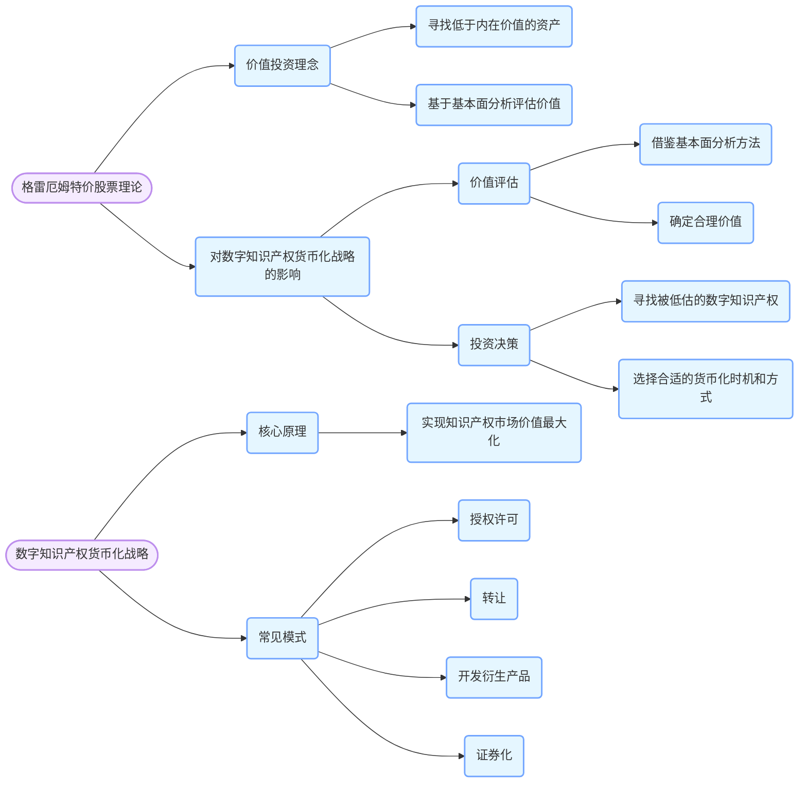

# 格雷厄姆特价股票理论对公司数字知识产权货币化战略的影响

> 关键词：格雷厄姆特价股票理论、数字知识产权、货币化战略、价值评估、市场效率

> 摘要：本文深入探讨了格雷厄姆特价股票理论对公司数字知识产权货币化战略的影响。首先介绍了格雷厄姆特价股票理论的背景和核心概念，接着分析了数字知识产权货币化战略的相关原理和常见模式。通过研究两者之间的联系，阐述了格雷厄姆理论如何从价值评估、投资决策等方面影响公司的数字知识产权货币化战略。同时，结合数学模型和实际案例，详细说明了在实践中如何应用相关理论制定有效的战略。最后，探讨了该影响在实际应用场景中的体现，推荐了相关的学习资源、开发工具和研究论文，并对未来发展趋势与挑战进行了总结。

## 1. 背景介绍 
### 1.1 目的和范围
本研究旨在深入剖析格雷厄姆特价股票理论对公司数字知识产权货币化战略的具体影响。范围涵盖了格雷厄姆特价股票理论的核心原理、数字知识产权货币化的各种模式以及两者之间的相互作用机制。通过理论分析和实际案例研究，为公司在制定数字知识产权货币化战略时提供有价值的参考，帮助公司更好地利用格雷厄姆理论优化战略决策，提高数字知识产权的货币化效率和效益。

### 1.2 预期读者
本文的预期读者包括企业管理者、知识产权专家、投资者、金融分析师以及对数字经济和知识产权领域感兴趣的研究人员。对于企业管理者而言，了解格雷厄姆理论对数字知识产权货币化战略的影响有助于他们制定更合理的企业发展战略；知识产权专家可以从中获得新的思路和方法，提升知识产权管理和运营水平；投资者和金融分析师能够借助相关理论和分析方法，更准确地评估企业的价值和投资潜力；研究人员则可以将本文作为进一步深入研究的基础。

### 1.3 文档结构概述
本文共分为十个部分。第一部分为背景介绍，阐述了研究的目的、范围、预期读者和文档结构概述，并对相关术语进行了定义和解释。第二部分介绍了格雷厄姆特价股票理论和数字知识产权货币化战略的核心概念，以及它们之间的联系，并通过文本示意图和 Mermaid 流程图进行了直观展示。第三部分详细讲解了相关的核心算法原理和具体操作步骤，同时给出了 Python 源代码示例。第四部分介绍了涉及的数学模型和公式，并通过详细讲解和举例说明加深理解。第五部分通过项目实战，展示了代码实际案例，并对代码进行了详细解释和分析。第六部分探讨了格雷厄姆理论对公司数字知识产权货币化战略影响的实际应用场景。第七部分推荐了相关的学习资源、开发工具和研究论文。第八部分总结了未来发展趋势与挑战。第九部分为附录，解答了常见问题。第十部分提供了扩展阅读和参考资料。

### 1.4 术语表
#### 1.4.1 核心术语定义
- **格雷厄姆特价股票理论**：由本杰明·格雷厄姆（Benjamin Graham）提出的一种投资理论，核心观点是寻找价格低于内在价值的股票进行投资，强调通过对公司财务报表和基本面的分析来评估股票的内在价值。
- **数字知识产权**：指基于数字技术产生的知识产权，包括软件著作权、数据库、数字媒体内容、算法等无形财产权。
- **数字知识产权货币化战略**：企业将拥有的数字知识产权转化为经济收益的一系列规划和行动方案，包括授权许可、转让、证券化等多种方式。
- **内在价值**：根据公司的资产、盈利能力、现金流等基本面因素计算得出的公司真实价值。

#### 1.4.2 相关概念解释
- **价值投资**：基于格雷厄姆理论的投资理念，强调关注公司的内在价值，而非市场短期波动，通过寻找被低估的资产来获取长期投资回报。
- **知识产权授权许可**：知识产权所有者将其权利在一定期限、范围内许可给他人使用，并收取许可费用的一种商业行为。
- **知识产权证券化**：将知识产权未来预期的现金流进行打包，通过特殊目的机构（SPV）发行证券，在资本市场上进行融资的过程。

#### 1.4.3 缩略词列表
- **SPV**：Special Purpose Vehicle，特殊目的机构
- **NPV**：Net Present Value，净现值
- **DCF**：Discounted Cash Flow，现金流折现法

## 2. 核心概念与联系 

### 格雷厄姆特价股票理论核心原理
格雷厄姆特价股票理论的核心是价值投资。该理论认为，股票市场存在非理性波动，股票价格往往会偏离其内在价值。投资者的任务是通过深入研究公司的财务报表、业务模式、行业前景等基本面因素，准确评估公司的内在价值。当股票价格低于其内在价值时，即出现了“特价股票”，此时投资者可以买入该股票，等待市场回归理性，股票价格向内在价值靠拢，从而获得投资收益。

### 数字知识产权货币化战略核心原理
数字知识产权货币化战略旨在将企业拥有的数字知识产权转化为实际的经济收益。其核心原理是基于数字知识产权的价值，通过合理的商业模式和运营策略，实现知识产权的市场价值最大化。常见的货币化模式包括授权许可、转让、开发衍生产品、证券化等。

### 两者联系
格雷厄姆特价股票理论对公司数字知识产权货币化战略具有重要影响。在价值评估方面，格雷厄姆理论提供了一种评估数字知识产权内在价值的思路和方法。企业可以借鉴格雷厄姆对公司基本面的分析方法，评估数字知识产权的潜在收益、风险等因素，从而确定其合理的价值。在投资决策方面，格雷厄姆理论强调寻找被低估的资产。企业在制定数字知识产权货币化战略时，可以运用该理论，判断是否存在被市场低估的数字知识产权，选择合适的时机和方式进行货币化操作。

### 文本示意图
```plaintext
格雷厄姆特价股票理论
|-- 价值投资理念
|   |-- 寻找低于内在价值的资产
|   |-- 基于基本面分析评估价值
|-- 对数字知识产权货币化战略的影响
    |-- 价值评估
    |   |-- 借鉴基本面分析方法
    |   |-- 确定合理价值
    |-- 投资决策
        |-- 寻找被低估的数字知识产权
        |-- 选择合适的货币化时机和方式

数字知识产权货币化战略
|-- 核心原理
|   |-- 实现知识产权市场价值最大化
|-- 常见模式
    |-- 授权许可
    |-- 转让
    |-- 开发衍生产品
    |-- 证券化
```

### Mermaid 流程图


## 3. 核心算法原理 & 具体操作步骤 

### 价值评估算法原理
在评估数字知识产权的价值时，可以借鉴格雷厄姆理论中对公司内在价值的评估方法，采用现金流折现法（DCF）。该方法的核心思想是将数字知识产权未来预期产生的现金流按照一定的折现率折现到当前时刻，得到其净现值（NPV），以此作为数字知识产权的内在价值。

### Python 代码实现
```python
def calculate_npv(cash_flows, discount_rate):
    """
    计算净现值
    :param cash_flows: 未来各期的现金流列表
    :param discount_rate: 折现率
    :return: 净现值
    """
    npv = 0
    for i, cash_flow in enumerate(cash_flows):
        npv += cash_flow / ((1 + discount_rate) ** i)
    return npv

# 示例数据
cash_flows = [100, 120, 150, 180, 200]  # 未来 5 年的现金流
discount_rate = 0.1  # 折现率为 10%

# 计算净现值
npv = calculate_npv(cash_flows, discount_rate)
print(f"数字知识产权的净现值为: {npv}")
```

### 具体操作步骤
1. **预测现金流**：对数字知识产权未来可能产生的现金流进行预测。这需要考虑多种因素，如市场需求、竞争状况、技术发展趋势等。可以通过市场调研、行业分析、历史数据等方法进行预测。
2. **确定折现率**：折现率反映了资金的时间价值和投资风险。一般可以参考市场利率、行业平均收益率等因素来确定折现率。折现率越高，未来现金流的现值越低。
3. **计算净现值**：将预测的现金流按照确定的折现率折现到当前时刻，计算净现值。如果净现值大于零，说明该数字知识产权具有投资价值；如果净现值小于零，则需要谨慎考虑。
4. **评估结果调整**：在计算净现值的基础上，还需要考虑其他因素对评估结果的影响，如不确定性风险、知识产权的剩余有效期等。可以通过敏感性分析、风险调整等方法对评估结果进行调整。

## 4. 数学模型和公式 & 详细讲解 & 举例说明 

### 现金流折现法数学模型
现金流折现法的数学模型可以表示为：

$$NPV = \sum_{t=0}^{n} \frac{CF_t}{(1 + r)^t}$$

其中：
- $NPV$ 表示净现值
- $CF_t$ 表示第 $t$ 期的现金流
- $r$ 表示折现率
- $n$ 表示预测的期数

### 详细讲解
该公式的含义是将未来各期的现金流 $CF_t$ 按照折现率 $r$ 折现到当前时刻，然后将各期的现值相加，得到净现值 $NPV$。折现的目的是考虑资金的时间价值，因为未来的资金价值低于当前的资金价值。

### 举例说明
假设某公司拥有一项数字知识产权，预计未来 3 年的现金流分别为 200 万元、300 万元和 400 万元，折现率为 10%。则该数字知识产权的净现值计算如下：

$$NPV = \frac{200}{(1 + 0.1)^1} + \frac{300}{(1 + 0.1)^2} + \frac{400}{(1 + 0.1)^3}$$

$$NPV = \frac{200}{1.1} + \frac{300}{1.21} + \frac{400}{1.331}$$

$$NPV \approx 181.82 + 247.93 + 300.53$$

$$NPV \approx 730.28 \text{（万元）}$$

这意味着在当前折现率下，该数字知识产权的内在价值约为 730.28 万元。如果市场价格低于该价值，则可以认为该数字知识产权被低估，具有投资价值。

## 5. 项目实战：代码实际案例和详细解释说明 

### 5.1  开发环境搭建
本项目使用 Python 语言进行开发，需要安装以下必要的库：
- `numpy`：用于数值计算
- `pandas`：用于数据处理和分析

可以使用以下命令进行安装：
```sh
pip install numpy pandas
```

### 5.2  源代码详细实现和代码解读
```python
import numpy as np
import pandas as pd

def predict_cash_flows(initial_cash_flow, growth_rate, num_years):
    """
    预测未来各期的现金流
    :param initial_cash_flow: 初始现金流
    :param growth_rate: 现金流增长率
    :param num_years: 预测的年数
    :return: 未来各期的现金流列表
    """
    cash_flows = [initial_cash_flow]
    for i in range(1, num_years):
        cash_flow = cash_flows[i - 1] * (1 + growth_rate)
        cash_flows.append(cash_flow)
    return cash_flows

def calculate_npv(cash_flows, discount_rate):
    """
    计算净现值
    :param cash_flows: 未来各期的现金流列表
    :param discount_rate: 折现率
    :return: 净现值
    """
    npv = 0
    for i, cash_flow in enumerate(cash_flows):
        npv += cash_flow / ((1 + discount_rate) ** i)
    return npv

# 示例参数
initial_cash_flow = 100  # 初始现金流为 100 万元
growth_rate = 0.1  # 现金流增长率为 10%
num_years = 5  # 预测未来 5 年的现金流
discount_rate = 0.1  # 折现率为 10%

# 预测现金流
cash_flows = predict_cash_flows(initial_cash_flow, growth_rate, num_years)

# 计算净现值
npv = calculate_npv(cash_flows, discount_rate)

# 输出结果
data = {
    '年份': np.arange(1, num_years + 1),
    '现金流': cash_flows
}
df = pd.DataFrame(data)
print("未来各期现金流预测：")
print(df)
print(f"数字知识产权的净现值为: {npv} 万元")
```

### 代码解读与分析
1. **`predict_cash_flows` 函数**：该函数用于预测未来各期的现金流。它接受初始现金流、现金流增长率和预测年数作为参数，通过循环计算未来各期的现金流，并将其存储在列表中返回。
2. **`calculate_npv` 函数**：该函数用于计算净现值。它接受未来各期的现金流列表和折现率作为参数，通过循环将各期现金流折现到当前时刻，并将其相加得到净现值。
3. **主程序部分**：首先设置了示例参数，包括初始现金流、现金流增长率、预测年数和折现率。然后调用 `predict_cash_flows` 函数预测未来各期的现金流，再调用 `calculate_npv` 函数计算净现值。最后使用 `pandas` 库将预测的现金流数据存储在 `DataFrame` 中并输出，同时输出计算得到的净现值。

通过这个实际案例，我们可以看到如何使用 Python 代码实现数字知识产权价值评估的核心算法，以及如何进行现金流预测和净现值计算。

## 6. 实际应用场景 
### 知识产权授权许可决策
在进行数字知识产权授权许可时，企业可以运用格雷厄姆理论评估知识产权的内在价值。通过预测授权许可可能带来的现金流，计算净现值，判断授权许可的价格是否合理。如果市场上的授权许可价格低于计算得出的内在价值，企业可以考虑接受该授权许可，以获取更高的收益。例如，一家软件公司拥有一项具有创新性的算法知识产权，在考虑将其授权给其他企业使用时，通过评估该算法未来可能带来的许可费用现金流，计算出其内在价值为 500 万元。而市场上一家潜在的授权方提出的许可费用为 300 万元，明显低于内在价值，此时软件公司可以认为该授权许可具有较高的投资价值，从而做出授权决策。

### 知识产权转让决策
在数字知识产权转让过程中，格雷厄姆理论同样具有重要的指导作用。企业可以通过评估知识产权的内在价值，确定合理的转让价格。如果市场上出现对该知识产权的收购价格低于其内在价值的情况，企业可以选择等待更好的转让时机，或者与收购方进行谈判，争取更高的转让价格。例如，一家科技公司拥有一项热门的数据库知识产权，经过评估其内在价值为 800 万元。此时有一家企业提出以 600 万元的价格收购该数据库，科技公司可以根据评估结果，判断该价格低于内在价值，从而拒绝该收购提议，继续寻找更合适的买家。

### 知识产权证券化
在知识产权证券化过程中，准确评估数字知识产权的价值是关键。格雷厄姆理论的价值评估方法可以帮助特殊目的机构（SPV）和投资者确定证券化产品的合理发行价格和预期收益。通过对知识产权未来现金流的预测和净现值计算，投资者可以更好地评估证券化产品的投资价值，做出合理的投资决策。例如，一家企业将其拥有的一系列数字媒体内容知识产权进行证券化，SPV 在发行证券前，运用现金流折现法评估这些知识产权的内在价值，确定证券的发行规模和预期收益率。投资者可以根据评估结果，判断该证券化产品是否具有投资吸引力，从而决定是否投资。

### 企业战略投资
企业在进行战略投资时，可能会涉及对拥有数字知识产权的其他企业进行投资或并购。格雷厄姆理论可以帮助企业评估目标企业数字知识产权的价值，判断投资是否具有吸引力。如果目标企业的数字知识产权被市场低估，企业可以通过投资或并购获取这些知识产权，实现自身的战略发展目标。例如，一家大型互联网企业计划投资一家初创的人工智能公司，该初创公司拥有多项先进的算法知识产权。互联网企业通过运用格雷厄姆理论评估这些算法的内在价值，发现其市场价格低于内在价值，认为该投资具有较高的潜在回报，从而决定进行投资。

## 7. 工具和资源推荐
### 7.1 学习资源推荐
#### 7.1.1 书籍推荐
- 《聪明的投资者》（*The Intelligent Investor*）：本杰明·格雷厄姆的经典著作，详细阐述了价值投资的理念和方法，是学习格雷厄姆理论的必读之书。
- 《知识产权管理》：全面介绍了知识产权的管理和运营，包括知识产权的评估、保护、货币化等方面的内容，对于理解数字知识产权货币化战略具有重要的参考价值。
- 《金融数学》：涵盖了金融领域中常用的数学模型和方法，如现金流折现法、期权定价模型等，有助于深入理解数字知识产权价值评估的数学原理。

#### 7.1.2 在线课程
- Coursera 上的“价值投资基础”课程：由知名教授授课，系统讲解了价值投资的基本理论和实践方法，包括格雷厄姆理论的核心内容。
- edX 上的“知识产权战略与管理”课程：介绍了知识产权战略的制定和实施，以及数字知识产权货币化的具体策略和案例。
- Udemy 上的“Python 金融分析”课程：通过 Python 代码实现金融分析的各种算法，包括现金流折现法的代码实现，对于掌握相关技术具有很大的帮助。

#### 7.1.3 技术博客和网站
- Seeking Alpha：提供专业的金融分析和投资研究报告，包含大量关于价值投资和知识产权投资的文章和观点。
- IPWatchdog：专注于知识产权领域的新闻、分析和评论，及时报道数字知识产权货币化的最新动态和趋势。
- Towards Data Science：分享数据科学和机器学习领域的技术文章，其中有不少关于金融数据分析和价值评估的内容，对于运用 Python 进行数字知识产权价值评估具有参考意义。

### 7.2 开发工具框架推荐
#### 7.2.1 IDE和编辑器
- PyCharm：一款专业的 Python 集成开发环境，具有强大的代码编辑、调试和分析功能，适合进行 Python 代码的开发和维护。
- Jupyter Notebook：一个交互式的开发环境，支持 Python、R 等多种编程语言，方便进行数据探索、分析和可视化，对于数字知识产权价值评估的代码实现和结果展示非常有用。
- Visual Studio Code：一款轻量级的代码编辑器，支持多种编程语言和插件扩展，具有丰富的代码编辑和调试功能，是开发者常用的工具之一。

#### 7.2.2 调试和性能分析工具
- Py-Spy：一个用于 Python 代码性能分析的工具，可以实时监控 Python 程序的运行状态，找出性能瓶颈，提高代码的运行效率。
- pdb：Python 自带的调试器，通过设置断点、单步执行等功能，帮助开发者快速定位和解决代码中的问题。
- Memory Profiler：用于分析 Python 代码的内存使用情况，找出内存泄漏和高内存占用的问题，优化代码的内存性能。

#### 7.2.3 相关框架和库
- numpy：一个用于科学计算的 Python 库，提供了高效的数组操作和数学函数，是进行数字知识产权价值评估中数值计算的基础库。
- pandas：用于数据处理和分析的 Python 库，提供了灵活的数据结构和强大的数据操作功能，方便进行现金流数据的处理和分析。
- scikit-learn：一个机器学习库，提供了多种机器学习算法和工具，可用于预测数字知识产权未来的现金流和价值。

### 7.3 相关论文著作推荐
#### 7.3.1 经典论文
- “Security Analysis”（《证券分析》）：本杰明·格雷厄姆和大卫·多德（David Dodd）的经典论文，奠定了价值投资的理论基础，对数字知识产权价值评估和投资决策具有重要的启示作用。
- “The Theory of Intellectual Property Valuation”（《知识产权价值评估理论》）：系统阐述了知识产权价值评估的方法和模型，为数字知识产权货币化战略提供了理论支持。
- “Valuation of Digital Intellectual Property: A Review of Methods and Approaches”（《数字知识产权价值评估：方法和途径综述》）：对数字知识产权价值评估的各种方法进行了全面的综述和比较，有助于深入了解相关领域的研究现状。

#### 7.3.2 最新研究成果
- 近年来，随着数字经济的快速发展，关于数字知识产权货币化战略的研究不断涌现。一些研究关注如何结合区块链技术实现数字知识产权的高效货币化，另一些研究则探讨了人工智能算法在数字知识产权价值评估中的应用。可以通过学术数据库如 IEEE Xplore、ACM Digital Library 等查找相关的最新研究论文。

#### 7.3.3 应用案例分析
- 《数字知识产权货币化案例集》：收集了多个企业数字知识产权货币化的实际案例，包括授权许可、转让、证券化等多种模式，通过对这些案例的分析，可以了解不同企业在实践中如何运用数字知识产权货币化战略，以及遇到的问题和解决方案。

## 8. 总结：未来发展趋势与挑战
### 未来发展趋势
#### 数字化转型加速
随着数字经济的蓬勃发展，企业的数字化转型将进一步加速。数字知识产权的重要性将日益凸显，更多的企业将重视数字知识产权的管理和货币化。未来，数字知识产权货币化的市场规模有望持续扩大，货币化模式也将不断创新。

#### 技术融合创新
人工智能、区块链、大数据等新兴技术将与数字知识产权货币化战略深度融合。例如，人工智能可以用于更准确地预测数字知识产权的未来现金流和价值；区块链技术可以提高数字知识产权交易的透明度和安全性，降低交易成本；大数据分析可以帮助企业更好地了解市场需求和竞争状况，优化货币化战略。

#### 国际化合作加强
在全球化的背景下，数字知识产权的国际化合作将更加频繁。企业将通过国际授权许可、跨境转让等方式，实现数字知识产权的全球货币化。同时，国际间的知识产权保护和合作机制也将不断完善，为数字知识产权货币化创造更好的国际环境。

### 挑战
#### 价值评估难度增大
数字知识产权的价值受到多种因素的影响，如技术更新换代速度快、市场需求变化大、法律法规不完善等。这使得数字知识产权的价值评估难度增大，传统的评估方法可能无法准确反映其真实价值。未来需要不断探索和创新价值评估方法，提高评估的准确性和可靠性。

#### 法律法规不完善
目前，数字知识产权领域的法律法规还不够完善，特别是在数字知识产权货币化方面，存在一些法律空白和模糊地带。例如，数字知识产权证券化的法律监管、知识产权侵权的认定和赔偿等问题，都需要进一步明确和规范。法律法规的不完善可能会增加数字知识产权货币化的风险和成本。

#### 市场竞争加剧
随着数字知识产权货币化市场的不断发展，市场竞争将日益加剧。企业需要面对来自国内外同行的激烈竞争，如何在竞争中脱颖而出，制定具有竞争力的货币化战略，是企业面临的一大挑战。同时，市场上也可能出现一些不正当竞争行为，如知识产权侵权、恶意低价竞争等，影响市场的健康发展。

## 9. 附录：常见问题与解答
### 问题 1：格雷厄姆特价股票理论是否适用于所有类型的数字知识产权？
解答：格雷厄姆特价股票理论的核心思想是寻找被低估的资产，其价值评估方法可以为数字知识产权的评估提供参考。然而，不同类型的数字知识产权具有不同的特点和风险，如软件著作权、数据库、数字媒体内容等。在应用该理论时，需要根据具体情况进行调整和改进，结合数字知识产权的特点，采用合适的评估方法和参数。因此，虽然该理论具有一定的适用性，但不能简单地直接应用于所有类型的数字知识产权。

### 问题 2：在计算数字知识产权的净现值时，如何确定合理的折现率？
解答：折现率的确定需要综合考虑多种因素。一般来说，可以参考市场利率、行业平均收益率、投资风险等。市场利率反映了资金的基本时间价值，可以作为折现率的一个基础参考。行业平均收益率则考虑了该行业的投资回报水平，如果数字知识产权所在行业的风险较高，折现率也应该相应提高。此外，还需要考虑数字知识产权本身的风险因素，如技术更新换代速度、市场竞争状况等。可以通过敏感性分析等方法，评估不同折现率对净现值的影响，从而确定一个相对合理的折现率。

### 问题 3：数字知识产权货币化战略与传统知识产权货币化战略有哪些区别？
解答：数字知识产权货币化战略与传统知识产权货币化战略存在一些区别。首先，数字知识产权具有数字化、易传播、可复制等特点，其市场范围更广，传播速度更快。因此，在货币化模式上，数字知识产权可以更多地借助互联网平台进行授权许可、转让等交易。其次，数字知识产权的价值评估更加复杂，受到技术更新换代和市场需求变化的影响更大。在评估方法上，可能需要更多地运用数据分析和预测模型。此外，数字知识产权的保护也面临着新的挑战，如网络侵权、数据安全等问题，需要采取相应的技术和法律措施加以保护。

### 问题 4：如何判断数字知识产权是否被市场低估？
解答：判断数字知识产权是否被市场低估需要综合运用多种方法。首先，可以运用现金流折现法等价值评估方法，计算数字知识产权的内在价值。然后，将计算得出的内在价值与市场价格进行比较。如果市场价格低于内在价值，则可以初步判断该数字知识产权被市场低估。此外，还可以通过分析市场供需状况、行业发展趋势、竞争对手情况等因素，评估数字知识产权的潜在价值和市场前景。如果发现该数字知识产权具有较高的潜在价值，但市场价格却没有充分反映，也可以认为其被市场低估。

## 10. 扩展阅读 & 参考资料
### 扩展阅读
- 《创新与企业家精神》（*Innovation and Entrepreneurship*）：彼得·德鲁克（Peter Drucker）的经典著作，探讨了创新和企业家精神在企业发展中的重要作用，对于理解数字知识产权的创新和货币化具有一定的启示。
- 《数字化转型：企业的必修课》：介绍了企业数字化转型的战略和方法，以及数字知识产权在数字化转型中的重要地位，有助于深入了解数字知识产权货币化战略的背景和意义。
- 《区块链：重塑经济与世界》：详细介绍了区块链技术的原理和应用，探讨了区块链在知识产权保护和交易中的应用前景，对于了解数字知识产权货币化的技术趋势具有参考价值。

### 参考资料
- Graham, B., & Dodd, D. L. (1934). *Security Analysis*. McGraw-Hill.
- Landes, W. M., & Posner, R. A. (2003). *The Economic Structure of Intellectual Property Law*. Harvard University Press.
- Smith, G. V., & Parr, R. L. (2005). *Valuation of Intellectual Property and Intangible Assets*. Wiley.

作者：AI天才研究院/AI Genius Institute & 禅与计算机程序设计艺术 /Zen And The Art of Computer Programming