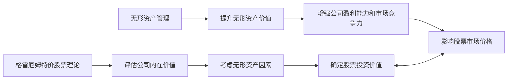

# 格雷厄姆特价股票理论对公司无形资产管理的影响

> 关键词：格雷厄姆特价股票理论、无形资产管理、公司价值、财务分析、市场效率

> 摘要：本文旨在深入探讨格雷厄姆特价股票理论对公司无形资产管理的影响。首先介绍了格雷厄姆特价股票理论的背景和核心概念，接着分析了无形资产在公司价值中的重要地位。通过阐述格雷厄姆理论的核心算法和数学模型，探讨其如何影响公司对无形资产管理的决策。结合项目实战案例，展示该理论在实际中的应用。同时，探讨了其在不同实际场景中的作用，并推荐了相关的学习资源、开发工具和研究论文。最后总结了未来发展趋势与挑战，以及常见问题的解答和扩展阅读资料。整体上，通过全面的分析揭示了格雷厄姆特价股票理论与公司无形资产管理之间的内在联系和深远影响。

## 1. 背景介绍 
### 1.1 目的和范围
本研究的目的在于系统地探究格雷厄姆特价股票理论对公司无形资产管理的具体影响。随着经济的发展，无形资产在公司价值创造中的作用日益凸显，而格雷厄姆特价股票理论作为价值投资的经典理论，其对公司财务和投资决策有着广泛的影响。我们将研究范围界定在探讨该理论如何影响公司对无形资产的评估、管理策略以及无形资产在公司整体价值中的体现等方面。通过深入分析，为公司管理者、投资者以及相关研究人员提供有价值的参考，帮助他们更好地理解无形资产的管理和公司价值的关系。

### 1.2 预期读者
本文预期读者包括公司的高级管理人员，如CEO、CFO等，他们需要在公司战略层面做出关于无形资产管理的决策；专业投资者，包括股票投资者、基金经理等，他们关注公司的价值和投资潜力；学术研究人员，对价值投资理论和无形资产研究领域感兴趣；以及相关专业的学生，如金融、会计、管理等专业的学生，希望通过本文深入了解相关理论和实践应用。

### 1.3 文档结构概述
本文将按照以下结构展开：首先介绍格雷厄姆特价股票理论和无形资产管理的背景知识和相关术语；接着阐述核心概念和它们之间的联系，并通过流程图展示；然后讲解格雷厄姆理论的核心算法原理和具体操作步骤，同时给出数学模型和公式；之后通过项目实战案例详细说明该理论在无形资产管理中的应用；再探讨其在实际场景中的应用；推荐相关的学习资源、开发工具和研究论文；总结未来发展趋势与挑战；最后提供常见问题的解答和扩展阅读资料。

### 1.4 术语表
#### 1.4.1 核心术语定义
- **格雷厄姆特价股票理论**：由本杰明·格雷厄姆提出的一种价值投资理论，该理论认为股票存在内在价值，当股票价格低于其内在价值时，股票被视为特价股票，具有投资价值。
- **无形资产**：指企业拥有或者控制的没有实物形态的可辨认非货币性资产，如专利、商标、品牌、技术诀窍、客户关系等。
- **公司价值**：公司的整体价值，包括有形资产价值和无形资产价值，是投资者评估公司投资潜力的重要指标。

#### 1.4.2 相关概念解释
- **价值投资**：一种投资策略，强调通过分析公司的基本面，寻找被市场低估的股票进行投资，以获取长期的投资回报。
- **内在价值**：股票所代表的公司的真实价值，是基于公司的财务状况、经营业绩、发展前景等因素综合评估得出的价值。

#### 1.4.3 缩略词列表
- **DCF**：Discounted Cash Flow，折现现金流，一种用于评估资产价值的方法。
- **ROE**：Return on Equity，净资产收益率，衡量公司盈利能力的指标。

## 2. 核心概念与联系 
### 2.1 格雷厄姆特价股票理论核心概念
格雷厄姆特价股票理论的核心在于寻找被市场低估的股票。该理论认为，股票的市场价格会受到各种短期因素的影响而波动，但股票存在一个基于公司基本面的内在价值。当市场价格低于内在价值时，股票就被认为是特价股票，投资者可以通过购买这些股票获得潜在的收益。格雷厄姆通过对公司的财务报表进行深入分析，如资产负债表、利润表等，来评估公司的内在价值。他关注公司的账面价值、盈利能力、股息政策等因素，以此作为判断股票是否被低估的依据。

### 2.2 无形资产管理核心概念
无形资产是公司的重要资产组成部分，对公司的长期发展和竞争优势具有关键作用。无形资产管理涉及到无形资产的识别、评估、保护、开发和利用等多个环节。有效的无形资产管理可以提高公司的品牌知名度、技术创新能力、客户忠诚度等，从而提升公司的整体价值。例如，一个具有强大品牌的公司可以在市场上获得更高的产品价格和市场份额，一个拥有先进技术专利的公司可以在行业中保持领先地位。

### 2.3 两者联系
格雷厄姆特价股票理论和无形资产管理之间存在着密切的联系。一方面，格雷厄姆理论在评估公司内在价值时，需要考虑无形资产的因素。如果公司拥有强大的品牌、先进的技术等无形资产，这些资产会增加公司的内在价值，从而影响股票的投资价值。另一方面，无形资产管理的效果也会影响公司的财务状况和市场表现，进而影响股票的市场价格。如果公司能够有效地管理无形资产，提升其价值，那么公司的盈利能力和市场竞争力会增强，股票价格也可能随之上涨。

### 2.4 文本示意图
格雷厄姆特价股票理论和无形资产管理的联系可以用以下示意图表示：

格雷厄姆特价股票理论 -> 评估公司内在价值 -> 考虑无形资产因素 -> 确定股票投资价值
无形资产管理 -> 提升无形资产价值 -> 增强公司盈利能力和市场竞争力 -> 影响股票市场价格

### 2.5 Mermaid 流程图


## 3. 核心算法原理 & 具体操作步骤 
### 3.1 格雷厄姆评估内在价值的算法原理
格雷厄姆提出了多种评估股票内在价值的方法，其中一种较为经典的方法是基于公司的盈利和资产情况。其基本思想是，股票的内在价值应该与公司的盈利能力和资产价值相关。以下是一个简化的算法原理：

假设公司的每股收益为 $EPS$，每股净资产为 $BVPS$，格雷厄姆认为股票的内在价值 $V$ 可以通过以下公式估算：

$V = EPS \times (8.5 + 2g) + BVPS \times k$

其中，$g$ 是公司预计的长期增长率，$k$ 是一个与资产质量相关的系数。

### 3.2 具体操作步骤
#### 3.2.1 数据收集
首先，需要收集公司的财务报表数据，包括资产负债表、利润表等。从资产负债表中获取每股净资产 $BVPS$，从利润表中获取每股收益 $EPS$。同时，需要对公司的行业前景、市场竞争等情况进行分析，以估算公司的长期增长率 $g$。

#### 3.2.2 确定系数
根据公司的资产质量和行业特点，确定系数 $k$。一般来说，资产质量较好、行业稳定性较高的公司，$k$ 值可以相对较大。

#### 3.2.3 计算内在价值
将收集到的数据和确定的系数代入上述公式，计算股票的内在价值 $V$。

#### 3.2.4 比较市场价格和内在价值
将计算得到的内在价值 $V$ 与股票的市场价格 $P$ 进行比较。如果 $P < V$，则股票被认为是特价股票，具有投资价值。

### 3.3 Python 源代码实现
```python
def graham_intrinsic_value(eps, g, bvps, k):
    """
    计算格雷厄姆方法下的股票内在价值
    :param eps: 每股收益
    :param g: 预计长期增长率
    :param bvps: 每股净资产
    :param k: 资产质量相关系数
    :return: 股票内在价值
    """
    return eps * (8.5 + 2 * g) + bvps * k

# 示例数据
eps = 2.0
g = 0.05
bvps = 10.0
k = 0.8

# 计算内在价值
intrinsic_value = graham_intrinsic_value(eps, g, bvps, k)
print(f"股票的内在价值为: {intrinsic_value}")
```

### 3.4 考虑无形资产的调整
在上述算法中，并没有直接考虑无形资产的因素。实际上，无形资产会对公司的盈利能力和资产价值产生影响。可以对上述算法进行调整，例如，可以根据公司无形资产的价值和质量，对 $g$ 和 $k$ 进行调整。如果公司拥有强大的品牌、先进的技术等无形资产，可以适当提高 $g$ 值，以反映无形资产对公司未来增长的促进作用；同时，可以提高 $k$ 值，以体现无形资产对资产质量的提升。

```python
def graham_intrinsic_value_with_intangible(eps, g, bvps, k, intangible_factor):
    """
    考虑无形资产因素的格雷厄姆股票内在价值计算
    :param eps: 每股收益
    :param g: 预计长期增长率
    :param bvps: 每股净资产
    :param k: 资产质量相关系数
    :param intangible_factor: 无形资产调整因子
    :return: 股票内在价值
    """
    adjusted_g = g * (1 + intangible_factor)
    adjusted_k = k * (1 + intangible_factor)
    return eps * (8.5 + 2 * adjusted_g) + bvps * adjusted_k

# 示例数据
eps = 2.0
g = 0.05
bvps = 10.0
k = 0.8
intangible_factor = 0.2

# 计算内在价值
intrinsic_value_with_intangible = graham_intrinsic_value_with_intangible(eps, g, bvps, k, intangible_factor)
print(f"考虑无形资产后股票的内在价值为: {intrinsic_value_with_intangible}")
```

## 4. 数学模型和公式 & 详细讲解 & 举例说明 
### 4.1 格雷厄姆内在价值公式详解
#### 4.1.1 公式回顾
$V = EPS \times (8.5 + 2g) + BVPS \times k$

#### 4.1.2 各参数含义
- **$EPS$（Earnings Per Share）**：每股收益，反映了公司每股股票的盈利水平。它是公司净利润除以发行在外的普通股股数得到的结果。每股收益越高，说明公司的盈利能力越强。
- **$8.5$**：这是格雷厄姆根据历史数据和经验确定的一个常数，代表了在没有增长情况下的市盈率倍数。
- **$g$**：公司预计的长期增长率，通常以百分比表示。它反映了公司未来的发展潜力。增长率越高，说明公司的发展前景越好。
- **$BVPS$（Book Value Per Share）**：每股净资产，是公司净资产除以发行在外的普通股股数得到的结果。每股净资产反映了公司每股股票所代表的实际资产价值。
- **$k$**：与资产质量相关的系数，取值范围一般在 0 到 1 之间。$k$ 值越大，说明公司的资产质量越好。

#### 4.1.3 公式原理
该公式的基本思想是，股票的内在价值由两部分组成：一部分是基于公司盈利能力的价值，通过每股收益乘以一个与增长率相关的市盈率倍数来计算；另一部分是基于公司资产价值的部分，通过每股净资产乘以资产质量系数来计算。

### 4.2 考虑无形资产的数学模型调整
#### 4.2.1 调整原理
无形资产会对公司的盈利能力和资产质量产生影响。因此，在计算内在价值时，需要对原公式中的参数进行调整。可以引入一个无形资产调整因子 $\alpha$，对 $g$ 和 $k$ 进行调整。

调整后的公式为：

$V' = EPS \times (8.5 + 2g(1 + \alpha)) + BVPS \times k(1 + \alpha)$

其中，$\alpha$ 是无形资产调整因子，根据公司无形资产的价值和质量确定。

#### 4.2.2 举例说明
假设一家公司的每股收益 $EPS = 3$ 元，预计长期增长率 $g = 0.06$，每股净资产 $BVPS = 15$ 元，资产质量系数 $k = 0.7$。不考虑无形资产时，根据原公式计算的内在价值为：

$V = 3 \times (8.5 + 2 \times 0.06) + 15 \times 0.7$
$= 3 \times (8.5 + 0.12) + 10.5$
$= 3 \times 8.62 + 10.5$
$= 25.86 + 10.5$
$= 36.36$（元）

如果该公司拥有一项重要的专利技术，经过评估，确定无形资产调整因子 $\alpha = 0.2$。则考虑无形资产后，调整后的内在价值为：

$V' = 3 \times (8.5 + 2 \times 0.06 \times (1 + 0.2)) + 15 \times 0.7 \times (1 + 0.2)$
$= 3 \times (8.5 + 2 \times 0.06 \times 1.2) + 15 \times 0.7 \times 1.2$
$= 3 \times (8.5 + 0.144) + 12.6$
$= 3 \times 8.644 + 12.6$
$= 25.932 + 12.6$
$= 38.532$（元）

可以看到，考虑无形资产后，公司的内在价值有所增加，这反映了无形资产对公司价值的提升作用。

## 5. 项目实战：代码实际案例和详细解释说明 
### 5.1  开发环境搭建
#### 5.1.1 编程语言选择
本项目选择 Python 作为开发语言，因为 Python 具有丰富的库和工具，适合进行数据分析和财务计算。

#### 5.1.2 开发环境安装
- **Python 安装**：从 Python 官方网站（https://www.python.org/downloads/）下载并安装 Python 3.x 版本。
- **集成开发环境（IDE）**：可以选择 PyCharm、Jupyter Notebook 等。这里以 Jupyter Notebook 为例，通过 Anaconda 安装。Anaconda 是一个用于科学计算的 Python 发行版，包含了 Jupyter Notebook 等常用工具。从 Anaconda 官方网站（https://www.anaconda.com/products/individual）下载并安装 Anaconda。

#### 5.1.3 必要库安装
在命令行中使用以下命令安装必要的库：
```sh
pip install pandas numpy matplotlib
```
- **pandas**：用于数据处理和分析。
- **numpy**：用于数值计算。
- **matplotlib**：用于数据可视化。

### 5.2  源代码详细实现和代码解读
#### 5.2.1 数据获取和处理
```python
import pandas as pd

# 模拟从文件中读取公司财务数据
data = {
    'EPS': [2.5, 2.8, 3.0, 3.2],
    'BVPS': [12.0, 13.0, 14.0, 15.0],
    'GrowthRate': [0.05, 0.06, 0.07, 0.08],
    'AssetQualityCoefficient': [0.7, 0.75, 0.8, 0.85]
}
df = pd.DataFrame(data)

# 假设无形资产调整因子为 0.15
intangible_factor = 0.15

# 定义计算内在价值的函数
def graham_intrinsic_value_with_intangible(eps, g, bvps, k, intangible_factor):
    adjusted_g = g * (1 + intangible_factor)
    adjusted_k = k * (1 + intangible_factor)
    return eps * (8.5 + 2 * adjusted_g) + bvps * adjusted_k

# 计算每一年的内在价值
df['IntrinsicValue'] = df.apply(lambda row: graham_intrinsic_value_with_intangible(
    row['EPS'], row['GrowthRate'], row['BVPS'], row['AssetQualityCoefficient'], intangible_factor), axis=1)

print(df)
```
**代码解读**：
- 首先，我们使用 `pandas` 库创建一个包含公司财务数据的 DataFrame，包括每股收益（`EPS`）、每股净资产（`BVPS`）、预计长期增长率（`GrowthRate`）和资产质量系数（`AssetQualityCoefficient`）。
- 然后，定义了无形资产调整因子 `intangible_factor`。
- 接着，定义了 `graham_intrinsic_value_with_intangible` 函数，用于计算考虑无形资产后的股票内在价值。
- 最后，使用 `apply` 方法对 DataFrame 中的每一行数据应用该函数，计算出每一年的内在价值，并将结果添加到 DataFrame 中。

#### 5.2.2 数据可视化
```python
