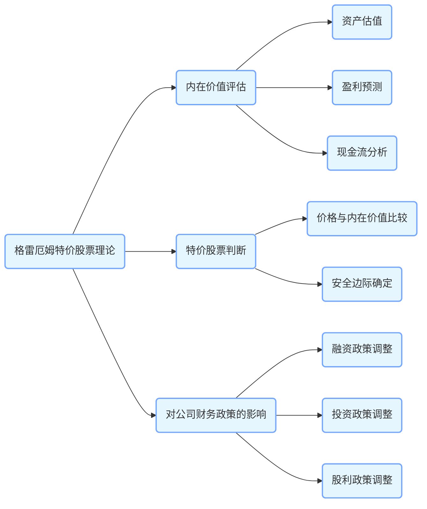

# 格雷厄姆特价股票理论对公司财务政策的影响

> 关键词：格雷厄姆特价股票理论、公司财务政策、价值投资、股票定价、财务决策

> 摘要：本文深入探讨了格雷厄姆特价股票理论对公司财务政策的影响。首先介绍了该理论的背景及相关概念，阐述其核心原理与架构。接着详细分析了理论背后的算法原理，并给出Python代码示例。通过数学模型和公式进一步解释理论本质，并举例说明。在项目实战部分，展示了代码实现和解读。同时探讨了该理论在实际中的应用场景，推荐了学习、开发工具及相关论文著作。最后总结了未来发展趋势与挑战，解答常见问题并提供扩展阅读资料。旨在帮助读者全面理解格雷厄姆特价股票理论如何作用于公司财务政策，为相关研究和实践提供参考。

## 1. 背景介绍 
### 1.1 目的和范围
本研究旨在深入剖析格雷厄姆特价股票理论对公司财务政策的具体影响。通过对该理论的核心概念、算法原理、数学模型等方面的研究，结合实际案例，探讨公司在面对这一理论所带来的市场影响时，如何调整财务政策以适应市场环境，实现公司价值最大化。研究范围涵盖了格雷厄姆特价股票理论的基本原理、公司财务政策的各个方面（如融资政策、投资政策、股利政策等）以及两者之间的相互关系。

### 1.2 预期读者
本文的预期读者包括金融领域的研究者、公司财务管理人员、投资者以及对价值投资和公司财务政策感兴趣的人士。对于研究者而言，本文可以为其进一步的学术研究提供理论和实践参考；公司财务管理人员可以从中获取有关如何根据市场理论调整公司财务政策的启示；投资者可以了解该理论对公司价值的影响，从而做出更明智的投资决策。

### 1.3 文档结构概述
本文将按照以下结构展开：首先介绍格雷厄姆特价股票理论及相关财务政策的核心概念，并通过文本示意图和Mermaid流程图展示其联系；接着详细阐述核心算法原理，并用Python代码实现；通过数学模型和公式深入解释理论本质，并举例说明；在项目实战部分，进行开发环境搭建，给出源代码实现和详细解读；探讨该理论在实际中的应用场景；推荐学习、开发工具及相关论文著作；最后总结未来发展趋势与挑战，解答常见问题并提供扩展阅读资料。

### 1.4 术语表
#### 1.4.1 核心术语定义
- **格雷厄姆特价股票理论**：由本杰明·格雷厄姆提出的一种价值投资理论，该理论认为股票存在内在价值，当股票价格低于其内在价值一定程度时，该股票即为特价股票，具有投资价值。
- **公司财务政策**：公司为实现其财务目标而制定的一系列决策和措施，包括融资政策、投资政策、股利政策等。
- **内在价值**：股票所代表的公司的真实价值，通常通过对公司的资产、盈利、现金流等因素进行分析计算得出。

#### 1.4.2 相关概念解释
- **价值投资**：一种投资策略，强调通过分析公司的基本面，寻找被市场低估的股票进行投资，以获取长期的投资回报。
- **财务杠杆**：公司使用债务融资的程度，通过债务与权益的比例来衡量。合理的财务杠杆可以提高公司的股东权益回报率，但也会增加公司的财务风险。
- **资本成本**：公司为筹集和使用资金而付出的代价，包括债务成本和权益成本。资本成本是公司进行投资决策和融资决策的重要参考指标。

#### 1.4.3 缩略词列表
- **NPV**：净现值（Net Present Value），用于评估投资项目的价值，是投资项目未来现金流量的现值减去初始投资成本后的余额。
- **ROE**：净资产收益率（Return on Equity），反映公司运用自有资本的效率，是净利润与股东权益的比率。
- **P/E**：市盈率（Price-to-Earnings Ratio），是股票价格与每股收益的比率，用于衡量股票的估值水平。

## 2. 核心概念与联系 
### 核心概念原理
格雷厄姆特价股票理论的核心是股票的内在价值。格雷厄姆认为，股票的价格会围绕其内在价值波动，但市场往往会出现非理性的情况，导致股票价格偏离其内在价值。当股票价格低于内在价值一定程度时，该股票就成为了特价股票，投资者可以以较低的价格买入，等待价格回归内在价值时获得收益。

公司财务政策则是公司为实现其财务目标而制定的一系列决策和措施。融资政策决定了公司如何筹集资金，包括股权融资和债务融资的比例；投资政策决定了公司将资金投向哪些项目；股利政策则决定了公司将多少利润分配给股东，多少留存用于再投资。

### 架构的文本示意图
```plaintext
格雷厄姆特价股票理论
|
|-- 内在价值评估
|   |-- 资产估值
|   |-- 盈利预测
|   |-- 现金流分析
|
|-- 特价股票判断
|   |-- 价格与内在价值比较
|   |-- 安全边际确定
|
|-- 对公司财务政策的影响
|   |-- 融资政策调整
|   |-- 投资政策调整
|   |-- 股利政策调整
```

### Mermaid 流程图


## 3. 核心算法原理 & 具体操作步骤 
### 内在价值评估算法原理
内在价值的评估方法有多种，其中一种常用的方法是基于盈利的估值方法，即通过预测公司未来的盈利，并将其折现到当前来计算内在价值。具体步骤如下：
1. **预测未来盈利**：根据公司的历史财务数据、行业发展趋势等因素，预测公司未来若干年的每股收益（EPS）。
2. **确定折现率**：折现率反映了投资者对资金时间价值和风险的要求。通常可以使用资本资产定价模型（CAPM）来确定折现率。
3. **计算未来盈利的现值**：将预测的未来每股收益按照折现率折现到当前，得到未来盈利的现值。
4. **计算内在价值**：将未来盈利的现值相加，再加上公司的净资产，得到股票的内在价值。

### Python 代码实现
```python
import numpy as np

def calculate_intrinsic_value(eps_forecast, discount_rate, book_value):
    """
    计算股票的内在价值
    :param eps_forecast: 未来若干年的每股收益预测值列表
    :param discount_rate: 折现率
    :param book_value: 公司的净资产
    :return: 股票的内在价值
    """
    num_years = len(eps_forecast)
    present_values = []
    for i in range(num_years):
        present_value = eps_forecast[i] / ((1 + discount_rate) ** (i + 1))
        present_values.append(present_value)
    total_present_value = sum(present_values)
    intrinsic_value = total_present_value + book_value
    return intrinsic_value

# 示例数据
eps_forecast = [2.0, 2.2, 2.4, 2.6, 2.8]
discount_rate = 0.1
book_value = 10.0

intrinsic_value = calculate_intrinsic_value(eps_forecast, discount_rate, book_value)
print(f"股票的内在价值为: {intrinsic_value}")
```
### 代码解释
- `eps_forecast`：表示未来若干年的每股收益预测值列表。
- `discount_rate`：表示折现率，反映了投资者对资金时间价值和风险的要求。
- `book_value`：表示公司的净资产。
- 函数 `calculate_intrinsic_value` 首先计算未来每股收益的现值，然后将这些现值相加，最后加上公司的净资产，得到股票的内在价值。

### 特价股票判断算法原理
特价股票的判断主要基于股票价格与内在价值的比较。当股票价格低于内在价值一定比例时，认为该股票是特价股票。这个比例通常被称为安全边际。安全边际的大小取决于投资者的风险偏好和市场情况。

### Python 代码实现
```python
def is_bargain_stock(stock_price, intrinsic_value, safety_margin):
    """
    判断股票是否为特价股票
    :param stock_price: 股票当前价格
    :param intrinsic_value: 股票的内在价值
    :param safety_margin: 安全边际
    :return: 如果是特价股票返回 True，否则返回 False
    """
    threshold = intrinsic_value * (1 - safety_margin)
    if stock_price < threshold:
        return True
    return False

# 示例数据
stock_price = 12.0
safety_margin = 0.2

is_bargain = is_bargain_stock(stock_price, intrinsic_value, safety_margin)
print(f"该股票是否为特价股票: {is_bargain}")
```
### 代码解释
- `stock_price`：表示股票当前的价格。
- `intrinsic_value`：表示股票的内在价值。
- `safety_margin`：表示安全边际，即股票价格低于内在价值的比例。
- 函数 `is_bargain_stock` 首先计算出一个阈值，即内在价值乘以（1 - 安全边际），然后将股票价格与该阈值进行比较，如果股票价格低于阈值，则认为该股票是特价股票，返回 `True`，否则返回 `False`。

## 4. 数学模型和公式 & 详细讲解 & 举例说明 
### 内在价值评估的数学模型和公式
基于盈利的内在价值评估模型可以用以下公式表示：
$$
V = \sum_{i=1}^{n} \frac{EPS_i}{(1 + r)^i} + BV
$$
其中：
- $V$ 表示股票的内在价值；
- $EPS_i$ 表示第 $i$ 年的每股收益预测值；
- $r$ 表示折现率；
- $n$ 表示预测的年数；
- $BV$ 表示公司的净资产。

### 详细讲解
这个公式的含义是将未来 $n$ 年的每股收益预测值按照折现率 $r$ 折现到当前，得到未来盈利的现值，然后将这些现值相加，再加上公司的净资产，就得到了股票的内在价值。折现率 $r$ 反映了投资者对资金时间价值和风险的要求，$r$ 越大，未来盈利的现值就越小，股票的内在价值也就越低。

### 举例说明
假设某公司的净资产为 10 元，未来 5 年的每股收益预测值分别为 2 元、2.2 元、2.4 元、2.6 元、2.8 元，折现率为 10%。则该股票的内在价值计算如下：
- 第 1 年每股收益的现值：$\frac{2}{(1 + 0.1)^1} \approx 1.82$ 元
- 第 2 年每股收益的现值：$\frac{2.2}{(1 + 0.1)^2} \approx 1.82$ 元
- 第 3 年每股收益的现值：$\frac{2.4}{(1 + 0.1)^3} \approx 1.81$ 元
- 第 4 年每股收益的现值：$\frac{2.6}{(1 + 0.1)^4} \approx 1.77$ 元
- 第 5 年每股收益的现值：$\frac{2.8}{(1 + 0.1)^5} \approx 1.74$ 元
- 未来盈利的现值总和：$1.82 + 1.82 + 1.81 + 1.77 + 1.74 = 9.96$ 元
- 股票的内在价值：$9.96 + 10 = 19.96$ 元

### 特价股票判断的数学模型和公式
特价股票的判断公式可以表示为：
$$
P < V \times (1 - m)
$$
其中：
- $P$ 表示股票的当前价格；
- $V$ 表示股票的内在价值；
- $m$ 表示安全边际。

### 详细讲解
这个公式的含义是当股票的当前价格 $P$ 低于内在价值 $V$ 乘以（1 - 安全边际 $m$）时，认为该股票是特价股票。安全边际 $m$ 反映了投资者对风险的承受能力，$m$ 越大，投资者要求的价格折扣就越大，对股票的安全性要求也就越高。

### 举例说明
假设某股票的内在价值为 20 元，安全边际为 20%，则阈值为 $20 \times (1 - 0.2) = 16$ 元。如果该股票的当前价格为 15 元，因为 $15 < 16$，所以该股票是特价股票。

## 5. 项目实战：代码实际案例和详细解释说明 
### 5.1  开发环境搭建
- **Python 安装**：确保你的系统已经安装了 Python 3.x 版本。可以从 Python 官方网站（https://www.python.org/downloads/）下载并安装。
- **IDE 选择**：推荐使用 PyCharm 作为开发环境，它是一款功能强大的 Python 集成开发环境，提供了代码编辑、调试、自动完成等丰富的功能。可以从 JetBrains 官方网站（https://www.jetbrains.com/pycharm/download/）下载并安装。
- **依赖库安装**：本项目需要使用 `numpy` 库进行数值计算。可以使用以下命令进行安装：
```sh
pip install numpy
```

### 5.2  源代码详细实现和代码解读
```python
import numpy as np

def calculate_intrinsic_value(eps_forecast, discount_rate, book_value):
    """
    计算股票的内在价值
    :param eps_forecast: 未来若干年的每股收益预测值列表
    :param discount_rate: 折现率
    :param book_value: 公司的净资产
    :return: 股票的内在价值
    """
    num_years = len(eps_forecast)
    present_values = []
    for i in range(num_years):
        present_value = eps_forecast[i] / ((1 + discount_rate) ** (i + 1))
        present_values.append(present_value)
    total_present_value = sum(present_values)
    intrinsic_value = total_present_value + book_value
    return intrinsic_value

def is_bargain_stock(stock_price, intrinsic_value, safety_margin):
    """
    判断股票是否为特价股票
    :param stock_price: 股票当前价格
    :param intrinsic_value: 股票的内在价值
    :param safety_margin: 安全边际
    :return: 如果是特价股票返回 True，否则返回 False
    """
    threshold = intrinsic_value * (1 - safety_margin)
    if stock_price < threshold:
        return True
    return False

# 示例数据
eps_forecast = [2.0, 2.2, 2.4, 2.6, 2.8]
discount_rate = 0.1
book_value = 10.0
stock_price = 12.0
safety_margin = 0.2

# 计算内在价值
intrinsic_value = calculate_intrinsic_value(eps_forecast, discount_rate, book_value)
print(f"股票的内在价值为: {intrinsic_value}")

# 判断是否为特价股票
is_bargain = is_bargain_stock(stock_price, intrinsic_value, safety_margin)
print(f"该股票是否为特价股票: {is_bargain}")
```
### 代码解读
- **`calculate_intrinsic_value` 函数**：该函数用于计算股票的内在价值。首先，获取未来每股收益预测值的数量，然后通过循环计算每年每股收益的现值，并将其添加到 `present_values` 列表中。最后，将所有现值相加，再加上公司的净资产，得到股票的内在价值。
- **`is_bargain_stock` 函数**：该函数用于判断股票是否为特价股票。首先，根据内在价值和安全边际计算阈值，然后将股票当前价格与阈值进行比较，如果股票价格低于阈值，则返回 `True`，否则返回 `False`。
- **主程序**：定义了示例数据，包括未来每股收益预测值、折现率、公司净资产、股票当前价格和安全边际。调用 `calculate_intrinsic_value` 函数计算股票的内在价值，并将结果打印输出。然后调用 `is_bargain_stock` 函数判断该股票是否为特价股票，并将结果打印输出。

### 5.3  代码解读与分析
通过上述代码，我们可以根据公司的财务数据和市场情况，计算股票的内在价值，并判断该股票是否为特价股票。代码的关键在于对未来每股收益的预测和折现率的确定。未来每股收益的预测需要综合考虑公司的历史业绩、行业发展趋势、宏观经济环境等因素；折现率的确定则需要考虑投资者的风险偏好和市场利率水平。

在实际应用中，我们可以根据不同的公司和市场情况，调整未来每股收益预测值、折现率和安全边际等参数，以更准确地评估股票的内在价值和判断是否为特价股票。

## 6. 实际应用场景 
### 投资者决策
投资者可以使用格雷厄姆特价股票理论来筛选具有投资价值的股票。通过计算股票的内在价值，并与当前市场价格进行比较，投资者可以找到被市场低估的特价股票进行投资。当股票价格回归内在价值时，投资者可以获得丰厚的回报。例如，在市场低迷时期，很多股票的价格可能会低于其内在价值，此时投资者可以运用该理论寻找特价股票，进行长期投资。

### 公司融资决策
公司在制定融资政策时，需要考虑市场对公司股票的估值。如果公司的股票被市场低估，即存在特价股票的情况，公司可能会选择减少股权融资，因为此时发行股票会稀释现有股东的权益。相反，公司可以考虑增加债务融资，以降低融资成本。例如，一家公司的股票内在价值为 20 元，但市场价格仅为 15 元，此时公司如果进行股权融资，会以较低的价格发行股票，对现有股东不利。因此，公司可以选择通过发行债券等方式进行债务融资。

### 公司投资决策
公司在进行投资决策时，也可以参考格雷厄姆特价股票理论。如果公司发现市场上存在被低估的资产或项目，即具有较高的内在价值但价格较低，公司可以考虑进行投资。例如，一家公司发现另一家同行业公司的股票被市场低估，且该公司具有良好的发展前景和资产质量，那么这家公司可以考虑收购该公司的股票，以实现资源的整合和协同效应。

### 公司股利政策决策
公司的股利政策也会受到格雷厄姆特价股票理论的影响。如果公司的股票被市场低估，公司可以选择减少股利分配，将更多的利润留存用于再投资，以提高公司的内在价值。当股票价格回归内在价值时，股东可以获得更高的回报。例如，一家公司的股票内在价值为 30 元，但市场价格仅为 20 元，公司可以选择将原本用于股利分配的资金用于扩大生产、研发新产品等项目，以提高公司的盈利能力和内在价值。

## 7. 工具和资源推荐
### 7.1 学习资源推荐
#### 7.1.1 书籍推荐
- 《聪明的投资者》（The Intelligent Investor）：本杰明·格雷厄姆的经典著作，被誉为价值投资的圣经。书中详细阐述了格雷厄姆的投资理念和方法，包括特价股票理论的核心思想。
- 《证券分析》（Security Analysis）：同样是本杰明·格雷厄姆的重要著作，对证券的价值分析和投资策略进行了深入探讨，是学习价值投资和公司财务分析的必读之书。
- 《财务报表分析与证券定价》（Financial Statement Analysis and Security Valuation）：这本书结合了财务报表分析和证券定价的理论与方法，帮助读者理解如何通过分析公司的财务报表来评估股票的内在价值。

#### 7.1.2 在线课程
- Coursera 平台上的“投资学原理”（Principles of Investment）课程：该课程由知名高校的教授授课，涵盖了投资学的基本原理和方法，包括价值投资的相关内容。
- edX 平台上的“公司财务”（Corporate Finance）课程：课程主要介绍公司财务的基本概念和决策方法，对于理解公司财务政策的制定和调整具有重要帮助。
- 中国大学 MOOC 平台上的“财务报表分析”课程：该课程详细讲解了财务报表的分析方法和技巧，有助于学习者掌握如何通过财务报表评估公司的价值。

#### 7.1.3 技术博客和网站
- 雪球网（https://xueqiu.com/）：国内知名的投资社区，提供股票、基金等金融产品的资讯、分析和讨论。投资者可以在雪球网上获取各种价值投资的观点和案例。
- Seeking Alpha（https://seekingalpha.com/）：国外著名的金融分析网站，汇聚了众多专业投资者和分析师的文章和观点，对于学习价值投资和了解市场动态具有重要参考价值。
- 价值漫步（https://www.jianshu.com/u/7c7d18319d1f）：一个专注于价值投资的技术博客，作者分享了很多关于价值投资的理论、方法和实践经验。

### 7.2 开发工具框架推荐
#### 7.2.1 IDE和编辑器
- PyCharm：功能强大的 Python 集成开发环境，提供了代码编辑、调试、自动完成等丰富的功能，适合开发各种 Python 项目。
- Jupyter Notebook：一个交互式的开发环境，支持多种编程语言，特别适合进行数据分析和模型验证。可以在 Jupyter Notebook 中快速编写和运行 Python 代码，并可视化结果。
- Visual Studio Code：一款轻量级的代码编辑器，支持多种编程语言和插件扩展。通过安装 Python 相关的插件，Visual Studio Code 可以成为一个强大的 Python 开发工具。

#### 7.2.2 调试和性能分析工具
- PySnooper：一个简单易用的 Python 调试工具，可以自动记录函数的执行过程和变量的值，帮助开发者快速定位问题。
- cProfile：Python 内置的性能分析工具，可以统计函数的执行时间和调用次数，帮助开发者找出性能瓶颈。
- line_profiler：一个可以逐行分析 Python 代码性能的工具，通过它可以详细了解每行代码的执行时间，从而进行针对性的优化。

#### 7.2.3 相关框架和库
- Pandas：一个强大的数据分析库，提供了高效的数据结构和数据处理工具，适合进行财务数据的分析和处理。
- NumPy：Python 的数值计算库，提供了多维数组和各种数学函数，用于进行数值计算和科学计算。
- Scikit-learn：一个常用的机器学习库，提供了各种机器学习算法和工具，可用于股票价格预测、公司价值评估等方面的建模。

### 7.3 相关论文著作推荐
#### 7.3.1 经典论文
- “The Theory of Investment Value” by John Burr Williams：该论文提出了股利折现模型，是价值投资理论的重要基础之一。
- “Security Analysis” by Benjamin Graham and David Dodd：这是格雷厄姆和多德的经典论文，系统地阐述了证券分析的方法和原则，对价值投资理论的发展产生了深远影响。
- “Capital Asset Pricing Model: A Theory of Market Equilibrium under Conditions of Risk” by William F. Sharpe：该论文提出了资本资产定价模型（CAPM），为计算折现率提供了重要的理论依据。

#### 7.3.2 最新研究成果
- 近年来，学术界对于价值投资和公司财务政策的研究不断深入。一些研究关注如何结合大数据和人工智能技术，提高股票内在价值评估的准确性；另一些研究探讨了宏观经济环境和市场情绪对公司财务政策的影响。可以通过学术数据库（如知网、万方、Web of Science 等）搜索相关的最新研究论文。

#### 7.3.3 应用案例分析
- 许多金融机构和研究机构会发布关于价值投资和公司财务政策的应用案例分析报告。例如，一些投资银行会对上市公司的财务报表进行分析，评估其股票的投资价值，并提出相应的投资建议。可以关注这些机构的官方网站或研究报告，获取实际应用案例的分析和经验。

## 8. 总结：未来发展趋势与挑战
### 未来发展趋势
- **与新技术融合**：随着大数据、人工智能和机器学习等技术的不断发展，格雷厄姆特价股票理论将与这些新技术深度融合。通过利用大数据分析公司的海量财务数据和市场信息，结合机器学习算法建立更准确的内在价值评估模型，提高特价股票筛选的效率和准确性。
- **宏观经济因素的考虑**：未来的研究将更加注重宏观经济因素对公司财务政策和股票价值的影响。例如，经济周期、利率变动、通货膨胀等因素会影响公司的盈利能力和市场估值，因此在评估股票内在价值和制定财务政策时，需要充分考虑这些宏观经济因素的变化。
- **国际化应用**：随着全球金融市场的一体化，格雷厄姆特价股票理论将在更广泛的国际市场得到应用。不同国家和地区的市场环境、法律法规和文化背景存在差异，因此需要对该理论进行适当的调整和优化，以适应不同市场的特点。

### 挑战
- **数据质量和可靠性**：准确的内在价值评估和特价股票筛选依赖于高质量的财务数据和市场信息。然而，现实中数据的质量和可靠性可能存在问题，例如财务报表造假、数据缺失等。如何获取准确、完整和可靠的数据是应用该理论面临的一个挑战。
- **市场不确定性**：金融市场充满了不确定性，股票价格受到多种因素的影响，包括宏观经济环境、政策变化、公司突发事件等。即使通过格雷厄姆特价股票理论筛选出了看似具有投资价值的股票，也不能保证其价格一定会回归内在价值。市场的不确定性增加了投资决策的难度和风险。
- **模型的局限性**：目前的内在价值评估模型和特价股票判断方法都存在一定的局限性。例如，基于盈利的估值模型假设未来盈利是可预测的，但实际情况中公司的盈利受到多种因素的影响，很难准确预测。如何改进和完善现有的模型，提高其适应性和准确性，是未来需要解决的问题。

## 9. 附录：常见问题与解答
### 问题 1：格雷厄姆特价股票理论是否适用于所有类型的股票？
解答：格雷厄姆特价股票理论主要适用于具有稳定经营业绩和可预测现金流的公司股票。对于一些新兴行业的成长型公司，由于其未来盈利的不确定性较大，很难准确评估其内在价值，因此该理论的适用性可能会受到一定限制。

### 问题 2：如何确定安全边际的大小？
解答：安全边际的大小取决于投资者的风险偏好和市场情况。一般来说，风险偏好较低的投资者会要求较高的安全边际，以降低投资风险。市场情况也会影响安全边际的确定，在市场波动较大或不确定性较高时，投资者通常会要求更高的安全边际。

### 问题 3：内在价值评估中折现率的确定有哪些方法？
解答：常见的折现率确定方法包括资本资产定价模型（CAPM）、加权平均资本成本（WACC）等。资本资产定价模型通过考虑市场风险溢价、无风险利率和股票的贝塔系数来计算折现率；加权平均资本成本则综合考虑了公司的债务成本和权益成本。

### 问题 4：公司的财务政策调整是否会影响股票的内在价值？
解答：公司的财务政策调整会对股票的内在价值产生影响。例如，合理的融资政策可以降低公司的资本成本，提高股东权益回报率；有效的投资政策可以增加公司的未来现金流，从而提高股票的内在价值；适当的股利政策可以吸引投资者，增强市场对公司的信心，也有助于提高股票的内在价值。

## 10. 扩展阅读 & 参考资料
### 扩展阅读
- 《巴菲特致股东的信：股份公司教程》（The Essays of Warren Buffett: Lessons for Corporate America）：这本书收集了巴菲特历年致股东的信，其中包含了许多关于价值投资和公司财务政策的宝贵经验和见解。
- 《怎样选择成长股》（Common Stocks and Uncommon Profits）：菲利普·费雪的经典著作，介绍了如何选择具有成长潜力的股票，与格雷厄姆的价值投资理论相互补充。
- 《金融炼金术》（The Alchemy of Finance）：乔治·索罗斯的著作，探讨了金融市场的运行规律和投资者的心理因素对市场的影响，对于理解市场的不确定性和投资风险具有重要意义。

### 参考资料
- Graham, B., & Dodd, D. L. (1934). Security Analysis. McGraw-Hill.
- Williams, J. B. (1938). The Theory of Investment Value. Harvard University Press.
- Sharpe, W. F. (1964). Capital Asset Prices: A Theory of Market Equilibrium under Conditions of Risk. The Journal of Finance, 19(3), 425-442.

作者：AI天才研究院/AI Genius Institute & 禅与计算机程序设计艺术 /Zen And The Art of Computer Programming