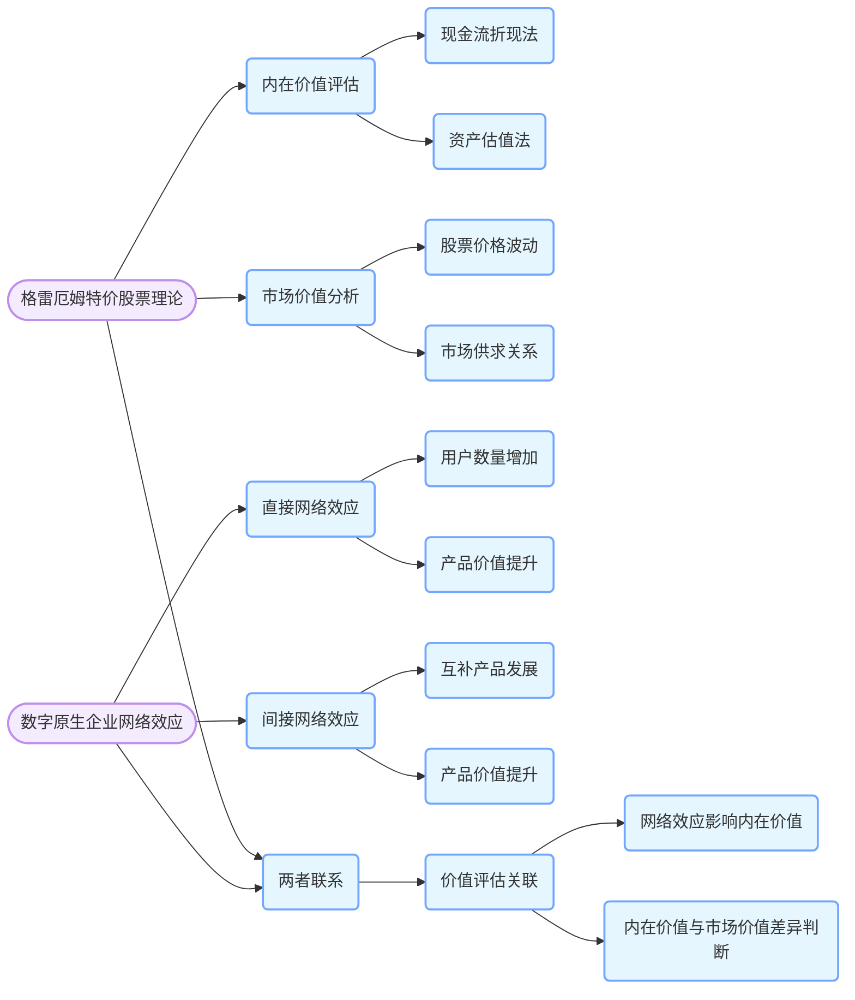

# 格雷厄姆特价股票理论对数字原生企业网络效应的启示

> 关键词：格雷厄姆特价股票理论、数字原生企业、网络效应、价值评估、市场策略

> 摘要：本文深入探讨了格雷厄姆特价股票理论与数字原生企业网络效应之间的关联。首先介绍了研究的背景、目的、预期读者等内容，阐述了相关核心概念及其联系。接着详细剖析了格雷厄姆特价股票理论的算法原理，并通过 Python 代码进行说明。同时，给出了相关的数学模型和公式，并举例解释。在项目实战部分，搭建开发环境，展示源代码并进行解读分析。之后探讨了数字原生企业网络效应的实际应用场景，推荐了学习资源、开发工具框架以及相关论文著作。最后总结了未来发展趋势与挑战，解答常见问题，并提供扩展阅读和参考资料，旨在为数字原生企业在市场竞争中运用网络效应提供有价值的启示。

## 1. 背景介绍 
### 1.1 目的和范围
本研究的主要目的是探究格雷厄姆特价股票理论如何为数字原生企业的网络效应发展提供有价值的启示。格雷厄姆特价股票理论作为价值投资领域的经典理论，强调寻找被市场低估的股票，通过深入分析企业的内在价值来获取投资收益。而数字原生企业以数字化技术为基础，其核心竞争力往往体现在网络效应上，即随着用户数量的增加，企业的价值呈指数级增长。通过将两者进行关联研究，我们希望能够为数字原生企业在市场竞争中如何评估自身价值、制定市场策略等方面提供新的思路和方法。

本研究的范围涵盖了格雷厄姆特价股票理论的核心内容、数字原生企业网络效应的特点和形成机制，以及两者之间的潜在联系。同时，通过实际案例分析和理论推导，探讨如何将格雷厄姆特价股票理论中的价值评估方法和投资策略应用到数字原生企业的网络效应发展中。

### 1.2 预期读者
本文预期读者主要包括数字原生企业的管理者、创业者、投资者，以及对价值投资和数字经济领域感兴趣的研究人员和学生。对于数字原生企业的管理者和创业者来说，了解格雷厄姆特价股票理论对网络效应的启示，有助于他们更好地评估企业的价值，制定合理的市场策略，提升企业的竞争力。投资者可以通过本文的研究，找到评估数字原生企业投资价值的新方法，提高投资决策的准确性。研究人员和学生则可以从理论和实践的结合中，深入了解价值投资和数字经济的交叉领域，拓宽研究视野。

### 1.3 文档结构概述
本文将按照以下结构展开：首先介绍研究的背景信息，包括目的、预期读者和文档结构概述等内容。接着阐述格雷厄姆特价股票理论和数字原生企业网络效应的核心概念及其联系，并通过文本示意图和 Mermaid 流程图进行直观展示。然后详细讲解格雷厄姆特价股票理论的核心算法原理，使用 Python 代码进行具体实现，并给出相关的数学模型和公式，通过举例进行说明。在项目实战部分，搭建开发环境，展示源代码并进行详细解读和分析。之后探讨数字原生企业网络效应的实际应用场景，推荐相关的学习资源、开发工具框架和论文著作。最后总结未来发展趋势与挑战，解答常见问题，并提供扩展阅读和参考资料。

### 1.4 术语表
#### 1.4.1 核心术语定义
- **格雷厄姆特价股票理论**：由本杰明·格雷厄姆提出的一种价值投资理论，该理论认为股票价格会围绕其内在价值上下波动，投资者可以通过寻找被市场低估的股票，以低于其内在价值的价格买入，等待价格回归价值时卖出，从而获取投资收益。
- **数字原生企业**：指从诞生之初就基于数字化技术开展业务的企业，其产品、服务和运营模式都高度依赖于数字技术，具有数据驱动、快速迭代、创新能力强等特点。
- **网络效应**：指当一种产品或服务的用户数量增加时，该产品或服务对其他用户的价值也随之增加的现象。网络效应可以分为直接网络效应和间接网络效应，直接网络效应是指用户数量的增加直接提高了产品或服务的价值，如社交网络；间接网络效应是指用户数量的增加通过促进互补产品或服务的发展，从而提高了产品或服务的价值，如操作系统和应用程序之间的关系。

#### 1.4.2 相关概念解释
- **内在价值**：指企业在未来持续经营过程中所产生的现金流的现值。内在价值是企业的真实价值，不受市场短期波动的影响。
- **市场价值**：指企业在股票市场上的总市值，即股票价格乘以发行在外的股份数。市场价值会受到市场供求关系、投资者情绪等因素的影响，可能会偏离企业的内在价值。
- **网络外部性**：与网络效应类似，指一种产品或服务的价值随着使用该产品或服务的用户数量的增加而增加的现象。网络外部性可以分为正网络外部性和负网络外部性，正网络外部性是指用户数量的增加提高了产品或服务的价值，负网络外部性是指用户数量的增加降低了产品或服务的价值，如交通拥堵。

#### 1.4.3 缩略词列表
- **DCF**：Discounted Cash Flow，现金流折现法，一种用于评估企业内在价值的方法，通过预测企业未来的现金流，并将其折现到当前时点，得到企业的内在价值。
- **MAU**：Monthly Active Users，月活跃用户数，衡量数字产品或服务用户活跃度的指标，指在一个月内至少使用过一次该产品或服务的用户数量。
- **DAU**：Daily Active Users，日活跃用户数，衡量数字产品或服务用户活跃度的指标，指在一天内至少使用过一次该产品或服务的用户数量。

## 2. 核心概念与联系 

### 格雷厄姆特价股票理论核心概念
格雷厄姆特价股票理论的核心在于寻找被市场低估的股票，其主要依据是股票的内在价值和市场价值之间的差异。内在价值是企业未来现金流的现值，而市场价值则是股票在市场上的交易价格。当市场价值低于内在价值时，股票被认为是被低估的，投资者可以买入该股票，等待市场价格回归内在价值时卖出，从而获取投资收益。

### 数字原生企业网络效应核心概念
数字原生企业的网络效应是指随着用户数量的增加，企业的产品或服务对其他用户的价值也随之增加。这种价值的增加可以表现为用户体验的提升、产品功能的增强、交易成本的降低等。网络效应可以分为直接网络效应和间接网络效应，直接网络效应是指用户数量的增加直接提高了产品或服务的价值，如社交网络；间接网络效应是指用户数量的增加通过促进互补产品或服务的发展，从而提高了产品或服务的价值，如操作系统和应用程序之间的关系。

### 两者联系
格雷厄姆特价股票理论和数字原生企业网络效应之间存在着一定的联系。在评估数字原生企业的价值时，可以借鉴格雷厄姆特价股票理论的方法，通过分析企业的内在价值来判断其是否被市场低估。而数字原生企业的网络效应则会影响企业的内在价值，随着用户数量的增加，网络效应会使企业的价值呈指数级增长。因此，在评估数字原生企业的价值时，需要考虑网络效应的影响。

### 文本示意图
```plaintext
格雷厄姆特价股票理论
|-- 内在价值评估
|   |-- 现金流折现法
|   |-- 资产估值法
|-- 市场价值分析
|   |-- 股票价格波动
|   |-- 市场供求关系

数字原生企业网络效应
|-- 直接网络效应
|   |-- 用户数量增加
|   |-- 产品价值提升
|-- 间接网络效应
|   |-- 互补产品发展
|   |-- 产品价值提升

两者联系
|-- 价值评估关联
|   |-- 网络效应影响内在价值
|   |-- 内在价值与市场价值差异判断
```

### Mermaid 流程图


## 3. 核心算法原理 & 具体操作步骤 

### 格雷厄姆特价股票理论核心算法原理
格雷厄姆特价股票理论的核心算法是通过计算股票的内在价值，并与市场价值进行比较，来判断股票是否被低估。常用的计算内在价值的方法是现金流折现法（DCF），其基本原理是将企业未来的现金流折现到当前时点，得到企业的内在价值。

现金流折现法的计算公式为：
$$V = \sum_{t=1}^{n} \frac{CF_t}{(1 + r)^t}$$
其中，$V$ 表示企业的内在价值，$CF_t$ 表示第 $t$ 期的现金流，$r$ 表示折现率，$n$ 表示预测期数。

### 具体操作步骤
1. **预测未来现金流**：根据企业的历史财务数据、行业发展趋势等因素，预测企业未来的现金流。预测期数一般为 5 - 10 年。
2. **确定折现率**：折现率反映了投资者对投资风险的要求，一般可以采用资本资产定价模型（CAPM）来确定。资本资产定价模型的计算公式为：
$$r = R_f + \beta (R_m - R_f)$$
其中，$r$ 表示折现率，$R_f$ 表示无风险利率，$\beta$ 表示股票的贝塔系数，$R_m$ 表示市场收益率。
3. **计算内在价值**：将预测的未来现金流代入现金流折现法的公式中，计算企业的内在价值。
4. **比较内在价值和市场价值**：将计算得到的内在价值与股票的市场价值进行比较，如果内在价值大于市场价值，则股票被认为是被低估的，可以考虑买入；如果内在价值小于市场价值，则股票被认为是被高估的，应该考虑卖出。

### Python 源代码实现
```python
import numpy as np

def calculate_dcf(cash_flows, discount_rate):
    """
    计算现金流折现法的内在价值
    :param cash_flows: 未来现金流列表
    :param discount_rate: 折现率
    :return: 内在价值
    """
    n = len(cash_flows)
    present_values = []
    for t in range(n):
        present_value = cash_flows[t] / ((1 + discount_rate) ** (t + 1))
        present_values.append(present_value)
    intrinsic_value = np.sum(present_values)
    return intrinsic_value

# 示例数据
cash_flows = [100, 120, 150, 180, 200]  # 未来 5 年的现金流
discount_rate = 0.1  # 折现率为 10%

# 计算内在价值
intrinsic_value = calculate_dcf(cash_flows, discount_rate)
print(f"内在价值: {intrinsic_value}")
```

### 代码解释
上述代码实现了现金流折现法的计算过程。首先定义了一个 `calculate_dcf` 函数，该函数接受未来现金流列表和折现率作为输入，通过循环计算每一期现金流的现值，并将其累加得到企业的内在价值。然后给出了示例数据，包括未来 5 年的现金流和折现率，调用 `calculate_dcf` 函数计算内在价值，并将结果打印输出。

## 4. 数学模型和公式 & 详细讲解 & 举例说明 

### 现金流折现法数学模型和公式
现金流折现法的数学模型是基于货币的时间价值原理，即一笔未来的现金流在当前时点的价值低于其未来的实际价值。其计算公式为：
$$V = \sum_{t=1}^{n} \frac{CF_t}{(1 + r)^t}$$
其中，$V$ 表示企业的内在价值，$CF_t$ 表示第 $t$ 期的现金流，$r$ 表示折现率，$n$ 表示预测期数。

### 详细讲解
- **现金流（$CF_t$）**：现金流是指企业在一定时期内的现金流入和现金流出的净额。在预测未来现金流时，需要考虑企业的营业收入、成本、税收、资本支出等因素。一般可以根据企业的历史财务数据和行业发展趋势进行预测。
- **折现率（$r$）**：折现率反映了投资者对投资风险的要求，一般可以采用资本资产定价模型（CAPM）来确定。资本资产定价模型的计算公式为：
$$r = R_f + \beta (R_m - R_f)$$
其中，$R_f$ 表示无风险利率，一般可以采用国债收益率作为无风险利率；$\beta$ 表示股票的贝塔系数，反映了股票的系统性风险；$R_m$ 表示市场收益率，一般可以采用股票市场的平均收益率作为市场收益率。
- **预测期数（$n$）**：预测期数是指预测未来现金流的时间范围，一般为 5 - 10 年。在预测期数结束后，需要对企业的终值进行估计，终值可以采用永续增长模型进行计算。

### 举例说明
假设某企业未来 5 年的现金流分别为 100 万元、120 万元、150 万元、180 万元和 200 万元，折现率为 10%。则该企业的内在价值可以通过以下步骤计算：

1. 计算每一期现金流的现值：
    - 第 1 期现金流的现值：$PV_1 = \frac{100}{(1 + 0.1)^1} = 90.91$（万元）
    - 第 2 期现金流的现值：$PV_2 = \frac{120}{(1 + 0.1)^2} = 99.17$（万元）
    - 第 3 期现金流的现值：$PV_3 = \frac{150}{(1 + 0.1)^3} = 112.69$（万元）
    - 第 4 期现金流的现值：$PV_4 = \frac{180}{(1 + 0.1)^4} = 122.94$（万元）
    - 第 5 期现金流的现值：$PV_5 = \frac{200}{(1 + 0.1)^5} = 124.18$（万元）

2. 计算内在价值：
$$V = PV_1 + PV_2 + PV_3 + PV_4 + PV_5 = 90.91 + 99.17 + 112.69 + 122.94 + 124.18 = 549.89$$（万元）

因此，该企业的内在价值为 549.89 万元。如果该企业的市场价值低于 549.89 万元，则该企业的股票被认为是被低估的，可以考虑买入。

## 5. 项目实战：代码实际案例和详细解释说明 

### 5.1  开发环境搭建
为了实现基于格雷厄姆特价股票理论的数字原生企业价值评估项目，我们需要搭建以下开发环境：
- **操作系统**：可以选择 Windows、Linux 或 macOS 等主流操作系统。
- **编程语言**：使用 Python 作为开发语言，Python 具有丰富的数据分析和科学计算库，适合进行财务数据处理和价值评估。
- **开发工具**：推荐使用 PyCharm 作为集成开发环境（IDE），PyCharm 提供了丰富的代码编辑、调试和项目管理功能。
- **相关库**：需要安装以下 Python 库：
    - `numpy`：用于进行数值计算和数组操作。
    - `pandas`：用于进行数据处理和分析。
    - `matplotlib`：用于进行数据可视化。

可以使用以下命令安装所需的库：
```bash
pip install numpy pandas matplotlib
```

### 5.2  源代码详细实现和代码解读
以下是一个基于 Python 的数字原生企业价值评估项目的源代码示例：
```python
import numpy as np
import pandas as pd
import matplotlib.pyplot as plt

# 定义现金流折现法函数
def calculate_dcf(cash_flows, discount_rate):
    n = len(cash_flows)
    present_values = []
    for t in range(n):
        present_value = cash_flows[t] / ((1 + discount_rate) ** (t + 1))
        present_values.append(present_value)
    intrinsic_value = np.sum(present_values)
    return intrinsic_value

# 示例数据
cash_flows = [100, 120, 150, 180, 200]  # 未来 5 年的现金流
discount_rate = 0.1  # 折现率为 10%

# 计算内在价值
intrinsic_value = calculate_dcf(cash_flows, discount_rate)
print(f"内在价值: {intrinsic_value}")

# 假设市场价值
market_value = 500

# 判断股票是否被低估
if intrinsic_value > market_value:
    print("股票被低估，可以考虑买入")
else:
    print("股票被高估，应该考虑卖出")

# 绘制现金流和现值图
years = np.arange(1, len(cash_flows) + 1)
present_values = []
for t in range(len(cash_flows)):
    present_value = cash_flows[t] / ((1 + discount_rate) ** (t + 1))
    present_values.append(present_value)

plt.figure(figsize=(10, 6))
plt.plot(years, cash_flows, label='现金流')
plt.plot(years, present_values, label='现值')
plt.xlabel('年份')
plt.ylabel('金额')
plt.title('现金流和现值图')
plt.legend()
plt.grid(True)
plt.show()
```

### 代码解读
1. **导入必要的库**：导入 `numpy`、`pandas` 和 `matplotlib.pyplot` 库，分别用于数值计算、数据处理和数据可视化。
2. **定义现金流折现法函数**：定义 `calculate_dcf` 函数，该函数接受未来现金流列表和折现率作为输入，通过循环计算每一期现金流的现值，并将其累加得到企业的内在价值。
3. **设置示例数据**：设置未来 5 年的现金流和折现率。
4. **计算内在价值**：调用 `calculate_dcf` 函数计算企业的内在价值，并将结果打印输出。
5. **假设市场价值**：假设企业的市场价值为 500 万元。
6. **判断股票是否被低估**：比较内在价值和市场价值的大小，如果内在价值大于市场价值，则认为股票被低估，可以考虑买入；否则认为股票被高估，应该考虑卖出。
7. **绘制现金流和现值图**：使用 `matplotlib.pyplot` 库绘制现金流和现值图，直观展示现金流和现值随时间的变化情况。

### 5.3  代码解读与分析
通过上述代码，我们可以实现基于格雷厄姆特价股票理论的数字原生企业价值评估。首先，通过现金流折现法计算企业的内在价值，然后将其与市场价值进行比较，判断股票是否被低估。最后，通过绘制现金流和现值图，直观展示现金流和现值随时间的变化情况。

在实际应用中，需要根据企业的实际情况进行数据的收集和处理，包括预测未来现金流、确定折现率等。同时，还可以考虑使用更复杂的模型和方法，如多阶段现金流折现模型、蒙特卡罗模拟等，以提高价值评估的准确性。

## 6. 实际应用场景 
### 数字原生企业价值评估
在数字原生企业的融资、并购、上市等过程中，需要对企业的价值进行评估。格雷厄姆特价股票理论可以为数字原生企业的价值评估提供一种思路，通过分析企业的内在价值和市场价值之间的差异，判断企业是否被低估或高估。例如，在数字原生企业的融资过程中，投资者可以使用现金流折现法计算企业的内在价值，并与企业的估值进行比较，从而决定是否投资以及投资的金额。

### 数字原生企业市场策略制定
数字原生企业可以借鉴格雷厄姆特价股票理论的思想，制定合理的市场策略。例如，当企业的市场价值低于内在价值时，可以通过加大市场推广力度、提升产品质量等方式，提高企业的知名度和用户数量，从而提升企业的市场价值。同时，企业还可以通过收购被低估的竞争对手或互补企业，实现资源整合和协同发展，提升企业的整体价值。

### 数字原生企业投资决策
对于投资者来说，格雷厄姆特价股票理论可以帮助他们筛选出具有投资价值的数字原生企业。投资者可以通过分析数字原生企业的内在价值和市场价值之间的差异，选择被低估的企业进行投资。同时，投资者还可以关注数字原生企业的网络效应，选择具有较强网络效应的企业进行投资，因为网络效应可以使企业的价值随着用户数量的增加而呈指数级增长。

## 7. 工具和资源推荐
### 7.1 学习资源推荐
#### 7.1.1 书籍推荐
- 《聪明的投资者》（The Intelligent Investor）：本杰明·格雷厄姆的经典著作，系统阐述了价值投资的理念和方法，是价值投资者的必读之书。
- 《证券分析》（Security Analysis）：本杰明·格雷厄姆和大卫·多德合著的经典著作，被誉为投资领域的“圣经”，详细介绍了证券分析的方法和技巧。
- 《网络经济的价值》（The Value of the Network Economy）：探讨了网络经济的特点和发展规律，以及网络效应在数字经济中的应用和价值。

#### 7.1.2 在线课程
- Coursera 上的“价值投资基础”（Foundations of Value Investing）课程：由哥伦比亚大学教授授课，系统介绍了价值投资的理论和实践。
- edX 上的“数字经济与网络效应”（Digital Economy and Network Effects）课程：介绍了数字经济的发展趋势和网络效应的原理和应用。

#### 7.1.3 技术博客和网站
- Seeking Alpha：提供股票分析、投资策略等方面的文章和评论，是投资者获取信息和交流的重要平台。
- Medium：有许多关于价值投资、数字经济等领域的优质博客文章，可以帮助读者深入了解相关知识。

### 7.2 开发工具框架推荐
#### 7.2.1 IDE和编辑器
- PyCharm：功能强大的 Python 集成开发环境，提供了代码编辑、调试、项目管理等功能，适合进行 Python 开发。
- Jupyter Notebook：交互式的开发环境，支持 Python、R 等多种编程语言，适合进行数据分析和实验。

#### 7.2.2 调试和性能分析工具
- PDB：Python 自带的调试工具，可以帮助开发者定位和解决代码中的问题。
- cProfile：Python 自带的性能分析工具，可以分析代码的运行时间和性能瓶颈。

#### 7.2.3 相关框架和库
- NumPy：用于进行数值计算和数组操作的 Python 库，提供了高效的数组对象和各种数学函数。
- Pandas：用于进行数据处理和分析的 Python 库，提供了灵活的数据结构和数据操作方法。
- Matplotlib：用于进行数据可视化的 Python 库，提供了丰富的绘图函数和工具。

### 7.3 相关论文著作推荐
#### 7.3.1 经典论文
- “The Theory of Investment Value”（投资价值理论）：由约翰·伯尔·威廉姆斯撰写，提出了现金流折现法的基本思想，是价值投资领域的经典论文。
- “Network Externalities, Competition, and Compatibility”（网络外部性、竞争与兼容性）：由迈克尔·L·卡茨和卡尔·夏皮罗撰写，探讨了网络外部性对市场竞争和企业策略的影响。

#### 7.3.2 最新研究成果
- 关注顶级学术期刊如《Journal of Financial Economics》（金融经济学杂志）、《Management Science》（管理科学）等，这些期刊上发表了许多关于价值投资、数字经济等领域的最新研究成果。

#### 7.3.3 应用案例分析
- 可以参考一些商业案例分析书籍和网站，了解数字原生企业在实际应用中如何利用网络效应提升企业价值，以及如何运用价值投资理论进行投资决策。

## 8. 总结：未来发展趋势与挑战
### 未来发展趋势
- **数字化转型加速**：随着信息技术的不断发展，越来越多的传统企业将进行数字化转型，数字原生企业的数量和规模将不断扩大。网络效应将在数字化转型过程中发挥重要作用，企业将更加注重用户体验和用户数量的增长。
- **人工智能与大数据的应用**：人工智能和大数据技术将在数字原生企业的价值评估和市场策略制定中得到更广泛的应用。通过分析海量的用户数据和市场数据，企业可以更准确地预测未来现金流，评估企业的内在价值，制定更合理的市场策略。
- **跨行业融合加深**：数字原生企业将与传统行业进行更深入的融合，创造出更多的新业态和新模式。例如，金融科技、医疗科技等领域的发展，将为数字原生企业带来更多的发展机遇。

### 挑战
- **数据质量和安全问题**：数字原生企业的价值评估和市场策略制定依赖于大量的用户数据和市场数据，数据的质量和安全问题将成为企业面临的重要挑战。企业需要加强数据管理和安全保护，确保数据的准确性和保密性。
- **网络效应的不确定性**：网络效应虽然可以使企业的价值呈指数级增长，但也存在一定的不确定性。例如，竞争对手的进入、技术的变革等因素都可能影响企业的网络效应，导致企业的价值下降。企业需要不断创新和提升自身的竞争力，以应对网络效应的不确定性。
- **价值评估方法的局限性**：目前的价值评估方法如现金流折现法等，存在一定的局限性。例如，预测未来现金流的准确性难以保证，折现率的确定也存在一定的主观性。企业需要不断探索和改进价值评估方法，提高价值评估的准确性。

## 9. 附录：常见问题与解答
### 问题 1：格雷厄姆特价股票理论是否适用于所有数字原生企业？
解答：格雷厄姆特价股票理论的核心思想是寻找被市场低估的股票，通过分析企业的内在价值和市场价值之间的差异来进行投资决策。虽然该理论可以为数字原生企业的价值评估提供一种思路，但并不是适用于所有数字原生企业。数字原生企业具有数据驱动、快速迭代、创新能力强等特点，其价值的评估需要考虑更多的因素，如网络效应、用户数量、技术创新等。因此，在应用格雷厄姆特价股票理论时，需要结合数字原生企业的特点进行适当的调整和改进。

### 问题 2：如何准确预测数字原生企业的未来现金流？
解答：准确预测数字原生企业的未来现金流是价值评估的关键，但也是一个具有挑战性的问题。可以从以下几个方面入手：
- **分析历史数据**：通过分析数字原生企业的历史财务数据，了解企业的收入、成本、利润等指标的变化趋势，为预测未来现金流提供参考。
- **研究行业发展趋势**：关注数字原生企业所处行业的发展趋势，如市场规模、增长率、竞争格局等，了解行业的发展前景和潜力，从而预测企业的未来市场份额和收入。
- **考虑网络效应**：数字原生企业的网络效应会对企业的未来现金流产生重要影响。可以通过分析企业的用户数量、用户活跃度、用户粘性等指标，评估企业的网络效应强度，从而预测企业的未来现金流。
- **进行情景分析**：考虑不同的情景和假设，如市场竞争加剧、技术变革、政策调整等，对企业的未来现金流进行情景分析，以评估企业的风险和不确定性。

### 问题 3：如何确定数字原生企业的折现率？
解答：折现率反映了投资者对投资风险的要求，确定数字原生企业的折现率可以采用以下方法：
- **资本资产定价模型（CAPM）**：资本资产定价模型是一种常用的确定折现率的方法，其计算公式为 $r = R_f + \beta (R_m - R_f)$，其中 $R_f$ 表示无风险利率，$\beta$ 表示股票的贝塔系数，$R_m$ 表示市场收益率。可以采用国债收益率作为无风险利率，通过回归分析计算股票的贝塔系数，采用股票市场的平均收益率作为市场收益率。
- **风险调整折现率法**：考虑数字原生企业的特点和风险，对基准折现率进行调整。例如，对于具有较高技术创新风险的数字原生企业，可以适当提高折现率；对于具有较强网络效应和市场竞争力的数字原生企业，可以适当降低折现率。
- **行业平均折现率法**：参考同行业其他企业的折现率，结合数字原生企业的具体情况进行调整。可以通过查阅行业研究报告、咨询专业机构等方式获取行业平均折现率。

## 10. 扩展阅读 & 参考资料
### 扩展阅读
- 《创新者的窘境》（The Innovator's Dilemma）：探讨了创新对企业的影响，以及企业如何应对创新带来的挑战，对于理解数字原生企业的创新和发展具有重要意义。
- 《平台革命》（Platform Revolution）：介绍了平台经济的发展趋势和商业模式，以及平台企业如何利用网络效应实现快速增长，对于理解数字原生企业的网络效应和市场策略具有重要参考价值。

### 参考资料
- Graham, Benjamin. The Intelligent Investor. HarperBusiness, 2003.
- Graham, Benjamin, and David Dodd. Security Analysis. McGraw-Hill, 1934.
- Katz, Michael L., and Carl Shapiro. "Network Externalities, Competition, and Compatibility." American Economic Review, vol. 75, no. 3, 1985, pp. 424-440.
- Williams, John Burr. The Theory of Investment Value. Harvard University Press, 1938.

作者：AI天才研究院/AI Genius Institute & 禅与计算机程序设计艺术 /Zen And The Art of Computer Programming