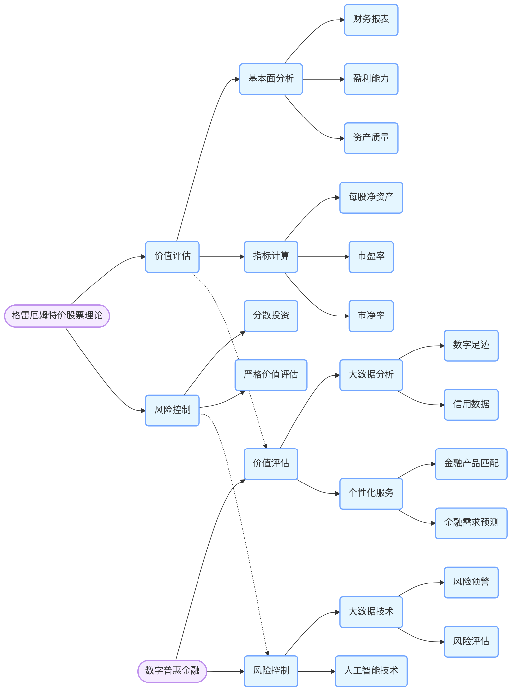

# 格雷厄姆特价股票理论对数字普惠金融的启示

> 关键词：格雷厄姆特价股票理论、数字普惠金融、价值评估、风险控制、金融服务覆盖

> 摘要：本文深入探讨了格雷厄姆特价股票理论对数字普惠金融的启示。首先介绍了格雷厄姆特价股票理论的核心概念及数字普惠金融的发展背景，分析两者之间的联系。接着详细阐述了格雷厄姆特价股票理论的核心算法原理和操作步骤，并建立相关数学模型进行说明。通过项目实战案例，展示该理论在数字普惠金融中的应用。同时探讨了数字普惠金融的实际应用场景，推荐了相关的学习资源、开发工具和论文著作。最后总结了数字普惠金融的未来发展趋势与挑战，解答常见问题，并提供扩展阅读和参考资料，旨在为数字普惠金融的发展提供新的思路和方法。

## 1. 背景介绍 
### 1.1 目的和范围
格雷厄姆特价股票理论作为价值投资的经典理论，强调寻找被市场低估的股票进行投资。而数字普惠金融旨在通过数字技术扩大金融服务的覆盖范围，为更多人群提供公平、便捷的金融服务。本研究的目的在于探索格雷厄姆特价股票理论中的核心思想和方法，如何为数字普惠金融的发展提供有益的启示。研究范围涵盖了该理论在数字普惠金融中的价值评估、风险控制、服务创新等多个方面。

### 1.2 预期读者
本文预期读者包括金融领域的从业者，如银行家、金融分析师、投资顾问等，他们可以从中获取新的业务思路和方法；计算机科学和信息技术领域的专业人士，有助于他们了解金融业务需求，开发更贴合实际的数字金融产品；以及对数字普惠金融和价值投资理论感兴趣的学者和研究人员，为他们的学术研究提供参考。

### 1.3 文档结构概述
本文首先介绍了格雷厄姆特价股票理论和数字普惠金融的背景知识，包括相关术语的定义和解释。接着分析了两者之间的核心概念联系，并给出相应的示意图和流程图。然后详细阐述了格雷厄姆特价股票理论的核心算法原理和操作步骤，通过 Python 代码进行说明，并建立数学模型进行深入分析。通过项目实战案例，展示该理论在数字普惠金融中的具体应用。之后探讨了数字普惠金融的实际应用场景，推荐了相关的学习资源、开发工具和论文著作。最后总结了数字普惠金融的未来发展趋势与挑战，解答常见问题，并提供扩展阅读和参考资料。

### 1.4 术语表
#### 1.4.1 核心术语定义
- **格雷厄姆特价股票理论**：由本杰明·格雷厄姆提出的价值投资理论，核心是寻找价格低于内在价值的股票，强调通过对公司财务报表等基本面分析来评估股票的内在价值。
- **数字普惠金融**：指在数字技术的支持下，以可负担的成本为有金融服务需求的社会各阶层和群体提供适当、有效的金融服务，重点关注弱势群体。
- **内在价值**：资产本身所具有的价值，是基于对资产未来现金流的预期和风险评估得出的理论价值。

#### 1.4.2 相关概念解释
- **价值投资**：一种投资策略，基于对资产内在价值的分析，寻找被低估的资产进行投资，期望在资产价格回归内在价值时获得收益。
- **普惠金融**：旨在为社会所有阶层和群体提供金融服务，特别是那些传统金融难以覆盖的弱势群体，以促进金融公平和经济发展。
- **数字技术**：包括互联网、移动支付、大数据、人工智能等现代信息技术，为数字普惠金融的发展提供了技术支持。

#### 1.4.3 缩略词列表
- **P2P**：Peer-to-Peer，点对点网络借贷。
- **AI**：Artificial Intelligence，人工智能。
- **ML**：Machine Learning，机器学习。

## 2. 核心概念与联系 
### 2.1 格雷厄姆特价股票理论核心概念
格雷厄姆特价股票理论的核心是寻找被市场低估的股票。其认为股票价格围绕内在价值波动，当股票价格低于内在价值时，就存在投资机会。内在价值的评估主要基于公司的基本面分析，包括财务报表、盈利能力、资产质量等。例如，通过计算公司的每股净资产、市盈率、市净率等指标，来判断股票是否被低估。

### 2.2 数字普惠金融核心概念
数字普惠金融是金融与数字技术的融合，通过数字技术降低金融服务的成本和门槛，扩大金融服务的覆盖范围。其核心在于利用大数据、人工智能等技术，实现金融服务的精准匹配和风险控制。例如，通过分析客户的数字足迹和信用数据，为客户提供个性化的金融产品和服务。

### 2.3 两者的联系
格雷厄姆特价股票理论和数字普惠金融虽然应用领域不同，但存在一些内在联系。在价值评估方面，两者都强调对资产或客户的真实价值进行评估。在格雷厄姆特价股票理论中，通过基本面分析评估股票的内在价值；在数字普惠金融中，通过大数据分析评估客户的信用价值和金融需求。在风险控制方面，两者都注重识别和控制风险。格雷厄姆通过分散投资和严格的价值评估来降低投资风险；数字普惠金融通过大数据和人工智能技术进行风险预警和控制。

### 2.4 文本示意图
```plaintext
格雷厄姆特价股票理论
|-- 价值评估
|   |-- 基本面分析
|   |   |-- 财务报表
|   |   |-- 盈利能力
|   |   |-- 资产质量
|   |-- 指标计算
|       |-- 每股净资产
|       |-- 市盈率
|       |-- 市净率
|-- 风险控制
|   |-- 分散投资
|   |-- 严格价值评估

数字普惠金融
|-- 价值评估
|   |-- 大数据分析
|   |   |-- 数字足迹
|   |   |-- 信用数据
|   |-- 个性化服务
|       |-- 金融产品匹配
|       |-- 金融需求预测
|-- 风险控制
|   |-- 大数据技术
|   |   |-- 风险预警
|   |   |-- 风险评估
|   |-- 人工智能技术
```

### 2.5 Mermaid 流程图


## 3. 核心算法原理 & 具体操作步骤 
### 3.1 格雷厄姆特价股票理论核心算法原理
格雷厄姆特价股票理论的核心算法是通过计算股票的内在价值，并与当前市场价格进行比较。常见的计算方法是使用市盈率和每股收益来估算内在价值。公式为：

$$V = EPS \times (8.5 + 2g)$$

其中，$V$ 表示股票的内在价值，$EPS$ 表示每股收益，$8.5$ 是格雷厄姆认为的无增长公司的合理市盈率，$g$ 是公司的预期增长率。

### 3.2 具体操作步骤
1. **数据收集**：收集公司的财务报表，包括利润表、资产负债表和现金流量表，获取每股收益和预期增长率等数据。
2. **计算内在价值**：根据上述公式计算股票的内在价值。
3. **比较价格与内在价值**：将计算得到的内在价值与当前市场价格进行比较，如果市场价格低于内在价值，则认为该股票被低估，具有投资价值。
4. **风险评估**：考虑公司的行业前景、竞争优势、财务状况等因素，评估投资风险。

### 3.3 Python 源代码实现
```python
# 计算股票的内在价值
def calculate_intrinsic_value(eps, growth_rate):
    # 8.5 是无增长公司的合理市盈率
    constant = 8.5
    # 根据公式计算内在价值
    intrinsic_value = eps * (constant + 2 * growth_rate)
    return intrinsic_value

# 示例数据
eps = 2.0  # 每股收益
growth_rate = 0.1  # 预期增长率

# 计算内在价值
intrinsic_value = calculate_intrinsic_value(eps, growth_rate)
print(f"股票的内在价值为: {intrinsic_value}")

# 假设当前市场价格
market_price = 15.0

# 比较价格与内在价值
if market_price < intrinsic_value:
    print("该股票被低估，具有投资价值。")
else:
    print("该股票未被低估，需谨慎投资。")
```

### 3.4 代码解释
上述代码定义了一个 `calculate_intrinsic_value` 函数，用于计算股票的内在价值。函数接受每股收益和预期增长率作为参数，根据格雷厄姆的公式计算内在价值。然后，使用示例数据调用该函数，并将计算得到的内在价值与假设的市场价格进行比较，输出投资建议。

## 4. 数学模型和公式 & 详细讲解 & 举例说明 
### 4.1 格雷厄姆内在价值公式
$$V = EPS \times (8.5 + 2g)$$

#### 详细讲解
- **$V$（内在价值）**：是股票理论上应该具有的价值，通过该公式计算得出。
- **$EPS$（每股收益）**：是公司净利润除以发行在外的普通股股数，反映了公司的盈利能力。每股收益越高，说明公司的盈利能力越强，股票的内在价值也可能越高。
- **$8.5$**：是格雷厄姆认为的无增长公司的合理市盈率。市盈率是股票价格与每股收益的比率，反映了市场对公司未来盈利的预期。无增长公司的市盈率通常较低，$8.5$ 是一个经验值。
- **$2g$**：$g$ 是公司的预期增长率，乘以 $2$ 是为了考虑公司的增长因素。预期增长率越高，股票的内在价值也越高。

### 4.2 举例说明
假设一家公司的每股收益为 $3$ 元，预期增长率为 $15\%$。根据格雷厄姆内在价值公式计算该股票的内在价值：

$$V = 3 \times (8.5 + 2 \times 0.15)$$
$$V = 3 \times (8.5 + 0.3)$$
$$V = 3 \times 8.8$$
$$V = 26.4$$

如果该股票的当前市场价格为 $20$ 元，由于市场价格低于内在价值，根据格雷厄姆特价股票理论，该股票被低估，具有投资价值。

### 4.3 局限性分析
格雷厄姆内在价值公式虽然简单实用，但也存在一定的局限性。首先，公式中的预期增长率 $g$ 是一个估计值，很难准确预测。其次，公式没有考虑宏观经济环境、行业竞争等因素对股票价值的影响。因此，在实际应用中，需要结合其他方法进行综合分析。

## 5. 项目实战：代码实际案例和详细解释说明 
### 5.1  开发环境搭建
#### 5.1.1 安装 Python
首先需要安装 Python 开发环境，建议使用 Python 3.7 及以上版本。可以从 Python 官方网站（https://www.python.org/downloads/）下载安装包，按照安装向导进行安装。

#### 5.1.2 安装必要的库
在本项目中，需要使用 `pandas` 库进行数据处理，`yfinance` 库获取股票数据。可以使用以下命令进行安装：
```sh
pip install pandas yfinance
```

### 5.2  源代码详细实现和代码解读
```python
import yfinance as yf
import pandas as pd

# 获取股票数据
def get_stock_data(ticker, start_date, end_date):
    stock = yf.Ticker(ticker)
    data = stock.history(start=start_date, end=end_date)
    return data

# 计算每股收益
def calculate_eps(financials):
    net_income = financials.loc['Net Income'][0]
    shares_outstanding = financials.loc['Basic Average Shares'][0]
    eps = net_income / shares_outstanding
    return eps

# 计算预期增长率（简单示例，实际中需要更复杂的方法）
def calculate_growth_rate(eps_history):
    growth_rate = (eps_history.iloc[-1] - eps_history.iloc[0]) / eps_history.iloc[0]
    return growth_rate

# 计算内在价值
def calculate_intrinsic_value(eps, growth_rate):
    constant = 8.5
    intrinsic_value = eps * (constant + 2 * growth_rate)
    return intrinsic_value

# 主函数
def main():
    ticker = 'AAPL'  # 股票代码，这里以苹果公司为例
    start_date = '2020-01-01'
    end_date = '2023-01-01'
    
    # 获取股票数据
    stock_data = get_stock_data(ticker, start_date, end_date)
    
    # 获取财务数据
    stock = yf.Ticker(ticker)
    financials = stock.financials
    
    # 计算每股收益
    eps = calculate_eps(financials)
    
    # 简单模拟获取每股收益历史数据
    eps_history = pd.Series([1.0, 1.2, 1.5, 1.8])  # 实际中需要从财务报表中获取
    
    # 计算预期增长率
    growth_rate = calculate_growth_rate(eps_history)
    
    # 计算内在价值
    intrinsic_value = calculate_intrinsic_value(eps, growth_rate)
    
    # 获取当前市场价格
    current_price = stock_data['Close'].iloc[-1]
    
    # 比较价格与内在价值
    if current_price < intrinsic_value:
        print(f"该股票（{ticker}）被低估，具有投资价值。内在价值: {intrinsic_value}, 当前价格: {current_price}")
    else:
        print(f"该股票（{ticker}）未被低估，需谨慎投资。内在价值: {intrinsic_value}, 当前价格: {current_price}")

if __name__ == "__main__":
    main()
```

### 5.3  代码解读与分析
#### 5.3.1 `get_stock_data` 函数
该函数使用 `yfinance` 库获取指定股票在指定日期范围内的历史数据，返回一个 `pandas` 的 `DataFrame` 对象。

#### 5.3.2 `calculate_eps` 函数
该函数从股票的财务报表中获取净利润和发行在外的普通股股数，计算每股收益。

#### 5.3.3 `calculate_growth_rate` 函数
该函数计算每股收益的预期增长率，这里使用简单的方法，即根据每股收益历史数据的首尾值计算增长率。实际应用中，需要更复杂的方法进行预测。

#### 5.3.4 `calculate_intrinsic_value` 函数
该函数根据格雷厄姆内在价值公式计算股票的内在价值。

#### 5.3.5 `main` 函数
主函数调用上述函数，完成数据获取、计算和比较的整个流程。首先获取股票的历史数据和财务数据，然后计算每股收益和预期增长率，接着计算内在价值，最后获取当前市场价格并与内在价值进行比较，输出投资建议。

## 6. 实际应用场景 
### 6.1 客户信用评估
在数字普惠金融中，客户信用评估是关键环节。借鉴格雷厄姆特价股票理论的价值评估方法，可以通过分析客户的财务数据、消费行为、社交数据等多维度信息，评估客户的信用价值。例如，通过计算客户的收入与负债比率、消费稳定性等指标，判断客户的还款能力和信用风险。对于信用价值被低估的客户，可以提供更优惠的金融产品和服务，扩大金融服务的覆盖范围。

### 6.2 金融产品定价
格雷厄姆特价股票理论强调根据资产的内在价值进行投资决策。在数字普惠金融中，金融产品定价也可以参考这一思路。通过对金融产品的风险、收益、流动性等因素进行评估，确定其内在价值，然后根据市场需求和竞争情况进行定价。例如，对于风险较低、收益稳定的金融产品，可以给予相对较低的利率；对于风险较高、收益潜力较大的金融产品，可以适当提高利率。

### 6.3 风险控制
在数字普惠金融业务中，风险控制至关重要。借鉴格雷厄姆的分散投资和严格价值评估方法，可以降低金融风险。例如，通过将资金分散投资于不同类型的金融产品和客户群体，避免过度集中风险。同时，在选择客户和金融产品时，进行严格的价值评估，确保其具有合理的风险收益比。

### 6.4 金融服务创新
格雷厄姆特价股票理论的核心思想是寻找被市场忽视的价值。在数字普惠金融中，可以利用这一思想进行金融服务创新。例如，针对传统金融难以覆盖的弱势群体，开发基于数字技术的新型金融产品和服务。通过挖掘这些群体的潜在价值，为他们提供个性化、低成本的金融解决方案，促进金融公平和经济发展。

## 7. 工具和资源推荐
### 7.1 学习资源推荐
#### 7.1.1 书籍推荐
- 《聪明的投资者》（The Intelligent Investor）：本杰明·格雷厄姆的经典著作，系统阐述了价值投资的理念和方法，是学习格雷厄姆特价股票理论的必读之书。
- 《数字普惠金融的中国实践》：深入介绍了数字普惠金融在中国的发展现状、模式和实践案例，对于了解数字普惠金融具有重要参考价值。
- 《金融科技：应用与创新》：涵盖了金融科技的各个领域，包括数字普惠金融，介绍了相关的技术和应用案例。

#### 7.1.2 在线课程
- Coursera 上的“Financial Markets”：由耶鲁大学教授罗伯特·席勒（Robert Shiller）授课，介绍了金融市场的基本原理和投资策略。
- edX 上的“Digital Finance and Banking”：提供了数字金融和银行领域的最新知识和实践经验。
- 中国大学 MOOC 上的“普惠金融概论”：系统介绍了普惠金融的概念、理论和实践，适合初学者学习。

#### 7.1.3 技术博客和网站
- 36氪金融频道：提供金融科技领域的最新资讯和深度分析。
- 零壹财经：专注于金融科技和普惠金融的研究和报道，发布行业研究报告和案例分析。
- 未央网：清华大学五道口金融学院旗下的金融科技资讯平台，提供权威的金融科技信息和研究成果。

### 7.2 开发工具框架推荐
#### 7.2.1 IDE和编辑器
- PyCharm：一款专业的 Python 集成开发环境，提供丰富的代码编辑、调试和分析功能，适合开发数字普惠金融相关的 Python 程序。
- Jupyter Notebook：一个交互式的编程环境，支持多种编程语言，方便进行数据探索、分析和可视化，常用于金融数据分析和建模。
- Visual Studio Code：一款轻量级的代码编辑器，支持多种编程语言和插件扩展，具有良好的用户体验和开发效率。

#### 7.2.2 调试和性能分析工具
- Py-Spy：一个用于 Python 程序性能分析的工具，可以实时监控程序的 CPU 使用率和函数调用情况，帮助开发者找出性能瓶颈。
- PDB：Python 自带的调试器，可以在代码中设置断点，逐步执行程序，查看变量的值和程序的执行流程，方便调试代码。
- cProfile：Python 标准库中的性能分析模块，可以统计程序中各个函数的执行时间和调用次数，帮助开发者优化代码性能。

#### 7.2.3 相关框架和库
- Pandas：一个强大的数据处理和分析库，提供了丰富的数据结构和函数，用于数据清洗、转换、分析和可视化，在金融数据分析中广泛应用。
- NumPy：一个用于科学计算的基础库，提供了高效的多维数组对象和数学函数，为金融计算和建模提供了支持。
- Scikit-learn：一个机器学习库，提供了各种机器学习算法和工具，用于数据挖掘、分类、回归和聚类等任务，可用于客户信用评估和风险预测。

### 7.3 相关论文著作推荐
#### 7.3.1 经典论文
- "Security Analysis"（《证券分析》）：本杰明·格雷厄姆和大卫·多德（David Dodd）的经典著作，奠定了价值投资的理论基础，对金融投资领域产生了深远影响。
- "The Theory of Economic Development"（《经济发展理论》）：约瑟夫·熊彼特（Joseph Schumpeter）的著作，提出了创新理论，对于理解金融创新和数字普惠金融的发展具有重要启示。
- "A Theory of Incentives in Procurement and Regulation"（《采购与规制中的激励理论》）：让·梯若尔（Jean Tirole）的著作，在信息经济学和激励理论方面具有重要贡献，可用于分析数字普惠金融中的信息不对称和激励机制问题。

#### 7.3.2 最新研究成果
- 关注顶级金融学术期刊，如《Journal of Finance》、《Review of Financial Studies》、《Journal of Financial Economics》等，这些期刊发表了金融领域的最新研究成果，包括数字普惠金融和价值投资的相关研究。
- 关注知名学术会议，如美国金融协会（American Finance Association）年会、中国金融学年会等，这些会议汇聚了金融领域的顶尖学者和研究人员，展示了最新的研究动态和成果。

#### 7.3.3 应用案例分析
- 国际金融公司（IFC）发布的数字普惠金融案例研究报告，介绍了全球范围内数字普惠金融的成功实践和经验教训。
- 中国人民银行金融消费权益保护局发布的数字普惠金融典型案例集，展示了中国数字普惠金融在服务实体经济、促进金融公平等方面的应用案例。

## 8. 总结：未来发展趋势与挑战
### 8.1 未来发展趋势
#### 8.1.1 技术创新推动
随着人工智能、大数据、区块链等技术的不断发展，数字普惠金融将迎来更多的创新机遇。例如，人工智能可以实现更精准的客户信用评估和风险预测；区块链可以提高金融交易的透明度和安全性。这些技术的应用将进一步提升数字普惠金融的服务效率和质量。

#### 8.1.2 服务场景拓展
数字普惠金融将不断拓展服务场景，除了传统的信贷、支付等领域，还将涉足保险、投资、养老等领域。例如，通过数字技术为老年人提供个性化的养老金融服务，为小微企业提供供应链金融服务等。

#### 8.1.3 国际合作加强
数字普惠金融是全球性的课题，各国之间将加强合作与交流。例如，分享数字普惠金融的发展经验和技术成果，共同制定相关的国际标准和规范，推动数字普惠金融在全球范围内的发展。

### 8.2 挑战
#### 8.2.1 数据安全与隐私保护
数字普惠金融依赖大量的客户数据，数据安全和隐私保护成为重要挑战。一旦数据泄露，将给客户带来巨大的损失。因此，需要加强数据安全技术研发和监管，确保客户数据的安全和隐私。

#### 8.2.2 技术应用难题
虽然数字技术为数字普惠金融带来了机遇，但也面临技术应用难题。例如，人工智能模型的可解释性问题、区块链技术的 scalability 问题等。需要不断探索和解决这些技术难题，确保数字技术在数字普惠金融中的有效应用。

#### 8.2.3 监管挑战
数字普惠金融的快速发展给监管带来了挑战。传统的金融监管模式难以适应数字普惠金融的特点，需要建立新的监管框架和机制。例如，加强对金融科技公司的监管，防范金融风险和市场乱象。

## 9. 附录：常见问题与解答
### 9.1 格雷厄姆特价股票理论在数字普惠金融中的应用有哪些局限性？
格雷厄姆特价股票理论主要针对股票投资，在数字普惠金融中的应用存在一定局限性。例如，该理论主要基于公司的基本面分析，而数字普惠金融涉及的客户群体更加广泛，数据来源更加复杂，难以简单地应用该理论进行价值评估。此外，该理论没有充分考虑数字技术带来的影响，如数据安全、隐私保护等问题。

### 9.2 如何提高数字普惠金融中客户信用评估的准确性？
可以从以下几个方面提高客户信用评估的准确性：
- **多维度数据采集**：除了传统的财务数据，还可以采集客户的消费行为、社交数据、数字足迹等多维度信息，全面了解客户的信用状况。
- **先进的数据分析技术**：运用大数据、人工智能等先进技术，对采集到的数据进行深度分析和挖掘，建立更准确的信用评估模型。
- **模型优化和验证**：定期对信用评估模型进行优化和验证，根据实际情况调整模型参数，提高模型的准确性和稳定性。

### 9.3 数字普惠金融面临哪些风险？
数字普惠金融面临的风险主要包括：
- **信用风险**：由于数字普惠金融服务的客户群体往往信用信息相对较少，信用风险较高。
- **技术风险**：依赖数字技术，可能面临技术故障、数据泄露、网络攻击等技术风险。
- **市场风险**：金融市场的波动可能影响数字普惠金融产品的收益和价值。
- **监管风险**：数字普惠金融的快速发展可能导致监管滞后，面临监管政策变化的风险。

## 10. 扩展阅读 & 参考资料
### 10.1 扩展阅读
- 《金融炼金术》（The Alchemy of Finance）：乔治·索罗斯（George Soros）的著作，介绍了他的投资哲学和金融市场的反身性理论，对于理解金融市场的复杂性和不确定性具有重要启示。
- 《穷查理宝典》（Poor Charlie's Almanack）：查理·芒格（Charlie Munger）的文集，收录了他的演讲和文章，阐述了他的投资理念和多元思维模型，对投资者和金融从业者具有重要的借鉴意义。
- 《创新者的窘境》（The Innovator's Dilemma）：克莱顿·克里斯坦森（Clayton Christensen）的著作，探讨了创新在企业发展中的重要性和挑战，对于理解数字普惠金融的创新和发展具有一定的参考价值。

### 10.2 参考资料
- Graham, B., & Dodd, D. L. (1934). Security Analysis. McGraw-Hill.
- Schumpeter, J. A. (1934). The Theory of Economic Development. Harvard University Press.
- Tirole, J. (1988). The Theory of Industrial Organization. MIT Press.
- World Bank. (2020). Global Findex Database 2020: Financial Inclusion, Digital Payments, and Resilience in the Age of COVID-19.

作者：AI天才研究院/AI Genius Institute & 禅与计算机程序设计艺术 /Zen And The Art of Computer Programming