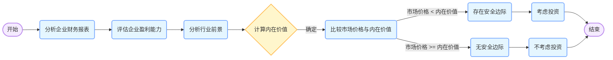

# 格雷厄姆特价股票理论对现代平台经济的启示

> 关键词：格雷厄姆特价股票理论、现代平台经济、价值投资、市场分析、经济策略

> 摘要：本文深入探讨了格雷厄姆特价股票理论，并研究其对现代平台经济的启示。首先介绍了格雷厄姆特价股票理论的背景和核心概念，包括该理论产生的时代背景、核心思想及相关架构。接着详细阐述了其核心算法原理，并通过Python代码进行示例。同时给出了相关的数学模型和公式，结合实际例子进行讲解。在项目实战部分，以模拟的平台经济场景展示代码实现和解读。然后分析了该理论在现代平台经济中的实际应用场景，推荐了相关的学习资源、开发工具和论文著作。最后总结了该理论对现代平台经济未来发展的趋势与挑战，以及解答了常见问题，并提供了扩展阅读和参考资料，旨在为现代平台经济的发展提供有价值的思路和策略。

## 1. 背景介绍 
### 1.1 目的和范围
本文章的主要目的是深入剖析格雷厄姆特价股票理论，并探究其对现代平台经济所具有的启示意义。格雷厄姆特价股票理论诞生于特定的金融市场环境中，它为股票投资提供了一种基于价值的分析方法。而现代平台经济作为一种新兴的经济模式，在全球经济中扮演着越来越重要的角色。通过研究两者之间的联系，我们希望能够为平台经济的参与者，如投资者、企业管理者等，提供一些有价值的决策参考和发展思路。

本文章的范围涵盖了格雷厄姆特价股票理论的核心概念、算法原理、数学模型，以及在现代平台经济中的实际应用场景。同时，还会推荐相关的学习资源、开发工具和研究论文，帮助读者更全面地了解和应用相关知识。

### 1.2 预期读者
本文的预期读者包括金融投资领域的专业人士，如股票分析师、基金经理等，他们可以从格雷厄姆特价股票理论的角度重新审视平台经济企业的投资价值。同时，平台经济企业的管理者也可以从中获取有关企业价值评估和发展策略的启示。此外，对金融经济和平台经济感兴趣的学者和学生也可以通过本文深入了解相关理论和实践应用。

### 1.3 文档结构概述
本文将按照以下结构进行组织：
- 核心概念与联系：介绍格雷厄姆特价股票理论的核心概念、原理和架构，并通过文本示意图和Mermaid流程图进行展示。
- 核心算法原理 & 具体操作步骤：详细讲解格雷厄姆特价股票理论的核心算法原理，并使用Python源代码进行阐述。
- 数学模型和公式 & 详细讲解 & 举例说明：给出相关的数学模型和公式，并结合实际例子进行详细讲解。
- 项目实战：代码实际案例和详细解释说明：通过模拟的平台经济场景，展示代码的实际实现和解读。
- 实际应用场景：分析格雷厄姆特价股票理论在现代平台经济中的实际应用场景。
- 工具和资源推荐：推荐相关的学习资源、开发工具和研究论文。
- 总结：未来发展趋势与挑战：总结该理论对现代平台经济未来发展的趋势与挑战。
- 附录：常见问题与解答：解答读者在阅读过程中可能遇到的常见问题。
- 扩展阅读 & 参考资料：提供相关的扩展阅读和参考资料。

### 1.4 术语表
#### 1.4.1 核心术语定义
- **格雷厄姆特价股票理论**：由本杰明·格雷厄姆提出的一种股票投资理论，强调通过分析股票的内在价值，寻找价格低于内在价值的股票进行投资。
- **现代平台经济**：一种基于数字技术，由数据驱动、平台支撑、网络协同的经济活动单元所构成的新经济系统，如电商平台、共享经济平台等。
- **内在价值**：指股票所代表的企业的真实价值，通常通过对企业的财务状况、盈利能力等因素进行分析得出。
- **安全边际**：指股票的市场价格低于其内在价值的幅度，是格雷厄姆投资理论中的重要概念，用于降低投资风险。

#### 1.4.2 相关概念解释
- **价值投资**：一种投资策略，强调通过分析企业的内在价值，寻找被低估的股票进行投资，长期持有以获取价值回归带来的收益。
- **基本面分析**：通过对企业的财务报表、行业前景、宏观经济环境等因素进行分析，评估企业的内在价值和投资价值。
- **平台效应**：指平台经济中，随着用户数量的增加，平台的价值呈指数级增长的现象。

#### 1.4.3 缩略词列表
- **PE**：市盈率（Price-to-Earnings Ratio），指股票价格与每股收益的比率，用于衡量股票的估值水平。
- **PB**：市净率（Price-to-Book Ratio），指股票价格与每股净资产的比率，用于衡量股票的估值水平。

## 2. 核心概念与联系 
### 格雷厄姆特价股票理论核心概念
格雷厄姆特价股票理论的核心思想是价值投资。格雷厄姆认为，股票的市场价格会受到各种短期因素的影响而波动，但股票本身具有内在价值。投资者应该通过对企业的基本面进行分析，确定股票的内在价值，并寻找市场价格低于内在价值的股票进行投资，从而获得安全边际和长期的投资回报。

### 原理和架构
该理论的原理基于对企业财务状况和盈利能力的分析。主要通过以下几个方面来评估股票的内在价值：
- **财务报表分析**：包括对企业的资产负债表、利润表和现金流量表的分析，了解企业的资产状况、盈利能力和现金流量情况。
- **盈利能力评估**：通过分析企业的毛利率、净利率、净资产收益率等指标，评估企业的盈利能力。
- **行业前景分析**：考虑企业所处行业的发展趋势、竞争格局等因素，评估企业的未来发展潜力。

其架构可以用以下文本示意图表示：

```plaintext
格雷厄姆特价股票理论
|-- 核心思想：价值投资
|   |-- 寻找价格低于内在价值的股票
|-- 内在价值评估
|   |-- 财务报表分析
|   |   |-- 资产负债表
|   |   |-- 利润表
|   |   |-- 现金流量表
|   |-- 盈利能力评估
|   |   |-- 毛利率
|   |   |-- 净利率
|   |   |-- 净资产收益率
|   |-- 行业前景分析
|       |-- 行业发展趋势
|       |-- 竞争格局
|-- 安全边际
|   |-- 市场价格与内在价值的差距
```

### Mermaid流程图


## 3. 核心算法原理 & 具体操作步骤 
### 核心算法原理
格雷厄姆特价股票理论的核心算法主要是计算股票的内在价值。一种常用的方法是通过股息折现模型（Dividend Discount Model, DDM）。该模型假设股票的内在价值等于其未来股息的现值之和。

股息折现模型的基本公式为：

$V = \frac{D_1}{(1 + r)^1}+\frac{D_2}{(1 + r)^2}+\cdots+\frac{D_n}{(1 + r)^n}$

其中，$V$ 表示股票的内在价值，$D_i$ 表示第 $i$ 期的股息，$r$ 表示折现率。

在实际应用中，为了简化计算，通常会假设股息以固定的增长率 $g$ 增长。此时，股息折现模型可以简化为：

$V = \frac{D_1}{r - g}$

其中，$D_1$ 表示下一期的股息，$r$ 表示折现率，$g$ 表示股息增长率。

### 具体操作步骤
1. **收集数据**：收集企业的财务报表，包括资产负债表、利润表和现金流量表，以及股息分配情况。
2. **计算股息增长率 $g$**：通过分析企业过去几年的股息分配情况，计算股息的平均增长率。
3. **确定折现率 $r$**：折现率通常可以使用资本资产定价模型（CAPM）来确定，也可以根据市场情况和投资者的风险偏好进行调整。
4. **计算下一期的股息 $D_1$**：根据企业的股息分配政策和当前的股息水平，计算下一期的股息。
5. **计算内在价值 $V$**：将 $D_1$、$r$ 和 $g$ 代入简化的股息折现模型公式，计算股票的内在价值。
6. **比较市场价格与内在价值**：将计算得到的内在价值与股票的市场价格进行比较，如果市场价格低于内在价值，则存在安全边际，可以考虑投资。

### Python源代码实现
```python
def calculate_intrinsic_value(D1, r, g):
    """
    计算股票的内在价值
    :param D1: 下一期的股息
    :param r: 折现率
    :param g: 股息增长率
    :return: 股票的内在价值
    """
    if r <= g:
        raise ValueError("折现率必须大于股息增长率")
    return D1 / (r - g)

# 示例数据
D1 = 2.0  # 下一期的股息
r = 0.1  # 折现率
g = 0.05  # 股息增长率

try:
    intrinsic_value = calculate_intrinsic_value(D1, r, g)
    print(f"股票的内在价值为: {intrinsic_value}")
except ValueError as e:
    print(f"计算错误: {e}")
```

在上述代码中，定义了一个 `calculate_intrinsic_value` 函数，用于计算股票的内在价值。该函数接受三个参数：下一期的股息 `D1`、折现率 `r` 和股息增长率 `g`。在函数内部，首先检查折现率是否大于股息增长率，如果不满足条件，则抛出一个 `ValueError` 异常。然后，使用简化的股息折现模型公式计算股票的内在价值，并返回结果。最后，给出了一个示例数据，调用 `calculate_intrinsic_value` 函数进行计算，并打印结果。

## 4. 数学模型和公式 & 详细讲解 & 举例说明 
### 股息折现模型公式
如前所述，股息折现模型的基本公式为：

$V = \frac{D_1}{(1 + r)^1}+\frac{D_2}{(1 + r)^2}+\cdots+\frac{D_n}{(1 + r)^n}$

这个公式的含义是，股票的内在价值等于其未来各期股息的现值之和。其中，$D_i$ 表示第 $i$ 期的股息，$r$ 表示折现率。折现率的作用是将未来的股息折现到当前时刻，因为未来的资金具有时间价值，相同金额的资金在不同时间点的价值是不同的。

### 简化公式推导
当股息以固定的增长率 $g$ 增长时，即 $D_2 = D_1(1 + g)$，$D_3 = D_2(1 + g) = D_1(1 + g)^2$，以此类推，$D_n = D_1(1 + g)^{n - 1}$。

将这些关系代入基本公式中，得到：

$V = \frac{D_1}{(1 + r)^1}+\frac{D_1(1 + g)}{(1 + r)^2}+\frac{D_1(1 + g)^2}{(1 + r)^3}+\cdots+\frac{D_1(1 + g)^{n - 1}}{(1 + r)^n}$

这是一个等比数列求和的问题，公比为 $\frac{1 + g}{1 + r}$。当 $n$ 趋近于无穷大，且 $r > g$ 时，等比数列的和可以简化为：

$V = \frac{D_1}{r - g}$

### 详细讲解
- **股息 $D_1$**：下一期的股息是计算内在价值的重要参数。它可以根据企业的股息分配政策和当前的股息水平来确定。例如，如果企业过去几年的股息分配比较稳定，且预计未来不会有太大变化，那么可以将当前的股息作为下一期的股息。
- **折现率 $r$**：折现率反映了投资者对投资回报的要求和对风险的承受能力。一般来说，折现率可以使用资本资产定价模型（CAPM）来确定，公式为：

$r = R_f+\beta\times(R_m - R_f)$

其中，$R_f$ 表示无风险利率，通常可以使用国债收益率来近似代替；$\beta$ 表示股票的贝塔系数，反映了股票相对于市场的波动程度；$R_m$ 表示市场收益率。

- **股息增长率 $g$**：股息增长率可以通过分析企业过去几年的股息分配情况来计算。例如，可以计算过去五年的股息增长率的平均值作为未来的股息增长率。

### 举例说明
假设某股票当前的股息为 $D_0 = 1.5$ 元，预计下一期的股息增长率为 $g = 0.03$，则下一期的股息 $D_1 = D_0(1 + g) = 1.5\times(1 + 0.03) = 1.545$ 元。

无风险利率 $R_f = 0.02$，市场收益率 $R_m = 0.08$，该股票的贝塔系数 $\beta = 1.2$。

首先，使用资本资产定价模型计算折现率 $r$：

$r = R_f+\beta\times(R_m - R_f)=0.02 + 1.2\times(0.08 - 0.02)=0.092$

然后，使用简化的股息折现模型公式计算股票的内在价值 $V$：

$V = \frac{D_1}{r - g}=\frac{1.545}{0.092 - 0.03}\approx24.92$（元）

如果该股票的市场价格为 20 元，低于计算得到的内在价值 24.92 元，则存在安全边际，可以考虑投资。

## 5. 项目实战：代码实际案例和详细解释说明 
### 5.1  开发环境搭建
为了实现格雷厄姆特价股票理论在平台经济中的应用，我们可以使用 Python 进行开发。以下是搭建开发环境的步骤：
1. **安装 Python**：从 Python 官方网站（https://www.python.org/downloads/）下载并安装适合你操作系统的 Python 版本。建议使用 Python 3.7 及以上版本。
2. **安装开发工具**：可以选择使用 PyCharm、Jupyter Notebook 等开发工具。这里以 PyCharm 为例，从 JetBrains 官方网站（https://www.jetbrains.com/pycharm/download/）下载并安装 PyCharm 社区版。
3. **安装必要的库**：在命令行中使用以下命令安装所需的库：
```sh
pip install pandas numpy matplotlib
```
- `pandas`：用于数据处理和分析。
- `numpy`：用于数值计算。
- `matplotlib`：用于数据可视化。

### 5.2  源代码详细实现和代码解读
以下是一个模拟的平台经济场景下，使用格雷厄姆特价股票理论进行股票筛选的代码示例：

```python
import pandas as pd
import numpy as np
import matplotlib.pyplot as plt

# 模拟平台经济企业的财务数据
data = {
    '公司名称': ['平台企业 A', '平台企业 B', '平台企业 C', '平台企业 D'],
    '当前股息': [1.2, 1.5, 0.8, 1.0],
    '股息增长率': [0.05, 0.03, 0.02, 0.04],
    '贝塔系数': [1.1, 1.2, 0.9, 1.0],
    '市场价格': [20, 25, 15, 18]
}

df = pd.DataFrame(data)

# 假设无风险利率和市场收益率
R_f = 0.02
R_m = 0.08

# 计算折现率
df['折现率'] = R_f + df['贝塔系数'] * (R_m - R_f)

# 计算下一期的股息
df['下一期股息'] = df['当前股息'] * (1 + df['股息增长率'])

# 计算内在价值
df['内在价值'] = df['下一期股息'] / (df['折现率'] - df['股息增长率'])

# 计算安全边际
df['安全边际'] = (df['内在价值'] - df['市场价格']) / df['内在价值']

# 筛选出具有安全边际的股票
safe_stocks = df[df['安全边际'] > 0]

# 打印结果
print("具有安全边际的股票：")
print(safe_stocks[['公司名称', '市场价格', '内在价值', '安全边际']])

# 可视化结果
plt.figure(figsize=(10, 6))
plt.bar(safe_stocks['公司名称'], safe_stocks['安全边际'])
plt.xlabel('公司名称')
plt.ylabel('安全边际')
plt.title('具有安全边际的平台经济企业')
plt.show()
```

### 代码解读与分析
1. **数据模拟**：使用字典 `data` 模拟了四个平台经济企业的财务数据，包括当前股息、股息增长率、贝塔系数和市场价格。然后将这些数据转换为 `pandas` 的 `DataFrame` 对象 `df`。
2. **参数设定**：假设无风险利率 $R_f = 0.02$，市场收益率 $R_m = 0.08$。
3. **计算折现率**：根据资本资产定价模型 $r = R_f+\beta\times(R_m - R_f)$，计算每个企业的折现率，并将结果添加到 `DataFrame` 中。
4. **计算下一期的股息**：根据当前股息和股息增长率，计算下一期的股息，并将结果添加到 `DataFrame` 中。
5. **计算内在价值**：使用简化的股息折现模型公式 $V = \frac{D_1}{r - g}$，计算每个企业的内在价值，并将结果添加到 `DataFrame` 中。
6. **计算安全边际**：安全边际的计算公式为 $\text{安全边际}=\frac{V - P}{V}$，其中 $V$ 表示内在价值，$P$ 表示市场价格。将计算结果添加到 `DataFrame` 中。
7. **筛选股票**：筛选出安全边际大于 0 的股票，即具有安全边际的股票，并将结果存储在 `safe_stocks` 中。
8. **打印和可视化结果**：打印具有安全边际的股票的信息，并使用 `matplotlib` 库绘制柱状图，直观展示这些股票的安全边际。

通过这个代码示例，我们可以看到如何使用格雷厄姆特价股票理论对平台经济企业的股票进行筛选和分析。

## 6. 实际应用场景 
### 投资者决策
对于投资者来说，格雷厄姆特价股票理论可以帮助他们在现代平台经济中寻找具有投资价值的企业。通过分析平台企业的财务状况、盈利能力和行业前景，计算股票的内在价值，并与市场价格进行比较，投资者可以确定是否存在安全边际，从而做出投资决策。例如，在电商平台领域，投资者可以关注那些市场价格低于内在价值的企业，这些企业可能具有较高的投资回报率。

### 企业战略规划
平台经济企业的管理者可以借鉴格雷厄姆特价股票理论的思想，进行企业的战略规划。通过评估企业的内在价值，管理者可以了解企业的优势和劣势，制定合理的发展战略。例如，如果企业的内在价值较高，但市场价格较低，管理者可以考虑采取一些措施来提升企业的市场形象和价值，如加强品牌建设、拓展业务领域等。

### 行业分析和预测
格雷厄姆特价股票理论也可以用于对平台经济行业的分析和预测。通过对行业内企业的财务数据和市场表现进行分析，投资者和研究者可以了解行业的整体发展趋势和竞争格局。例如，如果行业内大部分企业的市场价格都低于内在价值，可能意味着整个行业处于低估状态，存在投资机会。

### 风险管理
在投资平台经济企业时，风险管理是非常重要的。格雷厄姆特价股票理论中的安全边际概念可以帮助投资者降低投资风险。通过选择具有安全边际的股票进行投资，投资者可以在市场波动时减少损失。例如，即使市场价格下跌，只要股票的内在价值不变，具有安全边际的股票仍然有一定的缓冲空间。

## 7. 工具和资源推荐
### 7.1 学习资源推荐
#### 7.1.1 书籍推荐
- 《聪明的投资者》（The Intelligent Investor）：本杰明·格雷厄姆的经典著作，详细阐述了价值投资的理念和方法，是学习格雷厄姆特价股票理论的必读之书。
- 《证券分析》（Security Analysis）：同样是格雷厄姆的著作，对证券分析的基本原理和方法进行了系统的介绍，是金融投资领域的权威教材。
- 《巴菲特致股东的信：投资者和公司高管教程》（The Essays of Warren Buffett: Lessons for Corporate America）：巴菲特是格雷厄姆的学生和追随者，这本书收录了巴菲特历年致股东的信，从中可以学习到他的投资理念和策略。

#### 7.1.2 在线课程
- Coursera 上的“投资学原理”（Principles of Investing）课程：由知名教授授课，涵盖了投资学的基本原理和方法，包括价值投资的相关内容。
- edX 上的“金融市场”（Financial Markets）课程：耶鲁大学教授罗伯特·席勒（Robert Shiller）主讲，介绍了金融市场的基本概念和运行机制，对理解股票投资有很大帮助。

#### 7.1.3 技术博客和网站
- Seeking Alpha：一个专业的金融投资博客网站，提供了大量的股票分析和投资建议，包括对平台经济企业的分析。
- 雪球网：国内知名的投资交流社区，有很多投资者分享自己的投资经验和研究成果，可以从中了解到平台经济企业的最新动态和投资机会。

### 7.2 开发工具框架推荐
#### 7.2.1 IDE和编辑器
- PyCharm：一款功能强大的 Python 集成开发环境，提供了代码编辑、调试、版本控制等功能，适合专业的 Python 开发者。
- Jupyter Notebook：一个基于网页的交互式开发环境，支持 Python、R 等多种编程语言，方便进行数据探索和分析。

#### 7.2.2 调试和性能分析工具
- pdb：Python 自带的调试工具，可以帮助开发者定位代码中的错误。
- cProfile：Python 的性能分析工具，可以分析代码的运行时间和函数调用情况，帮助开发者优化代码性能。

#### 7.2.3 相关框架和库
- pandas：用于数据处理和分析的 Python 库，提供了高效的数据结构和数据操作方法。
- numpy：用于数值计算的 Python 库，提供了丰富的数学函数和数组操作功能。
- matplotlib：用于数据可视化的 Python 库，可以绘制各种类型的图表，如折线图、柱状图、散点图等。

### 7.3 相关论文著作推荐
#### 7.3.1 经典论文
- Graham, B., & Dodd, D. L. (1934). Security Analysis. This classic paper laid the foundation for value investing and introduced many of the concepts still used today.
- Fama, E. F., & French, K. R. (1992). The cross-section of expected stock returns. This paper proposed the Fama-French three-factor model, which has had a significant impact on the field of finance.

#### 7.3.2 最新研究成果
- Recent research on the application of value investing in the digital economy and platform economy, which can be found in academic journals such as the Journal of Financial Economics and the Review of Financial Studies.

#### 7.3.3 应用案例分析
- Case studies of successful value investments in platform economy companies, which can provide practical insights and lessons for investors and managers.

## 8. 总结：未来发展趋势与挑战
### 未来发展趋势
#### 与数字化技术深度融合
随着数字化技术的不断发展，格雷厄姆特价股票理论在现代平台经济中的应用将更加智能化和精准化。例如，利用大数据分析和人工智能算法，可以更快速、准确地分析平台企业的财务数据和市场信息，提高内在价值评估的准确性。

#### 跨行业应用拓展
除了传统的电商、共享经济等平台经济领域，格雷厄姆特价股票理论可能会在更多新兴的平台经济模式中得到应用，如区块链平台、人工智能平台等。这将为投资者和企业带来更多的投资机会和发展空间。

#### 强调长期价值投资
在现代平台经济中，短期市场波动较大，投资者将更加注重企业的长期价值。格雷厄姆特价股票理论强调的价值投资理念，将引导投资者关注平台企业的基本面和长期发展潜力，避免短期投机行为。

### 挑战
#### 数据质量和可靠性
在应用格雷厄姆特价股票理论时，需要大量的企业财务数据和市场信息。然而，平台经济企业的业务模式复杂，数据的质量和可靠性可能存在问题。例如，一些平台企业可能存在数据造假、财务报表不透明等情况，这将影响内在价值评估的准确性。

#### 行业变化快速
平台经济行业发展迅速，技术创新和商业模式变革频繁。这使得企业的未来发展具有很大的不确定性，股息增长率、折现率等参数的估计变得更加困难。投资者需要不断学习和更新知识，以适应行业的变化。

#### 市场情绪影响
市场情绪对股票价格的影响较大，即使企业的内在价值较高，但在市场恐慌或过度乐观的情况下，股票价格可能会偏离内在价值。投资者需要克服市场情绪的干扰，坚持价值投资的理念。

## 9. 附录：常见问题与解答
### 问题 1：格雷厄姆特价股票理论适用于所有平台经济企业吗？
答：不是的。格雷厄姆特价股票理论主要适用于那些具有稳定财务状况和可预测股息分配的平台经济企业。对于一些处于初创期或快速发展阶段的平台企业，由于其财务数据不稳定，股息分配也不确定，可能不太适合直接应用该理论。

### 问题 2：如何确定股息增长率和折现率？
答：股息增长率可以通过分析企业过去几年的股息分配情况来计算，也可以参考行业的平均增长率。折现率可以使用资本资产定价模型（CAPM）来确定，其中无风险利率可以使用国债收益率近似代替，市场收益率可以参考市场指数的历史表现，贝塔系数可以通过统计分析或专业的金融数据提供商获取。

### 问题 3：安全边际的大小如何影响投资决策？
答：安全边际越大，说明股票的市场价格低于内在价值的幅度越大，投资风险越低。一般来说，投资者可以根据自己的风险偏好和投资目标来确定安全边际的阈值。例如，一些保守的投资者可能会选择安全边际在 30% 以上的股票进行投资。

### 问题 4：在实际应用中，如何处理数据的缺失和异常值？
答：对于数据缺失的情况，可以采用插值法、均值填充法等方法进行处理。对于异常值，可以通过统计分析方法进行识别和处理，如删除异常值、替换为合理值等。在处理数据时，需要根据具体情况选择合适的方法，并确保处理后的数据不会影响分析结果的准确性。

## 10. 扩展阅读 & 参考资料
### 扩展阅读
- 《金融炼金术》（The Alchemy of Finance）：乔治·索罗斯的著作，介绍了他的投资哲学和方法，对理解金融市场的运行机制有很大帮助。
- 《黑天鹅：如何应对不可预知的未来》（The Black Swan: The Impact of the Highly Improbable）：纳西姆·尼古拉斯·塔勒布的著作，探讨了不确定性和突发事件对金融市场的影响。

### 参考资料
- Graham, B., & Dodd, D. L. (1934). Security Analysis. McGraw-Hill.
- Buffett, W. E. (2008). The Essays of Warren Buffett: Lessons for Corporate America. Cunningham Group.
- Fama, E. F., & French, K. R. (1992). The cross-section of expected stock returns. The Journal of Finance, 47(2), 427-465.

作者：AI天才研究院/AI Genius Institute & 禅与计算机程序设计艺术 /Zen And The Art of Computer Programming