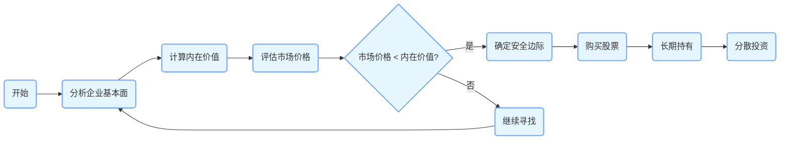

# 格雷厄姆特价股票理论对现代风险管理的启示

> 关键词：格雷厄姆特价股票理论、现代风险管理、价值投资、安全边际、市场波动

> 摘要：本文深入探讨了格雷厄姆特价股票理论的核心概念、算法原理及数学模型，并详细阐述了其对现代风险管理的启示。通过项目实战案例展示了该理论在实际投资中的应用，分析了其在不同场景下的作用。同时，推荐了相关的学习资源、开发工具和研究论文，最后总结了该理论在未来风险管理中的发展趋势与挑战，并对常见问题进行了解答。

## 1. 背景介绍 
### 1.1 目的和范围
本文章旨在全面剖析格雷厄姆特价股票理论，并探讨其对现代风险管理的深远影响。通过深入研究该理论的核心概念、算法原理、数学模型等方面，为投资者和风险管理从业者提供有价值的参考。文章的范围涵盖了理论的基本原理、实际应用案例以及相关的学习资源和未来发展趋势等。

### 1.2 预期读者
本文预期读者主要包括金融投资领域的从业者，如股票投资者、基金经理、风险管理专家等。同时，也适合对金融投资和风险管理感兴趣的学生、学者以及普通投资者阅读，帮助他们更好地理解和应用格雷厄姆特价股票理论进行风险管理。

### 1.3 文档结构概述
本文将按照以下结构进行阐述：首先介绍格雷厄姆特价股票理论的背景知识，包括目的、预期读者和文档结构概述等；接着详细讲解核心概念与联系，通过文本示意图和Mermaid流程图进行展示；然后深入探讨核心算法原理和具体操作步骤，并使用Python源代码进行详细阐述；之后介绍数学模型和公式，并结合具体例子进行说明；再通过项目实战展示代码实际案例和详细解释；分析该理论在实际应用场景中的作用；推荐相关的工具和资源；总结未来发展趋势与挑战；最后在附录中解答常见问题，并提供扩展阅读和参考资料。

### 1.4 术语表
#### 1.4.1 核心术语定义
- **格雷厄姆特价股票理论**：由本杰明·格雷厄姆提出的一种价值投资理论，强调寻找价格低于内在价值的股票进行投资。
- **安全边际**：指股票的市场价格与内在价值之间的差值，是格雷厄姆理论中的重要概念，用于降低投资风险。
- **内在价值**：股票所代表的企业的真实价值，通过对企业的财务状况、盈利能力等因素进行分析计算得出。
- **现代风险管理**：运用各种方法和技术对投资过程中的风险进行识别、评估和控制，以实现投资目标的过程。

#### 1.4.2 相关概念解释
- **价值投资**：基于对股票内在价值的分析，寻找被市场低估的股票进行投资，以获取长期稳定的回报。
- **市场波动**：股票市场价格随时间的上下波动，是投资过程中面临的主要风险之一。
- **财务报表分析**：通过对企业的资产负债表、利润表、现金流量表等财务报表进行分析，评估企业的财务状况和盈利能力。

#### 1.4.3 缩略词列表
- **P/E**：市盈率（Price-to-Earnings Ratio），反映股票价格与每股盈利之间的关系。
- **P/B**：市净率（Price-to-Book Ratio），反映股票价格与每股净资产之间的关系。

## 2. 核心概念与联系 

### 核心概念原理
格雷厄姆特价股票理论的核心原理是基于价值投资的理念，认为股票市场存在定价错误的情况，即某些股票的市场价格低于其内在价值。投资者可以通过深入分析企业的基本面，寻找这些被低估的股票进行投资，从而获得超额回报。

该理论强调安全边际的重要性，即投资者在购买股票时，应确保股票的市场价格与内在价值之间存在足够的差距，以降低投资风险。即使在市场出现不利波动时，由于安全边际的存在，投资者的损失也会相对较小。

### 架构的文本示意图
```plaintext
格雷厄姆特价股票理论
|
|-- 价值投资理念
|   |-- 寻找被低估股票
|   |-- 基于企业基本面分析
|
|-- 安全边际
|   |-- 市场价格与内在价值差值
|   |-- 降低投资风险
|
|-- 投资策略
|   |-- 长期持有
|   |-- 分散投资
```

### Mermaid 流程图


## 3. 核心算法原理 & 具体操作步骤 

### 核心算法原理
格雷厄姆特价股票理论的核心算法主要涉及计算股票的内在价值和评估安全边际。常见的计算内在价值的方法有股息折现模型（DDM）、市盈率法和市净率法等。

#### 股息折现模型（DDM）
股息折现模型认为股票的内在价值等于其未来股息的现值之和。其基本公式为：
$$V = \sum_{t=1}^{\infty} \frac{D_t}{(1 + r)^t}$$
其中，$V$ 表示股票的内在价值，$D_t$ 表示第 $t$ 期的股息，$r$ 表示折现率。

#### 市盈率法
市盈率法通过将股票的每股盈利（EPS）乘以合理的市盈率（P/E）来计算股票的内在价值。其公式为：
$$V = EPS \times P/E$$

#### 市净率法
市净率法通过将股票的每股净资产（BVPS）乘以合理的市净率（P/B）来计算股票的内在价值。其公式为：
$$V = BVPS \times P/B$$

### 具体操作步骤
1. **分析企业基本面**：收集企业的财务报表、行业报告等信息，分析企业的盈利能力、偿债能力、运营能力等。
2. **计算内在价值**：根据企业的特点和市场情况，选择合适的方法计算股票的内在价值。
3. **评估市场价格**：获取股票的当前市场价格。
4. **确定安全边际**：计算内在价值与市场价格之间的差值，确定安全边际的大小。
5. **做出投资决策**：如果安全边际足够大，且符合投资者的风险偏好和投资目标，则可以考虑购买该股票；否则，继续寻找其他被低估的股票。

### Python源代码实现
```python
# 股息折现模型示例
def ddm_value(D, r, n=10):
    """
    计算股票的内在价值（股息折现模型）
    :param D: 每年的股息
    :param r: 折现率
    :param n: 预测期数
    :return: 股票的内在价值
    """
    value = 0
    for t in range(1, n + 1):
        value += D / ((1 + r) ** t)
    return value

# 市盈率法示例
def pe_value(EPS, P_E):
    """
    计算股票的内在价值（市盈率法）
    :param EPS: 每股盈利
    :param P_E: 合理的市盈率
    :return: 股票的内在价值
    """
    return EPS * P_E

# 市净率法示例
def pb_value(BVPS, P_B):
    """
    计算股票的内在价值（市净率法）
    :param BVPS: 每股净资产
    :param P_B: 合理的市净率
    :return: 股票的内在价值
    """
    return BVPS * P_B

# 示例数据
D = 2  # 每年的股息
r = 0.1  # 折现率
EPS = 5  # 每股盈利
P_E = 15  # 合理的市盈率
BVPS = 20  # 每股净资产
P_B = 1.5  # 合理的市净率

# 计算内在价值
ddm_val = ddm_value(D, r)
pe_val = pe_value(EPS, P_E)
pb_val = pb_value(BVPS, P_B)

print(f"股息折现模型计算的内在价值: {ddm_val}")
print(f"市盈率法计算的内在价值: {pe_val}")
print(f"市净率法计算的内在价值: {pb_val}")
```

## 4. 数学模型和公式 & 详细讲解 & 举例说明 

### 股息折现模型（DDM）
#### 公式推导
假设股票每年支付的股息为 $D$，折现率为 $r$，则第 $t$ 期股息的现值为 $\frac{D}{(1 + r)^t}$。股票的内在价值 $V$ 等于未来所有股息的现值之和，即：
$$V = \sum_{t=1}^{\infty} \frac{D}{(1 + r)^t}$$
当股息保持不变时，这是一个等比数列求和问题。根据等比数列求和公式 $S = \frac{a(1 - q^n)}{1 - q}$（其中 $a$ 为首项，$q$ 为公比，$n$ 为项数），当 $n \to \infty$ 且 $|q| < 1$ 时，$S = \frac{a}{1 - q}$。在股息折现模型中，$a = \frac{D}{1 + r}$，$q = \frac{1}{1 + r}$，则：
$$V = \frac{\frac{D}{1 + r}}{1 - \frac{1}{1 + r}} = \frac{D}{r}$$

#### 举例说明
假设某股票每年支付的股息为 $2$ 元，折现率为 $10\%$，则根据股息折现模型，该股票的内在价值为：
$$V = \frac{2}{0.1} = 20$$（元）

### 市盈率法
#### 公式讲解
市盈率法的基本思想是，市场上同类企业通常具有相似的市盈率。通过将目标企业的每股盈利乘以合理的市盈率，就可以得到该股票的内在价值。合理的市盈率可以参考行业平均市盈率或同类企业的市盈率。

#### 举例说明
假设某企业的每股盈利为 $5$ 元，行业平均市盈率为 $15$，则根据市盈率法，该股票的内在价值为：
$$V = 5 \times 15 = 75$$（元）

### 市净率法
#### 公式讲解
市净率法认为，股票的价格应该与其每股净资产有一定的比例关系。通过将目标企业的每股净资产乘以合理的市净率，就可以得到该股票的内在价值。合理的市净率可以参考行业平均市净率或同类企业的市净率。

#### 举例说明
假设某企业的每股净资产为 $20$ 元，行业平均市净率为 $1.5$，则根据市净率法，该股票的内在价值为：
$$V = 20 \times 1.5 = 30$$（元）

## 5. 项目实战：代码实际案例和详细解释说明 

### 5.1  开发环境搭建
为了实现基于格雷厄姆特价股票理论的投资分析，我们可以使用Python进行开发。以下是开发环境的搭建步骤：
1. **安装Python**：从Python官方网站（https://www.python.org/downloads/）下载并安装Python 3.x版本。
2. **安装必要的库**：使用pip命令安装以下必要的库：
```bash
pip install pandas numpy yfinance matplotlib
```
- `pandas`：用于数据处理和分析。
- `numpy`：用于数值计算。
- `yfinance`：用于获取股票数据。
- `matplotlib`：用于数据可视化。

### 5.2  源代码详细实现和代码解读
```python
import yfinance as yf
import pandas as pd
import numpy as np
import matplotlib.pyplot as plt

# 定义获取股票数据的函数
def get_stock_data(ticker, start_date, end_date):
    """
    获取股票数据
    :param ticker: 股票代码
    :param start_date: 开始日期
    :param end_date: 结束日期
    :return: 股票数据
    """
    data = yf.download(ticker, start=start_date, end=end_date)
    return data

# 定义计算内在价值的函数（市盈率法）
def calculate_intrinsic_value(eps, pe_ratio):
    """
    计算股票的内在价值（市盈率法）
    :param eps: 每股盈利
    :param pe_ratio: 合理的市盈率
    :return: 股票的内在价值
    """
    return eps * pe_ratio

# 定义主函数
def main():
    # 股票代码
    ticker = 'AAPL'
    # 开始日期
    start_date = '2020-01-01'
    # 结束日期
    end_date = '2023-01-01'

    # 获取股票数据
    stock_data = get_stock_data(ticker, start_date, end_date)

    # 假设每股盈利为 5 元，合理的市盈率为 15
    eps = 5
    pe_ratio = 15

    # 计算内在价值
    intrinsic_value = calculate_intrinsic_value(eps, pe_ratio)

    # 获取股票的市场价格
    market_price = stock_data['Close'][-1]

    # 计算安全边际
    safety_margin = (intrinsic_value - market_price) / intrinsic_value

    print(f"股票代码: {ticker}")
    print(f"内在价值: {intrinsic_value}")
    print(f"市场价格: {market_price}")
    print(f"安全边际: {safety_margin * 100:.2f}%")

    # 绘制股票价格走势图
    plt.figure(figsize=(12, 6))
    plt.plot(stock_data['Close'])
    plt.title(f"{ticker} Stock Price")
    plt.xlabel('Date')
    plt.ylabel('Price')
    plt.show()

if __name__ == "__main__":
    main()
```

### 5.3  代码解读与分析
- **`get_stock_data` 函数**：使用 `yfinance` 库获取指定股票在指定日期范围内的历史数据。
- **`calculate_intrinsic_value` 函数**：根据市盈率法计算股票的内在价值。
- **`main` 函数**：
  - 定义股票代码、开始日期和结束日期。
  - 调用 `get_stock_data` 函数获取股票数据。
  - 假设每股盈利和合理的市盈率，调用 `calculate_intrinsic_value` 函数计算内在价值。
  - 获取股票的最新市场价格。
  - 计算安全边际。
  - 打印股票代码、内在价值、市场价格和安全边际。
  - 绘制股票价格走势图。

通过这个项目实战，我们可以看到如何使用Python实现基于格雷厄姆特价股票理论的投资分析，包括获取股票数据、计算内在价值、评估安全边际等。

## 6. 实际应用场景 
### 股票投资
格雷厄姆特价股票理论在股票投资中具有重要的应用价值。投资者可以通过分析企业的基本面，寻找被低估的股票进行投资。当股票的市场价格低于其内在价值时，投资者可以以较低的价格买入股票，等待市场价格回归内在价值，从而获得投资收益。同时，安全边际的存在可以降低投资风险，即使市场出现不利波动，投资者的损失也会相对较小。

### 基金管理
基金经理可以运用格雷厄姆特价股票理论来构建投资组合。通过筛选被低估的股票，将其纳入投资组合中，可以提高投资组合的整体收益。同时，分散投资可以进一步降低投资组合的风险。基金经理还可以根据市场情况和企业基本面的变化，及时调整投资组合，以实现更好的风险管理和投资回报。

### 风险管理
在风险管理方面，格雷厄姆特价股票理论提供了一种有效的方法来评估投资风险。通过计算安全边际，投资者可以了解股票的潜在风险。安全边际越大，股票的投资风险越低。投资者可以根据自己的风险偏好和投资目标，选择具有合适安全边际的股票进行投资。此外，该理论还强调了长期投资和分散投资的重要性，有助于降低市场波动对投资组合的影响。

## 7. 工具和资源推荐
### 7.1 学习资源推荐
#### 7.1.1 书籍推荐
- 《聪明的投资者》（The Intelligent Investor）：本杰明·格雷厄姆的经典著作，详细阐述了价值投资的理念和方法，是学习格雷厄姆特价股票理论的必读之书。
- 《证券分析》（Security Analysis）：同样是本杰明·格雷厄姆的重要著作，对证券分析的基本原理和方法进行了系统的介绍。
- 《巴菲特致股东的信：股份公司教程》（The Essays of Warren Buffett: Lessons for Corporate America）：沃伦·巴菲特的书信集，包含了他对投资和企业管理的深刻见解，对理解格雷厄姆的投资理念有很大的帮助。

#### 7.1.2 在线课程
- Coursera上的“投资学原理”（Principles of Investing）：由知名教授授课，涵盖了投资学的基本原理和方法，包括价值投资和风险管理等内容。
- edX上的“金融市场”（Financial Markets）：耶鲁大学教授罗伯特·席勒主讲的课程，对金融市场的运行机制和投资策略进行了深入的讲解。

#### 7.1.3 技术博客和网站
- Seeking Alpha（https://seekingalpha.com/）：提供股票分析、投资策略和市场评论等内容，是投资者获取信息和交流的重要平台。
- ValueWalk（https://www.valuewalk.com/）：专注于价值投资领域，发布价值投资者的观点和研究成果。

### 7.2 开发工具框架推荐
#### 7.2.1 IDE和编辑器
- PyCharm：一款专业的Python集成开发环境，具有强大的代码编辑、调试和项目管理功能。
- Jupyter Notebook：交互式的开发环境，适合进行数据探索和分析，方便展示代码和结果。

#### 7.2.2 调试和性能分析工具
- pdb：Python自带的调试工具，可以帮助开发者定位和解决代码中的问题。
- cProfile：Python的性能分析工具，可以分析代码的运行时间和函数调用情况，帮助优化代码性能。

#### 7.2.3 相关框架和库
- yfinance：用于获取股票数据的Python库，简单易用。
- pandas：强大的数据处理和分析库，提供了丰富的数据结构和方法。
- numpy：用于数值计算的Python库，支持高效的数组操作。

### 7.3 相关论文著作推荐
#### 7.3.1 经典论文
- Graham, B., & Dodd, D. L. (1934). Security Analysis. This classic paper laid the foundation for value investing and introduced the concept of intrinsic value.
- Fama, E. F., & French, K. R. (1992). The Cross-Section of Expected Stock Returns. This paper proposed the Fama-French three-factor model, which has had a significant impact on the field of asset pricing.

#### 7.3.2 最新研究成果
- Asness, C. S., Frazzini, A., & Pedersen, L. H. (2019). Quality Minus Junk. This paper introduced the concept of quality investing and provided empirical evidence for its effectiveness.
- Greenblatt, J. (2005). The Little Book That Beats the Market. This book presented a simple and effective investment strategy based on value and quality factors.

#### 7.3.3 应用案例分析
- Buffett, W. E. (1984). The Superinvestors of Graham-and-Doddsville. This article analyzed the investment performance of a group of investors who followed Benjamin Graham's value investing principles and demonstrated the effectiveness of value investing.
- Klarman, S. A. (1991). Margin of Safety: Risk-Averse Value Investing Strategies for the Thoughtful Investor. This book provided practical investment strategies and case studies based on the concept of margin of safety.

## 8. 总结：未来发展趋势与挑战
### 未来发展趋势
- **量化投资的融合**：随着科技的发展，量化投资越来越受到关注。格雷厄姆特价股票理论可以与量化投资相结合，通过建立量化模型，更加精准地筛选被低估的股票，提高投资效率。
- **多因素模型的应用**：未来的投资分析可能会综合考虑更多的因素，如企业的创新能力、可持续发展能力等。格雷厄姆特价股票理论可以在多因素模型的框架下进行拓展，以适应市场的变化。
- **全球市场的拓展**：随着全球经济的一体化，投资者的视野将更加广阔。格雷厄姆特价股票理论可以应用于全球市场，寻找不同国家和地区的被低估股票，实现多元化投资。

### 挑战
- **市场有效性的提高**：随着市场的发展和信息传播的加快，市场的有效性可能会逐渐提高。这意味着寻找被低估股票的难度可能会增加，投资者需要更加深入地分析企业基本面，以发现真正的投资机会。
- **宏观经济环境的不确定性**：宏观经济环境的变化，如利率波动、通货膨胀等，会对股票市场产生影响。投资者需要更加关注宏观经济环境的变化，及时调整投资策略。
- **新兴技术的冲击**：新兴技术的发展，如人工智能、区块链等，可能会对传统的投资分析方法产生冲击。投资者需要不断学习和掌握新的技术，以适应市场的变化。

## 9. 附录：常见问题与解答
### 问题1：如何确定合理的市盈率和市净率？
解答：合理的市盈率和市净率可以参考行业平均水平、同类企业的估值以及市场历史数据等。一般来说，可以通过分析行业的盈利能力、增长前景和风险特征来确定合理的估值范围。此外，还可以结合企业的基本面和市场情况进行综合判断。

### 问题2：格雷厄姆特价股票理论适用于所有类型的股票吗？
解答：格雷厄姆特价股票理论主要适用于具有稳定现金流和可预测盈利能力的企业股票。对于一些新兴行业的成长型股票，由于其未来的盈利具有较大的不确定性，可能不太适合直接应用该理论。在分析成长型股票时，需要结合其他方法和指标进行综合评估。

### 问题3：安全边际的大小如何影响投资决策？
解答：安全边际越大，投资风险越低。当安全边际足够大时，即使股票的市场价格出现一定的波动，投资者的损失也会相对较小。因此，投资者通常会选择具有较大安全边际的股票进行投资。然而，安全边际并不是唯一的决策因素，还需要考虑企业的基本面、行业前景和市场趋势等因素。

## 10. 扩展阅读 & 参考资料
- Graham, B. (1949). The Intelligent Investor. HarperBusiness.
- Buffett, W. E. (1984). The Superinvestors of Graham-and-Doddsville. Hermes.
- Fama, E. F., & French, K. R. (1992). The Cross-Section of Expected Stock Returns. The Journal of Finance.
- Asness, C. S., Frazzini, A., & Pedersen, L. H. (2019). Quality Minus Junk. The Journal of Financial Economics.
- Seeking Alpha. https://seekingalpha.com/
- ValueWalk. https://www.valuewalk.com/

作者：AI天才研究院/AI Genius Institute & 禅与计算机程序设计艺术 /Zen And The Art of Computer Programming