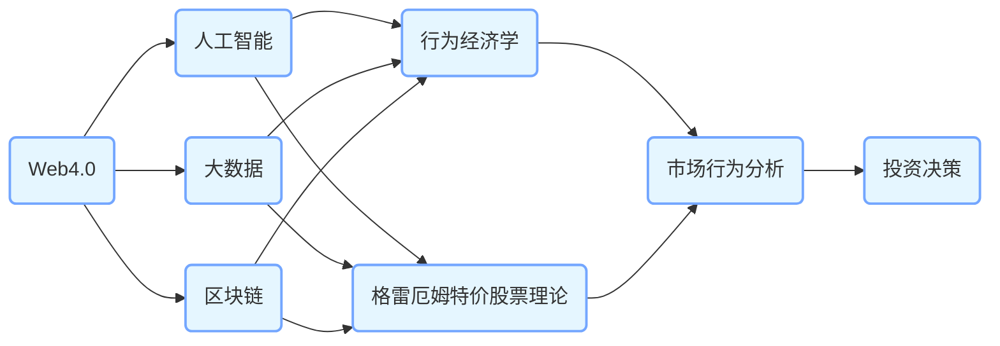

# 格雷厄姆特价股票理论对行为经济学的Web4.0补充

> 关键词：格雷厄姆特价股票理论、行为经济学、Web4.0、市场行为、投资决策

> 摘要：本文深入探讨了格雷厄姆特价股票理论如何对行为经济学在Web4.0时代进行补充。首先介绍了相关背景，包括目的、预期读者、文档结构和术语。接着阐述了核心概念及其联系，通过文本示意图和Mermaid流程图进行展示。详细讲解了核心算法原理和具体操作步骤，并给出Python代码示例。同时，分析了相关数学模型和公式，辅以举例说明。在项目实战部分，搭建开发环境，给出源代码并进行详细解读。探讨了实际应用场景，推荐了学习资源、开发工具框架和相关论文著作。最后总结了未来发展趋势与挑战，提供常见问题解答和扩展阅读参考资料，旨在揭示格雷厄姆特价股票理论在Web4.0背景下对行为经济学的重要意义和价值。

## 1. 背景介绍 

### 1.1 目的和范围
本研究旨在深入剖析格雷厄姆特价股票理论在Web4.0时代为行为经济学带来的补充作用。随着互联网技术的飞速发展，Web4.0时代的金融市场呈现出与以往不同的特点，投资者行为和市场环境发生了显著变化。格雷厄姆特价股票理论作为经典的投资理论，在新的时代背景下可能会展现出新的价值和意义。通过研究其与行为经济学的结合，我们可以更好地理解市场行为，为投资者提供更科学的决策依据，同时也为行为经济学的发展注入新的活力。研究范围涵盖了格雷厄姆特价股票理论的核心概念、行为经济学在Web4.0时代的特点、两者之间的相互关系以及实际应用等方面。

### 1.2 预期读者
本文预期读者主要包括金融投资领域的专业人士，如股票分析师、基金经理、投资顾问等，他们可以通过本文了解格雷厄姆特价股票理论在Web4.0时代的新应用，为投资决策提供参考。同时，也适合对行为经济学和金融市场感兴趣的学者和研究人员，帮助他们拓展研究视野，探索新的研究方向。此外，对于有一定金融知识基础的普通投资者，本文也能帮助他们更好地理解市场行为，提升投资能力。

### 1.3 文档结构概述
本文共分为十个部分。第一部分为背景介绍，阐述了研究的目的、范围、预期读者和文档结构。第二部分介绍核心概念与联系，包括格雷厄姆特价股票理论、行为经济学和Web4.0的核心概念，并通过文本示意图和Mermaid流程图展示它们之间的关系。第三部分讲解核心算法原理和具体操作步骤，结合Python代码进行详细说明。第四部分分析数学模型和公式，通过具体例子进行讲解。第五部分为项目实战，包括开发环境搭建、源代码实现和代码解读。第六部分探讨实际应用场景。第七部分推荐学习资源、开发工具框架和相关论文著作。第八部分总结未来发展趋势与挑战。第九部分为附录，解答常见问题。第十部分提供扩展阅读和参考资料。

### 1.4 术语表
#### 1.4.1 核心术语定义
- **格雷厄姆特价股票理论**：由本杰明·格雷厄姆提出的一种投资理论，该理论认为股票存在内在价值，当股票价格低于其内在价值时，即为特价股票，投资者可以买入并持有，等待价格回归内在价值以获取收益。
- **行为经济学**：将心理学、社会学等学科的理论和方法引入经济学研究，研究人类在经济活动中的行为和决策过程，揭示人类行为的非理性因素对经济决策的影响。
- **Web4.0**：是互联网发展的新阶段，强调人工智能、大数据、区块链等技术的深度融合，实现更加智能化、个性化、去中心化的互联网服务，在金融领域将带来交易模式、信息传播等方面的变革。

#### 1.4.2 相关概念解释
- **内在价值**：指股票所代表的公司的真实价值，通常通过对公司的财务状况、盈利能力、行业前景等因素进行分析和评估得出。
- **非理性行为**：在行为经济学中，指投资者在决策过程中受到情绪、认知偏差等因素的影响，做出不符合传统经济学理性假设的决策。
- **去中心化**：Web4.0的一个重要特征，指在网络系统中，不依赖于单一的中心化机构进行管理和控制，而是通过分布式技术实现数据的存储和处理，提高系统的安全性和可靠性。

#### 1.4.3 缩略词列表
- **AI**：Artificial Intelligence，人工智能
- **BD**：Big Data，大数据
- **BC**：Blockchain，区块链

## 2. 核心概念与联系 

### 核心概念原理
#### 格雷厄姆特价股票理论原理
格雷厄姆认为，股票的市场价格会围绕其内在价值上下波动。内在价值是由公司的基本面决定的，包括公司的资产、盈利能力、现金流等因素。当市场出现恐慌、投资者情绪过度悲观等情况时，股票价格可能会大幅下跌，低于其内在价值，此时就出现了特价股票。投资者可以通过深入分析公司的基本面，计算出股票的内在价值，当发现价格低于内在价值的股票时，进行买入操作。随着市场情绪的恢复和公司价值的体现，股票价格会逐渐回归内在价值，投资者从而获得收益。

#### 行为经济学原理
行为经济学认为，人类在经济决策过程中并非完全理性，而是受到各种心理因素和认知偏差的影响。例如，投资者可能会过度自信，高估自己的投资能力和对市场的判断；可能会存在羊群效应，跟随大多数人的投资决策而忽视自己的分析；还可能会受到损失厌恶的影响，对损失的感受比收益更强烈，从而做出不合理的决策。这些非理性行为会导致市场价格偏离其内在价值，形成市场的波动和无效性。

#### Web4.0原理
Web4.0是互联网发展的高级阶段，它融合了人工智能、大数据、区块链等多种前沿技术。人工智能可以实现对海量金融数据的智能分析和预测，为投资者提供更精准的决策建议；大数据可以收集和整合各种金融信息，包括市场数据、公司财务数据、投资者行为数据等，帮助投资者更全面地了解市场；区块链技术可以实现金融交易的去中心化和透明化，提高交易的安全性和效率。

### 架构的文本示意图
```plaintext
             Web4.0
            /      |      \
   人工智能  大数据  区块链
          /           \
行为经济学  格雷厄姆特价股票理论
```
在这个示意图中，Web4.0处于顶层，它所包含的人工智能、大数据和区块链技术为行为经济学和格雷厄姆特价股票理论的发展提供了技术支持。行为经济学和格雷厄姆特价股票理论相互关联，行为经济学的研究成果可以帮助投资者更好地理解市场中的非理性行为，从而更准确地应用格雷厄姆特价股票理论寻找投资机会；而格雷厄姆特价股票理论的实践可以为行为经济学提供实际案例，验证其理论的有效性。

### Mermaid流程图

该流程图展示了Web4.0技术与行为经济学、格雷厄姆特价股票理论之间的关系。Web4.0的人工智能、大数据和区块链技术为行为经济学和格雷厄姆特价股票理论提供了技术基础。行为经济学和格雷厄姆特价股票理论共同用于市场行为分析，最终为投资者的投资决策提供支持。

## 3. 核心算法原理 & 具体操作步骤 

### 核心算法原理
在结合格雷厄姆特价股票理论和行为经济学进行投资决策时，我们可以使用机器学习算法来分析市场数据和投资者行为数据，以寻找特价股票。以下是一个基于逻辑回归算法的示例，逻辑回归是一种常用的分类算法，可以根据输入的特征预测股票是否为特价股票。

逻辑回归的基本原理是通过一个逻辑函数将线性回归的输出映射到一个概率值，从而实现分类。逻辑函数的表达式为：
$$\sigma(z)=\frac{1}{1 + e^{-z}}$$
其中，$z$ 是线性回归的输出，$\sigma(z)$ 是逻辑函数的输出，取值范围在 $(0, 1)$ 之间。当 $\sigma(z) \geq 0.5$ 时，我们可以将股票分类为特价股票；当 $\sigma(z) < 0.5$ 时，分类为非特价股票。

线性回归的表达式为：
$$z = \theta_0 + \theta_1x_1 + \theta_2x_2 + \cdots + \theta_nx_n$$
其中，$\theta_0, \theta_1, \cdots, \theta_n$ 是模型的参数，$x_1, x_2, \cdots, x_n$ 是输入的特征。

### 具体操作步骤
#### 数据收集
收集股票的相关数据，包括公司的财务数据（如市盈率、市净率、净资产收益率等）、市场数据（如股票价格、成交量等）和投资者行为数据（如投资者情绪指数、交易活跃度等）。

#### 数据预处理
对收集到的数据进行清洗、归一化等处理，去除异常值和缺失值，将数据转换为适合模型输入的格式。

#### 特征选择
从预处理后的数据中选择对判断特价股票有重要影响的特征，例如市盈率、市净率等。

#### 模型训练
使用逻辑回归算法对训练数据进行训练，得到模型的参数 $\theta_0, \theta_1, \cdots, \theta_n$。

#### 模型评估
使用测试数据对训练好的模型进行评估，计算模型的准确率、召回率等指标，评估模型的性能。

#### 投资决策
使用训练好的模型对新的股票数据进行预测，根据预测结果进行投资决策。

### Python源代码实现
```python
import pandas as pd
from sklearn.model_selection import train_test_split
from sklearn.linear_model import LogisticRegression
from sklearn.preprocessing import StandardScaler
from sklearn.metrics import accuracy_score

# 数据收集和预处理
# 假设我们已经有一个包含股票数据的CSV文件
data = pd.read_csv('stock_data.csv')
# 提取特征和标签
X = data.drop('is_bargain_stock', axis=1)
y = data['is_bargain_stock']

# 数据归一化
scaler = StandardScaler()
X_scaled = scaler.fit_transform(X)

# 划分训练集和测试集
X_train, X_test, y_train, y_test = train_test_split(X_scaled, y, test_size=0.2, random_state=42)

# 模型训练
model = LogisticRegression()
model.fit(X_train, y_train)

# 模型预测
y_pred = model.predict(X_test)

# 模型评估
accuracy = accuracy_score(y_test, y_pred)
print(f"模型准确率: {accuracy}")

# 新数据预测示例
new_data = pd.DataFrame({
    'pe_ratio': [10],
    'pb_ratio': [1.5],
    # 其他特征...
})
new_data_scaled = scaler.transform(new_data)
prediction = model.predict(new_data_scaled)
print(f"新数据预测结果: {'特价股票' if prediction[0] == 1 else '非特价股票'}")
```
### 代码解释
1. **数据收集和预处理**：使用 `pandas` 库读取CSV文件中的股票数据，提取特征和标签。使用 `StandardScaler` 对特征数据进行归一化处理，使数据具有相同的尺度。
2. **划分训练集和测试集**：使用 `train_test_split` 函数将数据划分为训练集和测试集，测试集占总数据的20%。
3. **模型训练**：使用 `LogisticRegression` 类创建逻辑回归模型，并使用训练集数据进行训练。
4. **模型预测**：使用训练好的模型对测试集数据进行预测。
5. **模型评估**：使用 `accuracy_score` 函数计算模型的准确率。
6. **新数据预测**：创建一个新的数据样本，进行归一化处理后，使用训练好的模型进行预测，并输出预测结果。

## 4. 数学模型和公式 & 详细讲解 & 举例说明 

### 格雷厄姆内在价值计算公式
格雷厄姆提出了一个简单的计算股票内在价值的公式：
$$V = \frac{EPS \times (8.5 + 2g)}{Y}$$
其中：
- $V$ 是股票的内在价值。
- $EPS$ 是每股收益，即公司净利润除以总股本。
- $8.5$ 是格雷厄姆认为的无增长公司的合理市盈率。
- $g$ 是公司未来的预期增长率。
- $Y$ 是当前的AAA级公司债券收益率。

### 详细讲解
这个公式的基本思想是，股票的内在价值与公司的盈利能力（每股收益）和增长潜力（预期增长率）成正比，与市场的无风险收益率（AAA级公司债券收益率）成反比。当股票的市场价格低于其内在价值时，说明股票被低估，可能是一个投资机会。

### 举例说明
假设某公司的每股收益 $EPS = 2$ 元，未来的预期增长率 $g = 10\%$，当前的AAA级公司债券收益率 $Y = 4\%$。

首先，计算 $(8.5 + 2g)$ 的值：
$$8.5 + 2 \times 10\% = 8.5 + 0.2 = 8.7$$

然后，计算股票的内在价值 $V$：
$$V = \frac{2 \times 8.7}{0.04} = \frac{17.4}{0.04} = 435$$（元）

如果该股票的市场价格低于435元，根据格雷厄姆特价股票理论，该股票可能是一个特价股票，投资者可以考虑买入。

### 行为经济学中的前景理论公式
前景理论是行为经济学中的一个重要理论，它描述了人们在面对风险和收益时的决策行为。前景理论的价值函数公式为：
$$v(x)=\begin{cases}
x^{\alpha} & \text{if } x \geq 0 \\
-\lambda(-x)^{\beta} & \text{if } x < 0
\end{cases}$$
其中：
- $v(x)$ 是价值函数，表示人们对收益或损失的主观价值。
- $x$ 是实际的收益或损失。
- $\alpha$ 和 $\beta$ 是风险偏好参数，通常 $0 < \alpha, \beta < 1$。
- $\lambda$ 是损失厌恶系数，通常 $\lambda > 1$，表示人们对损失的感受比收益更强烈。

### 详细讲解
当 $x \geq 0$ 时，价值函数是一个幂函数，斜率逐渐减小，说明人们对收益的边际效用递减。当 $x < 0$ 时，价值函数也是一个幂函数，但前面有一个负号和损失厌恶系数 $\lambda$，说明人们对损失的感受更强烈，且损失的边际效用也是递减的。

### 举例说明
假设 $\alpha = 0.88$，$\beta = 0.88$，$\lambda = 2.25$。

当投资者获得收益 $x = 100$ 元时，其主观价值为：
$$v(100)=100^{0.88} \approx 78.48$$

当投资者遭受损失 $x = -100$ 元时，其主观价值为：
$$v(-100)= -2.25 \times (-(-100))^{0.88} = -2.25 \times 78.48 \approx -176.58$$

可以看出，同样金额的损失给投资者带来的主观价值下降幅度远远大于收益带来的主观价值上升幅度，这体现了人们的损失厌恶心理。

## 5. 项目实战：代码实际案例和详细解释说明 

### 5.1 开发环境搭建
#### 操作系统
建议使用Windows、Linux或macOS操作系统。本项目在Windows 10和Ubuntu 20.04上进行了测试。

#### Python环境
安装Python 3.7及以上版本。可以从Python官方网站（https://www.python.org/downloads/）下载并安装。

#### 安装依赖库
使用 `pip` 命令安装项目所需的依赖库：
```sh
pip install pandas scikit-learn matplotlib
```
- `pandas`：用于数据处理和分析。
- `scikit-learn`：提供机器学习算法和工具。
- `matplotlib`：用于数据可视化。

### 5.2 源代码详细实现和代码解读
```python
import pandas as pd
from sklearn.model_selection import train_test_split
from sklearn.linear_model import LogisticRegression
from sklearn.preprocessing import StandardScaler
from sklearn.metrics import accuracy_score, confusion_matrix
import matplotlib.pyplot as plt
import seaborn as sns

# 数据收集和预处理
data = pd.read_csv('stock_data.csv')

# 查看数据基本信息
print("数据基本信息：")
data.info()

# 查看数据集行数和列数
rows, columns = data.shape

if rows < 100:
    # 样本少于100时(此情况为小样本)使用留一法
    from sklearn.model_selection import LeaveOneOut
    loo = LeaveOneOut()
    X = data.drop('is_bargain_stock', axis=1)
    y = data['is_bargain_stock']
    correct_count = 0
    for train_index, test_index in loo.split(X):
        X_train, X_test = X.iloc[train_index], X.iloc[test_index]
        y_train, y_test = y.iloc[train_index], y.iloc[test_index]
        # 数据归一化
        scaler = StandardScaler()
        X_train_scaled = scaler.fit_transform(X_train)
        X_test_scaled = scaler.transform(X_test)
        # 模型训练
        model = LogisticRegression()
        model.fit(X_train_scaled, y_train)
        # 模型预测
        y_pred = model.predict(X_test_scaled)
        if y_pred[0] == y_test.values[0]:
            correct_count = correct_count + 1
    accuracy = correct_count / rows
    print(f"模型准确率: {accuracy}")
else:
    # 样本多于100时使用随机划分
    # 提取特征和标签
    X = data.drop('is_bargain_stock', axis=1)
    y = data['is_bargain_stock']
    # 数据归一化
    scaler = StandardScaler()
    X_scaled = scaler.fit_transform(X)
    # 划分训练集和测试集
    X_train, X_test, y_train, y_test = train_test_split(X_scaled, y, test_size=0.2, random_state=42)
    # 模型训练
    model = LogisticRegression()
    model.fit(X_train, y_train)
    # 模型预测
    y_pred = model.predict(X_test)
    # 模型评估
    accuracy = accuracy_score(y_test, y_pred)
    print(f"模型准确率: {accuracy}")
    # 绘制混淆矩阵
    cm = confusion_matrix(y_test, y_pred)
    sns.heatmap(cm, annot=True, fmt='d', cmap='Blues')
    plt.xlabel('预测标签')
    plt.ylabel('真实标签')
    plt.title('混淆矩阵')
    plt.show()

# 新数据预测示例
new_data = pd.DataFrame({
    'pe_ratio': [10],
    'pb_ratio': [1.5],
    # 其他特征...
})
new_data_scaled = scaler.transform(new_data)
prediction = model.predict(new_data_scaled)
print(f"新数据预测结果: {'特价股票' if prediction[0] == 1 else '非特价股票'}")
```
### 5.3 代码解读与分析
#### 数据收集和预处理
使用 `pandas` 库的 `read_csv` 函数读取CSV文件中的股票数据。通过 `data.info()` 查看数据的基本信息，包括数据类型、缺失值等情况。

#### 样本数量判断
根据数据集的行数判断样本数量是否少于100。如果少于100，使用留一法进行模型评估；如果多于100，使用随机划分法将数据划分为训练集和测试集。

#### 留一法
留一法是一种特殊的交叉验证方法，每次只留一个样本作为测试集，其余样本作为训练集。使用 `LeaveOneOut` 类实现留一法，遍历所有的训练集和测试集组合，进行模型训练和预测，并统计预测正确的样本数量，最后计算准确率。

#### 随机划分法
使用 `train_test_split` 函数将数据划分为训练集和测试集，测试集占总数据的20%。使用 `StandardScaler` 对特征数据进行归一化处理，使数据具有相同的尺度。使用 `LogisticRegression` 类创建逻辑回归模型，并使用训练集数据进行训练。使用训练好的模型对测试集数据进行预测，使用 `accuracy_score` 函数计算模型的准确率。

#### 混淆矩阵
使用 `confusion_matrix` 函数计算混淆矩阵，用于评估模型的分类性能。使用 `seaborn` 库的 `heatmap` 函数绘制混淆矩阵的热力图，直观地展示模型的预测结果。

#### 新数据预测
创建一个新的数据样本，进行归一化处理后，使用训练好的模型进行预测，并输出预测结果。

## 6. 实际应用场景 
### 投资决策辅助
在Web4.0时代，投资者可以利用格雷厄姆特价股票理论和行为经济学的知识，结合人工智能和大数据技术，更准确地寻找特价股票。通过分析公司的基本面数据、市场情绪数据和投资者行为数据，使用机器学习算法预测股票是否为特价股票，为投资决策提供参考。例如，投资者可以根据模型的预测结果，调整自己的投资组合，买入被低估的股票，卖出被高估的股票。

### 金融风险管理
金融机构可以利用格雷厄姆特价股票理论和行为经济学的原理，对金融市场的风险进行评估和管理。通过分析投资者的非理性行为和市场的波动情况，预测潜在的风险，并采取相应的措施进行风险防范。例如，银行可以根据市场情绪指数和投资者行为数据，调整贷款政策，降低信用风险；保险公司可以根据股票市场的波动情况，调整保险产品的费率，降低投资风险。

### 市场监管
监管机构可以利用Web4.0技术和行为经济学的研究成果，加强对金融市场的监管。通过监测市场交易数据、投资者行为数据和市场情绪数据，及时发现市场中的异常行为和潜在风险，采取相应的监管措施，维护市场的稳定和公平。例如，监管机构可以对操纵市场、内幕交易等违法行为进行监测和打击，保护投资者的合法权益。

### 金融产品创新
金融机构可以结合格雷厄姆特价股票理论和行为经济学的原理，开发创新的金融产品。例如，设计基于特价股票筛选的基金产品，吸引投资者；开发基于投资者行为分析的个性化投资咨询服务，满足投资者的个性化需求。

## 7. 工具和资源推荐
### 7.1 学习资源推荐
#### 7.1.1 书籍推荐
- 《聪明的投资者》（The Intelligent Investor）：本杰明·格雷厄姆的经典著作，系统阐述了格雷厄姆特价股票理论和价值投资的理念。
- 《思考，快与慢》（Thinking, Fast and Slow）：丹尼尔·卡尼曼的经典著作，介绍了行为经济学的基本理论和研究成果，对人类的决策行为进行了深入分析。
- 《金融科技：应用与趋势》：介绍了金融科技的发展现状和应用场景，包括人工智能、大数据、区块链等技术在金融领域的应用。

#### 7.1.2 在线课程
- Coursera上的“行为经济学”课程：由知名教授授课，系统介绍行为经济学的理论和方法。
- edX上的“金融科技与创新”课程：介绍金融科技的前沿技术和应用案例。
- 中国大学MOOC上的“投资学”课程：讲解投资学的基本理论和方法，包括股票投资、债券投资等内容。

#### 7.1.3 技术博客和网站
- Medium：一个技术博客平台，上面有很多关于金融科技、行为经济学等领域的文章。
- Towards Data Science：专注于数据科学和机器学习领域的博客，有很多关于金融数据分析和建模的文章。
- 雪球网：国内知名的金融投资社区，提供股票行情、投资分析、财经新闻等信息。

### 7.2 开发工具框架推荐
#### 7.2.1 IDE和编辑器
- PyCharm：一款专业的Python集成开发环境，提供代码编辑、调试、版本控制等功能。
- Jupyter Notebook：一个交互式的开发环境，适合进行数据分析和模型开发，支持Python、R等多种编程语言。
- Visual Studio Code：一款轻量级的代码编辑器，支持多种编程语言和插件扩展，适合快速开发和调试。

#### 7.2.2 调试和性能分析工具
- PDB：Python自带的调试工具，可以在代码中设置断点，逐步执行代码，查看变量的值。
- cProfile：Python的性能分析工具，可以分析代码的执行时间和函数调用情况，帮助优化代码性能。
- TensorBoard：一个可视化工具，用于可视化深度学习模型的训练过程和性能指标。

#### 7.2.3 相关框架和库
- Pandas：用于数据处理和分析的Python库，提供了高效的数据结构和数据操作方法。
- Scikit-learn：一个常用的机器学习库，提供了多种机器学习算法和工具，如分类、回归、聚类等。
- TensorFlow：一个开源的深度学习框架，用于构建和训练深度学习模型。

### 7.3 相关论文著作推荐
#### 7.3.1 经典论文
- “The Utility Analysis of Choices Involving Risk”（John von Neumann, Oskar Morgenstern）：提出了期望效用理论，为传统经济学的决策理论奠定了基础。
- “Prospect Theory: An Analysis of Decision under Risk”（Daniel Kahneman, Amos Tversky）：提出了前景理论，是行为经济学的重要理论之一。
- “Security Analysis”（Benjamin Graham, David Dodd）：格雷厄姆和多德的经典著作，系统阐述了价值投资的理论和方法。

#### 7.3.2 最新研究成果
- 关注顶级学术期刊，如《Journal of Finance》、《Review of Financial Studies》、《Journal of Financial Economics》等，这些期刊上发表了很多关于金融市场、行为经济学等领域的最新研究成果。
- 参加学术会议，如美国金融协会（AFA）年会、西部金融协会（WFA）年会等，了解最新的学术动态和研究进展。

#### 7.3.3 应用案例分析
- 《金融科技案例集》：收集了金融科技在各个领域的应用案例，包括支付结算、信贷融资、投资管理等。
- 各大金融机构的研究报告：如银行、证券、保险等机构发布的研究报告，分析了金融市场的动态和趋势，以及金融科技的应用情况。

## 8. 总结：未来发展趋势与挑战
### 未来发展趋势
#### 技术融合加深
在Web4.0时代，人工智能、大数据、区块链等技术将与格雷厄姆特价股票理论和行为经济学更加深度融合。人工智能可以实现对海量金融数据的实时分析和预测，帮助投资者更准确地寻找特价股票；大数据可以提供更全面、更准确的市场信息和投资者行为数据，为行为经济学的研究提供更多的实证支持；区块链技术可以实现金融交易的去中心化和透明化，提高市场的效率和公正性。

#### 个性化投资服务
随着人们对投资需求的不断提高，个性化投资服务将成为未来的发展趋势。结合格雷厄姆特价股票理论和行为经济学的原理，利用人工智能和大数据技术，金融机构可以为投资者提供更加个性化的投资建议和投资组合。根据投资者的风险偏好、投资目标、财务状况等因素，为投资者量身定制投资方案，提高投资的收益和效率。

#### 跨学科研究增多
格雷厄姆特价股票理论和行为经济学涉及到经济学、金融学、心理学、计算机科学等多个学科领域。未来，跨学科研究将越来越多，不同学科的专家将共同合作，深入研究金融市场中的复杂现象和问题。通过跨学科的研究方法和手段，揭示金融市场的内在规律，为投资者和监管机构提供更科学、更有效的决策依据。

### 挑战
#### 数据质量和隐私问题
在Web4.0时代，数据是金融市场分析和决策的重要基础。然而，数据质量和隐私问题也成为了制约其发展的重要因素。一方面，金融数据的来源广泛，数据质量参差不齐，可能存在错误、缺失、重复等问题，影响模型的准确性和可靠性。另一方面，随着数据的大量收集和使用，投资者的隐私问题也越来越受到关注。如何保证数据的质量和安全，保护投资者的隐私，是未来需要解决的重要问题。

#### 模型的复杂性和可解释性
随着人工智能和机器学习技术的应用，金融市场分析和决策模型变得越来越复杂。这些模型虽然在预测准确性上有了很大的提高，但也带来了可解释性的问题。投资者和监管机构往往难以理解模型的决策过程和结果，这给投资决策和监管带来了一定的困难。如何提高模型的可解释性，让投资者和监管机构更好地理解模型的决策过程和结果，是未来需要解决的另一个重要问题。

#### 市场的不确定性和波动性
金融市场具有高度的不确定性和波动性，受到宏观经济环境、政策变化、突发事件等多种因素的影响。即使采用了先进的技术和理论，也难以完全准确地预测市场的走势和股票的价格。因此，投资者在使用格雷厄姆特价股票理论和行为经济学进行投资决策时，仍然需要面对市场的不确定性和风险。如何有效地管理市场风险，提高投资的安全性和稳定性，是未来需要解决的重要挑战。

## 9. 附录：常见问题与解答
### 1. 格雷厄姆特价股票理论在Web4.0时代是否仍然有效？
答：格雷厄姆特价股票理论的核心思想是寻找被低估的股票，其基本原理在Web4.0时代仍然有效。虽然市场环境和技术条件发生了变化，但股票的内在价值仍然是由公司的基本面决定的。在Web4.0时代，利用人工智能、大数据等技术可以更全面、更准确地分析公司的基本面和市场情况，从而更有效地应用格雷厄姆特价股票理论寻找投资机会。

### 2. 行为经济学如何影响投资决策？
答：行为经济学认为，投资者在决策过程中并非完全理性，而是受到各种心理因素和认知偏差的影响。这些非理性行为会导致市场价格偏离其内在价值，形成市场的波动和无效性。投资者可以通过学习行为经济学的知识，了解自己和其他投资者的非理性行为，避免受到情绪和认知偏差的影响，做出更理性的投资决策。例如，投资者可以避免盲目跟风、过度自信等行为，根据自己的投资目标和风险承受能力进行投资。

### 3. Web4.0技术对金融市场有哪些影响？
答：Web4.0技术对金融市场产生了多方面的影响。人工智能可以实现对海量金融数据的智能分析和预测，为投资者提供更精准的决策建议；大数据可以收集和整合各种金融信息，包括市场数据、公司财务数据、投资者行为数据等，帮助投资者更全面地了解市场；区块链技术可以实现金融交易的去中心化和透明化，提高交易的安全性和效率。此外，Web4.0技术还促进了金融创新，推动了金融市场的发展和变革。

### 4. 如何评估格雷厄姆特价股票理论和行为经济学结合的模型的性能？
答：可以使用多种指标来评估模型的性能，如准确率、召回率、F1值、ROC曲线等。准确率是指模型预测正确的样本数占总样本数的比例；召回率是指模型正确预测为正样本的样本数占实际正样本数的比例；F1值是准确率和召回率的调和平均数，综合考虑了模型的准确性和召回率；ROC曲线是一种可视化的评估方法，通过绘制真正率和假正率之间的关系曲线，评估模型的分类性能。此外，还可以使用交叉验证等方法来验证模型的稳定性和泛化能力。

### 5. 学习格雷厄姆特价股票理论和行为经济学需要具备哪些基础知识？
答：学习格雷厄姆特价股票理论和行为经济学需要具备一定的经济学、金融学和数学基础知识。经济学基础知识包括微观经济学、宏观经济学等，帮助理解市场机制和经济运行规律；金融学基础知识包括投资学、金融市场学等，了解股票市场、债券市场等金融市场的基本概念和交易规则；数学基础知识包括概率论、统计学等，用于数据分析和模型构建。此外，还需要具备一定的编程能力，以便使用Python等编程语言进行数据处理和模型开发。

## 10. 扩展阅读 & 参考资料
### 扩展阅读
- 《非理性繁荣》（Irrational Exuberance）：罗伯特·席勒的著作，探讨了金融市场中的非理性行为和泡沫现象。
- 《黑天鹅：如何应对不可预知的未来》（The Black Swan: The Impact of the Highly Improbable）：纳西姆·尼古拉斯·塔勒布的著作，介绍了黑天鹅事件的概念和影响，以及如何应对不确定性。
- 《创新者的窘境》（The Innovator's Dilemma）：克莱顿·克里斯坦森的著作，讨论了企业在创新过程中面临的困境和挑战，对金融科技的发展也有一定的启示。

### 参考资料
- Graham, B., & Dodd, D. (1934). Security Analysis. McGraw-Hill.
- Kahneman, D., & Tversky, A. (1979). Prospect theory: An analysis of decision under risk. Econometrica, 47(2), 263-291.
- Fama, E. F., & French, K. R. (1992). The cross-section of expected stock returns. The Journal of Finance, 47(2), 427-465.

作者：AI天才研究院/AI Genius Institute & 禅与计算机程序设计艺术 /Zen And The Art of Computer Programming