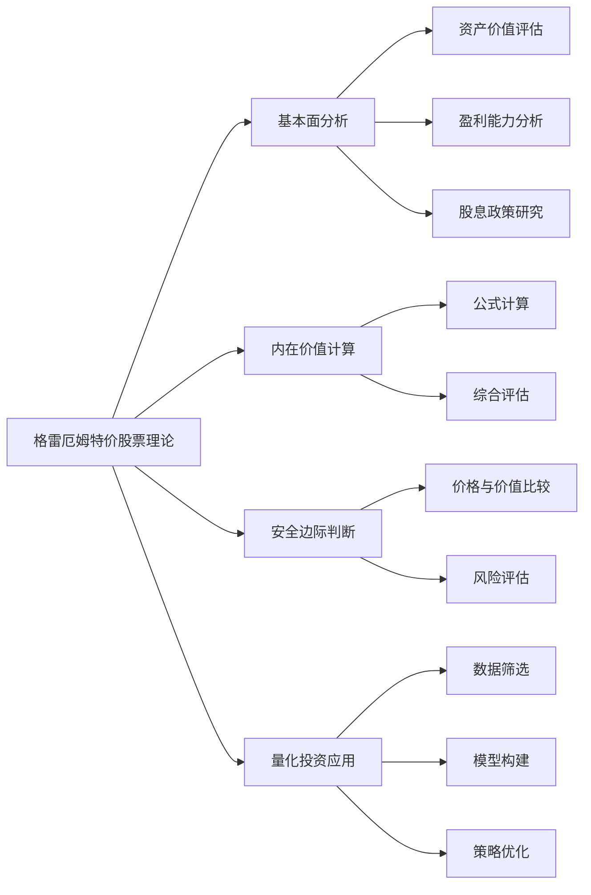

# 格雷厄姆特价股票理论对量化投资的影响

> 关键词：格雷厄姆特价股票理论、量化投资、价值评估、投资策略、市场效率

> 摘要：本文深入探讨了格雷厄姆特价股票理论对量化投资的影响。首先介绍了该理论的背景，包括其目的、预期读者、文档结构和相关术语。接着阐述了格雷厄姆特价股票理论的核心概念及与量化投资的联系，并通过示意图和流程图进行说明。详细讲解了该理论相关的核心算法原理和具体操作步骤，同时给出Python源代码示例。还介绍了涉及的数学模型和公式，并举例说明。通过项目实战，展示了该理论在量化投资中的代码实现和分析。分析了该理论在实际中的应用场景，推荐了相关的学习资源、开发工具框架和论文著作。最后总结了该理论对量化投资未来发展的趋势与挑战，解答了常见问题，并提供了扩展阅读和参考资料。

## 1. 背景介绍 
### 1.1 目的和范围
格雷厄姆特价股票理论是由投资大师本杰明·格雷厄姆（Benjamin Graham）提出的一种价值投资理念。本文章的目的在于深入剖析该理论如何影响量化投资领域，包括其在量化投资策略制定、股票筛选、风险控制等方面的作用。范围涵盖了从理论基础到实际应用的各个层面，旨在为投资者和研究者提供全面且深入的理解。

### 1.2 预期读者
本文预期读者包括量化投资从业者、金融分析师、学术研究人员以及对价值投资和量化投资感兴趣的个人。无论是专业人士寻求理论与实践的结合，还是初学者希望了解量化投资的基础知识，都能从本文中获得有价值的信息。

### 1.3 文档结构概述
本文首先介绍格雷厄姆特价股票理论的相关背景知识，包括术语定义和概念解释。接着阐述该理论的核心概念以及与量化投资的联系，并通过示意图和流程图进行直观展示。然后详细讲解核心算法原理和具体操作步骤，结合Python代码进行说明。之后介绍相关的数学模型和公式，并举例说明其应用。通过项目实战，展示该理论在量化投资中的具体实现和代码分析。分析该理论在实际中的应用场景，推荐学习资源、开发工具框架和论文著作。最后总结未来发展趋势与挑战，解答常见问题，并提供扩展阅读和参考资料。

### 1.4 术语表
#### 1.4.1 核心术语定义
- **格雷厄姆特价股票理论**：本杰明·格雷厄姆提出的一种投资理论，强调寻找被市场低估的股票，通过分析公司的基本面，如资产价值、盈利能力等，来确定股票的内在价值，并以低于内在价值的价格买入。
- **量化投资**：利用数学模型和计算机算法，对海量的金融数据进行分析和处理，以制定投资策略和决策的投资方法。
- **内在价值**：股票所代表的公司的真实价值，通常通过对公司的财务报表、行业前景等因素进行分析和评估得出。
- **安全边际**：股票的市场价格与内在价值之间的差额，是格雷厄姆投资理论中的重要概念，用于衡量投资的风险程度。

#### 1.4.2 相关概念解释
- **价值投资**：基于对公司内在价值的分析，寻找被低估的股票进行投资的策略，强调长期投资和基本面分析。
- **量化分析**：运用数学和统计学方法，对金融数据进行量化处理和分析，以发现投资机会和规律。
- **基本面分析**：通过研究公司的财务报表、行业竞争状况、宏观经济环境等基本面因素，来评估公司的价值和前景。

#### 1.4.3 缩略词列表
- **PE**：市盈率（Price-to-Earnings Ratio），是股票价格与每股收益的比率，用于衡量股票的估值水平。
- **PB**：市净率（Price-to-Book Ratio），是股票价格与每股净资产的比率，反映了股票价格相对于公司净资产的倍数。
- **ROE**：净资产收益率（Return on Equity），是净利润与股东权益的比率，衡量公司运用自有资本的效率。

## 2. 核心概念与联系 
### 核心概念原理
格雷厄姆特价股票理论的核心原理是通过对公司基本面的深入分析，确定股票的内在价值，并寻找那些市场价格低于内在价值的股票进行投资。该理论认为，市场有时会出现非理性的波动，导致股票价格偏离其内在价值，投资者可以利用这种价格与价值的差异来获取超额收益。

内在价值的评估通常基于公司的资产价值、盈利能力、股息政策等因素。例如，格雷厄姆提出了一种简单的内在价值计算公式：

$V = EPS \times (8.5 + 2g)$

其中，$V$ 表示内在价值，$EPS$ 表示每股收益，$g$ 表示预期的长期增长率。

安全边际是格雷厄姆理论中的另一个重要概念。它是指股票的市场价格低于内在价值的幅度，安全边际越大，投资的风险就越低。投资者应该在有足够安全边际的情况下买入股票，以确保在市场出现不利变化时仍能获得一定的收益。

### 与量化投资的联系
格雷厄姆特价股票理论为量化投资提供了重要的理论基础和投资理念。量化投资可以通过计算机算法和数学模型，对大量的股票数据进行筛选和分析，快速找出符合格雷厄姆理论的特价股票。例如，可以利用量化模型计算股票的内在价值和安全边际，筛选出那些内在价值高于市场价格且安全边际较大的股票。

同时，量化投资还可以对格雷厄姆理论进行优化和拓展。通过引入更多的因素和指标，如技术分析指标、市场情绪指标等，可以提高投资策略的准确性和有效性。此外，量化投资还可以对投资组合进行动态调整，根据市场变化及时调整持仓，降低投资风险。

### 文本示意图
```plaintext
格雷厄姆特价股票理论
|
|-- 基本面分析
|   |-- 资产价值评估
|   |-- 盈利能力分析
|   |-- 股息政策研究
|
|-- 内在价值计算
|   |-- 公式计算
|   |-- 综合评估
|
|-- 安全边际判断
|   |-- 价格与价值比较
|   |-- 风险评估
|
|-- 量化投资应用
|   |-- 数据筛选
|   |-- 模型构建
|   |-- 策略优化
```

### Mermaid 流程图


## 3. 核心算法原理 & 具体操作步骤 
### 核心算法原理
在量化投资中应用格雷厄姆特价股票理论，核心算法主要围绕内在价值计算和安全边际判断展开。以下是一个简化的算法步骤：

1. **数据收集**：收集股票的相关数据，包括财务报表数据（如每股收益、每股净资产等）、市场价格数据等。
2. **内在价值计算**：根据格雷厄姆的内在价值计算公式或其他改进的公式，计算股票的内在价值。
3. **安全边际计算**：计算股票的市场价格与内在价值之间的差额，即安全边际。
4. **股票筛选**：筛选出安全边际较大的股票，构建投资组合。
5. **投资组合调整**：根据市场变化和股票的表现，定期调整投资组合。

### 具体操作步骤
#### 步骤 1：数据收集
可以使用Python的`pandas`和`pandas-datareader`库来收集股票的财务数据和市场价格数据。以下是一个简单的示例代码：

```python
import pandas as pd
import pandas_datareader.data as web

# 定义股票代码和数据日期范围
ticker = 'AAPL'
start_date = '2020-01-01'
end_date = '2023-01-01'

# 收集股票的市场价格数据
price_data = web.DataReader(ticker, 'yahoo', start_date, end_date)

# 假设我们可以从其他数据源获取财务数据，这里简单模拟
financial_data = {
    'EPS': 5.0,
    'BookValuePerShare': 20.0
}
```

#### 步骤 2：内在价值计算
根据格雷厄姆的内在价值计算公式，计算股票的内在价值。以下是示例代码：

```python
# 假设预期的长期增长率为10%
g = 0.1

# 计算内在价值
EPS = financial_data['EPS']
V = EPS * (8.5 + 2 * g)
print(f"内在价值: {V}")
```

#### 步骤 3：安全边际计算
计算股票的市场价格与内在价值之间的差额，即安全边际。以下是示例代码：

```python
# 获取最新的市场价格
latest_price = price_data['Close'][-1]

# 计算安全边际
margin_of_safety = (V - latest_price) / V
print(f"安全边际: {margin_of_safety}")
```

#### 步骤 4：股票筛选
根据安全边际的大小，筛选出符合条件的股票。以下是示例代码：

```python
# 假设安全边际阈值为0.2
threshold = 0.2

if margin_of_safety > threshold:
    print("该股票符合格雷厄姆特价股票条件，可以考虑投资。")
else:
    print("该股票不符合条件，不建议投资。")
```

#### 步骤 5：投资组合调整
根据市场变化和股票的表现，定期调整投资组合。这部分代码较为复杂，需要考虑多个因素，如风险控制、收益目标等。以下是一个简单的示例：

```python
# 假设我们有一个投资组合，包含多只股票
portfolio = {
    'AAPL': 0.2,
    'MSFT': 0.3,
    'GOOG': 0.5
}

# 定期检查投资组合中股票的安全边际
for ticker, weight in portfolio.items():
    # 重复步骤1-3，计算该股票的安全边际
    #...

    # 如果安全边际不符合条件，调整投资组合
    if margin_of_safety < threshold:
        portfolio[ticker] = 0
        print(f"卖出 {ticker} 股票。")

# 重新平衡投资组合
total_weight = sum(portfolio.values())
for ticker in portfolio:
    portfolio[ticker] = portfolio[ticker] / total_weight

print("调整后的投资组合:", portfolio)
```

## 4. 数学模型和公式 & 详细讲解 & 举例说明 
### 内在价值计算公式
格雷厄姆提出的内在价值计算公式为：

$$V = EPS \times (8.5 + 2g)$$

其中，$V$ 表示内在价值，$EPS$ 表示每股收益，$g$ 表示预期的长期增长率。

#### 详细讲解
- **每股收益（$EPS$）**：是指公司净利润除以发行在外的普通股股数，反映了公司的盈利能力。每股收益越高，说明公司的盈利能力越强，股票的内在价值也越高。
- **预期的长期增长率（$g$）**：是指公司未来一段时间内的盈利增长率。预期增长率越高，说明公司的发展前景越好，股票的内在价值也越高。
- **常数 8.5**：是格雷厄姆根据历史数据和经验得出的一个常数，代表了在无增长情况下股票的合理市盈率。

#### 举例说明
假设某公司的每股收益为 $EPS = 3$ 元，预期的长期增长率为 $g = 0.1$（即 10%），则该公司股票的内在价值为：

$$V = 3 \times (8.5 + 2 \times 0.1) = 3 \times 8.7 = 26.1$$（元）

### 安全边际计算公式
安全边际的计算公式为：

$$Margin\ of\ Safety = \frac{V - P}{V}$$

其中，$Margin\ of\ Safety$ 表示安全边际，$V$ 表示内在价值，$P$ 表示市场价格。

#### 详细讲解
安全边际反映了股票的市场价格低于内在价值的幅度，安全边际越大，说明股票的投资风险越小。当安全边际为正数时，说明股票的市场价格低于内在价值，存在投资机会；当安全边际为负数时，说明股票的市场价格高于内在价值，投资风险较大。

#### 举例说明
假设某股票的内在价值为 $V = 50$ 元，市场价格为 $P = 40$ 元，则该股票的安全边际为：

$$Margin\ of\ Safety = \frac{50 - 40}{50} = 0.2$$（即 20%）

这意味着该股票的市场价格低于内在价值 20%，具有一定的安全边际，可以考虑投资。

### 投资组合优化模型
在量化投资中，通常需要对投资组合进行优化，以实现风险最小化和收益最大化的目标。常用的投资组合优化模型是马科维茨的均值 - 方差模型。

该模型的目标是在给定预期收益率的情况下，最小化投资组合的方差（即风险）。其数学表达式为：

$$\min_{w} \sigma_p^2 = w^T \Sigma w$$

$$s.t. \quad w^T \mu = \mu_p$$

$$\sum_{i=1}^{n} w_i = 1$$

$$w_i \geq 0, \quad i = 1, 2, \cdots, n$$

其中，$w$ 是投资组合中各股票的权重向量，$\sigma_p^2$ 是投资组合的方差，$\Sigma$ 是股票收益率的协方差矩阵，$\mu$ 是股票的预期收益率向量，$\mu_p$ 是投资组合的预期收益率，$n$ 是股票的数量。

#### 详细讲解
- **目标函数**：$\min_{w} \sigma_p^2 = w^T \Sigma w$ 表示最小化投资组合的方差，即风险。
- **约束条件**：
  - $w^T \mu = \mu_p$ 表示投资组合的预期收益率等于给定的预期收益率 $\mu_p$。
  - $\sum_{i=1}^{n} w_i = 1$ 表示投资组合中各股票的权重之和等于 1。
  - $w_i \geq 0, \quad i = 1, 2, \cdots, n$ 表示各股票的权重不能为负数，即不允许卖空。

#### 举例说明
假设我们有三只股票 A、B、C，它们的预期收益率分别为 $\mu_A = 0.1$，$\mu_B = 0.15$，$\mu_C = 0.2$，收益率的协方差矩阵为：

$$\Sigma = \begin{bmatrix}
0.04 & 0.02 & 0.01 \\
0.02 & 0.09 & 0.03 \\
0.01 & 0.03 & 0.16
\end{bmatrix}$$

我们希望构建一个预期收益率为 $\mu_p = 0.18$ 的投资组合，使用 Python 的`cvxpy`库来求解该优化问题：

```python
import cvxpy as cp
import numpy as np

# 预期收益率向量
mu = np.array([0.1, 0.15, 0.2])

# 协方差矩阵
Sigma = np.array([[0.04, 0.02, 0.01],
                  [0.02, 0.09, 0.03],
                  [0.01, 0.03, 0.16]])

# 投资组合权重向量
w = cp.Variable(3)

# 预期收益率约束
mu_p = 0.18
constraints = [w @ mu == mu_p,
               cp.sum(w) == 1,
               w >= 0]

# 目标函数：最小化方差
objective = cp.Minimize(cp.quad_form(w, Sigma))

# 构建问题并求解
prob = cp.Problem(objective, constraints)
prob.solve()

# 输出最优权重
print("最优权重:", w.value)
```

运行上述代码，即可得到最优的投资组合权重。

## 5. 项目实战：代码实际案例和详细解释说明 
### 5.1  开发环境搭建
#### 安装 Python
首先需要安装 Python 环境，建议使用 Python 3.7 及以上版本。可以从 Python 官方网站（https://www.python.org/downloads/）下载安装包，按照安装向导进行安装。

#### 安装必要的库
在项目中，需要使用一些 Python 库来进行数据收集、处理和分析。可以使用`pip`命令来安装这些库：

```sh
pip install pandas pandas-datareader numpy cvxpy
```

### 5.2  源代码详细实现和代码解读
以下是一个完整的项目实战代码示例，用于基于格雷厄姆特价股票理论构建量化投资策略：

```python
import pandas as pd
import pandas_datareader.data as web
import numpy as np
import cvxpy as cp

# 定义股票代码列表
tickers = ['AAPL', 'MSFT', 'GOOG']

# 定义数据日期范围
start_date = '2020-01-01'
end_date = '2023-01-01'

# 收集股票的市场价格数据
price_data = {}
for ticker in tickers:
    price_data[ticker] = web.DataReader(ticker, 'yahoo', start_date, end_date)

# 假设我们可以从其他数据源获取财务数据，这里简单模拟
financial_data = {
    'AAPL': {'EPS': 5.0, 'BookValuePerShare': 20.0},
    'MSFT': {'EPS': 3.0, 'BookValuePerShare': 15.0},
    'GOOG': {'EPS': 4.0, 'BookValuePerShare': 18.0}
}

# 计算内在价值和安全边际
intrinsic_values = {}
margins_of_safety = {}
for ticker in tickers:
    # 假设预期的长期增长率为10%
    g = 0.1

    # 计算内在价值
    EPS = financial_data[ticker]['EPS']
    V = EPS * (8.5 + 2 * g)
    intrinsic_values[ticker] = V

    # 获取最新的市场价格
    latest_price = price_data[ticker]['Close'][-1]

    # 计算安全边际
    margin_of_safety = (V - latest_price) / V
    margins_of_safety[ticker] = margin_of_safety

# 筛选出安全边际较大的股票
threshold = 0.2
selected_stocks = []
for ticker in tickers:
    if margins_of_safety[ticker] > threshold:
        selected_stocks.append(ticker)

print("筛选出的股票:", selected_stocks)

# 构建投资组合
if len(selected_stocks) > 0:
    # 计算预期收益率和协方差矩阵
    returns = pd.DataFrame()
    for ticker in selected_stocks:
        returns[ticker] = price_data[ticker]['Close'].pct_change()
    returns = returns.dropna()

    mu = returns.mean().values
    Sigma = returns.cov().values

    # 投资组合权重向量
    n = len(selected_stocks)
    w = cp.Variable(n)

    # 预期收益率约束
    mu_p = 0.15
    constraints = [w @ mu == mu_p,
                   cp.sum(w) == 1,
                   w >= 0]

    # 目标函数：最小化方差
    objective = cp.Minimize(cp.quad_form(w, Sigma))

    # 构建问题并求解
    prob = cp.Problem(objective, constraints)
    prob.solve()

    # 输出最优权重
    portfolio_weights = dict(zip(selected_stocks, w.value))
    print("最优投资组合权重:", portfolio_weights)
else:
    print("没有符合条件的股票，无法构建投资组合。")
```

### 5.3  代码解读与分析
#### 数据收集部分
```python
# 定义股票代码列表
tickers = ['AAPL', 'MSFT', 'GOOG']

# 定义数据日期范围
start_date = '2020-01-01'
end_date = '2023-01-01'

# 收集股票的市场价格数据
price_data = {}
for ticker in tickers:
    price_data[ticker] = web.DataReader(ticker, 'yahoo', start_date, end_date)
```
这部分代码定义了要分析的股票代码列表和数据日期范围，使用`pandas-datareader`库从雅虎财经获取股票的市场价格数据，并将数据存储在字典`price_data`中。

#### 内在价值和安全边际计算部分
```python
# 假设我们可以从其他数据源获取财务数据，这里简单模拟
financial_data = {
    'AAPL': {'EPS': 5.0, 'BookValuePerShare': 20.0},
    'MSFT': {'EPS': 3.0, 'BookValuePerShare': 15.0},
    'GOOG': {'EPS': 4.0, 'BookValuePerShare': 18.0}
}

# 计算内在价值和安全边际
intrinsic_values = {}
margins_of_safety = {}
for ticker in tickers:
    # 假设预期的长期增长率为10%
    g = 0.1

    # 计算内在价值
    EPS = financial_data[ticker]['EPS']
    V = EPS * (8.5 + 2 * g)
    intrinsic_values[ticker] = V

    # 获取最新的市场价格
    latest_price = price_data[ticker]['Close'][-1]

    # 计算安全边际
    margin_of_safety = (V - latest_price) / V
    margins_of_safety[ticker] = margin_of_safety
```
这部分代码模拟了从其他数据源获取股票的财务数据，使用格雷厄姆的内在价值计算公式计算每只股票的内在价值，并计算安全边际。将计算结果存储在字典`intrinsic_values`和`margins_of_safety`中。

#### 股票筛选部分
```python
# 筛选出安全边际较大的股票
threshold = 0.2
selected_stocks = []
for ticker in tickers:
    if margins_of_safety[ticker] > threshold:
        selected_stocks.append(ticker)

print("筛选出的股票:", selected_stocks)
```
这部分代码根据安全边际的阈值筛选出符合条件的股票，并将筛选结果存储在列表`selected_stocks`中。

#### 投资组合构建部分
```python
# 构建投资组合
if len(selected_stocks) > 0:
    # 计算预期收益率和协方差矩阵
    returns = pd.DataFrame()
    for ticker in selected_stocks:
        returns[ticker] = price_data[ticker]['Close'].pct_change()
    returns = returns.dropna()

    mu = returns.mean().values
    Sigma = returns.cov().values

    # 投资组合权重向量
    n = len(selected_stocks)
    w = cp.Variable(n)

    # 预期收益率约束
    mu_p = 0.15
    constraints = [w @ mu == mu_p,
                   cp.sum(w) == 1,
                   w >= 0]

    # 目标函数：最小化方差
    objective = cp.Minimize(cp.quad_form(w, Sigma))

    # 构建问题并求解
    prob = cp.Problem(objective, constraints)
    prob.solve()

    # 输出最优权重
    portfolio_weights = dict(zip(selected_stocks, w.value))
    print("最优投资组合权重:", portfolio_weights)
else:
    print("没有符合条件的股票，无法构建投资组合。")
```
这部分代码在筛选出的股票基础上，计算预期收益率和协方差矩阵，使用马科维茨的均值 - 方差模型构建投资组合，并求解最优的投资组合权重。如果没有符合条件的股票，则输出提示信息。

## 6. 实际应用场景 
### 个人投资者
对于个人投资者来说，格雷厄姆特价股票理论可以帮助他们筛选出被低估的股票，构建稳健的投资组合。个人投资者可以使用量化投资工具和方法，根据该理论的原则进行股票筛选和投资决策，降低投资风险，提高投资收益。例如，个人投资者可以通过分析公司的财务报表，计算股票的内在价值和安全边际，选择那些安全边际较大的股票进行投资。

### 基金管理公司
基金管理公司可以将格雷厄姆特价股票理论融入到量化投资策略中，开发出基于该理论的基金产品。通过大规模的数据筛选和分析，基金管理公司可以快速找出符合条件的股票，构建投资组合，并根据市场变化及时调整持仓。这种策略可以帮助基金管理公司提高投资效率，降低管理成本，为投资者带来更好的回报。

### 金融研究机构
金融研究机构可以利用格雷厄姆特价股票理论进行学术研究和市场分析。通过对历史数据的回测和实证研究，研究机构可以深入了解该理论在不同市场环境下的有效性和局限性，为投资者和监管机构提供决策参考。此外，研究机构还可以基于该理论开发新的投资模型和策略，推动量化投资领域的发展。

### 风险管理部门
风险管理部门可以将格雷厄姆特价股票理论作为一种风险管理工具，用于评估投资组合的风险水平。通过计算股票的安全边际和投资组合的风险指标，风险管理部门可以及时发现潜在的风险，并采取相应的措施进行风险控制。例如，当投资组合中的某些股票安全边际下降时，风险管理部门可以建议减少这些股票的持仓，降低投资组合的风险。

## 7. 工具和资源推荐
### 7.1 学习资源推荐
#### 7.1.1 书籍推荐
- 《聪明的投资者》（The Intelligent Investor）：本杰明·格雷厄姆的经典著作，详细阐述了价值投资的理念和方法，是学习格雷厄姆特价股票理论的必读之书。
- 《证券分析》（Security Analysis）：同样是本杰明·格雷厄姆的著作，被誉为投资领域的圣经，对公司基本面分析和股票估值方法进行了深入探讨。
- 《量化投资：策略与技术》：全面介绍了量化投资的理论和实践，包括量化投资策略的设计、开发和优化等方面的内容。

#### 7.1.2 在线课程
- Coursera 上的“Financial Markets”：由耶鲁大学教授罗伯特·席勒（Robert Shiller）讲授，介绍了金融市场的基本原理和投资策略，包括价值投资和量化投资等方面的内容。
- edX 上的“Algorithmic Trading and Quantitative Analysis Using Python”：通过 Python 编程语言介绍了量化投资的基本概念和方法，包括数据处理、策略开发和回测等方面的内容。

#### 7.1.3 技术博客和网站
- Seeking Alpha：提供了大量的金融分析和投资建议，包括对格雷厄姆特价股票理论的应用和讨论。
- Quantopian：一个量化投资社区，提供了丰富的量化投资资源和工具，包括策略开发、回测和实盘交易等功能。

### 7.2 开发工具框架推荐
#### 7.2.1 IDE和编辑器
- PyCharm：一款功能强大的 Python 集成开发环境，提供了代码编辑、调试、版本控制等功能，适合开发量化投资项目。
- Jupyter Notebook：一种交互式的开发环境，支持 Python 代码的编写、运行和可视化，非常适合进行数据探索和分析。

#### 7.2.2 调试和性能分析工具
- PDB：Python 自带的调试工具，可以帮助开发者定位和解决代码中的问题。
- cProfile：Python 的性能分析工具，可以分析代码的运行时间和内存使用情况，帮助开发者优化代码性能。

#### 7.2.3 相关框架和库
- Pandas：一个强大的数据分析库，提供了高效的数据结构和数据处理方法，适合处理金融数据。
- NumPy：一个用于科学计算的 Python 库，提供了高效的数组操作和数学函数，是量化投资中常用的库之一。
- Scikit-learn：一个机器学习库，提供了丰富的机器学习算法和工具，可用于量化投资中的模型构建和预测。

### 7.3 相关论文著作推荐
#### 7.3.1 经典论文
- Graham, Benjamin, and David Dodd. "Security Analysis." McGraw-Hill, 1934. 这篇经典论文奠定了价值投资的理论基础，对格雷厄姆特价股票理论进行了系统阐述。
- Markowitz, Harry M. "Portfolio Selection." The Journal of Finance, 1952. 这篇论文提出了马科维茨的均值 - 方差模型，为投资组合优化提供了重要的理论依据。

#### 7.3.2 最新研究成果
- Fama, Eugene F., and Kenneth R. French. "Dissecting Anomalies with a Five-Factor Model." The Review of Financial Studies, 2015. 这篇论文提出了五因子模型，对传统的资本资产定价模型进行了改进，为量化投资提供了新的思路和方法。
- Jegadeesh, Narasimhan, and Sheridan Titman. "Returns to Buying Winners and Selling Losers: Implications for Stock Market Efficiency." The Journal of Finance, 1993. 这篇论文研究了动量效应，为量化投资中的动量策略提供了理论支持。

#### 7.3.3 应用案例分析
- Asness, Clifford S., Tobias J. Moskowitz, and Lasse Heje Pedersen. "Value and Momentum Everywhere." The Journal of Finance, 2013. 这篇论文通过实证研究，验证了价值和动量策略在全球不同市场的有效性，为量化投资策略的应用提供了实际案例。

## 8. 总结：未来发展趋势与挑战
### 未来发展趋势
#### 与人工智能和机器学习的融合
随着人工智能和机器学习技术的不断发展，格雷厄姆特价股票理论将与这些技术更加紧密地融合。通过深度学习算法，可以对大量的财务数据和市场数据进行更深入的分析和挖掘，提高内在价值计算和股票筛选的准确性。例如，使用神经网络模型来预测公司的未来盈利增长率，从而更精确地计算股票的内在价值。

#### 多因素模型的应用
未来的量化投资策略将不仅仅依赖于格雷厄姆的单一因素（如内在价值和安全边际），而是会综合考虑更多的因素，如技术分析指标、市场情绪指标、宏观经济因素等，构建多因素模型。多因素模型可以更全面地评估股票的投资价值，提高投资策略的有效性和稳定性。

#### 全球市场的拓展
随着全球金融市场的一体化，格雷厄姆特价股票理论将在全球范围内得到更广泛的应用。投资者可以通过量化投资工具，在全球不同市场中寻找被低估的股票，构建多元化的投资组合，降低投资风险。同时，不同市场的特点和规律也将为量化投资策略的开发提供更多的机会和挑战。

### 挑战
#### 数据质量和可靠性
量化投资依赖于大量的金融数据，数据的质量和可靠性直接影响到投资策略的有效性。在实际应用中，可能会遇到数据缺失、数据错误、数据滞后等问题，需要采取有效的数据清洗和预处理方法，提高数据的质量和可靠性。

#### 市场环境的变化
金融市场是复杂多变的，市场环境的变化可能会导致格雷厄姆特价股票理论的有效性下降。例如，在市场泡沫时期，股票价格可能会普遍高估，难以找到符合该理论的特价股票；而在市场恐慌时期，股票价格可能会过度下跌，导致安全边际的判断出现偏差。因此，需要不断调整和优化投资策略，以适应市场环境的变化。

#### 模型的复杂性和可解释性
随着量化投资策略的不断发展，模型的复杂性也在不断增加。复杂的模型可能会提高投资策略的准确性，但同时也会降低模型的可解释性。在实际应用中，投资者需要在模型的准确性和可解释性之间找到平衡，确保能够理解和信任投资策略的决策过程。

## 9. 附录：常见问题与解答
### 问题 1：格雷厄姆特价股票理论是否适用于所有市场？
解答：格雷厄姆特价股票理论的基本原理适用于大多数市场，但在不同市场中的有效性可能会有所差异。在成熟的市场中，由于市场效率较高，股票价格更能反映其内在价值，找到被低估的股票可能相对较难；而在新兴市场中，由于市场信息不对称和投资者情绪的影响，可能会存在更多的价格与价值偏离的机会。因此，在应用该理论时，需要结合不同市场的特点进行调整和优化。

### 问题 2：如何确定预期的长期增长率 $g$？
解答：预期的长期增长率 $g$ 是一个难以准确确定的参数，通常需要综合考虑多个因素。可以参考公司的历史盈利增长率、行业的平均增长率、宏观经济环境等因素。此外，还可以使用分析师的预测数据，但需要注意分析师预测的准确性和可靠性。在实际应用中，可以采用多种方法进行估算，并进行敏感性分析，以评估不同增长率假设对内在价值计算结果的影响。

### 问题 3：量化投资策略是否一定能获得超额收益？
解答：量化投资策略并不能保证一定能获得超额收益。虽然量化投资可以通过数学模型和计算机算法对大量的数据进行分析和处理，提高投资决策的效率和准确性，但金融市场是复杂多变的，存在很多不确定性因素。量化投资策略的有效性受到市场环境、数据质量、模型的准确性等多种因素的影响。因此，在实际应用中，需要不断对投资策略进行评估和优化，以适应市场的变化。

### 问题 4：如何进行投资组合的风险控制？
解答：投资组合的风险控制可以从多个方面入手。首先，可以通过分散投资来降低非系统性风险，即将资金投资于不同行业、不同规模的股票，避免过度集中投资于某一只或某几只股票。其次，可以根据投资组合的风险承受能力和预期收益率，合理调整投资组合的权重。例如，当市场风险较高时，可以适当降低股票的持仓比例，增加债券等低风险资产的持仓比例。此外，还可以使用止损和止盈策略，及时控制投资损失和锁定投资收益。

## 10. 扩展阅读 & 参考资料
### 扩展阅读
- 《漫步华尔街》（A Random Walk Down Wall Street）：这本书介绍了有效市场假说和随机漫步理论，对投资者理解市场的运行机制和投资策略的选择有很大的帮助。
- 《金融炼金术》（The Alchemy of Finance）：乔治·索罗斯的著作，阐述了他的反身性理论，对投资者理解市场的复杂性和不确定性有深刻的启示。

### 参考资料
- Graham, Benjamin. "The Intelligent Investor." HarperBusiness, 2003.
- Markowitz, Harry M. "Portfolio Selection: Efficient Diversification of Investments." John Wiley & Sons, 1959.
- Fama, Eugene F., and Kenneth R. French. "Common Risk Factors in the Returns on Stocks and Bonds." Journal of Financial Economics, 1993.

作者：AI天才研究院/AI Genius Institute & 禅与计算机程序设计艺术 /Zen And The Art of Computer Programming