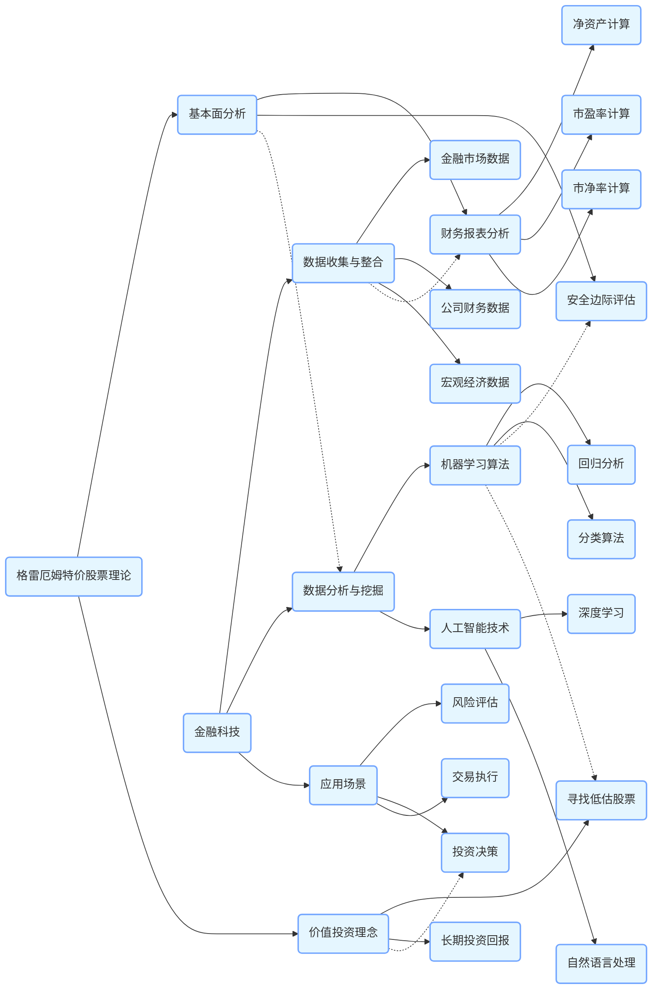

# 格雷厄姆特价股票理论对金融科技的启示

> 关键词：格雷厄姆特价股票理论、金融科技、价值投资、数据分析、算法交易

> 摘要：本文深入探讨了格雷厄姆特价股票理论对金融科技领域的启示。首先介绍了格雷厄姆特价股票理论的背景和核心概念，接着分析了该理论与金融科技在原理和架构上的联系，阐述了相关算法原理和具体操作步骤，并运用数学模型和公式进行详细讲解。通过项目实战案例展示了如何将理论应用于实际金融科技开发中，探讨了其在不同金融场景下的实际应用。同时推荐了学习该理论和进行金融科技开发所需的工具和资源，最后总结了该理论在金融科技领域的未来发展趋势与挑战，并对常见问题进行了解答，为金融科技从业者和研究者提供了全面的参考。

## 1. 背景介绍 
### 1.1 目的和范围
本文章旨在深入研究格雷厄姆特价股票理论，并探讨其对金融科技领域的启示。通过对该理论的原理、算法和实际应用的分析，我们将揭示如何将传统的价值投资理念与现代金融科技相结合，为金融科技的发展提供新的思路和方法。文章的范围涵盖了格雷厄姆特价股票理论的核心概念、算法原理、数学模型，以及在金融科技项目中的实际应用，同时还提供了相关的学习资源和工具推荐。

### 1.2 预期读者
本文的预期读者包括金融科技从业者、投资者、金融分析师、程序员以及对金融科技和价值投资感兴趣的研究人员。无论是希望将传统投资理论应用于金融科技开发的技术人员，还是想要借助金融科技工具实现价值投资的投资者，都能从本文中获得有价值的信息。

### 1.3 文档结构概述
本文将按照以下结构进行组织：首先介绍格雷厄姆特价股票理论的背景和相关术语，接着阐述该理论的核心概念及其与金融科技的联系，包括原理和架构的文本示意图和 Mermaid 流程图。然后详细讲解核心算法原理和具体操作步骤，使用 Python 源代码进行说明，并通过数学模型和公式进一步解释。之后通过项目实战案例展示该理论在金融科技中的实际应用，包括开发环境搭建、源代码实现和代码解读。再探讨该理论在不同金融场景下的实际应用，推荐学习该理论和进行金融科技开发所需的工具和资源。最后总结该理论在金融科技领域的未来发展趋势与挑战，解答常见问题，并提供扩展阅读和参考资料。

### 1.4 术语表
#### 1.4.1 核心术语定义
- **格雷厄姆特价股票理论**：由本杰明·格雷厄姆提出的一种价值投资理论，该理论认为投资者可以通过分析股票的内在价值，寻找那些价格低于内在价值的股票进行投资，以获取长期的投资回报。
- **金融科技**：指金融和科技的融合，利用现代科技手段（如人工智能、大数据、区块链等）来改进和创新金融服务和金融业务流程。
- **价值投资**：一种投资策略，强调通过分析公司的基本面，如财务状况、盈利能力、行业地位等，来评估股票的内在价值，并选择那些价格低于内在价值的股票进行投资。
- **内在价值**：指股票所代表的公司的真实价值，通常通过对公司的财务报表、未来现金流等因素进行分析来估算。

#### 1.4.2 相关概念解释
- **安全边际**：格雷厄姆特价股票理论中的一个重要概念，指股票的市场价格与内在价值之间的差距。安全边际越大，投资的风险越低。
- **基本面分析**：一种分析方法，通过研究公司的财务报表、行业前景、管理层能力等基本面因素，来评估公司的价值和未来发展潜力。
- **算法交易**：指利用计算机算法自动执行交易策略的交易方式。在金融科技中，算法交易可以根据预设的规则和条件，自动买卖股票，提高交易效率和准确性。

#### 1.4.3 缩略词列表
- **AI**：人工智能（Artificial Intelligence）
- **ML**：机器学习（Machine Learning）
- **NLP**：自然语言处理（Natural Language Processing）
- **API**：应用程序编程接口（Application Programming Interface）

## 2. 核心概念与联系 

### 格雷厄姆特价股票理论核心概念
格雷厄姆特价股票理论的核心在于寻找那些被市场低估的股票，即价格低于其内在价值的股票。该理论认为，市场有时会出现非理性的波动，导致股票价格偏离其内在价值。投资者可以通过深入的基本面分析，发现这些被低估的股票，并在价格回归内在价值时获得投资回报。

格雷厄姆提出了一些评估股票内在价值的方法，例如通过分析公司的资产负债表、利润表和现金流量表，计算公司的净资产、市盈率、市净率等指标。同时，他强调了安全边际的重要性，认为投资者应该在股票价格低于内在价值一定幅度时才进行投资，以降低投资风险。

### 金融科技核心概念
金融科技是金融和科技的融合，它利用现代科技手段来改进和创新金融服务和金融业务流程。金融科技涵盖了多个领域，包括人工智能、大数据、区块链、云计算等。在金融科技中，通过收集和分析大量的金融数据，利用机器学习和人工智能算法，可以实现风险评估、投资决策、交易执行等功能。

### 两者联系的文本示意图
```plaintext
格雷厄姆特价股票理论
|-- 基本面分析
|   |-- 财务报表分析
|   |   |-- 净资产计算
|   |   |-- 市盈率计算
|   |   |-- 市净率计算
|   |-- 安全边际评估
|
|-- 价值投资理念
|   |-- 寻找低估股票
|   |-- 长期投资回报

金融科技
|-- 数据收集与整合
|   |-- 金融市场数据
|   |-- 公司财务数据
|   |-- 宏观经济数据
|
|-- 数据分析与挖掘
|   |-- 机器学习算法
|   |   |-- 回归分析
|   |   |-- 分类算法
|   |-- 人工智能技术
|   |   |-- 深度学习
|   |   |-- 自然语言处理
|
|-- 应用场景
|   |-- 风险评估
|   |-- 投资决策
|   |-- 交易执行

联系
|-- 金融科技为格雷厄姆理论提供数据支持和分析工具
|   |-- 大数据用于收集和整合财务报表数据
|   |-- 机器学习算法用于评估安全边际和预测股票价值
|
|-- 格雷厄姆理论为金融科技提供投资理念和策略基础
|   |-- 价值投资理念指导金融科技的投资决策算法
|   |-- 基本面分析方法为数据分析提供框架
```

### Mermaid 流程图


从流程图和文本示意图可以看出，金融科技和格雷厄姆特价股票理论相互关联、相互促进。金融科技为格雷厄姆理论的实践提供了更强大的数据支持和分析工具，而格雷厄姆理论为金融科技的投资决策提供了理论基础和策略指导。

## 3. 核心算法原理 & 具体操作步骤 

### 核心算法原理
在将格雷厄姆特价股票理论应用于金融科技中，主要涉及到两个核心算法：股票内在价值评估算法和安全边际评估算法。

#### 股票内在价值评估算法
股票的内在价值可以通过多种方法进行评估，其中一种常用的方法是基于股息折现模型（Dividend Discount Model, DDM）。该模型假设股票的价值等于其未来所有股息的现值之和。

股息折现模型的基本公式为：
$$V = \sum_{t=1}^{\infty} \frac{D_t}{(1 + r)^t}$$
其中，$V$ 表示股票的内在价值，$D_t$ 表示第 $t$ 期的股息，$r$ 表示折现率。

在实际应用中，由于未来股息难以准确预测，通常会采用简化的模型，如固定增长股息折现模型（Gordon Growth Model）。该模型假设股息以固定的增长率 $g$ 增长，其公式为：
$$V = \frac{D_1}{r - g}$$
其中，$D_1$ 表示下一期的股息，$r$ 表示折现率，$g$ 表示股息增长率。

#### 安全边际评估算法
安全边际是指股票的市场价格与内在价值之间的差距。安全边际的计算公式为：
$$安全边际 = \frac{内在价值 - 市场价格}{内在价值} \times 100\%$$

当安全边际为正数时，表示股票被低估；当安全边际为负数时，表示股票被高估。投资者通常会选择安全边际较大的股票进行投资，以降低投资风险。

### 具体操作步骤
以下是将格雷厄姆特价股票理论应用于金融科技的具体操作步骤：

#### 步骤 1：数据收集
收集公司的财务数据，包括股息、净利润、净资产等，以及宏观经济数据，如利率、通货膨胀率等。可以通过金融数据提供商（如雅虎财经、彭博社等）的 API 接口获取数据。

#### 步骤 2：数据预处理
对收集到的数据进行清洗和预处理，包括去除缺失值、异常值处理、数据标准化等。可以使用 Python 的 Pandas 库进行数据处理。

#### 步骤 3：参数估计
根据历史数据估计股息增长率 $g$ 和折现率 $r$。股息增长率可以通过分析公司过去几年的股息增长情况来估计，折现率可以使用资本资产定价模型（CAPM）进行计算。

#### 步骤 4：内在价值计算
使用股息折现模型计算股票的内在价值。可以使用 Python 编写函数来实现模型的计算。

#### 步骤 5：安全边际计算
根据股票的内在价值和市场价格计算安全边际。

#### 步骤 6：投资决策
根据安全边际的大小进行投资决策。当安全边际大于设定的阈值时，建议买入股票；当安全边际小于设定的阈值时，建议卖出或持有股票。

### Python 源代码实现
```python
import pandas as pd

# 步骤 3：参数估计
def estimate_growth_rate(dividends):
    """
    估计股息增长率
    :param dividends: 股息数据
    :return: 股息增长率
    """
    growth_rates = []
    for i in range(1, len(dividends)):
        growth_rate = (dividends[i] - dividends[i - 1]) / dividends[i - 1]
        growth_rates.append(growth_rate)
    return sum(growth_rates) / len(growth_rates)

def estimate_discount_rate(rf, beta, market_return):
    """
    使用资本资产定价模型（CAPM）估计折现率
    :param rf: 无风险利率
    :param beta: 股票的贝塔系数
    :param market_return: 市场收益率
    :return: 折现率
    """
    return rf + beta * (market_return - rf)

# 步骤 4：内在价值计算
def calculate_intrinsic_value(D1, r, g):
    """
    使用固定增长股息折现模型计算股票的内在价值
    :param D1: 下一期的股息
    :param r: 折现率
    :param g: 股息增长率
    :return: 股票的内在价值
    """
    return D1 / (r - g)

# 步骤 5：安全边际计算
def calculate_safety_margin(intrinsic_value, market_price):
    """
    计算安全边际
    :param intrinsic_value: 股票的内在价值
    :param market_price: 股票的市场价格
    :return: 安全边际
    """
    return (intrinsic_value - market_price) / intrinsic_value * 100

# 示例数据
dividends = [1.0, 1.1, 1.2, 1.3, 1.4]
rf = 0.03  # 无风险利率
beta = 1.2  # 股票的贝塔系数
market_return = 0.1  # 市场收益率
D1 = 1.5  # 下一期的股息
market_price = 20  # 股票的市场价格

# 估计参数
g = estimate_growth_rate(dividends)
r = estimate_discount_rate(rf, beta, market_return)

# 计算内在价值
intrinsic_value = calculate_intrinsic_value(D1, r, g)

# 计算安全边际
safety_margin = calculate_safety_margin(intrinsic_value, market_price)

print(f"股息增长率: {g:.2%}")
print(f"折现率: {r:.2%}")
print(f"股票内在价值: {intrinsic_value:.2f}")
print(f"安全边际: {safety_margin:.2f}%")
```

在上述代码中，我们首先定义了几个函数来实现参数估计、内在价值计算和安全边际计算。然后使用示例数据调用这些函数进行计算，并输出结果。通过这些步骤和代码，我们可以将格雷厄姆特价股票理论应用于金融科技中，实现股票的价值评估和投资决策。

## 4. 数学模型和公式 & 详细讲解 & 举例说明 

### 股息折现模型（Dividend Discount Model, DDM）
#### 基本公式
股息折现模型的基本思想是，股票的价值等于其未来所有股息的现值之和。其基本公式为：
$$V = \sum_{t=1}^{\infty} \frac{D_t}{(1 + r)^t}$$
其中，$V$ 表示股票的内在价值，$D_t$ 表示第 $t$ 期的股息，$r$ 表示折现率。

#### 详细讲解
该公式的原理是基于货币的时间价值。未来的股息需要按照一定的折现率折现为当前的价值，因为同样的金额在未来的价值不如现在的价值高。折现率 $r$ 反映了投资者对资金的时间价值和投资风险的要求。

#### 举例说明
假设某股票每年的股息固定为 $2$ 元，折现率为 $10\%$。则该股票的内在价值为：
$$V = \sum_{t=1}^{\infty} \frac{2}{(1 + 0.1)^t}$$
这是一个无穷等比数列求和的问题，根据等比数列求和公式 $S = \frac{a}{1 - q}$（其中 $a$ 为首项，$q$ 为公比），可得：
$$V = \frac{2}{0.1} = 20$$
即该股票的内在价值为 $20$ 元。

### 固定增长股息折现模型（Gordon Growth Model）
#### 基本公式
固定增长股息折现模型是股息折现模型的一种简化形式，它假设股息以固定的增长率 $g$ 增长。其公式为：
$$V = \frac{D_1}{r - g}$$
其中，$D_1$ 表示下一期的股息，$r$ 表示折现率，$g$ 表示股息增长率。

#### 详细讲解
该模型的推导基于股息折现模型。假设股息从下一期开始以固定的增长率 $g$ 增长，则第 $t$ 期的股息为 $D_t = D_1(1 + g)^{t - 1}$。将其代入股息折现模型的公式中，可得：
$$V = \sum_{t=1}^{\infty} \frac{D_1(1 + g)^{t - 1}}{(1 + r)^t}$$
通过等比数列求和公式进行化简，当 $r > g$ 时，可得上述固定增长股息折现模型的公式。

#### 举例说明
假设某股票下一期的股息为 $2$ 元，股息增长率为 $5\%$，折现率为 $10\%$。则该股票的内在价值为：
$$V = \frac{2}{0.1 - 0.05} = 40$$
即该股票的内在价值为 $40$ 元。

### 安全边际计算公式
#### 基本公式
安全边际是指股票的市场价格与内在价值之间的差距，其计算公式为：
$$安全边际 = \frac{内在价值 - 市场价格}{内在价值} \times 100\%$$

#### 详细讲解
安全边际反映了股票的低估程度。当安全边际为正数时，表示股票被低估，投资者可以以较低的价格买入股票，从而降低投资风险；当安全边际为负数时，表示股票被高估，投资者应该谨慎投资。

#### 举例说明
假设某股票的内在价值为 $50$ 元，市场价格为 $40$ 元。则该股票的安全边际为：
$$安全边际 = \frac{50 - 40}{50} \times 100\% = 20\%$$
即该股票有 $20\%$ 的安全边际，表明该股票被低估，可以考虑买入。

### 资本资产定价模型（Capital Asset Pricing Model, CAPM）
#### 基本公式
资本资产定价模型用于计算股票的预期收益率，其公式为：
$$r_i = r_f + \beta_i (r_m - r_f)$$
其中，$r_i$ 表示第 $i$ 种股票的预期收益率，$r_f$ 表示无风险利率，$\beta_i$ 表示第 $i$ 种股票的贝塔系数，$r_m$ 表示市场收益率。

#### 详细讲解
该模型认为，股票的预期收益率由无风险利率和风险溢价两部分组成。风险溢价是由股票的贝塔系数和市场风险溢价（$r_m - r_f$）决定的。贝塔系数反映了股票的系统性风险，即股票价格波动与市场整体波动的相关性。

#### 举例说明
假设无风险利率为 $3\%$，市场收益率为 $10\%$，某股票的贝塔系数为 $1.2$。则该股票的预期收益率为：
$$r_i = 0.03 + 1.2 \times (0.1 - 0.03) = 0.114 = 11.4\%$$
即该股票的预期收益率为 $11.4\%$。

通过以上数学模型和公式，我们可以更准确地评估股票的内在价值和投资风险，为投资决策提供科学依据。

## 5. 项目实战：代码实际案例和详细解释说明 

### 5.1  开发环境搭建
#### 操作系统
本项目可以在 Windows、Linux 或 macOS 操作系统上进行开发。建议使用最新版本的操作系统以确保兼容性和性能。

#### Python 环境
本项目使用 Python 进行开发，建议使用 Python 3.7 及以上版本。可以从 Python 官方网站（https://www.python.org/downloads/）下载并安装 Python。

#### 依赖库安装
本项目需要使用一些 Python 库，如 Pandas、Numpy、Matplotlib 等。可以使用以下命令进行安装：
```sh
pip install pandas numpy matplotlib
```

### 5.2  源代码详细实现和代码解读
以下是一个完整的 Python 代码示例，用于实现基于格雷厄姆特价股票理论的股票价值评估和投资决策：

```python
import pandas as pd
import numpy as np
import matplotlib.pyplot as plt

# 步骤 1：数据收集（模拟数据）
# 假设我们有某公司过去 5 年的股息数据
dividends = pd.Series([1.0, 1.1, 1.2, 1.3, 1.4])

# 假设无风险利率为 3%，市场收益率为 10%，股票的贝塔系数为 1.2
rf = 0.03
market_return = 0.1
beta = 1.2

# 假设下一期的股息预测为 1.5 元，当前股票市场价格为 20 元
D1 = 1.5
market_price = 20

# 步骤 3：参数估计
def estimate_growth_rate(dividends):
    """
    估计股息增长率
    :param dividends: 股息数据
    :return: 股息增长率
    """
    growth_rates = []
    for i in range(1, len(dividends)):
        growth_rate = (dividends[i] - dividends[i - 1]) / dividends[i - 1]
        growth_rates.append(growth_rate)
    return np.mean(growth_rates)

def estimate_discount_rate(rf, beta, market_return):
    """
    使用资本资产定价模型（CAPM）估计折现率
    :param rf: 无风险利率
    :param beta: 股票的贝塔系数
    :param market_return: 市场收益率
    :return: 折现率
    """
    return rf + beta * (market_return - rf)

# 步骤 4：内在价值计算
def calculate_intrinsic_value(D1, r, g):
    """
    使用固定增长股息折现模型计算股票的内在价值
    :param D1: 下一期的股息
    :param r: 折现率
    :param g: 股息增长率
    :return: 股票的内在价值
    """
    return D1 / (r - g)

# 步骤 5：安全边际计算
def calculate_safety_margin(intrinsic_value, market_price):
    """
    计算安全边际
    :param intrinsic_value: 股票的内在价值
    :param market_price: 股票的市场价格
    :return: 安全边际
    """
    return (intrinsic_value - market_price) / intrinsic_value * 100

# 步骤 6：投资决策
def investment_decision(safety_margin, threshold=20):
    """
    根据安全边际进行投资决策
    :param safety_margin: 安全边际
    :param threshold: 安全边际阈值
    :return: 投资决策建议
    """
    if safety_margin > threshold:
        return "买入"
    elif safety_margin < -threshold:
        return "卖出"
    else:
        return "持有"

# 估计参数
g = estimate_growth_rate(dividends)
r = estimate_discount_rate(rf, beta, market_return)

# 计算内在价值
intrinsic_value = calculate_intrinsic_value(D1, r, g)

# 计算安全边际
safety_margin = calculate_safety_margin(intrinsic_value, market_price)

# 进行投资决策
decision = investment_decision(safety_margin)

# 输出结果
print(f"股息增长率: {g:.2%}")
print(f"折现率: {r:.2%}")
print(f"股票内在价值: {intrinsic_value:.2f}")
print(f"安全边际: {safety_margin:.2f}%")
print(f"投资决策: {decision}")

# 可视化股息数据
plt.plot(dividends.index, dividends.values)
plt.xlabel('年份')
plt.ylabel('股息')
plt.title('股息历史数据')
plt.show()
```

### 5.3  代码解读与分析
#### 数据收集
在代码中，我们使用模拟数据来代表某公司过去 5 年的股息数据。在实际应用中，可以通过金融数据提供商的 API 接口获取真实的股息数据。

#### 参数估计
- `estimate_growth_rate` 函数通过计算相邻两年股息的增长率，并取平均值来估计股息增长率。
- `estimate_discount_rate` 函数使用资本资产定价模型（CAPM）来估计折现率。

#### 内在价值计算
`calculate_intrinsic_value` 函数使用固定增长股息折现模型来计算股票的内在价值。

#### 安全边际计算
`calculate_safety_margin` 函数根据股票的内在价值和市场价格计算安全边际。

#### 投资决策
`investment_decision` 函数根据安全边际的大小进行投资决策。当安全边际大于设定的阈值时，建议买入股票；当安全边际小于负的阈值时，建议卖出股票；否则建议持有股票。

#### 可视化
最后，我们使用 Matplotlib 库将股息历史数据进行可视化，以便更直观地观察股息的变化趋势。

通过这个项目实战，我们可以将格雷厄姆特价股票理论应用于实际的股票价值评估和投资决策中，同时也展示了如何使用 Python 进行数据处理、模型计算和可视化。

## 6. 实际应用场景 
### 股票投资决策
格雷厄姆特价股票理论可以帮助投资者筛选出被低估的股票，从而做出更明智的投资决策。通过金融科技工具，投资者可以快速收集和分析大量的公司财务数据，计算股票的内在价值和安全边际，根据安全边际的大小决定是否买入、卖出或持有股票。例如，一些量化投资平台利用该理论开发投资策略，自动筛选出符合条件的股票进行投资。

### 风险评估
在金融科技中，风险评估是一个重要的环节。格雷厄姆特价股票理论中的安全边际概念可以作为一种风险评估指标。安全边际越大，说明股票的投资风险越低。金融机构可以利用该理论对投资组合进行风险评估，优化投资组合，降低整体风险。例如，银行在进行股票质押贷款时，可以根据股票的安全边际来评估贷款风险，决定是否发放贷款以及贷款的额度。

### 投资组合管理
投资者可以将格雷厄姆特价股票理论应用于投资组合管理中。通过选择不同行业、不同规模的被低估股票构建投资组合，可以实现分散投资，降低非系统性风险。金融科技工具可以帮助投资者实时监控投资组合中股票的价值变化，根据市场情况及时调整投资组合。例如，投资顾问可以使用金融科技软件为客户构建基于该理论的投资组合，并定期进行调整和优化。

### 金融产品设计
金融机构可以根据格雷厄姆特价股票理论设计金融产品。例如，发行基于被低估股票的基金产品，吸引投资者。基金经理可以利用金融科技手段筛选出符合条件的股票，构建基金投资组合，为投资者提供长期稳定的投资回报。同时，金融科技可以提供产品的风险评估和业绩分析功能，帮助投资者更好地了解产品的特点和风险。

### 企业估值
在企业并购、重组等活动中，需要对企业进行估值。格雷厄姆特价股票理论中的基本面分析方法可以用于企业估值。通过分析企业的财务报表、盈利能力、行业地位等因素，评估企业的内在价值。金融科技可以提供大量的企业数据和分析工具，帮助分析师更准确地进行企业估值。例如，投资银行在进行企业并购项目时，可以使用金融科技软件对目标企业进行估值，为交易提供参考依据。

## 7. 工具和资源推荐
### 7.1 学习资源推荐
#### 7.1.1 书籍推荐
- 《聪明的投资者》（The Intelligent Investor）：本杰明·格雷厄姆的经典著作，详细阐述了价值投资的理念和方法，是学习格雷厄姆特价股票理论的必读之书。
- 《证券分析》（Security Analysis）：同样是格雷厄姆的著作，被誉为投资领域的圣经，对股票和债券的分析方法进行了深入探讨。
- 《金融科技：重构未来金融生态》：介绍了金融科技的发展现状和趋势，以及金融科技在各个领域的应用，帮助读者了解金融科技与传统金融的融合。

#### 7.1.2 在线课程
- Coursera 上的“金融科技基础”（Foundations of Fintech）课程：由知名教授授课，系统介绍了金融科技的基本概念、技术和应用。
- edX 上的“价值投资原理”（Principles of Value Investing）课程：深入讲解了价值投资的原理和方法，结合实际案例进行分析。

#### 7.1.3 技术博客和网站
- Seeking Alpha：一个知名的金融投资博客网站，提供大量的股票分析、投资策略和市场评论文章。
- QuantNet：专注于量化金融和金融科技领域的论坛，用户可以在上面交流技术经验、分享研究成果。

### 7.2 开发工具框架推荐
#### 7.2.1 IDE和编辑器
- PyCharm：一款专业的 Python 集成开发环境，提供丰富的代码编辑、调试和分析功能，适合开发金融科技项目。
- Jupyter Notebook：一个交互式的开发环境，支持 Python 代码的编写、运行和可视化，方便进行数据探索和模型实验。

#### 7.2.2 调试和性能分析工具
- Py-Spy：一个轻量级的 Python 性能分析工具，可以实时监控 Python 程序的性能瓶颈。
- pdb：Python 内置的调试器，可以帮助开发者定位和解决代码中的问题。

#### 7.2.3 相关框架和库
- Pandas：一个强大的数据处理和分析库，提供了丰富的数据结构和函数，方便进行金融数据的处理和分析。
- Numpy：一个用于科学计算的 Python 库，提供了高效的数组操作和数学函数，是金融科技开发中常用的库之一。
- Scikit-learn：一个机器学习库，提供了各种机器学习算法和工具，可用于金融数据的建模和预测。

### 7.3 相关论文著作推荐
#### 7.3.1 经典论文
- “The Superinvestors of Graham-and-Doddsville”：沃伦·巴菲特撰写的论文，介绍了格雷厄姆价值投资理念的成功案例，证明了该理论的有效性。
- “Efficient Capital Markets: A Review of Theory and Empirical Work”：尤金·法玛撰写的经典论文，探讨了有效市场假说，对金融市场的研究产生了深远影响。

#### 7.3.2 最新研究成果
- 关注《Journal of Financial Economics》《Review of Financial Studies》等金融领域的顶级学术期刊，了解关于价值投资和金融科技的最新研究成果。

#### 7.3.3 应用案例分析
- 一些金融科技公司会发布自己的研究报告和应用案例，例如蚂蚁金服、腾讯金融科技等公司的官方网站，这些案例可以帮助读者了解格雷厄姆特价股票理论在实际金融科技项目中的应用。

## 8. 总结：未来发展趋势与挑战
### 未来发展趋势
#### 与人工智能和机器学习深度融合
随着人工智能和机器学习技术的不断发展，格雷厄姆特价股票理论将与这些技术深度融合。通过使用深度学习算法，可以更准确地预测股息增长率、折现率等参数，提高股票内在价值评估的准确性。同时，机器学习算法可以自动识别市场中的低估股票，实现更智能的投资决策。

#### 大数据驱动的投资分析
金融科技的发展使得大量的金融数据得以收集和整合。未来，基于大数据的投资分析将成为主流。通过分析海量的公司财务数据、市场交易数据、社交媒体数据等，可以发现更多的投资机会和风险因素。格雷厄姆特价股票理论可以与大数据分析相结合，挖掘出更有价值的投资信息。

#### 跨市场和跨资产类别的应用
格雷厄姆特价股票理论不仅可以应用于股票市场，还可以扩展到其他金融市场和资产类别，如债券市场、期货市场、房地产市场等。通过对不同市场和资产类别的内在价值评估，可以实现更广泛的资产配置和风险管理。

#### 个性化投资服务
随着金融科技的发展，个性化投资服务将成为未来的发展方向。根据投资者的风险偏好、投资目标和财务状况，利用格雷厄姆特价股票理论为投资者提供个性化的投资建议和投资组合。通过金融科技平台，投资者可以方便地获取定制化的投资服务。

### 挑战
#### 数据质量和可靠性
金融数据的质量和可靠性是应用格雷厄姆特价股票理论的关键。数据的不准确、不完整或滞后可能会导致错误的投资决策。因此，需要建立有效的数据采集、清洗和验证机制，确保数据的质量和可靠性。

#### 模型的局限性
格雷厄姆特价股票理论中的模型，如股息折现模型和资本资产定价模型，都有一定的局限性。这些模型基于一些假设条件，而实际市场情况可能与假设不符。因此，需要不断改进和优化模型，提高模型的适应性和准确性。

#### 市场的不确定性
金融市场是复杂和不确定的，股票价格受到多种因素的影响，如宏观经济环境、政策变化、公司管理层决策等。即使使用格雷厄姆特价股票理论进行投资分析，也无法完全预测市场的走势和股票价格的变化。因此，投资者需要具备一定的风险意识和应对不确定性的能力。

#### 监管和合规问题
金融科技的发展带来了新的监管和合规挑战。在应用格雷厄姆特价股票理论进行投资决策和金融产品设计时，需要遵守相关的法律法规和监管要求。金融科技公司需要建立健全的风险管理和合规体系，确保业务的合法合规运营。

## 9. 附录：常见问题与解答
### 问题 1：格雷厄姆特价股票理论是否适用于所有市场？
解答：格雷厄姆特价股票理论的基本原理适用于大多数市场，但在不同市场的应用效果可能会有所不同。在成熟的市场中，市场效率较高，股票价格更接近其内在价值，寻找被低估股票的难度可能会增加。而在新兴市场中，市场波动较大，信息不对称现象较为严重，可能存在更多被低估的股票机会。但无论在哪个市场，都需要结合当地的市场环境和经济情况进行分析和应用。

### 问题 2：如何准确估计股息增长率和折现率？
解答：股息增长率可以通过分析公司过去几年的股息增长情况来估计，也可以参考行业平均水平和公司的发展前景。同时，可以结合公司的盈利增长情况、分红政策等因素进行综合判断。折现率可以使用资本资产定价模型（CAPM）进行计算，其中无风险利率可以参考国债收益率，市场收益率可以参考市场指数的历史表现，贝塔系数可以通过统计分析得出。但需要注意的是，这些参数的估计都存在一定的不确定性，需要进行敏感性分析和风险评估。

### 问题 3：安全边际的阈值应该如何设定？
解答：安全边际的阈值设定没有固定的标准，需要根据投资者的风险偏好、投资目标和市场情况来确定。一般来说，风险偏好较低的投资者可以设定较高的安全边际阈值，如 30% 或更高；而风险偏好较高的投资者可以设定较低的安全边际阈值，如 10% - 20%。同时，在不同的市场环境下，安全边际的阈值也可以适当调整。例如，在市场处于熊市时，可以提高安全边际阈值；在市场处于牛市时，可以适当降低安全边际阈值。

### 问题 4：金融科技在应用格雷厄姆特价股票理论时存在哪些风险？
解答：金融科技在应用格雷厄姆特价股票理论时存在以下风险：
- 技术风险：金融科技依赖于计算机技术和网络技术，可能会面临系统故障、数据泄露、网络攻击等技术风险。
- 模型风险：使用的数学模型和算法可能存在局限性，无法准确反映市场的实际情况，导致投资决策失误。
- 数据风险：金融数据的质量和可靠性可能存在问题，如数据不准确、不完整或滞后，会影响投资分析的结果。
- 监管风险：金融科技的发展可能会面临监管政策的变化和不确定性，需要遵守相关的法律法规和监管要求。

### 问题 5：如何验证基于格雷厄姆特价股票理论的投资策略的有效性？
解答：可以通过以下方法验证基于格雷厄姆特价股票理论的投资策略的有效性：
- 历史回测：使用历史数据对投资策略进行回测，模拟投资过程，计算投资回报率、夏普比率等指标，评估策略在历史市场中的表现。
- 样本外测试：使用未参与模型训练的数据进行测试，检验策略在新市场环境下的适应性和有效性。
- 与市场基准比较：将投资策略的表现与市场基准指数（如沪深 300 指数）进行比较，评估策略是否能够跑赢市场。
- 长期跟踪观察：对投资策略进行长期跟踪观察，分析其在不同市场周期中的表现，判断策略的稳定性和可持续性。

## 10. 扩展阅读 & 参考资料
### 扩展阅读
- 《漫步华尔街》（A Random Walk Down Wall Street）：探讨了股票市场的随机性和有效市场假说，对投资者的投资观念有一定的启发。
- 《黑天鹅》（The Black Swan）：介绍了极端事件对金融市场的影响，提醒投资者要关注市场的不确定性和风险。
- 《金融炼金术》（The Alchemy of Finance）：乔治·索罗斯的著作，阐述了他的反身性理论和投资哲学。

### 参考资料
- 本杰明·格雷厄姆的原著《聪明的投资者》《证券分析》。
- 金融数据提供商的官方网站，如雅虎财经、彭博社等。
- 金融科技领域的学术期刊和研究报告，如《Journal of Financial Economics》《Review of Financial Studies》等。

作者：AI天才研究院/AI Genius Institute & 禅与计算机程序设计艺术 /Zen And The Art of Computer Programming