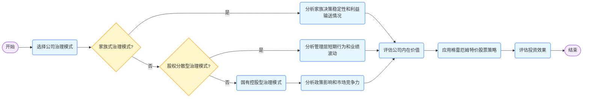

# 格雷厄姆特价股票策略在不同公司治理模式下的效果

> 关键词：格雷厄姆特价股票策略、公司治理模式、投资效果、价值投资、财务指标

> 摘要：本文旨在深入探讨格雷厄姆特价股票策略在不同公司治理模式下的效果。通过对格雷厄姆特价股票策略的核心概念、算法原理进行详细阐述，并结合数学模型和公式分析其理论基础。同时，利用实际案例展示该策略在不同公司治理模式下的应用情况，分析其投资效果的差异。最后，探讨了该策略的实际应用场景、推荐了相关学习资源、开发工具和研究论文，总结了未来发展趋势与挑战，并对常见问题进行解答。

## 1. 背景介绍 
### 1.1 目的和范围
本研究的主要目的是评估格雷厄姆特价股票策略在不同公司治理模式下的投资效果。通过分析不同公司治理模式对该策略实施的影响，为投资者提供更具针对性的投资建议。研究范围涵盖了各种典型的公司治理模式，包括家族式治理、股权分散型治理、国有控股型治理等，并以全球范围内的上市公司为研究对象。

### 1.2 预期读者
本文的预期读者包括专业投资者、金融分析师、学术研究人员以及对价值投资和公司治理感兴趣的普通投资者。对于专业投资者和金融分析师，本文可以为他们的投资决策和研究提供参考；对于学术研究人员，本文可以作为相关领域研究的基础资料；对于普通投资者，本文可以帮助他们更好地理解格雷厄姆特价股票策略和公司治理的关系，提高投资能力。

### 1.3 文档结构概述
本文将按照以下结构进行阐述：首先介绍核心概念与联系，包括格雷厄姆特价股票策略和公司治理模式的定义、原理及两者之间的联系；接着详细讲解核心算法原理和具体操作步骤，并给出Python源代码示例；然后介绍数学模型和公式，通过具体例子进行说明；再通过项目实战展示该策略在不同公司治理模式下的实际应用；之后探讨实际应用场景；推荐相关的工具和资源；最后总结未来发展趋势与挑战，解答常见问题并提供扩展阅读和参考资料。

### 1.4 术语表
#### 1.4.1 核心术语定义
- **格雷厄姆特价股票策略**：由本杰明·格雷厄姆提出的一种价值投资策略，该策略通过寻找价格低于内在价值的股票进行投资，以获取长期稳定的收益。
- **公司治理模式**：指公司的组织架构、决策机制、监督机制等一系列制度安排，不同的公司治理模式会影响公司的经营决策和业绩表现。
- **内在价值**：股票的真实价值，通常通过对公司的财务状况、盈利能力、行业前景等因素进行分析评估得出。

#### 1.4.2 相关概念解释
- **价值投资**：一种投资理念，强调通过分析股票的内在价值，寻找被低估的股票进行投资，而不是仅仅关注股票的市场价格波动。
- **财务指标**：用于衡量公司财务状况和经营业绩的一系列指标，如市盈率、市净率、净资产收益率等。

#### 1.4.3 缩略词列表
- **PE**：市盈率（Price-to-Earnings Ratio），指股票价格与每股收益的比率。
- **PB**：市净率（Price-to-Book Ratio），指股票价格与每股净资产的比率。
- **ROE**：净资产收益率（Return on Equity），指公司净利润与净资产的比率。

## 2. 核心概念与联系 
### 2.1 格雷厄姆特价股票策略原理
格雷厄姆特价股票策略的核心思想是寻找那些价格低于其内在价值的股票。格雷厄姆认为，市场有时会出现非理性的波动，导致股票价格偏离其内在价值。投资者可以通过对公司的财务报表进行分析，评估其内在价值，然后在股票价格低于内在价值时买入，等待市场回归理性，从而获得投资收益。

具体来说，格雷厄姆提出了一系列的选股标准，主要包括以下几个方面：
- **低市盈率（PE）**：市盈率是衡量股票价格相对其盈利水平的指标。低市盈率意味着股票价格相对较低，具有较高的投资价值。
- **低市净率（PB）**：市净率是衡量股票价格相对其净资产的指标。低市净率意味着股票价格相对较低，具有较高的安全边际。
- **稳定的盈利记录**：公司应该具有连续多年的盈利记录，表明其经营状况稳定。
- **适度的财务杠杆**：公司的负债水平应该适度，避免过高的财务风险。

### 2.2 公司治理模式分类及特点
常见的公司治理模式主要有以下几种：
- **家族式治理模式**：家族成员在公司中占据主导地位，拥有公司的控制权和决策权。这种模式的优点是决策效率高，家族成员对公司具有高度的忠诚度；缺点是可能存在家族利益与公司利益冲突的问题，缺乏有效的监督机制。
- **股权分散型治理模式**：公司的股权较为分散，没有单一的大股东或控股股东。这种模式的优点是可以避免大股东对公司的过度控制，提高公司决策的民主性；缺点是可能导致公司决策效率低下，管理层可能缺乏有效的监督。
- **国有控股型治理模式**：国有资本在公司中占据控股地位，政府对公司具有重要的影响力。这种模式的优点是可以保证公司的战略方向符合国家利益，获得政府的政策支持；缺点是可能存在行政干预过多、公司治理效率低下的问题。

### 2.3 格雷厄姆特价股票策略与公司治理模式的联系
不同的公司治理模式会对格雷厄姆特价股票策略的实施效果产生影响。在家族式治理模式下，由于家族成员对公司的控制权较强，可能会更注重公司的长期发展，公司的经营决策相对稳定，这有利于投资者通过分析公司的财务报表来评估其内在价值。然而，如果家族成员存在利益输送等问题，可能会导致公司的财务数据失真，影响投资者的判断。

在股权分散型治理模式下，由于缺乏有效的大股东监督，管理层可能会为了自身利益而采取一些短期行为，导致公司的业绩波动较大。这增加了投资者评估公司内在价值的难度，也可能影响格雷厄姆特价股票策略的实施效果。

在国有控股型治理模式下，公司的经营决策可能受到政府政策的影响较大。如果政府能够提供有效的政策支持，公司的业绩可能会相对稳定，有利于格雷厄姆特价股票策略的实施。但如果政府干预过多，可能会导致公司缺乏市场竞争力，影响其长期发展。

### 2.4 核心概念原理和架构的文本示意图
```plaintext
格雷厄姆特价股票策略
|-- 核心思想：寻找价格低于内在价值的股票
|   |-- 低市盈率
|   |-- 低市净率
|   |-- 稳定的盈利记录
|   |-- 适度的财务杠杆
|
|-- 与公司治理模式的联系
|   |-- 家族式治理模式：决策稳定但可能存在利益输送问题
|   |-- 股权分散型治理模式：业绩波动大，评估难度增加
|   |-- 国有控股型治理模式：受政策影响大，利弊共存
```

### 2.5 Mermaid 流程图


## 3. 核心算法原理 & 具体操作步骤 
### 3.1 核心算法原理
格雷厄姆特价股票策略的核心算法原理是通过计算股票的内在价值，并与市场价格进行比较，来判断股票是否被低估。常用的计算内在价值的方法是基于公司的财务指标，如市盈率、市净率等。

假设我们使用市盈率法来计算股票的内在价值，其计算公式为：

$$V = EPS \times PE_{r}$$

其中，$V$ 表示股票的内在价值，$EPS$ 表示每股收益，$PE_{r}$ 表示合理的市盈率。

合理的市盈率可以根据行业平均市盈率、公司的历史市盈率等因素来确定。如果股票的市场价格 $P$ 低于其内在价值 $V$，则认为该股票被低估，可以考虑买入。

### 3.2 具体操作步骤
#### 步骤 1：收集公司财务数据
首先，需要收集目标公司的财务数据，包括每股收益、每股净资产、市盈率、市净率等。这些数据可以从公司的财务报表、证券交易所网站、金融数据提供商等渠道获取。

#### 步骤 2：计算合理的市盈率
根据行业平均市盈率、公司的历史市盈率等因素，确定合理的市盈率 $PE_{r}$。例如，可以取行业过去五年的平均市盈率作为合理的市盈率。

#### 步骤 3：计算股票的内在价值
使用上述公式计算股票的内在价值 $V$。

#### 步骤 4：比较内在价值和市场价格
将计算得到的内在价值 $V$ 与股票的市场价格 $P$ 进行比较。如果 $P < V$，则认为该股票被低估，可以考虑买入；如果 $P > V$，则认为该股票被高估，应谨慎买入或卖出。

#### 步骤 5：综合考虑其他因素
除了内在价值和市场价格的比较，还需要综合考虑其他因素，如公司的行业前景、竞争优势、管理层能力等。这些因素会影响公司的未来发展和业绩表现，从而影响股票的投资价值。

### 3.3 Python 源代码示例
```python
import pandas as pd

# 步骤 1：收集公司财务数据
# 假设已经从金融数据提供商获取到了公司的财务数据
financial_data = {
    'EPS': 2.5,  # 每股收益
    'PE': 10,    # 当前市盈率
    'PB': 1.5    # 市净率
}

# 步骤 2：计算合理的市盈率
# 假设行业平均市盈率为 15
PE_r = 15

# 步骤 3：计算股票的内在价值
V = financial_data['EPS'] * PE_r

# 步骤 4：比较内在价值和市场价格
# 假设当前股票市场价格为 30
P = 30

if P < V:
    print("该股票被低估，可以考虑买入。")
elif P > V:
    print("该股票被高估，应谨慎买入或卖出。")
else:
    print("该股票价格合理。")

# 步骤 5：综合考虑其他因素
# 这里可以添加更多的分析代码，如行业前景、竞争优势等
```

## 4. 数学模型和公式 & 详细讲解 & 举例说明 
### 4.1 市盈率法计算内在价值
如前所述，市盈率法计算内在价值的公式为：

$$V = EPS \times PE_{r}$$

其中，$V$ 表示股票的内在价值，$EPS$ 表示每股收益，$PE_{r}$ 表示合理的市盈率。

#### 详细讲解
每股收益 $EPS$ 是公司净利润除以总股本得到的，反映了公司每股股票的盈利水平。合理的市盈率 $PE_{r}$ 是根据行业平均市盈率、公司的历史市盈率等因素确定的，它反映了市场对公司盈利的预期。通过将每股收益乘以合理的市盈率，可以得到股票的内在价值。

#### 举例说明
假设某公司的每股收益为 $3$ 元，行业平均市盈率为 $12$。则该公司股票的内在价值为：

$$V = 3 \times 12 = 36 \text{（元）}$$

如果该股票的市场价格为 $30$ 元，由于 $30 < 36$，则认为该股票被低估，可以考虑买入。

### 4.2 市净率法计算内在价值
市净率法计算内在价值的公式为：

$$V = BVPS \times PB_{r}$$

其中，$V$ 表示股票的内在价值，$BVPS$ 表示每股净资产，$PB_{r}$ 表示合理的市净率。

#### 详细讲解
每股净资产 $BVPS$ 是公司净资产除以总股本得到的，反映了公司每股股票的账面价值。合理的市净率 $PB_{r}$ 是根据行业平均市净率、公司的历史市净率等因素确定的，它反映了市场对公司净资产的预期。通过将每股净资产乘以合理的市净率，可以得到股票的内在价值。

#### 举例说明
假设某公司的每股净资产为 $5$ 元，行业平均市净率为 $1.5$。则该公司股票的内在价值为：

$$V = 5 \times 1.5 = 7.5 \text{（元）}$$

如果该股票的市场价格为 $6$ 元，由于 $6 < 7.5$，则认为该股票被低估，可以考虑买入。

### 4.3 综合评估内在价值
在实际应用中，为了更准确地评估股票的内在价值，可以综合使用市盈率法和市净率法。例如，可以取两种方法计算得到的内在价值的平均值作为最终的内在价值。

假设使用市盈率法计算得到的内在价值为 $V_1$，使用市净率法计算得到的内在价值为 $V_2$，则最终的内在价值 $V$ 为：

$$V = \frac{V_1 + V_2}{2}$$

#### 举例说明
假设某公司使用市盈率法计算得到的内在价值为 $36$ 元，使用市净率法计算得到的内在价值为 $30$ 元。则最终的内在价值为：

$$V = \frac{36 + 30}{2} = 33 \text{（元）}$$

如果该股票的市场价格为 $32$ 元，由于 $32 < 33$，则认为该股票被低估，可以考虑买入。

## 5. 项目实战：代码实际案例和详细解释说明 
### 5.1 开发环境搭建
#### 步骤 1：安装 Python
首先，需要安装 Python 编程语言。可以从 Python 官方网站（https://www.python.org/downloads/）下载适合自己操作系统的 Python 版本，并按照安装向导进行安装。

#### 步骤 2：安装必要的库
在项目中，需要使用一些 Python 库来处理财务数据和进行分析。常用的库包括 Pandas、Numpy 等。可以使用以下命令来安装这些库：

```sh
pip install pandas numpy
```

#### 步骤 3：获取财务数据
可以从金融数据提供商（如 Tushare、BaoStock 等）获取公司的财务数据。以 Tushare 为例，需要先在 Tushare 官网（https://tushare.pro/）注册账号，获取 API Token，然后使用以下代码来获取数据：

```python
import tushare as ts

# 设置 API Token
ts.set_token('your_token')
pro = ts.pro_api()

# 获取某公司的财务数据
df = pro.daily_basic(ts_code='000001.SZ', start_date='20200101', end_date='20210101')
print(df)
```

### 5.2 源代码详细实现和代码解读
```python
import pandas as pd
import tushare as ts

# 设置 API Token
ts.set_token('your_token')
pro = ts.pro_api()

# 步骤 1：获取公司财务数据
def get_financial_data(ts_code, start_date, end_date):
    # 获取每日基本面数据
    df = pro.daily_basic(ts_code=ts_code, start_date=start_date, end_date=end_date)
    # 获取利润表数据
    income_df = pro.income(ts_code=ts_code, start_date=start_date, end_date=end_date)
    # 合并数据
    merged_df = pd.merge(df, income_df, on='ts_code', how='left')
    return merged_df

# 步骤 2：计算合理的市盈率和市净率
def calculate_ratio(industry_df):
    # 计算行业平均市盈率
    avg_pe = industry_df['pe_ttm'].mean()
    # 计算行业平均市净率
    avg_pb = industry_df['pb'].mean()
    return avg_pe, avg_pb

# 步骤 3：计算股票的内在价值
def calculate_intrinsic_value(financial_data, avg_pe, avg_pb):
    # 取最新的每股收益和每股净资产
    eps = financial_data['eps'].iloc[0]
    bvps = financial_data['bps'].iloc[0]
    # 计算市盈率法下的内在价值
    v_pe = eps * avg_pe
    # 计算市净率法下的内在价值
    v_pb = bvps * avg_pb
    # 综合评估内在价值
    v = (v_pe + v_pb) / 2
    return v

# 步骤 4：比较内在价值和市场价格
def compare_value(intrinsic_value, market_price):
    if market_price < intrinsic_value:
        return "该股票被低估，可以考虑买入。"
    elif market_price > intrinsic_value:
        return "该股票被高估，应谨慎买入或卖出。"
    else:
        return "该股票价格合理。"

# 主函数
def main():
    # 目标公司代码
    ts_code = '000001.SZ'
    start_date = '20200101'
    end_date = '20210101'
    # 获取目标公司财务数据
    financial_data = get_financial_data(ts_code, start_date, end_date)
    # 获取行业数据（假设已经有行业数据）
    industry_df = pd.read_csv('industry_data.csv')
    # 计算合理的市盈率和市净率
    avg_pe, avg_pb = calculate_ratio(industry_df)
    # 计算股票的内在价值
    intrinsic_value = calculate_intrinsic_value(financial_data, avg_pe, avg_pb)
    # 获取最新的市场价格（假设已经有市场价格数据）
    market_price = financial_data['close'].iloc[0]
    # 比较内在价值和市场价格
    result = compare_value(intrinsic_value, market_price)
    print(result)

if __name__ == "__main__":
    main()
```

### 5.3 代码解读与分析
- **get_financial_data 函数**：该函数用于获取目标公司的财务数据，包括每日基本面数据和利润表数据，并将两者合并。
- **calculate_ratio 函数**：该函数用于计算行业平均市盈率和市净率，作为合理的市盈率和市净率。
- **calculate_intrinsic_value 函数**：该函数用于计算股票的内在价值，综合使用了市盈率法和市净率法。
- **compare_value 函数**：该函数用于比较内在价值和市场价格，并给出投资建议。
- **main 函数**：主函数，调用上述函数完成整个投资分析过程。

通过这个代码示例，我们可以看到如何使用 Python 实现格雷厄姆特价股票策略的核心算法，并结合实际的财务数据进行投资分析。

## 6. 实际应用场景 
### 6.1 个人投资者
对于个人投资者来说，格雷厄姆特价股票策略可以作为一种长期投资的方法。通过使用该策略，个人投资者可以筛选出那些被低估的股票，进行长期持有，以获取稳定的投资收益。在不同的公司治理模式下，个人投资者需要更加谨慎地分析公司的财务数据和治理情况，以降低投资风险。

例如，在家族式治理模式下，个人投资者需要关注家族成员的决策是否符合公司的长期利益，是否存在利益输送等问题；在股权分散型治理模式下，需要关注管理层的短期行为对公司业绩的影响；在国有控股型治理模式下，需要关注政府政策对公司的影响。

### 6.2 机构投资者
机构投资者通常拥有更丰富的资源和专业的研究团队，可以更深入地分析公司的财务数据和治理情况。格雷厄姆特价股票策略可以作为机构投资者资产配置的一部分，用于寻找具有投资价值的股票。

在不同的公司治理模式下，机构投资者可以利用自身的优势，与公司管理层进行沟通，推动公司改善治理结构，提高公司的经营业绩。例如，在股权分散型治理模式下，机构投资者可以联合其他股东，对管理层进行监督，促使其采取有利于公司长期发展的决策。

### 6.3 金融分析师
金融分析师可以使用格雷厄姆特价股票策略来评估公司的投资价值，并为客户提供投资建议。在分析过程中，金融分析师需要考虑不同公司治理模式对公司业绩和股价的影响，为客户提供更准确的投资分析报告。

例如，金融分析师可以通过比较不同公司治理模式下的财务指标和市场表现，分析哪种公司治理模式更有利于格雷厄姆特价股票策略的实施，从而为客户推荐更具投资价值的股票。

## 7. 工具和资源推荐
### 7.1 学习资源推荐
#### 7.1.1 书籍推荐
- 《聪明的投资者》（The Intelligent Investor）：本杰明·格雷厄姆的经典著作，详细阐述了价值投资的理念和方法，是学习格雷厄姆特价股票策略的必读之书。
- 《证券分析》（Security Analysis）：同样是本杰明·格雷厄姆的著作，对证券分析的理论和方法进行了系统的介绍，为投资者提供了深入分析公司财务数据的工具和方法。
- 《公司治理》（Corporate Governance）：介绍了公司治理的基本概念、理论和实践，帮助读者了解不同公司治理模式的特点和影响。

#### 7.1.2 在线课程
- Coursera 上的“Value Investing and Financial Statement Analysis”：该课程由哥伦比亚大学教授授课，深入讲解了价值投资的原理和方法，以及如何通过分析财务报表来评估公司的投资价值。
- edX 上的“Corporate Governance: Principles, Policies, and Practices”：课程介绍了公司治理的基本原理、政策和实践，帮助学习者了解不同公司治理模式的优缺点和应用场景。

#### 7.1.3 技术博客和网站
- Seeking Alpha：提供了大量的金融分析文章和投资建议，涵盖了各种投资策略和公司治理相关的话题。
- Morningstar：是一家知名的金融研究机构，提供了丰富的公司财务数据、评级和分析报告，帮助投资者进行投资决策。

### 7.2 开发工具框架推荐
#### 7.2.1 IDE和编辑器
- PyCharm：是一款专业的 Python 集成开发环境，提供了丰富的代码编辑、调试和分析功能，适合开发 Python 投资分析程序。
- Jupyter Notebook：是一个交互式的开发环境，支持 Python、R 等多种编程语言，适合进行数据探索和分析。

#### 7.2.2 调试和性能分析工具
- PDB：Python 自带的调试工具，可以帮助开发者调试 Python 代码，定位和解决问题。
- cProfile：Python 标准库中的性能分析工具，可以分析 Python 代码的性能瓶颈，帮助开发者优化代码。

#### 7.2.3 相关框架和库
- Pandas：是一个强大的数据分析库，提供了丰富的数据结构和数据处理方法，适合处理和分析财务数据。
- Numpy：是 Python 的数值计算库，提供了高效的数组操作和数学函数，为投资分析提供了基础的数值计算支持。

### 7.3 相关论文著作推荐
#### 7.3.1 经典论文
- “The Relationship between Corporate Governance and Firm Value: Evidence from the S&P 500”：该论文研究了公司治理与公司价值之间的关系，为理解公司治理对投资价值的影响提供了理论支持。
- “Value Investing: The Use of Historical Financial Statement Information to Separate Winners from Losers”：论文介绍了价值投资的方法和策略，以及如何利用历史财务报表信息来筛选出有投资价值的股票。

#### 7.3.2 最新研究成果
- 近年来，学术界对公司治理和价值投资的研究不断深入，许多新的研究成果发表在顶级金融期刊上。例如，一些研究探讨了数字化时代下公司治理模式的变革对价值投资策略的影响。
- 可以通过学术数据库（如 Google Scholar、Web of Science 等）搜索最新的相关研究论文。

#### 7.3.3 应用案例分析
- 一些专业的金融研究机构和咨询公司会发布公司治理和价值投资的应用案例分析报告。这些报告可以帮助读者了解格雷厄姆特价股票策略在实际应用中的效果和挑战。
- 例如，麦肯锡公司、波士顿咨询公司等会发布一些关于公司治理和投资策略的研究报告。

## 8. 总结：未来发展趋势与挑战
### 8.1 未来发展趋势
- **数字化转型对公司治理和投资策略的影响**：随着数字化技术的不断发展，公司治理模式将发生深刻的变革。例如，区块链技术可以提高公司信息的透明度和可信度，人工智能和大数据分析可以帮助投资者更准确地评估公司的内在价值。格雷厄姆特价股票策略也需要不断适应数字化转型的趋势，利用新技术来提高投资分析的效率和准确性。
- **可持续投资理念的兴起**：越来越多的投资者开始关注公司的社会责任和可持续发展能力。未来，格雷厄姆特价股票策略可能会将可持续发展因素纳入投资分析框架，更加注重公司的环境、社会和治理（ESG）表现。
- **全球市场的融合与竞争**：随着全球经济一体化的深入发展，不同国家和地区的市场联系日益紧密。投资者可以在全球范围内寻找被低估的股票，这为格雷厄姆特价股票策略的应用提供了更广阔的空间。同时，全球市场的竞争也将更加激烈，投资者需要不断提高自身的投资能力和风险意识。

### 8.2 挑战
- **数据质量和可靠性问题**：格雷厄姆特价股票策略依赖于准确的财务数据和市场信息。然而，在实际应用中，数据质量和可靠性可能存在问题，如财务报表造假、数据更新不及时等。这给投资者的分析和决策带来了困难，需要投资者具备较强的数据甄别能力。
- **市场有效性的挑战**：有效市场假说认为，市场价格已经反映了所有可用的信息，很难通过分析财务数据来找到被低估的股票。虽然格雷厄姆特价股票策略基于价值投资理念，认为市场有时会出现非理性波动，但在实际市场中，市场有效性的程度仍然是一个挑战。投资者需要不断寻找市场的无效性，才能成功应用该策略。
- **公司治理的复杂性**：不同公司的治理模式具有多样性和复杂性，投资者需要深入了解公司的治理结构、决策机制和监督机制等，才能准确评估公司的投资价值。在实际操作中，这需要投资者具备丰富的知识和经验，以及较强的分析能力。

## 9. 附录：常见问题与解答
### 9.1 格雷厄姆特价股票策略适用于所有类型的股票吗？
不是的。格雷厄姆特价股票策略更适用于那些具有稳定盈利记录、财务状况良好的成熟公司。对于新兴行业的成长型公司，由于其盈利模式和发展前景具有较大的不确定性，该策略可能不太适用。

### 9.2 如何确定合理的市盈率和市净率？
合理的市盈率和市净率可以根据行业平均水平、公司的历史数据以及市场环境等因素来确定。一般来说，可以取行业过去几年的平均市盈率和市净率作为参考。同时，还需要考虑公司的盈利能力、成长潜力、风险水平等因素，对参考值进行适当的调整。

### 9.3 公司治理模式对股票价格的影响有多大？
公司治理模式对股票价格的影响是复杂的，受到多种因素的综合作用。良好的公司治理模式可以提高公司的决策效率、降低代理成本、增强投资者信心，从而对股票价格产生积极的影响。相反，不良的公司治理模式可能导致公司决策失误、利益输送等问题，对股票价格产生负面影响。然而，股票价格还受到市场整体环境、行业竞争、宏观经济等因素的影响，因此公司治理模式对股票价格的影响程度需要具体情况具体分析。

### 9.4 如何评估公司治理的质量？
可以从以下几个方面评估公司治理的质量：
- **股权结构**：合理的股权结构可以避免大股东对公司的过度控制，提高公司决策的民主性。
- **董事会结构**：董事会的独立性和专业性是衡量公司治理质量的重要指标。独立的董事会成员可以对管理层进行有效的监督。
- **信息披露**：公司的信息披露是否及时、准确、完整，反映了公司的透明度和诚信度。
- **内部控制**：健全的内部控制制度可以防范公司的经营风险和财务风险。

### 9.5 格雷厄姆特价股票策略需要多长时间才能看到投资效果？
格雷厄姆特价股票策略是一种长期投资策略，通常需要较长的时间才能看到明显的投资效果。市场回归理性需要一定的时间，公司的业绩改善也需要一个过程。一般来说，投资者需要持有股票数年甚至更长时间，才能充分实现该策略的投资价值。

## 10. 扩展阅读 & 参考资料
### 扩展阅读
- 《金融炼金术》（The Alchemy of Finance）：乔治·索罗斯的著作，探讨了金融市场的运行规律和投资者的心理因素，对理解市场波动和投资策略有一定的启示。
- 《漫步华尔街》（A Random Walk Down Wall Street）：介绍了各种投资理论和策略，以及市场的有效性和随机性，帮助读者拓宽投资视野。

### 参考资料
- Graham, B., & Dodd, D. L. (1934). Security Analysis. McGraw-Hill.
- Graham, B. (1949). The Intelligent Investor. Harper & Brothers.
- Shleifer, A., & Vishny, R. W. (1997). A Survey of Corporate Governance. The Journal of Finance, 52(2), 737-783.

作者：AI天才研究院/AI Genius Institute & 禅与计算机程序设计艺术 /Zen And The Art of Computer Programming