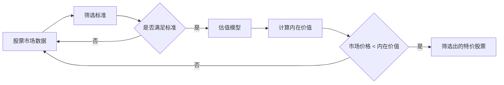

# 格雷厄姆特价股票策略在不同利率环境中的效果

> 关键词：格雷厄姆特价股票策略、利率环境、投资效果、价值投资、股票估值

> 摘要：本文深入探讨了格雷厄姆特价股票策略在不同利率环境下的效果。首先介绍了该策略的背景、适用读者和文档结构，对相关术语进行了详细解释。接着阐述了格雷厄姆特价股票策略的核心概念和原理，通过 Mermaid 流程图展示其架构。从算法原理和具体操作步骤方面，使用 Python 代码进行详细说明，并给出了相应的数学模型和公式。通过项目实战，展示了代码的实际案例和详细解读。分析了该策略在不同利率环境下的实际应用场景，推荐了学习资源、开发工具框架以及相关论文著作。最后总结了未来发展趋势与挑战，解答了常见问题，并提供了扩展阅读和参考资料，旨在为投资者全面了解该策略在不同利率环境中的表现提供参考。

## 1. 背景介绍 
### 1.1 目的和范围
本研究的主要目的是深入分析格雷厄姆特价股票策略在不同利率环境下的投资效果。格雷厄姆作为价值投资的先驱，其特价股票策略在投资领域具有重要地位。然而，利率环境是影响股票市场的关键因素之一，不同的利率水平会对股票的估值、投资者的风险偏好以及企业的融资成本等产生显著影响。因此，研究该策略在不同利率环境下的表现，有助于投资者更好地理解和运用这一策略，提高投资决策的科学性和有效性。

本研究的范围涵盖了不同利率环境的界定，包括低利率、中利率和高利率环境。通过对历史数据的分析和模拟实验，评估格雷厄姆特价股票策略在这些不同利率环境下的收益率、风险水平等指标，并探讨其背后的原因和影响机制。

### 1.2 预期读者
本文的预期读者主要包括以下几类人群：
1. **投资者**：无论是个人投资者还是机构投资者，都可以从本文中获取有关格雷厄姆特价股票策略在不同利率环境下的表现信息，从而优化自己的投资组合，提高投资收益。
2. **金融分析师**：金融分析师可以借助本文的研究成果，为客户提供更准确的投资建议，同时也可以进一步深入研究股票投资策略与宏观经济环境之间的关系。
3. **学术研究人员**：对于从事金融投资、宏观经济等领域研究的学术人员来说，本文可以作为他们研究的参考资料，为相关领域的学术研究提供新的思路和视角。
4. **金融专业学生**：金融专业的学生可以通过阅读本文，加深对价值投资策略和利率环境对股票市场影响的理解，提高自己的专业知识水平和分析能力。

### 1.3 文档结构概述
本文的结构安排如下：
1. **背景介绍**：阐述研究的目的和范围，明确预期读者，概述文档的结构，并对相关术语进行解释。
2. **核心概念与联系**：介绍格雷厄姆特价股票策略的核心概念和原理，通过文本示意图和 Mermaid 流程图展示其架构，分析该策略与利率环境之间的联系。
3. **核心算法原理 & 具体操作步骤**：详细讲解格雷厄姆特价股票策略的算法原理，并使用 Python 代码展示具体的操作步骤。
4. **数学模型和公式 & 详细讲解 & 举例说明**：给出用于评估该策略效果的数学模型和公式，并结合具体例子进行详细讲解。
5. **项目实战：代码实际案例和详细解释说明**：介绍开发环境的搭建，展示源代码的详细实现和代码解读，对代码进行分析和评估。
6. **实际应用场景**：分析格雷厄姆特价股票策略在不同利率环境下的实际应用场景，包括投资决策、资产配置等方面。
7. **工具和资源推荐**：推荐学习该策略的相关资源，包括书籍、在线课程、技术博客和网站等，同时介绍开发工具框架和相关论文著作。
8. **总结：未来发展趋势与挑战**：总结研究成果，分析该策略在未来的发展趋势以及可能面临的挑战。
9. **附录：常见问题与解答**：解答读者在阅读本文过程中可能遇到的常见问题。
10. **扩展阅读 & 参考资料**：提供与本文主题相关的扩展阅读材料和参考资料，方便读者进一步深入研究。

### 1.4 术语表
#### 1.4.1 核心术语定义
1. **格雷厄姆特价股票策略**：由本杰明·格雷厄姆提出的一种价值投资策略，该策略主要关注股票的内在价值，通过筛选出价格低于其内在价值的股票进行投资，以获取长期的投资回报。
2. **利率环境**：指市场上的利率水平及其变化趋势，通常可以分为低利率环境、中利率环境和高利率环境。不同的利率环境会对股票市场产生不同的影响。
3. **内在价值**：股票的内在价值是指股票所代表的企业的真实价值，通常通过对企业的财务状况、盈利能力、行业前景等因素进行分析和评估来确定。
4. **安全边际**：格雷厄姆特价股票策略中的一个重要概念，指股票的市场价格低于其内在价值的幅度。安全边际越大，投资的风险就越低。

#### 1.4.2 相关概念解释
1. **价值投资**：一种投资理念，强调通过分析股票的内在价值来选择投资标的，而不是仅仅关注股票的市场价格波动。价值投资者认为，股票的市场价格会围绕其内在价值上下波动，当市场价格低于内在价值时，就存在投资机会。
2. **利率传导机制**：指利率的变化如何影响经济和金融市场的过程。利率的变动会影响企业的融资成本、投资者的资金成本和风险偏好等，从而对股票市场产生影响。
3. **股票估值方法**：用于评估股票内在价值的方法，常见的有市盈率法、市净率法、现金流折现法等。不同的估值方法适用于不同类型的企业和行业。

#### 1.4.3 缩略词列表
1. **PE**：市盈率（Price-to-Earnings Ratio），指股票价格与每股收益的比率，是衡量股票估值的常用指标之一。
2. **PB**：市净率（Price-to-Book Ratio），指股票价格与每股净资产的比率，也是衡量股票估值的重要指标。
3. **DCF**：现金流折现法（Discounted Cash Flow），一种通过预测企业未来的现金流并将其折现到当前价值的股票估值方法。

## 2. 核心概念与联系 
### 2.1 格雷厄姆特价股票策略核心概念
格雷厄姆特价股票策略的核心思想是寻找那些价格被低估的股票，即市场价格低于其内在价值的股票。格雷厄姆认为，股票市场存在着非理性的波动，投资者的情绪和市场的短期因素会导致股票价格偏离其内在价值。因此，通过深入分析企业的基本面，运用合理的估值方法，可以发现那些具有投资价值的特价股票。

格雷厄姆提出了一系列筛选特价股票的标准，主要包括以下几个方面：
1. **低市盈率**：市盈率是衡量股票估值的重要指标之一。格雷厄姆认为，低市盈率的股票往往具有较高的投资价值，因为它们可能被市场低估。一般来说，他建议选择市盈率低于一定水平（如 15 倍）的股票。
2. **低市净率**：市净率反映了股票价格与每股净资产的关系。低市净率的股票意味着投资者可以以较低的价格购买到企业的净资产，具有一定的安全边际。格雷厄姆通常会选择市净率低于 1.5 倍的股票。
3. **稳定的盈利能力**：企业的盈利能力是评估其内在价值的重要因素。格雷厄姆偏好那些具有稳定盈利历史的企业，认为这样的企业更有可能在未来继续保持盈利。他会关注企业的净利润增长率、毛利率等指标。
4. **充足的现金流**：现金流是企业生存和发展的关键。格雷厄姆认为，企业应该拥有充足的现金流，以保证其正常的生产经营和债务偿还。他会分析企业的经营现金流、自由现金流等指标。

### 2.2 核心概念原理和架构的文本示意图
格雷厄姆特价股票策略的核心原理可以用以下文本示意图来表示：

```plaintext
输入：股票市场数据（包括价格、财务报表等）
|
|-- 筛选标准：
|   |-- 低市盈率
|   |-- 低市净率
|   |-- 稳定的盈利能力
|   |-- 充足的现金流
|
|-- 估值模型：计算股票的内在价值
|
|-- 比较：市场价格与内在价值
|
|-- 输出：筛选出的特价股票
```

### 2.3 Mermaid 流程图


### 2.4 与利率环境的联系
利率环境对格雷厄姆特价股票策略的效果有着重要的影响。具体来说，主要体现在以下几个方面：
1. **对股票估值的影响**：利率的变化会影响企业的融资成本和投资者的资金成本，从而对股票的估值产生影响。在低利率环境下，企业的融资成本较低，有利于企业的发展和盈利增长，同时投资者的资金成本也较低，对股票的估值会相对较高。相反，在高利率环境下，企业的融资成本增加，盈利增长可能受到抑制，投资者的资金成本也较高，对股票的估值会相对较低。
2. **对投资者风险偏好的影响**：利率环境也会影响投资者的风险偏好。在低利率环境下，投资者为了追求更高的收益，可能会更愿意承担一定的风险，从而增加对股票的投资。而在高利率环境下，投资者可能更倾向于选择风险较低的固定收益类产品，对股票的需求会减少。
3. **对市场资金流向的影响**：利率的变化会导致市场资金的流向发生变化。在低利率环境下，资金会从固定收益类产品流向股票市场，推动股票价格上涨。而在高利率环境下，资金会从股票市场流向固定收益类产品，导致股票价格下跌。

因此，在不同的利率环境下，格雷厄姆特价股票策略的筛选标准和投资效果可能会有所不同。投资者需要根据利率环境的变化，灵活调整投资策略。

## 3. 核心算法原理 & 具体操作步骤 
### 3.1 核心算法原理
格雷厄姆特价股票策略的核心算法原理是通过筛选符合特定标准的股票，并计算其内在价值，然后比较市场价格与内在价值，选择市场价格低于内在价值的股票进行投资。具体步骤如下：
1. **数据收集**：收集股票市场的相关数据，包括股票价格、财务报表等信息。
2. **筛选标准应用**：根据格雷厄姆提出的筛选标准，如低市盈率、低市净率、稳定的盈利能力和充足的现金流等，对股票进行筛选。
3. **内在价值计算**：运用合适的估值方法，如市盈率法、市净率法或现金流折现法等，计算筛选出的股票的内在价值。
4. **比较与决策**：将股票的市场价格与内在价值进行比较，如果市场价格低于内在价值，则认为该股票是特价股票，可以考虑投资。

### 3.2 具体操作步骤的 Python 代码实现
以下是一个使用 Python 实现格雷厄姆特价股票策略的示例代码：

```python
import pandas as pd

# 假设我们已经有了一个包含股票信息的 DataFrame
# 列名包括：'stock_code', 'price', 'pe_ratio', 'pb_ratio', 'net_profit_growth', 'cash_flow'
stock_data = pd.DataFrame({
    'stock_code': ['000001', '000002', '000003'],
    'price': [10, 20, 30],
    'pe_ratio': [12, 18, 22],
    'pb_ratio': [1.2, 1.6, 1.8],
    'net_profit_growth': [0.1, 0.05, 0.02],
    'cash_flow': [100, 200, 300]
})

# 筛选标准
pe_threshold = 15
pb_threshold = 1.5
net_profit_growth_threshold = 0.05
cash_flow_threshold = 150

# 筛选符合标准的股票
filtered_stocks = stock_data[
    (stock_data['pe_ratio'] < pe_threshold) &
    (stock_data['pb_ratio'] < pb_threshold) &
    (stock_data['net_profit_growth'] > net_profit_growth_threshold) &
    (stock_data['cash_flow'] > cash_flow_threshold)
]

# 简单的内在价值计算（这里使用市盈率法）
# 假设行业平均市盈率为 15
industry_pe = 15
filtered_stocks['intrinsic_value'] = filtered_stocks['pe_ratio'] * industry_pe

# 比较市场价格与内在价值
filtered_stocks['undervalued'] = filtered_stocks['price'] < filtered_stocks['intrinsic_value']

# 筛选出被低估的股票
undervalued_stocks = filtered_stocks[filtered_stocks['undervalued']]

print(undervalued_stocks)
```

### 3.3 代码解释
1. **数据收集**：使用 Pandas 的 DataFrame 模拟收集到的股票信息，包括股票代码、价格、市盈率、市净率、净利润增长率和现金流等。
2. **筛选标准应用**：设置筛选标准的阈值，如市盈率阈值为 15，市净率阈值为 1.5 等。使用布尔索引筛选出符合标准的股票。
3. **内在价值计算**：使用市盈率法计算筛选出的股票的内在价值，假设行业平均市盈率为 15。
4. **比较与决策**：比较股票的市场价格与内在价值，标记出被低估的股票，并筛选出这些股票。

通过以上步骤，我们可以使用 Python 实现格雷厄姆特价股票策略的基本操作。

## 4. 数学模型和公式 & 详细讲解 & 举例说明 
### 4.1 市盈率法估值模型
市盈率法是一种常用的股票估值方法，其基本公式为：

$$V = EPS \times PE$$

其中，$V$ 表示股票的内在价值，$EPS$ 表示每股收益，$PE$ 表示市盈率。

#### 详细讲解
市盈率反映了投资者为获取每股收益所愿意支付的价格倍数。一般来说，市盈率越高，说明投资者对该股票的预期越高，愿意支付的价格也越高；反之，市盈率越低，说明股票可能被低估。

在使用市盈率法进行估值时，需要选择合适的市盈率。可以选择行业平均市盈率、历史平均市盈率或根据企业的盈利预测来确定市盈率。

#### 举例说明
假设某股票的每股收益为 2 元，行业平均市盈率为 15 倍。则该股票的内在价值为：

$$V = 2 \times 15 = 30 \text{（元）}$$

如果该股票的市场价格为 25 元，低于其内在价值 30 元，则可以认为该股票被低估。

### 4.2 市净率法估值模型
市净率法的基本公式为：

$$V = BVPS \times PB$$

其中，$V$ 表示股票的内在价值，$BVPS$ 表示每股净资产，$PB$ 表示市净率。

#### 详细讲解
市净率反映了股票价格与每股净资产的关系。市净率越低，说明投资者可以以较低的价格购买到企业的净资产，具有一定的安全边际。

在使用市净率法进行估值时，同样需要选择合适的市净率。可以参考行业平均市净率或企业的历史市净率。

#### 举例说明
假设某股票的每股净资产为 10 元，行业平均市净率为 1.2 倍。则该股票的内在价值为：

$$V = 10 \times 1.2 = 12 \text{（元）}$$

如果该股票的市场价格为 10 元，低于其内在价值 12 元，则可以认为该股票被低估。

### 4.3 现金流折现法估值模型
现金流折现法是一种较为复杂但更准确的股票估值方法，其基本公式为：

$$V = \sum_{t=1}^{n} \frac{FCF_t}{(1 + r)^t} + \frac{TV}{(1 + r)^n}$$

其中，$V$ 表示股票的内在价值，$FCF_t$ 表示第 $t$ 期的自由现金流，$r$ 表示折现率，$TV$ 表示终值，$n$ 表示预测期数。

#### 详细讲解
现金流折现法的核心思想是将企业未来的自由现金流折现到当前价值。自由现金流是指企业在满足了所有必要的资本支出后剩余的现金流量，反映了企业的实际盈利能力和现金创造能力。

折现率是考虑了资金的时间价值和投资风险后的收益率，一般可以使用资本资产定价模型（CAPM）来确定。

终值是指预测期结束后企业的价值，可以使用永续增长模型或其他方法来计算。

#### 举例说明
假设某企业未来 3 年的自由现金流分别为 100 万元、120 万元和 150 万元，预测期结束后企业的终值为 1000 万元，折现率为 10%。则该企业的内在价值为：

$$V = \frac{100}{(1 + 0.1)^1} + \frac{120}{(1 + 0.1)^2} + \frac{150}{(1 + 0.1)^3} + \frac{1000}{(1 + 0.1)^3}$$

$$V \approx 90.91 + 99.17 + 112.70 + 751.31 = 1054.09 \text{（万元）}$$

如果该企业发行了 100 万股股票，则每股内在价值为：

$$V_{per_share} = \frac{1054.09}{100} = 10.54 \text{（元）}$$

如果该股票的市场价格为 9 元，低于其内在价值 10.54 元，则可以认为该股票被低估。

## 5. 项目实战：代码实际案例和详细解释说明 
### 5.1  开发环境搭建
#### 5.1.1 安装 Python
首先需要安装 Python 环境。可以从 Python 官方网站（https://www.python.org/downloads/）下载适合自己操作系统的 Python 版本，并按照安装向导进行安装。建议安装 Python 3.x 版本。

#### 5.1.2 安装必要的库
在项目中，我们需要使用一些 Python 库来处理数据和进行分析，主要包括 Pandas、Numpy 等。可以使用以下命令来安装这些库：

```sh
pip install pandas numpy
```

#### 5.1.3 数据获取
可以从金融数据提供商（如东方财富、同花顺等）获取股票市场数据，也可以使用一些开源的金融数据接口（如 Tushare）来获取数据。这里我们假设已经获取到了包含股票信息的 CSV 文件。

### 5.2  源代码详细实现和代码解读
以下是一个完整的项目实战代码示例：

```python
import pandas as pd

# 读取股票数据文件
stock_data = pd.read_csv('stock_data.csv')

# 筛选标准
pe_threshold = 15
pb_threshold = 1.5
net_profit_growth_threshold = 0.05
cash_flow_threshold = 150

# 筛选符合标准的股票
filtered_stocks = stock_data[
    (stock_data['pe_ratio'] < pe_threshold) &
    (stock_data['pb_ratio'] < pb_threshold) &
    (stock_data['net_profit_growth'] > net_profit_growth_threshold) &
    (stock_data['cash_flow'] > cash_flow_threshold)
]

# 简单的内在价值计算（这里使用市盈率法）
# 假设行业平均市盈率为 15
industry_pe = 15
filtered_stocks['intrinsic_value'] = filtered_stocks['pe_ratio'] * industry_pe

# 比较市场价格与内在价值
filtered_stocks['undervalued'] = filtered_stocks['price'] < filtered_stocks['intrinsic_value']

# 筛选出被低估的股票
undervalued_stocks = filtered_stocks[filtered_stocks['undervalued']]

# 保存筛选结果到 CSV 文件
undervalued_stocks.to_csv('undervalued_stocks.csv', index=False)

print("筛选完成，结果已保存到 undervalued_stocks.csv 文件中。")
```

### 5.3  代码解读与分析
1. **数据读取**：使用 Pandas 的 `read_csv` 函数读取包含股票信息的 CSV 文件，并将其存储为 DataFrame 对象。
2. **筛选标准应用**：设置筛选标准的阈值，使用布尔索引筛选出符合标准的股票。
3. **内在价值计算**：使用市盈率法计算筛选出的股票的内在价值，假设行业平均市盈率为 15。
4. **比较与决策**：比较股票的市场价格与内在价值，标记出被低估的股票，并筛选出这些股票。
5. **结果保存**：使用 Pandas 的 `to_csv` 函数将筛选结果保存到 CSV 文件中。

通过以上代码，我们可以实现一个简单的格雷厄姆特价股票筛选系统，并将筛选结果保存下来。

## 6. 实际应用场景 
### 6.1 低利率环境下的应用
在低利率环境下，资金成本较低，企业的融资成本也相应降低，这有利于企业的扩张和盈利增长。同时，投资者为了追求更高的收益，会更倾向于投资股票市场。在这种环境下，格雷厄姆特价股票策略可以帮助投资者筛选出那些被低估但具有增长潜力的股票。

例如，在低利率环境下，一些传统行业的企业可能由于市场对其增长预期不高而导致股价被低估。但这些企业往往具有稳定的盈利能力和充足的现金流，符合格雷厄姆特价股票策略的筛选标准。投资者可以通过该策略发现这些股票，并进行长期投资，以获取企业盈利增长带来的收益。

### 6.2 中利率环境下的应用
中利率环境通常意味着经济处于相对稳定的增长阶段。在这种环境下，股票市场的波动相对较小，投资者的风险偏好也较为适中。格雷厄姆特价股票策略在中利率环境下仍然可以发挥作用，帮助投资者筛选出具有合理估值和稳定盈利能力的股票。

投资者可以根据市场情况和自身的风险承受能力，调整筛选标准，选择适合自己的投资组合。例如，可以适当提高市盈率和市净率的阈值，以扩大筛选范围，但同时要确保企业的盈利能力和现金流状况良好。

### 6.3 高利率环境下的应用
在高利率环境下，资金成本较高，企业的融资成本增加，盈利增长可能受到抑制。同时，投资者更倾向于选择风险较低的固定收益类产品，对股票市场的需求减少。在这种环境下，股票市场整体估值可能会下降，格雷厄姆特价股票策略的筛选标准可能需要更加严格。

投资者需要更加关注企业的现金流状况和偿债能力，选择那些具有较强抗风险能力的企业。例如，可以选择市净率较低、现金流充足且负债率较低的股票。此外，投资者还可以适当增加现金储备，以应对市场的不确定性。

## 7. 工具和资源推荐
### 7.1 学习资源推荐
#### 7.1.1 书籍推荐
1. 《聪明的投资者》（The Intelligent Investor）：本杰明·格雷厄姆的经典著作，详细阐述了价值投资的理念和方法，是学习格雷厄姆特价股票策略的必读之书。
2. 《证券分析》（Security Analysis）：同样是格雷厄姆的著作，对股票和债券的分析方法进行了深入探讨，为投资者提供了系统的投资分析框架。
3. 《怎样选择成长股》（Common Stocks and Uncommon Profits）：菲利普·费雪的著作，介绍了如何寻找具有成长潜力的股票，与格雷厄姆的价值投资理念相互补充。

#### 7.1.2 在线课程
1. Coursera 上的“投资学原理”课程：由知名高校的教授授课，系统地介绍了投资学的基本原理和方法，包括股票投资策略、资产定价等内容。
2. 网易云课堂上的“价值投资实战课程”：结合实际案例，详细讲解了价值投资的理念和实践方法，对学习格雷厄姆特价股票策略有很大的帮助。

#### 7.1.3 技术博客和网站
1. 雪球网：国内知名的投资交流社区，汇集了众多投资者的经验和观点，可以在这里学习到不同的投资策略和方法。
2. 价值投资网：专注于价值投资领域，提供了丰富的价值投资理论和实践案例，是学习格雷厄姆特价股票策略的重要资源。

### 7.2 开发工具框架推荐
#### 7.2.1 IDE和编辑器
1. PyCharm：一款专业的 Python 集成开发环境，具有强大的代码编辑、调试和项目管理功能，适合开发复杂的 Python 项目。
2. Jupyter Notebook：一种交互式的开发环境，可以将代码、文本和可视化结果集成在一个文档中，方便进行数据分析和实验。

#### 7.2.2 调试和性能分析工具
1. PDB：Python 自带的调试工具，可以帮助开发者逐行调试代码，查找程序中的错误。
2. cProfile：Python 的性能分析工具，可以分析代码的运行时间和函数调用情况，帮助开发者优化代码性能。

#### 7.2.3 相关框架和库
1. Pandas：用于数据处理和分析的 Python 库，提供了高效的数据结构和数据分析工具，非常适合处理股票市场数据。
2. Numpy：Python 的数值计算库，提供了高效的数组和矩阵运算功能，在数据分析和模型计算中经常使用。

### 7.3 相关论文著作推荐
#### 7.3.1 经典论文
1. Graham, B., & Dodd, D. L. (1934). Security Analysis. This classic work laid the foundation for value investing and introduced many of the concepts still used today.
2. Fama, E. F., & French, K. R. (1992). The cross-section of expected stock returns. This paper proposed the Fama-French three-factor model, which has had a significant impact on asset pricing and investment research.

#### 7.3.2 最新研究成果
1. Recent research on the impact of interest rates on stock market valuation and investment strategies. This type of research explores how changes in interest rates affect the performance of different investment strategies, including the Graham cheap stock strategy.
2. Studies on the application of machine learning and artificial intelligence in value investing. These studies use advanced techniques to improve the accuracy of stock selection and valuation.

#### 7.3.3 应用案例分析
1. Case studies of successful investors who have used the Graham cheap stock strategy. These case studies provide real-world examples of how the strategy can be implemented and the potential returns it can generate.
2. Analyses of the performance of the Graham cheap stock strategy in different market environments. These analyses help investors understand the strengths and limitations of the strategy under various conditions.

## 8. 总结：未来发展趋势与挑战
### 8.1 未来发展趋势
1. **与科技融合**：随着科技的不断发展，人工智能、机器学习等技术将越来越多地应用于股票投资领域。格雷厄姆特价股票策略也可以借助这些技术，提高筛选股票的效率和准确性。例如，使用机器学习算法对大量的财务数据和市场数据进行分析，挖掘出更有价值的投资信息。
2. **全球化投资**：随着全球经济一体化的发展，投资者的投资范围将越来越广泛。格雷厄姆特价股票策略可以应用于不同国家和地区的股票市场，寻找全球范围内的特价股票。这将为投资者带来更多的投资机会，但也需要投资者具备更广泛的市场知识和风险意识。
3. **多策略融合**：单一的投资策略往往存在一定的局限性。未来，投资者可能会将格雷厄姆特价股票策略与其他投资策略（如成长投资策略、动量投资策略等）相结合，构建更加多元化的投资组合，以降低风险并提高收益。

### 8.2 挑战
1. **市场有效性提高**：随着市场的发展和投资者的成熟，市场的有效性可能会不断提高。这意味着股票价格更能反映其内在价值，寻找被低估的股票将变得更加困难。格雷厄姆特价股票策略可能需要不断调整和优化，以适应市场的变化。
2. **宏观经济不确定性增加**：全球经济和政治环境的不确定性增加，如贸易摩擦、利率波动、通货膨胀等，将对股票市场产生较大的影响。这些宏观经济因素的变化可能会导致股票估值的大幅波动，增加了投资决策的难度。投资者需要更加关注宏观经济形势的变化，及时调整投资策略。
3. **数据质量和信息不对称问题**：股票投资需要大量的准确数据和信息。然而，数据质量和信息不对称问题仍然存在。一些企业可能会提供虚假的财务数据，或者投资者可能无法获取到全面的市场信息。这将影响格雷厄姆特价股票策略的实施效果，投资者需要加强对数据和信息的甄别和分析能力。

## 9. 附录：常见问题与解答
### 9.1 格雷厄姆特价股票策略适合所有投资者吗？
格雷厄姆特价股票策略并不适合所有投资者。该策略需要投资者具备一定的财务分析能力和耐心，能够对企业的基本面进行深入研究。同时，该策略更注重长期投资，对于那些追求短期高收益、风险承受能力较低的投资者来说，可能不太适合。

### 9.2 如何确定合适的筛选标准？
筛选标准的确定需要综合考虑多种因素，包括市场环境、行业特点、企业的财务状况等。一般来说，可以参考历史数据和行业平均水平来确定初始的筛选标准，然后根据实际情况进行调整。例如，在高利率环境下，可以适当降低市盈率和市净率的阈值；对于不同行业的企业，也可以设置不同的筛选标准。

### 9.3 内在价值计算方法有哪些局限性？
内在价值计算方法存在一定的局限性。例如，市盈率法和市净率法比较简单，但它们没有考虑企业的未来增长潜力和现金流状况；现金流折现法虽然更准确，但需要对企业的未来现金流和折现率进行预测，预测的准确性会影响内在价值的计算结果。此外，不同的估值方法可能会得出不同的内在价值，投资者需要综合考虑多种方法的结果。

### 9.4 如何应对市场波动对策略的影响？
市场波动是股票投资中不可避免的现象。为了应对市场波动对格雷厄姆特价股票策略的影响，投资者可以采取以下措施：
1. 坚持长期投资理念，避免因短期市场波动而频繁买卖股票。
2. 合理分散投资，构建多元化的投资组合，降低单一股票的风险。
3. 定期评估投资组合，根据市场情况和企业的基本面变化，及时调整投资组合。

## 10. 扩展阅读 & 参考资料
### 10.1 扩展阅读
1. 《巴菲特致股东的信》（Letters to Shareholders of Berkshire Hathaway）：沃伦·巴菲特作为格雷厄姆的学生，继承和发展了价值投资理念。这本书收录了巴菲特历年致股东的信，从中可以学习到他的投资思想和方法。
2. 《金融炼金术》（The Alchemy of Finance）：乔治·索罗斯的著作，介绍了他的反身性理论和投资实践。虽然索罗斯的投资风格与格雷厄姆有所不同，但他的思想可以为投资者提供新的视角。

### 10.2 参考资料
1. 金融数据提供商的官方网站，如东方财富、同花顺等，提供了丰富的股票市场数据和分析工具。
2. 学术数据库，如知网、万方等，收录了大量的金融投资领域的研究论文，可以为深入研究提供参考。

作者：AI天才研究院/AI Genius Institute & 禅与计算机程序设计艺术 /Zen And The Art of Computer Programming