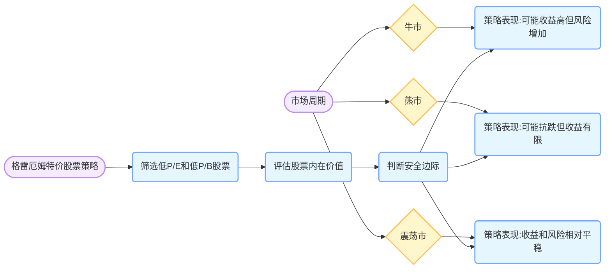

# 格雷厄姆特价股票策略在不同市场周期的表现

> 关键词：格雷厄姆特价股票策略、市场周期、价值投资、股票表现、财务指标

> 摘要：本文深入探讨了格雷厄姆特价股票策略在不同市场周期的表现。首先介绍了该策略的背景知识，包括其目的、适用读者、文档结构和相关术语。接着阐述了格雷厄姆特价股票策略的核心概念、算法原理及具体操作步骤，通过数学模型和公式进行详细讲解并举例说明。然后结合项目实战，给出代码实际案例和详细解释。分析了该策略在不同市场周期中的实际应用场景，推荐了学习该策略的工具和资源，最后总结了其未来发展趋势与挑战，解答常见问题并提供扩展阅读和参考资料，旨在帮助投资者更全面地了解格雷厄姆特价股票策略在不同市场环境下的有效性和局限性。

## 1. 背景介绍 
### 1.1 目的和范围
本研究的主要目的是深入探究格雷厄姆特价股票策略在不同市场周期中的表现。格雷厄姆作为价值投资的先驱，其特价股票策略旨在寻找被市场低估的股票，通过投资这些股票获取长期的超额收益。本研究将涵盖牛市、熊市和震荡市等不同市场周期，分析该策略在各个周期下的收益情况、风险特征以及影响策略表现的关键因素。通过对不同市场环境下策略的评估，为投资者提供更具针对性的投资建议，帮助他们在不同市场阶段合理运用该策略，优化投资组合。

### 1.2 预期读者
本文的预期读者主要包括专业投资者、个人投资者、金融分析师以及对价值投资和股票市场感兴趣的研究人员。专业投资者可以借助本文的研究结果调整投资策略，优化资产配置；个人投资者能够通过了解该策略在不同市场周期的表现，提升投资决策的科学性；金融分析师可以将本文作为参考资料，为客户提供更准确的投资分析和建议；研究人员则可以在本文的基础上开展进一步的学术研究。

### 1.3 文档结构概述
本文将按照以下结构展开：首先介绍格雷厄姆特价股票策略的核心概念及其与市场周期的联系，并通过示意图和流程图进行直观展示；接着详细阐述该策略的核心算法原理和具体操作步骤，同时给出Python源代码；然后运用数学模型和公式对策略进行深入分析，并举例说明；通过项目实战，给出代码实际案例并进行详细解释；分析该策略在不同市场周期的实际应用场景；推荐相关的学习工具和资源；总结该策略的未来发展趋势与挑战；最后解答常见问题并提供扩展阅读和参考资料。

### 1.4 术语表
#### 1.4.1 核心术语定义
- **格雷厄姆特价股票策略**：由本杰明·格雷厄姆提出的一种价值投资策略，该策略通过筛选具有低市盈率、低市净率等特征的股票，认为这些股票被市场低估，具有较高的投资价值。
- **市场周期**：指股票市场从一个高点到下一个高点，或从一个低点到下一个低点的循环过程，通常包括牛市、熊市和震荡市三个阶段。
- **市盈率（P/E）**：股票价格与每股收益的比率，反映了市场对公司盈利的预期和估值水平。
- **市净率（P/B）**：股票价格与每股净资产的比率，衡量了公司的市场价值与账面价值之间的关系。
- **超额收益**：指投资组合的实际收益超过市场基准收益的部分，是衡量投资策略有效性的重要指标。

#### 1.4.2 相关概念解释
- **价值投资**：一种投资理念，强调通过分析公司的基本面，寻找被市场低估的股票，长期持有以获取价值回归带来的收益。
- **安全边际**：格雷厄姆提出的概念，指股票的内在价值与市场价格之间的差距，安全边际越大，投资风险越低。
- **市场基准**：通常指某个市场指数，如沪深300指数、标普500指数等，用于衡量投资组合的相对表现。

#### 1.4.3 缩略词列表
- **P/E**：市盈率（Price-to-Earnings Ratio）
- **P/B**：市净率（Price-to-Book Ratio）
- **ROE**：净资产收益率（Return on Equity）

## 2. 核心概念与联系 

### 格雷厄姆特价股票策略核心原理
格雷厄姆特价股票策略的核心思想是寻找那些价格低于其内在价值的股票。内在价值是指公司未来现金流的现值，由于准确计算内在价值较为困难，格雷厄姆提出了一些简单易懂的财务指标来筛选股票，如低市盈率和低市净率。低市盈率意味着投资者可以用较低的价格购买到公司的盈利，而低市净率则表示公司的市场价值低于其账面价值，具有一定的安全边际。

### 市场周期的划分
市场周期通常可以分为牛市、熊市和震荡市三个阶段。牛市是指市场整体上涨，投资者情绪乐观，股票价格普遍上升的时期；熊市则相反，市场整体下跌，投资者情绪悲观，股票价格普遍下降；震荡市是指市场在一定区间内波动，没有明显的上涨或下跌趋势。

### 核心概念联系示意图


从示意图可以看出，格雷厄姆特价股票策略通过筛选低市盈率和低市净率的股票，评估其内在价值和安全边际。而不同的市场周期会对该策略的表现产生不同的影响，在牛市中可能获得较高收益但风险也会增加，熊市中可能具有一定的抗跌性但收益有限，震荡市中收益和风险相对平稳。

## 3. 核心算法原理 & 具体操作步骤 

### 核心算法原理
格雷厄姆特价股票策略的核心算法是通过设定一系列财务指标的阈值来筛选股票。主要的财务指标包括市盈率（P/E）、市净率（P/B）和净资产收益率（ROE）。具体原理如下：
1. **筛选低市盈率股票**：市盈率反映了市场对公司盈利的预期，低市盈率意味着公司的盈利被市场低估，具有一定的投资价值。通常选择市盈率低于市场平均水平的股票。
2. **筛选低市净率股票**：市净率衡量了公司的市场价值与账面价值之间的关系，低市净率表示公司的市场价值低于其账面价值，具有安全边际。一般选择市净率低于一定阈值（如1.5）的股票。
3. **筛选高净资产收益率股票**：净资产收益率反映了公司运用自有资本的效率，高净资产收益率表示公司具有较强的盈利能力。通常选择净资产收益率高于一定阈值（如10%）的股票。

### 具体操作步骤
以下是使用Python实现格雷厄姆特价股票策略的具体操作步骤和代码：

```python
import pandas as pd

# 假设我们有一个包含股票代码、市盈率、市净率和净资产收益率的DataFrame
# 这里我们创建一个示例DataFrame
data = {
    'stock_code': ['000001', '000002', '000003', '000004', '000005'],
    'pe_ratio': [10, 15, 20, 8, 12],
    'pb_ratio': [1.2, 1.8, 2.0, 0.8, 1.5],
    'roe': [15, 12, 8, 20, 10]
}
df = pd.DataFrame(data)

# 设定筛选条件
pe_threshold = 15  # 市盈率阈值
pb_threshold = 1.5  # 市净率阈值
roe_threshold = 10  # 净资产收益率阈值

# 筛选符合条件的股票
selected_stocks = df[(df['pe_ratio'] < pe_threshold) & (df['pb_ratio'] < pb_threshold) & (df['roe'] > roe_threshold)]

print("筛选出的符合格雷厄姆特价股票策略的股票：")
print(selected_stocks)
```

### 代码解释
1. **数据准备**：首先创建一个包含股票代码、市盈率、市净率和净资产收益率的DataFrame，模拟从数据库或其他数据源获取的股票数据。
2. **设定筛选条件**：根据格雷厄姆特价股票策略的原理，设定市盈率、市净率和净资产收益率的阈值。
3. **筛选股票**：使用布尔索引筛选出符合条件的股票，即市盈率低于阈值、市净率低于阈值且净资产收益率高于阈值的股票。
4. **输出结果**：打印筛选出的符合策略的股票信息。

## 4. 数学模型和公式 & 详细讲解 & 举例说明 

### 数学模型和公式
#### 市盈率（P/E）
市盈率的计算公式为：
$$P/E = \frac{股价}{每股收益}$$
其中，股价是指股票的市场价格，每股收益是指公司每股的盈利。市盈率反映了投资者为获得公司每一元盈利所愿意支付的价格。

#### 市净率（P/B）
市净率的计算公式为：
$$P/B = \frac{股价}{每股净资产}$$
每股净资产是指公司的净资产除以总股本。市净率衡量了公司的市场价值与账面价值之间的关系。

#### 净资产收益率（ROE）
净资产收益率的计算公式为：
$$ROE = \frac{净利润}{净资产} \times 100\%$$
净资产收益率反映了公司运用自有资本的效率，即公司每一元净资产能够创造的净利润。

### 详细讲解
- **市盈率**：市盈率是衡量股票估值的重要指标之一。一般来说，低市盈率的股票可能被市场低估，具有较高的投资价值。但需要注意的是，市盈率也受到行业、公司成长前景等因素的影响，不同行业的合理市盈率水平可能存在较大差异。
- **市净率**：市净率可以帮助投资者判断股票的安全边际。当市净率小于1时，意味着公司的市场价值低于其账面价值，可能存在被低估的情况。但市净率也不能单独作为投资决策的依据，还需要考虑公司的资产质量、盈利能力等因素。
- **净资产收益率**：净资产收益率是衡量公司盈利能力的重要指标。高净资产收益率表示公司具有较强的盈利能力和良好的经营管理水平。一般来说，持续保持较高净资产收益率的公司更值得投资。

### 举例说明
假设某公司的股价为20元，每股收益为2元，每股净资产为10元，净利润为1000万元，净资产为5000万元。则该公司的市盈率、市净率和净资产收益率分别为：
- **市盈率**：
$$P/E = \frac{20}{2} = 10$$
这意味着投资者为获得该公司每一元盈利愿意支付10元的价格。
- **市净率**：
$$P/B = \frac{20}{10} = 2$$
该公司的市场价值是其账面价值的2倍。
- **净资产收益率**：
$$ROE = \frac{1000}{5000} \times 100\% = 20\%$$
说明该公司每一元净资产能够创造0.2元的净利润，具有较强的盈利能力。

## 5. 项目实战：代码实际案例和详细解释说明 

### 5.1  开发环境搭建
在进行格雷厄姆特价股票策略的项目实战之前，需要搭建相应的开发环境。以下是具体的搭建步骤：
1. **安装Python**：建议使用Python 3.7及以上版本，可以从Python官方网站（https://www.python.org/downloads/）下载并安装。
2. **安装必要的库**：需要安装pandas、numpy、matplotlib等库，可以使用pip命令进行安装：
```bash
pip install pandas numpy matplotlib
```
3. **获取股票数据**：可以使用第三方数据接口，如Tushare、BaoStock等获取股票的财务数据和行情数据。以Tushare为例，需要注册并获取Token，然后安装Tushare库：
```bash
pip install tushare
```

### 5.2  源代码详细实现和代码解读
以下是一个完整的Python代码示例，用于实现格雷厄姆特价股票策略并进行回测：

```python
import tushare as ts
import pandas as pd
import matplotlib.pyplot as plt

# 设置Tushare Token
ts.set_token('your_token')
pro = ts.pro_api()

# 获取股票的财务数据
def get_financial_data():
    # 获取所有股票的基本信息
    stock_basic = pro.stock_basic(exchange='', list_status='L', fields='ts_code,symbol,name,industry')
    # 获取所有股票的财务指标数据
    fina_indicator = pro.fina_indicator(period='20231231', fields='ts_code,pe_ttm,pb,roe')
    # 合并数据
    data = pd.merge(stock_basic, fina_indicator, on='ts_code')
    return data

# 筛选符合格雷厄姆特价股票策略的股票
def select_stocks(data):
    pe_threshold = 15
    pb_threshold = 1.5
    roe_threshold = 10
    selected_stocks = data[(data['pe_ttm'] < pe_threshold) & (data['pb'] < pb_threshold) & (data['roe'] > roe_threshold)]
    return selected_stocks

# 回测策略
def backtest(selected_stocks):
    start_date = '20240101'
    end_date = '20241231'
    portfolio_returns = []
    for ts_code in selected_stocks['ts_code']:
        df = pro.daily(ts_code=ts_code, start_date=start_date, end_date=end_date)
        if not df.empty:
            df = df.sort_values('trade_date')
            returns = (df['close'].iloc[-1] - df['close'].iloc[0]) / df['close'].iloc[0]
            portfolio_returns.append(returns)
    if portfolio_returns:
        average_return = sum(portfolio_returns) / len(portfolio_returns)
        return average_return
    else:
        return 0

# 主函数
def main():
    # 获取财务数据
    data = get_financial_data()
    # 筛选股票
    selected_stocks = select_stocks(data)
    print("筛选出的符合格雷厄姆特价股票策略的股票：")
    print(selected_stocks)
    # 回测策略
    average_return = backtest(selected_stocks)
    print(f"策略的平均收益率：{average_return * 100:.2f}%")
    # 绘制收益率柱状图
    plt.bar(selected_stocks['symbol'], portfolio_returns)
    plt.xlabel('股票代码')
    plt.ylabel('收益率')
    plt.title('格雷厄姆特价股票策略回测收益率')
    plt.xticks(rotation=45)
    plt.show()

if __name__ == "__main__":
    main()
```

### 代码解读与分析
1. **获取股票的财务数据**：`get_financial_data`函数使用Tushare接口获取所有股票的基本信息和财务指标数据，并将它们合并成一个DataFrame。
2. **筛选符合策略的股票**：`select_stocks`函数根据设定的市盈率、市净率和净资产收益率的阈值，筛选出符合格雷厄姆特价股票策略的股票。
3. **回测策略**：`backtest`函数对筛选出的股票进行回测，计算每个股票在指定时间段内的收益率，并计算投资组合的平均收益率。
4. **主函数**：`main`函数调用上述函数，完成数据获取、股票筛选、策略回测和结果可视化的任务。

通过这个项目实战，我们可以直观地看到格雷厄姆特价股票策略在实际市场中的表现，为投资决策提供参考。

## 6. 实际应用场景 
### 牛市中的应用
在牛市中，市场整体上涨，投资者情绪乐观，股票价格普遍上升。格雷厄姆特价股票策略在牛市中可能会有以下表现：
- **收益潜力**：由于牛市中市场对股票的估值普遍提高，符合格雷厄姆特价股票策略的股票可能会随着市场的上涨而获得较高的收益。这些被低估的股票在市场情绪的推动下，有较大的价值回归空间。
- **风险挑战**：然而，牛市中也存在一定的风险。市场的过度乐观可能导致一些低质量的股票也被大幅炒作，而真正被低估的优质股票可能被忽视。此外，牛市后期市场可能出现泡沫，股票价格可能偏离其内在价值，此时使用该策略可能会面临一定的回调风险。

### 熊市中的应用
在熊市中，市场整体下跌，投资者情绪悲观，股票价格普遍下降。格雷厄姆特价股票策略在熊市中具有一定的优势：
- **抗跌性**：由于该策略筛选的是被低估的股票，这些股票通常具有较低的市盈率和市净率，具有一定的安全边际。在熊市中，它们的下跌幅度可能相对较小，表现出一定的抗跌性。
- **投资机会**：熊市也是寻找被低估股票的好时机。当市场整体下跌时，很多优质股票的价格也会随之下跌，可能会出现符合格雷厄姆特价股票策略的投资机会。投资者可以在熊市中逐步建仓，等待市场反转时获得收益。

### 震荡市中的应用
在震荡市中，市场在一定区间内波动，没有明显的上涨或下跌趋势。格雷厄姆特价股票策略在震荡市中可能会有以下表现：
- **收益稳定性**：由于该策略注重股票的内在价值，筛选出的股票通常具有较好的基本面。在震荡市中，这些股票的价格相对稳定，能够为投资组合提供一定的收益稳定性。
- **波段操作机会**：震荡市中股票价格会在一定区间内波动，投资者可以利用格雷厄姆特价股票策略筛选出的股票进行波段操作。当股票价格下跌到一定程度时买入，当价格上涨到一定程度时卖出，获取差价收益。

## 7. 工具和资源推荐
### 7.1 学习资源推荐
#### 7.1.1 书籍推荐
- 《聪明的投资者》（The Intelligent Investor）：本杰明·格雷厄姆的经典著作，详细阐述了价值投资的理念和方法，是学习格雷厄姆特价股票策略的必读之书。
- 《证券分析》（Security Analysis）：同样是格雷厄姆的重要著作，对股票和债券的分析方法进行了深入探讨，为投资者提供了系统的投资分析框架。
- 《价值投资实战手册》：唐朝著，结合中国股市的实际情况，对价值投资的理论和实践进行了详细讲解，具有很强的实用性。

#### 7.1.2 在线课程
- Coursera上的“Value Investing and Financial Statement Analysis”：由哥伦比亚大学教授授课，系统讲解价值投资的理论和方法，包括财务报表分析、估值模型等内容。
- 网易云课堂上的“价值投资从入门到精通”：课程结合实际案例，深入浅出地介绍了价值投资的核心概念和操作技巧。

#### 7.1.3 技术博客和网站
- 雪球网：国内知名的投资社区，汇聚了众多投资者和投资专家，提供股票分析、投资策略分享等内容。
- 价值漫步：专注于价值投资的博客，分享价值投资的研究成果和实战经验。

### 7.2 开发工具框架推荐
#### 7.2.1 IDE和编辑器
- PyCharm：功能强大的Python集成开发环境，提供代码编辑、调试、版本控制等功能，适合进行股票策略开发和回测。
- Jupyter Notebook：交互式的开发环境，方便进行数据探索、代码演示和结果展示，常用于数据分析和机器学习项目。

#### 7.2.2 调试和性能分析工具
- pdb：Python自带的调试工具，可以帮助开发者逐步调试代码，查找问题。
- cProfile：Python的性能分析工具，可以分析代码的运行时间和函数调用情况，帮助优化代码性能。

#### 7.2.3 相关框架和库
- pandas：强大的数据处理和分析库，提供了DataFrame等数据结构，方便进行股票数据的处理和分析。
- numpy：Python的数值计算库，提供了高效的数组操作和数学函数，常用于金融计算和数据分析。
- matplotlib：Python的绘图库，可以绘制各种类型的图表，如折线图、柱状图等，用于可视化股票数据和策略回测结果。

### 7.3 相关论文著作推荐
#### 7.3.1 经典论文
- “The Superinvestors of Graham-and-Doddsville”：沃伦·巴菲特撰写的论文，介绍了格雷厄姆价值投资策略的成功案例，证明了该策略的有效性。
- “Value Versus Growth: The International Evidence”：由Fama和French发表的论文，对全球范围内价值股和成长股的表现进行了研究，为价值投资提供了实证支持。

#### 7.3.2 最新研究成果
- 可以关注《Journal of Finance》、《Review of Financial Studies》等金融领域的顶级学术期刊，了解关于价值投资和股票策略的最新研究成果。

#### 7.3.3 应用案例分析
- 一些金融研究机构和投资公司会发布关于格雷厄姆特价股票策略的应用案例分析报告，可以通过互联网搜索获取这些报告，学习实际应用中的经验和技巧。

## 8. 总结：未来发展趋势与挑战
### 未来发展趋势
- **与量化投资结合**：随着金融科技的发展，量化投资越来越受到关注。格雷厄姆特价股票策略可以与量化投资技术相结合，通过大数据分析和机器学习算法，更精准地筛选出符合策略的股票，提高投资效率和收益。
- **跨市场应用**：该策略不仅可以应用于股票市场，还可以拓展到其他金融市场，如债券市场、期货市场等。通过跨市场应用，可以进一步分散投资风险，提高投资组合的稳定性。
- **个性化投资**：随着投资者需求的多样化，未来格雷厄姆特价股票策略可能会向个性化投资方向发展。根据投资者的风险偏好、投资目标和资金规模等因素，定制个性化的投资策略。

### 挑战
- **市场环境变化**：市场环境是不断变化的，不同的市场周期和经济形势会对格雷厄姆特价股票策略的表现产生影响。例如，在新兴市场中，市场有效性相对较低，股票价格可能更容易受到情绪和资金的影响，导致该策略的效果可能不如在成熟市场中理想。
- **财务数据质量**：该策略依赖于公司的财务数据进行筛选，财务数据的质量直接影响策略的有效性。然而，一些公司可能存在财务造假等问题，导致财务数据失真，从而影响投资决策。
- **竞争加剧**：随着价值投资理念的普及，越来越多的投资者开始采用格雷厄姆特价股票策略，市场竞争加剧。这可能导致符合策略的股票数量减少，投资机会变得更加稀缺。

## 9. 附录：常见问题与解答
### 1. 格雷厄姆特价股票策略一定能获得超额收益吗？
不一定。虽然该策略旨在寻找被低估的股票，但市场是复杂多变的，存在很多不确定性因素。在某些市场环境下，如市场泡沫时期，该策略可能无法获得超额收益，甚至可能跑输市场。此外，策略的有效性还受到财务数据质量、选股标准等因素的影响。

### 2. 如何确定市盈率、市净率和净资产收益率的阈值？
阈值的确定需要综合考虑市场情况、行业特点和个人投资偏好等因素。一般来说，可以参考市场的历史平均水平和行业的平均水平来设定阈值。例如，市盈率可以选择低于市场平均市盈率的一定比例，市净率可以选择低于1.5或2，净资产收益率可以选择高于10%。但这些阈值并不是固定不变的，需要根据实际情况进行调整。

### 3. 该策略适合短期投资还是长期投资？
格雷厄姆特价股票策略更适合长期投资。该策略的核心是寻找被低估的股票，通过长期持有等待价值回归。短期市场波动较大，股票价格可能会偏离其内在价值，难以准确判断投资收益。而长期来看，股票价格会逐渐向其内在价值靠拢，该策略有更大的机会获得超额收益。

### 4. 如何获取准确的股票财务数据？
可以通过专业的金融数据提供商获取股票的财务数据，如Tushare、BaoStock等。这些数据提供商通常会对数据进行整理和清洗，保证数据的准确性和及时性。此外，也可以从证券交易所的官方网站获取公司的定期报告和财务报表，但需要注意数据的解读和分析。

## 10. 扩展阅读 & 参考资料
### 扩展阅读
- 《怎样选择成长股》（Common Stocks and Uncommon Profits）：菲利普·费雪的著作，介绍了成长股投资的理念和方法，与格雷厄姆的价值投资理念相互补充。
- 《金融炼金术》（The Alchemy of Finance）：乔治·索罗斯的著作，探讨了金融市场的反身性原理，对投资者理解市场行为有很大的帮助。

### 参考资料
- 本杰明·格雷厄姆. 《聪明的投资者》. 人民邮电出版社.
- 本杰明·格雷厄姆, 戴维·多德. 《证券分析》. 海南出版社.
- 唐朝. 《价值投资实战手册》. 机械工业出版社.

作者：AI天才研究院/AI Genius Institute & 禅与计算机程序设计艺术 /Zen And The Art of Computer Programming