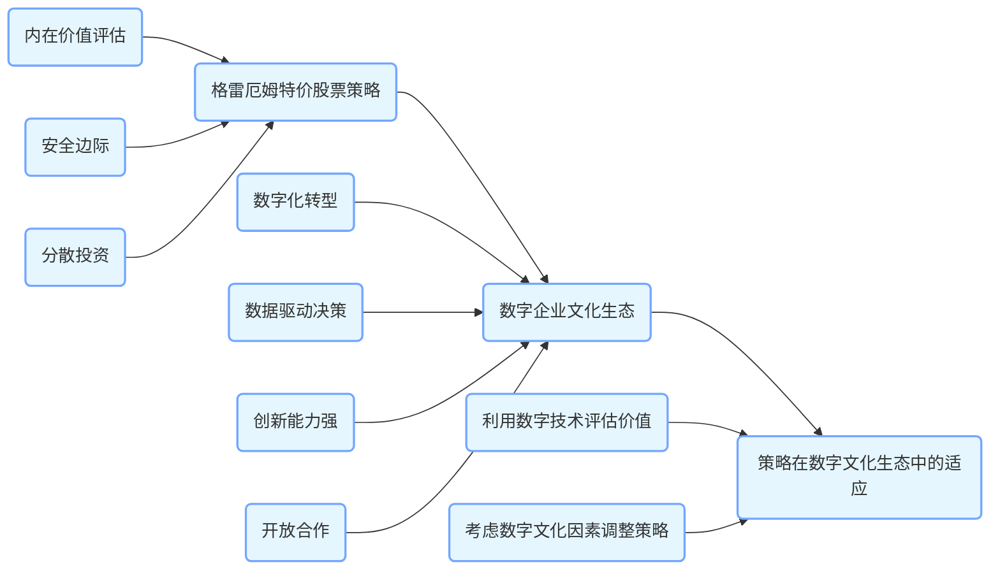

# 格雷厄姆特价股票策略在不同数字企业文化生态中的适应

> 关键词：格雷厄姆特价股票策略、数字企业文化生态、价值投资、股票分析、市场适应

> 摘要：本文聚焦于格雷厄姆特价股票策略在不同数字企业文化生态中的适应问题。首先介绍了格雷厄姆特价股票策略的背景知识，包括其目的、适用读者、文档结构等内容。接着详细阐述了核心概念，给出了原理和架构的示意图及流程图。通过Python代码讲解了核心算法原理和具体操作步骤，并使用数学模型和公式进行深入分析。在项目实战部分，展示了代码实际案例并进行详细解释。探讨了该策略在不同数字企业文化生态中的实际应用场景，推荐了相关的学习资源、开发工具框架和论文著作。最后总结了未来发展趋势与挑战，解答了常见问题并提供了扩展阅读和参考资料，旨在为投资者在数字文化背景下运用格雷厄姆特价股票策略提供全面的指导。

## 1. 背景介绍 
### 1.1 目的和范围
格雷厄姆特价股票策略是由投资大师本杰明·格雷厄姆（Benjamin Graham）提出的一种价值投资方法，其核心思想是寻找被市场低估的股票，通过长期持有来获取超额收益。随着数字技术的飞速发展，不同的数字企业文化生态逐渐形成，这些生态对股票市场产生了深远的影响。本文的目的在于探讨格雷厄姆特价股票策略在不同数字企业文化生态中的适应性，分析该策略在新环境下的优势和局限性，为投资者提供在数字文化背景下运用该策略的指导。范围涵盖了对格雷厄姆特价股票策略的原理分析、在不同数字企业文化生态中的应用案例研究以及对未来发展趋势的展望。

### 1.2 预期读者
本文预期读者包括股票投资者、金融分析师、投资顾问、金融专业学生以及对数字文化和股票投资感兴趣的人士。对于投资者来说，了解该策略在数字企业文化生态中的适应情况有助于他们做出更明智的投资决策；金融分析师和投资顾问可以将本文的研究成果应用于实际的投资分析和咨询服务中；金融专业学生可以通过本文加深对价值投资理论和数字金融的理解；而对数字文化和股票投资感兴趣的人士则可以从中获取有关投资策略和数字文化相互影响的知识。

### 1.3 文档结构概述
本文将按照以下结构进行阐述：首先介绍核心概念，包括格雷厄姆特价股票策略和数字企业文化生态的定义和联系，并给出相应的原理和架构示意图及流程图；接着讲解核心算法原理和具体操作步骤，使用Python代码进行详细说明；然后通过数学模型和公式对该策略进行深入分析，并举例说明；在项目实战部分，展示代码实际案例并进行详细解释；探讨该策略在不同数字企业文化生态中的实际应用场景；推荐相关的学习资源、开发工具框架和论文著作；最后总结未来发展趋势与挑战，解答常见问题并提供扩展阅读和参考资料。

### 1.4 术语表
#### 1.4.1 核心术语定义
- **格雷厄姆特价股票策略**：一种基于价值投资理念的股票投资策略，通过寻找股价低于其内在价值的股票进行投资，以获取长期的超额收益。
- **数字企业文化生态**：指在数字技术环境下，企业形成的独特文化、商业模式和运营方式所构成的生态系统，包括企业的数字化转型程度、创新能力、数据驱动决策等方面。
- **内在价值**：股票所代表的企业的真实价值，通常通过对企业的财务状况、盈利能力、发展前景等因素进行分析和评估得出。
- **安全边际**：指股票的市场价格低于其内在价值的幅度，是格雷厄姆特价股票策略中的一个重要概念，用于降低投资风险。

#### 1.4.2 相关概念解释
- **价值投资**：一种投资理念，强调通过对企业基本面的分析，寻找被市场低估的股票，以长期投资的方式获取企业价值增长带来的收益。
- **数字技术**：包括互联网、大数据、人工智能、区块链等技术，这些技术的发展推动了企业的数字化转型和数字企业文化生态的形成。
- **股票市场效率**：指股票市场对信息的反映程度，有效市场假说认为股票价格已经反映了所有可用的信息，而格雷厄姆特价股票策略则认为市场存在无效性，存在被低估的股票。

#### 1.4.3 缩略词列表
- **P/E**：市盈率（Price-to-Earnings Ratio），指股票价格与每股收益的比率，用于衡量股票的估值水平。
- **P/B**：市净率（Price-to-Book Ratio），指股票价格与每股净资产的比率，用于衡量股票的估值水平。
- **ROE**：净资产收益率（Return on Equity），指企业净利润与净资产的比率，用于衡量企业的盈利能力。

## 2. 核心概念与联系 
### 2.1 格雷厄姆特价股票策略原理
格雷厄姆特价股票策略的核心是寻找被市场低估的股票，即股票的市场价格低于其内在价值。该策略基于以下几个重要原则：
- **内在价值评估**：通过对企业的财务报表、盈利能力、资产负债状况等进行分析，评估企业的内在价值。常用的方法包括股息折现模型、自由现金流折现模型等。
- **安全边际**：为了降低投资风险，格雷厄姆强调在购买股票时要留有足够的安全边际，即股票的市场价格要显著低于其内在价值。安全边际可以提供一定的缓冲，即使企业的实际表现不如预期，投资者也不会遭受重大损失。
- **分散投资**：为了分散风险，格雷厄姆建议投资者将资金分散投资于多只被低估的股票，而不是集中投资于某一只股票。

### 2.2 数字企业文化生态概述
数字企业文化生态是在数字技术的推动下形成的一种新型企业生态系统。在数字文化生态中，企业具有以下特点：
- **数字化转型**：企业积极采用数字技术进行业务流程优化、产品创新和客户服务提升，实现数字化转型。
- **数据驱动决策**：企业通过收集、分析和利用大量的数据，进行决策和战略规划，提高决策的科学性和准确性。
- **创新能力强**：数字技术的快速发展为企业提供了更多的创新机会，企业不断推出新的产品和服务，以满足市场需求。
- **开放合作**：数字文化生态强调开放合作，企业与合作伙伴之间通过共享资源、技术和信息，实现互利共赢。

### 2.3 两者的联系
格雷厄姆特价股票策略在不同数字企业文化生态中的适应情况与数字企业文化生态的特点密切相关。一方面，数字技术的发展为投资者提供了更多的信息和分析工具，有助于更准确地评估企业的内在价值。例如，通过大数据分析可以获取企业的更多经营数据，人工智能算法可以帮助投资者更快速地筛选出被低估的股票。另一方面，数字企业文化生态的创新和变化速度较快，企业的内在价值可能受到多种因素的影响，如技术创新、市场竞争、政策法规等，这增加了评估企业内在价值的难度。因此，在不同数字企业文化生态中应用格雷厄姆特价股票策略需要考虑数字文化的特点，对传统的策略进行适当的调整和改进。

### 2.4 核心概念原理和架构的文本示意图
```plaintext
+---------------------+
| 格雷厄姆特价股票策略 |
| - 内在价值评估       |
| - 安全边际           |
| - 分散投资           |
+---------------------+
           |
           v
+---------------------+
| 数字企业文化生态    |
| - 数字化转型        |
| - 数据驱动决策      |
| - 创新能力强        |
| - 开放合作          |
+---------------------+
           |
           v
+---------------------+
| 策略在数字文化生态中的适应 |
| - 利用数字技术评估价值  |
| - 考虑数字文化因素调整策略 |
+---------------------+
```

### 2.5 Mermaid 流程图


## 3. 核心算法原理 & 具体操作步骤 
### 3.1 核心算法原理
格雷厄姆特价股票策略的核心算法是评估股票的内在价值，并与市场价格进行比较，以确定股票是否被低估。常用的评估方法之一是使用市盈率（P/E）和市净率（P/B）等指标。具体原理如下：
- **市盈率（P/E）**：市盈率是股票价格与每股收益的比率，反映了投资者为获取每一元收益所愿意支付的价格。一般来说，较低的市盈率意味着股票可能被低估。格雷厄姆认为，当股票的市盈率低于一定的阈值（如15倍）时，股票可能具有投资价值。
- **市净率（P/B）**：市净率是股票价格与每股净资产的比率，反映了股票价格相对于企业净资产的倍数。较低的市净率意味着股票可能被低估。格雷厄姆通常建议选择市净率低于1.5倍的股票。

### 3.2 具体操作步骤
以下是使用Python实现格雷厄姆特价股票策略的具体操作步骤：
```python
import pandas as pd
import yfinance as yf

# 步骤1：获取股票数据
def get_stock_data(ticker, start_date, end_date):
    data = yf.download(ticker, start=start_date, end=end_date)
    return data

# 步骤2：计算市盈率和市净率
def calculate_ratios(data):
    # 假设我们从其他数据源获取了每股收益（EPS）和每股净资产（BVPS）
    # 这里为了简化，我们使用虚拟数据
    EPS = 2.0
    BVPS = 10.0
    data['P/E'] = data['Close'] / EPS
    data['P/B'] = data['Close'] / BVPS
    return data

# 步骤3：筛选被低估的股票
def filter_undervalued_stocks(data):
    undervalued = data[(data['P/E'] < 15) & (data['P/B'] < 1.5)]
    return undervalued

# 主函数
def main():
    ticker = 'AAPL'
    start_date = '2020-01-01'
    end_date = '2021-01-01'
    stock_data = get_stock_data(ticker, start_date, end_date)
    stock_data = calculate_ratios(stock_data)
    undervalued_stocks = filter_undervalued_stocks(stock_data)
    print(undervalued_stocks)

if __name__ == "__main__":
    main()
```
### 3.3 代码解释
- **get_stock_data函数**：使用`yfinance`库从雅虎财经获取指定股票在指定日期范围内的历史数据。
- **calculate_ratios函数**：计算股票的市盈率和市净率。在实际应用中，每股收益（EPS）和每股净资产（BVPS）需要从财务报表等数据源获取，这里为了简化使用了虚拟数据。
- **filter_undervalued_stocks函数**：根据市盈率和市净率的阈值筛选出被低估的股票。
- **main函数**：调用上述函数完成整个流程，获取股票数据、计算比率并筛选出被低估的股票，最后打印结果。

## 4. 数学模型和公式 & 详细讲解 & 举例说明 
### 4.1 市盈率（P/E）模型
市盈率（P/E）的计算公式为：
$$P/E = \frac{P}{EPS}$$
其中，$P$ 是股票的市场价格，$EPS$ 是每股收益。

**详细讲解**：市盈率反映了投资者为获取每一元收益所愿意支付的价格。较低的市盈率可能意味着股票被低估，具有投资价值。例如，如果一只股票的市场价格为 $30$ 元，每股收益为 $2$ 元，则其市盈率为：
$$P/E = \frac{30}{2} = 15$$
如果我们设定的市盈率阈值为 $15$ 倍，那么这只股票刚好处于我们的筛选范围内。

### 4.2 市净率（P/B）模型
市净率（P/B）的计算公式为：
$$P/B = \frac{P}{BVPS}$$
其中，$P$ 是股票的市场价格，$BVPS$ 是每股净资产。

**详细讲解**：市净率反映了股票价格相对于企业净资产的倍数。较低的市净率可能意味着股票被低估。例如，如果一只股票的市场价格为 $12$ 元，每股净资产为 $10$ 元，则其市净率为：
$$P/B = \frac{12}{10} = 1.2$$
如果我们设定的市净率阈值为 $1.5$ 倍，那么这只股票符合我们的筛选条件。

### 4.3 综合评估模型
在实际应用中，我们可以综合考虑市盈率和市净率等指标，构建一个综合评估模型。例如，我们可以设定一个综合评分公式：
$$Score = w_1 \times \frac{1}{P/E} + w_2 \times \frac{1}{P/B}$$
其中，$w_1$ 和 $w_2$ 是权重系数，且 $w_1 + w_2 = 1$。

**详细讲解**：这个综合评分公式的原理是，市盈率和市净率越低，其倒数越大，得分越高。通过设定不同的权重系数，可以根据投资者的偏好对市盈率和市净率进行不同程度的加权。例如，假设 $w_1 = 0.6$，$w_2 = 0.4$，对于一只市盈率为 $10$ 倍，市净率为 $1.2$ 倍的股票，其综合评分为：
$$Score = 0.6 \times \frac{1}{10} + 0.4 \times \frac{1}{1.2} \approx 0.06 + 0.33 = 0.39$$
我们可以根据综合评分对股票进行排序，选择得分较高的股票进行投资。

## 5. 项目实战：代码实际案例和详细解释说明 
### 5.1  开发环境搭建
在进行项目实战之前，需要搭建相应的开发环境。以下是具体步骤：
- **安装Python**：从Python官方网站（https://www.python.org/downloads/）下载并安装Python 3.x版本。
- **安装必要的库**：使用`pip`命令安装`pandas`和`yfinance`库，这两个库分别用于数据处理和获取股票数据。
```sh
pip install pandas yfinance
```
- **选择开发工具**：可以选择使用Jupyter Notebook、PyCharm等开发工具进行代码编写和调试。

### 5.2  源代码详细实现和代码解读
以下是一个完整的项目实战代码示例，用于筛选被低估的股票：
```python
import pandas as pd
import yfinance as yf

# 步骤1：获取多只股票数据
def get_multiple_stock_data(tickers, start_date, end_date):
    data_dict = {}
    for ticker in tickers:
        data = yf.download(ticker, start=start_date, end=end_date)
        data_dict[ticker] = data
    return data_dict

# 步骤2：计算市盈率和市净率
def calculate_ratios_all(data_dict):
    ratios_dict = {}
    for ticker, data in data_dict.items():
        # 假设我们从其他数据源获取了每股收益（EPS）和每股净资产（BVPS）
        # 这里为了简化，我们使用虚拟数据
        EPS = 2.0
        BVPS = 10.0
        data['P/E'] = data['Close'] / EPS
        data['P/B'] = data['Close'] / BVPS
        ratios_dict[ticker] = data
    return ratios_dict

# 步骤3：筛选被低估的股票
def filter_undervalued_stocks_all(ratios_dict):
    undervalued_dict = {}
    for ticker, data in ratios_dict.items():
        undervalued = data[(data['P/E'] < 15) & (data['P/B'] < 1.5)]
        if not undervalued.empty:
            undervalued_dict[ticker] = undervalued
    return undervalued_dict

# 主函数
def main():
    tickers = ['AAPL', 'MSFT', 'GOOG']
    start_date = '2020-01-01'
    end_date = '2021-01-01'
    stock_data_dict = get_multiple_stock_data(tickers, start_date, end_date)
    ratios_dict = calculate_ratios_all(stock_data_dict)
    undervalued_stocks_dict = filter_undervalued_stocks_all(ratios_dict)
    for ticker, undervalued_data in undervalued_stocks_dict.items():
        print(f"被低估的股票: {ticker}")
        print(undervalued_data)

if __name__ == "__main__":
    main()
```
### 5.3  代码解读与分析
- **get_multiple_stock_data函数**：该函数接受一个股票代码列表和日期范围作为输入，使用`yfinance`库获取多只股票的历史数据，并将数据存储在一个字典中，键为股票代码，值为对应的股票数据。
- **calculate_ratios_all函数**：该函数遍历字典中的每只股票数据，计算其市盈率和市净率，并将结果存储在一个新的字典中。
- **filter_undervalued_stocks_all函数**：该函数遍历计算得到的比率字典，筛选出市盈率低于 $15$ 倍且市净率低于 $1.5$ 倍的股票数据，并将符合条件的股票数据存储在一个新的字典中。
- **main函数**：该函数调用上述函数完成整个流程，获取多只股票数据、计算比率并筛选出被低估的股票，最后打印出被低估的股票代码和相应的数据。

## 6. 实际应用场景 
### 6.1 在传统数字企业中的应用
在传统数字企业中，如互联网科技公司、软件服务公司等，格雷厄姆特价股票策略可以帮助投资者寻找被市场低估的股票。这些企业通常具有较高的研发投入和创新能力，但由于市场波动或短期业绩波动，其股票价格可能会被低估。通过使用该策略，投资者可以评估企业的内在价值，选择具有安全边际的股票进行投资。例如，一家互联网科技公司在某一阶段由于新业务投入较大，导致短期利润下降，股票价格下跌，但从长期来看，其业务前景仍然良好。投资者可以通过分析该公司的财务报表、市场竞争力等因素，使用格雷厄姆特价股票策略判断其股票是否被低估，从而做出投资决策。

### 6.2 在新兴数字文化企业中的应用
新兴数字文化企业，如区块链企业、人工智能初创公司等，具有较高的创新性和不确定性。在这些企业中应用格雷厄姆特价股票策略需要更加谨慎。一方面，这些企业的财务数据可能不够完善，传统的估值方法可能不太适用；另一方面，其未来发展前景具有较大的不确定性，内在价值难以准确评估。然而，通过关注企业的技术创新能力、市场份额、团队实力等因素，结合格雷厄姆的安全边际原则，投资者仍然可以寻找具有投资潜力的股票。例如，一家区块链企业虽然目前盈利较少，但拥有先进的技术和广泛的应用场景，投资者可以在其股票价格相对较低时，以较小的仓位进行投资，以获取未来可能的高收益。

### 6.3 在数字文化生态中的投资组合构建
在不同数字企业文化生态中，投资者可以使用格雷厄姆特价股票策略构建投资组合。通过分散投资于多只被低估的股票，可以降低投资风险。同时，根据不同数字企业的特点，调整投资组合的权重。例如，对于传统数字企业，可以适当增加权重，因为其财务状况相对稳定；对于新兴数字文化企业，可以适当降低权重，以控制风险。此外，还可以结合其他投资策略，如成长投资策略，进一步优化投资组合。

## 7. 工具和资源推荐
### 7.1 学习资源推荐
#### 7.1.1 书籍推荐
- 《聪明的投资者》（The Intelligent Investor）：本杰明·格雷厄姆的经典著作，详细阐述了价值投资的理念和方法，是学习格雷厄姆特价股票策略的必读之书。
- 《证券分析》（Security Analysis）：同样是格雷厄姆的著作，对股票和债券的分析方法进行了深入探讨，为投资者提供了系统的投资分析框架。
- 《数字经济：从数字金融到数字文化》：介绍了数字经济的发展趋势和数字文化的特点，有助于投资者了解数字企业文化生态的背景知识。

#### 7.1.2 在线课程
- Coursera上的“价值投资原理”课程：由知名商学院教授授课，系统讲解价值投资的原理和方法，包括格雷厄姆特价股票策略的应用。
- Udemy上的“数字金融与投资分析”课程：结合数字技术，介绍如何进行金融数据分析和投资决策，对在数字文化生态中应用投资策略有很大帮助。

#### 7.1.3 技术博客和网站
- Seeking Alpha：一个专业的金融投资博客网站，提供大量的股票分析和投资策略文章，投资者可以从中获取有关格雷厄姆特价股票策略的最新研究和应用案例。
- 雪球网：国内知名的投资交流社区，有很多投资者分享自己的投资经验和研究成果，对了解格雷厄姆特价股票策略在国内市场的应用有一定的参考价值。

### 7.2 开发工具框架推荐
#### 7.2.1 IDE和编辑器
- PyCharm：一款专业的Python集成开发环境，具有强大的代码编辑、调试和分析功能，适合进行Python代码的开发和调试。
- Jupyter Notebook：一个交互式的编程环境，支持多种编程语言，方便进行数据探索和分析，适合进行投资策略的实验和验证。

#### 7.2.2 调试和性能分析工具
- Py-Spy：一个轻量级的Python性能分析工具，可以帮助开发者找出代码中的性能瓶颈，优化代码性能。
- pdb：Python自带的调试器，可以帮助开发者定位和解决代码中的问题。

#### 7.2.3 相关框架和库
- Pandas：一个强大的数据处理和分析库，提供了丰富的数据结构和函数，方便进行股票数据的处理和分析。
- NumPy：一个用于科学计算的Python库，提供了高效的数组操作和数学函数，在投资策略的实现中经常会用到。
- yfinance：一个用于获取股票数据的Python库，可以方便地从雅虎财经获取股票的历史数据。

### 7.3 相关论文著作推荐
#### 7.3.1 经典论文
- Graham, Benjamin, and David L. Dodd. "Security Analysis." McGraw-Hill, 1934. 这篇经典论文奠定了价值投资的理论基础，详细阐述了股票和债券的分析方法，对格雷厄姆特价股票策略的形成起到了重要作用。
- Fama, Eugene F., and Kenneth R. French. "The Cross-Section of Expected Stock Returns." Journal of Finance 47, no. 2 (1992): 427-465. 该论文提出了著名的Fama-French三因子模型，对股票收益的影响因素进行了深入分析，为投资策略的研究提供了重要的理论支持。

#### 7.3.2 最新研究成果
- "The Adaptation of Value Investing Strategies in the Digital Economy"：该研究探讨了价值投资策略在数字经济中的适应性问题，对格雷厄姆特价股票策略在数字企业文化生态中的应用有一定的参考价值。
- "Data-Driven Investment Decision Making in the Digital Culture Ecosystem"：研究了如何利用大数据和人工智能技术进行投资决策，为在数字文化生态中应用投资策略提供了新的思路和方法。

#### 7.3.3 应用案例分析
- "Case Studies on Value Investing in Digital Technology Companies"：通过对数字技术公司的价值投资案例进行分析，展示了格雷厄姆特价股票策略在实际应用中的效果和注意事项。
- "Investment Strategies in Emerging Digital Culture Enterprises"：分析了新兴数字文化企业的投资策略，包括如何在这些企业中应用格雷厄姆特价股票策略，为投资者提供了实际操作的参考。

## 8. 总结：未来发展趋势与挑战
### 8.1 未来发展趋势
- **数字化与智能化融合**：随着数字技术和人工智能的不断发展，未来格雷厄姆特价股票策略将与数字化和智能化技术更加紧密地融合。例如，利用大数据分析和机器学习算法可以更准确地评估企业的内在价值，筛选出被低估的股票。
- **跨领域投资机会增加**：数字文化生态的发展促进了不同领域的融合，未来投资者将有更多的跨领域投资机会。例如，数字文化与金融科技、医疗健康等领域的结合，将产生新的投资热点。格雷厄姆特价股票策略可以帮助投资者在这些跨领域的投资机会中寻找被低估的股票。
- **社会责任投资兴起**：在数字文化生态中，企业的社会责任意识越来越受到关注。未来，社会责任投资将成为一种重要的投资趋势。投资者在应用格雷厄姆特价股票策略时，可能会更加注重企业的社会责任表现，将其纳入到企业内在价值的评估中。

### 8.2 挑战
- **数据质量和可靠性**：在数字文化生态中，数据量巨大且来源广泛，但数据质量和可靠性参差不齐。投资者在使用数字技术评估企业内在价值时，需要面对数据不准确、不完整等问题，这增加了评估的难度和风险。
- **市场变化快速**：数字文化生态的发展变化速度较快，市场环境和企业竞争格局随时可能发生变化。这使得企业的内在价值难以准确评估，格雷厄姆特价股票策略的有效性可能受到影响。投资者需要不断调整策略，以适应市场的变化。
- **新兴技术带来的不确定性**：新兴数字技术，如区块链、人工智能等，具有较高的创新性和不确定性。这些技术的发展可能会对企业的商业模式和竞争优势产生重大影响，从而增加了评估企业内在价值的难度。投资者需要对新兴技术有深入的了解，才能更好地应用格雷厄姆特价股票策略。

## 9. 附录：常见问题与解答
### 9.1 格雷厄姆特价股票策略在数字企业文化生态中是否仍然有效？
格雷厄姆特价股票策略的核心思想是寻找被市场低估的股票，这一思想在数字企业文化生态中仍然具有一定的有效性。然而，由于数字文化生态的特点，如技术创新速度快、数据驱动决策等，该策略需要进行适当的调整和改进。例如，在评估企业内在价值时，需要更加关注企业的技术创新能力、数据资产等因素。

### 9.2 如何获取准确的企业财务数据用于评估内在价值？
可以通过以下途径获取企业的财务数据：
- 企业官方网站：大多数企业会在其官方网站上公布年度报告、季度报告等财务信息。
- 证券交易所网站：证券交易所会要求上市公司定期披露财务报告，投资者可以在证券交易所网站上查询相关信息。
- 金融数据提供商：如彭博、万得等金融数据提供商，提供全面的企业财务数据和分析工具。

### 9.3 在数字文化生态中，如何判断股票的安全边际？
在数字文化生态中，判断股票的安全边际需要综合考虑多个因素。除了传统的市盈率、市净率等指标外，还需要关注企业的技术创新能力、市场份额、竞争优势等因素。例如，如果一家数字企业具有领先的技术和广阔的市场前景，即使其市盈率和市净率略高于传统的阈值，也可能具有一定的安全边际。此外，还可以通过对企业未来现金流的预测，计算股票的内在价值，从而确定安全边际。

## 10. 扩展阅读 & 参考资料
### 10.1 扩展阅读
- 《金融科技：重塑金融未来》：介绍了金融科技的发展趋势和应用场景，对了解数字金融和投资策略的发展有一定的帮助。
- 《创新者的窘境》：探讨了企业在面对技术创新时的挑战和机遇，对理解数字企业文化生态中企业的发展和竞争有一定的启示。

### 10.2 参考资料
- Graham, Benjamin. "The Intelligent Investor." HarperBusiness, 2003.
- Fama, Eugene F., and Kenneth R. French. "Common Risk Factors in the Returns on Stocks and Bonds." Journal of Financial Economics 33, no. 1 (1993): 3-56.
- 雅虎财经网站：https://finance.yahoo.com/
- 彭博社网站：https://www.bloomberg.com/

作者：AI天才研究院/AI Genius Institute & 禅与计算机程序设计艺术 /Zen And The Art of Computer Programming