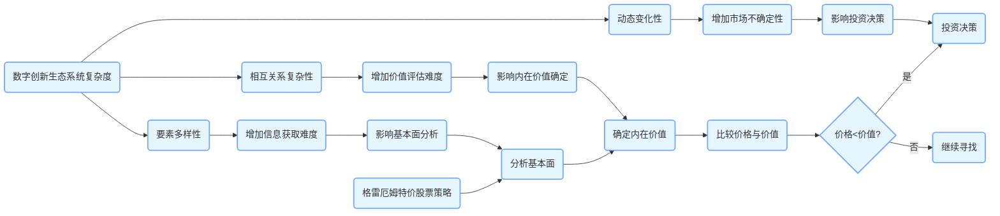

# 格雷厄姆特价股票策略在不同数字创新生态系统复杂度的效果

> 关键词：格雷厄姆特价股票策略、数字创新生态系统、复杂度、投资效果、股票市场

> 摘要：本文聚焦于格雷厄姆特价股票策略在不同数字创新生态系统复杂度下的效果。首先介绍相关背景知识，包括目的范围、预期读者等。接着阐述核心概念与联系，深入分析格雷厄姆特价股票策略原理及数字创新生态系统复杂度的内涵，并通过示意图和流程图展示其关系。然后详细讲解核心算法原理和具体操作步骤，运用 Python 代码进行说明。同时给出数学模型和公式，结合实际例子进行讲解。通过项目实战，搭建开发环境，实现源代码并进行解读分析。探讨该策略在不同实际应用场景中的表现，推荐相关工具和资源。最后总结未来发展趋势与挑战，解答常见问题并提供扩展阅读和参考资料，旨在全面探究格雷厄姆特价股票策略在数字创新生态系统中的应用效果。

## 1. 背景介绍 
### 1.1 目的和范围
在当今数字化快速发展的时代，数字创新生态系统不断演变，其复杂度对金融市场，特别是股票投资策略产生着深远影响。格雷厄姆特价股票策略作为一种经典的价值投资策略，以寻找被低估的股票为核心。本研究的目的在于深入探究该策略在不同数字创新生态系统复杂度下的效果，明确其优势与局限性。研究范围涵盖不同规模、不同行业的数字创新生态系统，以及采用格雷厄姆特价股票策略进行的股票投资活动，通过对大量数据的分析和实际案例的研究，全面评估该策略的表现。

### 1.2 预期读者
本文预期读者包括金融领域的专业投资者、研究人员、金融分析师，以及对股票投资和数字创新生态系统感兴趣的爱好者。专业投资者可以从本文中获取关于格雷厄姆特价股票策略在数字创新背景下的新见解，优化投资组合；研究人员可以将本文作为研究参考，深入探讨金融与数字创新的交叉领域；金融分析师可以借助本文的分析方法和结论，为客户提供更准确的投资建议；而爱好者则可以通过本文了解相关知识，提升对股票投资和数字创新的认知。

### 1.3 文档结构概述
本文将按照以下结构展开：首先介绍背景知识，包括目的范围、预期读者等。接着阐述核心概念与联系，展示相关原理和架构的示意图及流程图。然后讲解核心算法原理和具体操作步骤，用 Python 代码实现。给出数学模型和公式，并举例说明。通过项目实战，搭建开发环境，实现源代码并进行解读分析。探讨实际应用场景，推荐相关工具和资源。最后总结未来发展趋势与挑战，解答常见问题并提供扩展阅读和参考资料。

### 1.4 术语表
#### 1.4.1 核心术语定义
- **格雷厄姆特价股票策略**：由本杰明·格雷厄姆（Benjamin Graham）提出的一种价值投资策略，其核心思想是寻找市场价格低于其内在价值的股票进行投资，通过分析公司的财务报表、资产负债表等基本面信息，确定股票的内在价值，当股票价格低于内在价值一定比例时，认为该股票具有投资价值。
- **数字创新生态系统**：由数字技术、创新主体（如企业、科研机构等）、创新环境（政策、文化等）等要素相互作用形成的复杂系统，旨在促进数字技术的创新和应用，推动经济和社会的发展。
- **数字创新生态系统复杂度**：反映数字创新生态系统中要素的多样性、相互关系的复杂性以及系统动态变化的程度。要素越多、关系越复杂、变化越频繁，复杂度越高。

#### 1.4.2 相关概念解释
- **价值投资**：一种投资理念，强调通过对公司基本面的分析，寻找被市场低估的资产进行投资，长期持有以获取资产价值回归带来的收益。
- **股票内在价值**：股票所代表的公司的真实价值，通常通过对公司的盈利能力、资产状况、现金流等因素进行分析和评估来确定。

#### 1.4.3 缩略词列表
- **P/E**：市盈率（Price-to-Earnings Ratio），指股票价格除以每股收益的比率，用于衡量股票的估值水平。
- **P/B**：市净率（Price-to-Book Ratio），指股票价格除以每股净资产的比率，反映股票价格相对于公司净资产的倍数。

## 2. 核心概念与联系 

### 格雷厄姆特价股票策略原理
格雷厄姆特价股票策略基于价值投资理念，认为市场有时会错误定价股票，导致股票价格低于其内在价值。投资者可以通过分析公司的财务报表、行业地位等基本面信息，计算出股票的内在价值。常见的计算方法包括基于公司的盈利、资产等因素。例如，简单的盈利倍数法，将公司的每股收益乘以一个合理的市盈率倍数，得到股票的内在价值估计值。当股票价格低于内在价值一定比例（如 50%）时，认为该股票是被低估的特价股票，具有投资价值。

### 数字创新生态系统复杂度内涵
数字创新生态系统复杂度体现在多个方面。从要素角度看，包括不同类型的数字技术（如人工智能、区块链、大数据等）、创新主体（科技企业、初创公司、高校科研机构等）、创新环境要素（政策法规、金融支持、文化氛围等）。要素的多样性增加了系统的复杂度。从相互关系角度看，数字技术之间存在融合、竞争等关系，创新主体之间有合作、竞争等互动，创新环境要素对数字技术和创新主体产生影响，这些复杂的相互关系使得系统更加复杂。从动态变化角度看，数字技术不断更新换代，创新主体不断涌现和淘汰，创新环境也在不断调整，系统处于持续的变化之中，进一步增加了复杂度。

### 两者联系
数字创新生态系统复杂度对格雷厄姆特价股票策略的效果产生重要影响。在复杂度较低的数字创新生态系统中，市场信息相对透明，公司的基本面信息容易获取和分析，格雷厄姆特价股票策略更容易找到被低估的股票，投资效果可能较好。例如，在一个新兴的、规模较小的数字创新领域，企业数量有限，技术相对单一，投资者可以相对容易地了解每个企业的财务状况和发展前景，从而准确评估股票的内在价值。

而在复杂度较高的数字创新生态系统中，情况则较为复杂。一方面，数字技术的快速发展和创新可能导致公司的价值评估更加困难。例如，一些采用新兴数字技术的公司，其未来的盈利能力和发展前景难以准确预测，传统的基于财务报表的估值方法可能不再适用。另一方面，创新主体之间的复杂竞争和合作关系，以及创新环境的动态变化，可能导致股票价格的波动更加频繁和剧烈，增加了寻找特价股票的难度。例如，在人工智能领域，技术更新换代快，企业之间的竞争激烈，一家原本被认为具有潜力的公司可能因为竞争对手的技术突破而迅速失去优势，其股票价格也会随之大幅波动。

### 文本示意图
```plaintext
格雷厄姆特价股票策略 <----> 数字创新生态系统复杂度
    |                            |
    |  寻找被低估股票            |  要素多样性
    |                            |
    |  基于基本面分析            |  相互关系复杂性
    |                            |
    |  确定内在价值              |  动态变化性
    |                            |
    v                            v
投资决策 <---- 影响 ---- 市场不确定性
```

### Mermaid 流程图


## 3. 核心算法原理 & 具体操作步骤 

### 核心算法原理
格雷厄姆特价股票策略的核心算法主要围绕计算股票的内在价值和判断股票是否为特价股票展开。常见的计算内在价值的方法有以下几种：

#### 盈利倍数法
内在价值 $V$ 可以通过每股收益 $E$ 乘以一个合理的市盈率倍数 $P/E_{r}$ 来计算，公式为：
$V = E \times P/E_{r}$

其中，每股收益 $E$ 可以从公司的财务报表中获取，合理的市盈率倍数 $P/E_{r}$ 通常根据行业平均水平、公司的增长前景等因素来确定。

#### 资产估值法
内在价值 $V$ 可以通过公司的净资产 $B$ 乘以一个合理的市净率倍数 $P/B_{r}$ 来计算，公式为：
$V = B \times P/B_{r}$

其中，净资产 $B$ 可以从公司的资产负债表中获取，合理的市净率倍数 $P/B_{r}$ 同样根据行业特点、公司的资产质量等因素来确定。

### 具体操作步骤
#### 步骤 1：数据收集
收集公司的财务报表数据，包括利润表、资产负债表等，获取每股收益、净资产等关键指标。同时，收集行业相关数据，如行业平均市盈率、市净率等。

#### 步骤 2：计算内在价值
根据上述介绍的方法，选择合适的公式计算股票的内在价值。例如，对于盈利稳定的公司，可以优先使用盈利倍数法；对于资产较重的公司，可以考虑使用资产估值法。

#### 步骤 3：判断特价股票
将计算得到的内在价值与当前股票市场价格进行比较。如果股票价格低于内在价值一定比例（如 50%），则认为该股票是特价股票，具有投资价值。

#### 步骤 4：投资决策
根据判断结果，决定是否投资该股票。如果是特价股票，可以考虑买入；如果不是，则继续寻找其他潜在的特价股票。

### Python 源代码实现
```python
import pandas as pd

# 模拟收集的公司财务数据和行业数据
# 每股收益
eps = 2.0
# 行业平均市盈率
industry_pe = 15
# 净资产
book_value = 20.0
# 行业平均市净率
industry_pb = 2.0
# 当前股票价格
stock_price = 25.0

# 计算内在价值（盈利倍数法）
def calculate_intrinsic_value_earnings(eps, industry_pe):
    return eps * industry_pe

# 计算内在价值（资产估值法）
def calculate_intrinsic_value_book(book_value, industry_pb):
    return book_value * industry_pb

# 计算内在价值
intrinsic_value_earnings = calculate_intrinsic_value_earnings(eps, industry_pe)
intrinsic_value_book = calculate_intrinsic_value_book(book_value, industry_pb)

# 取两种方法的平均值作为最终内在价值
intrinsic_value = (intrinsic_value_earnings + intrinsic_value_book) / 2

# 判断是否为特价股票（价格低于内在价值 50%）
if stock_price < intrinsic_value * 0.5:
    print("该股票是特价股票，具有投资价值。")
else:
    print("该股票不是特价股票，继续寻找。")
```

### 代码解释
- `calculate_intrinsic_value_earnings` 函数：根据每股收益和行业平均市盈率计算内在价值，采用盈利倍数法。
- `calculate_intrinsic_value_book` 函数：根据净资产和行业平均市净率计算内在价值，采用资产估值法。
- 最后，取两种方法计算结果的平均值作为最终内在价值，并与当前股票价格进行比较，判断该股票是否为特价股票。

## 4. 数学模型和公式 & 详细讲解 & 举例说明 

### 盈利倍数法
#### 数学模型和公式
内在价值 $V$ 的计算公式为：
$$V = E \times P/E_{r}$$

其中，$E$ 表示每股收益，$P/E_{r}$ 表示合理的市盈率倍数。

#### 详细讲解
每股收益 $E$ 是公司净利润除以总股本得到的数值，反映了公司每股股票的盈利水平。合理的市盈率倍数 $P/E_{r}$ 是根据行业平均市盈率、公司的增长前景等因素确定的。一般来说，对于增长前景较好的公司，可以给予较高的市盈率倍数；对于增长缓慢或稳定的公司，市盈率倍数相对较低。

#### 举例说明
假设某公司的每股收益为 $3$ 元，行业平均市盈率为 $12$，考虑到该公司具有一定的增长潜力，给予 $15$ 的合理市盈率倍数。则该股票的内在价值为：
$$V = 3 \times 15 = 45 \text{（元）}$$

如果当前股票市场价格为 $30$ 元，低于内在价值，可能具有投资价值。

### 资产估值法
#### 数学模型和公式
内在价值 $V$ 的计算公式为：
$$V = B \times P/B_{r}$$

其中，$B$ 表示公司的净资产，$P/B_{r}$ 表示合理的市净率倍数。

#### 详细讲解
公司的净资产 $B$ 是公司总资产减去总负债得到的数值，反映了公司的实际资产价值。合理的市净率倍数 $P/B_{r}$ 是根据行业特点、公司的资产质量等因素确定的。对于资产质量较好、盈利能力较强的公司，可以给予较高的市净率倍数；对于资产质量较差、盈利能力较弱的公司，市净率倍数相对较低。

#### 举例说明
假设某公司的净资产为 $50$ 元，行业平均市净率为 $1.5$，考虑到该公司的资产质量较好，给予 $2$ 的合理市净率倍数。则该股票的内在价值为：
$$V = 50 \times 2 = 100 \text{（元）}$$

如果当前股票市场价格为 $80$ 元，低于内在价值，可能具有投资价值。

### 综合估值法
#### 数学模型和公式
在实际应用中，为了更准确地评估股票的内在价值，可以采用综合估值法，取盈利倍数法和资产估值法计算结果的加权平均值。公式为：
$$V = w_1 \times E \times P/E_{r} + w_2 \times B \times P/B_{r}$$

其中，$w_1$ 和 $w_2$ 分别为盈利倍数法和资产估值法的权重，且 $w_1 + w_2 = 1$。

#### 详细讲解
权重 $w_1$ 和 $w_2$ 的确定需要根据公司的具体情况进行判断。对于盈利稳定、现金流充足的公司，可以适当提高盈利倍数法的权重；对于资产较重、资产质量对公司价值影响较大的公司，可以适当提高资产估值法的权重。

#### 举例说明
假设某公司的每股收益为 $4$ 元，合理市盈率倍数为 $13$，净资产为 $60$ 元，合理市净率倍数为 $1.8$。设定盈利倍数法的权重 $w_1 = 0.6$，资产估值法的权重 $w_2 = 0.4$。则该股票的内在价值为：
$$V = 0.6 \times 4 \times 13 + 0.4 \times 60 \times 1.8$$
$$V = 31.2 + 43.2 = 74.4 \text{（元）}$$

如果当前股票市场价格为 $60$ 元，低于内在价值，可能具有投资价值。

## 5. 项目实战：代码实际案例和详细解释说明 

### 5.1  开发环境搭建
#### 操作系统
可以选择 Windows、Linux 或 macOS 等常见操作系统。本项目以 Windows 10 为例进行说明。

#### Python 环境
安装 Python 3.7 及以上版本。可以从 Python 官方网站（https://www.python.org/downloads/） 下载安装包，按照安装向导进行安装。安装过程中注意勾选“Add Python to PATH”选项，以便在命令行中可以直接使用 Python 命令。

#### 开发工具
推荐使用 PyCharm 作为开发工具。可以从 JetBrains 官方网站（https://www.jetbrains.com/pycharm/download/） 下载社区版，安装完成后打开 PyCharm，创建一个新的 Python 项目。

#### 第三方库安装
在项目中需要使用 `pandas`、`numpy` 等第三方库。可以使用以下命令在命令行中安装：
```sh
pip install pandas numpy
```

### 5.2  源代码详细实现和代码解读
```python
import pandas as pd
import numpy as np

# 模拟收集的公司财务数据和行业数据
# 定义公司列表
companies = [
    {
        "name": "Company A",
        "eps": 2.5,
        "book_value": 22.0,
        "stock_price": 30.0,
        "industry_pe": 14,
        "industry_pb": 1.6
    },
    {
        "name": "Company B",
        "eps": 1.8,
        "book_value": 18.0,
        "stock_price": 20.0,
        "industry_pe": 13,
        "industry_pb": 1.5
    },
    {
        "name": "Company C",
        "eps": 3.0,
        "book_value": 25.0,
        "stock_price": 40.0,
        "industry_pe": 15,
        "industry_pb": 1.7
    }
]

# 计算内在价值（盈利倍数法）
def calculate_intrinsic_value_earnings(eps, industry_pe):
    return eps * industry_pe

# 计算内在价值（资产估值法）
def calculate_intrinsic_value_book(book_value, industry_pb):
    return book_value * industry_pb

# 主函数
def main():
    results = []
    for company in companies:
        name = company["name"]
        eps = company["eps"]
        book_value = company["book_value"]
        stock_price = company["stock_price"]
        industry_pe = company["industry_pe"]
        industry_pb = company["industry_pb"]

        # 计算内在价值
        intrinsic_value_earnings = calculate_intrinsic_value_earnings(eps, industry_pe)
        intrinsic_value_book = calculate_intrinsic_value_book(book_value, industry_pb)

        # 取两种方法的平均值作为最终内在价值
        intrinsic_value = (intrinsic_value_earnings + intrinsic_value_book) / 2

        # 判断是否为特价股票（价格低于内在价值 50%）
        if stock_price < intrinsic_value * 0.5:
            is_bargain = True
        else:
            is_bargain = False

        result = {
            "name": name,
            "intrinsic_value": intrinsic_value,
            "stock_price": stock_price,
            "is_bargain": is_bargain
        }
        results.append(result)

    # 将结果转换为 DataFrame 并打印
    df = pd.DataFrame(results)
    print(df)

if __name__ == "__main__":
    main()
```

### 5.3  代码解读与分析
#### 代码结构
- **数据定义**：使用字典列表 `companies` 模拟收集的公司财务数据和行业数据，包括公司名称、每股收益、净资产、股票价格、行业平均市盈率和市净率。
- **函数定义**：
  - `calculate_intrinsic_value_earnings` 函数：根据每股收益和行业平均市盈率计算内在价值，采用盈利倍数法。
  - `calculate_intrinsic_value_book` 函数：根据净资产和行业平均市净率计算内在价值，采用资产估值法。
- **主函数 `main`**：遍历每个公司的数据，计算内在价值，判断是否为特价股票，并将结果存储在 `results` 列表中。最后将结果转换为 `pandas` 的 `DataFrame` 并打印。

#### 代码分析
- **数据处理**：通过模拟数据进行演示，实际应用中可以从数据库、文件或网络接口中获取真实的公司财务数据和行业数据。
- **估值方法**：采用盈利倍数法和资产估值法计算内在价值，并取平均值作为最终内在价值，综合考虑了公司的盈利和资产情况。
- **特价股票判断**：根据股票价格是否低于内在价值的 50% 来判断是否为特价股票，这是一个简单的判断标准，实际应用中可以根据具体情况进行调整。

## 6. 实际应用场景 
### 新兴数字创新领域
在新兴数字创新领域，如人工智能、区块链等，数字创新生态系统复杂度相对较高。这些领域的公司通常具有较高的创新性和不确定性，技术更新换代快，市场竞争激烈。格雷厄姆特价股票策略在这个场景下的应用具有一定的挑战性。一方面，由于公司的未来盈利能力和发展前景难以准确预测，传统的基于财务报表的估值方法可能不再适用。另一方面，市场对这些新兴领域的关注度较高，股票价格波动较大，难以找到真正被低估的股票。

然而，对于一些具有核心技术、良好的团队和市场前景的公司，通过深入的基本面分析和对行业趋势的把握，仍然有可能找到被市场低估的特价股票。例如，在人工智能领域，一些专注于特定细分领域的公司，虽然目前规模较小，但具有独特的技术优势和商业潜力，其股票价格可能被市场低估。此时，采用格雷厄姆特价股票策略，通过对公司的技术实力、研发投入、客户资源等方面进行分析，计算其内在价值，可能会发现投资机会。

### 成熟数字创新行业
在成熟数字创新行业，如互联网、电子商务等，数字创新生态系统复杂度相对较低。这些行业的市场格局相对稳定，公司的商业模式和盈利模式较为清晰，财务数据相对容易获取和分析。格雷厄姆特价股票策略在这个场景下的应用相对较为容易。投资者可以通过分析公司的财务报表，计算其内在价值，寻找被市场低估的股票。

例如，在电子商务行业，一些传统的电商企业可能由于市场竞争、行业转型等原因，股票价格出现下跌，但公司的基本面仍然良好，具有一定的资产价值和盈利能力。此时，采用格雷厄姆特价股票策略，通过对公司的资产负债表、利润表等财务数据进行分析，计算其内在价值，可能会发现被低估的投资机会。

### 传统行业数字化转型
在传统行业数字化转型的过程中，数字创新生态系统复杂度逐渐增加。传统行业的公司在进行数字化转型时，需要投入大量的资金和资源，面临技术创新、市场竞争等多方面的挑战。格雷厄姆特价股票策略在这个场景下的应用需要综合考虑传统行业的基本面和数字化转型的潜力。

例如，在制造业数字化转型过程中，一些传统制造企业通过引入智能制造技术、大数据分析等手段，提升了生产效率和产品质量，具有一定的数字化转型潜力。但由于市场对其数字化转型的前景存在疑虑，股票价格可能被低估。此时，采用格雷厄姆特价股票策略，不仅要分析公司的传统业务基本面，还要评估其数字化转型的进展和潜力，计算其内在价值，寻找投资机会。

## 7. 工具和资源推荐
### 7.1 学习资源推荐
#### 7.1.1 书籍推荐
- 《聪明的投资者》（The Intelligent Investor）：本杰明·格雷厄姆（Benjamin Graham）的经典著作，详细阐述了价值投资的理念和方法，是学习格雷厄姆特价股票策略的必读之书。
- 《证券分析》（Security Analysis）：同样是本杰明·格雷厄姆的著作，系统地介绍了证券分析的基本原理和方法，对股票估值、财务报表分析等方面进行了深入探讨。
- 《数字经济时代的投资策略》：该书结合数字经济的发展趋势，探讨了在数字创新生态系统下的投资策略和方法，对理解格雷厄姆特价股票策略在数字创新背景下的应用具有参考价值。

#### 7.1.2 在线课程
- Coursera 平台上的“投资学原理”课程：由知名大学的教授授课，系统地介绍了投资学的基本原理和方法，包括股票投资、债券投资等内容。
- edX 平台上的“金融市场与投资策略”课程：讲解了金融市场的运作机制和各种投资策略，对格雷厄姆特价股票策略有专门的介绍和分析。

#### 7.1.3 技术博客和网站
- Seeking Alpha：一个专业的金融投资博客平台，提供大量的股票分析文章和投资策略讨论，其中不乏关于格雷厄姆特价股票策略的应用案例和分析。
- ValueWalk：专注于价值投资领域，分享价值投资的理念、方法和案例，对学习格雷厄姆特价股票策略有很大的帮助。

### 7.2 开发工具框架推荐
#### 7.2.1 IDE和编辑器
- PyCharm：一款功能强大的 Python 集成开发环境，提供代码编辑、调试、版本控制等多种功能，适合开发基于 Python 的股票分析和投资策略程序。
- Visual Studio Code：一款轻量级的代码编辑器，支持多种编程语言，通过安装相关插件可以实现 Python 开发的功能，具有良好的扩展性和用户体验。

#### 7.2.2 调试和性能分析工具
- PDB：Python 自带的调试工具，可以在代码中设置断点，逐步执行代码，查看变量的值和程序的执行流程，帮助调试程序。
- cProfile：Python 的性能分析工具，可以分析程序的运行时间和函数调用情况，找出程序中的性能瓶颈，进行优化。

#### 7.2.3 相关框架和库
- Pandas：一个强大的数据处理和分析库，提供了丰富的数据结构和数据处理函数，适合处理和分析公司的财务数据和股票市场数据。
- NumPy：一个用于科学计算的 Python 库，提供了高效的数组操作和数学函数，在股票分析和估值计算中可以提高计算效率。

### 7.3 相关论文著作推荐
#### 7.3.1 经典论文
- “The Superinvestors of Graham-and-Doddsville”：沃伦·巴菲特（Warren Buffett）的经典论文，介绍了格雷厄姆价值投资理念的成功案例，对理解格雷厄姆特价股票策略的有效性具有重要意义。
- “Value Investing: The Use of Historical Financial Statement Information to Separate Winners from Losers”：该论文探讨了价值投资策略中如何利用历史财务报表信息来筛选股票，为格雷厄姆特价股票策略提供了理论支持。

#### 7.3.2 最新研究成果
- 关注顶级金融学术期刊，如《Journal of Finance》、《Review of Financial Studies》等，这些期刊发表了许多关于投资策略和金融市场的最新研究成果，包括格雷厄姆特价股票策略在不同市场环境下的应用效果研究。

#### 7.3.3 应用案例分析
- 一些金融研究机构和咨询公司会发布关于股票投资策略的应用案例分析报告，可以通过网络搜索获取相关报告，了解格雷厄姆特价股票策略在实际投资中的应用情况和效果。

## 8. 总结：未来发展趋势与挑战
### 未来发展趋势
#### 与数字技术深度融合
随着数字技术的不断发展，格雷厄姆特价股票策略将与大数据、人工智能等技术深度融合。通过大数据技术，可以获取更全面、更准确的公司财务数据和市场信息，提高股票估值的准确性。人工智能技术可以对海量数据进行分析和挖掘，发现潜在的投资机会，优化投资决策。

#### 适应数字创新生态系统变化
数字创新生态系统不断演变，复杂度不断增加。格雷厄姆特价股票策略需要不断适应这种变化，调整估值方法和投资策略。例如，对于采用新兴数字技术的公司，需要开发新的估值模型，考虑技术创新、知识产权等因素对公司价值的影响。

#### 国际化发展
随着全球经济一体化的发展，股票市场的国际化程度越来越高。格雷厄姆特价股票策略将在全球范围内得到更广泛的应用，投资者可以在不同国家和地区的股票市场中寻找被低估的股票，实现资产的全球配置。

### 挑战
#### 数据质量和可靠性
在数字创新生态系统中，数据量庞大且来源复杂，数据质量和可靠性成为一个重要挑战。不准确或不完整的数据可能导致股票估值错误，影响投资决策的准确性。因此，需要建立有效的数据质量管理机制，确保数据的准确性和可靠性。

#### 技术创新带来的不确定性
数字技术的快速发展和创新带来了许多不确定性。新的商业模式、技术应用不断涌现，公司的价值评估变得更加困难。例如，一些基于区块链技术的公司，其业务模式和盈利模式与传统公司有很大不同，传统的估值方法可能不再适用。因此，需要不断探索和创新估值方法，以适应技术创新带来的变化。

#### 市场情绪和投资者行为影响
股票市场受到市场情绪和投资者行为的影响较大。在数字创新生态系统中，市场信息传播速度加快，投资者情绪波动更加频繁和剧烈。这些因素可能导致股票价格偏离其内在价值，增加了寻找特价股票的难度。因此，投资者需要具备良好的心理素质和投资策略，不受市场情绪的影响，做出理性的投资决策。

## 9. 附录：常见问题与解答
### 问题 1：格雷厄姆特价股票策略适用于所有类型的股票吗？
解答：不是。格雷厄姆特价股票策略主要适用于具有一定基本面支撑、财务状况相对稳定的公司股票。对于一些新兴的、高风险的成长型公司，由于其未来盈利能力和发展前景难以准确预测，传统的基于财务报表的估值方法可能不再适用，该策略的效果可能会受到影响。

### 问题 2：如何确定合理的市盈率倍数和市净率倍数？
解答：合理的市盈率倍数和市净率倍数需要根据行业特点、公司的增长前景、资产质量等因素来确定。一般可以参考行业平均水平，并结合公司的具体情况进行调整。对于增长前景较好的公司，可以给予较高的倍数；对于增长缓慢或稳定的公司，倍数相对较低。同时，还可以参考同行业其他类似公司的估值情况进行判断。

### 问题 3：在数字创新生态系统中，如何获取准确的公司财务数据和市场信息？
解答：可以通过以下途径获取数据和信息：
- 公司官方网站：公司会定期发布财务报表和相关公告，可以从中获取公司的财务数据和业务信息。
- 证券交易所网站：证券交易所会公布上市公司的财务报告和相关信息，是获取股票市场数据的重要来源。
- 金融数据提供商：如 Bloomberg、Wind 等，提供专业的金融数据服务，包括公司财务数据、市场行情数据等。
- 新闻媒体和研究机构：关注金融新闻、行业研究报告等，获取有关公司和市场的最新信息。

### 问题 4：如果股票价格长期低于内在价值，应该如何处理？
解答：如果股票价格长期低于内在价值，需要进一步分析原因。可能是市场对公司存在误解，也可能是公司自身存在问题。如果是市场误解导致的，可以继续持有股票，等待市场价值回归。如果是公司自身问题，如经营不善、行业竞争加剧等，需要重新评估公司的投资价值，考虑是否卖出股票。

## 10. 扩展阅读 & 参考资料
### 扩展阅读
- 《金融炼金术》（The Alchemy of Finance）：乔治·索罗斯（George Soros）的著作，介绍了他的投资哲学和方法，对理解金融市场的运行机制和投资策略有一定的启发。
- 《漫步华尔街》（A Random Walk Down Wall Street）：伯顿·马尔基尔（Burton Malkiel）的经典著作，探讨了股票市场的随机性和有效性，对投资策略的选择有一定的参考价值。

### 参考资料
- 本杰明·格雷厄姆（Benjamin Graham）. 《聪明的投资者》（The Intelligent Investor）. 机械工业出版社.
- 本杰明·格雷厄姆（Benjamin Graham）, 戴维·多德（David Dodd）. 《证券分析》（Security Analysis）. 中国人民大学出版社.
- Coursera 平台课程：“投资学原理”. https://www.coursera.org/
- edX 平台课程：“金融市场与投资策略”. https://www.edx.org/
- Seeking Alpha 网站：https://seekingalpha.com/
- ValueWalk 网站：https://www.valuewalk.com/

作者：AI天才研究院/AI Genius Institute & 禅与计算机程序设计艺术 /Zen And The Art of Computer Programming