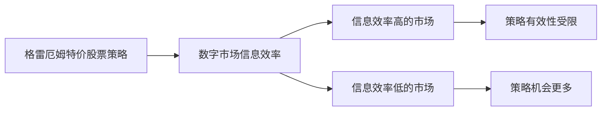

# 格雷厄姆特价股票策略在不同数字市场信息效率下的表现

> 关键词：格雷厄姆特价股票策略、数字市场、信息效率、投资表现、市场有效性

> 摘要：本文旨在深入探讨格雷厄姆特价股票策略在不同数字市场信息效率环境下的表现。首先介绍了研究的背景、目的、预期读者等基本信息，阐述了核心概念及相互联系。接着详细讲解了该策略的核心算法原理，并给出具体操作步骤的Python代码实现。同时，运用数学模型和公式对策略进行量化分析，并举例说明。通过项目实战部分，展示了该策略在实际应用中的代码实现和详细解读。分析了该策略在不同实际场景下的应用情况，并推荐了相关的学习资源、开发工具框架以及论文著作。最后总结了该策略的未来发展趋势与挑战，还给出了常见问题解答和扩展阅读参考资料。

## 1. 背景介绍 
### 1.1 目的和范围
本研究的主要目的是探究格雷厄姆特价股票策略在不同数字市场信息效率条件下的表现。随着数字技术的发展，金融市场的信息传播速度和效率发生了巨大变化。了解该策略在不同信息效率环境下的效果，有助于投资者更好地运用这一经典策略，优化投资组合，提高投资回报率。研究范围涵盖了各种数字市场，包括股票市场、数字货币市场等，分析不同市场中信息效率的差异对格雷厄姆特价股票策略的影响。

### 1.2 预期读者
本文预期读者主要包括金融投资者、金融分析师、量化投资从业者、金融科技研究人员以及对投资策略和市场效率感兴趣的学术研究人员。对于投资者来说，可以从中了解如何在不同市场环境下运用格雷厄姆特价股票策略；金融分析师和量化投资从业者可以获取关于策略量化分析和实际应用的技术细节；金融科技研究人员可以关注数字市场信息效率的技术层面问题；学术研究人员则可以将本文作为相关领域研究的参考资料。

### 1.3 文档结构概述
本文共分为十个部分。第一部分是背景介绍，阐述研究的目的、预期读者和文档结构等基本信息。第二部分介绍核心概念与联系，包括格雷厄姆特价股票策略、数字市场信息效率等概念，并给出相应的文本示意图和Mermaid流程图。第三部分详细讲解核心算法原理和具体操作步骤，通过Python代码进行详细阐述。第四部分运用数学模型和公式对策略进行量化分析，并举例说明。第五部分是项目实战，包括开发环境搭建、源代码详细实现和代码解读。第六部分分析该策略在不同实际场景下的应用情况。第七部分推荐相关的学习资源、开发工具框架以及论文著作。第八部分总结该策略的未来发展趋势与挑战。第九部分是附录，给出常见问题与解答。第十部分提供扩展阅读和参考资料。

### 1.4 术语表
#### 1.4.1 核心术语定义
- **格雷厄姆特价股票策略**：由本杰明·格雷厄姆（Benjamin Graham）提出的一种价值投资策略，主要通过寻找被市场低估的股票进行投资。该策略通常关注股票的基本面指标，如市盈率、市净率等，以筛选出具有投资价值的股票。
- **数字市场**：指基于数字技术进行交易和信息传播的金融市场，包括股票市场、数字货币市场、期货市场等电子化交易市场。
- **信息效率**：指市场中信息传播的速度和准确性，以及投资者对信息的反应程度。信息效率高的市场，信息能够迅速反映在资产价格中；信息效率低的市场，资产价格可能无法及时反映所有相关信息。

#### 1.4.2 相关概念解释
- **价值投资**：一种投资理念，强调通过分析公司的基本面，寻找被低估的资产进行投资，以获取长期的投资回报。格雷厄姆特价股票策略是价值投资的一种具体应用。
- **市场有效性**：与信息效率密切相关，指市场价格是否能够充分反映所有可用信息。有效市场分为弱式有效、半强式有效和强式有效三种类型，不同类型的有效市场对投资策略的有效性有不同的影响。

#### 1.4.3 缩略词列表
- **P/E**：市盈率（Price-to-Earnings Ratio），指股票价格与每股收益的比率，用于衡量股票的估值水平。
- **P/B**：市净率（Price-to-Book Ratio），指股票价格与每股净资产的比率，也是衡量股票估值的重要指标。

## 2. 核心概念与联系 

### 格雷厄姆特价股票策略原理
格雷厄姆特价股票策略的核心思想是寻找被市场低估的股票。格雷厄姆认为，市场有时会出现非理性行为，导致某些股票的价格低于其内在价值。投资者可以通过分析股票的基本面指标，如市盈率、市净率等，筛选出这些被低估的股票进行投资。当市场逐渐恢复理性，这些股票的价格会向其内在价值回归，从而为投资者带来收益。

### 数字市场信息效率
数字市场信息效率是指市场中信息传播的速度和准确性，以及投资者对信息的反应程度。在信息效率高的数字市场中，新的信息能够迅速传播并反映在资产价格中，市场价格能够及时、准确地反映所有可用信息。而在信息效率低的数字市场中，信息传播可能存在延迟或失真，投资者对信息的反应也可能不及时，导致资产价格无法及时反映所有相关信息。

### 两者的联系
格雷厄姆特价股票策略的有效性在很大程度上依赖于市场的信息效率。在信息效率低的市场中，由于信息传播不及时或不准确，股票价格可能无法充分反映其内在价值，这为格雷厄姆特价股票策略提供了更多的投资机会。投资者可以通过深入分析基本面，发现那些被市场低估的股票。而在信息效率高的市场中，股票价格能够迅速反映所有可用信息，被低估的股票很难长期存在，格雷厄姆特价股票策略的有效性可能会受到一定的限制。

### 文本示意图
```plaintext
              格雷厄姆特价股票策略
                    |
                    | 依赖于
                    |
            数字市场信息效率
            /                 \
  信息效率高的市场        信息效率低的市场
    策略有效性受限         策略机会更多
```

### Mermaid流程图


## 3. 核心算法原理 & 具体操作步骤 

### 核心算法原理
格雷厄姆特价股票策略的核心算法是通过筛选具有特定基本面指标的股票来构建投资组合。主要的筛选指标包括市盈率（P/E）和市净率（P/B）。一般来说，格雷厄姆建议选择市盈率低于一定阈值（如15）且市净率低于一定阈值（如1.5）的股票。此外，还可以考虑其他因素，如股息率、财务稳定性等。

### 具体操作步骤
1. **数据收集**：收集股票的基本面数据，包括市盈率、市净率、股息率等。可以从金融数据提供商（如雅虎财经、东方财富等）获取这些数据。
2. **筛选条件设定**：根据格雷厄姆的建议，设定市盈率和市净率的阈值。例如，市盈率低于15且市净率低于1.5。
3. **股票筛选**：根据设定的筛选条件，从收集到的数据中筛选出符合条件的股票。
4. **投资组合构建**：将筛选出的股票按照一定的比例构建投资组合。可以采用等权重或其他优化方法进行组合构建。

### Python代码实现
```python
import pandas as pd

# 模拟收集到的股票数据
data = {
    '股票代码': ['000001', '000002', '000003', '000004', '000005'],
    '市盈率': [12, 18, 10, 20, 13],
    '市净率': [1.2, 1.6, 1.1, 1.8, 1.4]
}
df = pd.DataFrame(data)

# 设定筛选条件
pe_threshold = 15
pb_threshold = 1.5

# 筛选符合条件的股票
selected_stocks = df[(df['市盈率'] < pe_threshold) & (df['市净率'] < pb_threshold)]

print("筛选出的股票：")
print(selected_stocks)
```
### 代码解释
1. **数据收集**：使用`pandas`库创建一个包含股票代码、市盈率和市净率的DataFrame对象，模拟收集到的股票数据。
2. **筛选条件设定**：设定市盈率阈值`pe_threshold`为15，市净率阈值`pb_threshold`为1.5。
3. **股票筛选**：使用布尔索引筛选出市盈率低于15且市净率低于1.5的股票。
4. **结果输出**：打印筛选出的股票信息。

## 4. 数学模型和公式 & 详细讲解 & 举例说明 

### 数学模型和公式
#### 市盈率（P/E）
市盈率是股票价格与每股收益的比率，计算公式为：
$$P/E = \frac{股票价格}{每股收益}$$
市盈率反映了投资者为获取每股收益所愿意支付的价格。较低的市盈率通常表示股票被低估。

#### 市净率（P/B）
市净率是股票价格与每股净资产的比率，计算公式为：
$$P/B = \frac{股票价格}{每股净资产}$$
市净率反映了股票价格相对于每股净资产的倍数。较低的市净率通常表示股票的价值被低估。

#### 投资组合收益率
假设投资组合中有 $n$ 只股票，每只股票的权重为 $w_i$，收益率为 $r_i$，则投资组合的收益率 $R_p$ 计算公式为：
$$R_p = \sum_{i=1}^{n} w_i r_i$$

### 详细讲解
- **市盈率**：市盈率是衡量股票估值的重要指标之一。如果一只股票的市盈率较低，说明投资者为获取每股收益所支付的价格相对较低，可能意味着该股票被市场低估。但需要注意的是，市盈率也受到行业、公司增长前景等因素的影响，不同行业的合理市盈率水平可能存在较大差异。
- **市净率**：市净率反映了股票价格与每股净资产的关系。每股净资产是公司的账面价值，市净率较低表示股票价格相对于其账面价值较低，可能存在投资价值。但市净率也不能单独作为投资决策的依据，还需要考虑公司的盈利能力、资产质量等因素。
- **投资组合收益率**：投资组合收益率是衡量投资组合绩效的重要指标。通过合理分配不同股票的权重，可以降低投资组合的风险，提高收益率。

### 举例说明
假设我们有三只股票，其相关信息如下表所示：

| 股票代码 | 股票价格 | 每股收益 | 每股净资产 | 权重 | 收益率 |
| ---- | ---- | ---- | ---- | ---- | ---- |
| 000001 | 10元 | 1元 | 5元 | 0.3 | 0.1 |
| 000002 | 20元 | 2元 | 10元 | 0.4 | 0.15 |
| 000003 | 15元 | 1.5元 | 7.5元 | 0.3 | 0.08 |

首先计算每只股票的市盈率和市净率：
- 股票000001：
  - 市盈率 $P/E = \frac{10}{1} = 10$
  - 市净率 $P/B = \frac{10}{5} = 2$
- 股票000002：
  - 市盈率 $P/E = \frac{20}{2} = 10$
  - 市净率 $P/B = \frac{20}{10} = 2$
- 股票000003：
  - 市盈率 $P/E = \frac{15}{1.5} = 10$
  - 市净率 $P/B = \frac{15}{7.5} = 2$

然后计算投资组合的收益率：
$$R_p = 0.3\times0.1 + 0.4\times0.15 + 0.3\times0.08 = 0.114$$
即投资组合的收益率为11.4%。

## 5. 项目实战：代码实际案例和详细解释说明 

### 5.1  开发环境搭建
#### 安装Python
首先需要安装Python，建议使用Python 3.7及以上版本。可以从Python官方网站（https://www.python.org/downloads/）下载并安装。

#### 安装必要的库
在项目中，我们需要使用`pandas`库进行数据处理，`yfinance`库获取股票数据。可以使用以下命令进行安装：
```sh
pip install pandas yfinance
```

### 5.2  源代码详细实现和代码解读
```python
import pandas as pd
import yfinance as yf

# 定义股票列表
stock_list = ['AAPL', 'MSFT', 'GOOG', 'AMZN', 'FB']

# 获取股票数据
data = yf.download(stock_list, start='2020-01-01', end='2021-01-01')

# 计算市盈率和市净率
pe_ratios = {}
pb_ratios = {}
for stock in stock_list:
    ticker = yf.Ticker(stock)
    pe_ratio = ticker.info.get('trailingPE')
    pb_ratio = ticker.info.get('priceToBook')
    pe_ratios[stock] = pe_ratio
    pb_ratios[stock] = pb_ratio

# 创建DataFrame
df = pd.DataFrame({
    '股票代码': stock_list,
    '市盈率': [pe_ratios[stock] for stock in stock_list],
    '市净率': [pb_ratios[stock] for stock in stock_list]
})

# 设定筛选条件
pe_threshold = 20
pb_threshold = 2

# 筛选符合条件的股票
selected_stocks = df[(df['市盈率'] < pe_threshold) & (df['市净率'] < pb_threshold)]

print("筛选出的股票：")
print(selected_stocks)
```
### 代码解读与分析
1. **导入必要的库**：导入`pandas`和`yfinance`库，分别用于数据处理和获取股票数据。
2. **定义股票列表**：定义要分析的股票列表，这里选择了苹果（AAPL）、微软（MSFT）、谷歌（GOOG）、亚马逊（AMZN）和脸书（FB）。
3. **获取股票数据**：使用`yfinance`库的`download`方法获取指定时间段内的股票数据。
4. **计算市盈率和市净率**：遍历股票列表，使用`yfinance`库的`Ticker`对象获取每只股票的市盈率和市净率。
5. **创建DataFrame**：将股票代码、市盈率和市净率数据存储在`pandas`的DataFrame对象中。
6. **设定筛选条件**：设定市盈率阈值为20，市净率阈值为2。
7. **筛选符合条件的股票**：使用布尔索引筛选出市盈率低于20且市净率低于2的股票。
8. **结果输出**：打印筛选出的股票信息。

## 6. 实际应用场景 
### 股票市场投资
在股票市场中，格雷厄姆特价股票策略可以帮助投资者寻找被低估的股票，构建投资组合。投资者可以根据市场的信息效率调整筛选条件。在信息效率低的市场中，可以适当放宽筛选条件，以发现更多的投资机会；在信息效率高的市场中，需要更加严格地筛选股票，以提高投资组合的质量。

### 价值投资基金管理
价值投资基金通常采用格雷厄姆特价股票策略进行投资。基金经理可以利用该策略筛选出具有投资价值的股票，构建基金投资组合。通过对不同市场信息效率的分析，基金经理可以调整投资组合的权重和结构，以适应市场变化，提高基金的收益率。

### 量化投资策略开发
在量化投资领域，格雷厄姆特价股票策略可以作为基础策略进行开发和优化。量化投资者可以结合其他技术指标和机器学习算法，对该策略进行改进，提高策略的有效性和稳定性。例如，可以使用机器学习算法对股票的基本面数据进行分析，预测股票的未来走势，从而更好地筛选股票。

## 7. 工具和资源推荐
### 7.1 学习资源推荐
#### 7.1.1 书籍推荐
- 《聪明的投资者》（The Intelligent Investor）：本杰明·格雷厄姆的经典著作，详细介绍了价值投资的理念和方法，是学习格雷厄姆特价股票策略的必读之书。
- 《证券分析》（Security Analysis）：同样是本杰明·格雷厄姆的著作，对证券分析的理论和方法进行了系统阐述，为投资者提供了深入分析股票的工具和思路。
- 《财务报表分析与证券定价》（Financial Statement Analysis and Security Valuation）：帮助读者掌握财务报表分析的方法，从而更好地理解股票的基本面数据，为投资决策提供依据。

#### 7.1.2 在线课程
- Coursera上的“投资学原理”（Principles of Investing）课程：由知名教授授课，系统介绍了投资学的基本原理和方法，包括价值投资策略。
- edX上的“金融市场”（Financial Markets）课程：对金融市场的运行机制和投资策略进行了深入讲解，有助于学习者了解格雷厄姆特价股票策略在金融市场中的应用。

#### 7.1.3 技术博客和网站
- Seeking Alpha：提供丰富的金融分析文章和投资策略讨论，包括对格雷厄姆特价股票策略的分析和应用案例。
- 雪球网：国内知名的投资社区，有很多投资者分享自己的投资经验和策略，其中不乏对格雷厄姆特价股票策略的讨论和实践。

### 7.2 开发工具框架推荐
#### 7.2.1 IDE和编辑器
- PyCharm：功能强大的Python集成开发环境，提供代码编辑、调试、版本控制等功能，适合Python开发。
- Jupyter Notebook：交互式编程环境，方便进行数据探索和代码演示，常用于数据分析和机器学习项目。

#### 7.2.2 调试和性能分析工具
- pdb：Python自带的调试工具，可以帮助开发者定位代码中的问题。
- cProfile：Python的性能分析工具，可以分析代码的运行时间和资源消耗，帮助优化代码性能。

#### 7.2.3 相关框架和库
- pandas：用于数据处理和分析的Python库，提供了高效的数据结构和数据分析工具。
- yfinance：用于获取股票数据的Python库，简单易用，可以方便地获取股票的历史数据和基本面信息。
- scikit-learn：用于机器学习的Python库，提供了丰富的机器学习算法和工具，可以用于对股票数据进行分析和预测。

### 7.3 相关论文著作推荐
#### 7.3.1 经典论文
- Fama, E. F., & French, K. R. (1992). The cross-section of expected stock returns. The Journal of Finance, 47(2), 427-465. 该论文提出了Fama-French三因子模型，对股票收益率的影响因素进行了深入分析，为价值投资策略提供了理论支持。
- Graham, B., & Dodd, D. L. (1934). Security Analysis. McGraw-Hill. 本杰明·格雷厄姆和戴维·多德的经典著作，奠定了价值投资的理论基础。

#### 7.3.2 最新研究成果
- Asness, C. S., Frazzini, A., & Pedersen, L. H. (2019). Quality minus junk. The Journal of Financial Economics, 131(2), 272-299. 该论文研究了质量因子在投资中的应用，对格雷厄姆特价股票策略的优化有一定的参考价值。
- Harvey, C. R., Liu, Y., & Zhu, H. (2016). …and the cross-section of expected returns. The Review of Financial Studies, 29(1), 5-68. 该论文对金融领域的各种因子进行了综合分析，有助于深入理解股票收益率的影响因素。

#### 7.3.3 应用案例分析
- Greenblatt, J. (2005). The Little Book That Beats the Market. Wiley. 作者介绍了一种简单有效的投资策略，通过筛选具有高收益率和低市盈率的股票，实现了较好的投资回报，是格雷厄姆特价股票策略的一个实际应用案例。

## 8. 总结：未来发展趋势与挑战
### 未来发展趋势
- **与新技术融合**：随着人工智能、大数据等技术的发展，格雷厄姆特价股票策略将与这些新技术深度融合。例如，利用机器学习算法对海量的股票数据进行分析，挖掘更多的投资机会；使用自然语言处理技术对新闻、研报等文本信息进行分析，提高信息处理的效率和准确性。
- **跨市场应用**：该策略将不仅仅局限于股票市场，还将拓展到其他金融市场，如债券市场、期货市场、数字货币市场等。不同市场的信息效率和投资特点不同，需要对策略进行相应的调整和优化。
- **个性化投资**：未来投资者对个性化投资的需求将不断增加。格雷厄姆特价股票策略可以根据投资者的风险偏好、投资目标等因素进行个性化定制，为投资者提供更加符合其需求的投资方案。

### 挑战
- **信息过载**：在数字时代，金融市场的信息呈爆炸式增长。投资者面临着信息过载的问题，如何从海量的信息中筛选出有价值的信息，是该策略面临的一大挑战。
- **市场有效性提高**：随着市场的发展和投资者的成熟，市场的信息效率将不断提高。在有效市场中，被低估的股票很难长期存在，格雷厄姆特价股票策略的有效性可能会受到一定的限制。
- **模型失效风险**：该策略基于历史数据和一定的假设条件建立模型，但市场环境是不断变化的。当市场出现重大变化时，模型可能会失效，导致投资决策失误。

## 9. 附录：常见问题与解答
### 问题1：格雷厄姆特价股票策略一定能获得高收益吗？
解答：格雷厄姆特价股票策略并不能保证一定能获得高收益。该策略是基于价值投资的理念，寻找被低估的股票。但股票价格的走势受到多种因素的影响，包括宏观经济环境、行业发展趋势、公司基本面变化等。即使股票被低估，其价格也可能不会在短期内回归到内在价值，甚至可能继续下跌。因此，投资者在使用该策略时，需要充分考虑市场风险，合理控制投资组合的风险。

### 问题2：如何确定市盈率和市净率的阈值？
解答：市盈率和市净率的阈值没有固定的标准，需要根据市场情况、行业特点和投资者的风险偏好来确定。一般来说，格雷厄姆建议市盈率低于15且市净率低于1.5。但在不同的市场环境和行业中，合理的阈值可能会有所不同。例如，一些高成长行业的股票，其市盈率和市净率可能会相对较高。投资者可以通过对历史数据的分析和对市场的研究，结合自己的投资经验，确定适合自己的阈值。

### 问题3：该策略在不同市场信息效率下的表现差异有多大？
解答：该策略在不同市场信息效率下的表现差异较大。在信息效率低的市场中，由于信息传播不及时或不准确，股票价格可能无法充分反映其内在价值，这为该策略提供了更多的投资机会。投资者可以通过深入分析基本面，发现那些被市场低估的股票。而在信息效率高的市场中，股票价格能够迅速反映所有可用信息，被低估的股票很难长期存在，该策略的有效性可能会受到一定的限制。但具体的表现差异还需要根据市场的具体情况和投资者的操作水平来确定。

## 10. 扩展阅读 & 参考资料
### 扩展阅读
- 《金融炼金术》（The Alchemy of Finance）：乔治·索罗斯的著作，介绍了他的投资哲学和操作方法，对理解金融市场的运行机制和投资策略有一定的启发。
- 《黑天鹅》（The Black Swan）：纳西姆·尼古拉斯·塔勒布的著作，探讨了不可预测的重大事件对金融市场的影响，提醒投资者要关注市场的不确定性。

### 参考资料
- Graham, B. (1949). The Intelligent Investor. Harper & Brothers.
- Fama, E. F., & French, K. R. (1993). Common risk factors in the returns on stocks and bonds. Journal of Financial Economics, 33(1), 3-56.
- Damodaran, A. (2012). Investment Fables: Exposing the Myths of "Can't Miss" Investment Opportunities. Pearson.

作者：AI天才研究院/AI Genius Institute & 禅与计算机程序设计艺术 /Zen And The Art of Computer Programming