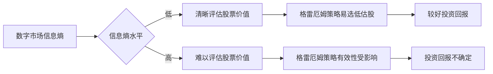

# 格雷厄姆特价股票策略在不同数字市场信息熵水平下的表现

> 关键词：格雷厄姆特价股票策略、数字市场、信息熵水平、策略表现、股票投资

> 摘要：本文旨在深入探讨格雷厄姆特价股票策略在不同数字市场信息熵水平下的表现。首先介绍了研究的背景、目的、预期读者、文档结构和相关术语。接着阐述了格雷厄姆特价股票策略和信息熵的核心概念及它们之间的联系，并给出了相应的文本示意图和Mermaid流程图。详细讲解了核心算法原理和具体操作步骤，同时用Python源代码进行了示例。分析了相关的数学模型和公式，并举例说明。通过项目实战展示了代码的实际案例和详细解释。探讨了该策略在不同信息熵水平下的实际应用场景。推荐了学习资源、开发工具框架和相关论文著作。最后总结了未来发展趋势与挑战，还给出了常见问题与解答以及扩展阅读和参考资料。

## 1. 背景介绍 
### 1.1 目的和范围
本研究的主要目的是探究格雷厄姆特价股票策略在不同数字市场信息熵水平下的表现。随着数字技术的飞速发展，股票市场的信息传播和处理方式发生了巨大变化，信息熵作为衡量信息不确定性的指标，对股票市场策略的实施有着重要影响。我们将通过理论分析、算法实现和实际案例研究，来全面评估格雷厄姆特价股票策略在不同信息熵环境下的有效性和适应性。研究范围涵盖了数字市场中信息熵的测量、格雷厄姆特价股票策略的具体应用以及两者之间的相互关系。

### 1.2 预期读者
本文的预期读者包括金融领域的投资者、股票分析师、量化交易从业者、计算机科学和金融交叉领域的研究人员以及对股票投资策略和信息理论感兴趣的爱好者。对于希望了解如何在不同信息环境下运用经典股票投资策略的读者，本文将提供有价值的参考。

### 1.3 文档结构概述
本文共分为十个部分。第一部分是背景介绍，阐述研究的目的、范围、预期读者和文档结构。第二部分介绍核心概念与联系，包括格雷厄姆特价股票策略和信息熵的原理，并给出相应的示意图和流程图。第三部分详细讲解核心算法原理和具体操作步骤，同时用Python代码进行说明。第四部分分析数学模型和公式，并举例说明。第五部分是项目实战，包括开发环境搭建、源代码实现和代码解读。第六部分探讨实际应用场景。第七部分推荐学习资源、开发工具框架和相关论文著作。第八部分总结未来发展趋势与挑战。第九部分是附录，提供常见问题与解答。第十部分列出扩展阅读和参考资料。

### 1.4 术语表
#### 1.4.1 核心术语定义
- **格雷厄姆特价股票策略**：由本杰明·格雷厄姆提出的一种价值投资策略，该策略主要关注那些价格低于其内在价值的股票，通过寻找被市场低估的股票来获取投资收益。
- **数字市场**：指基于数字技术和互联网平台进行交易的股票市场，其信息传播和处理更加迅速和复杂。
- **信息熵**：信息论中的一个概念，用于衡量信息的不确定性或混乱程度。在股票市场中，信息熵可以反映市场信息的复杂程度和不确定性。

#### 1.4.2 相关概念解释
- **价值投资**：一种投资理念，强调通过分析公司的基本面，如财务状况、盈利能力、竞争优势等，来评估股票的内在价值，并选择价格低于内在价值的股票进行投资。
- **内在价值**：股票的真实价值，通常通过对公司的未来现金流进行折现等方法来估算。
- **市场效率**：指市场价格反映所有可用信息的程度。在有效市场中，股票价格能够迅速反映所有公开信息，而在无效市场中，价格可能会偏离其内在价值。

#### 1.4.3 缩略词列表
- **PE**：市盈率（Price-to-Earnings Ratio），是股票价格与每股收益的比率，用于衡量股票的估值水平。
- **PB**：市净率（Price-to-Book Ratio），是股票价格与每股净资产的比率，也是衡量股票估值的重要指标。

## 2. 核心概念与联系 

### 格雷厄姆特价股票策略原理
格雷厄姆特价股票策略的核心思想是寻找那些被市场低估的股票。格雷厄姆认为，股票的价格会围绕其内在价值波动，当股票价格低于其内在价值时，就存在投资机会。他提出了一系列的选股标准，例如低市盈率、低市净率、稳定的股息支付等。通过筛选符合这些标准的股票，投资者可以构建一个具有较高安全边际的投资组合。

### 信息熵原理
信息熵是由克劳德·香农在信息论中提出的概念。对于一个离散随机变量 $X$，其信息熵 $H(X)$ 定义为：
$$H(X)=-\sum_{i=1}^{n}p(x_i)\log_2p(x_i)$$
其中，$p(x_i)$ 是随机变量 $X$ 取值为 $x_i$ 的概率，$n$ 是 $X$ 可能取值的个数。信息熵越大，说明信息的不确定性越高；信息熵越小，说明信息越确定。

在股票市场中，信息熵可以用来衡量市场信息的复杂程度和不确定性。例如，当市场上存在大量的噪声信息、谣言和不确定因素时，信息熵会较高；而当市场信息较为清晰、准确时，信息熵会较低。

### 核心概念的联系
在不同的信息熵水平下，格雷厄姆特价股票策略的表现可能会有所不同。当信息熵较低时，市场信息较为清晰，投资者更容易准确评估股票的内在价值，格雷厄姆特价股票策略可能更容易找到真正被低估的股票，从而获得较好的投资回报。相反，当信息熵较高时，市场信息的不确定性增加，投资者可能难以准确判断股票的内在价值，格雷厄姆特价股票策略的有效性可能会受到影响。

### 文本示意图
```plaintext
               +-------------------+
               | 数字市场信息熵   |
               +-------------------+
                       |
                       | 影响
                       v
+-------------------+         +-------------------+
| 格雷厄姆特价股票  |         | 投资决策和回报    |
| 策略筛选股票      |         |                   |
+-------------------+         +-------------------+
```

### Mermaid流程图


## 3. 核心算法原理 & 具体操作步骤 

### 格雷厄姆特价股票策略核心算法原理
格雷厄姆特价股票策略的核心是筛选出具有低估值特征的股票。常见的筛选指标包括市盈率（PE）、市净率（PB）等。一般来说，我们会选择市盈率低于一定阈值（如15）且市净率低于一定阈值（如1.5）的股票。

### 信息熵计算算法原理
在股票市场中，我们可以将每只股票的相关信息（如价格、成交量、财务指标等）看作一个随机变量。通过统计这些信息的概率分布，我们可以计算出信息熵。具体步骤如下：
1. 收集股票的相关信息，并将其离散化。
2. 统计每个离散值出现的频率，作为概率 $p(x_i)$。
3. 根据信息熵公式 $H(X)=-\sum_{i=1}^{n}p(x_i)\log_2p(x_i)$ 计算信息熵。

### 具体操作步骤
1. **数据收集**：收集股票市场的历史数据，包括股票价格、每股收益、每股净资产等财务指标，以及成交量等交易数据。
2. **信息熵计算**：对收集到的数据进行离散化处理，统计每个离散值的概率，然后计算信息熵。
3. **股票筛选**：根据格雷厄姆特价股票策略的选股标准，筛选出市盈率低于15且市净率低于1.5的股票。
4. **策略评估**：在不同信息熵水平下，对筛选出的股票进行投资组合模拟，计算投资回报率等指标，评估策略的表现。

### Python源代码示例
```python
import pandas as pd
import numpy as np

# 计算信息熵的函数
def calculate_entropy(data):
    unique_values, counts = np.unique(data, return_counts=True)
    probabilities = counts / len(data)
    entropy = -np.sum(probabilities * np.log2(probabilities))
    return entropy

# 模拟股票数据
data = {
    'stock_code': ['A', 'B', 'C', 'D', 'E'],
    'price': [10, 20, 15, 25, 30],
    'earnings_per_share': [1, 2, 1.5, 2.5, 3],
    'book_value_per_share': [5, 10, 7.5, 12.5, 15]
}
df = pd.DataFrame(data)

# 计算市盈率和市净率
df['PE'] = df['price'] / df['earnings_per_share']
df['PB'] = df['price'] / df['book_value_per_share']

# 筛选符合格雷厄姆策略的股票
filtered_df = df[(df['PE'] < 15) & (df['PB'] < 1.5)]

# 计算信息熵（以价格为例）
entropy = calculate_entropy(df['price'])

print("筛选后的股票：")
print(filtered_df)
print("信息熵：", entropy)
```

## 4. 数学模型和公式 & 详细讲解 & 举例说明 

### 格雷厄姆特价股票策略数学模型
格雷厄姆特价股票策略的核心是通过筛选低估值股票来构建投资组合。设 $PE_i$ 为第 $i$ 只股票的市盈率，$PB_i$ 为第 $i$ 只股票的市净率，$n$ 为股票总数。筛选条件可以表示为：
$$
\begin{cases}
PE_i < \alpha \\
PB_i < \beta
\end{cases}
$$
其中，$\alpha$ 和 $\beta$ 是预设的阈值，通常 $\alpha = 15$，$\beta = 1.5$。

### 信息熵数学模型
信息熵的数学模型已经在前面介绍过，对于一个离散随机变量 $X$，其信息熵 $H(X)$ 定义为：
$$H(X)=-\sum_{i=1}^{n}p(x_i)\log_2p(x_i)$$
其中，$p(x_i)$ 是随机变量 $X$ 取值为 $x_i$ 的概率，$n$ 是 $X$ 可能取值的个数。

### 详细讲解
- **格雷厄姆特价股票策略模型**：市盈率和市净率是衡量股票估值的重要指标。市盈率反映了投资者为获取每股收益所愿意支付的价格，市净率反映了股票价格与每股净资产的关系。当市盈率和市净率较低时，说明股票可能被市场低估，具有投资价值。
- **信息熵模型**：信息熵衡量了信息的不确定性。在股票市场中，信息熵越高，说明市场信息越复杂、越不确定，投资者难以准确判断股票的价值；信息熵越低，说明市场信息越清晰、越确定，投资者更容易做出准确的投资决策。

### 举例说明
假设我们有三只股票 A、B、C，它们的市盈率和市净率如下表所示：
| 股票 | 市盈率（PE） | 市净率（PB） |
| ---- | ---- | ---- |
| A | 12 | 1.2 |
| B | 18 | 1.6 |
| C | 10 | 1.0 |

如果我们设定 $\alpha = 15$，$\beta = 1.5$，那么根据格雷厄姆特价股票策略，股票 A 和 C 符合筛选条件，而股票 B 不符合。

假设我们有一组股票价格数据：[10, 20, 15, 20, 10]。我们来计算这组数据的信息熵：
1. 统计每个价格出现的频率：
    - 价格 10 出现 2 次，频率为 $2/5 = 0.4$。
    - 价格 15 出现 1 次，频率为 $1/5 = 0.2$。
    - 价格 20 出现 2 次，频率为 $2/5 = 0.4$。
2. 根据信息熵公式计算信息熵：
$$
\begin{align*}
H(X)&=-(0.4\log_20.4 + 0.2\log_20.2 + 0.4\log_20.4)\\
&\approx -(-0.52877 + (-0.46439) + (-0.52877))\\
&\approx 1.52193
\end{align*}
$$

## 5. 项目实战：代码实际案例和详细解释说明 

### 5.1  开发环境搭建
- **Python环境**：建议使用Python 3.7及以上版本。可以从Python官方网站（https://www.python.org/downloads/）下载并安装。
- **开发工具**：推荐使用Jupyter Notebook或PyCharm等集成开发环境。Jupyter Notebook适合进行交互式编程和数据分析，PyCharm则提供了强大的代码编辑和调试功能。
- **必要的库**：需要安装pandas、numpy、matplotlib等库。可以使用pip命令进行安装：
```bash
pip install pandas numpy matplotlib
```

### 5.2  源代码详细实现和代码解读
```python
import pandas as pd
import numpy as np
import matplotlib.pyplot as plt

# 模拟股票数据生成函数
def generate_stock_data(num_stocks):
    np.random.seed(42)
    stock_codes = [f'Stock_{i}' for i in range(num_stocks)]
    prices = np.random.randint(10, 100, num_stocks)
    earnings_per_share = np.random.uniform(1, 10, num_stocks)
    book_value_per_share = np.random.uniform(5, 20, num_stocks)
    
    data = {
        'stock_code': stock_codes,
        'price': prices,
        'earnings_per_share': earnings_per_share,
        'book_value_per_share': book_value_per_share
    }
    return pd.DataFrame(data)

# 计算信息熵的函数
def calculate_entropy(data):
    unique_values, counts = np.unique(data, return_counts=True)
    probabilities = counts / len(data)
    entropy = -np.sum(probabilities * np.log2(probabilities))
    return entropy

# 筛选符合格雷厄姆策略的股票
def graham_strategy(df, pe_threshold=15, pb_threshold=1.5):
    df['PE'] = df['price'] / df['earnings_per_share']
    df['PB'] = df['price'] / df['book_value_per_share']
    return df[(df['PE'] < pe_threshold) & (df['PB'] < pb_threshold)]

# 主函数
def main():
    num_stocks = 100
    df = generate_stock_data(num_stocks)
    
    # 计算信息熵（以价格为例）
    entropy = calculate_entropy(df['price'])
    
    # 应用格雷厄姆策略筛选股票
    filtered_df = graham_strategy(df)
    
    print("信息熵：", entropy)
    print("筛选后的股票数量：", len(filtered_df))
    
    # 可视化市盈率和市净率分布
    plt.figure(figsize=(12, 6))
    plt.subplot(1, 2, 1)
    plt.hist(df['PE'], bins=20, alpha=0.7, label='All Stocks')
    plt.hist(filtered_df['PE'], bins=20, alpha=0.7, label='Filtered Stocks')
    plt.title('Price-to-Earnings Ratio Distribution')
    plt.xlabel('PE Ratio')
    plt.ylabel('Frequency')
    plt.legend()
    
    plt.subplot(1, 2, 2)
    plt.hist(df['PB'], bins=20, alpha=0.7, label='All Stocks')
    plt.hist(filtered_df['PB'], bins=20, alpha=0.7, label='Filtered Stocks')
    plt.title('Price-to-Book Ratio Distribution')
    plt.xlabel('PB Ratio')
    plt.ylabel('Frequency')
    plt.legend()
    
    plt.show()

if __name__ == "__main__":
    main()
```

### 代码解读与分析
1. **数据生成**：`generate_stock_data` 函数用于生成模拟的股票数据，包括股票代码、价格、每股收益和每股净资产。
2. **信息熵计算**：`calculate_entropy` 函数根据信息熵公式计算给定数据的信息熵。
3. **格雷厄姆策略筛选**：`graham_strategy` 函数计算每只股票的市盈率和市净率，并筛选出符合条件的股票。
4. **主函数**：`main` 函数调用上述函数，生成股票数据，计算信息熵，应用格雷厄姆策略筛选股票，并可视化市盈率和市净率的分布。

通过运行上述代码，我们可以直观地看到在模拟数据下，格雷厄姆特价股票策略筛选出的股票的市盈率和市净率分布情况，以及整个市场的信息熵水平。

## 6. 实际应用场景 
### 低信息熵市场
在低信息熵市场中，市场信息较为清晰、准确，投资者可以更容易地获取和分析股票的相关信息。此时，格雷厄姆特价股票策略可以发挥较好的作用。投资者可以通过筛选低市盈率和低市净率的股票，构建一个具有较高安全边际的投资组合。例如，在一些成熟的、监管严格的股票市场中，公司的财务信息披露较为规范，市场上的噪声信息较少，信息熵较低，格雷厄姆特价股票策略可能会取得较好的投资回报。

### 高信息熵市场
在高信息熵市场中，市场信息的不确定性增加，存在大量的噪声信息、谣言和不确定因素。此时，投资者可能难以准确评估股票的内在价值，格雷厄姆特价股票策略的有效性可能会受到影响。但是，对于一些有丰富经验和专业分析能力的投资者来说，他们可以通过深入研究和分析，在高信息熵市场中挖掘出真正被低估的股票。例如，在新兴的科技股市场中，由于行业发展迅速、技术更新换代快，市场信息复杂多变，信息熵较高。投资者可以结合行业趋势、公司的创新能力等因素，综合运用格雷厄姆特价股票策略，寻找具有潜力的投资机会。

### 不同信息熵水平下的动态调整
投资者可以根据市场信息熵的变化，动态调整格雷厄姆特价股票策略的选股标准。当信息熵较低时，可以适当提高选股标准，选择那些估值更低、基本面更优质的股票；当信息熵较高时，可以适当放宽选股标准，增加投资组合的多样性，以降低风险。

## 7. 工具和资源推荐
### 7.1 学习资源推荐
#### 7.1.1 书籍推荐
- 《聪明的投资者》（The Intelligent Investor）：本杰明·格雷厄姆的经典著作，详细阐述了价值投资的理念和方法，是学习格雷厄姆特价股票策略的必读之书。
- 《证券分析》（Security Analysis）：同样是格雷厄姆的著作，对股票和债券的分析方法进行了系统的介绍，为投资者提供了深入的理论基础。
- 《信息论、编码与密码学》：介绍了信息论的基本概念和原理，对于理解信息熵在股票市场中的应用有很大帮助。

#### 7.1.2 在线课程
- Coursera上的“Financial Markets”：由耶鲁大学教授罗伯特·席勒（Robert Shiller）授课，涵盖了金融市场的各个方面，包括股票投资策略。
- edX上的“Introduction to Information Theory”：介绍信息论的基本概念和应用，适合对信息熵感兴趣的学习者。

#### 7.1.3 技术博客和网站
- Seeking Alpha：提供股票市场的分析和评论，投资者可以在这里获取各种股票投资策略的观点和建议。
- QuantNet：专注于量化交易和金融工程领域，有很多关于股票投资策略和信息理论的讨论和分享。

### 7.2 开发工具框架推荐
#### 7.2.1 IDE和编辑器
- Jupyter Notebook：适合进行交互式编程和数据分析，方便快速验证想法和展示结果。
- PyCharm：功能强大的Python集成开发环境，提供代码编辑、调试、版本控制等功能，适合大规模项目的开发。

#### 7.2.2 调试和性能分析工具
- pdb：Python自带的调试器，可以帮助开发者定位代码中的问题。
- cProfile：Python的性能分析工具，可以分析代码的运行时间和函数调用情况，帮助优化代码性能。

#### 7.2.3 相关框架和库
- pandas：强大的数据处理和分析库，提供了高效的数据结构和数据操作方法，适合处理股票市场数据。
- numpy：用于科学计算的基础库，提供了高效的数组操作和数学函数，在信息熵计算等方面有广泛应用。
- matplotlib：用于数据可视化的库，可以绘制各种图表，直观展示股票数据和分析结果。

### 7.3 相关论文著作推荐
#### 7.3.1 经典论文
- Fama, E. F., & French, K. R. (1992). The cross-section of expected stock returns. The Journal of Finance, 47(2), 427-465. 该论文提出了著名的Fama-French三因子模型，对股票收益的影响因素进行了深入研究。
- Shannon, C. E. (1948). A mathematical theory of communication. Bell system technical journal, 27(3), 379-423. 信息论的奠基之作，详细阐述了信息熵的概念和计算方法。

#### 7.3.2 最新研究成果
- 关注金融领域的顶级学术期刊，如The Journal of Financial Economics、The Review of Financial Studies等，这些期刊会发表关于股票投资策略和市场信息理论的最新研究成果。

#### 7.3.3 应用案例分析
- 一些金融研究机构和咨询公司会发布关于股票投资策略的应用案例分析报告，投资者可以从中了解格雷厄姆特价股票策略在实际市场中的应用情况和效果。

## 8. 总结：未来发展趋势与挑战
### 未来发展趋势
- **数字化和智能化**：随着数字技术和人工智能的不断发展，股票市场的信息处理和分析将更加智能化。投资者可以利用大数据、机器学习和深度学习等技术，更准确地计算信息熵，优化格雷厄姆特价股票策略的选股标准，提高投资决策的效率和准确性。
- **跨市场和跨资产应用**：格雷厄姆特价股票策略可能会在不同的金融市场和资产类别中得到更广泛的应用。例如，将该策略应用于债券市场、期货市场等，或者结合不同资产类别构建多元化的投资组合。
- **与其他策略的融合**：未来，格雷厄姆特价股票策略可能会与其他投资策略，如动量策略、成长策略等进行融合，形成更加综合和有效的投资策略体系。

### 挑战
- **信息过载**：随着数字市场的发展，股票市场的信息量呈爆炸式增长，信息过载问题日益严重。如何从海量的信息中提取有用的信息，准确计算信息熵，是投资者面临的一大挑战。
- **市场变化快速**：股票市场的变化非常快速，市场信息熵也会随之动态变化。投资者需要及时调整格雷厄姆特价股票策略的选股标准，以适应市场的变化。
- **模型的局限性**：格雷厄姆特价股票策略和信息熵模型都有一定的局限性。例如，市盈率和市净率等指标不能完全反映股票的内在价值，信息熵的计算也可能受到数据质量和计算方法的影响。投资者需要认识到这些局限性，并结合其他分析方法进行综合判断。

## 9. 附录：常见问题与解答
### 问题1：格雷厄姆特价股票策略一定能获得投资回报吗？
答：不一定。格雷厄姆特价股票策略是一种基于价值投资理念的策略，通过筛选低估值股票来寻找投资机会。但是，股票市场是复杂多变的，受到多种因素的影响，如宏观经济环境、行业竞争、公司内部管理等。即使股票被低估，其价格也不一定会在短期内回归其内在价值，投资者可能需要等待较长时间才能获得投资回报，甚至可能会遭受损失。

### 问题2：如何确定信息熵的合理阈值？
答：目前并没有一个统一的、适用于所有市场的信息熵合理阈值。信息熵的合理阈值需要根据不同的市场环境、投资目标和投资策略来确定。一般来说，可以通过历史数据的分析和回测，观察不同信息熵水平下格雷厄姆特价股票策略的表现，来寻找一个相对合理的阈值。同时，也可以结合市场的实际情况和投资者的经验进行调整。

### 问题3：在高信息熵市场中，如何提高格雷厄姆特价股票策略的有效性？
答：在高信息熵市场中，可以采取以下措施提高格雷厄姆特价股票策略的有效性：
- 深入研究公司基本面：除了关注市盈率和市净率等指标外，还需要深入研究公司的财务状况、盈利能力、竞争优势、行业前景等基本面因素，以更准确地评估股票的内在价值。
- 增加信息来源：拓宽信息获取渠道，获取更多的、可靠的市场信息，减少信息的不确定性。
- 结合其他分析方法：结合技术分析、行业分析等其他分析方法，综合判断股票的投资价值。
- 控制风险：适当控制投资组合的规模和分散度，降低个别股票的风险。

## 10. 扩展阅读 & 参考资料
### 扩展阅读
- 《金融炼金术》（The Alchemy of Finance）：乔治·索罗斯（George Soros）的著作，介绍了他的投资哲学和方法，对于理解股票市场的复杂性和不确定性有很大帮助。
- 《黑天鹅》（The Black Swan）：纳西姆·尼古拉斯·塔勒布（Nassim Nicholas Taleb）的著作，探讨了极端事件对金融市场的影响，提醒投资者要关注市场中的不确定性。

### 参考资料
- 本杰明·格雷厄姆（Benjamin Graham）. 《聪明的投资者》（The Intelligent Investor）.
- 克劳德·香农（Claude E. Shannon）. A mathematical theory of communication. Bell system technical journal, 1948.
- 尤金·法玛（Eugene F. Fama）, 肯尼斯·弗伦奇（Kenneth R. French）. The cross-section of expected stock returns. The Journal of Finance, 1992.

作者：AI天才研究院/AI Genius Institute & 禅与计算机程序设计艺术 /Zen And The Art of Computer Programming