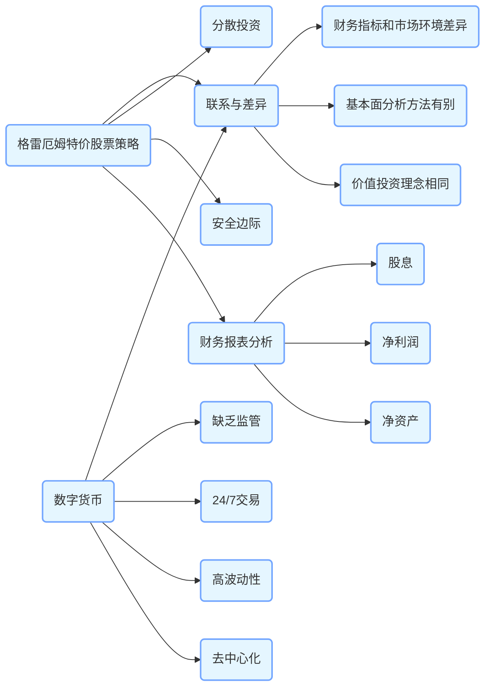

# 格雷厄姆特价股票策略在不同数字货币竞争环境下的调整

> 关键词：格雷厄姆特价股票策略、数字货币、竞争环境、策略调整、价值投资

> 摘要：本文聚焦于格雷厄姆特价股票策略在不同数字货币竞争环境下的应用与调整。首先介绍了格雷厄姆特价股票策略的背景以及数字货币市场的特点，明确文章的目的和范围。接着阐述了核心概念及它们之间的联系，包括格雷厄姆策略原理、数字货币的特性等。详细讲解了核心算法原理与具体操作步骤，并通过数学模型和公式进行理论支持与举例说明。结合项目实战，给出代码实际案例并深入解读。分析了该策略在不同数字货币竞争环境下的实际应用场景，推荐了相关的学习资源、开发工具框架以及论文著作。最后总结了未来发展趋势与挑战，解答常见问题并提供扩展阅读和参考资料，旨在为投资者和研究者在数字货币市场运用格雷厄姆策略提供全面的指导。

## 1. 背景介绍 
### 1.1 目的和范围
格雷厄姆特价股票策略是由投资大师本杰明·格雷厄姆提出的经典价值投资策略，该策略旨在寻找被市场低估的股票，通过分析公司的基本面，如资产负债表、盈利能力等指标，挑选出价格低于内在价值的股票进行投资。然而，随着数字货币市场的兴起，其与传统股票市场在交易机制、市场环境、资产特性等方面存在显著差异。本文的目的在于探讨如何将格雷厄姆特价股票策略应用于数字货币市场，并根据不同的数字货币竞争环境进行调整，以适应这一新兴市场的特点。

本文的范围涵盖了对格雷厄姆特价股票策略的基本原理分析，数字货币市场的竞争环境分类与特点研究，以及如何针对不同竞争环境对策略进行调整和优化。同时，通过实际案例和代码演示，展示策略在数字货币市场的具体应用和操作方法。

### 1.2 预期读者
本文预期读者包括对数字货币投资感兴趣的投资者、金融分析师、量化交易开发者以及相关领域的研究人员。对于投资者来说，希望通过本文了解如何运用经典投资策略在数字货币市场中寻找投资机会；金融分析师可以从中获取关于数字货币市场分析和投资策略调整的思路；量化交易开发者可以借鉴代码实现，将策略转化为实际的交易程序；研究人员则可以深入探讨策略在数字货币市场的理论和实践问题。

### 1.3 文档结构概述
本文将按照以下结构进行阐述：首先介绍背景知识，包括目的、预期读者和文档结构；接着讲解核心概念与联系，包括格雷厄姆策略和数字货币的相关概念及其关系；然后详细阐述核心算法原理和具体操作步骤，并结合数学模型和公式进行说明；通过项目实战展示代码实现和详细解读；分析该策略在不同数字货币竞争环境下的实际应用场景；推荐相关的学习资源、开发工具框架和论文著作；最后总结未来发展趋势与挑战，解答常见问题并提供扩展阅读和参考资料。

### 1.4 术语表
#### 1.4.1 核心术语定义
- **格雷厄姆特价股票策略**：一种基于价值投资理念的股票投资策略，通过分析公司的财务指标，寻找价格低于内在价值的股票进行投资。
- **数字货币**：一种基于密码学技术的虚拟货币，采用去中心化的分布式账本技术（如区块链）进行交易记录和管理。
- **内在价值**：资产在合理的假设和分析下所具有的真实价值，通常通过对资产的未来现金流、盈利能力等因素进行评估得出。
- **竞争环境**：指数字货币市场中不同数字货币之间的竞争态势，包括市场份额、技术创新、应用场景等方面的竞争情况。

#### 1.4.2 相关概念解释
- **价值投资**：一种投资理念，认为投资者应该关注资产的内在价值，而不是市场价格的短期波动。通过寻找被低估的资产进行投资，等待市场价格回归内在价值以获取收益。
- **区块链**：一种去中心化的分布式账本技术，通过密码学算法保证数据的安全性和不可篡改，广泛应用于数字货币的交易记录和管理。
- **市场情绪**：指投资者对市场的整体看法和预期，会影响市场价格的波动。在数字货币市场中，市场情绪往往更加敏感和波动剧烈。

#### 1.4.3 缩略词列表
- **BTC**：比特币（Bitcoin），最早的数字货币，也是市场上市值最大的数字货币。
- **ETH**：以太坊（Ethereum），一种基于区块链技术的开源平台，支持智能合约和去中心化应用的开发。
- **ICO**：首次代币发行（Initial Coin Offering），一种数字货币融资方式，类似于传统金融市场的首次公开募股（IPO）。

## 2. 核心概念与联系 

### 2.1 格雷厄姆特价股票策略原理
格雷厄姆特价股票策略的核心思想是寻找价格低于内在价值的股票，其主要基于以下几个方面的分析：
- **财务报表分析**：通过分析公司的资产负债表、利润表和现金流量表，评估公司的财务状况和盈利能力。例如，关注公司的净资产、净利润、股息等指标。
- **安全边际**：为了降低投资风险，格雷厄姆强调要寻找具有足够安全边际的股票，即股票价格与内在价值之间的差距足够大。
- **分散投资**：通过投资多只被低估的股票，分散投资风险，避免因个别股票的表现不佳而导致整体投资损失。

### 2.2 数字货币的特性
数字货币具有以下特点，与传统股票市场存在显著差异：
- **去中心化**：数字货币采用去中心化的分布式账本技术，不依赖于中央机构进行管理和发行，交易记录公开透明。
- **高波动性**：数字货币市场价格波动剧烈，受到市场情绪、政策法规、技术创新等多种因素的影响。
- **24/7交易**：数字货币市场全天候交易，没有传统股票市场的交易时间限制。
- **缺乏监管**：与传统金融市场相比，数字货币市场的监管相对薄弱，存在一定的市场操纵和欺诈风险。

### 2.3 两者的联系与差异
#### 联系
- **价值投资理念**：格雷厄姆特价股票策略的价值投资理念同样适用于数字货币市场，即寻找被低估的数字货币进行投资。
- **基本面分析**：虽然数字货币的基本面分析与传统股票有所不同，但也可以从技术创新、应用场景、社区活跃度等方面进行评估。

#### 差异
- **财务指标不同**：传统股票可以通过财务报表分析公司的盈利能力和财务状况，而数字货币没有传统意义上的财务报表，需要采用不同的指标进行评估。
- **市场环境不同**：数字货币市场的高波动性、缺乏监管等特点，使得投资风险和机会与传统股票市场存在较大差异。

### 2.4 文本示意图
```plaintext
格雷厄姆特价股票策略
|
|-- 财务报表分析
|   |-- 净资产
|   |-- 净利润
|   |-- 股息
|
|-- 安全边际
|
|-- 分散投资

数字货币
|
|-- 去中心化
|
|-- 高波动性
|
|-- 24/7交易
|
|-- 缺乏监管

联系与差异
|
|-- 价值投资理念相同
|
|-- 基本面分析方法有别
|
|-- 财务指标和市场环境差异
```

### 2.5 Mermaid流程图


## 3. 核心算法原理 & 具体操作步骤 

### 3.1 核心算法原理
在将格雷厄姆特价股票策略应用于数字货币市场时，核心算法原理仍然是寻找被低估的数字货币。由于数字货币没有传统意义上的财务报表，我们可以采用以下指标来评估其内在价值：
- **市场份额**：数字货币在市场中的占有率，反映了其在行业中的地位和竞争力。
- **技术创新**：数字货币所采用的技术是否具有创新性和先进性，如区块链技术的性能、智能合约的功能等。
- **应用场景**：数字货币的实际应用场景和市场需求，应用场景越广泛，其价值可能越高。
- **社区活跃度**：数字货币社区的活跃程度，反映了投资者和开发者对其的关注度和支持度。

### 3.2 具体操作步骤
#### 步骤1：数据收集
收集数字货币的相关数据，包括市场价格、市值、交易量、技术文档、社区论坛等信息。可以通过数字货币交易所的API接口、第三方数据平台等渠道获取数据。

#### 步骤2：指标计算
根据收集到的数据，计算上述评估指标。例如，市场份额可以通过数字货币的市值与整个数字货币市场总市值的比例来计算；技术创新可以通过分析技术文档和行业报告来评估；应用场景可以通过调研市场需求和实际应用案例来确定；社区活跃度可以通过社区论坛的发帖量、点赞数等指标来衡量。

#### 步骤3：内在价值评估
根据计算得到的指标，采用加权平均的方法评估数字货币的内在价值。例如，可以为每个指标分配一个权重，然后将指标值乘以相应的权重，最后求和得到内在价值。

#### 步骤4：安全边际计算
计算数字货币的市场价格与内在价值之间的差距，即安全边际。安全边际越大，说明数字货币被低估的程度越高，投资风险越低。

#### 步骤5：筛选投资标的
根据安全边际的大小，筛选出具有足够安全边际的数字货币作为投资标的。同时，为了分散投资风险，可以选择多只数字货币进行投资。

### 3.3 Python源代码实现
```python
import requests
import pandas as pd

# 步骤1：数据收集
def collect_data():
    # 通过CoinGecko API获取数字货币数据
    url = 'https://api.coingecko.com/api/v3/coins/markets?vs_currency=usd&order=market_cap_desc&per_page=100&page=1&sparkline=false'
    response = requests.get(url)
    data = response.json()
    df = pd.DataFrame(data)
    return df

# 步骤2：指标计算
def calculate_metrics(df):
    # 计算市场份额
    total_market_cap = df['market_cap'].sum()
    df['market_share'] = df['market_cap'] / total_market_cap
    
    # 这里简化技术创新、应用场景和社区活跃度指标，实际应用中需要更复杂的分析
    df['tech_innovation'] = 0.5  # 假设初始值为0.5
    df['application_scenario'] = 0.5
    df['community_activity'] = 0.5
    
    return df

# 步骤3：内在价值评估
def evaluate_intrinsic_value(df):
    # 为每个指标分配权重
    weights = {
        'market_share': 0.3,
        'tech_innovation': 0.2,
        'application_scenario': 0.3,
        'community_activity': 0.2
    }
    
    # 计算内在价值
    df['intrinsic_value'] = (
        df['market_share'] * weights['market_share'] +
        df['tech_innovation'] * weights['tech_innovation'] +
        df['application_scenario'] * weights['application_scenario'] +
        df['community_activity'] * weights['community_activity']
    )
    
    return df

# 步骤4：安全边际计算
def calculate_safety_margin(df):
    df['safety_margin'] = df['intrinsic_value'] - df['current_price']
    return df

# 步骤5：筛选投资标的
def select_investment_targets(df, threshold=0.1):
    selected_df = df[df['safety_margin'] > threshold]
    return selected_df

# 主函数
def main():
    df = collect_data()
    df = calculate_metrics(df)
    df = evaluate_intrinsic_value(df)
    df = calculate_safety_margin(df)
    selected_df = select_investment_targets(df)
    print(selected_df[['id', 'current_price', 'intrinsic_value', 'safety_margin']])

if __name__ == "__main__":
    main()
```

### 3.4 代码解释
- `collect_data` 函数：通过CoinGecko API获取数字货币的市场数据，包括市场价格、市值等信息，并将其存储在Pandas DataFrame中。
- `calculate_metrics` 函数：计算数字货币的市场份额，并为技术创新、应用场景和社区活跃度指标设置初始值。实际应用中，这些指标需要更复杂的分析和计算。
- `evaluate_intrinsic_value` 函数：为每个评估指标分配权重，然后采用加权平均的方法计算数字货币的内在价值。
- `calculate_safety_margin` 函数：计算数字货币的市场价格与内在价值之间的差距，即安全边际。
- `select_investment_targets` 函数：根据安全边际的大小，筛选出具有足够安全边际的数字货币作为投资标的。
- `main` 函数：调用上述函数，完成数据收集、指标计算、内在价值评估、安全边际计算和投资标的筛选等操作，并打印出筛选结果。

## 4. 数学模型和公式 & 详细讲解 & 举例说明 

### 4.1 内在价值评估模型
数字货币的内在价值 $V$ 可以通过加权平均的方法进行评估，公式如下：

$$V = w_1 \times S + w_2 \times T + w_3 \times A + w_4 \times C$$

其中：
- $V$ 表示数字货币的内在价值；
- $w_1, w_2, w_3, w_4$ 分别表示市场份额、技术创新、应用场景和社区活跃度指标的权重，且 $w_1 + w_2 + w_3 + w_4 = 1$；
- $S$ 表示数字货币的市场份额；
- $T$ 表示数字货币的技术创新指标值；
- $A$ 表示数字货币的应用场景指标值；
- $C$ 表示数字货币的社区活跃度指标值。

### 4.2 安全边际计算模型
安全边际 $M$ 可以通过以下公式计算：

$$M = V - P$$

其中：
- $M$ 表示安全边际；
- $V$ 表示数字货币的内在价值；
- $P$ 表示数字货币的市场价格。

### 4.3 详细讲解
#### 内在价值评估
内在价值评估是整个策略的核心，通过综合考虑多个指标，可以更全面地评估数字货币的价值。权重的分配可以根据投资者的风险偏好和对不同指标的重视程度进行调整。例如，如果投资者更注重技术创新，可以适当提高技术创新指标的权重。

#### 安全边际计算
安全边际是衡量投资风险的重要指标，安全边际越大，说明数字货币被低估的程度越高，投资风险越低。投资者可以根据自己的风险承受能力设置安全边际的阈值，筛选出符合要求的投资标的。

### 4.4 举例说明
假设我们要评估数字货币 $X$ 的内在价值和安全边际，相关数据如下：
- 市场份额 $S = 0.1$
- 技术创新指标值 $T = 0.6$
- 应用场景指标值 $A = 0.7$
- 社区活跃度指标值 $C = 0.5$
- 权重分配：$w_1 = 0.3, w_2 = 0.2, w_3 = 0.3, w_4 = 0.2$
- 市场价格 $P = 10$

首先，计算内在价值 $V$：

$$
\begin{align*}
V &= w_1 \times S + w_2 \times T + w_3 \times A + w_4 \times C\\
&= 0.3 \times 0.1 + 0.2 \times 0.6 + 0.3 \times 0.7 + 0.2 \times 0.5\\
&= 0.03 + 0.12 + 0.21 + 0.1\\
&= 0.46
\end{align*}
$$

然后，计算安全边际 $M$：

$$M = V - P = 0.46 - 10 = -9.54$$

由于安全边际为负数，说明数字货币 $X$ 的市场价格高于其内在价值，不具备投资价值。如果安全边际为正数，且大于投资者设定的阈值，则可以考虑将其作为投资标的。

## 5. 项目实战：代码实际案例和详细解释说明 

### 5.1  开发环境搭建
#### 安装Python
首先，确保你已经安装了Python环境。建议使用Python 3.7及以上版本，可以从Python官方网站（https://www.python.org/downloads/）下载并安装。

#### 安装必要的库
在项目中，我们使用了 `requests` 和 `pandas` 库，你可以使用以下命令进行安装：
```sh
pip install requests pandas
```

### 5.2  源代码详细实现和代码解读
以下是完整的源代码及详细解读：
```python
import requests
import pandas as pd

# 步骤1：数据收集
def collect_data():
    # 通过CoinGecko API获取数字货币数据
    url = 'https://api.coingecko.com/api/v3/coins/markets?vs_currency=usd&order=market_cap_desc&per_page=100&page=1&sparkline=false'
    response = requests.get(url)
    data = response.json()
    df = pd.DataFrame(data)
    return df

# 步骤2：指标计算
def calculate_metrics(df):
    # 计算市场份额
    total_market_cap = df['market_cap'].sum()
    df['market_share'] = df['market_cap'] / total_market_cap
    
    # 这里简化技术创新、应用场景和社区活跃度指标，实际应用中需要更复杂的分析
    df['tech_innovation'] = 0.5  # 假设初始值为0.5
    df['application_scenario'] = 0.5
    df['community_activity'] = 0.5
    
    return df

# 步骤3：内在价值评估
def evaluate_intrinsic_value(df):
    # 为每个指标分配权重
    weights = {
        'market_share': 0.3,
        'tech_innovation': 0.2,
        'application_scenario': 0.3,
        'community_activity': 0.2
    }
    
    # 计算内在价值
    df['intrinsic_value'] = (
        df['market_share'] * weights['market_share'] +
        df['tech_innovation'] * weights['tech_innovation'] +
        df['application_scenario'] * weights['application_scenario'] +
        df['community_activity'] * weights['community_activity']
    )
    
    return df

# 步骤4：安全边际计算
def calculate_safety_margin(df):
    df['safety_margin'] = df['intrinsic_value'] - df['current_price']
    return df

# 步骤5：筛选投资标的
def select_investment_targets(df, threshold=0.1):
    selected_df = df[df['safety_margin'] > threshold]
    return selected_df

# 主函数
def main():
    df = collect_data()
    df = calculate_metrics(df)
    df = evaluate_intrinsic_value(df)
    df = calculate_safety_margin(df)
    selected_df = select_investment_targets(df)
    print(selected_df[['id', 'current_price', 'intrinsic_value', 'safety_margin']])

if __name__ == "__main__":
    main()
```

#### 代码解读
- **数据收集**：`collect_data` 函数通过CoinGecko API获取数字货币的市场数据，将其存储在Pandas DataFrame中。
- **指标计算**：`calculate_metrics` 函数计算数字货币的市场份额，并为技术创新、应用场景和社区活跃度指标设置初始值。实际应用中，这些指标需要更复杂的分析和计算。
- **内在价值评估**：`evaluate_intrinsic_value` 函数为每个评估指标分配权重，然后采用加权平均的方法计算数字货币的内在价值。
- **安全边际计算**：`calculate_safety_margin` 函数计算数字货币的市场价格与内在价值之间的差距，即安全边际。
- **筛选投资标的**：`select_investment_targets` 函数根据安全边际的大小，筛选出具有足够安全边际的数字货币作为投资标的。
- **主函数**：`main` 函数调用上述函数，完成数据收集、指标计算、内在价值评估、安全边际计算和投资标的筛选等操作，并打印出筛选结果。

### 5.3  代码解读与分析
#### 优点
- **模块化设计**：代码采用模块化设计，将不同的功能封装成独立的函数，提高了代码的可读性和可维护性。
- **数据处理方便**：使用Pandas库进行数据处理，方便对数字货币数据进行计算和分析。
- **可扩展性**：代码具有一定的可扩展性，可以根据需要添加更多的评估指标和调整权重分配。

#### 缺点
- **指标简化**：技术创新、应用场景和社区活跃度指标的计算进行了简化，实际应用中需要更复杂的分析和数据收集。
- **缺乏实时性**：代码只是一次性获取数据进行分析，没有考虑数据的实时更新，不能及时反映市场的变化。

#### 改进建议
- **完善指标计算**：采用更复杂的方法计算技术创新、应用场景和社区活跃度指标，如通过分析技术文档、市场调研报告和社区数据等。
- **实现实时数据更新**：使用定时任务或事件驱动的方式，实时获取数字货币数据，及时调整投资策略。

## 6. 实际应用场景 
### 6.1 新兴数字货币市场
在新兴数字货币市场中，竞争激烈，新的数字货币不断涌现。格雷厄姆特价股票策略可以帮助投资者筛选出具有潜力但被市场低估的数字货币。通过分析市场份额、技术创新、应用场景和社区活跃度等指标，投资者可以发现那些在技术上有创新、应用场景广泛但目前价格较低的数字货币进行投资。

### 6.2 成熟数字货币市场
在成熟数字货币市场中，市场格局相对稳定，比特币、以太坊等主流数字货币占据较大的市场份额。此时，格雷厄姆策略可以用于评估主流数字货币的投资价值，寻找价格与内在价值之间的差距。同时，也可以关注一些具有特色和潜力的二线数字货币，通过分析其基本面，判断是否存在投资机会。

### 6.3 市场波动期
在数字货币市场波动期，市场情绪容易受到影响，价格波动剧烈。格雷厄姆策略的安全边际原则可以帮助投资者降低投资风险。当市场价格大幅下跌时，通过计算安全边际，投资者可以筛选出那些被过度低估的数字货币，在市场反弹时获取收益。

### 6.4 长期投资
对于长期投资者来说，格雷厄姆特价股票策略可以作为一种价值投资的方法。通过深入分析数字货币的基本面，选择具有长期增长潜力的数字货币进行投资，并长期持有，等待市场价格回归内在价值，实现资产的增值。

## 7. 工具和资源推荐
### 7.1 学习资源推荐
#### 7.1.1 书籍推荐
- 《聪明的投资者》（The Intelligent Investor）：本杰明·格雷厄姆的经典著作，系统阐述了价值投资的理念和方法，对理解格雷厄姆特价股票策略具有重要的指导意义。
- 《区块链：技术驱动金融》（Blockchain: The Technical Foundations of Digital Currencies and Smart Contracts）：介绍了区块链技术的基本原理和应用，对于理解数字货币的技术基础和发展趋势有很大帮助。
- 《数字货币投资实战》：详细介绍了数字货币市场的投资策略和技巧，结合实际案例进行分析，适合数字货币投资者阅读。

#### 7.1.2 在线课程
- Coursera上的“区块链基础”课程：由知名高校和机构的教授授课，系统讲解区块链技术的基本概念、原理和应用。
- Udemy上的“数字货币投资与交易”课程：介绍了数字货币市场的投资策略、交易技巧和风险管理方法，适合初学者和有一定经验的投资者。

#### 7.1.3 技术博客和网站
- CoinDesk：提供数字货币市场的最新新闻、分析和研究报告，是了解数字货币行业动态的重要渠道。
- CoinMarketCap：提供数字货币的市场数据，包括价格、市值、交易量等信息，方便投资者进行数据分析和比较。
- Medium上的区块链和数字货币相关博客：有很多行业专家和开发者分享的技术文章和投资经验，值得关注。

### 7.2 开发工具框架推荐
#### 7.2.1 IDE和编辑器
- PyCharm：一款专业的Python集成开发环境，提供代码编辑、调试、版本控制等功能，适合Python开发者使用。
- Visual Studio Code：一款轻量级的代码编辑器，支持多种编程语言和插件扩展，可用于数字货币项目的开发。

#### 7.2.2 调试和性能分析工具
- PDB：Python自带的调试工具，可以帮助开发者定位和解决代码中的问题。
- cProfile：Python的性能分析工具，可以分析代码的运行时间和资源消耗情况，帮助开发者优化代码性能。

#### 7.2.3 相关框架和库
- Requests：一个简单易用的Python HTTP库，用于发送HTTP请求，方便获取数字货币市场数据。
- Pandas：一个强大的Python数据处理库，用于数据的清洗、分析和可视化，适合处理数字货币数据。
- NumPy：一个Python科学计算库，提供了高效的数组操作和数学函数，可用于数字货币数据分析和模型计算。

### 7.3 相关论文著作推荐
#### 7.3.1 经典论文
- Nakamoto, S. (2008). Bitcoin: A Peer-to-Peer Electronic Cash System. 比特币的白皮书，介绍了比特币的基本原理和设计思路，是数字货币领域的经典文献。
- Szabo, N. (1994). Smart Contracts: Building Blocks for Digital Markets. 提出了智能合约的概念，对区块链技术的发展产生了重要影响。

#### 7.3.2 最新研究成果
- 关注顶级学术会议和期刊上关于数字货币和区块链技术的研究论文，如IEEE International Conference on Blockchain and Cryptocurrency、ACM Transactions on Internet Technology等。

#### 7.3.3 应用案例分析
- 一些金融机构和研究机构发布的数字货币投资报告和应用案例分析，如CoinShares的数字货币研究报告、Cambridge Centre for Alternative Finance的区块链和数字货币研究报告等。

## 8. 总结：未来发展趋势与挑战
### 8.1 未来发展趋势
#### 策略的智能化
随着人工智能和机器学习技术的发展，格雷厄姆特价股票策略在数字货币市场的应用将更加智能化。通过机器学习算法，可以对大量的数字货币数据进行分析和挖掘，自动调整评估指标和权重分配，提高策略的准确性和有效性。

#### 与其他策略的融合
格雷厄姆策略可能会与其他投资策略，如技术分析策略、量化交易策略等进行融合，形成更加多元化和综合性的投资策略。通过结合不同策略的优势，可以更好地适应数字货币市场的复杂变化。

#### 跨市场应用
随着数字货币市场与传统金融市场的联系日益紧密，格雷厄姆策略可能会在跨市场投资中得到更广泛的应用。投资者可以通过分析数字货币与传统资产之间的相关性，进行资产配置和风险管理。

### 8.2 挑战
#### 数据质量和可靠性
数字货币市场的数据质量和可靠性存在一定问题，如数据不完整、不准确、存在操纵等。这给策略的实施带来了困难，需要投资者采用更严格的数据清洗和验证方法。

#### 监管不确定性
数字货币市场的监管环境尚不完善，政策法规的变化可能会对市场产生重大影响。投资者需要密切关注监管动态，及时调整投资策略，以应对监管风险。

#### 技术创新风险
数字货币市场技术创新迅速，新的技术和概念不断涌现。如果投资者不能及时跟上技术发展的步伐，可能会错过一些投资机会，同时也面临着投资失败的风险。

## 9. 附录：常见问题与解答
### 9.1 格雷厄姆特价股票策略在数字货币市场的有效性如何？
格雷厄姆特价股票策略的价值投资理念在数字货币市场仍然具有一定的有效性。通过分析数字货币的基本面，寻找被低估的投资标的，可以降低投资风险，提高投资收益。然而，由于数字货币市场的特殊性，如高波动性、缺乏监管等，策略的实施需要进行适当的调整和优化。

### 9.2 如何确定评估指标的权重？
评估指标的权重可以根据投资者的风险偏好和对不同指标的重视程度进行调整。一般来说，市场份额和应用场景可以给予较高的权重，因为它们反映了数字货币的市场地位和实际价值。技术创新和社区活跃度的权重可以根据市场情况和投资者的判断进行适当调整。

### 9.3 如何处理数字货币市场的高波动性？
数字货币市场的高波动性是其特点之一，投资者可以通过设置合理的安全边际、分散投资等方法来降低波动性带来的风险。同时，密切关注市场动态，及时调整投资策略，也是应对高波动性的重要措施。

### 9.4 该策略是否适用于所有数字货币？
该策略并不适用于所有数字货币。一些市值较小、流动性较差的数字货币，其价格可能受到操纵，数据质量也难以保证，不适合采用该策略进行投资。投资者应该选择市值较大、流动性较好、有一定市场影响力的数字货币进行分析和投资。

## 10. 扩展阅读 & 参考资料
### 10.1 扩展阅读
- 《金融炼金术》（The Alchemy of Finance）：乔治·索罗斯的著作，介绍了他的投资哲学和方法，对理解金融市场的波动和投资策略有一定的启发。
- 《黑天鹅》（The Black Swan）：纳西姆·尼古拉斯·塔勒布的著作，探讨了不可预测的重大事件对金融市场的影响，提醒投资者要关注极端事件的风险。

### 10.2 参考资料
- CoinGecko API文档：https://www.coingecko.com/en/api/documentation
- Pandas官方文档：https://pandas.pydata.org/docs/
- Requests官方文档：https://docs.python-requests.org/en/latest/

作者：AI天才研究院/AI Genius Institute & 禅与计算机程序设计艺术 /Zen And The Art of Computer Programming