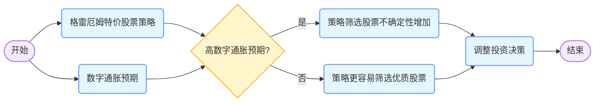

# 格雷厄姆特价股票策略在不同数字通胀预期环境中的效果

> 关键词：格雷厄姆特价股票策略、数字通胀预期、投资效果、股票市场、量化分析

> 摘要：本文旨在深入探讨格雷厄姆特价股票策略在不同数字通胀预期环境中的表现。通过详细介绍格雷厄姆特价股票策略的核心概念、算法原理，建立数学模型进行量化分析，并结合实际案例进行验证。同时，分析该策略在不同数字通胀预期场景下的实际应用，推荐相关学习资源、开发工具和研究论文，最后总结其未来发展趋势与挑战，为投资者在复杂的市场环境中运用该策略提供全面的参考。

## 1. 背景介绍 
### 1.1 目的和范围
在当今复杂多变的金融市场中，投资者面临着各种不确定性，数字通胀预期作为影响市场的重要因素之一，对股票投资策略的效果有着显著影响。格雷厄姆特价股票策略作为经典的价值投资策略，其在不同数字通胀预期环境中的表现值得深入研究。本文的目的在于全面分析该策略在不同数字通胀预期场景下的有效性，为投资者提供更精准的投资决策依据。研究范围涵盖了对格雷厄姆特价股票策略的原理剖析、数学建模、实际案例验证以及在不同通胀预期环境下的应用分析。

### 1.2 预期读者
本文主要面向对股票投资策略、金融市场分析以及量化投资感兴趣的投资者、金融分析师、研究人员和相关专业的学生。无论是初学者希望了解经典投资策略，还是有经验的投资者寻求在复杂市场环境中优化投资组合，都能从本文中获取有价值的信息。

### 1.3 文档结构概述
本文将按照以下结构展开：首先介绍格雷厄姆特价股票策略和数字通胀预期的核心概念及其联系；接着详细阐述该策略的核心算法原理和具体操作步骤，并使用 Python 代码进行说明；然后建立数学模型和公式，通过具体例子进行详细讲解；之后通过实际项目案例展示该策略的代码实现和详细解读；再分析该策略在不同数字通胀预期环境中的实际应用场景；推荐相关的学习资源、开发工具和研究论文；最后总结该策略的未来发展趋势与挑战，并提供常见问题解答和扩展阅读参考资料。

### 1.4 术语表
#### 1.4.1 核心术语定义
- **格雷厄姆特价股票策略**：由本杰明·格雷厄姆提出的一种价值投资策略，主要通过筛选具有低市盈率、低市净率等特征的股票，以寻找被市场低估的投资机会。
- **数字通胀预期**：指市场参与者对未来数字经济领域通货膨胀水平的预期，反映了市场对数字资产价格、数字产品和服务成本等方面变化的预期。
- **市盈率（P/E）**：股票价格与每股收益的比率，用于衡量股票的估值水平。
- **市净率（P/B）**：股票价格与每股净资产的比率，反映了股票的市场价值与账面价值之间的关系。

#### 1.4.2 相关概念解释
- **价值投资**：一种投资理念，强调通过分析公司的基本面，寻找被市场低估的股票，并长期持有以获取价值回归带来的收益。
- **通货膨胀**：一般物价水平持续上涨的经济现象，会对资产价格和投资收益产生影响。
- **数字经济**：以数字化的知识和信息作为关键生产要素，以现代信息网络作为重要载体，以信息通信技术的有效使用作为效率提升和经济结构优化的重要推动力的一系列经济活动。

#### 1.4.3 缩略词列表
- **P/E**：Price-to-Earnings Ratio（市盈率）
- **P/B**：Price-to-Book Ratio（市净率）

## 2. 核心概念与联系 
### 2.1 格雷厄姆特价股票策略原理
格雷厄姆特价股票策略的核心思想是寻找被市场低估的股票。格雷厄姆认为，股票的内在价值是由公司的基本面决定的，而市场价格往往会受到短期情绪和市场波动的影响，从而导致股票价格偏离其内在价值。该策略通过一系列的财务指标筛选，如低市盈率、低市净率、高股息率等，来识别那些价格相对较低、具有较高安全边际的股票。

### 2.2 数字通胀预期的概念
数字通胀预期是市场参与者对未来数字经济领域通货膨胀情况的预期。在数字经济时代，数字资产（如数字货币、数字版权等）、数字产品和服务的价格变化对整体经济的影响日益显著。数字通胀预期受到多种因素的影响，包括技术创新速度、政策法规、市场需求等。当市场预期数字通胀上升时，投资者可能会调整其投资组合，增加对具有抗通胀特性的资产的配置。

### 2.3 两者的联系
数字通胀预期会对股票市场产生广泛的影响，进而影响格雷厄姆特价股票策略的效果。在高数字通胀预期环境下，企业的成本可能上升，盈利能力受到影响，导致股票市场整体估值下降。此时，按照格雷厄姆特价股票策略筛选出的股票可能面临更多的不确定性，因为一些看似被低估的股票可能实际上是由于行业前景不佳或公司经营困境导致的。相反，在低数字通胀预期环境下，市场相对稳定，企业的盈利能力和估值相对较为可靠，格雷厄姆特价股票策略可能更容易筛选出真正被低估的优质股票。

### 2.4 核心概念架构的文本示意图
```plaintext
格雷厄姆特价股票策略
|-- 筛选标准
|   |-- 低市盈率
|   |-- 低市净率
|   |-- 高股息率
|-- 投资逻辑
|   |-- 寻找被低估股票
|   |-- 长期持有获取价值回归收益

数字通胀预期
|-- 影响因素
|   |-- 技术创新
|   |-- 政策法规
|   |-- 市场需求
|-- 对市场的影响
|   |-- 股票市场估值
|   |-- 投资者投资组合调整

两者联系
|-- 高数字通胀预期
|   |-- 策略筛选股票不确定性增加
|-- 低数字通胀预期
|   |-- 策略更容易筛选优质股票
```

### 2.5 Mermaid 流程图


## 3. 核心算法原理 & 具体操作步骤 
### 3.1 核心算法原理
格雷厄姆特价股票策略的核心算法是基于一系列财务指标的筛选。主要步骤包括：
1. **数据收集**：收集股票的相关财务数据，如市盈率、市净率、股息率等。
2. **筛选条件设定**：根据格雷厄姆的投资理念，设定筛选条件，如市盈率低于某个阈值、市净率低于某个阈值、股息率高于某个阈值等。
3. **股票筛选**：根据设定的筛选条件，对收集到的股票数据进行筛选，找出符合条件的股票。
4. **投资组合构建**：将筛选出的股票按照一定的权重构建投资组合。

### 3.2 具体操作步骤
#### 步骤 1：数据收集
可以使用金融数据接口（如 Tushare、Yahoo Finance 等）获取股票的财务数据。以下是使用 Tushare 接口获取股票市盈率和市净率数据的 Python 代码示例：
```python
import tushare as ts

# 设置 Tushare token
ts.set_token('your_token')
pro = ts.pro_api()

# 获取股票基本信息
stock_basic = pro.stock_basic(exchange='', list_status='L', fields='ts_code,symbol,name,industry')

# 获取股票财务指标数据
df = pro.daily_basic(ts_code='', trade_date='', fields='ts_code,trade_date,pe_ttm,pb')

# 合并数据
merged_df = stock_basic.merge(df, on='ts_code')
```

#### 步骤 2：筛选条件设定
假设我们设定市盈率低于 15，市净率低于 1.5 的筛选条件。以下是实现筛选的 Python 代码：
```python
# 筛选条件
filtered_df = merged_df[(merged_df['pe_ttm'] < 15) & (merged_df['pb'] < 1.5)]
```

#### 步骤 3：股票筛选
经过筛选后，`filtered_df` 中包含了符合条件的股票信息。可以进一步对筛选结果进行分析和处理。

#### 步骤 4：投资组合构建
可以根据等权重或其他权重分配方法构建投资组合。以下是等权重分配的示例代码：
```python
# 计算股票数量
num_stocks = len(filtered_df)

# 等权重分配
weights = [1 / num_stocks] * num_stocks

# 构建投资组合
portfolio = dict(zip(filtered_df['ts_code'], weights))
```

## 4. 数学模型和公式 & 详细讲解 & 举例说明 
### 4.1 市盈率模型
市盈率（P/E）是衡量股票估值的重要指标，其计算公式为：
$$P/E = \frac{P}{E}$$
其中，$P$ 为股票价格，$E$ 为每股收益。

市盈率反映了投资者为获取每股收益所愿意支付的价格。较低的市盈率可能意味着股票被低估，但也可能反映了市场对公司未来盈利能力的担忧。

例如，某股票价格为 20 元，每股收益为 2 元，则该股票的市盈率为：
$$P/E = \frac{20}{2} = 10$$

### 4.2 市净率模型
市净率（P/B）是衡量股票市场价值与账面价值关系的指标，其计算公式为：
$$P/B = \frac{P}{B}$$
其中，$P$ 为股票价格，$B$ 为每股净资产。

市净率较低的股票可能具有较高的安全边际，因为即使公司经营不善，其资产价值也能为投资者提供一定的保障。

例如，某股票价格为 15 元，每股净资产为 10 元，则该股票的市净率为：
$$P/B = \frac{15}{10} = 1.5$$

### 4.3 投资组合收益模型
假设投资组合中包含 $n$ 只股票，第 $i$ 只股票的权重为 $w_i$，收益率为 $r_i$，则投资组合的收益率 $R_p$ 计算公式为：
$$R_p = \sum_{i=1}^{n} w_i r_i$$

例如，投资组合包含三只股票，权重分别为 $w_1 = 0.3$，$w_2 = 0.4$，$w_3 = 0.3$，收益率分别为 $r_1 = 0.1$，$r_2 = 0.15$，$r_3 = 0.08$，则投资组合的收益率为：
$$R_p = 0.3 \times 0.1 + 0.4 \times 0.15 + 0.3 \times 0.08 = 0.114$$

### 4.4 考虑数字通胀预期的调整模型
在不同数字通胀预期环境下，可以对投资组合的预期收益率进行调整。假设数字通胀预期率为 $\pi$，则调整后的投资组合预期收益率 $R_p'$ 计算公式为：
$$R_p' = R_p - \pi$$

例如，在上述投资组合中，若数字通胀预期率为 0.05，则调整后的投资组合预期收益率为：
$$R_p' = 0.114 - 0.05 = 0.064$$

## 5. 项目实战：代码实际案例和详细解释说明 
### 5.1  开发环境搭建
#### 步骤 1：安装 Python
可以从 Python 官方网站（https://www.python.org/downloads/）下载并安装 Python 3.x 版本。

#### 步骤 2：安装必要的库
使用以下命令安装所需的 Python 库：
```bash
pip install tushare pandas numpy matplotlib
```

### 5.2  源代码详细实现和代码解读
```python
import tushare as ts
import pandas as pd
import numpy as np
import matplotlib.pyplot as plt

# 设置 Tushare token
ts.set_token('your_token')
pro = ts.pro_api()

# 获取股票基本信息
stock_basic = pro.stock_basic(exchange='', list_status='L', fields='ts_code,symbol,name,industry')

# 获取股票财务指标数据
df = pro.daily_basic(ts_code='', trade_date='', fields='ts_code,trade_date,pe_ttm,pb')

# 合并数据
merged_df = stock_basic.merge(df, on='ts_code')

# 筛选条件
filtered_df = merged_df[(merged_df['pe_ttm'] < 15) & (merged_df['pb'] < 1.5)]

# 计算股票数量
num_stocks = len(filtered_df)

# 等权重分配
weights = [1 / num_stocks] * num_stocks

# 构建投资组合
portfolio = dict(zip(filtered_df['ts_code'], weights))

# 模拟投资组合收益
def simulate_portfolio_returns(portfolio, start_date, end_date):
    returns = []
    for ts_code, weight in portfolio.items():
        df = pro.daily(ts_code=ts_code, start_date=start_date, end_date=end_date)
        df = df.sort_values('trade_date')
        df['return'] = df['close'].pct_change()
        df = df.dropna()
        weighted_return = df['return'] * weight
        returns.append(weighted_return)
    portfolio_returns = pd.concat(returns, axis=1).sum(axis=1)
    return portfolio_returns

# 模拟投资组合收益
start_date = '20200101'
end_date = '20210101'
portfolio_returns = simulate_portfolio_returns(portfolio, start_date, end_date)

# 绘制投资组合收益曲线
plt.figure(figsize=(12, 6))
plt.plot(portfolio_returns.cumsum())
plt.title('Portfolio Cumulative Returns')
plt.xlabel('Date')
plt.ylabel('Cumulative Returns')
plt.show()
```

### 5.3  代码解读与分析
1. **数据获取**：使用 Tushare 接口获取股票基本信息和财务指标数据，并进行合并。
2. **股票筛选**：根据设定的市盈率和市净率筛选条件，筛选出符合条件的股票。
3. **投资组合构建**：采用等权重分配方法构建投资组合。
4. **模拟投资组合收益**：定义 `simulate_portfolio_returns` 函数，模拟投资组合在指定日期范围内的收益情况。
5. **绘制收益曲线**：使用 `matplotlib` 库绘制投资组合的累计收益曲线，直观展示投资组合的表现。

## 6. 实际应用场景 
### 6.1 高数字通胀预期环境
在高数字通胀预期环境下，企业面临成本上升、盈利能力下降的压力，股票市场整体估值可能下降。此时，格雷厄姆特价股票策略筛选出的股票可能存在更多风险。投资者需要更加谨慎地分析公司的基本面，关注公司的抗通胀能力，如是否具有定价权、成本控制能力等。可以适当增加对防御性行业（如公用事业、消费必需品等）股票的配置，以降低投资组合的风险。

### 6.2 低数字通胀预期环境
在低数字通胀预期环境下，市场相对稳定，企业的盈利能力和估值相对较为可靠。格雷厄姆特价股票策略更容易筛选出真正被低估的优质股票。投资者可以按照策略筛选出的股票构建投资组合，并长期持有，以获取价值回归带来的收益。同时，可以适当关注成长型行业（如科技、医疗等）的股票，以获取更高的投资回报。

### 6.3 数字通胀预期波动环境
在数字通胀预期波动较大的环境下，投资者需要根据通胀预期的变化及时调整投资组合。当通胀预期上升时，减少对高估值、高负债股票的配置，增加对抗通胀资产的配置；当通胀预期下降时，增加对被低估股票的配置。可以使用量化分析工具，如风险价值（VaR）模型，来评估投资组合在不同通胀预期环境下的风险。

## 7. 工具和资源推荐
### 7.1 学习资源推荐
#### 7.1.1 书籍推荐
- 《聪明的投资者》（The Intelligent Investor）：本杰明·格雷厄姆的经典著作，详细阐述了价值投资的理念和方法。
- 《证券分析》（Security Analysis）：同样是格雷厄姆的著作，对股票和债券的分析方法进行了深入探讨。
- 《漫步华尔街》（A Random Walk Down Wall Street）：介绍了股票市场的基本原理和投资策略，对投资者具有很好的指导作用。

#### 7.1.2 在线课程
- Coursera 上的“投资学原理”（Principles of Investing）课程，由知名教授授课，涵盖了投资组合理论、资产定价等内容。
- edX 上的“金融市场”（Financial Markets）课程，深入讲解了金融市场的运作机制和投资策略。

#### 7.1.3 技术博客和网站
- 雪球（https://xueqiu.com/）：国内知名的投资社区，提供股票行情、投资分析、财经新闻等信息。
- Seeking Alpha（https://seekingalpha.com/）：国外知名的金融分析网站，提供专业的股票分析和投资建议。

### 7.2 开发工具框架推荐
#### 7.2.1 IDE和编辑器
- PyCharm：功能强大的 Python 集成开发环境，提供代码编辑、调试、版本控制等功能。
- Jupyter Notebook：交互式的开发环境，适合进行数据分析和可视化。

#### 7.2.2 调试和性能分析工具
- pdb：Python 自带的调试工具，用于调试 Python 代码。
- cProfile：Python 标准库中的性能分析工具，用于分析代码的运行时间和性能瓶颈。

#### 7.2.3 相关框架和库
- Tushare：提供丰富的金融数据接口，方便获取股票、基金等金融数据。
- Pandas：用于数据处理和分析的 Python 库，提供高效的数据结构和数据操作方法。
- Numpy：用于科学计算的 Python 库，提供多维数组和矩阵运算功能。

### 7.3 相关论文著作推荐
#### 7.3.1 经典论文
- Graham, B., & Dodd, D. L. (1934). Security Analysis. This classic paper laid the foundation for value investing.
- Fama, E. F., & French, K. R. (1992). The cross-section of expected stock returns. Journal of Finance, 47(2), 427-465. This paper introduced the Fama-French three-factor model, which has had a significant impact on asset pricing research.

#### 7.3.2 最新研究成果
- Recent research on the impact of digital inflation expectations on stock market returns and the effectiveness of value investment strategies. These studies can be found in academic journals such as the Journal of Financial Economics and the Review of Financial Studies.

#### 7.3.3 应用案例分析
- Case studies of investors using Graham's special value stock strategy in different inflation environments. These case studies can provide practical insights into the implementation and performance of the strategy.

## 8. 总结：未来发展趋势与挑战
### 8.1 未来发展趋势
- **数字化和智能化**：随着金融科技的发展，格雷厄姆特价股票策略的应用将更加数字化和智能化。投资者可以利用大数据、人工智能等技术，更准确地筛选股票、评估风险和优化投资组合。
- **跨市场和跨境投资**：全球金融市场的一体化程度不断提高，投资者将有更多机会在不同市场和国家进行投资。格雷厄姆特价股票策略可以应用于更广泛的市场，以获取更高的投资回报。
- **与其他策略的融合**：未来，格雷厄姆特价股票策略可能会与其他投资策略（如成长投资策略、量化投资策略等）进行融合，以发挥各自的优势，提高投资组合的绩效。

### 8.2 挑战
- **数据质量和可靠性**：格雷厄姆特价股票策略依赖于大量的财务数据和市场信息，数据的质量和可靠性直接影响策略的效果。在数字经济时代，数据的更新速度加快，数据来源更加复杂，如何获取准确、及时的数据是一个挑战。
- **数字通胀预期的不确定性**：数字通胀预期受到多种因素的影响，如技术创新、政策法规、市场情绪等，其预测难度较大。投资者需要不断跟踪和分析数字通胀预期的变化，及时调整投资策略。
- **市场有效性和竞争加剧**：随着投资者对价值投资理念的广泛接受，市场的有效性不断提高，寻找被低估股票的难度也在增加。同时，市场竞争加剧，投资者需要不断提高自身的分析能力和投资技巧，才能在市场中获得超额收益。

## 9. 附录：常见问题与解答
### 问题 1：格雷厄姆特价股票策略适用于所有市场吗？
答：格雷厄姆特价股票策略的基本原理适用于大多数市场，但在不同市场环境中的效果可能会有所不同。在成熟市场中，市场有效性较高，寻找被低估股票的难度较大；而在新兴市场中，市场波动较大，可能存在更多的投资机会，但同时也伴随着更高的风险。投资者需要根据不同市场的特点，对策略进行适当的调整。

### 问题 2：如何确定数字通胀预期？
答：数字通胀预期的确定是一个复杂的问题，没有一种绝对准确的方法。投资者可以参考宏观经济数据、政策导向、市场研究报告等信息，结合自己的判断来估计数字通胀预期。一些专业的金融机构和研究机构也会发布数字通胀预期的预测数据，投资者可以作为参考。

### 问题 3：格雷厄姆特价股票策略的投资期限一般是多久？
答：格雷厄姆特价股票策略是一种价值投资策略，强调长期投资。一般来说，投资者应该持有股票至少 3 - 5 年，以等待股票价值的回归。当然，具体的投资期限还需要根据市场情况、公司基本面等因素进行调整。

### 问题 4：如何评估格雷厄姆特价股票策略在不同数字通胀预期环境中的效果？
答：可以通过以下几个指标来评估策略的效果：投资组合的收益率、风险调整后的收益率（如夏普比率）、与市场基准的比较等。同时，还可以分析策略在不同通胀预期环境下的稳定性和适应性，观察投资组合的表现是否符合预期。

## 10. 扩展阅读 & 参考资料
- Graham, B. (1949). The Intelligent Investor. HarperBusiness.
- Fama, E. F., & French, K. R. (1993). Common risk factors in the returns on stocks and bonds. Journal of Financial Economics, 33(1), 3-56.
- Shiller, R. J. (2000). Irrational Exuberance. Princeton University Press.
- Tushare 官方文档：https://tushare.pro/document/1
- Yahoo Finance 官方网站：https://finance.yahoo.com/

作者：AI天才研究院/AI Genius Institute & 禅与计算机程序设计艺术 /Zen And The Art of Computer Programming