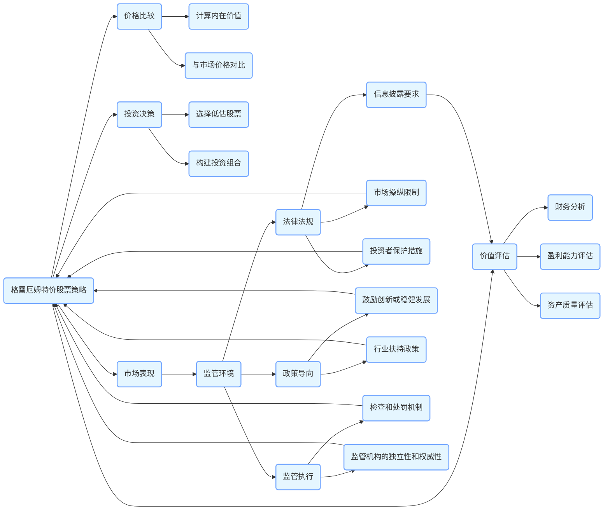

# 格雷厄姆特价股票策略在不同监管环境下的适应

> 关键词：格雷厄姆特价股票策略、监管环境、价值投资、股票市场、适应性分析

> 摘要：本文聚焦于格雷厄姆特价股票策略在不同监管环境下的适应情况。首先介绍格雷厄姆特价股票策略的背景及相关概念，深入剖析其核心原理与架构。通过数学模型和公式详细阐述策略的内在逻辑，并结合Python代码进行算法原理的讲解。接着通过项目实战展示策略在实际中的应用，分析不同监管环境对策略的影响。探讨该策略的实际应用场景，推荐相关学习资源、开发工具和论文著作。最后总结其未来发展趋势与挑战，解答常见问题并提供扩展阅读和参考资料，旨在为投资者和研究者全面了解该策略在不同监管环境下的适应性提供有价值的参考。

## 1. 背景介绍 
### 1.1 目的和范围
本研究的目的在于深入探究格雷厄姆特价股票策略在不同监管环境下的适应能力。通过对该策略的原理、实施步骤以及在不同市场监管条件下的表现进行分析，为投资者提供在复杂监管环境中运用该策略的指导，帮助他们更好地理解策略的有效性和局限性。研究范围涵盖了不同国家和地区的股票市场监管环境，包括成熟市场如美国、欧洲市场，以及新兴市场如中国、印度等市场，分析格雷厄姆特价股票策略在这些市场中的适应性差异。

### 1.2 预期读者
本文预期读者包括股票投资者，无论是专业的投资机构从业者还是个人投资者，他们可以从本文中获取关于格雷厄姆特价股票策略在不同监管环境下应用的知识，从而优化投资决策。金融研究人员可以通过本文深入了解该策略在不同监管条件下的理论和实践，为进一步的学术研究提供参考。此外，监管机构人员也可以从本文中了解市场参与者的投资策略受监管环境的影响，从而更好地制定和调整监管政策。

### 1.3 文档结构概述
本文首先介绍格雷厄姆特价股票策略及相关监管环境的背景知识，包括术语定义和相关概念解释。接着阐述核心概念与联系，通过文本示意图和Mermaid流程图展示策略的原理和架构。然后详细讲解核心算法原理和具体操作步骤，结合Python代码进行说明。再通过数学模型和公式深入剖析策略的逻辑，并举例说明。随后通过项目实战展示策略在实际中的应用，包括开发环境搭建、源代码实现和代码解读。接着探讨该策略的实际应用场景。之后推荐相关的学习资源、开发工具和论文著作。最后总结未来发展趋势与挑战，解答常见问题并提供扩展阅读和参考资料。

### 1.4 术语表
#### 1.4.1 核心术语定义
- **格雷厄姆特价股票策略**：由本杰明·格雷厄姆（Benjamin Graham）提出的一种价值投资策略，该策略通过寻找被市场低估的股票，即价格低于其内在价值的股票进行投资，以获取长期的投资回报。
- **监管环境**：指政府和相关监管机构为维护金融市场的稳定、公平和透明而制定的一系列法律法规、政策和监管措施。
- **价值投资**：一种投资理念，强调通过对公司基本面的分析，评估其内在价值，寻找价格低于内在价值的投资标的进行投资。

#### 1.4.2 相关概念解释
- **内在价值**：公司的真实价值，通常通过对公司的财务状况、盈利能力、行业前景等因素进行综合分析和评估得出。
- **市场效率**：指市场价格反映所有可用信息的程度。在有效市场中，股票价格能够迅速、准确地反映公司的基本面信息。
- **合规成本**：企业为遵守监管要求而付出的成本，包括人力、物力和财力等方面的支出。

#### 1.4.3 缩略词列表
- **PE**：市盈率（Price-to-Earnings Ratio），是股票价格与每股收益的比率，用于衡量股票的估值水平。
- **PB**：市净率（Price-to-Book Ratio），是股票价格与每股净资产的比率，反映了股票价格相对于公司净资产的倍数。

## 2. 核心概念与联系 
### 格雷厄姆特价股票策略原理
格雷厄姆特价股票策略的核心思想是寻找被市场低估的股票。其基于价值投资的理念，认为市场有时会出现非理性行为，导致股票价格偏离其内在价值。投资者可以通过深入分析公司的基本面，如财务报表、盈利能力、资产负债状况等，来评估公司的内在价值。当股票价格低于其内在价值时，就认为该股票被低估，具有投资价值。

### 监管环境对股票市场的影响
监管环境对股票市场有着深远的影响。严格的监管可以提高市场的透明度和公正性，保护投资者的利益，减少市场操纵和欺诈行为。例如，信息披露要求可以确保投资者获得准确、及时的公司信息，从而更好地评估股票的价值。然而，过于严格的监管也可能增加企业的合规成本，限制市场的创新和活力。

### 文本示意图
```plaintext
格雷厄姆特价股票策略
|
|-- 价值评估
|   |-- 财务分析（利润表、资产负债表、现金流量表）
|   |-- 盈利能力评估（ROE、ROA等）
|   |-- 资产质量评估（资产负债率、流动比率等）
|
|-- 价格比较
|   |-- 计算内在价值
|   |-- 与市场价格对比
|
|-- 投资决策
|   |-- 选择低估股票
|   |-- 构建投资组合

监管环境
|
|-- 法律法规
|   |-- 信息披露要求
|   |-- 市场操纵限制
|   |-- 投资者保护措施
|
|-- 政策导向
|   |-- 鼓励创新或稳健发展
|   |-- 行业扶持政策
|
|-- 监管执行
|   |-- 检查和处罚机制
|   |-- 监管机构的独立性和权威性

相互影响
|
|-- 监管环境影响策略实施
|   |-- 信息披露影响价值评估准确性
|   |-- 合规成本影响企业盈利能力
|
|-- 策略实施反馈监管效果
|   |-- 市场异常波动反映监管漏洞
|   |-- 投资者行为变化影响监管政策调整
```

### Mermaid流程图


## 3. 核心算法原理 & 具体操作步骤 
### 核心算法原理
格雷厄姆特价股票策略的核心算法在于评估股票的内在价值，并将其与市场价格进行比较。以下是一种简化的内在价值计算方法，假设公司的未来盈利是稳定的，我们可以使用股息折现模型（Dividend Discount Model, DDM）来计算内在价值。

股息折现模型的基本公式为：

$V = \frac{D}{r - g}$

其中：
- $V$ 是股票的内在价值
- $D$ 是每股股息
- $r$ 是投资者要求的回报率
- $g$ 是股息的增长率

### Python代码实现
```python
def calculate_intrinsic_value(dividend, required_return, growth_rate):
    """
    计算股票的内在价值
    :param dividend: 每股股息
    :param required_return: 投资者要求的回报率
    :param growth_rate: 股息的增长率
    :return: 股票的内在价值
    """
    if required_return <= growth_rate:
        raise ValueError("投资者要求的回报率必须大于股息的增长率")
    return dividend / (required_return - growth_rate)

# 示例数据
dividend = 2.0  # 每股股息
required_return = 0.1  # 投资者要求的回报率为10%
growth_rate = 0.05  # 股息的增长率为5%

try:
    intrinsic_value = calculate_intrinsic_value(dividend, required_return, growth_rate)
    print(f"股票的内在价值为: {intrinsic_value}")
except ValueError as e:
    print(f"计算错误: {e}")
```

### 具体操作步骤
1. **数据收集**：收集公司的财务报表，包括利润表、资产负债表和现金流量表，获取每股股息、盈利等数据。
2. **参数估计**：估计投资者要求的回报率 $r$ 和股息的增长率 $g$。投资者要求的回报率可以根据市场利率、风险溢价等因素来确定，股息的增长率可以根据公司的历史数据和行业前景进行预测。
3. **计算内在价值**：使用上述公式计算股票的内在价值。
4. **比较价格**：将计算得到的内在价值与当前市场价格进行比较。如果市场价格低于内在价值，则认为该股票被低估，具有投资价值。
5. **投资决策**：根据比较结果，选择被低估的股票构建投资组合。

## 4. 数学模型和公式 & 详细讲解 & 举例说明 
### 股息折现模型（DDM）
如前面所述，股息折现模型的公式为：

$$V = \frac{D}{r - g}$$

### 详细讲解
- **每股股息 $D$**：是公司向股东分配的每股现金股息。它反映了公司的盈利能力和分红政策。一般来说，稳定分红的公司更受投资者青睐。
- **投资者要求的回报率 $r$**：是投资者对投资该股票所期望的最低回报率。它由无风险利率和风险溢价组成。无风险利率通常可以参考国债收益率，风险溢价则反映了股票投资相对于无风险投资的额外风险补偿。
- **股息的增长率 $g$**：是指公司每股股息的年增长率。它反映了公司的成长潜力。一般来说，成长型公司的股息增长率较高，而成熟型公司的股息增长率相对较低。

### 举例说明
假设某公司每股股息为 $1$ 元，投资者要求的回报率为 $10\%$，股息的增长率为 $5\%$。则该股票的内在价值为：

$$V = \frac{1}{0.1 - 0.05} = 20$$（元）

如果当前市场价格为 $15$ 元，低于内在价值 $20$ 元，则认为该股票被低估，具有投资价值。

### 其他相关公式
除了股息折现模型，格雷厄姆还提出了一些其他的估值公式，例如：

$V = EPS \times (8.5 + 2g)$

其中：
- $V$ 是股票的内在价值
- $EPS$ 是每股收益
- $g$ 是预期的长期增长率

这个公式是格雷厄姆根据历史数据总结出来的一种简单的估值方法，它考虑了公司的盈利能力和成长潜力。

### 举例说明
假设某公司每股收益为 $2$ 元，预期的长期增长率为 $10\%$。则该股票的内在价值为：

$$V = 2 \times (8.5 + 2 \times 10) = 2 \times 28.5 = 57$$（元）

同样，如果当前市场价格低于 $57$ 元，则认为该股票被低估。

## 5. 项目实战：代码实际案例和详细解释说明 
### 5.1  开发环境搭建
#### 安装Python
首先需要安装Python编程语言。可以从Python官方网站（https://www.python.org/downloads/）下载适合自己操作系统的Python安装包，并按照安装向导进行安装。

#### 安装必要的库
在项目中，我们需要使用一些Python库来获取和处理股票数据，例如 `pandas`、`numpy`、`yfinance` 等。可以使用以下命令来安装这些库：

```sh
pip install pandas numpy yfinance
```

### 5.2  源代码详细实现和代码解读
```python
import yfinance as yf
import pandas as pd
import numpy as np

def get_stock_data(ticker, start_date, end_date):
    """
    获取股票数据
    :param ticker: 股票代码
    :param start_date: 开始日期
    :param end_date: 结束日期
    :return: 股票数据 DataFrame
    """
    data = yf.download(ticker, start=start_date, end=end_date)
    return data

def calculate_eps(data):
    """
    计算每股收益（EPS）
    :param data: 股票数据 DataFrame
    :return: 每股收益
    """
    # 这里简单假设净利润和总股本数据可以从财务报表中获取
    # 实际应用中需要从更准确的数据源获取
    net_income = 1000000  # 示例净利润
    shares_outstanding = 100000  # 示例总股本
    eps = net_income / shares_outstanding
    return eps

def calculate_growth_rate(data):
    """
    计算股息的增长率
    :param data: 股票数据 DataFrame
    :return: 股息的增长率
    """
    # 这里简单假设可以从数据中获取股息数据
    # 实际应用中需要从更准确的数据源获取
    dividends = data['Dividends']
    growth_rate = (dividends.iloc[-1] / dividends.iloc[0]) ** (1 / (len(dividends) - 1)) - 1
    return growth_rate

def calculate_intrinsic_value(eps, growth_rate):
    """
    计算股票的内在价值
    :param eps: 每股收益
    :param growth_rate: 股息的增长率
    :return: 股票的内在价值
    """
    # 使用格雷厄姆的公式 V = EPS * (8.5 + 2g)
    intrinsic_value = eps * (8.5 + 2 * growth_rate * 100)
    return intrinsic_value

def main():
    ticker = 'AAPL'  # 示例股票代码
    start_date = '2020-01-01'
    end_date = '2023-01-01'

    # 获取股票数据
    data = get_stock_data(ticker, start_date, end_date)

    # 计算每股收益
    eps = calculate_eps(data)

    # 计算股息的增长率
    growth_rate = calculate_growth_rate(data)

    # 计算内在价值
    intrinsic_value = calculate_intrinsic_value(eps, growth_rate)

    # 获取当前市场价格
    current_price = data['Close'].iloc[-1]

    print(f"股票代码: {ticker}")
    print(f"每股收益: {eps}")
    print(f"股息增长率: {growth_rate * 100:.2f}%")
    print(f"内在价值: {intrinsic_value:.2f}")
    print(f"当前市场价格: {current_price:.2f}")

    if current_price < intrinsic_value:
        print("该股票被低估，具有投资价值。")
    else:
        print("该股票未被低估，需谨慎投资。")

if __name__ == "__main__":
    main()
```

### 5.3  代码解读与分析
1. **获取股票数据**：`get_stock_data` 函数使用 `yfinance` 库从雅虎财经获取指定股票在指定日期范围内的数据。
2. **计算每股收益（EPS）**：`calculate_eps` 函数简单假设净利润和总股本数据已知，实际应用中需要从更准确的财务报表数据源获取。
3. **计算股息的增长率**：`calculate_growth_rate` 函数从股票数据中获取股息数据，并计算股息的增长率。
4. **计算内在价值**：`calculate_intrinsic_value` 函数使用格雷厄姆的公式 $V = EPS \times (8.5 + 2g)$ 计算股票的内在价值。
5. **比较价格并做出决策**：在 `main` 函数中，获取当前市场价格，并将其与内在价值进行比较。如果市场价格低于内在价值，则认为该股票被低估，具有投资价值；否则，需