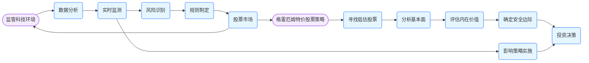

# 格雷厄姆特价股票策略在不同监管科技环境中的表现

> 关键词：格雷厄姆特价股票策略、监管科技环境、股票投资、策略表现、市场分析

> 摘要：本文聚焦于格雷厄姆特价股票策略在不同监管科技环境中的表现。通过深入剖析格雷厄姆特价股票策略的核心概念、算法原理，结合数学模型进行详细解读，并给出项目实战案例。同时，探讨该策略在不同监管科技环境下的实际应用场景，推荐相关学习资源、开发工具框架及论文著作。最后总结其未来发展趋势与挑战，为投资者和相关研究人员提供全面且深入的参考。

## 1. 背景介绍 
### 1.1 目的和范围
本研究旨在全面探究格雷厄姆特价股票策略在不同监管科技环境下的表现。通过对该策略的深入分析和实证研究，揭示监管科技环境对策略有效性和收益性的影响，为投资者在不同市场条件下运用该策略提供科学依据和决策参考。研究范围涵盖不同国家和地区的股票市场，以及不同发展阶段的监管科技环境。

### 1.2 预期读者
本文预期读者包括专业投资者、金融分析师、监管机构工作人员、学术研究人员以及对股票投资和监管科技感兴趣的爱好者。对于专业投资者和金融分析师，本文可帮助他们优化投资策略，提高投资收益；对于监管机构工作人员，有助于了解监管科技对市场投资策略的影响，完善监管政策；对于学术研究人员，可作为相关领域研究的参考资料；对于投资爱好者，能提供系统的知识和实用的投资方法。

### 1.3 文档结构概述
本文将按照以下结构展开：首先介绍格雷厄姆特价股票策略和监管科技环境的核心概念及其联系；接着阐述核心算法原理和具体操作步骤，并通过 Python 代码详细说明；然后给出相关数学模型和公式，并举例说明；之后通过项目实战案例展示代码实现和解读；再探讨该策略在不同监管科技环境下的实际应用场景；推荐相关的学习资源、开发工具框架和论文著作；最后总结未来发展趋势与挑战，并提供常见问题解答和扩展阅读参考资料。

### 1.4 术语表
#### 1.4.1 核心术语定义
- **格雷厄姆特价股票策略**：由本杰明·格雷厄姆提出的一种股票投资策略，主要通过寻找被市场低估的股票进行投资，以获取长期稳定的收益。该策略强调股票的内在价值和安全边际。
- **监管科技**：运用科技手段来提高金融监管的效率和效果，包括数据分析、人工智能、区块链等技术在监管领域的应用。
- **股票内在价值**：股票所代表的企业的真实价值，通过对企业的财务状况、盈利能力、行业前景等因素进行分析评估得出。
- **安全边际**：股票的市场价格低于其内在价值的幅度，安全边际越大，投资风险越低。

#### 1.4.2 相关概念解释
- **价值投资**：一种投资理念，强调寻找被低估的资产进行投资，关注资产的内在价值而非短期市场波动。格雷厄姆特价股票策略是价值投资的典型代表。
- **金融监管**：政府或监管机构对金融市场和金融机构进行的监督和管理，以维护金融市场的稳定和公平。监管科技是金融监管的创新手段。

#### 1.4.3 缩略词列表
- **AI**：Artificial Intelligence，人工智能
- **ML**：Machine Learning，机器学习
- **DL**：Deep Learning，深度学习
- **API**：Application Programming Interface，应用程序编程接口

## 2. 核心概念与联系 

### 格雷厄姆特价股票策略原理
格雷厄姆特价股票策略的核心思想是寻找被市场低估的股票，即股票的市场价格低于其内在价值。投资者通过分析公司的财务报表、资产负债表、盈利能力等基本面因素，评估股票的内在价值，并选择具有足够安全边际的股票进行投资。具体来说，格雷厄姆提出了一些选股标准，如低市盈率、低市净率、高股息率等。

### 监管科技环境概述
监管科技是金融科技的一个重要分支，旨在利用先进的科技手段提高金融监管的效率和效果。监管科技包括数据分析、人工智能、区块链等技术在监管领域的应用，如实时监测市场交易、识别风险、预防金融犯罪等。不同的监管科技环境对股票市场的交易规则、信息披露、市场透明度等方面产生影响，从而影响格雷厄姆特价股票策略的实施和效果。

### 核心概念联系示意图


### 联系说明
监管科技环境通过实时监测和风险识别等手段，影响股票市场的交易规则和信息披露，从而对格雷厄姆特价股票策略的实施产生影响。例如，更严格的信息披露要求可能使投资者更容易获取准确的公司基本面信息，提高策略的有效性；而实时监测和风险识别功能可以及时发现市场异常，调整投资决策。

## 3. 核心算法原理 & 具体操作步骤 

### 核心算法原理
格雷厄姆特价股票策略的核心算法是通过计算股票的内在价值和安全边际，筛选出具有投资价值的股票。以下是一个简化的算法流程：
1. **数据收集**：收集公司的财务报表、市场数据等信息。
2. **计算内在价值**：根据公司的盈利能力、资产负债状况等因素，使用适当的估值模型计算股票的内在价值。常见的估值模型包括股息折现模型、市盈率法、市净率法等。
3. **计算安全边际**：安全边际 = （内在价值 - 市场价格）/ 内在价值。
4. **筛选股票**：选择安全边际大于一定阈值的股票作为投资标的。

### Python 代码实现
```python
import pandas as pd

# 模拟财务数据和市场价格数据
data = {
    'stock_code': ['000001', '000002', '000003'],
    'earnings_per_share': [2.0, 1.5, 1.0],
    'book_value_per_share': [10.0, 8.0, 6.0],
    'market_price': [15.0, 12.0, 8.0]
}
df = pd.DataFrame(data)

# 计算内在价值（使用市盈率法，假设合理市盈率为 10）
df['intrinsic_value'] = df['earnings_per_share'] * 10

# 计算安全边际
df['safety_margin'] = (df['intrinsic_value'] - df['market_price']) / df['intrinsic_value']

# 筛选安全边际大于 0.2 的股票
selected_stocks = df[df['safety_margin'] > 0.2]

print(selected_stocks)
```

### 代码解释
1. **数据收集**：使用 `pandas` 库创建一个包含股票代码、每股收益、每股账面价值和市场价格的 DataFrame。
2. **计算内在价值**：假设合理市盈率为 10，通过每股收益乘以市盈率计算内在价值。
3. **计算安全边际**：根据公式计算安全边际。
4. **筛选股票**：选择安全边际大于 0.2 的股票作为投资标的。

## 4. 数学模型和公式 & 详细讲解 & 举例说明 

### 股息折现模型
股息折现模型（Dividend Discount Model，DDM）是一种常用的股票估值模型，其基本思想是股票的内在价值等于未来股息的现值之和。公式如下：
$$V = \sum_{t=1}^{\infty} \frac{D_t}{(1 + r)^t}$$
其中，$V$ 表示股票的内在价值，$D_t$ 表示第 $t$ 期的股息，$r$ 表示折现率。

### 举例说明
假设某股票每年的股息固定为 2 元，折现率为 10%，则该股票的内在价值为：
$$V = \frac{2}{0.1} = 20$$（元）

### 市盈率法
市盈率法是通过比较股票的市盈率（Price-to-Earnings Ratio，P/E）与行业平均市盈率或合理市盈率来评估股票的价值。公式如下：
$$V = EPS \times P/E$$
其中，$V$ 表示股票的内在价值，$EPS$ 表示每股收益，$P/E$ 表示市盈率。

### 举例说明
假设某股票的每股收益为 2 元，行业平均市盈率为 15，则该股票的内在价值为：
$$V = 2 \times 15 = 30$$（元）

### 市净率法
市净率法是通过比较股票的市净率（Price-to-Book Ratio，P/B）与行业平均市净率或合理市净率来评估股票的价值。公式如下：
$$V = BVPS \times P/B$$
其中，$V$ 表示股票的内在价值，$BVPS$ 表示每股账面价值，$P/B$ 表示市净率。

### 举例说明
假设某股票的每股账面价值为 10 元，行业平均市净率为 2，则该股票的内在价值为：
$$V = 10 \times 2 = 20$$（元）

## 5. 项目实战：代码实际案例和详细解释说明 

### 5.1  开发环境搭建
- **操作系统**：Windows、Linux 或 macOS
- **编程语言**：Python 3.x
- **开发工具**：Jupyter Notebook 或 PyCharm
- **所需库**：`pandas`、`numpy`、`yfinance`（用于获取股票数据）

### 5.2  源代码详细实现和代码解读
```python
import yfinance as yf
import pandas as pd
import numpy as np

# 定义股票代码列表
stock_codes = ['AAPL', 'MSFT', 'GOOG']

# 获取股票数据
data = yf.download(stock_codes, start='2020-01-01', end='2023-01-01')

# 计算每股收益（假设使用历史平均每股收益）
eps = data['Close'].groupby(level=1).mean()

# 计算每股账面价值（假设使用固定值）
book_value = pd.Series([100, 200, 300], index=stock_codes)

# 计算市场价格
market_price = data['Close'].iloc[-1]

# 计算内在价值（使用市盈率法，假设合理市盈率为 20）
intrinsic_value = eps * 20

# 计算安全边际
safety_margin = (intrinsic_value - market_price) / intrinsic_value

# 筛选安全边际大于 0.2 的股票
selected_stocks = safety_margin[safety_margin > 0.2]

print(selected_stocks)
```

### 代码解读
1. **数据获取**：使用 `yfinance` 库从雅虎财经获取指定股票代码的历史数据。
2. **计算每股收益**：通过计算历史收盘价的平均值来近似每股收益。
3. **计算每股账面价值**：假设每股账面价值为固定值。
4. **计算市场价格**：取最后一天的收盘价作为市场价格。
5. **计算内在价值**：使用市盈率法计算内在价值。
6. **计算安全边际**：根据公式计算安全边际。
7. **筛选股票**：选择安全边际大于 0.2 的股票作为投资标的。

### 5.3  代码解读与分析
- **数据获取**：`yfinance` 库提供了方便的接口来获取股票的历史数据，使得数据收集变得简单快捷。
- **计算每股收益**：使用历史收盘价的平均值作为每股收益是一种简化的方法，实际应用中可以使用公司公布的财务报表数据。
- **计算内在价值**：市盈率法是一种常用的估值方法，但合理市盈率的选择需要根据行业特点和市场情况进行调整。
- **筛选股票**：安全边际的阈值可以根据投资者的风险偏好进行调整，阈值越高，投资风险越低，但可能错过一些投资机会。

## 6. 实际应用场景 
### 稳定监管科技环境
在稳定的监管科技环境下，市场规则明确，信息披露规范，投资者可以更容易获取准确的公司基本面信息。格雷厄姆特价股票策略可以更好地发挥作用，投资者可以通过深入分析公司的财务状况和估值水平，选择具有安全边际的股票进行投资。例如，在一些发达国家的成熟股票市场，监管科技较为完善，该策略可以帮助投资者获得长期稳定的收益。

### 新兴监管科技环境
在新兴的监管科技环境下，市场发展迅速，监管政策不断调整。虽然信息披露可能不够完善，但监管科技的应用可以及时发现市场异常和风险。投资者可以结合监管科技提供的信息，灵活调整格雷厄姆特价股票策略。例如，在一些新兴市场国家，监管机构利用大数据和人工智能技术加强对市场的监测，投资者可以根据监管提示，及时调整投资组合。

### 严格监管科技环境
在严格的监管科技环境下，市场违规行为受到严厉打击，市场透明度提高。格雷厄姆特价股票策略的有效性可能会增强，因为投资者可以更加信任公司公布的财务信息。同时，监管科技的实时监测功能可以帮助投资者及时发现潜在的投资机会和风险。例如，在一些金融监管严格的国家，监管机构通过区块链技术实现对交易数据的实时记录和追溯，提高了市场的透明度和安全性。

## 7. 工具和资源推荐
### 7.1 学习资源推荐
#### 7.1.1 书籍推荐
- 《聪明的投资者》（The Intelligent Investor）：本杰明·格雷厄姆的经典著作，详细介绍了价值投资的理念和方法。
- 《证券分析》（Security Analysis）：同样是格雷厄姆的著作，对股票和债券的分析方法进行了系统阐述。
- 《金融科技：架构与实践》：介绍了金融科技的基本概念、技术架构和应用实践，有助于了解监管科技的相关知识。

#### 7.1.2 在线课程
- Coursera 上的“Financial Markets”：由耶鲁大学教授罗伯特·席勒（Robert Shiller）讲授，涵盖了金融市场的基本理论和实践。
- edX 上的“Fintech and Digital Innovation in Banking”：介绍了金融科技在银行业的应用和创新。

#### 7.1.3 技术博客和网站
- Seeking Alpha：提供股票分析、投资策略和市场评论等内容。
- Bloomberg：全球知名的财经媒体，提供实时的金融市场数据和新闻。
- Medium 上的金融科技相关博客：有很多专业人士分享金融科技和投资领域的最新观点和研究成果。

### 7.2 开发工具框架推荐
#### 7.2.1 IDE和编辑器
- PyCharm：一款专业的 Python 集成开发环境，提供丰富的代码编辑、调试和项目管理功能。
- Jupyter Notebook：一种交互式的编程环境，适合进行数据分析和模型开发。

#### 7.2.2 调试和性能分析工具
- `pdb`：Python 自带的调试工具，用于调试 Python 代码。
- `cProfile`：Python 标准库中的性能分析工具，用于分析代码的执行时间和性能瓶颈。

#### 7.2.3 相关框架和库
- `pandas`：用于数据处理和分析的 Python 库，提供了高效的数据结构和数据分析工具。
- `numpy`：用于科学计算的 Python 库，提供了高性能的多维数组对象和数学函数。
- `yfinance`：用于获取股票数据的 Python 库，方便快捷地获取股票的历史数据和实时数据。

### 7.3 相关论文著作推荐
#### 7.3.1 经典论文
- “The Theory of Investment Value”：由约翰·伯尔·威廉姆斯（John Burr Williams）撰写，提出了股息折现模型。
- “The Security Market Line: A Re-Examination”：对资本资产定价模型（CAPM）进行了深入研究。

#### 7.3.2 最新研究成果
- 关注顶级金融学术期刊，如《Journal of Finance》、《Review of Financial Studies》等，获取关于股票投资策略和监管科技的最新研究成果。

#### 7.3.3 应用案例分析
- 参考金融机构和投资公司发布的研究报告和案例分析，了解格雷厄姆特价股票策略在实际应用中的效果和经验教训。

## 8. 总结：未来发展趋势与挑战
### 未来发展趋势
- **监管科技与投资策略的深度融合**：随着监管科技的不断发展，将与格雷厄姆特价股票策略等投资策略更加紧密地结合。监管科技可以为投资者提供更准确的市场信息和风险预警，帮助投资者优化投资决策。
- **智能化投资决策**：人工智能和机器学习技术将在投资决策中发挥越来越重要的作用。通过对大量数据的分析和学习，智能投资系统可以更准确地评估股票的内在价值和安全边际，提高投资策略的有效性。
- **全球化投资**：随着全球金融市场的一体化，投资者将有更多机会在不同国家和地区的股票市场进行投资。格雷厄姆特价股票策略可以在全球范围内寻找被低估的股票，实现资产的多元化配置。

### 挑战
- **数据质量和可靠性**：监管科技和投资决策都依赖于大量的数据，数据的质量和可靠性直接影响策略的有效性。如何获取准确、及时、完整的数据是一个挑战。
- **技术复杂性**：监管科技和智能化投资决策涉及到复杂的技术，如人工智能、机器学习、区块链等。投资者和监管机构需要具备相应的技术能力和专业知识，才能有效地应用这些技术。
- **监管政策的不确定性**：监管政策的变化可能会对股票市场和投资策略产生重大影响。投资者需要及时了解和适应监管政策的变化，调整投资策略。

## 9. 附录：常见问题与解答
### 问题 1：格雷厄姆特价股票策略适用于所有股票市场吗？
解答：格雷厄姆特价股票策略的基本原理适用于大多数股票市场，但不同市场的特点和监管环境可能会影响策略的有效性。在成熟的股票市场，信息披露较为规范，该策略可能更容易实施；而在新兴市场，市场波动较大，信息不对称问题可能更严重，需要结合市场特点进行调整。

### 问题 2：如何确定合理的市盈率和市净率？
解答：合理的市盈率和市净率需要根据行业特点、公司的盈利能力和成长前景等因素进行综合考虑。可以参考行业平均水平、历史数据以及同行业优秀公司的估值情况。同时，还需要结合宏观经济环境和市场趋势进行判断。

### 问题 3：监管科技对格雷厄姆特价股票策略有哪些具体影响？
解答：监管科技可以提高市场的透明度和信息披露质量，使投资者更容易获取准确的公司基本面信息，从而提高策略的有效性。同时，监管科技的实时监测和风险识别功能可以帮助投资者及时发现市场异常和风险，调整投资决策。

### 问题 4：如何获取股票的财务数据？
解答：可以通过金融数据提供商（如 Bloomberg、Wind 等）、证券交易所网站、公司官方网站等渠道获取股票的财务数据。此外，一些 Python 库（如 `yfinance`）也可以方便地获取股票的基本信息和历史数据。

## 10. 扩展阅读 & 参考资料
### 扩展阅读
- 《行为金融学》：了解投资者的心理和行为对股票市场的影响，有助于更好地应用格雷厄姆特价股票策略。
- 《量化投资：策略与技术》：介绍量化投资的基本概念和方法，为投资者提供更多的投资策略和工具。

### 参考资料
- 本杰明·格雷厄姆. 《聪明的投资者》. 人民邮电出版社.
- 约翰·伯尔·威廉姆斯. “The Theory of Investment Value”. Harvard University Press.
- 相关金融学术期刊和研究报告。

作者：AI天才研究院/AI Genius Institute & 禅与计算机程序设计艺术 /Zen And The Art of Computer Programming