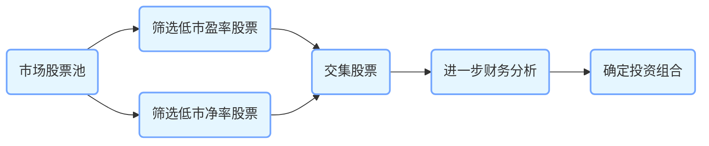

# 格雷厄姆特价股票策略在不同通胀体制环境中的效果

> 关键词：格雷厄姆特价股票策略、通胀体制环境、股票投资、策略效果、财务指标分析

> 摘要：本文旨在深入探讨格雷厄姆特价股票策略在不同通胀体制环境下的表现效果。通过对格雷厄姆特价股票策略的核心概念、算法原理、数学模型等方面的详细阐述，结合实际案例分析该策略在不同通胀阶段的应用情况。同时，介绍了相关的工具和资源，最后总结其未来发展趋势与挑战，并提供常见问题解答和扩展阅读资料，为投资者在不同通胀环境下运用该策略提供全面的参考。

## 1. 背景介绍 
### 1.1 目的和范围
本研究的主要目的是评估格雷厄姆特价股票策略在不同通胀体制环境中的有效性。随着宏观经济环境的变化，通胀水平会对股票市场产生显著影响，而格雷厄姆特价股票策略作为一种经典的价值投资策略，其在不同通胀阶段的表现值得深入研究。研究范围涵盖了不同程度的通胀环境，包括低通胀、温和通胀和高通胀时期，分析该策略在这些环境下的选股效果、收益表现以及风险特征。

### 1.2 预期读者
本文预期读者包括专业的股票投资者、金融分析师、投资顾问以及对价值投资策略和宏观经济与股票市场关系感兴趣的学术研究人员。对于希望在不同通胀环境下优化投资组合、提高投资收益的投资者，本文将提供有价值的参考；对于金融分析师和投资顾问，有助于他们为客户提供更准确的投资建议；对于学术研究人员，可作为进一步研究相关领域的基础资料。

### 1.3 文档结构概述
本文将按照以下结构展开：首先介绍核心概念与联系，阐述格雷厄姆特价股票策略的基本原理和相关架构；接着详细讲解核心算法原理和具体操作步骤，并给出Python源代码示例；然后介绍数学模型和公式，通过实际例子说明其应用；随后进行项目实战，包括开发环境搭建、源代码实现和代码解读；再探讨该策略在不同通胀体制环境中的实际应用场景；推荐相关的工具和资源；最后总结未来发展趋势与挑战，提供常见问题解答和扩展阅读资料。

### 1.4 术语表
#### 1.4.1 核心术语定义
- **格雷厄姆特价股票策略**：由本杰明·格雷厄姆提出的一种价值投资策略，主要通过筛选具有低市盈率、低市净率等特征的股票，以寻找被市场低估的投资机会。
- **通胀体制环境**：根据通胀水平的高低和稳定性划分的不同经济环境，通常包括低通胀（通胀率较低且相对稳定）、温和通胀（通胀率适度上升）和高通胀（通胀率较高且波动较大）等阶段。
- **市盈率（P/E）**：股票价格与每股收益的比率，反映了投资者为获取公司每股收益所愿意支付的价格。
- **市净率（P/B）**：股票价格与每股净资产的比率，衡量了股票价格相对于公司净资产的倍数。

#### 1.4.2 相关概念解释
- **价值投资**：一种投资理念，强调通过分析公司的基本面，寻找被市场低估的股票，以长期持有获取价值回归带来的收益。
- **通胀**：指在货币流通条件下，因货币供给大于货币实际需求，也即现实购买力大于产出供给,导致货币贬值，而引起的一段时间内物价持续而普遍地上涨现象。

#### 1.4.3 缩略词列表
- **P/E**：Price-to-Earnings Ratio，市盈率
- **P/B**：Price-to-Book Ratio，市净率

## 2. 核心概念与联系 
### 格雷厄姆特价股票策略原理
格雷厄姆特价股票策略的核心思想是寻找被市场低估的股票。格雷厄姆认为，市场有时会出现错误定价，导致一些股票的价格低于其内在价值。通过分析公司的财务报表和一些关键的财务指标，如市盈率和市净率，可以筛选出具有投资价值的股票。

具体来说，格雷厄姆倾向于选择市盈率较低的股票，因为低市盈率意味着投资者可以以较低的价格购买到公司的盈利。同时，市净率也是一个重要的指标，低市净率表示股票价格相对于公司的净资产较为便宜。

### 架构示意图


该流程图展示了格雷厄姆特价股票策略的基本架构。首先从市场股票池中筛选出低市盈率和低市净率的股票，然后取两者的交集，对这些交集股票进行进一步的财务分析，最终确定投资组合。

## 3. 核心算法原理 & 具体操作步骤 
### 核心算法原理
格雷厄姆特价股票策略的核心算法是通过计算股票的市盈率和市净率，并根据预设的阈值筛选出符合条件的股票。具体步骤如下：
1. 获取股票的价格、每股收益和每股净资产数据。
2. 计算每只股票的市盈率（P/E = 股票价格 / 每股收益）和市净率（P/B = 股票价格 / 每股净资产）。
3. 根据预设的市盈率和市净率阈值，筛选出低市盈率和低市净率的股票。
4. 取低市盈率股票和低市净率股票的交集，得到初步的候选股票池。
5. 对候选股票池中的股票进行进一步的财务分析，如分析公司的偿债能力、盈利能力等，最终确定投资组合。

### Python源代码实现
```python
import pandas as pd

# 假设已经获取到了股票数据，存储在一个DataFrame中
# 数据包含三列：'price'（股票价格）、'eps'（每股收益）、'book_value'（每股净资产）
stock_data = pd.DataFrame({
    'stock_code': ['000001', '000002', '000003',...],
    'price': [10.0, 20.0, 30.0,...],
    'eps': [1.0, 2.0, 3.0,...],
    'book_value': [5.0, 10.0, 15.0,...]
})

# 计算市盈率和市净率
stock_data['P/E'] = stock_data['price'] / stock_data['eps']
stock_data['P/B'] = stock_data['price'] / stock_data['book_value']

# 预设市盈率和市净率阈值
pe_threshold = 15
pb_threshold = 1.5

# 筛选低市盈率和低市净率的股票
low_pe_stocks = stock_data[stock_data['P/E'] < pe_threshold]
low_pb_stocks = stock_data[stock_data['P/B'] < pb_threshold]

# 取交集
candidate_stocks = pd.merge(low_pe_stocks, low_pb_stocks, how='inner')

# 进一步财务分析（这里只是简单示例，实际需要更复杂的分析）
# 例如，分析偿债能力，假设数据中有'debt_ratio'（资产负债率）列
debt_ratio_threshold = 0.5
final_stocks = candidate_stocks[candidate_stocks['debt_ratio'] < debt_ratio_threshold]

print(final_stocks)
```

### 代码解释
1. **数据准备**：首先创建一个包含股票代码、价格、每股收益和每股净资产的DataFrame。
2. **计算指标**：使用DataFrame的运算功能计算每只股票的市盈率和市净率。
3. **筛选股票**：根据预设的阈值筛选出低市盈率和低市净率的股票。
4. **取交集**：使用`pd.merge`函数取低市盈率股票和低市净率股票的交集。
5. **进一步分析**：这里以分析偿债能力为例，筛选出资产负债率低于阈值的股票，得到最终的投资候选股票。

## 4. 数学模型和公式 & 详细讲解 & 举例说明 
### 市盈率（P/E）
市盈率的计算公式为：
$$P/E = \frac{股票价格}{每股收益}$$
市盈率反映了投资者为获取公司每股收益所愿意支付的价格。例如，某股票价格为20元，每股收益为2元，则该股票的市盈率为：
$$P/E = \frac{20}{2} = 10$$
一般来说，市盈率较低的股票可能被市场低估，具有较高的投资价值。但市盈率也受到行业、公司成长前景等因素的影响，不同行业的合理市盈率水平可能不同。

### 市净率（P/B）
市净率的计算公式为：
$$P/B = \frac{股票价格}{每股净资产}$$
市净率衡量了股票价格相对于公司净资产的倍数。例如，某股票价格为15元，每股净资产为10元，则该股票的市净率为：
$$P/B = \frac{15}{10} = 1.5$$
市净率较低的股票可能意味着公司的资产被市场低估。但同样，市净率也需要结合行业特点进行分析，一些轻资产行业的市净率可能普遍较高。

### 综合应用举例
假设我们有三只股票A、B、C，相关数据如下表所示：

| 股票 | 价格 | 每股收益 | 每股净资产 |
| ---- | ---- | ---- | ---- |
| A | 20 | 2 | 10 |
| B | 30 | 3 | 15 |
| C | 40 | 4 | 20 |

计算它们的市盈率和市净率：
- 股票A：
  - $P/E_A = \frac{20}{2} = 10$
  - $P/B_A = \frac{20}{10} = 2$
- 股票B：
  - $P/E_B = \frac{30}{3} = 10$
  - $P/B_B = \frac{30}{15} = 2$
- 股票C：
  - $P/E_C = \frac{40}{4} = 10$
  - $P/B_C = \frac{40}{20} = 2$

如果我们预设的市盈率阈值为15，市净率阈值为2.5，则这三只股票都符合格雷厄姆特价股票策略的初步筛选条件。但还需要进一步分析它们的其他财务指标，如偿债能力、盈利能力等，以确定最终的投资选择。

## 5. 项目实战：代码实际案例和详细解释说明 
### 5.1  开发环境搭建
#### 操作系统
可以选择Windows、Linux或Mac OS等主流操作系统。这里以Windows 10为例进行说明。

#### 编程语言和开发工具
- **Python**：建议使用Python 3.7及以上版本。可以从Python官方网站（https://www.python.org/downloads/）下载安装。
- **Anaconda**：是一个Python的发行版，包含了许多常用的科学计算库和工具。可以从Anaconda官方网站（https://www.anaconda.com/products/individual）下载安装。安装完成后，可以使用Anaconda Prompt来管理Python环境和安装库。

#### 安装必要的库
在Anaconda Prompt中，使用以下命令安装必要的库：
```sh
pip install pandas numpy matplotlib
```
- `pandas`：用于数据处理和分析。
- `numpy`：用于数值计算。
- `matplotlib`：用于数据可视化。

### 5.2  源代码详细实现和代码解读
```python
import pandas as pd
import numpy as np
import matplotlib.pyplot as plt

# 模拟获取股票数据
np.random.seed(0)
num_stocks = 100
stock_data = pd.DataFrame({
    'stock_code': [f'{i:06d}' for i in range(num_stocks)],
    'price': np.random.uniform(10, 100, num_stocks),
    'eps': np.random.uniform(1, 10, num_stocks),
    'book_value': np.random.uniform(5, 50, num_stocks),
    'debt_ratio': np.random.uniform(0.1, 0.8, num_stocks)
})

# 计算市盈率和市净率
stock_data['P/E'] = stock_data['price'] / stock_data['eps']
stock_data['P/B'] = stock_data['price'] / stock_data['book_value']

# 预设市盈率和市净率阈值
pe_threshold = 15
pb_threshold = 1.5

# 筛选低市盈率和低市净率的股票
low_pe_stocks = stock_data[stock_data['P/E'] < pe_threshold]
low_pb_stocks = stock_data[stock_data['P/B'] < pb_threshold]

# 取交集
candidate_stocks = pd.merge(low_pe_stocks, low_pb_stocks, how='inner')

# 进一步财务分析，筛选偿债能力良好的股票
debt_ratio_threshold = 0.5
final_stocks = candidate_stocks[candidate_stocks['debt_ratio'] < debt_ratio_threshold]

# 可视化筛选结果
plt.figure(figsize=(10, 6))
plt.scatter(stock_data['P/E'], stock_data['P/B'], color='gray', label='All Stocks')
plt.scatter(final_stocks['P/E'], final_stocks['P/B'], color='red', label='Final Selected Stocks')
plt.xlabel('P/E')
plt.ylabel('P/B')
plt.title('Graham Special Stock Selection')
plt.legend()
plt.grid(True)
plt.show()

print('Final selected stocks:')
print(final_stocks[['stock_code', 'P/E', 'P/B', 'debt_ratio']])
```

### 5.3  代码解读与分析
1. **数据模拟**：使用`numpy`的随机数生成函数模拟了100只股票的价格、每股收益、每股净资产和资产负债率数据，并存储在一个`pandas`的DataFrame中。
2. **指标计算**：计算每只股票的市盈率和市净率。
3. **筛选股票**：根据预设的市盈率和市净率阈值筛选出低市盈率和低市净率的股票，并取它们的交集。
4. **进一步分析**：根据资产负债率阈值筛选出偿债能力良好的股票，得到最终的投资候选股票。
5. **可视化**：使用`matplotlib`库绘制散点图，将所有股票和最终筛选出的股票进行可视化展示，直观地展示筛选结果。
6. **结果输出**：打印最终筛选出的股票的代码、市盈率、市净率和资产负债率信息。

## 6. 实际应用场景 
### 低通胀环境
在低通胀环境下，经济增长相对稳定，企业的盈利和现金流也较为稳定。格雷厄姆特价股票策略在这种环境下可能会有较好的表现。因为低通胀意味着货币的购买力相对稳定，投资者更注重股票的内在价值。此时，通过筛选低市盈率和低市净率的股票，可以找到那些被市场低估的优质公司。这些公司通常具有较强的盈利能力和稳定的现金流，能够在低通胀环境下持续增长，为投资者带来长期的投资回报。

### 温和通胀环境
温和通胀通常伴随着经济的适度增长。在这种环境下，企业的销售收入和利润可能会随着物价的上涨而增加。格雷厄姆特价股票策略仍然可以发挥作用，但需要更加关注公司的成本控制能力和定价能力。一些具有品牌优势和成本转嫁能力的公司，能够在温和通胀环境下保持较好的盈利能力，这些公司可能是格雷厄姆特价股票策略的优质候选对象。同时，由于通胀的影响，一些资产类股票，如房地产、资源类股票等，可能会受到市场的青睐，在筛选股票时可以适当考虑这些因素。

### 高通胀环境
高通胀环境对股票市场的影响较为复杂。一方面，高通胀可能导致企业的成本上升，利润受到挤压；另一方面，股票作为一种资产，可能会成为投资者对抗通胀的工具。在高通胀环境下，格雷厄姆特价股票策略的应用需要更加谨慎。一些传统的低市盈率和低市净率股票可能由于成本上升而面临业绩下滑的风险。此时，投资者可以关注那些具有抗通胀属性的股票，如公用事业股、消费必需品股等。这些股票的需求相对稳定，受通胀的影响较小，能够在高通胀环境下保持一定的盈利能力。

## 7. 工具和资源推荐
### 7.1 学习资源推荐
#### 7.1.1 书籍推荐
- 《聪明的投资者》（The Intelligent Investor）：本杰明·格雷厄姆的经典著作，详细阐述了价值投资的理念和方法，是学习格雷厄姆特价股票策略的必读之书。
- 《证券分析》（Security Analysis）：同样是格雷厄姆的重要著作，对股票和债券的分析方法进行了深入探讨，为投资者提供了系统的基本面分析框架。
- 《财务报表分析与证券定价》（Financial Statement Analysis and Security Valuation）：帮助读者掌握如何通过分析公司的财务报表来评估股票的价值，是进行价值投资的重要参考书籍。

#### 7.1.2 在线课程
- Coursera上的“投资学原理”（Principles of Investment）课程：由知名大学教授授课，涵盖了投资学的基本原理和方法，包括价值投资策略的讲解。
- edX上的“金融市场”（Financial Markets）课程：从宏观和微观的角度介绍金融市场的运行机制，对理解股票市场和通胀环境的关系有很大帮助。

#### 7.1.3 技术博客和网站
- 雪球网（https://xueqiu.com/）：国内知名的投资社区，汇聚了众多投资者和投资专家，提供丰富的股票分析和投资策略分享。
- Seeking Alpha（https://seekingalpha.com/）：国外知名的金融投资网站，提供全球股票市场的分析报告和投资建议。

### 7.2 开发工具框架推荐
#### 7.2.1 IDE和编辑器
- PyCharm：专业的Python集成开发环境，提供丰富的代码编辑、调试和项目管理功能，适合开发复杂的投资分析程序。
- Jupyter Notebook：交互式的开发环境，支持Python代码的实时运行和可视化展示，方便进行数据分析和模型验证。

#### 7.2.2 调试和性能分析工具
- pdb：Python自带的调试工具，用于调试Python代码，定位和解决程序中的错误。
- cProfile：Python的性能分析工具，用于分析程序的运行时间和函数调用情况，帮助优化代码性能。

#### 7.2.3 相关框架和库
- Pandas：强大的数据处理和分析库，提供了丰富的数据结构和数据操作方法，用于处理股票数据和计算财务指标。
- Numpy：用于数值计算的基础库，提供了高效的数组操作和数学函数，支持大规模数据的计算。
- Matplotlib：用于数据可视化的库，能够绘制各种类型的图表，如折线图、散点图等，帮助直观展示数据和分析结果。

### 7.3 相关论文著作推荐
#### 7.3.1 经典论文
- Graham, B., & Dodd, D. L. (1934). Security Analysis. This classic paper laid the foundation for fundamental analysis and value investing, providing a theoretical framework for the Graham special stock strategy.
- Fama, E. F., & French, K. R. (1992). The Cross-Section of Expected Stock Returns. This paper introduced the Fama-French three-factor model, which has important implications for understanding the factors influencing stock returns and can be used in conjunction with the Graham special stock strategy.

#### 7.3.2 最新研究成果
- Recent research papers on SSRN (https://papers.ssrn.com/sol3/papers.cfm) and arXiv (https://arxiv.org/) related to value investing and the impact of inflation on stock markets can provide the latest insights and findings in this field.

#### 7.3.3 应用案例分析
- Case studies in financial magazines such as Barron's and The Wall Street Journal often analyze the application of value investment strategies in different market environments, including the Graham special stock strategy. These case studies can provide practical examples and lessons for investors.

## 8. 总结：未来发展趋势与挑战
### 未来发展趋势
- **与量化投资的融合**：随着科技的发展，量化投资越来越受到关注。格雷厄姆特价股票策略可以与量化投资方法相结合，通过建立更加复杂的模型和算法，提高策略的选股效率和准确性。例如，利用机器学习算法对股票的基本面数据和市场数据进行分析，挖掘更多的投资机会。
- **跨市场和跨境投资**：全球化的趋势使得投资者可以在更广泛的市场中寻找投资机会。格雷厄姆特价股票策略可以应用于不同国家和地区的股票市场，通过比较不同市场的估值水平，选择具有投资价值的股票。同时，跨境投资也可以分散投资风险，提高投资组合的稳定性。
- **结合宏观经济分析**：通胀是宏观经济的重要指标之一，未来格雷厄姆特价股票策略可能会更加注重与宏观经济分析的结合。通过对宏观经济形势的判断，调整策略的参数和选股标准，以适应不同的市场环境。例如，在高通胀时期，更加关注具有抗通胀属性的股票；在经济衰退时期，更加注重公司的财务稳健性。

### 挑战
- **市场有效性的挑战**：随着市场的发展和信息传播的加快，市场的有效性不断提高。这意味着被市场低估的股票可能越来越难找到，格雷厄姆特价股票策略的有效性可能会受到一定的挑战。投资者需要不断提高自己的分析能力和选股技巧，以在竞争激烈的市场中找到真正具有投资价值的股票。
- **数据质量和可靠性的挑战**：格雷厄姆特价股票策略依赖于准确的财务数据和市场数据。然而，数据的质量和可靠性可能存在问题，如财务报表造假、数据延迟等。投资者需要谨慎对待数据，进行充分的验证和分析，以避免因数据问题导致的投资失误。
- **宏观经济不确定性的挑战**：宏观经济环境具有不确定性，通胀水平的变化受到多种因素的影响，如货币政策、财政政策、国际经济形势等。准确预测通胀趋势和宏观经济走势是非常困难的，这给格雷厄姆特价股票策略的应用带来了一定的挑战。投资者需要密切关注宏观经济动态，及时调整投资策略。

## 9. 附录：常见问题与解答
### 问题1：格雷厄姆特价股票策略是否适用于所有类型的股票市场？
答：格雷厄姆特价股票策略的基本原理适用于大多数股票市场，但在不同的市场环境中，其效果可能会有所不同。在成熟的、有效的市场中，由于信息传播较快，被低估的股票可能相对较少，策略的应用难度可能会增加。而在新兴市场或效率较低的市场中，可能存在更多的错误定价机会，策略可能会有更好的表现。但无论在何种市场，都需要结合市场的特点和实际情况进行调整和优化。

### 问题2：如何确定市盈率和市净率的合理阈值？
答：市盈率和市净率的合理阈值没有固定的标准，需要根据不同的行业、市场环境和公司的具体情况来确定。一般来说，可以参考行业的平均市盈率和市净率水平，以及公司的历史数据。同时，还需要考虑公司的成长前景、盈利能力、财务状况等因素。例如，对于成长型行业的公司，其市盈率可能会相对较高；而对于传统行业的公司，较低的市盈率可能更具吸引力。在不同的通胀环境下，合理的阈值也可能会发生变化，需要根据实际情况进行调整。

### 问题3：格雷厄姆特价股票策略的投资期限一般是多久？
答：格雷厄姆特价股票策略是一种价值投资策略，强调长期投资。该策略的核心是寻找被市场低估的股票，等待其价值回归。因此，投资期限通常较长，一般建议持有股票至少3 - 5年，甚至更长时间。在长期投资过程中，投资者需要关注公司的基本面变化，只要公司的基本面没有发生重大恶化，就可以继续持有股票。

### 问题4：该策略是否可以与其他投资策略结合使用？
答：可以。格雷厄姆特价股票策略可以与其他投资策略结合使用，以实现更好的投资效果和风险分散。例如，可以与成长投资策略结合，在筛选出低市盈率和低市净率股票的基础上，进一步选择具有高成长潜力的公司。也可以与分散投资策略结合，构建一个包含不同行业、不同风格股票的投资组合，降低投资风险。此外，还可以结合技术分析方法，确定股票的买入和卖出时机。

## 10. 扩展阅读 & 参考资料
### 扩展阅读
- 《巴菲特致股东的信：股份公司教程》（Letters to Shareholders of Berkshire Hathaway）：巴菲特作为格雷厄姆的学生，继承和发展了价值投资理念。这本书收录了巴菲特多年来致股东的信，从中可以学习到巴菲特的投资思想和实践经验。
- 《漫步华尔街》（A Random Walk Down Wall Street）：这本书对各种投资理论和策略进行了全面的介绍和分析，包括价值投资、技术分析、有效市场假说等，有助于投资者拓宽投资视野。

### 参考资料
- Graham, B. (1949). The Intelligent Investor. Harper Business.
- Fama, E. F., & French, K. R. (1992). The Cross-Section of Expected Stock Returns. Journal of Finance, 47(2), 427-465.
- Damodaran, A. (2012). Investment Valuation: Tools and Techniques for Determining the Value of Any Asset. Wiley.

作者：AI天才研究院/AI Genius Institute & 禅与计算机程序设计艺术 /Zen And The Art of Computer Programming