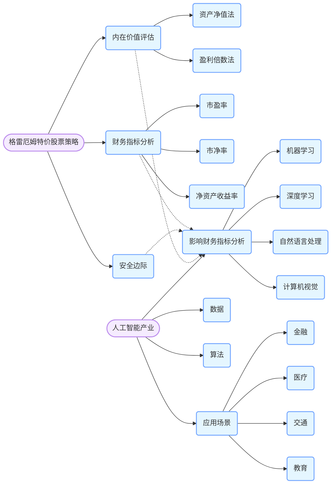

# 格雷厄姆特价股票策略在人工智能产业的应用挑战

> 关键词：格雷厄姆特价股票策略、人工智能产业、价值投资、应用挑战、财务指标

> 摘要：本文聚焦于格雷厄姆特价股票策略在人工智能产业的应用挑战。首先介绍了格雷厄姆特价股票策略的背景和核心概念，分析了其在传统市场的有效性及原理。接着深入探讨人工智能产业的特性，如高研发投入、技术迭代快等对该策略应用的影响。通过数学模型和公式，阐述该策略在评估人工智能企业价值时的局限性。结合实际案例，展示了应用该策略进行投资决策时可能面临的问题。最后对未来发展趋势进行展望，指出该策略在人工智能产业应用中面临的挑战与机遇，旨在为投资者和相关从业者提供有价值的参考。

## 1. 背景介绍 
### 1.1 目的和范围
本研究的主要目的是深入剖析格雷厄姆特价股票策略在人工智能产业应用过程中所面临的挑战。格雷厄姆特价股票策略作为价值投资领域的经典方法，在传统金融市场中被广泛应用且取得了一定的成功。然而，人工智能产业作为新兴的高科技领域，具有独特的产业特性和发展规律。本研究将探讨该策略在人工智能产业的适用性，分析其应用过程中遇到的困难和问题，为投资者和相关研究人员提供决策参考。研究范围涵盖格雷厄姆特价股票策略的基本原理、人工智能产业的特点、该策略在人工智能产业应用的具体挑战以及未来发展趋势等方面。

### 1.2 预期读者
本文预期读者包括对价值投资和人工智能产业感兴趣的投资者，他们希望了解如何将传统的投资策略应用于新兴的人工智能领域；金融分析师和研究人员，他们关注投资策略在不同产业的适用性和发展变化；人工智能企业的管理人员，他们可以从投资策略的角度了解企业在市场中的价值评估和发展方向；以及金融专业的学生，他们可以通过本文深入学习投资策略和新兴产业的相关知识。

### 1.3 文档结构概述
本文将按照以下结构进行阐述：首先介绍格雷厄姆特价股票策略和人工智能产业的相关背景知识，包括核心概念、术语定义等；然后详细分析该策略的核心算法原理和具体操作步骤，并通过数学模型和公式进行理论推导；接着结合实际案例，展示该策略在人工智能产业的应用情况和面临的挑战；之后探讨该策略在人工智能产业的实际应用场景；推荐相关的学习资源、开发工具和研究论文；最后总结该策略在人工智能产业应用的未来发展趋势与挑战，并对常见问题进行解答，同时提供扩展阅读和参考资料。

### 1.4 术语表
#### 1.4.1 核心术语定义
- **格雷厄姆特价股票策略**：由本杰明·格雷厄姆提出的一种价值投资策略，该策略主要通过评估股票的内在价值，寻找价格低于内在价值的股票进行投资，强调对企业财务状况和资产价值的分析。
- **人工智能产业**：是指研发、生产和应用人工智能技术的一系列产业活动，包括人工智能算法研发、人工智能硬件制造、人工智能应用服务等领域。
- **内在价值**：是指企业的真实价值，通常通过对企业的财务状况、盈利能力、资产价值等因素进行综合评估得出。
- **安全边际**：是指股票价格低于内在价值的幅度，是格雷厄姆特价股票策略中的重要概念，用于降低投资风险。

#### 1.4.2 相关概念解释
- **价值投资**：是一种投资理念，强调通过分析企业的内在价值，寻找被市场低估的股票进行投资，以获取长期的投资回报。
- **成长投资**：是一种侧重于寻找具有高成长潜力的企业进行投资的策略，更关注企业的未来发展前景和增长速度。
- **研发投入**：是指企业在研发活动中投入的资金和资源，对于人工智能企业来说，研发投入是推动技术创新和业务发展的重要因素。

#### 1.4.3 缩略词列表
- **PE**：市盈率（Price - Earnings Ratio），是指股票价格与每股收益的比率，用于衡量股票的估值水平。
- **PB**：市净率（Price - Book Ratio），是指股票价格与每股净资产的比率，反映了股票价格相对于净资产的倍数。
- **ROE**：净资产收益率（Return on Equity），是指企业净利润与净资产的比率，衡量了企业运用自有资本的效率。

## 2. 核心概念与联系 
### 格雷厄姆特价股票策略核心概念
格雷厄姆特价股票策略的核心思想是寻找被市场低估的股票，即股票价格低于其内在价值的股票。该策略主要基于以下几个核心概念：
- **内在价值评估**：通过对企业的财务报表进行分析，评估企业的资产价值、盈利能力、现金流等因素，计算出企业的内在价值。常用的方法包括资产净值法、盈利倍数法等。
- **安全边际**：格雷厄姆认为，为了降低投资风险，投资者应该在股票价格低于内在价值一定幅度时进行投资，这个幅度就是安全边际。安全边际的存在可以为投资者提供一定的缓冲，即使企业的实际表现不如预期，投资者也不会遭受重大损失。
- **财务指标分析**：该策略注重对企业的财务指标进行分析，如市盈率、市净率、净资产收益率等。通过比较这些指标与同行业其他企业的水平，以及历史数据的变化趋势，判断股票的估值是否合理。

### 人工智能产业核心概念
人工智能产业是一个快速发展的新兴领域，其核心概念包括：
- **人工智能技术**：是指模拟人类智能的技术，包括机器学习、深度学习、自然语言处理、计算机视觉等。这些技术可以使计算机系统具有感知、理解、学习和决策的能力。
- **数据**：是人工智能技术的基础，大量的高质量数据可以用于训练人工智能模型，提高模型的性能和准确性。
- **算法**：是人工智能技术的核心，不同的算法适用于不同的应用场景，如分类算法、回归算法、聚类算法等。
- **应用场景**：人工智能技术可以应用于多个领域，如金融、医疗、交通、教育等，为这些领域带来了新的发展机遇和变革。

### 两者联系的文本示意图
```plaintext
格雷厄姆特价股票策略
|--内在价值评估
|   |--资产净值法
|   |--盈利倍数法
|--安全边际
|--财务指标分析
|   |--市盈率
|   |--市净率
|   |--净资产收益率

人工智能产业
|--人工智能技术
|   |--机器学习
|   |--深度学习
|   |--自然语言处理
|   |--计算机视觉
|--数据
|--算法
|--应用场景
|   |--金融
|   |--医疗
|   |--交通
|   |--教育

联系：
格雷厄姆特价股票策略试图评估人工智能企业的内在价值，寻找被低估的股票。但人工智能产业的高研发投入、技术迭代快等特点给内在价值评估带来挑战，影响安全边际和财务指标的判断。
```

### 两者联系的 Mermaid 流程图


## 3. 核心算法原理 & 具体操作步骤 
### 格雷厄姆特价股票策略核心算法原理
格雷厄姆特价股票策略的核心算法原理是通过计算股票的内在价值，然后与当前市场价格进行比较，寻找价格低于内在价值的股票。以下是一种常见的计算内在价值的方法：

#### 资产净值法
资产净值法是通过计算企业的净资产价值来评估股票的内在价值。计算公式如下：
$$V = \frac{NAV}{N}$$
其中，$V$ 表示每股内在价值，$NAV$ 表示企业的净资产价值，$N$ 表示发行在外的普通股股数。

#### 盈利倍数法
盈利倍数法是通过企业的盈利水平和行业平均市盈率来计算股票的内在价值。计算公式如下：
$$V = EPS \times P/E_{avg}$$
其中，$V$ 表示每股内在价值，$EPS$ 表示每股收益，$P/E_{avg}$ 表示行业平均市盈率。

### 具体操作步骤
#### 步骤 1：数据收集
收集目标企业的财务报表，包括资产负债表、利润表和现金流量表，以及同行业其他企业的相关财务数据。

#### 步骤 2：财务指标计算
根据收集到的数据，计算目标企业的关键财务指标，如每股收益、每股净资产、市盈率、市净率、净资产收益率等。

#### 步骤 3：内在价值计算
选择合适的方法（如资产净值法或盈利倍数法）计算目标企业的每股内在价值。

#### 步骤 4：安全边际计算
计算股票价格与内在价值的差值，并计算安全边际率。安全边际率的计算公式如下：
$$SMR = \frac{V - P}{V} \times 100\%$$
其中，$SMR$ 表示安全边际率，$V$ 表示每股内在价值，$P$ 表示当前股票价格。

#### 步骤 5：投资决策
如果安全边际率大于设定的阈值（如 20%），则认为该股票具有投资价值，可以考虑买入；否则，不建议投资。

### Python 源代码实现
```python
import pandas as pd

def calculate_intrinsic_value_asset(net_asset_value, num_shares):
    """
    计算基于资产净值法的每股内在价值
    :param net_asset_value: 企业的净资产价值
    :param num_shares: 发行在外的普通股股数
    :return: 每股内在价值
    """
    return net_asset_value / num_shares

def calculate_intrinsic_value_earnings(eps, industry_pe_avg):
    """
    计算基于盈利倍数法的每股内在价值
    :param eps: 每股收益
    :param industry_pe_avg: 行业平均市盈率
    :return: 每股内在价值
    """
    return eps * industry_pe_avg

def calculate_safety_margin_ratio(intrinsic_value, stock_price):
    """
    计算安全边际率
    :param intrinsic_value: 每股内在价值
    :param stock_price: 当前股票价格
    :return: 安全边际率
    """
    return ((intrinsic_value - stock_price) / intrinsic_value) * 100

# 示例数据
net_asset_value = 1000000  # 企业的净资产价值
num_shares = 100000  # 发行在外的普通股股数
eps = 2  # 每股收益
industry_pe_avg = 15  # 行业平均市盈率
stock_price = 25  # 当前股票价格

# 计算内在价值
intrinsic_value_asset = calculate_intrinsic_value_asset(net_asset_value, num_shares)
intrinsic_value_earnings = calculate_intrinsic_value_earnings(eps, industry_pe_avg)

# 计算安全边际率
safety_margin_ratio_asset = calculate_safety_margin_ratio(intrinsic_value_asset, stock_price)
safety_margin_ratio_earnings = calculate_safety_margin_ratio(intrinsic_value_earnings, stock_price)

# 输出结果
print(f"基于资产净值法的每股内在价值: {intrinsic_value_asset}")
print(f"基于盈利倍数法的每股内在价值: {intrinsic_value_earnings}")
print(f"基于资产净值法的安全边际率: {safety_margin_ratio_asset}%")
print(f"基于盈利倍数法的安全边际率: {safety_margin_ratio_earnings}%")
```

## 4. 数学模型和公式 & 详细讲解 & 举例说明 
### 数学模型和公式
#### 内在价值计算模型
- **资产净值法**：
$$V_{asset} = \frac{NAV}{N}$$
其中，$V_{asset}$ 表示基于资产净值法计算的每股内在价值，$NAV$ 表示企业的净资产价值，$N$ 表示发行在外的普通股股数。

- **盈利倍数法**：
$$V_{earnings} = EPS \times P/E_{avg}$$
其中，$V_{earnings}$ 表示基于盈利倍数法计算的每股内在价值，$EPS$ 表示每股收益，$P/E_{avg}$ 表示行业平均市盈率。

#### 安全边际率计算模型
$$SMR = \frac{V - P}{V} \times 100\%$$
其中，$SMR$ 表示安全边际率，$V$ 表示每股内在价值，$P$ 表示当前股票价格。

### 详细讲解
#### 内在价值计算
- **资产净值法**：该方法假设企业的价值主要取决于其拥有的资产。通过计算企业的净资产价值（总资产减去总负债），并将其除以发行在外的普通股股数，得到每股的内在价值。这种方法适用于资产密集型企业，如制造业、房地产等。
- **盈利倍数法**：该方法基于企业的盈利水平和行业平均市盈率来评估股票的内在价值。每股收益反映了企业的盈利能力，行业平均市盈率则反映了市场对该行业企业的估值水平。通过将每股收益乘以行业平均市盈率，得到每股的内在价值。这种方法适用于盈利稳定的企业。

#### 安全边际率计算
安全边际率是衡量投资风险的重要指标。它表示股票价格低于内在价值的幅度，安全边际率越高，投资风险越低。当安全边际率大于设定的阈值时，说明股票价格被低估，具有投资价值；反之，则说明股票价格可能被高估，投资风险较大。

### 举例说明
假设一家人工智能企业的相关数据如下：
- 企业的净资产价值 $NAV = 5000$ 万元
- 发行在外的普通股股数 $N = 1000$ 万股
- 每股收益 $EPS = 1$ 元
- 行业平均市盈率 $P/E_{avg} = 20$
- 当前股票价格 $P = 15$ 元

#### 内在价值计算
- **资产净值法**：
$$V_{asset} = \frac{NAV}{N} = \frac{5000}{1000} = 5 \text{ 元}$$
- **盈利倍数法**：
$$V_{earnings} = EPS \times P/E_{avg} = 1 \times 20 = 20 \text{ 元}$$

#### 安全边际率计算
- **基于资产净值法**：
$$SMR_{asset} = \frac{V_{asset} - P}{V_{asset}} \times 100\% = \frac{5 - 15}{5} \times 100\% = -200\%$$
- **基于盈利倍数法**：
$$SMR_{earnings} = \frac{V_{earnings} - P}{V_{earnings}} \times 100\% = \frac{20 - 15}{20} \times 100\% = 25\%$$

从计算结果可以看出，基于资产净值法，该股票的价格远高于内在价值，安全边际率为负数，投资风险较大；而基于盈利倍数法，该股票的价格低于内在价值，安全边际率为 25%，具有一定的投资价值。这说明在评估人工智能企业的价值时，不同的计算方法可能会得出不同的结果，需要综合考虑多种因素。

## 5. 项目实战：代码实际案例和详细解释说明 
### 5.1  开发环境搭建
#### 安装 Python
首先，需要安装 Python 编程语言。可以从 Python 官方网站（https://www.python.org/downloads/）下载适合自己操作系统的 Python 版本，并按照安装向导进行安装。

#### 安装必要的库
在本项目中，需要使用 `pandas` 库来处理数据。可以使用以下命令来安装 `pandas` 库：
```sh
pip install pandas
```

### 5.2  源代码详细实现和代码解读
```python
import pandas as pd

def calculate_intrinsic_value_asset(net_asset_value, num_shares):
    """
    计算基于资产净值法的每股内在价值
    :param net_asset_value: 企业的净资产价值
    :param num_shares: 发行在外的普通股股数
    :return: 每股内在价值
    """
    return net_asset_value / num_shares

def calculate_intrinsic_value_earnings(eps, industry_pe_avg):
    """
    计算基于盈利倍数法的每股内在价值
    :param eps: 每股收益
    :param industry_pe_avg: 行业平均市盈率
    :return: 每股内在价值
    """
    return eps * industry_pe_avg

def calculate_safety_margin_ratio(intrinsic_value, stock_price):
    """
    计算安全边际率
    :param intrinsic_value: 每股内在价值
    :param stock_price: 当前股票价格
    :return: 安全边际率
    """
    return ((intrinsic_value - stock_price) / intrinsic_value) * 100

def evaluate_stock(net_asset_value, num_shares, eps, industry_pe_avg, stock_price):
    """
    评估股票的投资价值
    :param net_asset_value: 企业的净资产价值
    :param num_shares: 发行在外的普通股股数
    :param eps: 每股收益
    :param industry_pe_avg: 行业平均市盈率
    :param stock_price: 当前股票价格
    :return: 评估结果
    """
    # 计算内在价值
    intrinsic_value_asset = calculate_intrinsic_value_asset(net_asset_value, num_shares)
    intrinsic_value_earnings = calculate_intrinsic_value_earnings(eps, industry_pe_avg)

    # 计算安全边际率
    safety_margin_ratio_asset = calculate_safety_margin_ratio(intrinsic_value_asset, stock_price)
    safety_margin_ratio_earnings = calculate_safety_margin_ratio(intrinsic_value_earnings, stock_price)

    # 输出结果
    print(f"基于资产净值法的每股内在价值: {intrinsic_value_asset}")
    print(f"基于盈利倍数法的每股内在价值: {intrinsic_value_earnings}")
    print(f"基于资产净值法的安全边际率: {safety_margin_ratio_asset}%")
    print(f"基于盈利倍数法的安全边际率: {safety_margin_ratio_earnings}%")

    # 根据安全边际率进行投资决策
    if safety_margin_ratio_asset > 20 or safety_margin_ratio_earnings > 20:
        return "具有投资价值"
    else:
        return "不建议投资"

# 示例数据
net_asset_value = 8000000  # 企业的净资产价值
num_shares = 200000  # 发行在外的普通股股数
eps = 3  # 每股收益
industry_pe_avg = 18  # 行业平均市盈率
stock_price = 35  # 当前股票价格

# 评估股票
result = evaluate_stock(net_asset_value, num_shares, eps, industry_pe_avg, stock_price)
print(f"评估结果: {result}")
```

### 5.3  代码解读与分析
#### 函数功能
- `calculate_intrinsic_value_asset`：该函数用于计算基于资产净值法的每股内在价值，通过将企业的净资产价值除以发行在外的普通股股数得到结果。
- `calculate_intrinsic_value_earnings`：该函数用于计算基于盈利倍数法的每股内在价值，通过将每股收益乘以行业平均市盈率得到结果。
- `calculate_safety_margin_ratio`：该函数用于计算安全边际率，通过计算每股内在价值与当前股票价格的差值，并将其除以每股内在价值得到结果。
- `evaluate_stock`：该函数是核心函数，用于评估股票的投资价值。它调用了上述三个函数，计算出两种方法下的内在价值和安全边际率，并根据安全边际率是否大于 20% 来判断股票是否具有投资价值。

#### 代码执行流程
1. 定义所需的函数。
2. 提供示例数据，包括企业的净资产价值、发行在外的普通股股数、每股收益、行业平均市盈率和当前股票价格。
3. 调用 `evaluate_stock` 函数进行股票评估，并将结果存储在 `result` 变量中。
4. 输出评估结果。

#### 注意事项
- 在实际应用中，需要确保输入的数据准确可靠。净资产价值、每股收益等数据可以从企业的财务报表中获取，行业平均市盈率可以通过相关金融数据网站查询。
- 该代码只是一个简单的示例，实际的股票评估需要考虑更多的因素，如企业的竞争力、行业发展趋势、宏观经济环境等。

## 6. 实际应用场景 
### 投资者选股
对于个人投资者和机构投资者来说，格雷厄姆特价股票策略可以作为一种选股的参考方法。在人工智能产业中，投资者可以使用该策略筛选出可能被低估的股票。例如，投资者可以收集人工智能企业的财务数据，计算其内在价值和安全边际率，选择安全边际率较高的股票进行投资。然而，由于人工智能产业的特殊性，投资者需要注意该策略的局限性，不能仅仅依靠财务指标来做出投资决策。

### 企业价值评估
对于人工智能企业来说，格雷厄姆特价股票策略可以用于企业的价值评估。企业管理层可以通过计算自身的内在价值，了解企业在市场中的估值水平，为企业的融资、并购等决策提供参考。同时，企业也可以通过与同行业其他企业的比较，发现自身的优势和不足，制定相应的发展战略。

### 金融分析师研究
金融分析师可以使用格雷厄姆特价股票策略对人工智能企业进行研究和分析。他们可以通过深入研究企业的财务状况、技术实力、市场前景等因素，结合该策略的计算结果，撰写研究报告，为投资者提供投资建议。此外，金融分析师还可以通过对人工智能产业的整体研究，分析该策略在该产业的适用性和发展趋势。

## 7. 工具和资源推荐
### 7.1 学习资源推荐
#### 7.1.1 书籍推荐
- 《聪明的投资者》（The Intelligent Investor）：本杰明·格雷厄姆的经典著作，详细介绍了价值投资的理念和方法，包括格雷厄姆特价股票策略的核心思想。
- 《证券分析》（Security Analysis）：同样是本杰明·格雷厄姆的重要著作，对证券分析的基本原理和方法进行了系统阐述，是价值投资领域的权威书籍。
- 《人工智能：现代方法》（Artificial Intelligence: A Modern Approach）：全面介绍了人工智能的基本概念、算法和应用，适合对人工智能技术感兴趣的读者。

#### 7.1.2 在线课程
- Coursera 上的“Machine Learning”：由斯坦福大学教授 Andrew Ng 主讲的机器学习课程，是学习人工智能基础算法的经典课程。
- edX 上的“Artificial Intelligence”：麻省理工学院开设的人工智能课程，内容涵盖人工智能的各个方面，包括搜索算法、机器学习、自然语言处理等。
- 中国大学 MOOC 上的“金融投资学”：该课程介绍了金融投资的基本理论和方法，包括价值投资策略的讲解。

#### 7.1.3 技术博客和网站
- Medium：一个技术博客平台，上面有很多关于人工智能和投资的优质文章，可以关注一些知名博主的账号，获取最新的技术和投资动态。
- Seeking Alpha：一个金融投资网站，提供股票分析、投资策略、市场评论等内容，对价值投资感兴趣的读者可以从中获取有价值的信息。
- AI Trends：专注于人工智能领域的新闻和分析网站，及时报道人工智能技术的最新发展和应用案例。

### 7.2 开发工具框架推荐
#### 7.2.1 IDE和编辑器
- PyCharm：一款专业的 Python 集成开发环境，具有代码编辑、调试、代码分析等功能，适合 Python 开发人员使用。
- Jupyter Notebook：一个交互式的开发环境，支持多种编程语言，尤其适合数据科学和机器学习的开发。用户可以在浏览器中编写代码、运行代码、查看结果，并可以将代码和文档结合在一起，方便进行数据分析和可视化。
- Visual Studio Code：一款轻量级的代码编辑器，支持多种编程语言和插件扩展，具有丰富的代码编辑和调试功能，适合初学者和专业开发者使用。

#### 7.2.2 调试和性能分析工具
- PDB：Python 自带的调试工具，可以在代码中设置断点，逐步执行代码，查看变量的值和程序的执行流程，帮助开发者发现和解决代码中的问题。
- cProfile：Python 标准库中的性能分析工具，可以统计代码中各个函数的执行时间和调用次数，帮助开发者找出代码中的性能瓶颈。
- TensorBoard：TensorFlow 框架提供的可视化工具，可以用于可视化训练过程中的各种指标，如损失函数、准确率等，帮助开发者监控模型的训练情况。

#### 7.2.3 相关框架和库
- Pandas：一个强大的数据处理和分析库，提供了高效的数据结构和数据操作方法，适合处理金融数据和企业财务数据。
- NumPy：Python 中的数值计算库，提供了高效的多维数组对象和数学函数，是机器学习和数据分析的基础库。
- Scikit-learn：一个简单易用的机器学习库，提供了各种机器学习算法和工具，如分类、回归、聚类等，适合初学者和快速开发。

### 7.3 相关论文著作推荐
#### 7.3.1 经典论文
- "Value Investing: The Use of Historical Financial Statement Information to Separate Winners from Losers"：该论文研究了价值投资策略的有效性，通过对历史财务数据的分析，发现价值股在长期内表现优于成长股。
- "Machine Learning for Asset Managers"：介绍了机器学习在资产管理中的应用，探讨了如何使用机器学习算法来预测股票价格和评估投资风险。
- "Artificial Intelligence and Economic Growth"：研究了人工智能对经济增长的影响，分析了人工智能技术的发展趋势和应用前景。

#### 7.3.2 最新研究成果
- 在 arXiv 预印本平台上可以搜索到很多关于人工智能和投资的最新研究成果，这些研究通常涵盖了最新的算法和技术应用。
- 《Journal of Financial Economics》、《Review of Financial Studies》等金融领域的顶级学术期刊也会发表一些关于投资策略和人工智能应用的研究论文。

#### 7.3.3 应用案例分析
- 《AI in Finance: From Theory to Practice》：这本书介绍了人工智能在金融领域的应用案例，包括风险管理、投资决策、信贷评估等方面，对理解人工智能在投资领域的实际应用有很大帮助。
- 一些金融机构和咨询公司的研究报告也会提供人工智能企业的投资案例分析，可以通过相关机构的官方网站获取这些报告。

## 8. 总结：未来发展趋势与挑战
### 未来发展趋势
#### 与人工智能技术融合
随着人工智能技术的不断发展，格雷厄姆特价股票策略可能会与人工智能技术进一步融合。例如，可以使用机器学习算法来改进内在价值的计算方法，提高计算的准确性和效率。同时，人工智能技术还可以用于分析大量的非财务数据，如社交媒体数据、行业新闻等，为投资决策提供更多的信息。

#### 跨领域应用
该策略可能会在更多的领域得到应用，不仅仅局限于股票投资。例如，在债券投资、房地产投资等领域，也可以借鉴格雷厄姆特价股票策略的思想，寻找被低估的资产进行投资。

#### 个性化投资
未来，投资者可能会根据自己的风险偏好、投资目标和投资经验等因素，对格雷厄姆特价股票策略进行个性化的调整和优化。例如，不同的投资者可能会选择不同的财务指标和计算方法，以满足自己的投资需求。

### 挑战
#### 人工智能产业特性带来的挑战
人工智能产业具有高研发投入、技术迭代快、盈利不确定性大等特点，这些特点给格雷厄姆特价股票策略的应用带来了很大的挑战。传统的财务指标可能无法准确反映人工智能企业的真实价值，需要开发新的评估方法和指标。

#### 数据质量和可靠性
该策略的应用依赖于大量的财务数据和市场数据，数据的质量和可靠性直接影响到投资决策的准确性。在人工智能产业中，由于数据的复杂性和多样性，数据的收集、整理和分析难度较大，需要建立完善的数据管理体系。

#### 市场变化快速
人工智能产业是一个快速发展的行业，市场变化迅速。新的技术、新的商业模式不断涌现，这使得股票的估值和投资价值也在不断变化。投资者需要及时调整投资策略，以适应市场的变化。

## 9. 附录：常见问题与解答
### 问题 1：格雷厄姆特价股票策略在人工智能产业是否仍然有效？
解答：该策略在人工智能产业的有效性受到一定的挑战。由于人工智能产业的特殊性，传统的财务指标可能无法准确反映企业的真实价值。然而，该策略的核心思想，即寻找被低估的股票，仍然具有一定的参考价值。投资者需要结合人工智能产业的特点，对该策略进行适当的调整和优化。

### 问题 2：如何确定人工智能企业的内在价值？
解答：确定人工智能企业的内在价值是一个复杂的问题。除了使用传统的资产净值法和盈利倍数法外，还需要考虑企业的技术实力、研发投入、市场份额、团队素质等因素。可以使用多因素模型来综合评估企业的内在价值，同时结合行业分析和市场趋势进行判断。

### 问题 3：安全边际率的阈值应该如何设定？
解答：安全边际率的阈值没有固定的标准，通常取决于投资者的风险偏好和投资目标。一般来说，较为保守的投资者可能会将阈值设定为 20% - 30%，而风险承受能力较高的投资者可能会将阈值设定得较低。在实际应用中，投资者可以根据市场情况和企业的具体情况进行调整。

### 问题 4：如何获取人工智能企业的财务数据和市场数据？
解答：可以通过以下途径获取相关数据：
- 企业的官方网站：企业通常会在其官方网站上公布年度报告、季度报告等财务信息。
- 金融数据提供商：如 Wind、东方财富等，这些平台提供了丰富的金融数据和分析工具。
- 证券交易所网站：可以查询上市公司的公告和财务报表。

## 10. 扩展阅读 & 参考资料
### 扩展阅读
- 《巴菲特之道》（The Warren Buffett Way）：介绍了巴菲特的投资理念和方法，巴菲特是格雷厄姆的学生，其投资策略深受格雷厄姆的影响，阅读这本书可以进一步了解价值投资的实践应用。
- 《人工智能时代与人类未来》：探讨了人工智能技术对社会、经济和人类生活的影响，帮助读者更好地理解人工智能产业的发展趋势。
- 《量化投资：策略与技术》：介绍了量化投资的基本概念、策略和技术，对于将格雷厄姆特价股票策略与量化投资相结合有一定的参考价值。

### 参考资料
- 本杰明·格雷厄姆. 《聪明的投资者》. 人民邮电出版社.
- Stuart Russell, Peter Norvig. 《人工智能：现代方法》. 清华大学出版社.
- 各种金融数据网站和财经媒体的相关报道。

作者：AI天才研究院/AI Genius Institute & 禅与计算机程序设计艺术 /Zen And The Art of Computer Programming