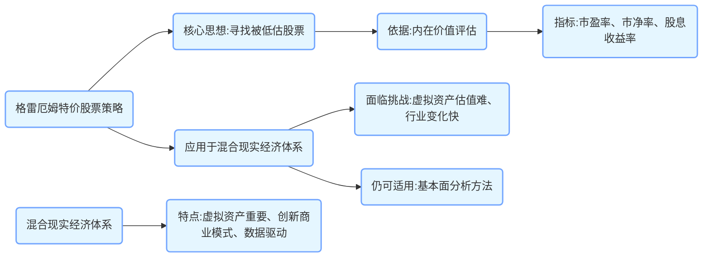

# 格雷厄姆特价股票策略在混合现实经济体系下的表现

> 关键词：格雷厄姆特价股票策略、混合现实经济体系、股票投资、价值评估、市场表现

> 摘要：本文深入探讨了格雷厄姆特价股票策略在混合现实经济体系下的表现。首先介绍了研究的背景、目的、预期读者等内容。接着阐述了格雷厄姆特价股票策略和混合现实经济体系的核心概念及联系。详细讲解了该策略的核心算法原理和具体操作步骤，并给出了相应的 Python 代码。通过数学模型和公式对策略进行分析，结合实际案例说明其应用。在项目实战部分，展示了开发环境搭建、源代码实现与解读。分析了该策略在不同实际应用场景下的情况，推荐了相关的学习资源、开发工具框架和论文著作。最后总结了未来发展趋势与挑战，还提供了常见问题解答和扩展阅读参考资料，旨在为投资者在混合现实经济体系下运用格雷厄姆特价股票策略提供全面的指导。

## 1. 背景介绍 
### 1.1 目的和范围
本研究的主要目的是探究格雷厄姆特价股票策略在混合现实经济体系这一新兴经济模式下的有效性和表现。格雷厄姆特价股票策略作为价值投资的经典策略，在传统经济环境中已经被广泛应用和研究。然而，随着混合现实技术的发展和应用，混合现实经济体系逐渐形成，其经济结构、市场特征和企业估值方式都与传统经济有所不同。因此，需要研究该策略在新环境下的适用性和表现，为投资者提供决策参考。

本研究的范围涵盖了对格雷厄姆特价股票策略的基本原理、混合现实经济体系的特点分析，以及两者结合后策略在市场中的表现评估。通过理论分析、算法实现、实际案例研究等方法，全面探讨该策略在混合现实经济体系下的投资效果。

### 1.2 预期读者
本文的预期读者主要包括以下几类人群：
1. **投资者**：无论是个人投资者还是机构投资者，都可以从本文中了解格雷厄姆特价股票策略在混合现实经济体系下的应用，为投资决策提供参考。
2. **金融分析师**：有助于他们深入研究新经济环境下的投资策略，提升对市场的分析和预测能力。
3. **学术研究人员**：为相关领域的学术研究提供新的视角和思路，推动投资策略和经济体系相关理论的发展。
4. **技术开发者**：了解投资策略和经济体系的结合，可能为开发相关的金融科技产品提供灵感。

### 1.3 文档结构概述
本文将按照以下结构进行阐述：
1. **背景介绍**：说明研究的目的、范围、预期读者和文档结构概述，为后续内容奠定基础。
2. **核心概念与联系**：介绍格雷厄姆特价股票策略和混合现实经济体系的核心概念，分析它们之间的联系，并通过文本示意图和 Mermaid 流程图进行展示。
3. **核心算法原理 & 具体操作步骤**：详细讲解格雷厄姆特价股票策略的核心算法原理，给出具体的操作步骤，并使用 Python 源代码进行阐述。
4. **数学模型和公式 & 详细讲解 & 举例说明**：建立数学模型和公式对策略进行分析，详细讲解其含义，并通过实际例子进行说明。
5. **项目实战：代码实际案例和详细解释说明**：包括开发环境搭建、源代码详细实现和代码解读，帮助读者更好地理解和应用该策略。
6. **实际应用场景**：分析该策略在混合现实经济体系下的不同实际应用场景。
7. **工具和资源推荐**：推荐相关的学习资源、开发工具框架和论文著作，方便读者进一步深入学习。
8. **总结：未来发展趋势与挑战**：总结该策略在混合现实经济体系下的未来发展趋势和面临的挑战。
9. **附录：常见问题与解答**：解答读者可能遇到的常见问题。
10. **扩展阅读 & 参考资料**：提供相关的扩展阅读内容和参考资料，为读者提供更多的学习途径。

### 1.4 术语表
#### 1.4.1 核心术语定义
1. **格雷厄姆特价股票策略**：由本杰明·格雷厄姆提出的一种价值投资策略，该策略主要关注股票的内在价值，通过筛选出价格低于内在价值的股票进行投资。
2. **混合现实经济体系**：是一种融合了虚拟现实（VR）、增强现实（AR）和现实世界经济活动的新型经济体系。在这个体系中，虚拟资产和现实资产相互关联，创造出全新的商业机会和经济模式。
3. **内在价值**：指股票所代表的企业的真实价值，通常通过对企业的财务状况、盈利能力、资产质量等因素进行分析和评估得出。
4. **安全边际**：是格雷厄姆投资理论中的一个重要概念，指股票的市场价格低于其内在价值的幅度。安全边际越大，投资的风险越低。

#### 1.4.2 相关概念解释
1. **价值投资**：一种投资理念，强调通过分析企业的基本面，寻找被市场低估的股票进行投资，以获取长期的投资回报。
2. **虚拟现实（VR）**：一种利用计算机技术创建的虚拟环境，用户可以通过特殊的设备（如头戴式显示器）沉浸其中，获得身临其境的体验。
3. **增强现实（AR）**：将虚拟信息与现实场景相结合的技术，通过手机、眼镜等设备，用户可以在现实世界中看到叠加的虚拟信息。

#### 1.4.3 缩略词列表
1. **VR**：虚拟现实（Virtual Reality）
2. **AR**：增强现实（Augmented Reality）

## 2. 核心概念与联系 
### 2.1 格雷厄姆特价股票策略核心概念
格雷厄姆特价股票策略的核心思想是寻找被市场低估的股票，即股票的市场价格低于其内在价值。格雷厄姆认为，市场有时会出现非理性的波动，导致股票价格偏离其内在价值。投资者可以通过深入分析企业的基本面，如财务报表、盈利能力、资产质量等，来评估股票的内在价值，并选择那些具有足够安全边际的股票进行投资。

该策略通常采用以下几个关键指标来筛选股票：
1. **市盈率（P/E）**：即股票价格与每股收益的比率，反映了投资者为获取每股收益所愿意支付的价格。较低的市盈率通常意味着股票被低估。
2. **市净率（P/B）**：即股票价格与每股净资产的比率，反映了股票价格相对于企业净资产的倍数。较低的市净率可能表示股票具有较高的投资价值。
3. **股息收益率**：即股息与股票价格的比率，反映了投资者从股票中获得的股息收益。较高的股息收益率通常是一个积极的信号。

### 2.2 混合现实经济体系核心概念
混合现实经济体系是虚拟现实（VR）、增强现实（AR）技术与现实经济活动深度融合的产物。在这个体系中，虚拟世界和现实世界相互交织，创造出了全新的经济模式和商业机会。

混合现实经济体系具有以下几个特点：
1. **虚拟资产的重要性**：虚拟资产如虚拟土地、虚拟货币、虚拟商品等在经济活动中扮演着重要的角色。这些虚拟资产具有独特的价值和交易规则。
2. **创新的商业模式**：混合现实技术为企业带来了创新的商业模式，如虚拟展览、虚拟购物、虚拟培训等。这些新模式改变了传统的商业运营方式。
3. **数据驱动的经济**：混合现实经济体系中产生了大量的数据，这些数据可以用于分析用户行为、优化商业模式和提高决策效率。

### 2.3 两者的联系
在混合现实经济体系下，格雷厄姆特价股票策略仍然具有一定的适用性，但也面临着一些挑战和变化。

一方面，混合现实经济体系中的企业也需要进行基本面分析，评估其内在价值。虽然这些企业的业务可能涉及虚拟资产和创新的商业模式，但基本的财务分析方法仍然可以应用。例如，通过分析企业的收入、利润、资产负债表等指标，来评估其盈利能力和财务状况。

另一方面，混合现实经济体系的特殊性也给格雷厄姆特价股票策略带来了一些挑战。例如，虚拟资产的估值相对困难，因为其价值受到市场需求、技术发展等多种因素的影响。此外，混合现实行业的发展速度较快，企业的竞争格局和商业模式也在不断变化，这增加了预测企业未来盈利能力的难度。

### 2.4 文本示意图
```plaintext
格雷厄姆特价股票策略
|--核心思想：寻找被低估股票
|   |--依据：内在价值评估
|       |--指标：市盈率、市净率、股息收益率
|
|--应用于混合现实经济体系
|   |--面临挑战：虚拟资产估值难、行业变化快
|   |--仍可适用：基本面分析方法
|
混合现实经济体系
|--特点：虚拟资产重要、创新商业模式、数据驱动
|
```

### 2.5 Mermaid 流程图


## 3. 核心算法原理 & 具体操作步骤 
### 3.1 核心算法原理
格雷厄姆特价股票策略的核心算法原理是通过计算股票的内在价值，并将其与市场价格进行比较，以确定股票是否被低估。具体步骤如下：
1. **计算内在价值**：可以采用多种方法来计算股票的内在价值，其中一种常用的方法是基于股息折现模型（DDM）。该模型假设股票的价值等于其未来股息的现值之和。公式如下：
   $$V = \sum_{t=1}^{n} \frac{D_t}{(1 + r)^t}$$
   其中，$V$ 表示股票的内在价值，$D_t$ 表示第 $t$ 期的股息，$r$ 表示折现率，$n$ 表示预测的期数。
2. **确定安全边际**：安全边际是指股票的市场价格低于其内在价值的幅度。通常，格雷厄姆建议投资者选择安全边际较大的股票进行投资，以降低投资风险。安全边际的计算公式为：
   $$安全边际 = \frac{内在价值 - 市场价格}{内在价值} \times 100\%$$
3. **筛选股票**：根据计算得到的安全边际，筛选出安全边际大于一定阈值（如 30%）的股票作为投资候选。

### 3.2 具体操作步骤
#### 步骤 1：收集数据
收集股票的相关数据，包括财务报表、股息数据、市场价格等。可以通过金融数据提供商（如雅虎财经、东方财富等）获取这些数据。

#### 步骤 2：计算内在价值
使用股息折现模型或其他合适的方法计算股票的内在价值。在实际应用中，由于未来股息的预测存在不确定性，可以采用简化的方法，如使用历史股息增长率来预测未来股息。

#### 步骤 3：计算安全边际
根据计算得到的内在价值和当前市场价格，计算股票的安全边际。

#### 步骤 4：筛选股票
设定安全边际的阈值，筛选出安全边际大于该阈值的股票。

#### 步骤 5：投资决策
对筛选出的股票进行进一步的分析和评估，结合个人的投资目标和风险承受能力，做出投资决策。

### 3.3 Python 源代码实现
```python
import pandas as pd
import numpy as np

# 定义股息折现模型计算内在价值的函数
def calculate_intrinsic_value(dividends, growth_rate, discount_rate):
    """
    计算股票的内在价值
    :param dividends: 历史股息数据
    :param growth_rate: 股息增长率
    :param discount_rate: 折现率
    :return: 内在价值
    """
    # 假设未来股息以固定增长率增长
    future_dividends = []
    last_dividend = dividends[-1]
    for i in range(1, 11):  # 预测未来 10 年的股息
        future_dividend = last_dividend * (1 + growth_rate) ** i
        future_dividends.append(future_dividend)
    
    # 计算未来股息的现值之和
    present_values = []
    for i, dividend in enumerate(future_dividends):
        present_value = dividend / ((1 + discount_rate) ** (i + 1))
        present_values.append(present_value)
    
    intrinsic_value = sum(present_values)
    return intrinsic_value

# 定义计算安全边际的函数
def calculate_safety_margin(intrinsic_value, market_price):
    """
    计算股票的安全边际
    :param intrinsic_value: 内在价值
    :param market_price: 市场价格
    :return: 安全边际
    """
    safety_margin = (intrinsic_value - market_price) / intrinsic_value * 100
    return safety_margin

# 示例数据
dividends = [1.0, 1.1, 1.2, 1.3, 1.4]  # 历史股息数据
growth_rate = 0.05  # 股息增长率
discount_rate = 0.1  # 折现率
market_price = 15  # 市场价格

# 计算内在价值
intrinsic_value = calculate_intrinsic_value(dividends, growth_rate, discount_rate)
print(f"股票的内在价值: {intrinsic_value:.2f}")

# 计算安全边际
safety_margin = calculate_safety_margin(intrinsic_value, market_price)
print(f"股票的安全边际: {safety_margin:.2f}%")

# 筛选股票示例
threshold = 30  # 安全边际阈值
if safety_margin > threshold:
    print("该股票符合筛选条件，可以考虑投资。")
else:
    print("该股票不符合筛选条件，不建议投资。")
```

### 3.4 代码解释
1. **calculate_intrinsic_value 函数**：该函数接受历史股息数据、股息增长率和折现率作为输入，使用股息折现模型计算股票的内在价值。具体步骤包括预测未来 10 年的股息，并计算这些股息的现值之和。
2. **calculate_safety_margin 函数**：该函数接受内在价值和市场价格作为输入，计算股票的安全边际。
3. **主程序**：定义了示例数据，调用上述两个函数计算内在价值和安全边际，并根据设定的安全边际阈值进行股票筛选。

## 4. 数学模型和公式 & 详细讲解 & 举例说明 
### 4.1 股息折现模型（DDM）
#### 公式
$$V = \sum_{t=1}^{n} \frac{D_t}{(1 + r)^t}$$
其中：
- $V$：股票的内在价值
- $D_t$：第 $t$ 期的股息
- $r$：折现率
- $n$：预测的期数

#### 详细讲解
股息折现模型的基本思想是，股票的价值等于其未来股息的现值之和。未来股息的现值是通过将每期的股息按照折现率进行折现得到的。折现率反映了投资者对资金时间价值和投资风险的要求。

#### 举例说明
假设某股票的历史股息数据如下：$D_0 = 1.0$ 元，预计未来股息将以每年 5% 的增长率增长，折现率为 10%，预测期为 10 年。

首先，计算未来各期的股息：
$D_1 = D_0 \times (1 + g) = 1.0 \times (1 + 0.05) = 1.05$ 元
$D_2 = D_1 \times (1 + g) = 1.05 \times (1 + 0.05) = 1.1025$ 元
$\cdots$
$D_{10} = D_9 \times (1 + g)$

然后，计算各期股息的现值：
$PV_1 = \frac{D_1}{(1 + r)^1} = \frac{1.05}{(1 + 0.1)^1} \approx 0.9545$ 元
$PV_2 = \frac{D_2}{(1 + r)^2} = \frac{1.1025}{(1 + 0.1)^2} \approx 0.9113$ 元
$\cdots$
$PV_{10} = \frac{D_{10}}{(1 + r)^{10}}$

最后，将各期股息的现值相加，得到股票的内在价值：
$V = PV_1 + PV_2 + \cdots + PV_{10}$

### 4.2 安全边际公式
#### 公式
$$安全边际 = \frac{内在价值 - 市场价格}{内在价值} \times 100\%$$

#### 详细讲解
安全边际反映了股票的市场价格低于其内在价值的程度。安全边际越大，说明股票被低估的程度越高，投资的风险越低。格雷厄姆认为，投资者应该选择安全边际较大的股票进行投资，以获得更好的投资回报。

#### 举例说明
假设某股票的内在价值为 20 元，市场价格为 15 元，则该股票的安全边际为：
$$安全边际 = \frac{20 - 15}{20} \times 100\% = 25\%$$

### 4.3 市盈率（P/E）和市净率（P/B）公式
#### 市盈率公式
$$P/E = \frac{股票价格}{每股收益}$$

#### 详细讲解
市盈率反映了投资者为获取每股收益所愿意支付的价格。较低的市盈率通常意味着股票被低估，但也可能反映了市场对该股票的未来增长预期较低。

#### 举例说明
假设某股票的价格为 50 元，每股收益为 5 元，则该股票的市盈率为：
$P/E = \frac{50}{5} = 10$

#### 市净率公式
$$P/B = \frac{股票价格}{每股净资产}$$

#### 详细讲解
市净率反映了股票价格相对于企业净资产的倍数。较低的市净率可能表示股票具有较高的投资价值，但也需要考虑企业的资产质量和盈利能力。

#### 举例说明
假设某股票的价格为 30 元，每股净资产为 15 元，则该股票的市净率为：
$P/B = \frac{30}{15} = 2$

## 5. 项目实战：代码实际案例和详细解释说明 
### 5.1  开发环境搭建
#### 操作系统
可以选择 Windows、Linux 或 macOS 操作系统，这里以 Windows 10 为例进行说明。

#### Python 安装
1. 访问 Python 官方网站（https://www.python.org/downloads/），下载 Python 3.x 版本的安装程序。
2. 运行安装程序，按照提示进行安装。在安装过程中，建议勾选“Add Python to PATH”选项，以便在命令行中可以直接使用 Python 命令。

#### 开发工具
推荐使用 PyCharm 作为开发工具，它是一款功能强大的 Python 集成开发环境（IDE）。可以从 JetBrains 官方网站（https://www.jetbrains.com/pycharm/download/）下载社区版或专业版。

#### 安装必要的库
在命令行中使用以下命令安装必要的 Python 库：
```sh
pip install pandas numpy
```
其中，`pandas` 用于数据处理和分析，`numpy` 用于数值计算。

### 5.2  源代码详细实现和代码解读
```python
import pandas as pd
import numpy as np

# 定义股息折现模型计算内在价值的函数
def calculate_intrinsic_value(dividends, growth_rate, discount_rate):
    """
    计算股票的内在价值
    :param dividends: 历史股息数据
    :param growth_rate: 股息增长率
    :param discount_rate: 折现率
    :return: 内在价值
    """
    # 假设未来股息以固定增长率增长
    future_dividends = []
    last_dividend = dividends[-1]
    for i in range(1, 11):  # 预测未来 10 年的股息
        future_dividend = last_dividend * (1 + growth_rate) ** i
        future_dividends.append(future_dividend)
    
    # 计算未来股息的现值之和
    present_values = []
    for i, dividend in enumerate(future_dividends):
        present_value = dividend / ((1 + discount_rate) ** (i + 1))
        present_values.append(present_value)
    
    intrinsic_value = sum(present_values)
    return intrinsic_value

# 定义计算安全边际的函数
def calculate_safety_margin(intrinsic_value, market_price):
    """
    计算股票的安全边际
    :param intrinsic_value: 内在价值
    :param market_price: 市场价格
    :return: 安全边际
    """
    safety_margin = (intrinsic_value - market_price) / intrinsic_value * 100
    return safety_margin

# 模拟从文件中读取股票数据
def read_stock_data(file_path):
    """
    读取股票数据
    :param file_path: 文件路径
    :return: 股票数据 DataFrame
    """
    data = pd.read_csv(file_path)
    return data

# 主函数
def main():
    # 读取股票数据
    file_path = 'stock_data.csv'
    stock_data = read_stock_data(file_path)
    
    # 初始化筛选结果列表
    selected_stocks = []
    
    # 遍历每只股票
    for index, row in stock_data.iterrows():
        symbol = row['Symbol']
        dividends = eval(row['Dividends'])
        growth_rate = row['GrowthRate']
        discount_rate = row['DiscountRate']
        market_price = row['MarketPrice']
        
        # 计算内在价值
        intrinsic_value = calculate_intrinsic_value(dividends, growth_rate, discount_rate)
        
        # 计算安全边际
        safety_margin = calculate_safety_margin(intrinsic_value, market_price)
        
        # 筛选股票
        threshold = 30  # 安全边际阈值
        if safety_margin > threshold:
            selected_stocks.append({
                'Symbol': symbol,
                'IntrinsicValue': intrinsic_value,
                'MarketPrice': market_price,
                'SafetyMargin': safety_margin
            })
    
    # 输出筛选结果
    if len(selected_stocks) > 0:
        print("筛选出的股票：")
        for stock in selected_stocks:
            print(f"股票代码: {stock['Symbol']}, 内在价值: {stock['IntrinsicValue']:.2f}, 市场价格: {stock['MarketPrice']:.2f}, 安全边际: {stock['SafetyMargin']:.2f}%")
    else:
        print("没有筛选出符合条件的股票。")

if __name__ == "__main__":
    main()
```

### 5.3  代码解读与分析
#### 代码结构
1. **导入必要的库**：导入 `pandas` 和 `numpy` 库，用于数据处理和数值计算。
2. **定义函数**：
    - `calculate_intrinsic_value` 函数：使用股息折现模型计算股票的内在价值。
    - `calculate_safety_margin` 函数：计算股票的安全边际。
    - `read_stock_data` 函数：从 CSV 文件中读取股票数据。
3. **主函数 `main`**：
    - 读取股票数据文件。
    - 遍历每只股票，计算其内在价值和安全边际。
    - 根据安全边际阈值筛选股票，并将符合条件的股票信息存储在 `selected_stocks` 列表中。
    - 输出筛选结果。

#### 数据文件格式
假设 `stock_data.csv` 文件的格式如下：
```plaintext
Symbol,Dividends,GrowthRate,DiscountRate,MarketPrice
AAPL,"[1.0, 1.1, 1.2, 1.3, 1.4]",0.05,0.1,150
GOOG,"[2.0, 2.2, 2.4, 2.6, 2.8]",0.06,0.12,200
```
其中，`Symbol` 表示股票代码，`Dividends` 表示历史股息数据，`GrowthRate` 表示股息增长率，`DiscountRate` 表示折现率，`MarketPrice` 表示市场价格。

#### 代码分析
该代码实现了一个简单的股票筛选系统，通过计算股票的内在价值和安全边际，筛选出符合条件的股票。代码的优点是结构清晰，易于理解和扩展。可以根据实际需求修改股息折现模型的参数、安全边际阈值等，以适应不同的投资策略。

## 6. 实际应用场景 
### 6.1 个人投资者
对于个人投资者来说，格雷厄姆特价股票策略在混合现实经济体系下仍然具有一定的应用价值。个人投资者可以通过以下方式应用该策略：
1. **筛选混合现实相关股票**：在混合现实经济体系中，有许多涉及虚拟现实、增强现实技术的企业。个人投资者可以使用格雷厄姆特价股票策略，筛选出那些被低估的混合现实相关股票进行投资。例如，通过分析企业的财务报表、市盈率、市净率等指标，选择具有投资价值的股票。
2. **长期投资**：格雷厄姆特价股票策略强调长期投资，个人投资者可以将该策略应用于混合现实经济体系中的股票投资，长期持有那些被低估的股票，等待市场对其价值的重新认识，从而获得投资回报。
3. **分散投资**：为了降低投资风险，个人投资者可以将资金分散投资于多只符合格雷厄姆特价股票策略的混合现实相关股票。这样可以避免因个别股票的波动而导致的较大损失。

### 6.2 机构投资者
机构投资者如基金公司、保险公司等，也可以在混合现实经济体系下应用格雷厄姆特价股票策略。具体应用场景如下：
1. **构建投资组合**：机构投资者可以使用该策略筛选出一批被低估的混合现实相关股票，构建投资组合。通过合理配置不同股票的权重，实现投资组合的风险分散和收益最大化。
2. **风险管理**：格雷厄姆特价股票策略中的安全边际概念可以帮助机构投资者进行风险管理。机构投资者可以通过计算股票的安全边际，选择安全边际较大的股票进行投资，降低投资组合的风险。
3. **研究和分析**：机构投资者可以利用自身的研究资源，对混合现实经济体系中的企业进行深入研究和分析。结合格雷厄姆特价股票策略，挖掘具有潜力的投资机会。

### 6.3 创业企业融资
在混合现实经济体系中，创业企业的融资是一个重要的问题。格雷厄姆特价股票策略可以为创业企业的融资提供一定的参考。具体如下：
1. **企业估值**：创业企业在融资过程中需要确定自身的估值。可以借鉴格雷厄姆特价股票策略中的内在价值评估方法，对企业的未来盈利能力、资产质量等进行分析，确定合理的估值。
2. **吸引投资者**：如果创业企业能够证明自己的股票具有较高的安全边际，即市场价格低于其内在价值，那么可以吸引更多的投资者进行投资。这有助于创业企业获得更多的资金支持，推动企业的发展。

## 7. 工具和资源推荐
### 7.1 学习资源推荐
#### 7.1.1 书籍推荐
1. 《聪明的投资者》（The Intelligent Investor）：本杰明·格雷厄姆的经典著作，详细阐述了价值投资的理念和方法，是学习格雷厄姆特价股票策略的必读之书。
2. 《证券分析》（Security Analysis）：同样是本杰明·格雷厄姆的重要著作，对证券分析的基本原理和方法进行了系统的介绍，为投资者提供了深入分析股票的工具和思路。
3. 《混合现实：从概念到实践》（Mixed Reality: From Concept to Practice）：介绍了混合现实技术的基本概念、发展趋势和应用场景，有助于读者了解混合现实经济体系的背景和特点。

#### 7.1.2 在线课程
1. Coursera 上的“价值投资基础”（Foundations of Value Investing）课程：由知名教授授课，系统介绍了价值投资的理论和实践，包括格雷厄姆特价股票策略的应用。
2. edX 上的“混合现实技术与应用”（Mixed Reality Technology and Applications）课程：讲解了混合现实技术的原理、开发工具和应用案例，帮助学习者掌握混合现实领域的相关知识。

#### 7.1.3 技术博客和网站
1. Seeking Alpha（https://seekingalpha.com/）：一个金融投资领域的知名网站，提供了大量的股票分析、投资策略和市场评论文章，有助于投资者了解市场动态和学习投资知识。
2. Medium 上的混合现实相关博客：有许多关于混合现实技术和经济的博客文章，分享了行业的最新趋势和实践经验。

### 7.2 开发工具框架推荐
#### 7.2.1 IDE和编辑器
1. PyCharm：功能强大的 Python 集成开发环境，适合开发和调试使用 Python 实现的格雷厄姆特价股票策略代码。
2. Visual Studio Code：轻量级的代码编辑器，支持多种编程语言，具有丰富的插件扩展功能，可以用于开发和分析股票投资相关的代码。

#### 7.2.2 调试和性能分析工具
1. Py-Spy：一个用于 Python 代码性能分析的工具，可以帮助开发者找出代码中的性能瓶颈，优化代码性能。
2. PDB（Python Debugger）：Python 自带的调试工具，可以帮助开发者在代码运行过程中进行调试，查找和解决问题。

#### 7.2.3 相关框架和库
1. Pandas：用于数据处理和分析的 Python 库，提供了丰富的数据结构和数据操作方法，方便处理股票数据。
2. NumPy：用于数值计算的 Python 库，提供了高效的数组和矩阵运算功能，有助于实现股息折现模型等数学计算。

### 7.3 相关论文著作推荐
#### 7.3.1 经典论文
1. “The Superinvestors of Graham-and-Doddsville”：沃伦·巴菲特的经典论文，介绍了格雷厄姆价值投资策略的成功案例，证明了该策略的有效性。
2. “The Theory of Investment Value”：由约翰·伯尔·威廉姆斯撰写，提出了股息折现模型的基本思想，为股票估值提供了重要的理论基础。

#### 7.3.2 最新研究成果
1. 关于混合现实经济体系的学术研究论文：可以通过学术数据库（如 IEEE Xplore、ACM Digital Library 等）搜索相关论文，了解混合现实经济体系的最新研究进展。
2. 关于价值投资策略在新兴经济环境下应用的研究论文：关注价值投资策略在新经济模式下的适应性和改进方法。

#### 7.3.3 应用案例分析
1. 分析格雷厄姆特价股票策略在不同行业和市场环境下的应用案例：可以参考金融研究报告、投资书籍等，了解该策略在实际应用中的效果和经验教训。
2. 混合现实企业的商业案例分析：通过分析成功的混合现实企业的商业模式、融资策略和市场表现，为投资者提供参考。

## 8. 总结：未来发展趋势与挑战
### 8.1 未来发展趋势
#### 混合现实经济体系的发展
随着技术的不断进步，混合现实经济体系将得到更广泛的应用和发展。虚拟资产的价值将得到更多的认可，创新的商业模式将不断涌现。这将为格雷厄姆特价股票策略带来更多的投资机会，投资者可以关注那些在混合现实领域具有核心竞争力和成长潜力的企业。

#### 数据驱动的投资决策
在混合现实经济体系中，数据的重要性将日益凸显。投资者可以利用大数据和人工智能技术，对企业的财务数据、市场数据、用户数据等进行深入分析，提高投资决策的准确性和效率。格雷厄姆特价股票策略也可以结合数据驱动的方法，更加精准地筛选出被低估的股票。

#### 跨领域融合投资
混合现实经济体系涉及多个领域的融合，如科技、娱乐、教育、医疗等。未来，投资者可能会更加关注跨领域融合的投资机会，将格雷厄姆特价股票策略应用于不同领域的混合现实相关企业，实现多元化的投资组合。

### 8.2 挑战
#### 虚拟资产估值难题
混合现实经济体系中的虚拟资产估值相对困难，因为其价值受到市场需求、技术发展、法律法规等多种因素的影响。这给格雷厄姆特价股票策略中的内在价值评估带来了挑战，需要投资者开发新的估值方法和模型。

#### 行业变化快速
混合现实行业的发展速度较快，技术创新和市场竞争激烈。企业的竞争格局和商业模式可能会在短时间内发生变化，这增加了预测企业未来盈利能力的难度。投资者需要及时关注行业动态，调整投资策略。

#### 法律法规和监管问题
随着混合现实经济体系的发展，相关的法律法规和监管政策也需要不断完善。虚拟资产的交易、知识产权保护等问题都需要得到妥善解决。投资者需要了解和遵守相关的法律法规，降低投资风险。

## 9. 附录：常见问题与解答
### 9.1 格雷厄姆特价股票策略在混合现实经济体系下是否仍然有效？
格雷厄姆特价股票策略的核心思想是寻找被低估的股票，这一思想在混合现实经济体系下仍然具有一定的适用性。虽然混合现实经济体系具有一些特殊性，如虚拟资产的存在和创新的商业模式，但基本的基本面分析方法仍然可以用于评估企业的内在价值。然而，投资者需要注意虚拟资产估值的难度和行业变化的快速性，对策略进行适当的调整。

### 9.2 如何确定混合现实企业的内在价值？
确定混合现实企业的内在价值可以采用多种方法。可以参考传统的财务分析方法，如股息折现模型、市盈率法、市净率法等。同时，需要考虑混合现实企业的特点，如技术创新能力、用户规模、市场份额等。还可以结合行业研究和专家意见，对企业的未来盈利能力进行预测。

### 9.3 混合现实经济体系中的虚拟资产如何影响投资决策？
虚拟资产在混合现实经济体系中具有重要的地位，但也给投资决策带来了一定的挑战。虚拟资产的价值波动较大，其估值相对困难。投资者需要对虚拟资产的市场需求、技术发展趋势等进行深入分析，评估其对企业内在价值的影响。同时，要注意虚拟资产交易的风险，如市场流动性风险、法律法规风险等。

### 9.4 如何应对混合现实行业变化快速的问题？
为了应对混合现实行业变化快速的问题，投资者需要保持对行业动态的密切关注。可以通过阅读行业研究报告、参加行业会议、关注技术创新动态等方式，及时了解行业的发展趋势和企业的竞争格局。同时，要保持灵活的投资策略，根据市场变化及时调整投资组合。

## 10. 扩展阅读 & 参考资料
### 10.1 扩展阅读
1. 《创新者的窘境》（The Innovator's Dilemma）：探讨了企业在面对技术创新和市场变化时的困境和应对策略，对理解混合现实行业的发展和投资有一定的启示。
2. 《人工智能时代的投资策略》（Investment Strategies in the Age of Artificial Intelligence）：介绍了人工智能技术在投资领域的应用，为投资者提供了新的投资思路和方法。

### 10.2 参考资料
1. 本杰明·格雷厄姆的相关著作和论文，如《聪明的投资者》《证券分析》等。
2. 金融数据提供商的网站，如雅虎财经、东方财富等，可获取股票的财务数据和市场信息。
3. 学术数据库，如 IEEE Xplore、ACM Digital Library 等，可搜索关于混合现实技术和经济的学术研究论文。

作者：AI天才研究院/AI Genius Institute & 禅与计算机程序设计艺术 /Zen And The Art of Computer Programming