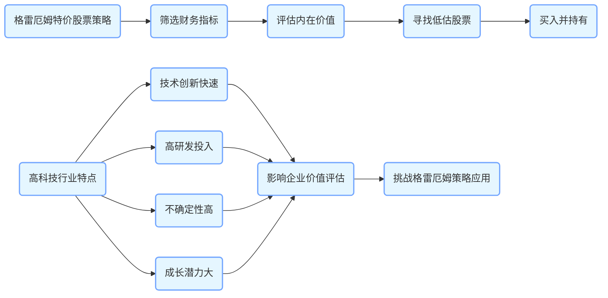

# 格雷厄姆特价股票策略在高科技行业的应用挑战

> 关键词：格雷厄姆特价股票策略、高科技行业、价值投资、应用挑战、财务指标

> 摘要：本文聚焦于格雷厄姆特价股票策略在高科技行业的应用挑战。首先介绍了格雷厄姆特价股票策略的背景和基本原理，以及高科技行业的特点。接着深入分析了该策略在高科技行业应用时面临的诸如企业估值困难、财务指标局限性、技术迭代快速等多方面挑战。通过数学模型和实际案例进一步阐述这些挑战的具体表现。同时探讨了该策略在高科技行业的实际应用场景，推荐了相关的学习资源、开发工具和研究论文。最后总结了未来的发展趋势与挑战，并对常见问题进行解答，为投资者和研究者在该领域的探索提供全面而深入的参考。

## 1. 背景介绍 
### 1.1 目的和范围
格雷厄姆特价股票策略作为价值投资的经典策略，在传统行业中取得了显著的成效。然而，随着科技的飞速发展，高科技行业逐渐成为经济增长的重要驱动力。本研究旨在探讨该策略在高科技行业应用时所面临的挑战，范围涵盖高科技行业的各个细分领域，包括但不限于信息技术、生物技术、新能源技术等。通过对这些领域的分析，揭示该策略在高科技行业应用的局限性和问题，为投资者和研究者提供有价值的参考。

### 1.2 预期读者
本文预期读者包括对价值投资和高科技行业感兴趣的投资者、金融分析师、研究人员以及相关领域的学者。对于投资者而言，了解该策略在高科技行业的应用挑战有助于他们更加谨慎地进行投资决策；金融分析师可以通过本文的研究为客户提供更准确的投资建议；研究人员和学者则可以在本文的基础上进一步深入研究相关领域的问题。

### 1.3 文档结构概述
本文首先介绍了格雷厄姆特价股票策略和高科技行业的背景信息，包括术语和相关概念的解释。接着阐述了该策略的核心概念以及与高科技行业的联系，并通过流程图进行展示。然后详细讲解了核心算法原理和具体操作步骤，同时给出数学模型和公式进行说明。通过项目实战案例，深入分析了该策略在高科技行业的实际应用情况。之后探讨了该策略在高科技行业的实际应用场景，并推荐了相关的工具和资源。最后总结了未来的发展趋势与挑战，对常见问题进行解答，并提供了扩展阅读和参考资料。

### 1.4 术语表
#### 1.4.1 核心术语定义
- **格雷厄姆特价股票策略**：由本杰明·格雷厄姆（Benjamin Graham）提出的一种价值投资策略，该策略通过寻找被市场低估的股票，以低于其内在价值的价格买入，等待股票价格回归其内在价值从而获取收益。
- **高科技行业**：指那些以高新技术为基础，从事一种或多种高新技术及其产品的研究、开发、生产和技术服务的企业集合。这些高新技术包括信息技术、生物技术、新能源技术、新材料技术等。
- **价值投资**：一种投资理念，强调通过对企业基本面的分析，评估企业的内在价值，并在股票价格低于其内在价值时买入，长期持有以获取收益。
- **内在价值**：企业在未来所能产生的现金流量的现值，是评估企业真实价值的重要指标。

#### 1.4.2 相关概念解释
- **财务指标**：用于衡量企业财务状况和经营业绩的一系列数据，如市盈率（P/E）、市净率（P/B）、净资产收益率（ROE）等。格雷厄姆特价股票策略通常会依据这些财务指标来筛选被低估的股票。
- **技术迭代**：指高科技行业中技术不断更新换代的过程，新技术的出现往往会使旧技术和产品迅速失去市场竞争力。
- **创新能力**：高科技企业在技术研发、产品创新等方面的能力，是决定企业未来发展潜力的重要因素。

#### 1.4.3 缩略词列表
- **P/E**：市盈率（Price-to-Earnings Ratio），指股票价格除以每股收益的比率，反映了市场对企业盈利的预期。
- **P/B**：市净率（Price-to-Book Ratio），指股票价格除以每股净资产的比率，反映了市场对企业净资产的估值。
- **ROE**：净资产收益率（Return on Equity），指净利润与平均股东权益的百分比，反映了企业运用自有资本的效率。

## 2. 核心概念与联系 
### 格雷厄姆特价股票策略原理
格雷厄姆特价股票策略的核心思想是寻找被市场低估的股票。其基本原理基于以下几点：
1. **安全边际原则**：投资者应该以低于股票内在价值的价格买入股票，以降低投资风险。安全边际越大，投资的风险越低。
2. **基本面分析**：通过对企业的财务报表、经营业绩、行业地位等基本面因素的分析，评估企业的内在价值。
3. **长期投资**：持有被低估的股票，等待市场发现其价值，从而实现股票价格的上涨。

### 高科技行业特点
高科技行业具有以下显著特点：
1. **技术创新快速**：高科技行业的技术更新换代速度极快，新产品和新技术不断涌现。例如，智能手机行业每隔几年就会推出具有重大技术突破的新产品。
2. **高研发投入**：为了保持技术领先地位，高科技企业需要投入大量的资金进行研发。研发投入占销售收入的比例通常较高。
3. **不确定性高**：由于技术创新的不确定性，高科技企业的未来发展存在较大的风险。一项新技术的研发可能成功，也可能失败，这会对企业的业绩产生重大影响。
4. **成长潜力大**：一旦高科技企业的技术创新取得成功，其产品和服务可能会迅速占领市场，实现高速增长。

### 核心概念联系的文本示意图
格雷厄姆特价股票策略主要关注企业的财务指标和内在价值，试图寻找被市场低估的股票。而高科技行业的特点决定了其企业的价值不仅仅取决于财务指标，还受到技术创新、研发能力等因素的影响。因此，在高科技行业应用格雷厄姆特价股票策略时，需要考虑这些因素的影响，以更准确地评估企业的价值。

### Mermaid 流程图


## 3. 核心算法原理 & 具体操作步骤 
### 核心算法原理
格雷厄姆特价股票策略的核心算法是通过计算股票的内在价值，并与市场价格进行比较，以判断股票是否被低估。常见的计算内在价值的方法包括股息贴现模型（Dividend Discount Model，DDM）和自由现金流贴现模型（Discounted Cash Flow Model，DCF）。

#### 股息贴现模型（DDM）
股息贴现模型假设股票的价值等于其未来股息的现值之和。其基本公式为：
$$V = \frac{D_1}{(1 + r)^1} + \frac{D_2}{(1 + r)^2} + \cdots + \frac{D_n}{(1 + r)^n}$$
其中，$V$ 表示股票的内在价值，$D_i$ 表示第 $i$ 期的股息，$r$ 表示贴现率。

#### 自由现金流贴现模型（DCF）
自由现金流贴现模型假设股票的价值等于其未来自由现金流的现值之和。其基本公式为：
$$V = \frac{FCF_1}{(1 + r)^1} + \frac{FCF_2}{(1 + r)^2} + \cdots + \frac{FCF_n}{(1 + r)^n}$$
其中，$V$ 表示股票的内在价值，$FCF_i$ 表示第 $i$ 期的自由现金流，$r$ 表示贴现率。

### 具体操作步骤
#### 步骤 1：筛选财务指标
使用格雷厄姆提出的一些财务指标来筛选股票，例如：
- **低市盈率（P/E）**：一般认为，市盈率低于行业平均水平的股票可能被低估。
- **低市净率（P/B）**：市净率低于 1 的股票通常被认为具有较高的安全边际。
- **高股息率**：股息率较高的股票可能更具投资价值。

#### 步骤 2：评估内在价值
选择合适的内在价值计算模型（如 DDM 或 DCF），根据企业的财务数据和未来发展预测，计算股票的内在价值。

#### 步骤 3：比较内在价值和市场价格
将计算得到的内在价值与股票的市场价格进行比较，如果市场价格低于内在价值，则认为该股票被低估。

#### 步骤 4：买入并持有
在确定股票被低估后，买入该股票并长期持有，等待市场发现其价值，实现股票价格的上涨。

### Python 源代码实现
```python
import pandas as pd

# 示例数据：假设我们有一个包含股票财务信息的 DataFrame
data = {
    '股票代码': ['A001', 'A002', 'A003'],
    '市盈率（P/E）': [10, 15, 20],
    '市净率（P/B）': [0.8, 1.2, 1.5],
    '股息率': [0.05, 0.03, 0.02]
}
df = pd.DataFrame(data)

# 步骤 1：筛选财务指标
# 筛选低市盈率（P/E < 15）、低市净率（P/B < 1）和高股息率（股息率 > 0.03）的股票
filtered_df = df[(df['市盈率（P/E）'] < 15) & (df['市净率（P/B）'] < 1) & (df['股息率'] > 0.03)]

print("筛选后的股票：")
print(filtered_df)
```

## 4. 数学模型和公式 & 详细讲解 & 举例说明 
### 股息贴现模型（DDM）详细讲解
股息贴现模型基于股票的股息分配来评估其价值。其基本思想是，股票的价值等于其未来所有股息的现值之和。

#### 公式推导
假设股票每年的股息增长率为 $g$，第 1 期的股息为 $D_1$，贴现率为 $r$。则第 $i$ 期的股息为 $D_i = D_1(1 + g)^{i - 1}$。

股票的内在价值 $V$ 可以表示为：
$$V = \frac{D_1}{(1 + r)^1} + \frac{D_1(1 + g)^1}{(1 + r)^2} + \frac{D_1(1 + g)^2}{(1 + r)^3} + \cdots$$

当 $r > g$ 时，上式可以简化为：
$$V = \frac{D_1}{r - g}$$

#### 举例说明
假设某股票第 1 期的股息为 $D_1 = 2$ 元，股息增长率 $g = 0.05$，贴现率 $r = 0.1$。则该股票的内在价值为：
$$V = \frac{2}{0.1 - 0.05} = 40$$（元）

### 自由现金流贴现模型（DCF）详细讲解
自由现金流贴现模型基于企业的自由现金流来评估其价值。自由现金流是指企业在满足所有运营和投资需求后剩余的现金流量。

#### 公式推导
假设企业第 $i$ 期的自由现金流为 $FCF_i$，贴现率为 $r$。则企业的内在价值 $V$ 可以表示为：
$$V = \frac{FCF_1}{(1 + r)^1} + \frac{FCF_2}{(1 + r)^2} + \cdots + \frac{FCF_n}{(1 + r)^n}$$

在实际应用中，通常会将企业的未来分为两个阶段：预测期和永续期。预测期内的自由现金流可以根据企业的财务数据和未来发展预测进行估计，永续期的自由现金流通常假设以一个固定的增长率 $g$ 增长。

#### 举例说明
假设某企业预测期为 5 年，各年的自由现金流分别为 $FCF_1 = 100$ 万元，$FCF_2 = 120$ 万元，$FCF_3 = 140$ 万元，$FCF_4 = 160$ 万元，$FCF_5 = 180$ 万元。永续期的自由现金流增长率 $g = 0.03$，贴现率 $r = 0.1$。

首先，计算预测期内自由现金流的现值：
$$PV_1 = \frac{100}{(1 + 0.1)^1} + \frac{120}{(1 + 0.1)^2} + \frac{140}{(1 + 0.1)^3} + \frac{160}{(1 + 0.1)^4} + \frac{180}{(1 + 0.1)^5} \approx 523.6$$（万元）

然后，计算永续期自由现金流的现值：
$$V_5 = \frac{FCF_5(1 + g)}{r - g} = \frac{180(1 + 0.03)}{0.1 - 0.03} \approx 2631.4$$（万元）

$$PV_2 = \frac{V_5}{(1 + 0.1)^5} \approx 1637.7$$（万元）

最后，计算企业的内在价值：
$$V = PV_1 + PV_2 \approx 523.6 + 1637.7 = 2161.3$$（万元）

## 5. 项目实战：代码实际案例和详细解释说明 
### 5.1  开发环境搭建
#### 安装 Python
首先，需要安装 Python 编程语言。可以从 Python 官方网站（https://www.python.org/downloads/）下载适合自己操作系统的 Python 安装包，并按照安装向导进行安装。

#### 安装必要的库
在本项目中，需要使用 `pandas` 库来处理数据，使用 `yfinance` 库来获取股票数据。可以使用以下命令来安装这些库：
```sh
pip install pandas yfinance
```

### 5.2  源代码详细实现和代码解读
```python
import pandas as pd
import yfinance as yf

# 步骤 1：获取股票数据
# 定义股票代码列表
tickers = ['AAPL', 'GOOG', 'MSFT']

# 创建一个空的 DataFrame 来存储股票数据
data = pd.DataFrame()

# 循环获取每只股票的数据
for ticker in tickers:
    stock = yf.Ticker(ticker)
    info = stock.info
    # 获取市盈率（P/E）、市净率（P/B）和股息率
    pe_ratio = info.get('trailingPE', None)
    pb_ratio = info.get('priceToBook', None)
    dividend_yield = info.get('dividendYield', None)
    
    # 将数据添加到 DataFrame 中
    data = data.append({
        '股票代码': ticker,
        '市盈率（P/E）': pe_ratio,
        '市净率（P/B）': pb_ratio,
        '股息率': dividend_yield
    }, ignore_index=True)

# 步骤 2：筛选财务指标
# 筛选低市盈率（P/E < 20）、低市净率（P/B < 2）和高股息率（股息率 > 0.02）的股票
filtered_data = data[(data['市盈率（P/E）'] < 20) & (data['市净率（P/B）'] < 2) & (data['股息率'] > 0.02)]

print("筛选后的股票：")
print(filtered_data)
```

### 5.3  代码解读与分析
#### 代码功能概述
这段代码的主要功能是获取指定股票的财务数据（市盈率、市净率和股息率），并根据这些财务指标筛选出符合条件的股票。

#### 代码详细解读
1. **导入必要的库**：导入 `pandas` 库用于数据处理，导入 `yfinance` 库用于获取股票数据。
2. **定义股票代码列表**：定义一个包含股票代码的列表 `tickers`，表示要获取数据的股票。
3. **创建空的 DataFrame**：创建一个空的 `pandas` DataFrame `data`，用于存储股票数据。
4. **循环获取股票数据**：使用 `for` 循环遍历股票代码列表，对于每只股票，使用 `yfinance` 库的 `Ticker` 类获取其信息，并提取市盈率、市净率和股息率。
5. **将数据添加到 DataFrame 中**：将每只股票的信息添加到 `data` DataFrame 中。
6. **筛选财务指标**：使用条件语句筛选出低市盈率、低市净率和高股息率的股票，并将结果存储在 `filtered_data` DataFrame 中。
7. **输出筛选结果**：打印筛选后的股票信息。

#### 分析
通过这个代码示例，我们可以看到如何使用 Python 和相关库来实现格雷厄姆特价股票策略的基本筛选步骤。然而，在实际应用中，还需要考虑更多的因素，如数据的准确性、企业的未来发展前景等。

## 6. 实际应用场景 
### 价值投资组合构建
投资者可以使用格雷厄姆特价股票策略在高科技行业中筛选出被低估的股票，将这些股票纳入自己的价值投资组合中。通过分散投资，可以降低投资风险，同时期待这些被低估的股票在未来实现价值回归，从而获得投资收益。

### 长期投资决策
对于长期投资者来说，格雷厄姆特价股票策略可以作为一种参考，帮助他们在高科技行业中寻找具有投资价值的股票。通过对企业基本面的分析和内在价值的评估，投资者可以做出更明智的长期投资决策。

### 风险控制
在高科技行业中，由于技术创新的不确定性和市场波动较大，投资风险相对较高。格雷厄姆特价股票策略强调安全边际原则，通过寻找被低估的股票，可以在一定程度上降低投资风险。

### 投资研究参考
金融分析师和研究人员可以使用格雷厄姆特价股票策略对高科技行业的股票进行研究和分析。通过比较不同股票的财务指标和内在价值，可以发现行业中的投资机会和风险，为投资者提供有价值的研究报告和投资建议。

## 7. 工具和资源推荐
### 7.1 学习资源推荐
#### 7.1.1 书籍推荐
- 《聪明的投资者》（The Intelligent Investor）：本杰明·格雷厄姆的经典著作，详细阐述了价值投资的理念和方法，是学习格雷厄姆特价股票策略的必读之书。
- 《证券分析》（Security Analysis）：同样是本杰明·格雷厄姆的著作，对证券分析的理论和实践进行了系统的介绍，为投资者提供了深入了解企业基本面和估值的方法。
- 《巴菲特致股东的信：股份公司教程》（Letters to Shareholders of Berkshire Hathaway）：沃伦·巴菲特（Warren Buffett）作为格雷厄姆的学生，在这本书中分享了他的投资理念和经验，对理解和应用格雷厄姆特价股票策略具有重要的参考价值。

#### 7.1.2 在线课程
- Coursera 平台上的“投资学原理”（Principles of Investing）课程：该课程由知名教授授课，系统地介绍了投资学的基本原理和方法，包括价值投资的相关内容。
- edX 平台上的“金融市场”（Financial Markets）课程：该课程深入探讨了金融市场的运作机制和投资策略，对理解格雷厄姆特价股票策略在金融市场中的应用具有帮助。

#### 7.1.3 技术博客和网站
- Seeking Alpha（https://seekingalpha.com/）：一个专业的金融投资网站，提供了大量的股票分析和投资研究报告，其中不乏关于价值投资和格雷厄姆特价股票策略的内容。
- ValueWalk（https://www.valuewalk.com/）：专注于价值投资领域的博客，分享了许多价值投资者的观点和经验，对学习和应用格雷厄姆特价股票策略具有参考价值。

### 7.2 开发工具框架推荐
#### 7.2.1 IDE和编辑器
- PyCharm：一款专业的 Python 集成开发环境（IDE），具有强大的代码编辑、调试和项目管理功能，适合开发与格雷厄姆特价股票策略相关的 Python 程序。
- Jupyter Notebook：一个交互式的开发环境，支持 Python 等多种编程语言，方便进行数据分析和可视化，对于研究和实现格雷厄姆特价股票策略的算法非常有用。

#### 7.2.2 调试和性能分析工具
- PDB：Python 自带的调试器，可以帮助开发者在代码执行过程中进行调试，查找和解决问题。
- cProfile：Python 标准库中的性能分析工具，可以帮助开发者分析代码的性能瓶颈，优化代码性能。

#### 7.2.3 相关框架和库
- Pandas：一个强大的数据分析库，提供了高效的数据结构和数据处理方法，适合处理和分析股票财务数据。
- NumPy：一个用于科学计算的 Python 库，提供了高效的数组操作和数学函数，在计算股票的内在价值等数学模型时非常有用。
- yfinance：一个用于获取股票数据的 Python 库，可以方便地获取股票的财务信息和市场数据。

### 7.3 相关论文著作推荐
#### 7.3.1 经典论文
- Graham, B., & Dodd, D. L. (1934). Security Analysis. This classic paper laid the foundation for value investing and introduced the concept of intrinsic value and margin of safety.
- Fama, E. F., & French, K. R. (1992). The Cross-Section of Expected Stock Returns. This paper proposed the Fama-French three-factor model, which has important implications for understanding the factors that affect stock returns and the application of value investment strategies.

#### 7.3.2 最新研究成果
- Asness, C. S., Frazzini, A., & Pedersen, L. H. (2019). Quality Minus Junk. This research explores the concept of quality stocks and their performance in the market, providing new perspectives for value investment strategies.
- Harvey, C. R., Liu, Y., & Zhu, H. (2016). … and the Cross-Section of Expected Returns. This paper discusses the issue of data mining and false discoveries in financial research, reminding researchers to be cautious when applying investment strategies.

#### 7.3.3 应用案例分析
- Piotroski, J. D. (2000). Value Investing: The Use of Historical Financial Statement Information to Separate Winners from Losers. This paper presents a practical application of value investment strategies using financial statement information to select stocks, providing practical examples for investors.

## 8. 总结：未来发展趋势与挑战
### 未来发展趋势
#### 结合大数据和人工智能
随着大数据和人工智能技术的发展，未来格雷厄姆特价股票策略可能会与这些技术相结合。通过分析海量的金融数据和企业信息，利用人工智能算法可以更准确地评估企业的内在价值，筛选出被低估的股票。

#### 关注创新指标
在高科技行业中，创新能力是企业发展的关键因素。未来的格雷厄姆特价股票策略可能会更加关注企业的创新指标，如研发投入、专利数量、技术团队实力等，以更全面地评估企业的价值。

#### 全球化投资
随着全球经济的一体化，投资者的投资范围也越来越广泛。未来，格雷厄姆特价股票策略可能会应用于全球高科技行业的股票投资，投资者可以在全球范围内寻找被低估的高科技股票。

### 挑战
#### 技术变革快速
高科技行业的技术变革速度极快，新技术的出现可能会使企业的价值在短时间内发生巨大变化。这给格雷厄姆特价股票策略的应用带来了挑战，因为传统的财务指标和估值方法可能无法及时反映技术变革对企业价值的影响。

#### 估值困难
高科技企业的价值往往不仅仅取决于财务指标，还受到技术创新、市场前景、管理团队等多种因素的影响。这些因素的不确定性使得对高科技企业的估值变得困难，增加了应用格雷厄姆特价股票策略的难度。

#### 市场情绪影响
股票市场的价格不仅受到企业基本面的影响，还受到市场情绪的影响。在高科技行业中，市场情绪的波动可能更为剧烈，这可能导致股票价格偏离其内在价值，给格雷厄姆特价股票策略的应用带来干扰。

## 9. 附录：常见问题与解答
### 问题 1：格雷厄姆特价股票策略在高科技行业是否完全不适用？
解答：不是的。虽然格雷厄姆特价股票策略在高科技行业应用时面临一些挑战，但并不是完全不适用。该策略的核心思想，如安全边际原则和基本面分析，仍然具有一定的参考价值。投资者可以在应用该策略时，结合高科技行业的特点，对传统的方法进行适当的调整和改进。

### 问题 2：如何解决高科技企业估值困难的问题？
解答：可以采用多种方法相结合的方式来解决高科技企业估值困难的问题。例如，除了使用传统的财务指标和估值模型外，还可以考虑企业的创新能力、技术前景、市场份额等因素。同时，可以参考同行业其他企业的估值情况，进行比较和分析。

### 问题 3：如何应对市场情绪对股票价格的影响？
解答：投资者可以保持理性和冷静，不受市场情绪的过度影响。在进行投资决策时，要基于对企业基本面的深入分析和对内在价值的准确评估。同时，可以采用分散投资的方法，降低个别股票价格波动对投资组合的影响。

### 问题 4：格雷厄姆特价股票策略需要多长时间才能看到效果？
解答：格雷厄姆特价股票策略是一种长期投资策略，其效果通常需要较长时间才能显现。由于股票价格的回归需要一定的时间，投资者需要有足够的耐心，长期持有被低估的股票，等待市场发现其价值。

## 10. 扩展阅读 & 参考资料
### 扩展阅读
- 林奇，P.（1990）。《战胜华尔街》（One Up on Wall Street）。该书介绍了彼得·林奇（Peter Lynch）的投资理念和选股方法，对投资者在高科技行业的投资具有一定的启发。
- 芒格，C. T.（2005）。《穷查理宝典：查理·芒格智慧箴言录》（Poor Charlie's Almanack: The Wit and Wisdom of Charles T. Munger）。查理·芒格（Charlie Munger）作为巴菲特的合作伙伴，在这本书中分享了他的投资哲学和人生智慧，对理解价值投资的本质具有重要意义。

### 参考资料
- Graham, B. (1949). The Intelligent Investor. HarperBusiness.
- Fama, E. F., & French, K. R. (1993). Common risk factors in the returns on stocks and bonds. Journal of Financial Economics, 33(1), 3-56.
- Asness, C. S., Moskowitz, T. J., & Pedersen, L. H. (2013). Value and momentum everywhere. Journal of Finance, 68(3), 929-985.
- Yahoo Finance (https://finance.yahoo.com/). A comprehensive financial website that provides a wealth of stock data and financial information.
- Bloomberg (https://www.bloomberg.com/). A leading global financial news and data provider, offering in - depth market analysis and financial insights.

作者：AI天才研究院/AI Genius Institute & 禅与计算机程序设计艺术 /Zen And The Art of Computer Programming