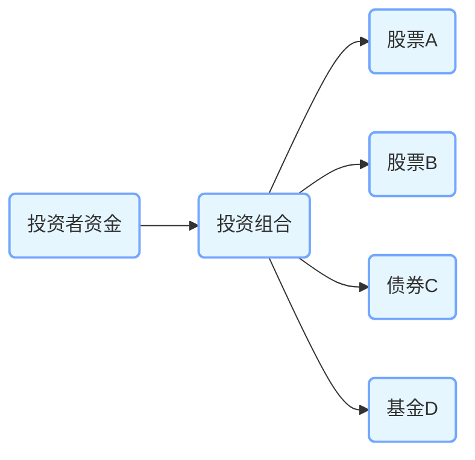

# 格雷厄姆的Group Approach：分散投资的智慧

> 关键词：格雷厄姆、Group Approach、分散投资、投资策略、风险控制

> 摘要：本文深入探讨了格雷厄姆的Group Approach，即分散投资策略。首先介绍了该策略的背景，包括其目的、预期读者、文档结构和相关术语。接着阐述了核心概念与联系，通过文本示意图和Mermaid流程图进行清晰展示。详细讲解了核心算法原理，并用Python代码进行具体说明，同时给出了数学模型和公式，并举例分析。通过项目实战，展示了该策略在实际中的应用，包括开发环境搭建、源代码实现和代码解读。还探讨了其实际应用场景，推荐了相关的学习资源、开发工具框架和论文著作。最后总结了该策略的未来发展趋势与挑战，并提供了常见问题解答和扩展阅读参考资料。

## 1. 背景介绍 
### 1.1 目的和范围
格雷厄姆作为投资领域的传奇人物，其提出的Group Approach分散投资策略具有重要的理论和实践价值。本文的目的在于全面深入地剖析这一策略，让读者清晰地理解其原理、操作方法以及在实际投资中的应用。范围涵盖了从基本概念的讲解到具体算法的实现，再到实际案例的分析，以及对未来发展趋势的探讨。通过对该策略的研究，投资者可以更好地运用分散投资来降低风险、提高收益。

### 1.2 预期读者
本文预期读者包括对投资领域感兴趣的初学者，他们可以通过本文了解分散投资的基本原理和操作方法，为进一步深入学习投资知识打下基础；也适合有一定投资经验的专业人士，他们可以从本文中获取关于格雷厄姆Group Approach的更深入分析和新的见解，以便优化自己的投资策略；同时，对于金融研究人员来说，本文提供了一个系统的研究案例，有助于他们进行相关的学术研究。

### 1.3 文档结构概述
本文首先对格雷厄姆的Group Approach进行背景介绍，让读者了解该策略的基本情况和阅读本文的预期收获。接着阐述核心概念与联系，通过示意图和流程图帮助读者直观理解。然后详细讲解核心算法原理和具体操作步骤，并用Python代码实现。之后给出数学模型和公式，通过举例加深读者对策略的理解。在项目实战部分，展示如何在实际中应用该策略，包括开发环境搭建、代码实现和解读。再探讨该策略的实际应用场景，为读者提供实际操作的参考。推荐相关的学习资源、开发工具框架和论文著作，方便读者进一步学习和研究。最后总结未来发展趋势与挑战，提供常见问题解答和扩展阅读参考资料。

### 1.4 术语表
#### 1.4.1 核心术语定义
- **格雷厄姆的Group Approach**：是由本杰明·格雷厄姆提出的一种分散投资策略，通过将资金分散投资于多个不同的资产或投资组合，以降低单一资产波动对整体投资组合的影响，从而实现风险控制和收益稳定。
- **分散投资**：指将资金分配到不同类型、不同行业、不同市场的资产上，避免过度集中投资于某一特定资产，以降低投资风险。
- **投资组合**：是由多种资产组成的集合，投资者通过合理配置不同资产的比例，来实现特定的投资目标。

#### 1.4.2 相关概念解释
- **风险分散原理**：根据现代投资组合理论，不同资产之间的收益和风险具有一定的相关性。通过选择相关性较低的资产进行组合投资，可以在不降低预期收益的情况下，降低投资组合的整体风险。例如，股票和债券在市场表现上往往具有不同的特征，当股票市场下跌时，债券市场可能相对稳定，将股票和债券纳入同一投资组合可以起到风险对冲的作用。
- **有效前沿**：在投资组合理论中，有效前沿是指在给定风险水平下能够提供最高预期收益的投资组合的集合，或者在给定预期收益水平下具有最低风险的投资组合的集合。投资者的目标是在有效前沿上选择适合自己风险偏好的投资组合。

#### 1.4.3 缩略词列表
- **CAPM**：Capital Asset Pricing Model，资本资产定价模型，用于描述资产预期收益率与市场风险之间的关系。
- **ETF**：Exchange-Traded Fund，交易型开放式指数基金，是一种在交易所上市交易的、基金份额可变的开放式基金。

## 2. 核心概念与联系 

格雷厄姆的Group Approach核心在于通过分散投资来降低风险。其基本原理是将资金分散到多个不同的投资标的上，这些投资标的可以是不同行业的股票、不同类型的债券、不同地区的资产等。通过这种方式，当某一个投资标的出现不利情况时，其他投资标的的表现可能会弥补损失，从而使整个投资组合的风险得到控制。

下面是核心概念原理和架构的文本示意图：

投资者将资金投入到一个投资组合中，该投资组合包含多个不同的投资标的，如股票A、股票B、债券C、基金D等。每个投资标的具有不同的风险和收益特征，它们之间的相关性也各不相同。投资者通过合理配置各个投资标的的比例，来实现投资组合的风险分散和收益优化。

Mermaid流程图如下：


在这个流程图中，投资者的资金首先汇聚到投资组合中，然后投资组合将资金分配到不同的投资标的上。这种分散投资的方式可以降低单一投资标的对整个投资组合的影响，从而实现风险控制。

## 3. 核心算法原理 & 具体操作步骤 

### 核心算法原理
格雷厄姆的Group Approach的核心算法原理基于风险分散和收益优化的思想。其目标是通过合理配置投资组合中各个资产的比例，使得在给定的风险水平下，投资组合的预期收益最大化；或者在给定的预期收益水平下，投资组合的风险最小化。

为了实现这个目标，我们可以使用现代投资组合理论中的均值 - 方差模型。该模型通过计算投资组合的预期收益率和方差（风险的度量），来确定最优的资产配置比例。

假设我们有 $n$ 种资产，第 $i$ 种资产的预期收益率为 $\mu_i$，资产之间的协方差矩阵为 $\Sigma$，投资组合中第 $i$ 种资产的权重为 $w_i$，且 $\sum_{i=1}^{n} w_i = 1$。

投资组合的预期收益率 $\mu_p$ 可以表示为：
$$\mu_p = \sum_{i=1}^{n} w_i \mu_i$$

投资组合的方差 $\sigma_p^2$ 可以表示为：
$$\sigma_p^2 = \mathbf{w}^T \Sigma \mathbf{w}$$
其中，$\mathbf{w} = [w_1, w_2, \cdots, w_n]^T$ 是资产权重向量。

### 具体操作步骤
1. **确定投资标的**：选择不同类型、不同行业、不同市场的资产作为投资标的，如股票、债券、基金等。
2. **估计资产的预期收益率和协方差矩阵**：可以通过历史数据或者专业的金融分析工具来估计每个资产的预期收益率和资产之间的协方差矩阵。
3. **设定投资目标**：根据自己的风险偏好和投资目标，设定投资组合的预期收益率或者风险水平。
4. **求解最优资产配置比例**：使用优化算法，如二次规划算法，在满足投资组合权重之和为 1 的约束条件下，求解使得投资组合在给定目标下最优的资产配置比例。

### Python源代码实现
```python
import numpy as np
from scipy.optimize import minimize

# 示例数据：假设我们有3种资产
# 预期收益率
expected_returns = np.array([0.1, 0.15, 0.08])
# 协方差矩阵
cov_matrix = np.array([[0.04, 0.02, 0.01],
                       [0.02, 0.09, 0.03],
                       [0.01, 0.03, 0.02]])

# 目标函数：最小化投资组合的方差
def portfolio_variance(weights, cov_matrix):
    return np.dot(weights.T, np.dot(cov_matrix, weights))

# 约束条件：权重之和为1
constraints = ({'type': 'eq', 'fun': lambda x: np.sum(x) - 1})
# 权重范围：每个资产的权重在0到1之间
bounds = [(0, 1) for _ in range(len(expected_returns))]

# 初始权重猜测
initial_weights = np.ones(len(expected_returns)) / len(expected_returns)

# 求解最优权重
result = minimize(portfolio_variance, initial_weights, args=(cov_matrix,),
                  method='SLSQP', bounds=bounds, constraints=constraints)

optimal_weights = result.x
print("最优资产配置比例:", optimal_weights)
```
在这段代码中，我们首先定义了3种资产的预期收益率和协方差矩阵。然后定义了目标函数 `portfolio_variance`，用于计算投资组合的方差。接着设置了约束条件和权重范围，并使用 `scipy.optimize.minimize` 函数求解最优资产配置比例。最后输出最优权重。

## 4. 数学模型和公式 & 详细讲解 & 举例说明 

### 数学模型和公式
如前文所述，投资组合的预期收益率 $\mu_p$ 和方差 $\sigma_p^2$ 的计算公式分别为：
$$\mu_p = \sum_{i=1}^{n} w_i \mu_i$$
$$\sigma_p^2 = \mathbf{w}^T \Sigma \mathbf{w}$$

### 详细讲解
- **预期收益率公式**：该公式表示投资组合的预期收益率是各个资产预期收益率的加权平均值，权重为各个资产在投资组合中的比例。例如，如果投资组合中有两种资产，资产A的预期收益率为 10%，权重为 0.6；资产B的预期收益率为 15%，权重为 0.4。那么投资组合的预期收益率为：
$$\mu_p = 0.6 \times 0.1 + 0.4 \times 0.15 = 0.12 = 12\%$$
- **方差公式**：方差是衡量投资组合风险的指标。协方差矩阵 $\Sigma$ 描述了各个资产之间的相关性。通过计算 $\mathbf{w}^T \Sigma \mathbf{w}$，可以得到投资组合的方差。当资产之间的相关性较低时，投资组合的方差会相对较小，从而实现风险分散的目的。

### 举例说明
假设我们有两种资产，股票和债券。股票的预期收益率为 15%，标准差为 20%；债券的预期收益率为 8%，标准差为 10%。股票和债券之间的相关系数为 0.2。

首先，计算协方差矩阵：
协方差 $\text{Cov}(S, B) = \rho_{S,B} \times \sigma_S \times \sigma_B = 0.2 \times 0.2 \times 0.1 = 0.004$
协方差矩阵为：
$$\Sigma = \begin{bmatrix}
0.2^2 & 0.004 \\
0.004 & 0.1^2
\end{bmatrix} = \begin{bmatrix}
0.04 & 0.004 \\
0.004 & 0.01
\end{bmatrix}$$

假设我们将 60% 的资金投资于股票，40% 的资金投资于债券。则投资组合的预期收益率为：
$$\mu_p = 0.6 \times 0.15 + 0.4 \times 0.08 = 0.122 = 12.2\%$$

投资组合的方差为：
$$\mathbf{w} = \begin{bmatrix}
0.6 \\
0.4
\end{bmatrix}$$
$$\sigma_p^2 = \mathbf{w}^T \Sigma \mathbf{w} = \begin{bmatrix}
0.6 & 0.4
\end{bmatrix} \begin{bmatrix}
0.04 & 0.004 \\
0.004 & 0.01
\end{bmatrix} \begin{bmatrix}
0.6 \\
0.4
\end{bmatrix}$$
$$= 0.6^2 \times 0.04 + 2 \times 0.6 \times 0.4 \times 0.004 + 0.4^2 \times 0.01 = 0.01696$$
投资组合的标准差为：
$$\sigma_p = \sqrt{0.01696} \approx 0.13 = 13\%$$

通过这个例子可以看出，通过合理配置股票和债券的比例，我们可以在一定程度上降低投资组合的风险，同时获得较为稳定的预期收益。

## 5. 项目实战：代码实际案例和详细解释说明 

### 5.1  开发环境搭建
为了实现格雷厄姆的Group Approach的项目实战，我们需要搭建一个合适的开发环境。以下是具体步骤：

#### 安装Python
首先，确保你已经安装了Python。可以从Python官方网站（https://www.python.org/downloads/）下载适合你操作系统的Python版本。建议安装Python 3.7及以上版本。

#### 安装必要的库
我们需要安装一些Python库来完成项目，主要包括 `numpy`、`pandas`、`scipy` 等。可以使用以下命令进行安装：
```sh
pip install numpy pandas scipy
```

### 5.2  源代码详细实现和代码解读
```python
import numpy as np
import pandas as pd
from scipy.optimize import minimize

# 假设我们有历史数据，这里简单生成一些示例数据
np.random.seed(0)
num_assets = 4
num_periods = 100
returns = pd.DataFrame(np.random.randn(num_periods, num_assets) * 0.01)

# 计算预期收益率和协方差矩阵
expected_returns = returns.mean()
cov_matrix = returns.cov()

# 目标函数：最小化投资组合的方差
def portfolio_variance(weights, cov_matrix):
    return np.dot(weights.T, np.dot(cov_matrix, weights))

# 约束条件：权重之和为1
constraints = ({'type': 'eq', 'fun': lambda x: np.sum(x) - 1})
# 权重范围：每个资产的权重在0到1之间
bounds = [(0, 1) for _ in range(num_assets)]

# 初始权重猜测
initial_weights = np.ones(num_assets) / num_assets

# 求解最优权重
result = minimize(portfolio_variance, initial_weights, args=(cov_matrix,),
                  method='SLSQP', bounds=bounds, constraints=constraints)

optimal_weights = result.x
print("最优资产配置比例:", optimal_weights)

# 计算最优投资组合的预期收益率和标准差
optimal_portfolio_return = np.dot(optimal_weights, expected_returns)
optimal_portfolio_std = np.sqrt(portfolio_variance(optimal_weights, cov_matrix))
print("最优投资组合的预期收益率:", optimal_portfolio_return)
print("最优投资组合的标准差:", optimal_portfolio_std)
```

### 代码解读与分析
1. **数据生成**：使用 `numpy` 生成了一些示例的历史收益率数据。在实际应用中，你可以从金融数据库或者API获取真实的历史数据。
2. **计算预期收益率和协方差矩阵**：使用 `pandas` 的 `mean()` 和 `cov()` 方法计算每个资产的预期收益率和资产之间的协方差矩阵。
3. **定义目标函数**：定义了 `portfolio_variance` 函数，用于计算投资组合的方差。我们的目标是最小化这个方差。
4. **设置约束条件和权重范围**：约束条件要求投资组合的权重之和为 1，权重范围要求每个资产的权重在 0 到 1 之间。
5. **求解最优权重**：使用 `scipy.optimize.minimize` 函数求解最优资产配置比例。这里使用了 `SLSQP` 方法进行优化。
6. **计算最优投资组合的指标**：根据求解得到的最优权重，计算最优投资组合的预期收益率和标准差，并输出结果。

通过这个项目实战，我们可以看到如何使用Python实现格雷厄姆的Group Approach，通过合理配置资产权重来降低投资组合的风险。

## 6. 实际应用场景 
### 个人投资
对于个人投资者来说，格雷厄姆的Group Approach可以帮助他们构建一个合理的投资组合。个人投资者可以将资金分散投资于不同行业的股票、债券、基金等资产。例如，一个投资者可以将一部分资金投资于科技股，以获取较高的潜在收益；同时，将另一部分资金投资于债券，以提供稳定的现金流和降低风险。通过分散投资，个人投资者可以在一定程度上抵御市场波动的影响，实现资产的稳健增长。

### 机构投资
机构投资者，如基金公司、保险公司等，通常管理着大量的资金。格雷厄姆的Group Approach对于他们来说尤为重要。基金公司可以通过构建多元化的投资组合，满足不同投资者的风险偏好和收益要求。例如，一只混合型基金可以同时投资于股票、债券和现金等资产，通过合理配置资产比例，实现风险和收益的平衡。保险公司在进行资产配置时，也可以采用分散投资的策略，将资金分散到不同的投资领域，以确保资产的安全性和稳定性。

### 跨国投资
在全球化的背景下，跨国投资越来越受到关注。格雷厄姆的Group Approach可以帮助投资者在不同国家和地区进行分散投资。不同国家和地区的经济发展状况、政治环境和市场走势各不相同。通过将资金分散投资于多个国家和地区的资产，投资者可以降低单一国家或地区市场波动对投资组合的影响。例如，一个投资者可以同时投资于美国、欧洲和亚洲的股票市场，以及不同国家的债券市场，以实现更广泛的风险分散。

## 7. 工具和资源推荐
### 7.1 学习资源推荐
#### 7.1.1 书籍推荐
- 《聪明的投资者》（The Intelligent Investor）：本杰明·格雷厄姆的经典著作，详细阐述了价值投资和分散投资的理念和方法，是投资者必读的书籍之一。
- 《漫步华尔街》（A Random Walk Down Wall Street）：作者伯顿·马尔基尔通过大量的实证研究，介绍了各种投资策略和市场理论，对分散投资的重要性进行了深入探讨。
- 《投资组合理论与资本市场》（Portfolio Theory and Capital Markets）：威廉·夏普的经典著作，系统地介绍了现代投资组合理论和资本资产定价模型，为分散投资提供了理论基础。

#### 7.1.2 在线课程
- Coursera上的“投资学原理”（Principles of Investing）：由知名教授授课，涵盖了投资组合理论、资产定价等内容，帮助学习者深入理解分散投资的原理和方法。
- edX上的“金融市场”（Financial Markets）：耶鲁大学教授罗伯特·席勒的课程，讲解了金融市场的运行机制和投资策略，对分散投资有精彩的分析。

#### 7.1.3 技术博客和网站
- Seeking Alpha：提供专业的金融分析和投资建议，有很多关于分散投资的文章和研究报告。
- Investopedia：一个专业的金融知识学习网站，包含了丰富的投资术语解释、投资策略分析等内容，对理解格雷厄姆的Group Approach有很大帮助。

### 7.2 开发工具框架推荐
#### 7.2.1 IDE和编辑器
- PyCharm：一款功能强大的Python集成开发环境，提供了代码编辑、调试、版本控制等功能，适合开发与投资分析相关的Python程序。
- Jupyter Notebook：一种交互式的开发环境，支持Python代码的编写和运行，同时可以方便地展示数据分析结果和可视化图表，非常适合进行投资数据的分析和建模。

#### 7.2.2 调试和性能分析工具
- pdb：Python自带的调试工具，可以帮助开发者在代码运行过程中进行调试，查找问题所在。
- cProfile：Python的性能分析工具，可以分析代码的运行时间和函数调用情况，帮助开发者优化代码性能。

#### 7.2.3 相关框架和库
- numpy：一个用于科学计算的Python库，提供了高效的数组操作和数学函数，在投资组合计算中经常使用。
- pandas：一个用于数据处理和分析的Python库，提供了强大的数据结构和数据处理功能，方便处理和分析投资数据。
- scipy：一个用于科学计算和优化的Python库，提供了各种优化算法，可用于求解投资组合的最优资产配置比例。

### 7.3 相关论文著作推荐
#### 7.3.1 经典论文
- Harry Markowitz的“Portfolio Selection”：该论文提出了现代投资组合理论，为分散投资提供了理论基础，是投资领域的经典之作。
- William Sharpe的“Capital Asset Prices: A Theory of Market Equilibrium Under Conditions of Risk”：提出了资本资产定价模型（CAPM），对资产定价和投资组合分析产生了深远影响。

#### 7.3.2 最新研究成果
- 近年来，随着人工智能和机器学习的发展，一些研究开始将这些技术应用于投资组合优化。例如，使用深度学习算法预测资产收益率，从而实现更精准的资产配置。相关的研究成果可以在学术数据库如IEEE Xplore、ACM Digital Library等上查找。

#### 7.3.3 应用案例分析
- 一些金融机构和研究机构会发布关于分散投资的应用案例分析报告。例如，晨星公司（Morningstar）会对不同基金的投资组合进行分析和评价，这些报告可以帮助投资者了解分散投资在实际中的应用效果。

## 8. 总结：未来发展趋势与挑战
### 未来发展趋势
- **智能化投资**：随着人工智能和机器学习技术的不断发展，未来的投资决策将越来越智能化。智能投资顾问可以根据投资者的风险偏好、投资目标和市场情况，自动生成最优的投资组合。这些智能系统可以实时监测市场变化，动态调整投资组合，提高投资效率和收益。
- **全球化投资**：全球化趋势将继续加强，投资者将有更多机会进行跨国投资。不同国家和地区的金融市场将更加紧密地联系在一起，通过分散投资于全球市场，可以进一步降低风险。同时，跨境投资的政策和技术障碍也将逐渐减少，为投资者提供更便捷的投资渠道。
- **可持续投资**：越来越多的投资者开始关注环境、社会和治理（ESG）因素。未来，可持续投资将成为一种重要的投资趋势。投资者在进行分散投资时，将更加注重选择符合ESG标准的资产，以实现经济效益和社会效益的双赢。

### 挑战
- **市场不确定性**：金融市场充满了不确定性，如宏观经济波动、政策变化、地缘政治风险等。这些不确定性因素会增加投资组合的风险，使得准确预测资产收益率和风险变得更加困难。投资者需要不断调整投资策略，以应对市场的变化。
- **数据质量和隐私问题**：智能化投资依赖于大量的数据。然而，数据质量可能存在问题，如数据缺失、错误等，这会影响投资决策的准确性。同时，数据隐私问题也日益受到关注，投资者需要确保自己的数据安全和隐私。
- **投资者教育不足**：虽然分散投资的理念已经得到广泛认可，但仍有很多投资者对其原理和操作方法了解不足。投资者教育的不足可能导致他们在实际投资中无法正确应用分散投资策略，从而影响投资效果。

## 9. 附录：常见问题与解答
### 问题1：分散投资是否意味着投资的资产越多越好？
解答：不是的。虽然分散投资可以降低风险，但并不是投资的资产越多越好。当投资的资产数量过多时，会增加管理成本和信息获取成本，同时可能会导致投资组合过于分散，无法充分发挥某些优质资产的潜力。一般来说，选择一定数量的相关性较低的资产进行投资即可。

### 问题2：如何确定投资组合中各个资产的权重？
解答：可以使用现代投资组合理论中的均值 - 方差模型，通过求解在给定风险水平下预期收益最大化或者在给定预期收益水平下风险最小化的问题，来确定最优的资产配置比例。也可以根据自己的风险偏好和投资经验，进行手动调整。

### 问题3：分散投资能否完全消除风险？
解答：不能。分散投资可以降低非系统性风险，即与个别资产相关的风险。但无法消除系统性风险，如宏观经济波动、利率变化等。系统性风险是整个市场共有的风险，会影响所有资产的表现。

### 问题4：在实际投资中，应该多久调整一次投资组合？
解答：这取决于市场情况和投资者的投资目标。一般来说，如果市场发生较大变化，如宏观经济形势、行业发展趋势等发生改变，或者投资组合的风险和收益情况偏离了预期，就需要考虑调整投资组合。但过于频繁地调整投资组合会增加交易成本，因此需要在调整成本和投资效果之间进行平衡。

## 10. 扩展阅读 & 参考资料
- 本杰明·格雷厄姆. 《聪明的投资者》. 人民邮电出版社.
- 伯顿·马尔基尔. 《漫步华尔街》. 机械工业出版社.
- 威廉·夏普. 《投资组合理论与资本市场》. 中国人民大学出版社.
- Harry Markowitz. “Portfolio Selection”. The Journal of Finance, 1952.
- William Sharpe. “Capital Asset Prices: A Theory of Market Equilibrium Under Conditions of Risk”. The Journal of Finance, 1964.
- Coursera课程：“投资学原理”（Principles of Investing）
- edX课程：“金融市场”（Financial Markets）
- Seeking Alpha网站：https://seekingalpha.com/
- Investopedia网站：https://www.investopedia.com/

作者：AI天才研究院/AI Genius Institute & 禅与计算机程序设计艺术 /Zen And The Art of Computer Programming