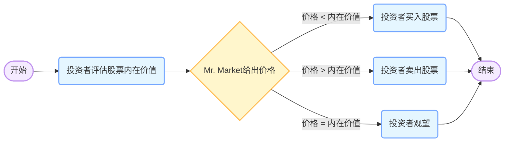

# 格雷厄姆的Mr. Market比喻：理解市场心理

> 关键词：格雷厄姆、Mr. Market、市场心理、价值投资、市场波动

> 摘要：本文围绕格雷厄姆提出的Mr. Market比喻展开，深入剖析这一比喻背后所蕴含的市场心理。从背景介绍入手，阐述目的、预期读者等基本信息，接着详细解释核心概念，分析其原理与架构，并结合数学模型与公式进行说明。通过Python代码实现相关算法，给出项目实战案例及详细解释。探讨该比喻在实际应用中的场景，推荐学习资源、开发工具框架以及相关论文著作。最后总结未来发展趋势与挑战，解答常见问题并提供扩展阅读和参考资料，帮助读者全面理解市场心理，为投资决策提供有力支持。

## 1. 背景介绍 
### 1.1 目的和范围
本文章的主要目的是深入解读格雷厄姆的Mr. Market比喻，帮助读者全面理解这一比喻所反映的市场心理，以及如何运用这一理念在投资领域做出更明智的决策。范围涵盖了对Mr. Market比喻的核心概念、算法原理、数学模型的分析，还包括项目实战案例和实际应用场景的探讨，同时为读者提供相关的学习资源和研究成果。

### 1.2 预期读者
本文预期读者包括对投资领域感兴趣的初学者、有一定投资经验但希望深入理解市场心理的投资者、金融专业的学生以及从事金融研究的专业人士。无论您是想了解基本的市场心理知识，还是希望在投资策略上有所创新，都能从本文中获得有价值的信息。

### 1.3 文档结构概述
本文将按照以下结构进行阐述：首先介绍核心概念与联系，包括Mr. Market比喻的原理和架构；接着详细讲解核心算法原理和具体操作步骤，并用Python代码进行实现；然后引入数学模型和公式，结合具体例子进行说明；通过项目实战案例，展示如何在实际中应用相关理念；探讨实际应用场景；推荐学习工具和资源；总结未来发展趋势与挑战；解答常见问题；最后提供扩展阅读和参考资料。

### 1.4 术语表
#### 1.4.1 核心术语定义
- **格雷厄姆（Graham）**：本杰明·格雷厄姆（Benjamin Graham）是价值投资理论的奠基人，被誉为“华尔街教父”，他的投资理念对后世产生了深远影响。
- **Mr. Market（市场先生）**：格雷厄姆创造的一个拟人化概念，用来代表股票市场的参与者情绪和行为的集合，其特点是情绪不稳定，时而乐观时而悲观。
- **市场心理（Market Psychology）**：指投资者在市场中的心理活动和行为表现，包括恐惧、贪婪、乐观、悲观等情绪，这些情绪会影响市场的价格波动。
- **价值投资（Value Investing）**：一种投资策略，强调通过分析公司的基本面，寻找被低估的股票进行投资，以获得长期的投资回报。

#### 1.4.2 相关概念解释
- **情绪驱动的市场（Emotion - Driven Market）**：市场价格的波动主要受到投资者情绪的影响，而不是公司的基本面。例如，当投资者普遍乐观时，市场价格可能会上涨；当投资者感到恐惧时，市场价格可能会下跌。
- **市场效率（Market Efficiency）**：指市场价格反映所有可用信息的程度。在有效市场中，股票价格能够迅速反映公司的基本面信息；而在非有效市场中，市场价格可能会偏离公司的内在价值。

#### 1.4.3 缩略词列表
- **EMH**：有效市场假说（Efficient Market Hypothesis），该假说认为市场价格已经反映了所有可用的信息，投资者无法通过分析信息获得超额收益。
- **P/E**：市盈率（Price - Earnings Ratio），是股票价格与每股收益的比率，用于衡量股票的估值水平。

## 2. 核心概念与联系 

### 核心概念原理
格雷厄姆的Mr. Market比喻是一个非常形象的概念，它将股票市场拟人化为一个名为Mr. Market的人。Mr. Market每天都会来到投资者面前，给出一个他愿意买卖股票的价格。这个价格会受到他当天情绪的影响，时而乐观，给出一个较高的价格；时而悲观，给出一个较低的价格。

投资者的任务就是判断Mr. Market给出的价格是否合理，是否与股票的内在价值相符。如果Mr. Market给出的价格低于股票的内在价值，投资者可以考虑买入；如果价格高于内在价值，投资者可以考虑卖出。这一比喻强调了投资者要保持独立思考，不被市场情绪所左右。

### 架构的文本示意图
```plaintext
投资者 <---> Mr. Market
         |
         v
股票内在价值
```
在这个架构中，投资者与Mr. Market进行交互，Mr. Market提供股票的买卖价格，而投资者需要根据股票的内在价值来判断是否接受这个价格。

### Mermaid流程图


## 3. 核心算法原理 & 具体操作步骤 

### 算法原理
核心算法的目标是评估股票的内在价值，并与Mr. Market给出的价格进行比较，从而做出投资决策。我们可以使用现金流折现模型（Discounted Cash Flow Model，DCF）来评估股票的内在价值。

现金流折现模型的基本思想是，股票的价值等于其未来现金流的现值之和。假设公司未来每年的现金流为 $CF_t$，折现率为 $r$，则股票的内在价值 $V$ 可以表示为：

$$V=\sum_{t = 1}^{n}\frac{CF_t}{(1 + r)^t}$$

其中，$n$ 是预测的年数。

### 具体操作步骤
1. **预测未来现金流**：分析公司的财务报表和业务情况，预测未来每年的现金流。
2. **确定折现率**：折现率反映了投资者对投资风险的预期，通常可以使用资本资产定价模型（CAPM）来确定。
3. **计算内在价值**：将预测的未来现金流代入现金流折现模型，计算股票的内在价值。
4. **比较价格与内在价值**：将Mr. Market给出的价格与计算得到的内在价值进行比较，做出投资决策。

### Python源代码实现
```python
import numpy as np

def calculate_intrinsic_value(cash_flows, discount_rate):
    """
    计算股票的内在价值
    :param cash_flows: 未来现金流列表
    :param discount_rate: 折现率
    :return: 内在价值
    """
    n = len(cash_flows)
    years = np.arange(1, n + 1)
    present_values = [cf / ((1 + discount_rate) ** year) for cf, year in zip(cash_flows, years)]
    intrinsic_value = sum(present_values)
    return intrinsic_value

# 示例数据
cash_flows = [100, 120, 150, 180, 200]  # 未来5年的现金流
discount_rate = 0.1  # 折现率为10%

intrinsic_value = calculate_intrinsic_value(cash_flows, discount_rate)
print(f"股票的内在价值为: {intrinsic_value}")
```

在上述代码中，我们定义了一个 `calculate_intrinsic_value` 函数，用于计算股票的内在价值。函数接受未来现金流列表和折现率作为输入，返回计算得到的内在价值。最后，我们使用示例数据调用该函数，并打印出计算结果。

## 4. 数学模型和公式 & 详细讲解 & 举例说明 

### 现金流折现模型（DCF）
现金流折现模型的公式为：

$$V=\sum_{t = 1}^{n}\frac{CF_t}{(1 + r)^t}$$

其中：
- $V$ 是股票的内在价值。
- $CF_t$ 是第 $t$ 年的现金流。
- $r$ 是折现率。
- $n$ 是预测的年数。

### 详细讲解
现金流折现模型的核心思想是，未来的现金流需要按照一定的折现率进行折现，以反映货币的时间价值。折现率 $r$ 越高，未来现金流的现值就越低，因为投资者要求更高的回报来补偿投资风险。

### 举例说明
假设一家公司未来3年的现金流分别为 $CF_1 = 100$ 万元，$CF_2 = 120$ 万元，$CF_3 = 150$ 万元，折现率 $r = 0.1$（即10%）。则该公司股票的内在价值为：

$$
\begin{align*}
V&=\frac{CF_1}{(1 + r)^1}+\frac{CF_2}{(1 + r)^2}+\frac{CF_3}{(1 + r)^3}\\
&=\frac{100}{(1 + 0.1)^1}+\frac{120}{(1 + 0.1)^2}+\frac{150}{(1 + 0.1)^3}\\
&=\frac{100}{1.1}+\frac{120}{1.21}+\frac{150}{1.331}\\
&\approx90.91 + 99.17+112.69\\
&=302.77（万元）
\end{align*}
$$

这意味着，如果Mr. Market给出的该公司股票价格低于302.77万元，投资者可以考虑买入；如果价格高于302.77万元，投资者可以考虑卖出。

## 5. 项目实战：代码实际案例和详细解释说明 

### 5.1  开发环境搭建
- **Python环境**：推荐使用Python 3.7及以上版本，可以从Python官方网站（https://www.python.org/downloads/）下载并安装。
- **开发工具**：可以使用PyCharm、Jupyter Notebook等开发工具。PyCharm是一款功能强大的Python集成开发环境（IDE），适合进行大型项目的开发；Jupyter Notebook则更适合进行数据分析和交互式编程。
- **相关库**：需要安装 `numpy` 库，用于数值计算。可以使用以下命令进行安装：
```sh
pip install numpy
```

### 5.2  源代码详细实现和代码解读
```python
import numpy as np

def calculate_intrinsic_value(cash_flows, discount_rate):
    """
    计算股票的内在价值
    :param cash_flows: 未来现金流列表
    :param discount_rate: 折现率
    :return: 内在价值
    """
    n = len(cash_flows)
    years = np.arange(1, n + 1)
    present_values = [cf / ((1 + discount_rate) ** year) for cf, year in zip(cash_flows, years)]
    intrinsic_value = sum(present_values)
    return intrinsic_value

def make_investment_decision(market_price, intrinsic_value):
    """
    根据市场价格和内在价值做出投资决策
    :param market_price: 市场价格
    :param intrinsic_value: 内在价值
    :return: 投资决策
    """
    if market_price < intrinsic_value:
        return "买入"
    elif market_price > intrinsic_value:
        return "卖出"
    else:
        return "观望"

# 示例数据
cash_flows = [100, 120, 150, 180, 200]  # 未来5年的现金流
discount_rate = 0.1  # 折现率为10%
market_price = 500  # 市场价格

# 计算内在价值
intrinsic_value = calculate_intrinsic_value(cash_flows, discount_rate)
print(f"股票的内在价值为: {intrinsic_value}")

# 做出投资决策
decision = make_investment_decision(market_price, intrinsic_value)
print(f"投资决策: {decision}")
```

### 代码解读与分析
- **`calculate_intrinsic_value` 函数**：该函数接受未来现金流列表和折现率作为输入，通过循环计算每年现金流的现值，并将它们相加得到股票的内在价值。
- **`make_investment_decision` 函数**：该函数接受市场价格和内在价值作为输入，根据两者的大小关系做出投资决策。如果市场价格低于内在价值，建议买入；如果市场价格高于内在价值，建议卖出；如果两者相等，建议观望。
- **主程序**：定义了示例数据，包括未来现金流、折现率和市场价格。调用 `calculate_intrinsic_value` 函数计算内在价值，然后调用 `make_investment_decision` 函数做出投资决策，并打印结果。

## 6. 实际应用场景 
### 股票投资
在股票投资中，投资者可以运用Mr. Market的理念，不被市场的短期波动所影响，而是关注股票的内在价值。当市场情绪低迷，Mr. Market给出较低的价格时，投资者可以寻找被低估的股票进行买入；当市场情绪高涨，Mr. Market给出较高的价格时，投资者可以考虑卖出高估的股票。

### 基金投资
在基金投资中，投资者也可以参考Mr. Market的比喻。例如，当市场整体下跌，基金净值下降时，投资者可以分析基金所投资的资产的内在价值。如果内在价值没有发生变化，而只是市场情绪导致价格下跌，投资者可以考虑增加投资；反之，当市场过度乐观，基金净值过高时，投资者可以适当减仓。

### 企业并购
在企业并购中，收购方需要评估目标企业的内在价值。Mr. Market的比喻可以帮助收购方不被市场上关于目标企业的短期炒作所迷惑，而是通过深入分析目标企业的财务状况、市场前景等因素，确定其合理的价值，从而做出明智的并购决策。

## 7. 工具和资源推荐
### 7.1 学习资源推荐
#### 7.1.1 书籍推荐
- 《聪明的投资者》（The Intelligent Investor）：本杰明·格雷厄姆的经典著作，详细阐述了价值投资的理念和方法，其中包括Mr. Market的比喻。
- 《证券分析》（Security Analysis）：同样是格雷厄姆的重要著作，对证券的分析和估值进行了深入探讨。
- 《巴菲特致股东的信》（Letters to Shareholders of Berkshire Hathaway）：沃伦·巴菲特作为格雷厄姆的学生，在信中分享了他的投资理念和实践经验，对理解Mr. Market的比喻有很大帮助。

#### 7.1.2 在线课程
- Coursera上的“投资学原理”课程：由知名大学的教授授课，涵盖了投资领域的基本原理和方法，包括市场心理和价值投资。
- edX上的“金融市场”课程：该课程对金融市场的运行机制和投资者行为进行了详细讲解。

#### 7.1.3 技术博客和网站
- 雪球网：一个投资交流社区，投资者可以在上面分享自己的投资经验和见解，讨论市场动态。
- 价值投资网：专注于价值投资领域，提供了大量关于价值投资的文章和分析报告。

### 7.2 开发工具框架推荐
#### 7.2.1 IDE和编辑器
- PyCharm：功能强大的Python集成开发环境，提供了代码编辑、调试、版本控制等一系列功能。
- Jupyter Notebook：适合进行数据分析和交互式编程，支持多种编程语言，方便展示代码和结果。

#### 7.2.2 调试和性能分析工具
- PDB：Python自带的调试工具，可以帮助开发者定位代码中的问题。
- cProfile：用于分析Python代码的性能，找出性能瓶颈。

#### 7.2.3 相关框架和库
- `numpy`：用于数值计算，提供了高效的数组操作和数学函数。
- `pandas`：用于数据处理和分析，提供了数据结构和数据操作方法。

### 7.3 相关论文著作推荐
#### 7.3.1 经典论文
- Eugene F. Fama的《有效资本市场：理论与实证研究回顾》（Efficient Capital Markets: A Review of Theory and Empirical Work）：提出了有效市场假说，对理解市场价格的形成机制有重要意义。
- Daniel Kahneman和Amos Tversky的《前景理论：风险决策分析》（Prospect Theory: An Analysis of Decision under Risk）：研究了投资者在面对风险时的决策行为，揭示了市场心理的一些规律。

#### 7.3.2 最新研究成果
- 可以关注《金融研究》《经济研究》等学术期刊，上面发表了很多关于市场心理和投资决策的最新研究成果。

#### 7.3.3 应用案例分析
- 可以参考一些知名投资机构的研究报告，了解他们在实际投资中如何运用价值投资理念和分析市场心理。

## 8. 总结：未来发展趋势与挑战
### 未来发展趋势
- **技术融合**：随着人工智能和大数据技术的发展，投资者可以利用这些技术更准确地分析市场心理和评估股票的内在价值。例如，通过分析社交媒体上的舆情数据，了解投资者的情绪变化，从而更好地把握市场趋势。
- **全球市场一体化**：全球金融市场的联系越来越紧密，Mr. Market的影响范围也在扩大。投资者需要关注全球市场的动态，考虑不同国家和地区的市场心理差异，制定更加多元化的投资策略。
- **社会责任投资**：越来越多的投资者开始关注企业的社会责任，将环境、社会和治理（ESG）因素纳入投资决策中。这将影响市场心理和股票的内在价值评估，未来的投资决策需要更加综合地考虑这些因素。

### 挑战
- **市场复杂性增加**：金融市场的产品和交易方式越来越复杂，市场心理也更加难以捉摸。投资者需要不断学习和提高自己的分析能力，才能应对市场的变化。
- **信息过载**：互联网的发展使得信息传播速度加快，投资者面临着海量的信息。如何从这些信息中筛选出有价值的信息，准确判断市场心理，是一个巨大的挑战。
- **情绪管理**：尽管投资者知道要保持独立思考，不被市场情绪所左右，但在实际操作中，很难完全做到这一点。情绪管理将成为投资者面临的重要挑战之一。

## 9. 附录：常见问题与解答
### 问题1：如何准确预测未来现金流？
解答：预测未来现金流需要对公司的业务进行深入分析，包括市场需求、竞争态势、财务状况等。可以参考公司的历史财务数据，结合行业发展趋势和宏观经济环境进行预测。同时，也可以使用一些专业的分析工具和模型来辅助预测。

### 问题2：折现率如何确定？
解答：折现率可以使用资本资产定价模型（CAPM）来确定。该模型考虑了无风险利率、市场风险溢价和股票的贝塔系数。无风险利率通常可以使用国债收益率来代替，市场风险溢价可以参考历史数据或专业机构的研究报告，贝塔系数反映了股票相对于市场的波动程度。

### 问题3：Mr. Market的比喻是否适用于所有市场？
解答：Mr. Market的比喻适用于大多数金融市场，因为市场心理在不同市场中都起着重要作用。但不同市场的特点和投资者结构可能会有所不同，因此在应用这一比喻时，需要结合具体市场情况进行分析。

## 10. 扩展阅读 & 参考资料
### 扩展阅读
- 《行为金融学》：研究投资者的心理和行为对金融市场的影响，与Mr. Market的比喻密切相关。
- 《金融心理学》：深入探讨了金融市场中的心理现象和规律，有助于读者更好地理解市场心理。

### 参考资料
- Graham, B., & Dodd, D. L. (1934). Security Analysis. McGraw - Hill.
- Graham, B. (1949). The Intelligent Investor. Harper & Brothers.
- Fama, E. F. (1970). Efficient capital markets: A review of theory and empirical work. The Journal of Finance, 25(2), 383 - 417.
- Kahneman, D., & Tversky, A. (1979). Prospect theory: An analysis of decision under risk. Econometrica: Journal of the Econometric Society, 263 - 291.

作者：AI天才研究院/AI Genius Institute & 禅与计算机程序设计艺术 /Zen And The Art of Computer Programming