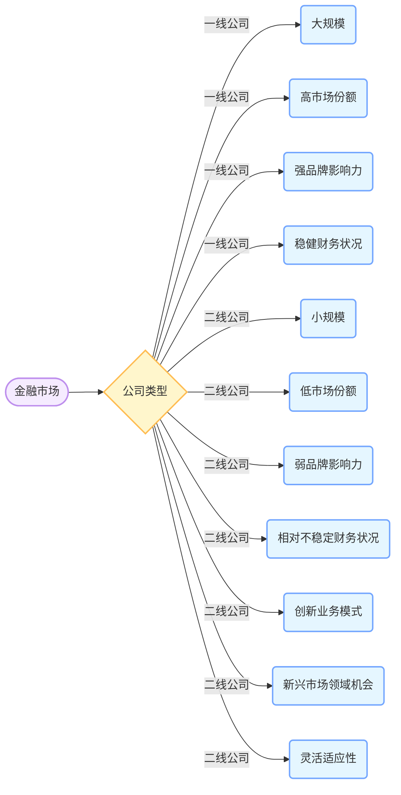

# 格雷厄姆的Secondary Companies：二线公司的潜力

> 关键词：格雷厄姆、二线公司、潜力分析、价值投资、市场评估

> 摘要：本文深入探讨了格雷厄姆所提出的二线公司（Secondary Companies）概念及其蕴含的潜力。从背景介绍出发，阐述了研究目的、预期读者和文档结构。详细解析了二线公司的核心概念，包括其与一线公司的区别与联系，并通过流程图展示了其内在逻辑。对评估二线公司潜力的核心算法原理进行了讲解，辅以Python代码示例。引入数学模型和公式，通过具体例子说明其在分析中的应用。结合项目实战，给出开发环境搭建、源代码实现及解读。探讨了二线公司在不同场景下的实际应用，并推荐了相关的学习资源、开发工具和研究论文。最后总结了二线公司未来的发展趋势与挑战，解答常见问题，提供扩展阅读和参考资料，旨在为投资者和研究者全面了解二线公司潜力提供有价值的参考。

## 1. 背景介绍 
### 1.1 目的和范围
本研究的主要目的是深入剖析格雷厄姆所提及的二线公司（Secondary Companies）的潜力。在金融市场中，投资者往往更关注大型的一线公司，而对二线公司的价值和潜力认识不足。通过对二线公司的系统研究，旨在揭示其在特定市场环境下的投资价值和发展潜力，为投资者提供更全面的投资选择。

研究范围涵盖了二线公司的定义、特征、评估方法、发展前景以及在不同市场条件下的表现。同时，结合实际案例分析，探讨如何挖掘二线公司的潜力，以及投资二线公司可能面临的风险和挑战。

### 1.2 预期读者
本文预期读者包括金融投资者、投资分析师、金融专业学生以及对价值投资理论感兴趣的人士。对于投资者而言，了解二线公司的潜力有助于拓宽投资视野，寻找潜在的投资机会；投资分析师可以从本文中获取评估二线公司的方法和思路；金融专业学生可以通过学习本文加深对价值投资理论的理解；而对价值投资理论感兴趣的人士则可以从中了解到一种不同于传统投资观念的视角。

### 1.3 文档结构概述
本文将按照以下结构进行阐述：首先介绍核心概念，明确二线公司的定义和相关联系；接着讲解评估二线公司潜力的核心算法原理和具体操作步骤，并给出Python代码示例；然后引入数学模型和公式，通过具体例子说明其应用；之后结合项目实战，详细介绍开发环境搭建、源代码实现及代码解读；再探讨二线公司的实际应用场景；推荐相关的学习资源、开发工具和研究论文；最后总结二线公司未来的发展趋势与挑战，解答常见问题，提供扩展阅读和参考资料。

### 1.4 术语表
#### 1.4.1 核心术语定义
- **二线公司（Secondary Companies）**：相对于一线公司而言，二线公司通常在规模、市场份额、品牌影响力等方面稍逊一筹。但它们可能具有独特的业务模式、技术优势或市场定位，具备一定的发展潜力。
- **价值投资（Value Investing）**：由格雷厄姆提出的一种投资策略，强调通过分析公司的内在价值，寻找被市场低估的股票进行投资。
- **内在价值（Intrinsic Value）**：公司的真实价值，通常通过对公司的财务状况、盈利能力、资产质量等因素进行分析和评估得出。

#### 1.4.2 相关概念解释
- **一线公司（Primary Companies）**：在行业中具有领先地位，规模较大、市场份额较高、品牌知名度高的公司。
- **市场效率（Market Efficiency）**：市场价格反映所有可用信息的程度。在有效市场中，股票价格能够及时、准确地反映公司的内在价值；而在无效市场中，股票价格可能会偏离其内在价值。

#### 1.4.3 缩略词列表
- **PE（Price-to-Earnings Ratio）**：市盈率，是指股票价格除以每股收益的比率，用于衡量股票的估值水平。
- **PB（Price-to-Book Ratio）**：市净率，是指股票价格除以每股净资产的比率，用于衡量股票相对于其账面价值的估值水平。

## 2. 核心概念与联系 
### 核心概念原理
格雷厄姆认为，二线公司虽然在市场上的关注度不如一线公司，但它们可能存在被市场低估的情况。这是因为市场往往更关注一线公司的业绩和发展前景，而对二线公司的研究和了解相对较少。二线公司可能具有一些独特的优势，如创新的业务模式、新兴的市场领域、优秀的管理团队等，这些优势可能使其在未来实现快速增长。

二线公司与一线公司的区别主要体现在以下几个方面：
- **规模和市场份额**：一线公司通常具有较大的规模和较高的市场份额，而二线公司相对较小。
- **品牌影响力**：一线公司的品牌知名度较高，消费者认可度强，而二线公司的品牌影响力相对较弱。
- **财务状况**：一线公司的财务状况通常较为稳健，盈利能力较强，而二线公司的财务状况可能相对不稳定，盈利能力也有待提高。

然而，二线公司也有其自身的优势。它们可能更加灵活，能够更快地适应市场变化；在一些新兴领域，二线公司可能具有先发优势，能够抢占市场份额。

### 架构的文本示意图
```plaintext
金融市场
|
|-- 一线公司
|   |-- 大规模
|   |-- 高市场份额
|   |-- 强品牌影响力
|   |-- 稳健财务状况
|
|-- 二线公司
|   |-- 小规模
|   |-- 低市场份额
|   |-- 弱品牌影响力
|   |-- 相对不稳定财务状况
|   |-- 创新业务模式
|   |-- 新兴市场领域机会
|   |-- 灵活适应性
```

### Mermaid 流程图


## 3. 核心算法原理 & 具体操作步骤 
### 核心算法原理
评估二线公司的潜力可以采用多种方法，其中一种常用的方法是基于财务指标的分析。通过分析公司的市盈率（PE）、市净率（PB）、净资产收益率（ROE）等指标，可以初步判断公司的估值水平和盈利能力。

以下是一个简单的评估算法思路：
1. 收集二线公司的财务数据，包括营业收入、净利润、总资产、净资产等。
2. 计算关键财务指标，如PE、PB、ROE等。
3. 将计算得到的指标与同行业的平均水平进行比较，判断公司的估值是否合理。
4. 结合公司的业务模式、市场前景等因素，综合评估公司的潜力。

### 具体操作步骤
#### 步骤1：数据收集
可以通过金融数据提供商（如东方财富、同花顺等）获取二线公司的财务报表数据。将数据保存为CSV文件，方便后续处理。

#### 步骤2：指标计算
使用Python代码计算关键财务指标。以下是一个示例代码：
```python
import pandas as pd

def calculate_financial_metrics(data):
    # 计算市盈率（PE）
    data['PE'] = data['股价'] / data['每股收益']
    # 计算市净率（PB）
    data['PB'] = data['股价'] / data['每股净资产']
    # 计算净资产收益率（ROE）
    data['ROE'] = data['净利润'] / data['净资产']
    return data

# 读取CSV文件
data = pd.read_csv('financial_data.csv')
# 计算财务指标
data = calculate_financial_metrics(data)
print(data)
```

#### 步骤3：指标比较
将计算得到的指标与同行业的平均水平进行比较。可以通过查阅行业研究报告或金融数据库获取同行业的平均指标数据。

#### 步骤4：综合评估
结合公司的业务模式、市场前景等因素，对公司的潜力进行综合评估。例如，如果一家二线公司的PE和PB低于同行业平均水平，且ROE较高，同时具有创新的业务模式和良好的市场前景，那么可以认为该公司具有较大的潜力。

## 4. 数学模型和公式 & 详细讲解 & 举例说明 
### 数学模型和公式
#### 市盈率（PE）
市盈率是指股票价格除以每股收益的比率，计算公式为：
$$PE = \frac{P}{EPS}$$
其中，$P$ 表示股票价格，$EPS$ 表示每股收益。

#### 市净率（PB）
市净率是指股票价格除以每股净资产的比率，计算公式为：
$$PB = \frac{P}{BVPS}$$
其中，$P$ 表示股票价格，$BVPS$ 表示每股净资产。

#### 净资产收益率（ROE）
净资产收益率是指净利润与净资产的比率，计算公式为：
$$ROE = \frac{Net Income}{Equity}$$
其中，$Net Income$ 表示净利润，$Equity$ 表示净资产。

### 详细讲解
- **市盈率（PE）**：市盈率反映了市场对公司未来盈利的预期。较低的市盈率可能意味着公司被市场低估，具有投资价值；而较高的市盈率可能意味着市场对公司的未来盈利预期较高，但也可能存在泡沫风险。
- **市净率（PB）**：市净率反映了股票价格相对于公司账面价值的估值水平。较低的市净率可能意味着公司的资产被市场低估，具有一定的安全边际；而较高的市净率可能意味着市场对公司的未来增长潜力给予了较高的估值。
- **净资产收益率（ROE）**：净资产收益率衡量了公司利用自有资本获取收益的能力。较高的净资产收益率表明公司具有较强的盈利能力和管理效率。

### 举例说明
假设一家二线公司的股票价格为20元，每股收益为2元，每股净资产为10元，净利润为1000万元，净资产为5000万元。

- 计算市盈率（PE）：
$$PE = \frac{20}{2} = 10$$
- 计算市净率（PB）：
$$PB = \frac{20}{10} = 2$$
- 计算净资产收益率（ROE）：
$$ROE = \frac{1000}{5000} = 0.2 = 20\%$$

假设同行业的平均市盈率为15，平均市净率为3，平均净资产收益率为15%。通过比较可以发现，该二线公司的市盈率和市净率低于同行业平均水平，而净资产收益率高于同行业平均水平，初步判断该公司具有一定的投资价值。

## 5. 项目实战：代码实际案例和详细解释说明 
### 5.1  开发环境搭建
#### 安装Python
首先需要安装Python开发环境。可以从Python官方网站（https://www.python.org/downloads/）下载适合自己操作系统的Python版本，并按照安装向导进行安装。

#### 安装必要的库
在命令行中使用以下命令安装必要的库：
```sh
pip install pandas
```

### 5.2  源代码详细实现和代码解读
以下是一个完整的项目实战代码示例：
```python
import pandas as pd

# 定义计算财务指标的函数
def calculate_financial_metrics(data):
    # 计算市盈率（PE）
    data['PE'] = data['股价'] / data['每股收益']
    # 计算市净率（PB）
    data['PB'] = data['股价'] / data['每股净资产']
    # 计算净资产收益率（ROE）
    data['ROE'] = data['净利润'] / data['净资产']
    return data

# 读取CSV文件
data = pd.read_csv('financial_data.csv')

# 检查数据是否包含必要的列
required_columns = ['股价', '每股收益', '每股净资产', '净利润', '净资产']
for column in required_columns:
    if column not in data.columns:
        raise ValueError(f"数据文件中缺少必要的列: {column}")

# 计算财务指标
data = calculate_financial_metrics(data)

# 假设同行业平均指标数据
industry_avg = {
    'PE': 15,
    'PB': 3,
    'ROE': 0.15
}

# 筛选出具有潜力的二线公司
potential_companies = data[
    (data['PE'] < industry_avg['PE']) &
    (data['PB'] < industry_avg['PB']) &
    (data['ROE'] > industry_avg['ROE'])
]

# 输出结果
print("具有潜力的二线公司:")
print(potential_companies)
```

### 代码解读与分析
1. **导入必要的库**：导入 `pandas` 库，用于数据处理和分析。
2. **定义计算财务指标的函数**：`calculate_financial_metrics` 函数接受一个DataFrame对象作为输入，计算并添加PE、PB和ROE列。
3. **读取CSV文件**：使用 `pd.read_csv` 函数读取保存有二线公司财务数据的CSV文件。
4. **检查数据列**：检查数据文件中是否包含必要的列，避免因数据缺失导致计算错误。
5. **计算财务指标**：调用 `calculate_financial_metrics` 函数计算PE、PB和ROE指标。
6. **假设同行业平均指标数据**：定义一个字典 `industry_avg`，存储同行业的平均PE、PB和ROE指标。
7. **筛选具有潜力的二线公司**：使用布尔索引筛选出PE低于行业平均水平、PB低于行业平均水平且ROE高于行业平均水平的二线公司。
8. **输出结果**：打印出具有潜力的二线公司的数据。

## 6. 实际应用场景 
### 投资领域
在投资领域，投资者可以通过分析二线公司的潜力，寻找被市场低估的投资机会。当二线公司具有独特的业务模式、新兴的市场领域或优秀的管理团队时，其未来增长潜力可能被市场忽视。投资者可以通过深入研究和分析，挖掘这些具有潜力的二线公司，并在合适的时机进行投资。

### 行业研究
行业研究人员可以通过对二线公司的研究，了解行业的竞争格局和发展趋势。二线公司的发展状况往往反映了行业的创新活力和竞争态势。通过分析二线公司的业务模式、技术创新和市场份额变化，可以预测行业的未来发展方向。

### 企业战略规划
对于二线公司自身而言，了解自身的潜力和市场地位，有助于制定合理的企业战略规划。二线公司可以通过与一线公司的比较，发现自身的优势和不足，从而有针对性地进行业务拓展、技术创新和品牌建设，提升自身的竞争力。

## 7. 工具和资源推荐
### 7.1 学习资源推荐
#### 7.1.1 书籍推荐
- 《聪明的投资者》（The Intelligent Investor）：由格雷厄姆所著，是价值投资领域的经典之作，详细阐述了价值投资的理念和方法。
- 《证券分析》（Security Analysis）：同样是格雷厄姆的著作，对证券分析的基本原理和方法进行了系统的介绍。
- 《财务报表分析与证券定价》（Financial Statement Analysis and Security Valuation）：这本书提供了深入分析财务报表和评估证券价值的方法和技巧。

#### 7.1.2 在线课程
- Coursera上的“Financial Markets”课程：由耶鲁大学教授罗伯特·席勒（Robert Shiller）讲授，涵盖了金融市场的基本原理和投资策略。
- edX上的“Investment Management”课程：提供了投资管理的基础知识和实践经验。

#### 7.1.3 技术博客和网站
- Seeking Alpha：一个提供股票分析和投资建议的网站，有许多专业的分析师和投资者分享他们的观点和研究成果。
- ValueWalk：专注于价值投资领域的博客，提供了关于价值投资的最新资讯和研究报告。

### 7.2 开发工具框架推荐
#### 7.2.1 IDE和编辑器
- PyCharm：一款功能强大的Python集成开发环境，提供了代码编辑、调试、版本控制等功能。
- Jupyter Notebook：一个交互式的开发环境，适合进行数据分析和模型验证。

#### 7.2.2 调试和性能分析工具
- pdb：Python自带的调试工具，可以帮助开发者定位和解决代码中的问题。
- cProfile：Python的性能分析工具，可以分析代码的运行时间和函数调用情况。

#### 7.2.3 相关框架和库
- Pandas：用于数据处理和分析的Python库，提供了高效的数据结构和数据操作方法。
- NumPy：用于科学计算的Python库，提供了多维数组和矩阵运算的功能。

### 7.3 相关论文著作推荐
#### 7.3.1 经典论文
- Benjamin Graham and David Dodd, "Security Analysis" (1934)：这篇论文奠定了价值投资的理论基础，提出了通过分析公司的内在价值来进行投资决策的方法。
- Eugene F. Fama and Kenneth R. French, "The Cross-Section of Expected Stock Returns" (1992)：该论文提出了著名的Fama-French三因子模型，对股票收益率的影响因素进行了深入分析。

#### 7.3.2 最新研究成果
- 近年来，关于二线公司的研究逐渐增多，一些研究关注二线公司的创新能力、市场竞争力和发展潜力。可以通过学术数据库（如IEEE Xplore、ACM Digital Library等）搜索相关的最新研究论文。

#### 7.3.3 应用案例分析
- 一些金融研究机构和咨询公司会发布关于二线公司的应用案例分析报告，这些报告可以帮助读者了解二线公司在实际市场中的表现和发展情况。可以通过专业的金融资讯平台获取相关的案例分析报告。

## 8. 总结：未来发展趋势与挑战
### 未来发展趋势
- **创新驱动发展**：随着科技的不断进步和市场竞争的加剧，二线公司将更加注重创新。通过技术创新、业务模式创新和管理创新，二线公司有望在新兴领域取得突破，实现快速发展。
- **行业整合加速**：在市场竞争的压力下，二线公司之间的整合将加速。通过并购、重组等方式，二线公司可以实现资源共享、优势互补，提升自身的竞争力。
- **数字化转型**：数字化技术的发展将为二线公司带来新的机遇。二线公司可以通过数字化转型，提升运营效率、优化客户体验，拓展市场份额。

### 挑战
- **资金压力**：二线公司在发展过程中往往面临资金短缺的问题。由于其规模较小、信用评级较低，融资难度较大。如何解决资金问题，是二线公司面临的一大挑战。
- **人才竞争**：在吸引和留住人才方面，二线公司往往不如一线公司具有优势。优秀的人才更倾向于选择大型的一线公司，这使得二线公司在技术创新和管理提升方面面临一定的困难。
- **市场不确定性**：市场环境的不确定性增加了二线公司的经营风险。宏观经济波动、政策变化、行业竞争加剧等因素都可能对二线公司的发展产生不利影响。

## 9. 附录：常见问题与解答
### 问题1：如何确定一家公司是否为二线公司？
答：确定一家公司是否为二线公司可以从多个方面进行考虑，如公司的规模、市场份额、品牌影响力、财务状况等。一般来说，二线公司在规模和市场份额上相对较小，品牌影响力较弱，财务状况可能相对不稳定。但这并不是绝对的标准，还需要结合具体行业和市场情况进行综合判断。

### 问题2：投资二线公司的风险有哪些？
答：投资二线公司的风险主要包括以下几个方面：
- **经营风险**：二线公司的经营稳定性相对较差，可能面临市场竞争、技术创新、管理不善等问题，导致业绩下滑。
- **财务风险**：二线公司的财务状况可能相对脆弱，存在资金链断裂、债务违约等风险。
- **市场风险**：市场环境的变化可能对二线公司的股价产生较大影响，导致投资损失。

### 问题3：如何降低投资二线公司的风险？
答：可以通过以下方法降低投资二线公司的风险：
- **深入研究**：在投资前，对二线公司的业务模式、市场前景、财务状况等进行深入研究，了解公司的基本面。
- **分散投资**：不要将所有资金集中投资于一家二线公司，而是分散投资于多家不同行业、不同类型的二线公司，降低单一公司的风险。
- **长期投资**：二线公司的发展需要时间，投资者应该具有长期投资的理念，避免短期波动对投资决策的影响。

## 10. 扩展阅读 & 参考资料
### 扩展阅读
- 《穷查理宝典》（Poor Charlie's Almanack）：这本书收录了查理·芒格的演讲和文章，介绍了他的投资理念和思维方式，对理解价值投资有很大的帮助。
- 《战胜华尔街》（One Up On Wall Street）：彼得·林奇的著作，分享了他的投资经验和选股方法。

### 参考资料
- Graham, Benjamin. The Intelligent Investor. HarperBusiness, 2003.
- Fama, Eugene F., and Kenneth R. French. "The Cross-Section of Expected Stock Returns." Journal of Finance 47, no. 2 (1992): 427-465.
- Pandas官方文档：https://pandas.pydata.org/docs/

作者：AI天才研究院/AI Genius Institute & 禅与计算机程序设计艺术 /Zen And The Art of Computer Programming