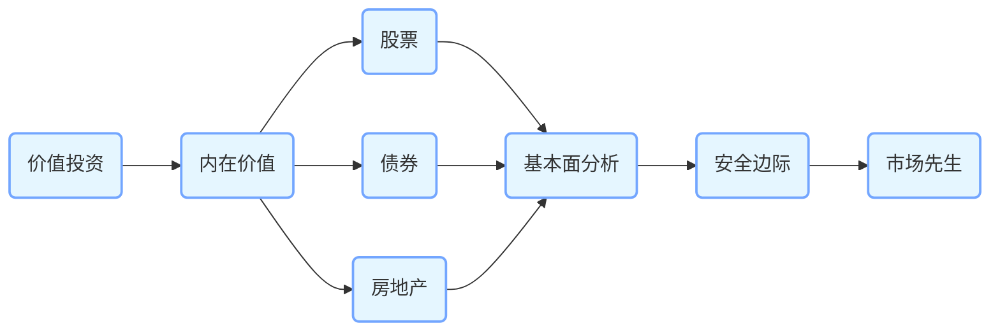

# 格雷厄姆的价值投资原则在不同资产类别中的应用

> 关键词：格雷厄姆、价值投资原则、资产类别、股票、债券、房地产

> 摘要：本文深入探讨了格雷厄姆的价值投资原则在不同资产类别中的应用。首先介绍了价值投资原则的背景，包括其目的、预期读者等内容。接着阐述了核心概念及它们之间的联系，并给出了相应的示意图和流程图。详细讲解了核心算法原理和具体操作步骤，结合数学模型和公式进行举例说明。通过项目实战展示了在不同资产类别中应用价值投资原则的代码实现和解读。分析了价值投资原则在实际应用场景中的表现，推荐了相关的学习资源、开发工具框架和论文著作。最后总结了未来发展趋势与挑战，提供了常见问题解答和扩展阅读参考资料，旨在帮助投资者更好地将格雷厄姆的价值投资原则应用到不同资产类别中，实现资产的合理配置和增值。

## 1. 背景介绍 
### 1.1 目的和范围
格雷厄姆作为价值投资理论的奠基人，其价值投资原则对全球投资界产生了深远的影响。本文章的目的在于深入研究格雷厄姆的价值投资原则，并探讨其在不同资产类别（如股票、债券、房地产等）中的具体应用方式和效果。通过分析和实践案例，帮助投资者更好地理解和运用这些原则，实现资产的合理配置和长期增值。

文章的范围涵盖了价值投资原则的基本概念、核心算法原理、数学模型以及在不同资产类别中的项目实战案例。同时，还会介绍相关的学习资源、开发工具和研究论文，为投资者提供全面的参考和指导。

### 1.2 预期读者
本文预期读者主要包括以下几类人群：
1. **个人投资者**：希望学习和应用价值投资原则，提高投资决策的准确性和收益水平，实现个人资产的保值增值。
2. **专业投资人士**：如基金经理、投资顾问等，他们可以从本文中获取新的思路和方法，优化投资组合，提升投资业绩。
3. **金融专业学生**：作为学习价值投资理论和实践的参考资料，帮助他们更好地理解和掌握相关知识，为未来的职业发展打下坚实的基础。
4. **对投资领域感兴趣的研究者**：为他们的研究提供新的视角和案例，促进价值投资理论的进一步发展和应用。

### 1.3 文档结构概述
本文将按照以下结构进行组织：
1. **核心概念与联系**：介绍格雷厄姆价值投资原则的核心概念，以及这些概念之间的相互关系，并通过示意图和流程图进行直观展示。
2. **核心算法原理 & 具体操作步骤**：详细讲解价值投资原则中涉及的核心算法原理，并给出具体的操作步骤，同时使用Python源代码进行阐述。
3. **数学模型和公式 & 详细讲解 & 举例说明**：运用数学模型和公式对价值投资原则进行深入分析，并通过实际案例进行说明。
4. **项目实战：代码实际案例和详细解释说明**：通过具体的项目实战案例，展示价值投资原则在不同资产类别中的应用，包括开发环境搭建、源代码实现和代码解读。
5. **实际应用场景**：分析价值投资原则在股票、债券、房地产等不同资产类别中的实际应用场景和效果。
6. **工具和资源推荐**：推荐相关的学习资源、开发工具框架和研究论文，帮助读者进一步深入学习和应用价值投资原则。
7. **总结：未来发展趋势与挑战**：总结价值投资原则的发展趋势，分析面临的挑战，并提出相应的建议。
8. **附录：常见问题与解答**：解答读者在学习和应用价值投资原则过程中常见的问题。
9. **扩展阅读 & 参考资料**：提供相关的扩展阅读资料和参考文献，方便读者进一步深入研究。

### 1.4 术语表
#### 1.4.1 核心术语定义
1. **价值投资**：是一种投资策略，其核心思想是通过分析资产的内在价值，寻找被市场低估的资产进行投资，以获取长期的投资回报。
2. **内在价值**：指资产本身所具有的价值，它是基于资产的基本面因素（如盈利能力、现金流、资产负债状况等）计算得出的。
3. **安全边际**：是指投资者购买资产的价格与资产内在价值之间的差额。安全边际越大，投资的风险越低。
4. **市净率（PB）**：是指股票价格与每股净资产的比率，用于衡量股票的估值水平。
5. **市盈率（PE）**：是指股票价格与每股收益的比率，也是衡量股票估值的重要指标。

#### 1.4.2 相关概念解释
1. **格雷厄姆成长股估值公式**：是格雷厄姆提出的一种用于估算成长股内在价值的公式，该公式考虑了公司的盈利增长率、股息率等因素。
2. **债券到期收益率**：是指投资者持有债券至到期时所能获得的实际收益率，它考虑了债券的票面利率、购买价格、到期时间等因素。
3. **房地产净租金收益率**：是指房地产每年的净租金收入与房地产购买价格的比率，用于衡量房地产投资的收益水平。

#### 1.4.3 缩略词列表
1. **PB**：市净率（Price-to-Book Ratio）
2. **PE**：市盈率（Price-to-Earnings Ratio）
3. **ROE**：净资产收益率（Return on Equity）
4. **YTM**：到期收益率（Yield to Maturity）

## 2. 核心概念与联系 
格雷厄姆的价值投资原则主要包括以下几个核心概念：内在价值、安全边际、市场先生和基本面分析。这些概念相互关联，共同构成了价值投资的理论基础。

### 核心概念原理
1. **内在价值**：内在价值是价值投资的核心概念之一。它是资产本身所具有的价值，不受市场短期波动的影响。内在价值的计算需要综合考虑资产的各种基本面因素，如盈利能力、现金流、资产负债状况等。对于股票来说，内在价值可以通过股息折现模型、自由现金流折现模型等方法进行估算；对于债券来说，内在价值可以通过债券的票面利率、到期时间和市场利率等因素进行计算；对于房地产来说，内在价值可以通过租金收入、房地产增值潜力等因素进行评估。
2. **安全边际**：安全边际是价值投资的另一个重要概念。它是指投资者购买资产的价格与资产内在价值之间的差额。安全边际越大，投资的风险越低。格雷厄姆认为，投资者应该在资产价格低于其内在价值时进行投资，以获得足够的安全边际。这样，即使市场出现不利变化，投资者也能在一定程度上避免损失。
3. **市场先生**：市场先生是格雷厄姆提出的一个形象化概念。他将市场比喻为一个情绪不稳定的人，每天都会报出一个资产的买卖价格。市场先生的情绪会受到各种因素的影响，如宏观经济环境、公司业绩、投资者情绪等，因此他报出的价格可能会高于或低于资产的内在价值。价值投资者应该利用市场先生的情绪波动，在价格低于内在价值时买入资产，在价格高于内在价值时卖出资产。
4. **基本面分析**：基本面分析是价值投资的重要方法之一。它通过对资产的基本面因素进行分析，如公司的财务报表、行业前景、管理层能力等，来评估资产的内在价值。基本面分析可以帮助投资者发现被市场低估的资产，从而做出合理的投资决策。

### 概念之间的联系
这些核心概念之间存在着密切的联系。内在价值是价值投资的基础，投资者通过基本面分析来估算资产的内在价值。安全边际则是基于内在价值的概念，投资者在购买资产时需要考虑安全边际，以降低投资风险。市场先生的情绪波动为投资者提供了买入和卖出资产的机会，投资者可以利用市场先生报出的价格与资产内在价值之间的差异，进行低买高卖的操作。

### 文本示意图
```plaintext
           价值投资
             |
             |
        内在价值
      /       |       \
    股票      债券      房地产
    |         |         |
基本面分析  基本面分析  基本面分析
    |         |         |
  安全边际  安全边际  安全边际
    |         |         |
  市场先生  市场先生  市场先生
```

### Mermaid 流程图


## 3. 核心算法原理 & 具体操作步骤 
### 核心算法原理
#### 股票内在价值估算（股息折现模型）
股息折现模型（Dividend Discount Model，DDM）是一种常用的估算股票内在价值的方法。该模型的基本思想是将股票未来的股息按照一定的折现率折现到当前时刻，从而得到股票的内在价值。

假设股票每年的股息增长率为 $g$，折现率为 $r$，第 $0$ 期的股息为 $D_0$，则股票的内在价值 $V$ 可以用以下公式表示：

$$V = \frac{D_0(1 + g)}{r - g}$$

其中，$r > g$。

#### 债券内在价值估算
债券的内在价值可以通过债券的票面利率、到期时间和市场利率等因素进行计算。假设债券的票面金额为 $F$，票面利率为 $C$，每年付息一次，到期时间为 $n$ 年，市场利率为 $y$，则债券的内在价值 $V$ 可以用以下公式表示：

$$V = \sum_{t = 1}^{n} \frac{C}{(1 + y)^t} + \frac{F}{(1 + y)^n}$$

### 具体操作步骤
#### 股票投资操作步骤
1. **选择股票**：通过基本面分析，筛选出具有良好盈利能力、稳定现金流和较低估值的股票。
2. **估算内在价值**：使用股息折现模型或其他方法估算股票的内在价值。
3. **计算安全边际**：计算股票的市场价格与内在价值之间的差额，确定安全边际。
4. **决策买入**：当股票的市场价格低于其内在价值，且安全边际足够大时，决策买入股票。
5. **持有与卖出**：持有股票，等待市场价格回归内在价值。当市场价格高于内在价值时，考虑卖出股票。

#### 债券投资操作步骤
1. **选择债券**：分析债券的信用等级、票面利率、到期时间等因素，选择合适的债券。
2. **估算内在价值**：使用债券内在价值计算公式估算债券的内在价值。
3. **计算到期收益率**：计算债券的到期收益率，评估债券的投资收益水平。
4. **决策买入**：当债券的市场价格低于其内在价值，且到期收益率符合投资要求时，决策买入债券。
5. **持有与卖出**：持有债券至到期，获取本金和利息收益。如果市场利率发生变化，导致债券价格波动较大，也可以考虑在合适的时机卖出债券。

### Python 源代码实现
```python
# 股息折现模型估算股票内在价值
def ddm_value(D0, g, r):
    """
    股息折现模型估算股票内在价值
    :param D0: 第0期的股息
    :param g: 股息增长率
    :param r: 折现率
    :return: 股票内在价值
    """
    if r <= g:
        raise ValueError("折现率必须大于股息增长率")
    return D0 * (1 + g) / (r - g)

# 债券内在价值估算
def bond_value(F, C, n, y):
    """
    债券内在价值估算
    :param F: 债券票面金额
    :param C: 债券票面利率
    :param n: 债券到期时间（年）
    :param y: 市场利率
    :return: 债券内在价值
    """
    value = 0
    for t in range(1, n + 1):
        value += C / (1 + y) ** t
    value += F / (1 + y) ** n
    return value

# 示例
# 股票参数
D0 = 2  # 第0期股息
g = 0.05  # 股息增长率
r = 0.1  # 折现率
stock_value = ddm_value(D0, g, r)
print(f"股票内在价值: {stock_value}")

# 债券参数
F = 1000  # 债券票面金额
C = 50  # 债券票面利率（每年付息金额）
n = 5  # 债券到期时间（年）
y = 0.06  # 市场利率
bond_value = bond_value(F, C, n, y)
print(f"债券内在价值: {bond_value}")
```

## 4. 数学模型和公式 & 详细讲解 & 举例说明 
### 股票内在价值估算模型
#### 股息折现模型（DDM）
股息折现模型是基于股票未来股息现金流的现值来估算股票内在价值的方法。其基本公式为：

$$V = \frac{D_0(1 + g)}{r - g}$$

其中：
- $V$ 表示股票的内在价值；
- $D_0$ 表示第 $0$ 期的股息；
- $g$ 表示股息的固定增长率；
- $r$ 表示折现率，通常可以使用投资者要求的必要收益率。

**详细讲解**：该模型假设股票的股息以固定的增长率 $g$ 增长，并且这种增长模式会持续下去。通过将未来的股息现金流按照折现率 $r$ 折现到当前时刻，得到股票的内在价值。

**举例说明**：假设某公司当前的股息 $D_0 = 2$ 元，预计股息增长率 $g = 5\%$，投资者要求的必要收益率 $r = 10\%$。则该股票的内在价值为：

$$V = \frac{2\times(1 + 0.05)}{0.1 - 0.05} = \frac{2.1}{0.05} = 42$$（元）

#### 自由现金流折现模型（FCFF）
自由现金流折现模型是基于公司的自由现金流来估算股票内在价值的方法。公司的自由现金流是指公司在满足了所有必要的资本支出和营运资本需求后，剩余的可以分配给股东和债权人的现金流。

其基本公式为：

$$V = \sum_{t = 1}^{n} \frac{FCFF_t}{(1 + WACC)^t} + \frac{TV}{(1 + WACC)^n}$$

其中：
- $V$ 表示股票的内在价值；
- $FCFF_t$ 表示第 $t$ 期的自由现金流；
- $WACC$ 表示加权平均资本成本；
- $TV$ 表示公司的终值，通常可以使用永续增长模型进行估算：$TV = \frac{FCFF_{n+1}}{WACC - g}$，其中 $FCFF_{n+1}$ 是第 $n + 1$ 期的自由现金流，$g$ 是自由现金流的永续增长率。

**详细讲解**：该模型首先预测公司未来 $n$ 年的自由现金流，然后将这些现金流按照加权平均资本成本 $WACC$ 折现到当前时刻。最后，考虑公司的终值，将其也折现到当前时刻，得到股票的内在价值。

**举例说明**：假设某公司未来 5 年的自由现金流分别为 $FCFF_1 = 100$ 万元，$FCFF_2 = 120$ 万元，$FCFF_3 = 140$ 万元，$FCFF_4 = 160$ 万元，$FCFF_5 = 180$ 万元。加权平均资本成本 $WACC = 10\%$，第 6 年及以后的自由现金流永续增长率 $g = 3\%$。

首先计算第 6 年的自由现金流 $FCFF_6 = FCFF_5\times(1 + g) = 180\times(1 + 0.03) = 185.4$（万元）

然后计算终值 $TV = \frac{FCFF_6}{WACC - g} = \frac{185.4}{0.1 - 0.03} = \frac{185.4}{0.07} = 2648.57$（万元）

接着将未来 5 年的自由现金流和终值折现到当前时刻：

$V = \frac{100}{(1 + 0.1)^1} + \frac{120}{(1 + 0.1)^2} + \frac{140}{(1 + 0.1)^3} + \frac{160}{(1 + 0.1)^4} + \frac{180}{(1 + 0.1)^5} + \frac{2648.57}{(1 + 0.1)^5}$

$V = 90.91 + 99.17 + 105.18 + 109.29 + 111.74 + 1637.28 = 2153.57$（万元）

### 债券内在价值估算模型
#### 债券定价公式
债券的内在价值可以通过债券的票面利率、到期时间和市场利率等因素进行计算。假设债券的票面金额为 $F$，票面利率为 $C$，每年付息一次，到期时间为 $n$ 年，市场利率为 $y$，则债券的内在价值 $V$ 可以用以下公式表示：

$$V = \sum_{t = 1}^{n} \frac{C}{(1 + y)^t} + \frac{F}{(1 + y)^n}$$

**详细讲解**：该公式将债券未来的利息现金流和本金现金流分别按照市场利率 $y$ 折现到当前时刻，然后将它们相加得到债券的内在价值。

**举例说明**：假设某债券的票面金额 $F = 1000$ 元，票面利率 $C = 5\%$，每年付息一次，到期时间 $n = 5$ 年，市场利率 $y = 6\%$。

每年的利息 $C = 1000\times5\% = 50$ 元

债券的内在价值为：

$V = \sum_{t = 1}^{5} \frac{50}{(1 + 0.06)^t} + \frac{1000}{(1 + 0.06)^5}$

$V = 50\times\frac{1 - (1 + 0.06)^{-5}}{0.06} + \frac{1000}{(1 + 0.06)^5}$

$V = 50\times4.2124 + 747.26 = 210.62 + 747.26 = 957.88$（元）

### 房地产内在价值估算模型
#### 租金资本化法
租金资本化法是一种常用的估算房地产内在价值的方法。该方法的基本思想是将房地产未来的租金收入按照一定的资本化率折现到当前时刻，从而得到房地产的内在价值。

其基本公式为：

$$V = \frac{NOI}{R}$$

其中：
- $V$ 表示房地产的内在价值；
- $NOI$ 表示房地产的净运营收入（Net Operating Income），即房地产每年的租金收入减去运营成本；
- $R$ 表示资本化率，通常可以根据市场上类似房地产的投资收益率来确定。

**详细讲解**：该模型假设房地产的净运营收入是稳定的，并且会持续下去。通过将净运营收入按照资本化率 $R$ 折现到当前时刻，得到房地产的内在价值。

**举例说明**：假设某房地产每年的净运营收入 $NOI = 10$ 万元，资本化率 $R = 8\%$。则该房地产的内在价值为：

$$V = \frac{10}{0.08} = 125$$（万元）

## 5. 项目实战：代码实际案例和详细解释说明 
### 5.1  开发环境搭建
为了实现格雷厄姆的价值投资原则在不同资产类别中的应用，我们可以使用Python进行开发。以下是开发环境搭建的步骤：

1. **安装Python**：从Python官方网站（https://www.python.org/downloads/）下载并安装Python 3.x版本。
2. **安装必要的库**：使用pip命令安装以下必要的库：
    - `pandas`：用于数据处理和分析。
    - `numpy`：用于数值计算。
    - `matplotlib`：用于数据可视化。

```bash
pip install pandas numpy matplotlib
```

### 5.2  源代码详细实现和代码解读
#### 股票投资项目实战
```python
import pandas as pd
import numpy as np
import matplotlib.pyplot as plt

# 模拟股票数据
data = {
    '股票代码': ['000001', '000002', '000003', '000004', '000005'],
    '当前股价': [10, 20, 30, 40, 50],
    '每股收益': [1, 2, 3, 4, 5],
    '每股净资产': [5, 10, 15, 20, 25],
    '股息率': [0.05, 0.06, 0.07, 0.08, 0.09],
    '股息增长率': [0.03, 0.04, 0.05, 0.06, 0.07]
}
df = pd.DataFrame(data)

# 计算市盈率和市净率
df['市盈率'] = df['当前股价'] / df['每股收益']
df['市净率'] = df['当前股价'] / df['每股净资产']

# 假设折现率为10%
r = 0.1

# 计算股票内在价值（使用股息折现模型）
df['内在价值'] = df['股息率'] * df['当前股价'] * (1 + df['股息增长率']) / (r - df['股息增长率'])

# 计算安全边际
df['安全边际'] = (df['内在价值'] - df['当前股价']) / df['内在价值']

# 筛选出安全边际大于0.3的股票
selected_stocks = df[df['安全边际'] > 0.3]

# 打印筛选结果
print("筛选出的股票：")
print(selected_stocks)

# 可视化安全边际
plt.bar(selected_stocks['股票代码'], selected_stocks['安全边际'])
plt.xlabel('股票代码')
plt.ylabel('安全边际')
plt.title('筛选出股票的安全边际')
plt.show()
```

**代码解读**：
1. **数据模拟**：使用`pandas`库创建一个包含股票基本信息的DataFrame，包括股票代码、当前股价、每股收益、每股净资产、股息率和股息增长率。
2. **指标计算**：计算市盈率、市净率、股票内在价值和安全边际。市盈率和市净率是常用的估值指标，内在价值使用股息折现模型进行计算，安全边际是内在价值与当前股价的差额占内在价值的比例。
3. **股票筛选**：筛选出安全边际大于0.3的股票，这些股票被认为具有较高的投资价值。
4. **可视化**：使用`matplotlib`库绘制筛选出股票的安全边际柱状图，直观展示股票的投资价值。

#### 债券投资项目实战
```python
# 模拟债券数据
bond_data = {
    '债券代码': ['001', '002', '003', '004', '005'],
    '票面金额': [1000, 1000, 1000, 1000, 1000],
    '票面利率': [0.05, 0.06, 0.07, 0.08, 0.09],
    '到期时间（年）': [3, 4, 5, 6, 7],
    '市场利率': [0.06, 0.07, 0.08, 0.09, 0.1]
}
bond_df = pd.DataFrame(bond_data)

# 定义债券内在价值计算函数
def bond_value(F, C, n, y):
    value = 0
    for t in range(1, n + 1):
        value += C * F / (1 + y) ** t
    value += F / (1 + y) ** n
    return value

# 计算债券内在价值
bond_df['内在价值'] = bond_df.apply(lambda row: bond_value(row['票面金额'], row['票面利率'], row['到期时间（年）'], row['市场利率']), axis=1)

# 假设债券当前市场价格
bond_df['当前价格'] = [950, 960, 970, 980, 990]

# 计算安全边际
bond_df['安全边际'] = (bond_df['内在价值'] - bond_df['当前价格']) / bond_df['内在价值']

# 筛选出安全边际大于0.1的债券
selected_bonds = bond_df[bond_df['安全边际'] > 0.1]

# 打印筛选结果
print("筛选出的债券：")
print(selected_bonds)

# 可视化安全边际
plt.bar(selected_bonds['债券代码'], selected_bonds['安全边际'])
plt.xlabel('债券代码')
plt.ylabel('安全边际')
plt.title('筛选出债券的安全边际')
plt.show()
```

**代码解读**：
1. **数据模拟**：使用`pandas`库创建一个包含债券基本信息的DataFrame，包括债券代码、票面金额、票面利率、到期时间和市场利率。
2. **内在价值计算**：定义一个债券内在价值计算函数，使用该函数计算每个债券的内在价值。
3. **安全边际计算**：假设债券的当前市场价格，计算债券的安全边际。
4. **债券筛选**：筛选出安全边际大于0.1的债券，这些债券被认为具有较高的投资价值。
5. **可视化**：使用`matplotlib`库绘制筛选出债券的安全边际柱状图，直观展示债券的投资价值。

### 5.3  代码解读与分析
#### 股票投资代码分析
- **数据处理**：通过`pandas`库对股票数据进行处理和分析，方便计算各种指标。
- **估值模型应用**：使用股息折现模型计算股票的内在价值，该模型考虑了股息增长率和折现率等因素，能够较为合理地估算股票的价值。
- **安全边际筛选**：通过计算安全边际，筛选出具有较高投资价值的股票。安全边际是价值投资的重要概念，它可以帮助投资者降低投资风险。
- **可视化展示**：使用`matplotlib`库将筛选出股票的安全边际进行可视化展示，直观地反映股票的投资价值。

#### 债券投资代码分析
- **数据模拟**：模拟债券的基本信息，包括票面金额、票面利率、到期时间和市场利率等，为后续的计算提供数据支持。
- **内在价值计算**：定义债券内在价值计算函数，根据债券的基本信息计算其内在价值。
- **安全边际计算**：假设债券的当前市场价格，计算债券的安全边际，筛选出具有较高投资价值的债券。
- **可视化展示**：使用`matplotlib`库将筛选出债券的安全边际进行可视化展示，方便投资者进行比较和决策。

## 6. 实际应用场景 
### 股票市场
在股票市场中，格雷厄姆的价值投资原则可以帮助投资者筛选出具有投资价值的股票。投资者可以通过分析公司的基本面因素，如盈利能力、现金流、资产负债状况等，估算股票的内在价值。当股票的市场价格低于其内在价值时，投资者可以考虑买入股票，以获得足够的安全边际。

例如，在市场低迷时期，一些优质公司的股票价格可能会被低估。价值投资者可以通过深入研究这些公司的基本面，发现其内在价值，并在价格合适时买入股票。随着市场的复苏，这些股票的价格可能会回归到其内在价值，从而为投资者带来丰厚的回报。

### 债券市场
在债券市场中，价值投资原则同样适用。投资者可以通过分析债券的信用等级、票面利率、到期时间等因素，估算债券的内在价值。当债券的市场价格低于其内在价值时，投资者可以考虑买入债券，以获得较高的到期收益率和安全边际。

例如，当市场利率上升时，债券的价格通常会下降。价值投资者可以通过分析债券的基本面，选择那些信用等级较高、票面利率合理的债券进行投资。在市场利率下降时，这些债券的价格可能会上升，投资者可以获得资本利得收益。

### 房地产市场
在房地产市场中，价值投资原则也可以发挥重要作用。投资者可以通过分析房地产的租金收入、房地产增值潜力等因素，估算房地产的内在价值。当房地产的市场价格低于其内在价值时，投资者可以考虑买入房地产，以获得稳定的租金收入和资产增值收益。

例如，在一些新兴的房地产市场中，由于市场需求的增长和基础设施的完善，房地产的增值潜力较大。价值投资者可以通过分析当地的房地产市场情况，选择那些租金回报率较高、地理位置优越的房地产进行投资。随着市场的发展，这些房地产的价值可能会不断提升，为投资者带来丰厚的回报。

### 大宗商品市场
在大宗商品市场中，价值投资原则同样可以为投资者提供指导。投资者可以通过分析大宗商品的供求关系、生产成本等因素，估算大宗商品的内在价值。当大宗商品的市场价格低于其内在价值时，投资者可以考虑买入大宗商品，以获得投资收益。

例如，在原油市场中，当全球经济增长放缓，原油需求下降时，原油价格可能会下跌。价值投资者可以通过分析原油的生产成本、库存水平等因素，判断原油价格是否被低估。如果认为原油价格低于其内在价值，投资者可以考虑买入原油期货或相关的能源股票，等待价格回升。

## 7. 工具和资源推荐
### 7.1 学习资源推荐
#### 7.1.1 书籍推荐
1. 《聪明的投资者》（The Intelligent Investor）：作者是本杰明·格雷厄姆（Benjamin Graham），这本书是价值投资领域的经典之作，被誉为“投资者的圣经”。书中详细阐述了价值投资的理念、原则和方法，对投资者具有很高的指导价值。
2. 《证券分析》（Security Analysis）：同样是本杰明·格雷厄姆的著作，这本书是价值投资理论的奠基之作，系统地介绍了证券分析的基本方法和技巧，对股票、债券等证券的估值和投资分析具有重要的参考意义。
3. 《巴菲特致股东的信：股份公司教程》（Letters to Shareholders of Berkshire Hathaway）：作者是沃伦·巴菲特（Warren Buffett），这本书收录了巴菲特历年致股东的信，通过这些信件，读者可以深入了解巴菲特的投资理念、方法和决策过程，是学习价值投资的重要资料。

#### 7.1.2 在线课程
1. Coursera平台上的“投资学原理”（Principles of Investing）课程：该课程由知名教授授课，系统地介绍了投资学的基本原理和方法，包括价值投资、资产配置、风险管理等内容，适合初学者学习。
2. 网易云课堂上的“价值投资实战课程”：该课程结合实际案例，详细讲解了价值投资的具体操作方法和技巧，帮助学员掌握价值投资的核心要点。

#### 7.1.3 技术博客和网站
1. 雪球网（https://xueqiu.com/）：是一个投资者社区，提供了丰富的股票、基金等投资信息和分析工具。用户可以在雪球网上关注投资达人，学习他们的投资经验和策略。
2. 价值投资网（https://www.value-investing-world.com/）：专注于价值投资领域，提供了价值投资的理论研究、案例分析和投资工具等内容，是价值投资者的重要学习资源。

### 7.2 开发工具框架推荐
#### 7.2.1 IDE和编辑器
1. PyCharm：是一款专业的Python集成开发环境，具有强大的代码编辑、调试和项目管理功能，适合Python开发者使用。
2. Jupyter Notebook：是一个基于Web的交互式计算环境，支持Python、R等多种编程语言。用户可以在Jupyter Notebook中编写代码、运行代码和展示结果，非常适合数据科学和机器学习领域的开发。

#### 7.2.2 调试和性能分析工具
1. PDB：是Python自带的调试工具，用户可以在代码中设置断点，逐步执行代码，查看变量的值和程序的执行流程，帮助调试代码。
2. cProfile：是Python的性能分析工具，用户可以使用cProfile分析代码的运行时间和函数调用情况，找出代码中的性能瓶颈，进行优化。

#### 7.2.3 相关框架和库
1. Pandas：是一个用于数据处理和分析的Python库，提供了高效的数据结构和数据操作方法，适合处理和分析金融数据。
2. Numpy：是一个用于数值计算的Python库，提供了高效的多维数组对象和数学函数，适合进行数值计算和科学计算。
3. Matplotlib：是一个用于数据可视化的Python库，提供了丰富的绘图函数和工具，适合绘制各种类型的图表和图形，直观展示数据。

### 7.3 相关论文著作推荐
#### 7.3.1 经典论文
1. “The Theory of Investment Value”（投资价值理论）：作者是约翰·伯尔·威廉姆斯（John Burr Williams），这篇论文提出了股息折现模型，为股票估值提供了重要的理论基础。
2. “Security Analysis and Stock - Market Profits”（证券分析与股市利润）：作者是本杰明·格雷厄姆和戴维·多德（David Dodd），这篇论文是《证券分析》一书的重要基础，系统地阐述了价值投资的理论和方法。

#### 7.3.2 最新研究成果
1. 近年来，学术界对价值投资的研究不断深入，一些研究关注价值投资在不同市场环境下的有效性，以及如何结合其他投资策略提高投资绩效。例如，有研究探讨了价值投资与动量投资的结合，发现这种组合策略可以在一定程度上提高投资收益。
2. 随着人工智能和大数据技术的发展，一些研究开始运用这些技术改进价值投资的分析方法和决策模型。例如，通过机器学习算法对公司的财务数据和市场数据进行分析，挖掘潜在的投资机会。

#### 7.3.3 应用案例分析
1. 一些专业的金融研究机构和投资公司会发布价值投资的应用案例分析报告，这些报告通常会详细介绍投资项目的背景、分析过程、决策依据和投资结果等内容，对投资者具有很高的参考价值。
2. 例如，某投资公司发布的一份关于某行业价值投资案例分析报告，通过对该行业内多家公司的基本面分析和估值计算，筛选出具有投资价值的公司，并详细阐述了投资决策的过程和风险控制措施。投资者可以通过阅读这些案例分析报告，学习如何将价值投资原则应用到实际投资中。

## 8. 总结：未来发展趋势与挑战
### 未来发展趋势
#### 技术融合趋势
随着科技的不断发展，价值投资将与人工智能、大数据、区块链等技术深度融合。人工智能和大数据技术可以帮助投资者更高效地收集、分析和处理海量的金融数据，挖掘潜在的投资机会。例如，通过机器学习算法对公司的财务报表、新闻资讯、社交媒体数据等进行分析，预测公司的未来业绩和股价走势。区块链技术可以提高金融交易的透明度和安全性，降低交易成本，为价值投资提供更好的市场环境。

#### 多元化投资趋势
未来，价值投资的应用范围将不断扩大，不仅局限于股票、债券、房地产等传统资产类别，还将涵盖新兴资产类别，如数字货币、私募股权、基础设施投资等。投资者将更加注重资产的多元化配置，以降低投资风险，提高投资收益。例如，一些机构投资者开始将一部分资金配置到数字货币领域，以获取新兴资产的增长潜力。

#### 全球一体化趋势
随着全球经济一体化的发展，价值投资将更加注重全球市场的投资机会。投资者将不再局限于本国市场，而是将目光投向全球市场，寻找被低估的资产。同时，全球市场的互联互通也将为价值投资提供更多的便利和机会。例如，通过沪港通、深港通等机制，内地投资者可以更加便捷地投资香港市场的股票。

### 挑战
#### 市场有效性挑战
随着市场的发展和投资者的成熟，市场的有效性不断提高。这意味着资产价格更能反映其内在价值，寻找被低估的资产变得更加困难。价值投资者需要不断提高自己的分析能力和信息获取能力，以发现市场中的定价偏差。

#### 宏观经济不确定性挑战
宏观经济环境的不确定性对价值投资带来了挑战。经济周期的波动、货币政策的变化、地缘政治风险等因素都会影响资产的价格和投资收益。价值投资者需要密切关注宏观经济形势的变化，及时调整投资策略，以应对不确定性带来的风险。

#### 数据质量和隐私挑战
在利用人工智能和大数据技术进行价值投资分析时，数据质量和隐私问题是需要解决的重要挑战。低质量的数据可能导致错误的分析结果，而数据隐私问题可能会引发法律风险。投资者需要确保所使用的数据来源可靠，同时遵守相关的法律法规，保护数据隐私。

### 应对建议
#### 提升专业能力
投资者需要不断学习和提升自己的专业能力，包括财务分析、估值模型、风险管理等方面的知识。同时，要关注科技发展动态，掌握新的分析工具和方法，以适应市场的变化。

#### 加强风险管理
在投资过程中，要加强风险管理，合理配置资产，控制投资风险。可以通过分散投资、设置止损点等方式降低投资损失。同时，要密切关注宏观经济形势和市场动态，及时调整投资策略。

#### 建立合规意识
在利用新技术进行投资分析时，要建立合规意识，遵守相关的法律法规和行业规范。确保数据的合法获取和使用，保护投资者的隐私和权益。

## 9. 附录：常见问题与解答
### 1. 价值投资是否适合所有投资者？
价值投资并不适合所有投资者。价值投资需要投资者具备一定的财务知识和分析能力，能够对资产的内在价值进行合理估算。同时，价值投资通常需要长期持有资产，投资者需要有足够的耐心和定力。对于那些追求短期高收益、缺乏专业知识和风险承受能力较低的投资者来说，价值投资可能并不是最佳选择。

### 2. 如何确定资产的内在价值？
确定资产的内在价值是价值投资的关键。对于不同的资产类别，可以采用不同的方法进行估算。例如，对于股票，可以使用股息折现模型、自由现金流折现模型等方法；对于债券，可以根据债券的票面利率、到期时间和市场利率等因素进行计算；对于房地产，可以通过租金资本化法等方法进行评估。在估算内在价值时，需要考虑资产的基本面因素、市场环境和宏观经济形势等因素。

### 3. 安全边际的大小应该如何确定？
安全边际的大小没有固定的标准，它取决于投资者的风险偏好和投资目标。一般来说，安全边际越大，投资的风险越低。但是，过大的安全边际可能会导致投资者错过一些投资机会。投资者可以根据自己的情况，结合市场环境和资产的特点，合理确定安全边际的大小。例如，在市场波动较大、不确定性较高的情况下，可以适当提高安全边际的要求。

### 4. 价值投资是否意味着长期持有？
价值投资通常强调长期持有资产，但并不意味着盲目长期持有。价值投资者应该根据资产的内在价值和市场价格的变化，及时调整投资组合。如果资产的市场价格已经大幅高于其内在价值，投资者可以考虑卖出资产，实现投资收益。相反，如果发现更有投资价值的资产，也可以适当调整投资组合，买入新的资产。

### 5. 价值投资在不同市场环境下的表现如何？
价值投资在不同市场环境下的表现有所不同。在市场低迷时期，价值投资策略可能会表现较好，因为此时一些优质资产的价格可能会被低估，投资者可以以较低的价格买入资产。随着市场的复苏，这些资产的价格可能会回归到其内在价值，为投资者带来丰厚的回报。在市场繁荣时期，价值投资策略可能会相对滞后，因为此时市场上的资产价格普遍较高，寻找被低估的资产变得更加困难。但是，价值投资强调的是资产的内在价值，从长期来看，仍然可以获得稳定的投资收益。

## 10. 扩展阅读 & 参考资料
### 扩展阅读
1. 《金融炼金术》（The Alchemy of Finance）：作者是乔治·索罗斯（George Soros），这本书介绍了索罗斯的投资理念和方法，对价值投资者具有一定的启发作用。
2. 《漫步华尔街》（A Random Walk Down Wall Street）：作者是伯顿·马尔基尔（Burton Malkiel），这本书探讨了股票市场的有效性和投资策略，为投资者提供了不同的视角。
3. 《邓普顿教你逆向投资》（John Templeton's Way with Money）：作者是劳伦·邓普顿（Lauren Templeton）和斯科特·菲利普斯（Scott Phillips），这本书介绍了约翰·邓普顿（John Templeton）的逆向投资策略，与价值投资有一定的关联。

### 参考资料
1. Graham, B., & Dodd, D. (1934). Security Analysis. McGraw - Hill.
2. Graham, B. (1949). The Intelligent Investor. Harper & Brothers.
3. Williams, J. B. (1938). The Theory of Investment Value. Harvard University Press.

作者：AI天才研究院/AI Genius Institute & 禅与计算机程序设计艺术 /Zen And The Art of Computer Programming