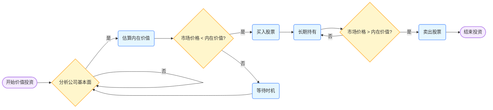

# 格雷厄姆的价值投资名言解读

> 关键词：格雷厄姆、价值投资、名言解读、投资理念、金融市场

> 摘要：本文围绕格雷厄姆的价值投资名言展开深入解读。格雷厄姆作为价值投资理论的奠基人，其名言蕴含着深刻的投资智慧。文章首先介绍背景信息，包括目的范围、预期读者等，接着阐述价值投资的核心概念与联系，分析相关算法原理及操作步骤，探讨其中的数学模型和公式，通过项目实战案例加深理解，列举实际应用场景，推荐学习工具和资源，最后总结未来发展趋势与挑战，解答常见问题并提供扩展阅读资料，旨在帮助投资者更好地理解和运用格雷厄姆的价值投资理念。

## 1. 背景介绍 
### 1.1 目的和范围
本文章的目的在于对格雷厄姆的价值投资名言进行全面、深入的解读。格雷厄姆被誉为“价值投资之父”，他的投资思想和名言对金融市场产生了深远的影响。通过解读他的名言，我们希望投资者能够更好地理解价值投资的本质和精髓，掌握价值投资的方法和策略，从而在投资实践中做出更加明智的决策。
本文的范围将涵盖格雷厄姆的经典名言，从名言的字面含义出发，深入剖析其背后的投资理念和逻辑，结合实际案例和市场情况进行分析，同时探讨这些名言在不同市场环境下的应用和局限性。

### 1.2 预期读者
本文的预期读者主要包括以下几类人群：
1. **投资者**：无论是个人投资者还是机构投资者，都可以从对格雷厄姆名言的解读中获得启发，提升自己的投资水平和决策能力。
2. **金融从业者**：如证券分析师、基金经理等，他们可以通过深入理解格雷厄姆的价值投资理念，为客户提供更专业的投资建议和服务。
3. **金融专业学生**：对于学习金融专业的学生来说，了解格雷厄姆的价值投资思想是学习投资学的重要内容，本文可以帮助他们更好地理解和掌握相关知识。
4. **对金融市场和投资感兴趣的人士**：即使没有专业的金融知识，也可以通过阅读本文，了解价值投资的基本概念和方法，培养正确的投资观念。

### 1.3 文档结构概述
本文将按照以下结构进行组织：
1. **核心概念与联系**：介绍价值投资的核心概念，以及格雷厄姆名言与价值投资理论的联系。
2. **核心算法原理 & 具体操作步骤**：虽然价值投资并非严格意义上的算法，但会介绍一些与价值投资相关的分析方法和操作步骤。
3. **数学模型和公式 & 详细讲解 & 举例说明**：探讨价值投资中可能涉及的数学模型和公式，并通过具体例子进行说明。
4. **项目实战：代码实际案例和详细解释说明**：以 Python 代码为例，展示如何运用价值投资理念进行股票分析。
5. **实际应用场景**：列举价值投资在不同市场环境下的实际应用场景。
6. **工具和资源推荐**：推荐学习价值投资的相关工具、资源和论文著作。
7. **总结：未来发展趋势与挑战**：总结格雷厄姆价值投资理念的未来发展趋势和面临的挑战。
8. **附录：常见问题与解答**：解答读者在阅读过程中可能遇到的常见问题。
9. **扩展阅读 & 参考资料**：提供进一步学习和研究的扩展阅读资料和参考书目。

### 1.4 术语表
#### 1.4.1 核心术语定义
1. **价值投资**：一种投资策略，强调通过分析公司的基本面，寻找被市场低估的股票，并长期持有，以获得合理的投资回报。
2. **安全边际**：指股票的内在价值与市场价格之间的差距，安全边际越大，投资风险越低。
3. **内在价值**：公司的真实价值，通常通过对公司的财务状况、盈利能力、行业前景等因素进行分析和评估得出。
4. **市场先生**：格雷厄姆提出的一个概念，将市场比喻为一个情绪不稳定的先生，他每天都会给投资者提供一个买卖价格，但这个价格并不一定反映股票的真实价值。

#### 1.4.2 相关概念解释
1. **基本面分析**：通过研究公司的财务报表、行业竞争状况、管理层能力等基本面因素，来评估公司的价值和投资潜力。
2. **长期投资**：指投资者持有股票的时间较长，通常为数年甚至数十年，以获取公司长期发展带来的收益。
3. **分散投资**：将资金分散投资于不同的股票、行业或资产类别，以降低投资风险。

#### 1.4.3 缩略词列表
1. **PE**：市盈率，即股票价格与每股收益的比率，用于衡量股票的估值水平。
2. **PB**：市净率，即股票价格与每股净资产的比率，也是衡量股票估值的重要指标之一。
3. **ROE**：净资产收益率，反映公司利用自有资本获取收益的能力。

## 2. 核心概念与联系 

### 价值投资的核心概念
价值投资的核心在于寻找被市场低估的股票，即股票的市场价格低于其内在价值。投资者通过对公司的基本面进行深入分析，评估公司的内在价值，并在市场价格低于内在价值时买入股票，等待市场价格回归内在价值，从而获得投资收益。

价值投资强调以下几个重要概念：
1. **安全边际**：格雷厄姆认为，投资者应该在买入股票时留有足够的安全边际，以降低投资风险。安全边际可以通过多种方式实现，如购买低市盈率、低市净率的股票，或者选择具有稳定现金流和良好盈利能力的公司。
2. **内在价值**：内在价值是价值投资的核心概念之一。它是公司的真实价值，不受市场短期波动的影响。投资者需要通过对公司的财务报表、行业竞争状况、管理层能力等因素进行分析和评估，来估算公司的内在价值。
3. **市场先生**：格雷厄姆将市场比喻为一个情绪不稳定的先生，他每天都会给投资者提供一个买卖价格，但这个价格并不一定反映股票的真实价值。投资者应该利用市场先生的情绪波动，在他提供低价时买入股票，在他提供高价时卖出股票。

### 格雷厄姆名言与价值投资理论的联系
格雷厄姆有许多经典的投资名言，这些名言深刻地反映了他的价值投资理念。以下是一些名言及其与价值投资理论的联系：
1. “市场短期是投票机，长期是称重机。”
这句话表明，市场在短期内可能会受到投资者情绪和市场炒作的影响，股票价格可能会偏离其内在价值。但从长期来看，市场会回归理性，股票价格会反映公司的真实价值。这与价值投资强调的长期投资和基本面分析相符合。
2. “投资操作是基于全面的分析，确保本金的安全和满意的回报。不符合这些要求的操作是投机。”
这句话明确了投资和投机的区别。价值投资强调通过全面的分析来评估股票的内在价值，确保本金的安全，并获得满意的回报。而投机则是基于短期的市场波动和炒作，追求快速的利润，往往忽视了公司的基本面和投资风险。
3. “安全边际就是价值与价格相比被低估的程度或幅度。”
这句话直接阐述了安全边际的概念。价值投资要求投资者在买入股票时，要确保股票的市场价格低于其内在价值，从而获得足够的安全边际。安全边际可以降低投资风险，提高投资回报率。

### 核心概念原理和架构的文本示意图
```plaintext
价值投资
|
|-- 核心概念
|   |-- 安全边际
|   |-- 内在价值
|   |-- 市场先生
|
|-- 投资方法
|   |-- 基本面分析
|   |-- 长期投资
|   |-- 分散投资
|
|-- 投资目标
|   |-- 本金安全
|   |-- 满意回报
```

### Mermaid 流程图


## 3. 核心算法原理 & 具体操作步骤 

### 核心算法原理
虽然价值投资并非严格意义上的算法，但可以通过一些分析方法和指标来评估股票的价值和投资潜力。以下是一些常用的算法原理：
1. **市盈率法**：市盈率（PE）是股票价格与每股收益的比率。计算公式为：$PE = \frac{股价}{每股收益}$。一般来说，市盈率越低，股票的估值越低，投资价值越高。但需要注意的是，不同行业的市盈率水平可能存在较大差异，因此在使用市盈率法时，需要结合行业平均水平进行分析。
2. **市净率法**：市净率（PB）是股票价格与每股净资产的比率。计算公式为：$PB = \frac{股价}{每股净资产}$。市净率反映了股票价格相对于公司净资产的倍数，市净率越低，股票的估值越低，投资价值越高。同样，不同行业的市净率水平也可能存在差异。
3. **股息折现模型（DDM）**：股息折现模型是一种基于股息的估值方法，它认为股票的内在价值等于未来股息的现值之和。计算公式为：$V = \sum_{t=1}^{\infty} \frac{D_t}{(1 + r)^t}$，其中 $V$ 表示股票的内在价值，$D_t$ 表示第 $t$ 期的股息，$r$ 表示折现率。股息折现模型适用于那些稳定分红的公司。

### 具体操作步骤
以下是运用价值投资理念进行股票投资的具体操作步骤：
1. **选择投资标的**：首先，投资者需要选择符合自己投资风格和风险承受能力的投资标的。可以从不同行业、不同规模的公司中进行筛选，重点关注那些具有稳定现金流、良好盈利能力和较低负债水平的公司。
2. **进行基本面分析**：对选择的投资标的进行全面的基本面分析，包括分析公司的财务报表、行业竞争状况、管理层能力等因素。通过基本面分析，评估公司的内在价值和投资潜力。
3. **估算内在价值**：根据基本面分析的结果，运用合适的估值方法（如市盈率法、市净率法、股息折现模型等）估算公司的内在价值。
4. **比较市场价格和内在价值**：将估算的内在价值与股票的市场价格进行比较，如果市场价格低于内在价值，且存在足够的安全边际，则可以考虑买入股票。
5. **制定投资计划**：在买入股票之前，制定详细的投资计划，包括投资金额、投资期限、止损点和止盈点等。投资计划应该根据自己的风险承受能力和投资目标进行制定。
6. **长期持有**：一旦买入股票，应该坚持长期持有，避免受到市场短期波动的影响。长期持有可以让投资者分享公司长期发展带来的收益。
7. **定期评估和调整**：定期对投资组合进行评估和调整，根据公司的基本面变化和市场情况，及时调整投资组合，确保投资组合的合理性和稳定性。

### Python 源代码实现
以下是一个简单的 Python 代码示例，用于计算股票的市盈率和市净率：

```python
# 定义股票价格、每股收益和每股净资产
stock_price = 50
earnings_per_share = 5
book_value_per_share = 20

# 计算市盈率
pe_ratio = stock_price / earnings_per_share

# 计算市净率
pb_ratio = stock_price / book_value_per_share

# 输出结果
print(f"市盈率: {pe_ratio}")
print(f"市净率: {pb_ratio}")
```

在上述代码中，我们首先定义了股票价格、每股收益和每股净资产，然后分别计算了市盈率和市净率，并将结果输出。通过计算市盈率和市净率，投资者可以初步评估股票的估值水平。

## 4. 数学模型和公式 & 详细讲解 & 举例说明 

### 市盈率模型
#### 公式
市盈率（PE）的计算公式为：$PE = \frac{股价}{每股收益}$

#### 详细讲解
市盈率是衡量股票估值的常用指标之一，它反映了投资者为获得每一元的收益所愿意支付的价格。一般来说，市盈率越低，股票的估值越低，投资价值越高。但需要注意的是，市盈率受到多种因素的影响，如公司的盈利增长速度、行业竞争状况、宏观经济环境等。因此，在使用市盈率进行估值时，需要结合其他因素进行综合分析。

#### 举例说明
假设某公司的股票价格为 50 元，每股收益为 5 元，则该公司的市盈率为：$PE = \frac{50}{5} = 10$。这意味着投资者为获得该公司每一元的收益，愿意支付 10 元的价格。如果该行业的平均市盈率为 15，则该公司的股票可能被低估，具有一定的投资价值。

### 市净率模型
#### 公式
市净率（PB）的计算公式为：$PB = \frac{股价}{每股净资产}$

#### 详细讲解
市净率反映了股票价格相对于公司净资产的倍数，它衡量了公司的资产质量和市场对公司的估值。一般来说，市净率越低，股票的估值越低，投资价值越高。但同样需要注意的是，不同行业的市净率水平可能存在较大差异，因此在使用市净率进行估值时，需要结合行业平均水平进行分析。

#### 举例说明
假设某公司的股票价格为 50 元，每股净资产为 20 元，则该公司的市净率为：$PB = \frac{50}{20} = 2.5$。这意味着该公司的股票价格是其每股净资产的 2.5 倍。如果该行业的平均市净率为 3，则该公司的股票可能被低估，具有一定的投资价值。

### 股息折现模型（DDM）
#### 公式
股息折现模型的基本公式为：$V = \sum_{t=1}^{\infty} \frac{D_t}{(1 + r)^t}$，其中 $V$ 表示股票的内在价值，$D_t$ 表示第 $t$ 期的股息，$r$ 表示折现率。

在实际应用中，为了简化计算，通常会采用一些假设条件，如股息固定增长模型。假设股息以固定增长率 $g$ 增长，则股息折现模型可以简化为：$V = \frac{D_1}{r - g}$，其中 $D_1$ 表示下一期的股息。

#### 详细讲解
股息折现模型的基本思想是，股票的内在价值等于未来股息的现值之和。投资者购买股票的目的是为了获得股息收益，因此股票的价值应该取决于其未来股息的大小和时间分布。折现率 $r$ 反映了投资者对投资风险的要求，风险越高，折现率越高。

#### 举例说明
假设某公司预计下一期的股息为 2 元，股息增长率为 5%，投资者要求的折现率为 10%。则该公司股票的内在价值为：$V = \frac{2}{0.1 - 0.05} = 40$ 元。如果该公司的股票市场价格为 35 元，则该股票可能被低估，具有一定的投资价值。

## 5. 项目实战：代码实际案例和详细解释说明 

### 5.1 开发环境搭建
为了实现价值投资的项目实战，我们需要搭建相应的开发环境。以下是具体的搭建步骤：
1. **安装 Python**：Python 是一种广泛使用的编程语言，具有丰富的数据分析和科学计算库。可以从 Python 官方网站（https://www.python.org/downloads/）下载并安装 Python。
2. **安装必要的库**：在 Python 环境中，我们需要安装一些必要的库，如 Pandas、Numpy、Matplotlib 等。可以使用以下命令进行安装：
```bash
pip install pandas numpy matplotlib
```
3. **获取股票数据**：可以使用第三方库（如 Pandas Datareader）从雅虎财经等网站获取股票数据。使用以下命令安装 Pandas Datareader：
```bash
pip install pandas-datareader
```

### 5.2 源代码详细实现和代码解读
以下是一个完整的 Python 代码示例，用于获取股票数据、计算市盈率和市净率，并进行简单的估值分析：

```python
import pandas as pd
import pandas_datareader.data as web
import datetime

# 定义获取股票数据的函数
def get_stock_data(ticker, start_date, end_date):
    try:
        data = web.DataReader(ticker, 'yahoo', start_date, end_date)
        return data
    except Exception as e:
        print(f"获取股票数据时出现错误: {e}")
        return None

# 定义计算市盈率和市净率的函数
def calculate_ratios(stock_data, earnings_per_share, book_value_per_share):
    # 获取最新的股票价格
    latest_price = stock_data['Close'][-1]
    
    # 计算市盈率
    pe_ratio = latest_price / earnings_per_share
    
    # 计算市净率
    pb_ratio = latest_price / book_value_per_share
    
    return pe_ratio, pb_ratio

# 主函数
def main():
    # 定义股票代码和时间范围
    ticker = 'AAPL'
    start_date = datetime.datetime(2020, 1, 1)
    end_date = datetime.datetime(2023, 12, 31)
    
    # 获取股票数据
    stock_data = get_stock_data(ticker, start_date, end_date)
    
    if stock_data is not None:
        # 假设已知每股收益和每股净资产
        earnings_per_share = 5
        book_value_per_share = 20
        
        # 计算市盈率和市净率
        pe_ratio, pb_ratio = calculate_ratios(stock_data, earnings_per_share, book_value_per_share)
        
        # 输出结果
        print(f"股票代码: {ticker}")
        print(f"市盈率: {pe_ratio}")
        print(f"市净率: {pb_ratio}")
        
        # 简单的估值分析
        if pe_ratio < 15 and pb_ratio < 2:
            print("该股票可能被低估，具有投资价值。")
        else:
            print("该股票可能被高估，需谨慎投资。")

if __name__ == "__main__":
    main()
```

### 代码解读与分析
1. **获取股票数据**：`get_stock_data` 函数使用 `pandas_datareader` 库从雅虎财经获取指定股票在指定时间范围内的数据。如果获取数据过程中出现错误，将打印错误信息并返回 `None`。
2. **计算市盈率和市净率**：`calculate_ratios` 函数根据获取的股票数据和已知的每股收益、每股净资产，计算市盈率和市净率。
3. **主函数**：`main` 函数是程序的入口，它定义了股票代码和时间范围，调用 `get_stock_data` 函数获取股票数据，然后调用 `calculate_ratios` 函数计算市盈率和市净率。最后，根据计算结果进行简单的估值分析，并输出相应的信息。

通过这个代码示例，我们可以看到如何使用 Python 实现价值投资的基本分析方法，包括获取股票数据、计算估值指标和进行简单的估值分析。

## 6. 实际应用场景 
### 股票投资
价值投资理念在股票投资中具有广泛的应用。投资者可以通过分析公司的基本面，寻找被市场低估的股票，并长期持有，以获得合理的投资回报。例如，巴菲特就是价值投资的坚定实践者，他通过深入研究公司的基本面，挖掘出了许多具有长期投资价值的股票，如可口可乐、苹果等。

### 基金投资
在基金投资中，价值投资理念也可以作为选择基金的重要参考。投资者可以选择那些遵循价值投资理念的基金，这些基金通常会注重对公司基本面的分析，寻找被低估的股票进行投资。例如，一些价值型基金在市场下跌时，由于持有被低估的股票，往往能够表现出较好的抗跌性。

### 债券投资
虽然价值投资主要应用于股票投资，但在债券投资中也可以借鉴价值投资的理念。投资者可以通过分析债券的基本面，如发行人的信用状况、债券的票面利率、到期时间等，寻找被市场低估的债券进行投资。例如，当市场利率上升时，债券价格通常会下跌，此时投资者可以选择那些信用状况良好、票面利率较高的债券进行投资，以获得较高的收益。

### 房地产投资
在房地产投资中，价值投资理念同样适用。投资者可以通过分析房地产的基本面，如地理位置、周边配套设施、房屋质量等，寻找被市场低估的房地产项目进行投资。例如，在一些新兴的城市区域，由于基础设施建设不断完善，房地产价格可能会被低估，此时投资者可以选择在这些区域进行投资，等待房地产价格上涨。

## 7. 工具和资源推荐
### 7.1 学习资源推荐
#### 7.1.1 书籍推荐
1. 《聪明的投资者》（The Intelligent Investor）：格雷厄姆的经典著作，被誉为投资界的“圣经”，详细阐述了价值投资的理念和方法。
2. 《证券分析》（Security Analysis）：同样是格雷厄姆的重要著作，对证券分析的基本原理和方法进行了系统的介绍。
3. 《巴菲特致股东的信》（Letters to Shareholders of Berkshire Hathaway）：巴菲特每年写给股东的信，包含了他的投资思想和经验，是学习价值投资的宝贵资料。
4. 《穷查理宝典》（Poor Charlie's Almanack）：收录了查理·芒格的演讲和文章，介绍了他的多元思维模型和投资哲学。

#### 7.1.2 在线课程
1. Coursera 上的“投资学原理”（Principles of Investing）：由知名教授授课，系统介绍了投资学的基本原理和方法，包括价值投资。
2. edX 上的“金融市场”（Financial Markets）：耶鲁大学教授罗伯特·席勒主讲，讲解了金融市场的运作机制和投资策略。
3. 中国大学 MOOC 上的“投资学”：国内高校开设的投资学课程，涵盖了价值投资的相关内容。

#### 7.1.3 技术博客和网站
1. 雪球网（https://xueqiu.com/）：国内知名的投资社区，提供股票、基金等投资产品的分析和讨论，有很多价值投资者分享自己的投资经验和观点。
2. Seeking Alpha（https://seekingalpha.com/）：国外的投资分析网站，提供大量的股票研究报告和投资策略分析。
3. 价值投资网（https://www.value-investing.net/）：专注于价值投资的网站，提供价值投资的理论知识、案例分析和投资工具。

### 7.2 开发工具框架推荐
#### 7.2.1 IDE和编辑器
1. PyCharm：一款专业的 Python 集成开发环境，具有丰富的代码编辑、调试和分析功能，适合进行价值投资相关的数据分析和编程。
2. Jupyter Notebook：一个交互式的编程环境，支持 Python 等多种编程语言，方便进行数据探索和可视化分析，非常适合进行价值投资的研究和实践。
3. Visual Studio Code：一款轻量级的代码编辑器，支持多种编程语言和插件扩展，可以通过安装相关插件来进行 Python 开发和数据分析。

#### 7.2.2 调试和性能分析工具
1. PDB：Python 自带的调试工具，可以帮助开发者在代码执行过程中进行调试，定位问题和查看变量值。
2. cProfile：Python 标准库中的性能分析工具，可以分析代码的执行时间和函数调用次数，帮助开发者优化代码性能。
3. Py-Spy：一个跨平台的 Python 性能分析工具，可以实时监控 Python 程序的性能，找出性能瓶颈。

#### 7.2.3 相关框架和库
1. Pandas：一个强大的数据分析库，提供了高效的数据结构和数据处理功能，非常适合进行股票数据的分析和处理。
2. Numpy：Python 的科学计算库，提供了高效的数组操作和数学函数，用于数值计算和数据分析。
3. Matplotlib：一个用于数据可视化的库，可以绘制各种类型的图表，如折线图、柱状图、散点图等，帮助开发者直观地展示数据。

### 7.3 相关论文著作推荐
#### 7.3.1 经典论文
1. Graham, Benjamin, and David L. Dodd. "Security Analysis." McGraw-Hill, 1934. 这是格雷厄姆和多德的经典著作，奠定了价值投资的理论基础。
2. Fama, Eugene F., and Kenneth R. French. "The Cross-Section of Expected Stock Returns." Journal of Finance 47, no. 2 (1992): 427-465. 该论文提出了著名的 Fama-French 三因子模型，对股票收益的影响因素进行了深入研究。
3. Buffett, Warren E. "The Superinvestors of Graham-and-Doddsville." Hermes 17, no. 1 (1984): 4-24. 巴菲特在这篇文章中介绍了格雷厄姆的价值投资理念，并列举了一些遵循该理念取得成功的投资者案例。

#### 7.3.2 最新研究成果
1. Asness, Clifford S., Andrea Frazzini, and Lasse Heje Pedersen. "Quality Minus Junk." Review of Accounting Studies 21, no. 1 (2016): 345-385. 该论文提出了“质量减去垃圾”（Quality Minus Junk）的投资策略，对价值投资的理念进行了拓展。
2. Harvey, Campbell R., Yan Liu, and Heqing Zhu. "… and the Cross-Section of Expected Returns." Review of Financial Studies 29, no. 1 (2016): 5-68. 这篇论文对股票收益的影响因素进行了全面的研究，为价值投资提供了新的理论支持。

#### 7.3.3 应用案例分析
1. Greenwald, Bruce C. N., Judd Kahn, Paul D. Sonkin, and Michael van Biema. "Value Investing: From Graham to Buffett and Beyond." Wiley, 2001. 该书通过大量的案例分析，介绍了价值投资的实践方法和策略。
2. Klarman, Seth A. "Margin of Safety: Risk-Averse Value Investing Strategies for the Thoughtful Investor." HarperBusiness, 1991. 书中包含了许多价值投资的实际案例，强调了安全边际在投资中的重要性。

## 8. 总结：未来发展趋势与挑战
### 未来发展趋势
1. **与科技的融合**：随着科技的不断发展，价值投资将与人工智能、大数据等技术更加紧密地结合。通过运用这些技术，投资者可以更高效地进行基本面分析和估值计算，挖掘出更多被低估的投资机会。
2. **全球化投资**：全球经济一体化的趋势使得投资者可以更加方便地进行全球化投资。价值投资者将有更多的机会在不同国家和地区寻找被低估的资产，实现资产的多元化配置。
3. **社会责任投资**：越来越多的投资者开始关注企业的社会责任，将环境、社会和治理（ESG）因素纳入投资决策的考虑范围。价值投资也将逐渐与社会责任投资相结合，寻找那些具有良好 ESG 表现的被低估企业。

### 挑战
1. **市场有效性的挑战**：随着市场的发展和信息传播的加速，市场的有效性不断提高，寻找被低估的股票变得越来越困难。价值投资者需要不断提高自己的分析能力和洞察力，才能在市场中发现投资机会。
2. **宏观经济环境的不确定性**：宏观经济环境的不确定性增加了价值投资的难度。例如，经济衰退、通货膨胀、利率波动等因素都会对企业的盈利和估值产生影响，价值投资者需要更加关注宏观经济环境的变化，及时调整投资策略。
3. **新兴行业的估值难题**：随着科技的快速发展，新兴行业不断涌现，如人工智能、区块链、生物医药等。这些行业的企业往往具有较高的成长性和不确定性，传统的估值方法可能无法准确评估其价值。价值投资者需要探索新的估值方法和分析框架，以适应新兴行业的投资需求。

## 9. 附录：常见问题与解答
### 问题 1：价值投资是否只适用于股票投资？
答：不是的，价值投资的理念可以应用于多种投资领域，如基金投资、债券投资、房地产投资等。在不同的投资领域中，价值投资的具体方法和指标可能会有所不同，但核心思想都是寻找被低估的资产，并长期持有以获得合理的回报。

### 问题 2：如何确定股票的内在价值？
答：确定股票的内在价值是价值投资的关键，但也是一个复杂的过程。常用的方法包括市盈率法、市净率法、股息折现模型等。此外，还需要对公司的基本面进行全面的分析，包括财务状况、盈利能力、行业竞争状况、管理层能力等因素。需要注意的是，内在价值的估算具有一定的主观性，不同的投资者可能会得出不同的结果。

### 问题 3：价值投资需要长期持有股票，那么如何应对市场的短期波动？
答：价值投资强调长期持有股票，不被市场的短期波动所影响。投资者应该认识到，市场的短期波动是正常的，而且往往是由投资者情绪和市场炒作等因素引起的。在市场下跌时，投资者应该保持冷静，评估公司的基本面是否发生了变化。如果公司的基本面没有发生变化，且股票价格仍然低于其内在价值，那么可以考虑继续持有股票，甚至可以适当加仓。

### 问题 4：价值投资和成长投资有什么区别？
答：价值投资和成长投资是两种不同的投资策略。价值投资注重寻找被市场低估的股票，强调股票的估值和安全边际；而成长投资则注重寻找具有高成长性的股票，强调公司的盈利增长速度和潜力。价值投资更关注公司的当前价值，而成长投资更关注公司的未来价值。在实际投资中，投资者可以根据自己的投资目标和风险承受能力，选择适合自己的投资策略。

## 10. 扩展阅读 & 参考资料
### 扩展阅读
1. 《金融炼金术》（The Alchemy of Finance）：乔治·索罗斯的著作，介绍了他的反身性理论和投资哲学。
2. 《漫步华尔街》（A Random Walk Down Wall Street）：伯顿·马尔基尔的经典著作，对有效市场假说和投资策略进行了深入探讨。
3. 《投资最重要的事》（The Most Important Thing Illuminated）：霍华德·马克斯的著作，分享了他的投资经验和智慧。

### 参考资料
1. Graham, Benjamin. "The Intelligent Investor." HarperBusiness, 2003.
2. Buffett, Warren E. "Annual Letters to Shareholders of Berkshire Hathaway." Berkshire Hathaway Inc., various years.
3. Fama, Eugene F., and Kenneth R. French. "Common Risk Factors in the Returns on Stocks and Bonds." Journal of Financial Economics 33, no. 1 (1993): 3-56.

作者：AI天才研究院/AI Genius Institute & 禅与计算机程序设计艺术 /Zen And The Art of Computer Programming