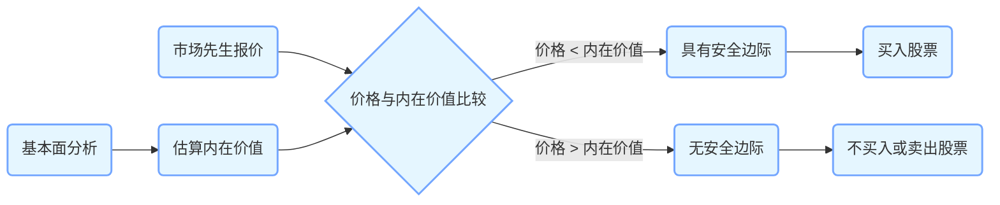

# 格雷厄姆的价值投资实践案例

> 关键词：格雷厄姆、价值投资、实践案例、财务分析、安全边际

> 摘要：本文聚焦于格雷厄姆的价值投资实践案例，深入剖析价值投资的核心原理与操作方法。通过对格雷厄姆投资理念的详细解读，结合具体的投资案例，展示如何运用价值投资策略进行股票选择和投资决策。同时，探讨价值投资在不同市场环境下的应用和挑战，为投资者提供有价值的参考和启示。

## 1. 背景介绍 
### 1.1 目的和范围
本文章的目的是深入研究格雷厄姆的价值投资实践案例，揭示价值投资的精髓和实际应用方法。我们将通过分析格雷厄姆的投资理念、具体投资案例以及背后的决策逻辑，为投资者提供一套可操作的价值投资框架。范围涵盖格雷厄姆的主要投资思想、经典投资案例的详细分析以及价值投资在现代市场中的应用和发展。

### 1.2 预期读者
本文预期读者包括对价值投资感兴趣的投资者、金融从业者、经济学者以及希望学习投资知识的初学者。无论是专业人士还是普通投资者，都可以从本文中获取关于价值投资的深入理解和实用经验。

### 1.3 文档结构概述
本文将按照以下结构展开：首先介绍格雷厄姆价值投资的核心概念和联系，包括其投资理念的形成背景和主要原则；接着详细阐述价值投资的核心算法原理和具体操作步骤，结合 Python 代码进行说明；然后介绍价值投资所涉及的数学模型和公式，并通过实际案例进行详细讲解；之后通过具体的项目实战，展示如何运用价值投资策略进行股票分析和投资决策；再探讨价值投资的实际应用场景和面临的挑战；推荐相关的学习资源、开发工具和论文著作；最后总结价值投资的未来发展趋势，并对常见问题进行解答，同时提供扩展阅读和参考资料。

### 1.4 术语表
#### 1.4.1 核心术语定义
- **价值投资**：一种基于公司内在价值进行投资的策略，投资者通过分析公司的财务状况、盈利能力、竞争优势等因素，寻找被市场低估的股票进行投资。
- **内在价值**：公司未来现金流的现值，是评估公司真实价值的重要指标。
- **安全边际**：股票的市场价格低于其内在价值的差额，是价值投资的重要原则之一，用于降低投资风险。
- **净流动资产**：流动资产减去流动负债后的余额，反映公司短期内可变现的资产价值。

#### 1.4.2 相关概念解释
- **财务报表分析**：通过对公司资产负债表、利润表和现金流量表等财务报表的分析，了解公司的财务状况和经营成果。
- **估值模型**：用于估算公司内在价值的数学模型，常见的有股息折现模型、现金流折现模型等。
- **市场效率**：市场价格反映公司内在价值的程度，有效市场假说认为市场价格能够迅速反映所有可用信息。

#### 1.4.3 缩略词列表
- **EPS**：每股收益（Earnings Per Share），反映公司每股股票的盈利水平。
- **P/E**：市盈率（Price-to-Earnings Ratio），股票价格与每股收益的比率，用于评估股票的估值水平。
- **ROE**：净资产收益率（Return on Equity），反映公司运用自有资本的效率。

## 2. 核心概念与联系 
### 格雷厄姆价值投资的核心思想
格雷厄姆被尊称为“价值投资之父”，他的价值投资理念主要基于以下几个核心思想：
- **内在价值**：公司存在一个客观的内在价值，它不依赖于市场价格而存在。内在价值是由公司的资产、盈利能力、现金流等基本面因素决定的。投资者的任务就是通过深入分析，估算出公司的内在价值。
- **安全边际**：为了降低投资风险，投资者应该在股票价格低于其内在价值时买入。安全边际就像是一道缓冲带，即使公司的实际表现不如预期，投资者也能在一定程度上避免损失。
- **市场先生**：格雷厄姆将市场比喻成“市场先生”，市场先生每天都会出现，给股票报出一个价格。有时市场先生会情绪高涨，给出过高的价格；有时又会情绪低落，给出过低的价格。投资者应该利用市场先生的情绪波动，而不是被其左右。

### 核心概念的联系
内在价值是价值投资的基础，安全边际是实现价值投资的保障，而市场先生的存在为投资者提供了获取超额收益的机会。投资者通过分析公司的内在价值，判断市场先生给出的价格是否具有足够的安全边际。如果市场先生给出的价格低于内在价值，且安全边际足够大，投资者就可以买入股票。当市场先生情绪好转，给出的价格高于内在价值时，投资者就可以卖出股票，实现盈利。

### 文本示意图
```plaintext
内在价值 <--- 基本面分析
        |
        |-- 安全边际 ---> 投资决策（买入/卖出）
        |
市场先生（价格波动）
```

### Mermaid 流程图


## 3. 核心算法原理 & 具体操作步骤 
### 估算内在价值的基本算法
格雷厄姆提出了一种简单的估算内在价值的方法，对于盈利稳定的公司，可以使用以下公式：
$$V = EPS \times (8.5 + 2g)$$
其中，$V$ 表示内在价值，$EPS$ 表示每股收益，$g$ 表示公司未来 7 - 10 年的预期增长率。

### Python 代码实现
```python
def estimate_intrinsic_value(eps, growth_rate):
    """
    估算公司的内在价值
    :param eps: 每股收益
    :param growth_rate: 预期增长率
    :return: 内在价值
    """
    return eps * (8.5 + 2 * growth_rate)

# 示例
eps = 2.0
growth_rate = 0.05  # 5% 的预期增长率
intrinsic_value = estimate_intrinsic_value(eps, growth_rate)
print(f"公司的内在价值为: {intrinsic_value}")
```

### 具体操作步骤
1. **收集数据**：收集公司的财务报表，包括资产负债表、利润表和现金流量表，获取每股收益等关键数据。
2. **分析公司基本面**：评估公司的盈利能力、竞争优势、行业前景等因素，确定公司未来的预期增长率。
3. **估算内在价值**：使用上述公式或其他合适的估值模型，估算公司的内在价值。
4. **比较市场价格和内在价值**：计算安全边际，即内在价值与市场价格的差额。如果安全边际足够大，说明股票被低估，可以考虑买入。
5. **做出投资决策**：根据安全边际的大小和其他因素，如投资组合的平衡、风险承受能力等，做出买入、持有或卖出的决策。

## 4. 数学模型和公式 & 详细讲解 & 举例说明 
### 股息折现模型（Dividend Discount Model, DDM）
股息折现模型是一种常用的估值模型，其基本思想是将公司未来的股息现金流折现到当前，得到公司的内在价值。

#### 公式
对于固定增长的股息折现模型，公式如下：
$$V = \frac{D_1}{r - g}$$
其中，$V$ 表示内在价值，$D_1$ 表示下一期的股息，$r$ 表示必要收益率，$g$ 表示股息的固定增长率。

#### 详细讲解
- **$D_1$**：下一期的股息可以根据公司过去的股息政策和盈利情况进行估算。
- **$r$**：必要收益率是投资者要求的最低收益率，通常可以根据市场利率、公司风险等因素确定。
- **$g$**：股息的固定增长率可以通过分析公司的历史股息增长情况和未来发展前景来估计。

#### 举例说明
假设某公司下一期的股息为 $2$ 元，必要收益率为 $10\%$，股息的固定增长率为 $5\%$。则该公司的内在价值为：
$$V = \frac{2}{0.1 - 0.05} = 40$$（元）

### 现金流折现模型（Discounted Cash Flow Model, DCF）
现金流折现模型是一种更全面的估值模型，它考虑了公司未来的所有自由现金流。

#### 公式
$$V = \sum_{t=1}^{n} \frac{FCF_t}{(1 + r)^t} + \frac{TV}{(1 + r)^n}$$
其中，$V$ 表示内在价值，$FCF_t$ 表示第 $t$ 期的自由现金流，$r$ 表示必要收益率，$n$ 表示预测期数，$TV$ 表示终值。

#### 详细讲解
- **$FCF_t$**：自由现金流是指公司在满足了所有运营和投资需求后剩余的现金流量，可以通过对公司的利润表和现金流量表进行调整得到。
- **$r$**：必要收益率的确定方法与股息折现模型相同。
- **$n$**：预测期数通常根据公司的行业特点和发展阶段来确定，一般为 5 - 10 年。
- **$TV$**：终值是指预测期结束后公司的价值，可以使用永续增长模型或退出倍数法进行估算。

#### 举例说明
假设某公司未来 5 年的自由现金流分别为 $100$ 万元、$120$ 万元、$140$ 万元、$160$ 万元和 $180$ 万元，必要收益率为 $10\%$，预测期结束后的终值为 $2000$ 万元。则该公司的内在价值为：
$$V = \frac{100}{(1 + 0.1)^1} + \frac{120}{(1 + 0.1)^2} + \frac{140}{(1 + 0.1)^3} + \frac{160}{(1 + 0.1)^4} + \frac{180}{(1 + 0.1)^5} + \frac{2000}{(1 + 0.1)^5}$$
```python
import numpy as np

fcf = np.array([100, 120, 140, 160, 180])
r = 0.1
n = 5
tv = 2000

present_value_fcf = sum([fcf[i] / (1 + r) ** (i + 1) for i in range(n)])
present_value_tv = tv / (1 + r) ** n

intrinsic_value = present_value_fcf + present_value_tv
print(f"公司的内在价值为: {intrinsic_value} 万元")
```

## 5. 项目实战：代码实际案例和详细解释说明 
### 5.1  开发环境搭建
- **Python 安装**：从 Python 官方网站（https://www.python.org/downloads/）下载并安装 Python 3.x 版本。
- **必要库安装**：使用 `pip` 命令安装所需的库，如 `pandas`、`numpy`、`yfinance` 等。
```sh
pip install pandas numpy yfinance
```

### 5.2  源代码详细实现和代码解读
以下是一个使用 Python 实现价值投资分析的示例代码：
```python
import yfinance as yf
import pandas as pd

def get_stock_data(ticker, start_date, end_date):
    """
    获取股票数据
    :param ticker: 股票代码
    :param start_date: 开始日期
    :param end_date: 结束日期
    :return: 股票数据 DataFrame
    """
    stock = yf.Ticker(ticker)
    data = stock.history(start=start_date, end=end_date)
    return data

def calculate_pe_ratio(data):
    """
    计算市盈率
    :param data: 股票数据 DataFrame
    :return: 市盈率
    """
    last_close = data['Close'].iloc[-1]
    eps = data['Earnings Per Share'].iloc[-1]
    pe_ratio = last_close / eps
    return pe_ratio

def analyze_stock(ticker, start_date, end_date):
    """
    分析股票
    :param ticker: 股票代码
    :param start_date: 开始日期
    :param end_date: 结束日期
    :return: 分析结果
    """
    data = get_stock_data(ticker, start_date, end_date)
    pe_ratio = calculate_pe_ratio(data)
    result = {
        'Ticker': ticker,
        'PE Ratio': pe_ratio
    }
    return result

# 示例
ticker = 'AAPL'
start_date = '2020-01-01'
end_date = '2021-01-01'
analysis_result = analyze_stock(ticker, start_date, end_date)
print(analysis_result)
```

### 代码解读与分析
- **`get_stock_data` 函数**：使用 `yfinance` 库获取指定股票在指定日期范围内的历史数据。
- **`calculate_pe_ratio` 函数**：根据股票的收盘价和每股收益计算市盈率。
- **`analyze_stock` 函数**：调用 `get_stock_data` 和 `calculate_pe_ratio` 函数，对股票进行分析，并返回分析结果。

通过这个示例代码，我们可以对股票的估值情况进行初步分析。市盈率是价值投资中常用的指标之一，较低的市盈率可能意味着股票被低估。

## 6. 实际应用场景 
### 股票投资
价值投资在股票投资中应用广泛。投资者通过分析公司的基本面，估算其内在价值，寻找被市场低估的股票进行投资。例如，在市场恐慌时期，许多股票的价格会大幅下跌，此时投资者可以利用价值投资的方法，筛选出那些具有安全边际的股票，等待市场情绪好转时实现盈利。

### 基金投资
价值投资理念也可以应用于基金投资。投资者可以选择那些遵循价值投资策略的基金，由专业的基金经理进行股票筛选和投资组合管理。例如，一些价值型基金通过挖掘被低估的股票，为投资者带来长期稳定的回报。

### 企业并购
在企业并购中，价值投资的思想同样重要。收购方需要对目标企业的内在价值进行准确评估，以确定合理的收购价格。通过分析目标企业的财务状况、盈利能力、市场竞争力等因素，收购方可以判断是否存在足够的安全边际，从而做出明智的决策。

### 房地产投资
虽然房地产市场与股票市场有所不同，但价值投资的理念也可以应用于房地产投资。投资者可以通过分析房地产的地理位置、租金收益、市场供需等因素，估算其内在价值。当房地产价格低于其内在价值时，投资者可以考虑买入，等待房产增值或获取租金收益。

## 7. 工具和资源推荐
### 7.1 学习资源推荐
#### 7.1.1 书籍推荐
- 《聪明的投资者》（The Intelligent Investor）：格雷厄姆的经典著作，被誉为价值投资的圣经，详细阐述了价值投资的理念和方法。
- 《证券分析》（Security Analysis）：同样是格雷厄姆的重要著作，对证券分析的理论和实践进行了系统的介绍。
- 《巴菲特致股东的信》（Letters to Shareholders of Berkshire Hathaway）：巴菲特每年写给股东的信，包含了他的投资思想和经验，是学习价值投资的宝贵资料。

#### 7.1.2 在线课程
- Coursera 上的“投资学原理”（Principles of Investing）：由知名教授授课，系统介绍投资学的基本原理和方法。
- edX 上的“价值投资与金融分析”（Value Investing and Financial Analysis）：深入讲解价值投资的理论和实践，通过案例分析帮助学员掌握投资技巧。

#### 7.1.3 技术博客和网站
- 雪球（https://xueqiu.com/）：国内知名的投资社区，提供股票、基金等投资产品的信息和分析，用户可以在这里交流投资经验和观点。
- Seeking Alpha（https://seekingalpha.com/）：国外知名的投资分析网站，汇聚了众多投资专家和分析师的文章和观点。

### 7.2 开发工具框架推荐
#### 7.2.1 IDE和编辑器
- PyCharm：功能强大的 Python 集成开发环境，提供代码编辑、调试、版本控制等功能，适合专业开发者使用。
- Jupyter Notebook：交互式的开发环境，支持 Python 代码的编写、运行和可视化展示，非常适合数据分析和机器学习项目。

#### 7.2.2 调试和性能分析工具
- PDB：Python 自带的调试工具，可以帮助开发者定位代码中的错误和问题。
- cProfile：Python 标准库中的性能分析工具，可以分析代码的运行时间和资源消耗情况。

#### 7.2.3 相关框架和库
- Pandas：用于数据处理和分析的 Python 库，提供了丰富的数据结构和函数，方便对金融数据进行处理和分析。
- Numpy：Python 的科学计算库，提供了高效的数组操作和数学函数，是许多数据分析和机器学习库的基础。
- yfinance：用于获取金融数据的 Python 库，可以方便地获取股票、基金等金融产品的历史数据。

### 7.3 相关论文著作推荐
#### 7.3.1 经典论文
- “The Theory of Investment Value” by John Burr Williams：提出了股息折现模型，为价值投资的估值提供了重要的理论基础。
- “Security Analysis” by Benjamin Graham and David Dodd：格雷厄姆和多德的经典著作，系统阐述了证券分析的理论和方法。

#### 7.3.2 最新研究成果
- 关注顶级金融学术期刊，如 the Journal of Finance、the Review of Financial Studies 等，了解价值投资领域的最新研究动态。
- 参加金融学术会议，与国内外的学者和专家交流，获取最新的研究成果。

#### 7.3.3 应用案例分析
- 研究一些知名价值投资者的投资案例，如巴菲特、芒格等，分析他们的投资决策过程和背后的逻辑。
- 关注一些投资机构的研究报告，了解他们在实际投资中的应用和实践经验。

## 8. 总结：未来发展趋势与挑战
### 未来发展趋势
- **数字化和智能化**：随着科技的发展，价值投资将越来越多地借助数字化和智能化工具。例如，利用大数据分析和人工智能算法进行公司基本面分析和估值，提高投资决策的效率和准确性。
- **全球多元化投资**：投资者将更加注重全球多元化投资，通过投资不同国家和地区的股票、债券等资产，分散投资风险，获取更广泛的投资机会。
- **社会责任投资**：越来越多的投资者开始关注企业的社会责任和可持续发展，将环境、社会和治理（ESG）因素纳入价值投资的考量范围。

### 挑战
- **市场有效性增强**：随着信息传播的速度加快和投资者教育的普及，市场的有效性可能会不断增强，寻找被低估股票的难度将增加。
- **宏观经济不确定性**：全球宏观经济环境的不确定性增加，如贸易摩擦、利率波动、通货膨胀等，将对价值投资带来挑战。投资者需要更加关注宏观经济因素的变化，及时调整投资策略。
- **新兴技术带来的挑战**：新兴技术的快速发展，如人工智能、区块链等，可能会对传统行业产生颠覆性影响。投资者需要不断学习和了解新兴技术，评估其对公司价值的影响。

## 9. 附录：常见问题与解答
### 问题 1：价值投资是否适合所有投资者？
价值投资并不适合所有投资者。价值投资需要投资者具备一定的财务知识和分析能力，能够对公司的基本面进行深入研究。同时，价值投资通常需要较长的投资周期，投资者需要有足够的耐心和定力。对于那些追求短期高收益、缺乏专业知识的投资者来说，价值投资可能并不是最佳选择。

### 问题 2：如何确定公司的内在价值？
确定公司的内在价值是价值投资的核心问题，但并没有一种绝对准确的方法。常见的方法包括股息折现模型、现金流折现模型、市盈率法、市净率法等。投资者可以综合运用多种方法，结合公司的基本面情况、行业前景、宏观经济环境等因素，对公司的内在价值进行估算。同时，还需要考虑到估值的不确定性和风险，留有一定的安全边际。

### 问题 3：价值投资是否意味着长期持有股票？
价值投资并不一定意味着长期持有股票。价值投资的核心是在股票价格低于其内在价值时买入，在价格高于内在价值时卖出。如果公司的基本面发生了重大变化，导致其内在价值下降，或者市场价格已经充分反映了公司的内在价值，投资者可以考虑卖出股票。因此，价值投资的持有期限取决于股票的估值情况和公司的基本面变化。

### 问题 4：如何应对市场波动？
市场波动是不可避免的，价值投资者应该正确看待市场波动。当市场下跌时，股票价格可能会低于其内在价值，这是价值投资者买入的机会。投资者应该保持冷静，不要被市场情绪所左右，坚持自己的投资策略。同时，可以通过分散投资、控制仓位等方式降低市场波动对投资组合的影响。

## 10. 扩展阅读 & 参考资料
### 扩展阅读
- 《怎样选择成长股》（Common Stocks and Uncommon Profits）：菲利普·费雪的经典著作，介绍了寻找成长股的方法和技巧。
- 《金融炼金术》（The Alchemy of Finance）：乔治·索罗斯的著作，阐述了他的反身性理论和投资哲学。
- 《黑天鹅》（The Black Swan）：纳西姆·尼古拉斯·塔勒布的著作，探讨了不可预测的重大事件对金融市场的影响。

### 参考资料
- 相关公司的财务报表和年报
- 金融数据提供商，如 Bloomberg、Wind 等
- 金融学术期刊和研究报告

作者：AI天才研究院/AI Genius Institute & 禅与计算机程序设计艺术 /Zen And The Art of Computer Programming