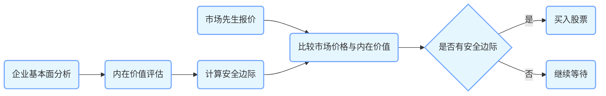

# 格雷厄姆的价值投资者应具备的素质

> 关键词：格雷厄姆、价值投资、投资者素质、基本面分析、风险控制

> 摘要：本文围绕格雷厄姆所倡导的价值投资理念，深入剖析价值投资者应具备的素质。从背景介绍入手，阐述格雷厄姆价值投资理论的起源与发展，明确文章目的、预期读者等内容。接着详细讲解价值投资的核心概念、核心算法原理及操作步骤，运用数学模型和公式进行说明，并通过实际案例展示价值投资在项目实战中的应用。还探讨了价值投资的实际应用场景，推荐相关工具和资源。最后总结价值投资的未来发展趋势与挑战，解答常见问题并提供扩展阅读和参考资料，旨在为投资者全面理解和实践价值投资提供指导。

## 1. 背景介绍 
### 1.1 目的和范围
本文章的主要目的是深入探讨格雷厄姆所提出的价值投资者应具备的素质。通过对格雷厄姆价值投资理论的研究和分析，详细阐述这些素质的内涵、重要性以及如何在实际投资中培养和运用这些素质。文章的范围涵盖了价值投资的基本概念、核心算法原理、数学模型、实际案例以及相关的工具和资源推荐等方面，旨在为投资者提供一个全面、系统的价值投资素质指南。

### 1.2 预期读者
本文预期读者主要包括对价值投资感兴趣的个人投资者，无论是初涉投资领域的新手，还是有一定投资经验但希望深入学习价值投资理念的投资者。同时，也适合金融专业的学生、研究人员以及从事投资相关工作的专业人士阅读，帮助他们更好地理解和应用格雷厄姆的价值投资理论。

### 1.3 文档结构概述
本文将按照以下结构进行阐述：首先介绍价值投资的背景信息，包括目的、预期读者和文档结构概述以及相关术语表。接着讲解价值投资的核心概念与联系，通过文本示意图和 Mermaid 流程图展示其原理和架构。然后详细阐述核心算法原理和具体操作步骤，使用 Python 源代码进行说明。之后运用数学模型和公式对价值投资进行详细讲解，并举例说明。再通过项目实战展示代码实际案例和详细解释。接着探讨价值投资的实际应用场景，推荐相关的工具和资源。最后总结价值投资的未来发展趋势与挑战，解答常见问题并提供扩展阅读和参考资料。

### 1.4 术语表
#### 1.4.1 核心术语定义
- **价值投资**：是一种通过对股票内在价值的分析，寻找被市场低估的股票进行投资的策略。投资者认为股票价格会围绕其内在价值波动，当股票价格低于内在价值时，就是买入的时机。
- **内在价值**：指的是股票所代表的企业的真实价值，它是基于企业的基本面因素，如盈利能力、资产状况、现金流等进行评估的。
- **安全边际**：是指股票的内在价值与市场价格之间的差额。安全边际越大，投资的风险就越低。

#### 1.4.2 相关概念解释
- **基本面分析**：是评估企业价值的一种方法，通过研究企业的财务报表、行业前景、管理层能力等基本面因素，来判断企业的内在价值和投资价值。
- **市场先生**：是格雷厄姆提出的一个概念，将市场比喻为一个情绪不稳定的“市场先生”，它每天都会给出不同的股票报价，投资者应该利用市场先生的情绪波动，而不是被其左右。

#### 1.4.3 缩略词列表
- **PE**：市盈率，是指股票价格与每股盈利的比率，用于衡量股票的估值水平。
- **PB**：市净率，是指股票价格与每股净资产的比率，反映了股票价格相对于净资产的倍数。

## 2. 核心概念与联系 
价值投资的核心概念主要包括内在价值、安全边际和市场先生。内在价值是价值投资的基础，它是企业未来现金流的折现。安全边际则是价值投资的保障，它可以降低投资风险。市场先生则是价值投资的机会创造者，投资者可以利用市场先生的情绪波动来寻找被低估的股票。

下面是价值投资核心概念原理和架构的文本示意图：

内在价值是价值投资的核心，它由企业的基本面因素决定，如盈利能力、资产状况、现金流等。安全边际是内在价值与市场价格之间的差额，它是价值投资的重要原则之一。市场先生则是一个情绪不稳定的参与者，它的报价会受到市场情绪、宏观经济环境等因素的影响。投资者通过对内在价值的评估和对市场先生报价的分析，寻找具有安全边际的投资机会。

下面是 Mermaid 流程图：


这个流程图展示了价值投资的基本流程。首先，投资者通过对企业基本面的分析来评估企业的内在价值。然后，计算内在价值与市场价格之间的安全边际。同时，关注市场先生给出的报价，并将市场价格与内在价值进行比较。如果存在安全边际，投资者就可以买入股票；如果不存在安全边际，则继续等待机会。

## 3. 核心算法原理 & 具体操作步骤 
### 核心算法原理
价值投资的核心算法原理主要基于对企业内在价值的评估。一种常用的方法是现金流折现法（DCF），其基本思想是将企业未来的现金流折现到当前，以得到企业的内在价值。

现金流折现法的公式为：
$$V = \sum_{t=1}^{n} \frac{CF_t}{(1 + r)^t}$$
其中，$V$ 表示企业的内在价值，$CF_t$ 表示第 $t$ 期的现金流，$r$ 表示折现率，$n$ 表示预测的期数。

### 具体操作步骤
1. **收集企业财务数据**：收集企业的财务报表，包括资产负债表、利润表和现金流量表，以获取企业的收入、成本、利润、现金流等信息。
2. **预测未来现金流**：根据企业的历史数据和行业前景，预测企业未来的现金流。可以采用不同的方法进行预测，如线性回归、时间序列分析等。
3. **确定折现率**：折现率反映了投资者对投资回报的要求，通常可以采用资本资产定价模型（CAPM）来确定折现率。
4. **计算内在价值**：将预测的未来现金流按照确定的折现率折现到当前，得到企业的内在价值。
5. **比较内在价值与市场价格**：将计算得到的内在价值与股票的市场价格进行比较，如果市场价格低于内在价值，则认为股票被低估，可以考虑买入。

### Python 源代码实现
```python
import numpy as np

def dcf_valuation(cash_flows, discount_rate):
    """
    计算企业的内在价值
    :param cash_flows: 未来现金流列表
    :param discount_rate: 折现率
    :return: 企业的内在价值
    """
    n = len(cash_flows)
    present_values = []
    for t in range(n):
        present_value = cash_flows[t] / ((1 + discount_rate) ** (t + 1))
        present_values.append(present_value)
    intrinsic_value = np.sum(present_values)
    return intrinsic_value

# 示例数据
cash_flows = [100, 120, 150, 180, 200]  # 未来 5 年的现金流
discount_rate = 0.1  # 折现率为 10%

# 计算内在价值
intrinsic_value = dcf_valuation(cash_flows, discount_rate)
print(f"企业的内在价值为: {intrinsic_value}")
```

在上述代码中，定义了一个 `dcf_valuation` 函数，用于计算企业的内在价值。该函数接受未来现金流列表和折现率作为输入，通过循环计算每一期现金流的现值，并将它们相加得到企业的内在价值。最后，使用示例数据调用该函数并打印计算结果。

## 4. 数学模型和公式 & 详细讲解 & 举例说明 
### 现金流折现法（DCF）
#### 公式详细讲解
现金流折现法的公式为：
$$V = \sum_{t=1}^{n} \frac{CF_t}{(1 + r)^t}$$
其中：
- $V$ 表示企业的内在价值，它是未来所有现金流折现到当前的总和。
- $CF_t$ 表示第 $t$ 期的现金流，是企业在第 $t$ 期实际产生的现金流入减去现金流出的净额。
- $r$ 表示折现率，它反映了投资者对投资回报的要求，考虑了投资的风险和资金的时间价值。
- $n$ 表示预测的期数，即我们预测企业未来现金流的期限。

#### 举例说明
假设一家企业未来 5 年的现金流分别为 100 万元、120 万元、150 万元、180 万元和 200 万元，投资者要求的折现率为 10%。我们可以使用现金流折现法计算该企业的内在价值。

首先，计算每一期现金流的现值：
- 第 1 期现金流的现值：$PV_1 = \frac{100}{(1 + 0.1)^1} \approx 90.91$（万元）
- 第 2 期现金流的现值：$PV_2 = \frac{120}{(1 + 0.1)^2} \approx 99.17$（万元）
- 第 3 期现金流的现值：$PV_3 = \frac{150}{(1 + 0.1)^3} \approx 112.69$（万元）
- 第 4 期现金流的现值：$PV_4 = \frac{180}{(1 + 0.1)^4} \approx 122.94$（万元）
- 第 5 期现金流的现值：$PV_5 = \frac{200}{(1 + 0.1)^5} \approx 124.18$（万元）

然后，将每一期现金流的现值相加，得到企业的内在价值：
$V = PV_1 + PV_2 + PV_3 + PV_4 + PV_5 \approx 90.91 + 99.17 + 112.69 + 122.94 + 124.18 = 549.89$（万元）

### 资本资产定价模型（CAPM）
#### 公式详细讲解
资本资产定价模型用于确定投资的折现率，其公式为：
$$r = R_f + \beta (R_m - R_f)$$
其中：
- $r$ 表示投资的折现率，即投资者要求的预期回报率。
- $R_f$ 表示无风险利率，通常可以用国债收益率来近似表示。
- $\beta$ 表示投资的系统性风险系数，反映了投资与市场整体波动的相关性。
- $R_m$ 表示市场的预期回报率，通常可以用股票市场指数的预期收益率来近似表示。

#### 举例说明
假设无风险利率 $R_f$ 为 3%，市场的预期回报率 $R_m$ 为 10%，某股票的 $\beta$ 系数为 1.2。我们可以使用资本资产定价模型计算该股票的折现率。

$r = 3\% + 1.2 \times (10\% - 3\%) = 3\% + 1.2 \times 7\% = 3\% + 8.4\% = 11.4\%$

因此，该股票的折现率为 11.4%。

## 5. 项目实战：代码实际案例和详细解释说明 
### 5.1  开发环境搭建
为了实现价值投资的项目实战，我们需要搭建相应的开发环境。以下是具体的步骤：

1. **安装 Python**：Python 是一种广泛使用的编程语言，我们可以从 Python 官方网站（https://www.python.org/downloads/）下载并安装适合自己操作系统的 Python 版本。
2. **安装必要的库**：我们需要安装一些用于数据处理和分析的库，如 `numpy`、`pandas` 等。可以使用以下命令进行安装：
```sh
pip install numpy pandas
```

### 5.2  源代码详细实现和代码解读
```python
import numpy as np
import pandas as pd

def dcf_valuation(cash_flows, discount_rate):
    """
    计算企业的内在价值
    :param cash_flows: 未来现金流列表
    :param discount_rate: 折现率
    :return: 企业的内在价值
    """
    n = len(cash_flows)
    present_values = []
    for t in range(n):
        present_value = cash_flows[t] / ((1 + discount_rate) ** (t + 1))
        present_values.append(present_value)
    intrinsic_value = np.sum(present_values)
    return intrinsic_value

# 示例数据
data = {
    'Year': [1, 2, 3, 4, 5],
    'Cash Flow': [100, 120, 150, 180, 200]
}
df = pd.DataFrame(data)

# 提取现金流数据
cash_flows = df['Cash Flow'].tolist()

# 假设折现率为 10%
discount_rate = 0.1

# 计算内在价值
intrinsic_value = dcf_valuation(cash_flows, discount_rate)
print(f"企业的内在价值为: {intrinsic_value}")

# 假设股票的市场价格为 500
market_price = 500

# 计算安全边际
safety_margin = intrinsic_value - market_price
print(f"安全边际为: {safety_margin}")

# 判断是否有投资价值
if safety_margin > 0:
    print("该股票具有投资价值，可以考虑买入。")
else:
    print("该股票不具有投资价值，建议继续等待。")
```

### 代码解读与分析
1. **导入必要的库**：导入 `numpy` 和 `pandas` 库，用于数据处理和计算。
2. **定义 `dcf_valuation` 函数**：该函数用于计算企业的内在价值，接受未来现金流列表和折现率作为输入，通过循环计算每一期现金流的现值，并将它们相加得到企业的内在价值。
3. **创建示例数据**：使用 `pandas` 库创建一个包含年份和现金流的 DataFrame。
4. **提取现金流数据**：从 DataFrame 中提取现金流数据，并将其转换为列表。
5. **假设折现率**：假设折现率为 10%。
6. **计算内在价值**：调用 `dcf_valuation` 函数计算企业的内在价值。
7. **假设股票的市场价格**：假设股票的市场价格为 500。
8. **计算安全边际**：用内在价值减去市场价格得到安全边际。
9. **判断是否有投资价值**：如果安全边际大于 0，则认为该股票具有投资价值，可以考虑买入；否则，建议继续等待。

通过这个项目实战，我们可以看到如何使用 Python 代码实现价值投资的基本计算，并根据计算结果判断股票是否具有投资价值。

## 6. 实际应用场景 
### 股票投资
价值投资在股票投资领域有着广泛的应用。投资者可以通过对企业基本面的分析，评估企业的内在价值，并与股票的市场价格进行比较。当股票价格低于内在价值时，投资者可以买入股票，等待价格回归价值。例如，巴菲特就是价值投资的典型代表，他通过深入研究企业的基本面，长期持有被低估的股票，获得了巨大的投资收益。

### 基金投资
在基金投资中，价值投资同样适用。投资者可以选择那些采用价值投资策略的基金，这些基金通常会投资于被市场低估的股票。通过投资价值型基金，投资者可以分享价值投资带来的收益。

### 企业并购
在企业并购中，价值投资的理念也非常重要。收购方需要对目标企业的内在价值进行评估，以确定合理的收购价格。如果收购价格低于目标企业的内在价值，收购方就可以获得潜在的收益。

### 房地产投资
在房地产投资中，价值投资的方法也可以借鉴。投资者可以通过对房地产的位置、租金收益、市场供需等因素进行分析，评估房地产的内在价值。当房地产价格低于内在价值时，投资者可以考虑买入。

## 7. 工具和资源推荐
### 7.1 学习资源推荐
#### 7.1.1 书籍推荐
- 《聪明的投资者》（The Intelligent Investor）：格雷厄姆的经典著作，被誉为价值投资的圣经，详细阐述了价值投资的理念和方法。
- 《证券分析》（Security Analysis）：同样是格雷厄姆的著作，是价值投资领域的权威教材，对企业的基本面分析和估值方法进行了深入探讨。
- 《巴菲特致股东的信》（Letters to Shareholders of Berkshire Hathaway）：这本书收录了巴菲特历年致股东的信，通过阅读这些信件，读者可以了解巴菲特的投资理念和决策过程。

#### 7.1.2 在线课程
- Coursera 上的“投资学原理”（Principles of Investing）：该课程由知名教授授课，涵盖了投资的基本概念、理论和方法，包括价值投资。
- edX 上的“金融市场”（Financial Markets）：这门课程由耶鲁大学教授罗伯特·席勒（Robert Shiller）讲授，介绍了金融市场的运作机制和投资策略。

#### 7.1.3 技术博客和网站
- 雪球网（https://xueqiu.com/）：是一个投资交流社区，汇聚了众多投资者和投资专家，提供了丰富的投资资讯和分析报告。
- 价值投资网（https://www.value-investing.info/）：专注于价值投资领域，提供了价值投资的理论知识、案例分析和投资工具。

### 7.2 开发工具框架推荐
#### 7.2.1 IDE和编辑器
- PyCharm：是一款专门为 Python 开发设计的集成开发环境（IDE），提供了丰富的功能和插件，方便开发者进行代码编写、调试和管理。
- Jupyter Notebook：是一个开源的交互式笔记本，支持多种编程语言，特别适合进行数据分析和可视化。

#### 7.2.2 调试和性能分析工具
- Py-Spy：是一个轻量级的 Python 性能分析工具，可以实时监测 Python 程序的运行状态和性能瓶颈。
- PDB：是 Python 自带的调试工具，可以帮助开发者定位和解决代码中的问题。

#### 7.2.3 相关框架和库
- Pandas：是一个强大的数据处理和分析库，提供了高效的数据结构和数据分析工具，适用于处理金融数据。
- NumPy：是 Python 中用于科学计算的基础库，提供了高效的数组操作和数学函数，为金融计算提供了支持。

### 7.3 相关论文著作推荐
#### 7.3.1 经典论文
- “The Theory of Investment Value”（投资价值理论）：由约翰·伯尔·威廉姆斯（John Burr Williams）撰写，提出了现金流折现法的基本思想，对价值投资理论的发展产生了重要影响。
- “Security Analysis and Stock Market Equilibrium”（证券分析与股票市场均衡）：由本杰明·格雷厄姆（Benjamin Graham）和大卫·多德（David Dodd）撰写，是价值投资领域的经典论文，系统地阐述了价值投资的理论和方法。

#### 7.3.2 最新研究成果
- 可以关注金融领域的顶级学术期刊，如《Journal of Finance》（金融期刊）、《Review of Financial Studies》（金融研究评论）等，了解价值投资领域的最新研究成果。

#### 7.3.3 应用案例分析
- 可以参考一些知名投资机构的研究报告和案例分析，了解价值投资在实际应用中的操作方法和效果。例如，巴菲特旗下的伯克希尔·哈撒韦公司的年报和投资案例分析。

## 8. 总结：未来发展趋势与挑战
### 未来发展趋势
- **科技与价值投资的融合**：随着科技的不断发展，大数据、人工智能等技术将在价值投资中得到更广泛的应用。投资者可以利用这些技术更高效地收集和分析企业数据，提高价值评估的准确性。
- **全球价值投资的兴起**：随着全球经济的一体化，价值投资将不再局限于某个国家或地区，投资者将有更多的机会在全球范围内寻找被低估的资产。
- **社会责任投资的结合**：未来，价值投资可能会与社会责任投资相结合，投资者不仅关注企业的财务表现，还会考虑企业的社会责任和可持续发展能力。

### 挑战
- **市场有效性的提高**：随着市场的发展和信息传播的加速，市场的有效性可能会不断提高，寻找被低估的股票将变得更加困难。
- **宏观经济环境的不确定性**：宏观经济环境的变化，如利率波动、通货膨胀等，会对企业的盈利和估值产生影响，增加了价值投资的难度。
- **技术更新换代的风险**：在科技快速发展的时代，企业面临着技术更新换代的风险，如果投资者不能及时识别和评估这些风险，可能会导致投资失误。

## 9. 附录：常见问题与解答
### 问题 1：价值投资是否适合所有投资者？
解答：价值投资并不适合所有投资者。价值投资需要投资者具备一定的财务知识和分析能力，能够对企业的基本面进行深入研究。同时，价值投资通常需要长期持有股票，投资者需要有足够的耐心和定力。对于那些追求短期收益、缺乏专业知识的投资者来说，价值投资可能并不是最佳选择。

### 问题 2：如何确定企业的内在价值？
解答：确定企业的内在价值是价值投资的核心问题。常用的方法包括现金流折现法、市盈率法、市净率法等。现金流折现法是最理论化的方法，它通过预测企业未来的现金流并折现到当前来计算内在价值。市盈率法和市净率法则是通过比较企业的市盈率和市净率与同行业其他企业的水平来评估企业的价值。在实际应用中，投资者通常会综合使用多种方法来确定企业的内在价值。

### 问题 3：价值投资是否意味着只买低价股？
解答：价值投资并不意味着只买低价股。价值投资的关键是寻找被低估的股票，即股票的市场价格低于其内在价值。低价股并不一定被低估，有些低价股可能是由于企业基本面不佳或市场对其前景不看好而导致的。因此，投资者在选择股票时，不能仅仅根据股票价格的高低来判断，而应该通过对企业基本面的分析来评估其内在价值。

### 问题 4：价值投资需要多长时间才能看到收益？
解答：价值投资通常是一种长期投资策略，投资者需要有足够的耐心等待股票价格回归价值。具体的投资期限因人而异，取决于市场情况、企业的发展状况等因素。一般来说，价值投资的收益可能需要数年甚至更长时间才能显现出来。投资者应该树立长期投资的理念，避免因短期市场波动而频繁买卖股票。

## 10. 扩展阅读 & 参考资料
### 扩展阅读
- 《怎样选择成长股》（Common Stocks and Uncommon Profits）：菲利普·费雪（Philip Fisher）的著作，介绍了如何选择具有成长潜力的股票，对价值投资有一定的补充和拓展。
- 《金融炼金术》（The Alchemy of Finance）：乔治·索罗斯（George Soros）的著作，探讨了金融市场的运行规律和投资者的心理行为，为价值投资提供了不同的视角。

### 参考资料
- Graham, B., & Dodd, D. L. (1934). Security Analysis. McGraw-Hill.
- Graham, B. (1949). The Intelligent Investor. Harper & Brothers.
- Buffett, W. E. (1977 - present). Letters to Shareholders of Berkshire Hathaway.

作者：AI天才研究院/AI Genius Institute & 禅与计算机程序设计艺术 /Zen And The Art of Computer Programming